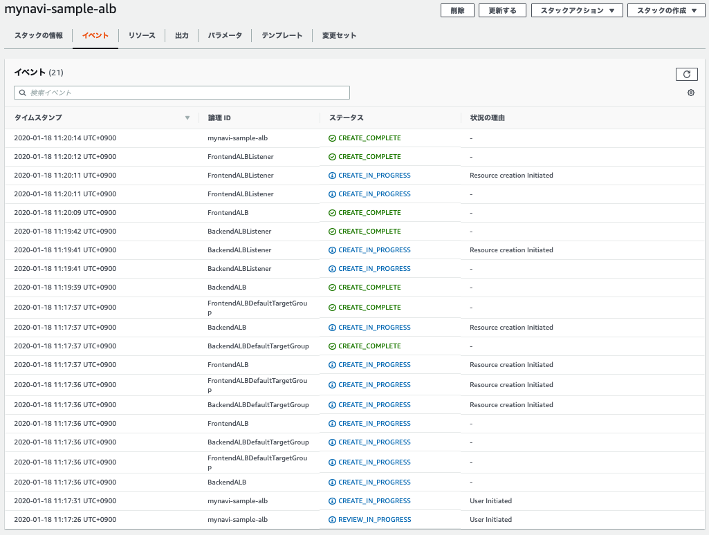
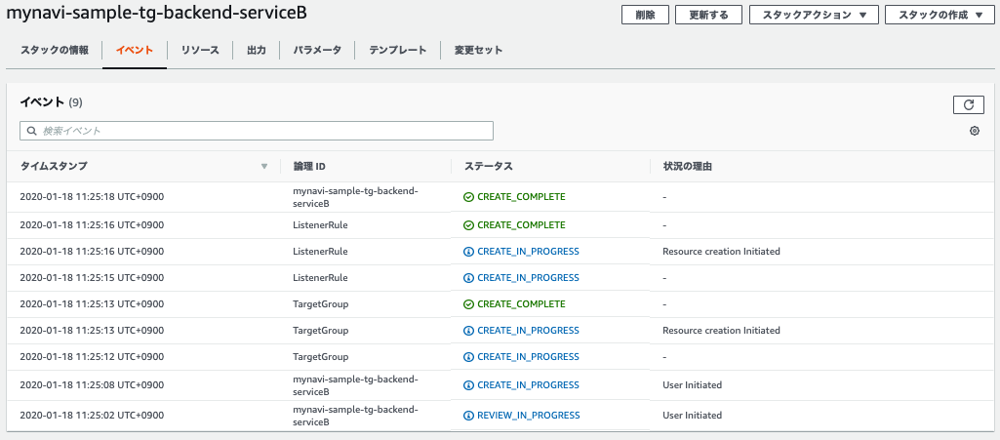

.. include:: ../module.txt

.. _section-automation-infra-devops-cloudformation-8-label:

基盤・デプロイ自動化実践
==================================================================

マイクロサービスアーキテクチャの基盤・デプロイ自動化
-------------------------------------------------------------------------------------------------------------------------------------

|br|

本連載では、以下のイメージの構成にあるAWSリソース基盤自動化環境の構築を実践しています。

|br|

.. figure:: img/automation_infra_devops_cloudformation/cloudformation-scope.png

|br|

前回は、各AWSリソースへ設定するセキュリティグループ、FrontendサブネットにアタッチするNATGatewayを構築するテンプレートを実装しました。
続く今回はFrontend、Backendサブネットに配置するアプリケーションロードバランサー(ALB)を構築するCloudFormationテンレプートを作成します。
実際のソースコードは `GitHub <https://github.com/debugroom/mynavi-sample-cloudformation>`_ 上にコミットしています。
ソースコード中で本質的でない記述を一部省略しているので、実行コードを作成する場合は、必要に応じて適宜GitHub上のソースコードも参照してください。

|br|

.. _section-cloudformation-alb-sample-label:

アプリケーションロードバランサー(ALB)スタック構築テンプレート
^^^^^^^^^^^^^^^^^^^^^^^^^^^^^^^^^^^^^^^^^^^^^^^^^^^^^^^^^^^^^^^^^^^^^^^^^^^^^^^^^^^^^^^^^^^^^^^^^^^^^^^^^^^^^^^

|br|

ALBは `クラウドネイティブ基本第5回 <https://news.mynavi.jp/itsearch/article/devsoft/4359>`_ で実施した要領で、FrontendサブネットとBackendサブネット双方に構築します。
CloudFormationで構築する場合、リソースタイプが、`AWS::ElasticLoadBalancingV2::LoadBalancer <https://docs.aws.amazon.com/ja_jp/AWSCloudFormation/latest/UserGuide/aws-resource-elasticloadbalancingv2-loadbalancer.html>`_
となるロードバランサー自体の定義と、リクエストフォワード先の対象となるターゲットグループ定義 `AWS::ElasticLoadBalancingV2::TargetGroup <https://docs.aws.amazon.com/ja_jp/AWSCloudFormation/latest/UserGuide/aws-resource-elasticloadbalancingv2-targetgroup.html>`_
リクエストを受け付けるリスナー定義 `AWS::ElasticLoadBalancingV2::Listener <https://docs.aws.amazon.com/ja_jp/AWSCloudFormation/latest/UserGuide/aws-resource-elasticloadbalancingv2-listener.html>`_ および
URLパスパターンに応じたルーティング定義などを行うルール `AWS::ElasticLoadBalancingV2::ListenerRule <https://docs.aws.amazon.com/ja_jp/AWSCloudFormation/latest/UserGuide/aws-resource-elasticloadbalancingv2-listenerrule.html>`_ の設定が必要になります。
プロパティとして設定可能な属性は、各リンク先の通りですが、実装するテンプレートを以下のように２つに分けて実装してみます。

* ベースとなるALBおよびデフォルトターゲットグループとリスナー定義
* サービスアプリケーションごとに追加するターゲットグループ、リスナールール定義

1つのテンプレートで、全ての定義をひとまとめにしておくのもシンプルで分かりやすくて良いですが、サービスアプリケーションを追加する必要が出てきた場合など、後者のリソース定義を再利用して追加対象だけを再実行すればよいテンプレート構成としておいた方が効率的です。
また、開発環境をEnvTypeとしてパラメータ化します。前者のテンプレートのサンプルは以下の通りです。

|br|

.. sourcecode:: none

   AWSTemplateFormatVersion: '2010-09-09'

   Mappings:                                                                #(A)※
     DeployEnvironmentMap:
       Production:
         "Protocol": "HTTPS"
         "Port": 443
       Staging:
         "Protocol": "HTTP"
         "Port": 80
       Dev:
         "Protocol": "HTTP"
         "Port": 80

   Parameters:

     // omit

     EnvType:                                                               #(B)
       Description: Which environments to deploy your service.
       Type: String
       AllowedValues: ["Dev", "Staging", "Production"]
       Default: Dev

     FrontendHealthCheckPath:                                               #(C)
       Description: Frontend WebApp health check path
       Type: String
       MinLength: 1
       MaxLength: 255
       AllowedPattern: ^[-¥.¥/a-zA-Z0-9]*$
       Default: /frontend/portal

     BackendDefaultHealthCheckPath:                                         #(D)
       Description: Backend Service Default health check path
       Type: String
       MinLength: 1
       MaxLength: 255
       AllowedPattern: ^[-¥.¥/a-zA-Z0-9]*$
       Default: /backend/api/v1/healthcheck

   Resources:
     FrontendALB:                                                           #(E)
       Type: AWS::ElasticLoadBalancingV2::LoadBalancer
       Properties:
         Name: FrontendALB
         Subnets:
           - Fn::ImportValue: !Sub ${VPCName}-PublicSubnet1
           - Fn::ImportValue: !Sub ${VPCName}-PublicSubnet2
         SecurityGroups:
           - Fn::ImportValue: !Sub ${VPCName}-SecurityGroupFrontendALB

     FrontendALBDefaultTargetGroup:                                         #(F)
       Type: AWS::ElasticLoadBalancingV2::TargetGroup
       Properties:
         Name: FrontendALBTargetGroup
         VpcId:
           Fn::ImportValue: !Sub ${VPCName}-VPCID
         Port: !FindInMap [DeployEnvironmentMap, !Ref EnvType, Port]        #(G)
         Protocol: !FindInMap [DeployEnvironmentMap, !Ref EnvType, Protocol]
         HealthCheckPath: !Ref FrontendHealthCheckPath
         HealthyThresholdCount: 2
         TargetGroupAttributes:
           - Key: deregistration_delay.timeout_seconds
             Value: '20'

     FrontendALBListener:                                                   #(H)
       Type: AWS::ElasticLoadBalancingV2::Listener
       Properties:
         LoadBalancerArn: !Ref FrontendALB
         Port: !FindInMap [DeployEnvironmentMap, !Ref EnvType, Port]
         Protocol: !FindInMap [DeployEnvironmentMap, !Ref EnvType, Protocol]
         DefaultActions:
           - Type: forward
             TargetGroupArn: !Ref FrontendALBDefaultTargetGroup

     BackendALB:                                                            #(I)
       Type: AWS::ElasticLoadBalancingV2::LoadBalancer
       Properties:
         Name: BackendALB
         Subnets:
           - Fn::ImportValue: !Sub ${VPCName}-PrivateSubnet1
           - Fn::ImportValue: !Sub ${VPCName}-PrivateSubnet2
         SecurityGroups:
           - Fn::ImportValue: !Sub ${VPCName}-SecurityGroupBackendALB

     BackendALBDefaultTargetGroup:                                          #(J)
       Type: AWS::ElasticLoadBalancingV2::TargetGroup
       Properties:
         Name: BackendALBDefaultTargetGroup
         VpcId:
           Fn::ImportValue: !Sub ${VPCName}-VPCID
         Port: !FindInMap [DeployEnvironmentMap, !Ref EnvType, Port]
         Protocol: !FindInMap [DeployEnvironmentMap, !Ref EnvType, Protocol]
         HealthCheckPath: !Ref BackendDefaultHealthCheckPath
         HealthyThresholdCount: 2
         TargetGroupAttributes:
           - Key: deregistration_delay.timeout_seconds
             Value: '20'

     BackendALBListener:                                                    #(K)
       Type: AWS::ElasticLoadBalancingV2::Listener
       Properties:
         LoadBalancerArn: !Ref BackendALB
         Port: !FindInMap [DeployEnvironmentMap, !Ref EnvType, Port]
         Protocol: !FindInMap [DeployEnvironmentMap, !Ref EnvType, Protocol]
         DefaultActions:
           - Type: forward
             TargetGroupArn: !Ref BackendALBDefaultTargetGroup

   Outputs:
     FrontendALB:                                                           #(L)
       Description: Frontend ALB
       Value: !Ref FrontendALB
       Export:
         Name: !Sub ${VPCName}-Frontend-ALB-${EnvType}

     BackendALB:                                                            #(M)
       Description: Backend ALB
       Value: !Ref BackendALB
       Export:
         Name: !Sub ${VPCName}-Backend-ALB-${EnvType}

     FrontendALBDNS:                                                        #(N)
       Description: Public DNS Name
       Value: !GetAtt FrontendALB.DNSName
       Export:
         Name: !Sub ${VPCName}-FrontendALBDNS-${EnvType}

     BackendALBDNS:                                                         #(O)
       Description: Private DNS Name
       Value: !GetAtt BackendALB.DNSName
       Export:
         Name: !Sub ${VPCName}-BackendALBDNS-${EnvType}

     FrontendALBDefaultTargetGroup:                                         #(P)
       Description: Frontend TagetGroup Default
       Value: !Ref FrontendALBDefaultTargetGroup
       Export:
         Name: !Sub ${VPCName}-Frontend-ALB-DefaultTargetGroup-${EnvType}

     BackendALBDefaultTargetGroup:                                          #(Q)
       Description: Backend TagetGroup Default
       Value: !Ref BackendALBDefaultTargetGroup
       Export:
         Name: !Sub ${VPCName}-Backend-ALB-DefaultTargetGroup-${EnvType}

     // omit

|br|

ALBのテンプレートの記述の基本となるポイントは(A)〜(Q)の通りです。

|br|

.. list-table:: ALBのCloudFormationテンプレート記述のポイント
   :widths: 1, 9

   * - 記述
     - 説明

   * - (A)
     - ALBでは通信で使うプロトコルを指定しますが、開発環境や商用環境でHTTP/HTTPSで分けて構成します。Mappings要素でそうした場合分けに応じてパラメータをまとめて定義しておくことで、見通しの良いテンプレート実装が可能です。なお、Mappingsの使用方法については下記の※で後述します。

   * - (B)
     - (A)で定義したMappingsで使用するパラメータを引数で切り替えるためのパラメータをEnvTypeとして定義しておきます。ここではAllowedValuesで、Mappingsのキーとしていた要素の入力のみを許可するパラメータ定義にしておきます。

   * - (C)
     - フロントエンドサブネットに配置するALBのデフォルトターゲットグループに設定するヘルスチェックパスをパラメータ定義します。AllowedPatternの正規表現で英数文字と記号「-(ハイフン)」、「.(ドット)」、「/(スラッシュ)」を含めた任意の文字列を許可するよう定義します。

   * - (D)
     - バックエンドエンドサブネットに配置するALBのデフォルトターゲットグループに設定するヘルスチェックパスをパラメータ定義します。AllowedPatternの正規表現で英数文字と記号「-(ハイフン)」、「.(ドット)」、「/(スラッシュ)」を含めた任意の文字列を許可するよう定義します。

   * - (E)
     - フロントエンドサブネットに配置するALBの定義を行います。詳細は `AWS::ElasticLoadBalancingV2::LoadBalancer <https://docs.aws.amazon.com/ja_jp/AWSCloudFormation/latest/UserGuide/aws-resource-elasticloadbalancingv2-loadbalancer.html>`_ を参考にして下さい。サブネットやセキュリティグループは前回設定したテンプレートからクロススタックリファレンスで参照します。

   * - (F)
     - フロントエンドサブネットALBのデフォルトターゲットグループの設定を行います。詳細は  `AWS::ElasticLoadBalancingV2::TargetGroup <https://docs.aws.amazon.com/ja_jp/AWSCloudFormation/latest/UserGuide/aws-resource-elasticloadbalancingv2-targetgroup.html>`_ も参照してください。URLパスに応じて、ALBは設定したEC2やECSにフォワードできますが、それらの集合はターゲットグループとしてまとめられています。デフォルトターゲットグループは条件に一致するパスが存在しなかったときにフォワードされるEC2ないしはECSアプリケーションのターゲットグループだと捉えてください。

   * - (G)
     - フロントエンドALBからターゲットグループへフォワードする際のポートやプロトコルを(A)で定義したMapping要素を使って取得するために、FindInMap関数を使って取得します。なお、関数の第2引数のみにかぎり、Ref参照が可能で、Parametersで指定したパラメータ引数に応じて、設定値を切り替えることができます。

   * - (H)
     - フロントエンドALBのリスナーを定義します。詳細は `AWS::ElasticLoadBalancingV2::Listener <https://docs.aws.amazon.com/ja_jp/AWSCloudFormation/latest/UserGuide/aws-resource-elasticloadbalancingv2-listener.html>`_ も参考にしてください。リスナーはALBに対するリクエストにおけるプロトコルやポート、フォワードするターゲットグループなどを決定します。なお、オプションとしてはフォワードの他に、リダイレクトやCoginitoやOpenIDConnectを使った認証処理などもあります。

   * - (I)
     - (E)と同様、バックエンドエンドサブネットに配置するALBの定義を行います。詳細は `AWS::ElasticLoadBalancingV2::LoadBalancer <https://docs.aws.amazon.com/ja_jp/AWSCloudFormation/latest/UserGuide/aws-resource-elasticloadbalancingv2-loadbalancer.html>`_ を参考にして下さい。サブネットやセキュリティグループは前回設定したテンプレートからクロススタックリファレンスで参照します。

   * - (J)
     - (F)と同様、バックエンドエンドサブネットALBのデフォルトターゲットグループの設定を行います。詳細は  `AWS::ElasticLoadBalancingV2::TargetGroup <https://docs.aws.amazon.com/ja_jp/AWSCloudFormation/latest/UserGuide/aws-resource-elasticloadbalancingv2-targetgroup.html>`_ も参照してください。URLパスに応じて、ALBは設定したEC2やECSにフォワードできますが、それらの集合はターゲットグループとしてまとめられています。デフォルトターゲットグループは条件に一致するパスが存在しなかったときにフォワードされるEC2ないしはECSアプリケーションのターゲットグループだと捉えてください。

   * - (K)
     - (H)と同様、バックエンドALBのリスナーを定義します。詳細は `AWS::ElasticLoadBalancingV2::Listener <https://docs.aws.amazon.com/ja_jp/AWSCloudFormation/latest/UserGuide/aws-resource-elasticloadbalancingv2-listener.html>`_ も参考にしてください。リスナーはALBに対するリクエストにおけるプロトコルやポート、フォワードするターゲットグループなどを決定します。なお、オプションとしてはフォワードの他に、リダイレクトやCoginitoやOpenIDConnectを使った認証処理などもあります。

   * - (L)
     - (E)で定義したフロントエンドALBをクロススタックリファレンスの(他のテンプレートに値を渡す)ために出力します。

   * - (M)
     - (I)で定義したバックエンドエンドALBをクロススタックリファレンスの(他のテンプレートに値を渡す)ために出力します。

   * - (N)
     - (E)で定義したフロントエンドALBのDNSをクロススタックリファレンスの(他のテンプレートに値を渡す)ために出力します。

   * - (O)
     - (I)で定義したバックエンドエンドALBのDNSをクロススタックリファレンスの(他のテンプレートに値を渡す)ために出力します。

   * - (N)
     - (F)で定義したフロントエンドALBのターゲットグループをクロススタックリファレンスの(他のテンプレートに値を渡す)ために出力します。

   * - (O)
     - (J)で定義したバックエンドエンドALBのターゲットグループをクロススタックリファレンスの(他のテンプレートに値を渡す)ために出力します。

|br|

.. note:: ※Mappingsについて

   Mappingsは単純な連想配列(キーバリュー型のマップ)ではなく、もう1階層の構造が加わった2次元連想配列です。下記の例のように、Mappingsでは複数の2次元連想配列構造を取り、各マップごとに、複数のキーで様々なキーバリューデータを取得できるようになっています。

   |br|

   .. sourcecode:: none

      Mappings:
        DeployEnvironmentMap:
          Production:
            "Protocol": "HTTPS"
            "Port": 443
          Staging:
            "Protocol": "HTTP"
            "Port": 80

      Parameters:
        EnvType:
          Description: Which environments to deploy your service.
          Type: String
          AllowedValues: ["Dev", "Staging", "Production"]
          Default: Dev

   |br|

   上記のデータを取得する際は、以下のようなFindInMap関数を使用します。ここで、ポイントとなるのは第2引数で、パラメータなどテンプレートの外から外部入力値に応じて、設定値を切り替えたい場合に効果を発揮します。

   |br|

   .. sourcecode:: none

      Port: !FindInMap [DeployEnvironmentMap, !Ref EnvType, Port]

   |br|

   上記の例では、第1引数で参照するマッピング定義を選択し、第2引数はパラメータEnvTypeを参照しています。EnvTypeはパラメータ要素に定義されている項目でデフォルトは"Dev"ですが、実行時に"Production"などの値を引数にしてテンプレート実行することで、第3引数として設定する値を容易に切り替えられる仕組みです。

|br|

作成したテンプレートに対して、ヘルパースクリプトを以下のように、スタック名とテンプレートパスを変更して実行します。パラメータはデフォルト値を利用するので省略します。

|br|

.. sourcecode:: bash

   #!/usr/bin/env bash

   stack_name="mynavi-sample-alb"
   template_path="sample-alb-cfn.yml"

   aws cloudformation deploy --stack-name ${stack_name} --template-file ${template_path} --capabilities CAPABILITY_IAM

|br|

実行が正常に終了すると、ALBおよびデフォルトターゲットグループ、リスナーが作成されます。

|br|

|br|

続いて、サービスアプリケーションごとに追加するターゲットグループとリスナールールのテンプレートを作成します。各サービスごとに追加すればよいので、パスパターンやヘルスチェックパス、条件適用のプライオリティ等、必要なパラメータをMappingsに定義します。
インプットパラメータに応じて、適用されるキーバリューデータが変わるように実装します。加えて、フロントエンド、バックエンドへいずれかに配置するのもオプションで選べるように作成します。

|br|

.. sourcecode:: none

   AWSTemplateFormatVersion: '2010-09-09'

   Mappings:
     TargetGroupDefinitionMap:                                              #(A)
       FrontendWebApp:
         "PathPattern": "/frontend/*"
         "HealthCheckPath": "/frontend/healthcheck"
         "Priority": 1
       BackendUserService:
         "PathPattern": "/backend/user*"
         "HealthCheckPath": "/backend/api/v1/healthcheck"
         "Priority": 1
       BackendSampleService:
         "PathPattern": "/backend/sample*"
         "HealthCheckPath": "/backend/api/v1/healthcheck"
         "Priority": 2
     DeployEnvironmentMap:                                                  #(B)
       Production:
         "Protocol": "HTTPS"
         "Port": 443
       Staging:
         "Protocol": "HTTP"
         "Port": 80
       Dev:
         "Protocol": "HTTP"
         "Port": 80

   Parameters:

     // omit
     SubnetType:                                                            #(C)
       Description: Which subnet to deploy your service.
       Type: String
       AllowedValues: ["Frontend", "Backend"]
       Default: Backend
     EnvType:                                                               #(D)
       Description: Which environments to deploy your service.
       Type: String
       AllowedValues: ["Dev", "Staging", "Production"]
       Default: Dev
     ServiceName:                                                           #(E)
       Description: Deploy service name
       Type: String
       MinLength: 1
       MaxLength: 255
       AllowedPattern: ^[a-zA-Z][-a-zA-Z0-9]*$
       Default: BackendUserService

   Resources:
     TargetGroup:                                                           #(F)
       Type: AWS::ElasticLoadBalancingV2::TargetGroup
       Properties:
         Name: !Sub ${EnvType}-${ServiceName}-tg
         VpcId:
           Fn::ImportValue: !Sub ${VPCName}-VPCID
         Port: !FindInMap [DeployEnvironmentMap, !Ref EnvType, Port]
         Protocol: !FindInMap [DeployEnvironmentMap, !Ref EnvType, Protocol]
         HealthCheckPath: !FindInMap [TargetGroupDefinitionMap, !Ref ServiceName, HealthCheckPath]
         HealthyThresholdCount: 2
         TargetGroupAttributes:
           - Key: deregistration_delay.timeout_seconds
             Value: '20'

     ListenerRule:                                                          #(G)
       Type: AWS::ElasticLoadBalancingV2::ListenerRule
       Properties:
         Actions:
           - Type: forward
             TargetGroupArn: !Ref TargetGroup
         Conditions:
           - Field: path-pattern
             PathPatternConfig:
               Values:
                 - !FindInMap [TargetGroupDefinitionMap, !Ref ServiceName, PathPattern]
         ListenerArn:
           Fn::ImportValue: !Sub ${VPCName}-${SubnetType}-ALB-Listener-${EnvType}
         Priority: !FindInMap [TargetGroupDefinitionMap, !Ref ServiceName, Priority]

   Outputs:                                                                 #(H)
     TargetGroup:
       Description: TargetGroup Service
       Value: !Ref TargetGroup
       Export:
         Name: !Sub ${VPCName}-${SubnetType}-${ServiceName}-TargetGroup-${EnvType}
         
|br|

.. list-table:: サービスアプリケーションごとにALBへターゲットグループとして追加するリソースのCloudFormationテンプレート記述のポイント
   :widths: 1, 9

   * - 記述
     - 説明

   * - (A)
     - フロントエンドに配置するWebアプリケーションやバックエンドサービスごとにフォワード先を決定するパスパターンや、ヘルスチェックパス、パスマッチングのプライオリティをMappingsで定義します。

   * - (B)
     - ベースとなるALBの定義と同様、デプロイ環境に応じてプロトコルやポートをMappingsで定義します。

   * - (C)
     - ターゲットグループやリスナーを設定するALBがあるサブネットをパラメータとして設定できるよう、Parameters要素に定義します。

   * - (D)
     - ベースとなるALBの定義と同様、開発環境や商用環境でHTTP/HTTPSにするか入力パラメータで切り替えるために、Parameters要素に定義します。

   * - (E)
     - 入力パラメータに応じて、(A)で定義した設定値を切り替えれるように、Parameters要素に定義します。

   * - (F)
     - 追加するターゲットグループを定義します。詳細は  `AWS::ElasticLoadBalancingV2::TargetGroup <https://docs.aws.amazon.com/ja_jp/AWSCloudFormation/latest/UserGuide/aws-resource-elasticloadbalancingv2-targetgroup.html>`_ も参照してください。なお、定義はFindInMap関数で入力パラメータに応じて動的に切り替えて設定されます。

   * - (G)
     - URLパスパターンやフォワードのルール定義を行います。詳細は、 `AWS::ElasticLoadBalancingV2::ListenerRule <https://docs.aws.amazon.com/ja_jp/AWSCloudFormation/latest/UserGuide/aws-resource-elasticloadbalancingv2-listenerrule.html>`_ を参照してください。なお、定義はFindInMap関数で入力パラメータに応じて動的に切り替えて設定されます。

   * - (H)
     - (F)で定義したターゲットグループをクロススタックリファレンスの(他のテンプレートに値を渡す)ために出力します。

|br|

作成したテンプレートに対して、ヘルパースクリプトを以下のように、スタック名とテンプレートパスを変更して実行します。

|br|

.. sourcecode:: bash

   #!/usr/bin/env bash

   stack_name="mynavi-sample-tg-userservice"
   template_path="sample-tg-cfn.yml"
   parameters="SubnetType=Backend EnvType=Dev ServiceName=BackendUserService"

   aws cloudformation deploy --stack-name ${stack_name} --template-file ${template_path} --parameter-overrides ${parameters} --capabilities CAPABILITY_IAM

|br|

実行が正常に終了すると、ターゲットグループ、リスナールールが作成されます。作成するアプリケーション、サービスに応じて、サブネットやサービス名を変更して複数回パラメータを変えて実行します。

|br|

|br|

今回はMappings要素を使いながら、ALBおよびサービスアプリケーションごとのターゲットグループ、リスナーをCloudFormationテンプレートで構築しました。次回は、RDSを構築するスタックテンプレートを作成します。

|br|

著者紹介
------------------------------------------------------------------

川畑 光平(KAWABATA Kohei) - NTTデータ 課長代理

.. figure:: img/automation_infra_devops_overview/pic_image01.jpg

金融機関システム業務アプリケーション開発・システム基盤担当を経て、現在はソフトウェア開発自動化関連の研究開発・推進に従事。

Red Hat Certified Engineer、Pivotal Certified Spring Professional、AWS Certified Solutions Architect Professional等の資格を持ち、アプリケーション基盤・クラウドなど様々な開発プロジェクト支援にも携わる。

`2019 APN AWS Top Engineers & Ambassadors <https://aws.amazon.com/jp/blogs/psa/japan-apn-ambassador-2019/>`_ 選出。
