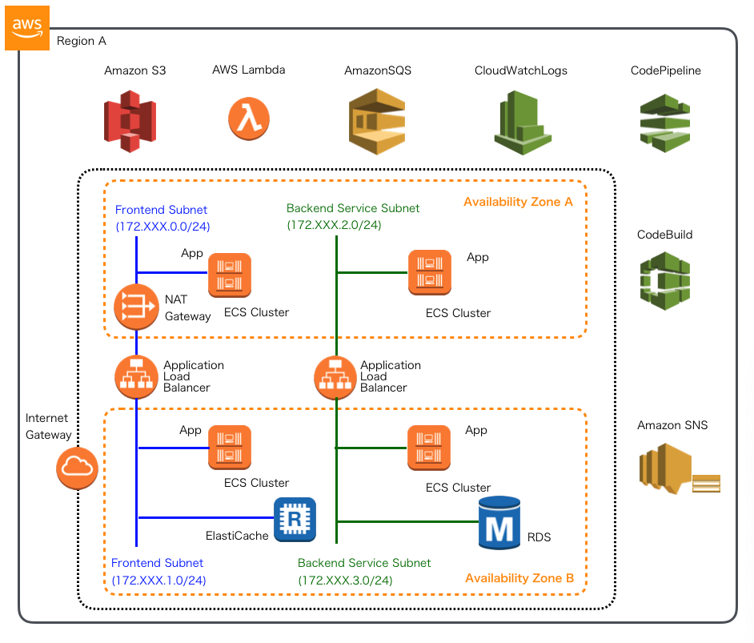
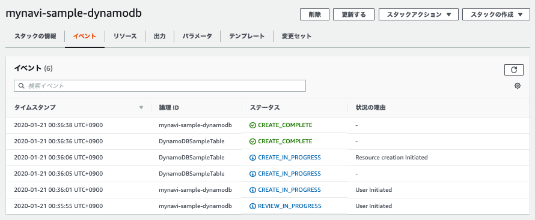

.. include:: ../module.txt

.. _section-automation-infra-devops-cloudformation-10-label:

【第30回】AWS CloudFormationを用いた基盤自動化(10)DynamoDBの構築
-------------------------------------------------------------------------------------------------------------------------------------

|br|

本連載では、以下のイメージの構成にあるAWSリソース基盤自動化環境の構築を実践しています。

|br|

|br|

前回は、バックエンドサブネットからのアクセスを想定したRDS(RelationalDatabaseService)を構築するCloudFormationテンプレートを実装しました。
続く今回はDynamoDBを構築するテンプレートを作成します。実際のソースコードは `GitHub <https://github.com/debugroom/mynavi-sample-cloudformation>`_ 上にコミットしています。
ソースコード中で本質的でない記述を一部省略しているので、実行コードを作成する場合は、必要に応じて適宜GitHub上のソースコードも参照してください。

|br|

.. _section-cloudformation-dynamodb-sample-label:

DynamoDBスタック構築テンプレート
^^^^^^^^^^^^^^^^^^^^^^^^^^^^^^^^^^^^^^^^^^^^^^^^^^^^^^^^^^^^^^^^^^^^^^^^^^^^^^^^^^^^^^^^^^^^^^^^^^^^^^^^^^^^^^^

|br|

DynamoDBは `クラウドネイティブ基本第16回 <https://news.mynavi.jp/itsearch/article/devsoft/4498>`_ で実施した要領と同等のものを構築します。
CloudFormationで構築する場合、リソースタイプが、 `AWS::DynamoDB::Table <https://docs.aws.amazon.com/ja_jp/AWSCloudFormation/latest/UserGuide/aws-resource-dynamodb-table.html>`_
となるテーブル定義のみを作成すれば良いです。プロパティとして設定可能な属性は、各リンク先の通りですが、加えて、Conditions要素を使って、DynamoDBを商用環境、ステージング環境、開発環境という3つのパターンに分けて作成するようにします。
前回のRDSでは、Conditionsを定義した上で、Resources配下にCondition要素を設定することにより、各パターンごとに切り替えて作成しましたが、今回はConditions定義と条件関数を使って、作成するリソースを切り替える形で実装してみます。
テンプレートのサンプルは以下の通りです。

|br|

.. sourcecode:: none

   AWSTemplateFormatVersion: '2010-09-09'

   // omit

   Parameters:
     // omit
     EnvType:                                                                                                                          #(A)
       Description: Which environments to deploy your service.
       Type: String
       AllowedValues: ["Dev", "Staging", "Production"]
       Default: Dev
   Conditions:                                                                                                                         #(B)
     ProductionResources: {"Fn::Equals" : [{"Ref":"EnvType"}, "Production"]}
     StagingResources: !Equals [ !Ref EnvType, "Staging"]
     DevResources: {"Fn::Equals" : [{"Ref":"EnvType"}, "Dev"]}

   Resources:
     DynamoDBSampleTable:                                                                                                              #(C)
       Type: AWS::DynamoDB::Table
       Properties:
         TableName: !If ["ProductionResources", "sample-table",  !If ["StagingResources", "staging_sample-table", "dev_sample-table"]] #(D)
         BillingMode: PROVISIONED
         SSESpecification: !If ["ProductionResources", { "SSEEnabled" : true }, !Ref "AWS::NoValue"]                                   #(E)
         AttributeDefinitions:
           - AttributeName: samplePartitionKey
             AttributeType: S
           - AttributeName: sampleSortKey
             AttributeType: S
         KeySchema:
           - AttributeName: samplePartitionKey
             KeyType: HASH
           - AttributeName: sampleSortKey
             KeyType: RANGE
         ProvisionedThroughput:
           ReadCapacityUnits: 5
           WriteCapacityUnits: 5

   Outputs:
     EnvironmentRegion:                                                                                                                #(F)
       Description: Dev Environment Region
       Value: !Sub ${AWS::Region}
       Export:
         Name: !Sub MynaviSampleDynamoDB-${EnvType}-Region
     DynamoDBServiceEndpoint:                                                                                                          #(G)
       Description: DynamoDB service endipoint
       Value: !Sub https://dynamodb.${AWS::Region}.amazonaws.com
       Export:
         Name: !Sub MynaviSampleDynamoDB-${EnvType}-ServiceEndpoint
     DynamoDBProduction:                                                                                                               #(H)
       Condition: "ProductionResources"                                                                                                #(I)
       Description: DynamoDB SampleTable for Production
       Value: !Ref DynamoDBSampleTable
       Export:
         Name: !Sub ${VPCName}-DynamoDBProductionSampleTable
     DynamoDBTableStaging:                                                                                                             #(J)
       Condition: "StagingResources"
       Description: DynamoDB SampleTable for Staging
       Value: !Ref DynamoDBSampleTable
       Export:
         Name: !Sub ${VPCName}-DynamoDBStagingSampleTable

    // omit

|br|

DynamoDBのテンプレートの記述の基本となるポイントは(A)〜(J)の通りです。

|br|

.. list-table:: DynamoDBのCloudFormationテンプレート記述のポイント
   :widths: 1, 9

   * - 記述
     - 説明

   * - (A)
     - DynamoDBを商用環境、ステージング環境、開発環境用に分けるよう、EnvTypeパラメータとして指定可能にします。このパラメータに応じて、Conditionsを設定し、作成するリソースを切り替えます。

   * - (B)
     - Conditionsとして、EnvTypeパラメータの値に応じて、３つの論理名を定義します。定義方法の詳細は :ref:`section-cloudformation-rds-sample-label` と同様なので適宜参照してください。

   * - (C)
     - DynamoDBテーブルのリソース定義を行います。定義するプロパティの詳細は `AWS::DynamoDB::Table <https://docs.aws.amazon.com/ja_jp/AWSCloudFormation/latest/UserGuide/aws-resource-dynamodb-table.html>`_ を参照してください。

   * - (D)
     - DynamoDBはリージョンサービスのため、同一リージョンで同じ識別子をもつテーブルを作成することはできません。各環境に応じて、条件関数を使って識別子を変更して作成します。条件関数の詳細は、 `AWS公式 条件関数 <https://docs.aws.amazon.com/ja_jp/AWSCloudFormation/latest/UserGuide/intrinsic-function-reference-conditions.html>`_ も参照してください。ここでは、"Fn::If"を2回組み合わせて、3つのパラメータの値に応じてテーブル名を切り替えています。

   * - (E)
     - SSESpecificationは、テーブルの暗号化オプションでConditionが"ProductionResources"の場合のみ、有効化されるように設定します。擬似パラメータ※"AWS::NoValue"関数を使用することにより、このパラメータが有効になると対応するリソースプロパティは削除されます。

   * - (F)
     - DynamoDBを構築するリージョンを出力します。

   * - (G)
     - DynamoDBのサービスエンドポイントを出力します。

   * - (H)
     - DynamoDBのテーブル名を出力します。

   * - (I)
     - 前回と同様、Conditionsの論理名が"ProductionResources"だった場合に、リソース定義が有効化するよう、Condition要素を定義します。

   * - (I)
     - 前回と同様、Conditionsの論理名が"StagingResources"だった場合に、リソース定義が有効化するよう、Condition要素を定義します。

|br|

.. warning:: Conditionプロパティと条件関数の使い分け

   前回のテンプレートで実装した、Conditionプロパティを用いて有効化された条件によりリソースの生成を切り替える方法と、今回のように条件関数を使う方法は、いずれもConditionsで記載した条件によって生成するリソース定義を切り替えるものですが、双方メリットデメリットがあります。
   前者のConditionプロパティによる切り替えは、シンプルでわかりやすいメリットがある反面、重複した定義が比較的多く出現するデメリットがあります。後者の条件関数による方法は最小限の記述でリソース定義を切り替えることが可能ですが、
   条件の数が多くなってくるとテンプレートに記述する条件式が複雑になり可読性が低下します。適宜状況に応じて、使い分けるようにしましょう。なお、2019年の7月から、複数のプログラム言語でCloudFomationテンプレートを生成する
   AWS クラウド開発キット(AWS CDK)がGA(Generally Available)となっています。条件に応じた複雑な記述はこうしたツールキットを用いた方がより高い可読性を得られます。AWS CDKの使用は別の機会で触れられればと思います。

|br|

.. note:: ※擬似パラメータについて

   擬似パラメータはCloudFormationであらかじめ定義されたパラメータ群で"!Ref"により参照が可能です。以下のようなパラメータが事前定義されています。詳細は `AWS公式 擬似パラメータ参照 <https://docs.aws.amazon.com/ja_jp/AWSCloudFormation/latest/UserGuide/pseudo-parameter-reference.html>`_ も参照してください。

   |br|

   .. list-table:: 擬似パラメータ参照で利用可能なパラメータ一覧
      :widths: 3, 7

      * - パラメータ
        - 説明

      * - AWS::Region
        - リージョン名を取得します。

      * - AWS::StackId
        - スタックIDを取得します

      * - AWS::StackName
        - スタック名を取得します

      * - AWS::AccountId
        - AWSアカウントIDを取得します

      * - AWS::NotificationARNs
        - notification Amazon Resource Namesを取得します

      * - AWS::NoValue
        - 指定したリソースプロパティを削除した形でテンプレートを実行します

      * - AWS::Partition
        - リソースが存在するパーティションを返します。標準のAWSリージョンの場合、パーティションは"aws"です。

      * - AWS::URLSuffix
        - ドメインのサフィックスを返します。標準のAWSリージョンの場合、サフィックスは"amazonaws.com"です。

|br|

作成したテンプレートに対して、ヘルパースクリプトを以下のように、スタック名とテンプレートパスを変更して実行します。

|br|

.. sourcecode:: bash

   #!/usr/bin/env bash

   stack_name="mynavi-sample-dynamodb"
   template_path="sample-dynamodb-cfn.yml"

   parameters="EnvType=Production"

   aws cloudformation deploy --stack-name ${stack_name} --template-file ${template_path} --parameter-overrides ${parameters} --capabilities CAPABILITY_IAM

|br|

実行が正常に終了すると、DynamoDBが作成されます。

|br|

|br|

今回はConditions要素や条件関数、擬似パラメータ参照を使いながら、DynamoDBを構築するCloudFormationテンプレートを実装しました。次回は、ElastiCacheを構築するテンプレートを作成します。

|br|

著者紹介
^^^^^^^^^^^^^^^^^^^^^^^^^^^^^^^^^^^^^^^^^^^^^^^^^^^^^^^^^^^^^^^^^^^^^^^^^^^^^^^^^^^^^^^^^^^^^^^^^^^^^^^^^^^^^^^

川畑 光平(KAWABATA Kohei) - NTTデータ 課長代理

.. figure:: img/automation_infra_devops_overview/pic_image01.jpg

金融機関システム業務アプリケーション開発・システム基盤担当を経て、現在はソフトウェア開発自動化関連の研究開発・推進に従事。

Red Hat Certified Engineer、Pivotal Certified Spring Professional、AWS Certified Solutions Architect Professional等の資格を持ち、アプリケーション基盤・クラウドなど様々な開発プロジェクト支援にも携わる。

`2019 APN AWS Top Engineers & Ambassadors <https://aws.amazon.com/jp/blogs/psa/japan-apn-ambassador-2019/>`_ 選出。
