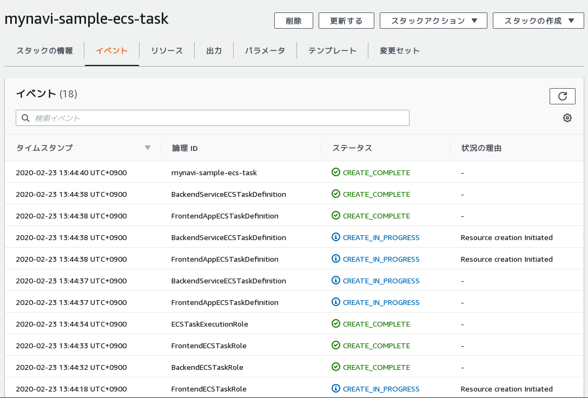

.. include:: ../module.txt

.. _section-automation-infra-devops-cloudformation-17-label:

【第37回】AWS CloudFormationを用いた基盤自動化(17)ECSタスク定義の構築
-------------------------------------------------------------------------------------------------------------------------------------

|br|

本連載では、以下のイメージの構成にあるAWSリソース基盤自動化環境の構築を実践しています。

|br|

.. figure:: img/automation_infra_devops_cloudformation/cloudformation-scope.png

|br|

前回は、ECSクラスタを構築するCloudFormationテンプレートを実装しました。今回はECSタスク定義を行うCloudFormationテンプレートを作成し実行していきます。
実際のソースコードは `GitHub <https://github.com/debugroom/mynavi-sample-cloudformation>`_ 上にコミットしています。
ソースコード中で本質的でない記述を一部省略しているので、実行コードを作成する場合は、必要に応じて適宜GitHub上のソースコードも参照してください。

.. _section-cloudformation-ecs-task-sample-label:

ECSタスク定義スタック構築テンプレート
^^^^^^^^^^^^^^^^^^^^^^^^^^^^^^^^^^^^^^^^^^^^^^^^^^^^^^^^^^^^^^^^^^^^^^^^^^^^^^^^^^^^^^^^^^^^^^^^^^^^^^^^^^^^^^^

|br|

ECSタスク定義は `クラウドネイティブ基本第9回 <https://news.mynavi.jp/itsearch/article/devsoft/4408>`_ で実施した要領と同等のものを構築します。
ECSタスクをCloudFormationで構築する場合、リソースタイプが、 `AWS::ECS::TaskDefinition <https://docs.aws.amazon.com/ja_jp/AWSCloudFormation/latest/UserGuide/aws-resource-ecs-taskdefinition.html>`_
、ECSタスクの実行に必要なIAMロール `AWS::IAM::Role <https://docs.aws.amazon.com/ja_jp/AWSCloudFormation/latest/UserGuide/aws-resource-iam-role.html>`_ および、
ECSコンテナの中で実行されるアプリケーションに付与する必要があるIAMロール `AWS::IAM::Role <https://docs.aws.amazon.com/ja_jp/AWSCloudFormation/latest/UserGuide/aws-resource-iam-role.html>`_ が必要です。
プロパティとして設定可能な属性は、上記リンク先の通りですが、加えて、ECSを商用環境、ステージング環境、開発環境という3つのパターンに分けて作成するようにします。

テンプレートのサンプルは以下の通りです。

|br|

.. sourcecode:: none

   AWSTemplateFormatVersion: '2010-09-09'

   // omit

   Parameters:
     EnvType:
       Description: Which environments to deploy your service.
       Type: String
       AllowedValues: ["Dev", "Staging", "Production"]
       Default: Dev

   Mappings:
     BackendServiceTaskDefinitionMap:                                                                 #(A)
       Production:
         "Memory" : 1024
         "Cpu" : 512
         "ContainerName" : "mynavi-sample-cloudformation-ecs-backend-service"
         "ContainerImage" : "debugroom/mynavi-sample-cloudformation-ecs-backend-service:1.0-RELEASE"  #(B)
         "ContainerPort" : 8080
         "HostPort" : 0
         "ContainerMemory" : 1024
         "Profile" : "production"
       Staging:
         "Memory" : 1024
         "Cpu" : 512
         "ContainerName" : "mynavi-sample-cloudformation-ecs-backend-service"
         "ContainerImage" : "debugroom/mynavi-sample-cloudformation-ecs-backend-service:1.0-SNAPSHOT"
         "ContainerPort" : 8080
         "HostPort" : 0
         "ContainerMemory" : 1024
         "Profile" : "staging"
    // omit

   Resources:
     BackendECSTaskRole:                                                                              #(C)
       Type: AWS::IAM::Role
       Properties:
         Path: /
         AssumeRolePolicyDocument:
           Statement:
             - Action: sts:AssumeRole
               Effect: Allow
               Principal:
                 Service: ecs-tasks.amazonaws.com

     // omit

     ECSTaskExecutionRole:                                                                            #(D)
       Type: AWS::IAM::Role
       Properties:
         Path: /
         AssumeRolePolicyDocument:
           Statement:
             - Action: sts:AssumeRole
               Effect: Allow
               Principal:
                 Service: ecs-tasks.amazonaws.com
         ManagedPolicyArns:                                                                           #(E)
           - arn:aws:iam::aws:policy/service-role/AmazonECSTaskExecutionRolePolicy
           - arn:aws:iam::aws:policy/AmazonSSMReadOnlyAccess
           - arn:aws:iam::aws:policy/SecretsManagerReadWrite

     BackendServiceECSTaskDefinition:
       Type: AWS::ECS::TaskDefinition                                                                 #(F)
       Properties:
         Family: !Sub sample-ecstask-backend-service-${EnvType}
         RequiresCompatibilities:
           - EC2
         Memory: !FindInMap [BackendServiceTaskDefinitionMap, !Ref EnvType, Memory]
         Cpu: !FindInMap [BackendServiceTaskDefinitionMap, !Ref EnvType, Cpu]
         NetworkMode: bridge
         ExecutionRoleArn: !GetAtt ECSTaskExecutionRole.Arn
         TaskRoleArn: !GetAtt BackendECSTaskRole.Arn
         ContainerDefinitions:
           - Name: !FindInMap [BackendServiceTaskDefinitionMap, !Ref EnvType, ContainerName]
             Image: !FindInMap [BackendServiceTaskDefinitionMap, !Ref EnvType, ContainerImage]
             PortMappings:
               - ContainerPort: !FindInMap [BackendServiceTaskDefinitionMap, !Ref EnvType, ContainerPort]
                 HostPort: !FindInMap [BackendServiceTaskDefinitionMap, !Ref EnvType, HostPort]
             Memory: !FindInMap [BackendServiceTaskDefinitionMap, !Ref EnvType, ContainerMemory]
             Environment:                                                                             #(G)
               - Name: ENV_TYPE
                 Value: !FindInMap [BackendServiceTaskDefinitionMap, !Ref EnvType, Profile]
             Secrets:                                                                                 #(H)
               - Name: RDS_PASSWORD
                 ValueFrom : !Sub "arn:aws:ssm:${AWS::Region}:${AWS::AccountId}:parameter/mynavi-sample-cloudformation-rds-password"

   // omit

   Outputs:
   // omit

     FrontendECSTaskRole:                                                                             #(I)
       Description: Frontend ECS Task has role
       Value: !Ref FrontendECSTaskRole
       Export:
         Name: !Sub ${VPCName}-FrontendEcsTaskRole-${EnvType}

     BackendECSTaskRole:
       Description: Backend ECS Task has role
       Value: !Ref BackendECSTaskRole
       Export:
         Name: !Sub ${VPCName}-BackendEcsTaskRole-${EnvType}

|br|

ECSタスク定義のテンプレートの記述の基本となるポイントは(A)〜(I)の通りです。

|br|

.. list-table:: ECSタスク定義のCloudFormationテンプレート記述のポイント
   :widths: 1, 9

   * - 記述
     - 説明

   * - (A)
     - パラメータEnvTypeに応じて、Backend Serviceアプリケーションのタスク定義に適用するパラメータ値を変更するよう、Mappings要素を定義します。省略していますが、Mapはアプリケーションの単位で作成します。

   * - (B)
     - コンテナイメージでは、DockerHub上にプッシュすることを前提としたURIを定義しておきます。

   * - (C)
     - ECSコンテナで実行するアプリケーションが利用するAWSサービスへのアクセス許可を付与するIAMロールを定義します。詳細は `AWS::IAM::Role <https://docs.aws.amazon.com/ja_jp/AWSCloudFormation/latest/UserGuide/aws-resource-iam-role.html>`_ を参照してください。個々のサービスアクセスポリシーは次回解説しますが、ここではロールのみを定義するかたちとします。

   * - (D)
     - ECSタスク実行するために必要なIAMロールを定義します。詳細は `AWS::IAM::Role <https://docs.aws.amazon.com/ja_jp/AWSCloudFormation/latest/UserGuide/aws-resource-iam-role.html>`_ を参照してください。

   * - (E)
     - ECSタスク実行に必要なポリシーはAmazonECSTaskExecutionRolePolicyになりますが、タスク定義の中でSystems Manager Parameter StoreやSecret Managerへのアクセスが発生するため、必要なアクセスポリシーをアタッチします。

   * - (F)
     - ECSタスク定義を定義します。詳細は  `AWS::ECS::TaskDefinition <https://docs.aws.amazon.com/ja_jp/AWSCloudFormation/latest/UserGuide/aws-resource-ecs-taskdefinition.html>`_ を参照してください。

   * - (G)
     - コンテナイメージに環境変数を設定します。FindInMap関数を用いて、作成する環境に応じてパラメータを切り替えます。

   * - (H)
     - Systems Manager Parameter Storeからセキュア文字列を取得し設定します。ここで設定した環境変数はAWSコンソール上からも参照できないため、パスワードなどの秘匿性のあるデータはSecretsプロパティを使って設定してください。
       記載形式の詳細は `AWS公式開発者ガイド 機密データの指定 <https://docs.aws.amazon.com/ja_jp/AWSCloudFormation/latest/UserGuide/aws-properties-ecs-taskdefinition-secret.html>`_ も参照してください。

|br|

作成したテンプレートに対して、ヘルパースクリプトを以下のように、スタック名とテンプレートパスを変更して実行します。

|br|

.. sourcecode:: bash

   #!/usr/bin/env bash

   stack_name="mynavi-sample-ecs-task"
   template_path="sample-ecs-task-cfn.yml"

   parameters="EnvType=Dev"

   aws cloudformation deploy --stack-name ${stack_name} --template-file ${template_path} --parameter-overrides ${parameters} --capabilities CAPABILITY_IAM

|br|

実行が正常に終了すると、ECSタスクが作成されます。

|br|

|br|

今回はECSタスクを構築するCloudFormationテンプレートを実装しました。次回は、ECSタスクのIAMロールににAWSリソースへのアクセスポリシーを付与するCloudFormationテンプレートを作成する手順を紹介します。

|br|

著者紹介
^^^^^^^^^^^^^^^^^^^^^^^^^^^^^^^^^^^^^^^^^^^^^^^^^^^^^^^^^^^^^^^^^^^^^^^^^^^^^^^^^^^^^^^^^^^^^^^^^^^^^^^^^^^^^^^

川畑 光平(KAWABATA Kohei) - NTTデータ 課長代理

.. figure:: img/automation_infra_devops_overview/pic_image01.jpg

金融機関システム業務アプリケーション開発・システム基盤担当を経て、現在はソフトウェア開発自動化関連の研究開発・推進に従事。

Red Hat Certified Engineer、Pivotal Certified Spring Professional、AWS Certified Solutions Architect Professional等の資格を持ち、アプリケーション基盤・クラウドなど様々な開発プロジェクト支援にも携わる。

`2019 APN AWS Top Engineers & Ambassadors <https://aws.amazon.com/jp/blogs/psa/japan-apn-ambassador-2019/>`_ 選出。
