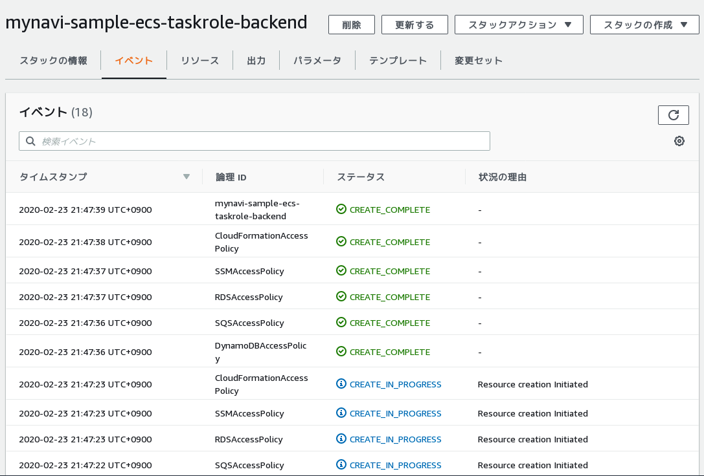
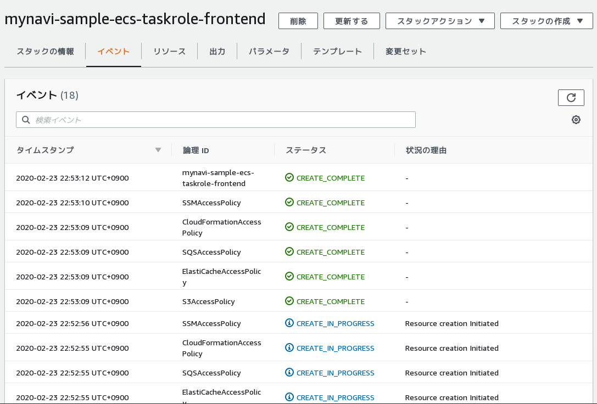

.. include:: ../module.txt

.. _section-automation-infra-devops-cloudformation-18-label:

基盤・デプロイ自動化実践
==================================================================

マイクロサービスアーキテクチャの基盤・デプロイ自動化
-------------------------------------------------------------------------------------------------------------------------------------

|br|

本連載では、以下のイメージの構成にあるAWSリソース基盤自動化環境の構築を実践しています。

|br|

.. figure:: img/automation_infra_devops_cloudformation/cloudformation-scope.png

|br|

前回は、ECSタスク定義を行うCloudFormationテンプレートを実装しました。今回はタスク定義したコンテナで実行されるアプリケーションが使用するAWSリソースへのアクセスポリシーを定義し、前回作成したECSタスクのIAMロールへアタッチするCloudFormationテンプレートを作成します。
実際のソースコードは `GitHub <https://github.com/debugroom/mynavi-sample-cloudformation>`_ 上にコミットしています。
ソースコード中で本質的でない記述を一部省略しているので、実行コードを作成する場合は、必要に応じて適宜GitHub上のソースコードも参照してください。

|br|

.. _section-cloudformation-ecs-task-role-sample-label:

ECSタスクロール定義スタック構築テンプレート
^^^^^^^^^^^^^^^^^^^^^^^^^^^^^^^^^^^^^^^^^^^^^^^^^^^^^^^^^^^^^^^^^^^^^^^^^^^^^^^^^^^^^^^^^^^^^^^^^^^^^^^^^^^^^^^

|br|

:ref:`section-cloudformation-spring-cloud-aws-support-label` でも述べた通り、実装してきたアプリケーションでは以下のようにAWSリソースを利用しています。

* ALBを経由したバックエンドサービスの呼び出し(ALBのDNSをRestTemplateに指定)
* エンドポイントを指定したRDSアクセス
* サービスエンドポイントを指定したDynamoDBアクセス
* エンドポイントを指定したElastiCacheアクセス
* S3バケットへのアクセス
* サービスエンドポイントを指定したSQSへのキュー送信、ポーリングによる取得

Backend ServiceアプリケーションおよびFrontend Webアプリケーションがそれぞれ参照するAWSリソースは以下の通りです。

|br|

.. list-table::
   :widths: 5, 5, 5

   * - AWSリソース
     - Frontend WebApp
     - Backend Service

   * - ALB
     - ○
     -

   * - RDS
     -
     - ○

   * - DynamoDB
     -
     - ○

   * - ElastiCache
     - ○
     -

   * - S3
     - ○
     -

   * - SQS
     - ○(キュー送信)
     - ○(キュー受信)

|br|

ECSタスクのIAMロール定義は前回作成していますが、Backend Service、Frontend Webアプリケーションそれぞれで使用するAWSリソースのアクセスポリシーを割り当てねばなりません。
アクセスするリソースはアプリケーションごとに異なり、変更されることも多いので、ECSタスク定義とは別に各サービスごとにテンプレートを分けて実装しておくことにします。
また、ALBのようにHTTPリクエスト送信でアクセスするため、リソース定義が不要なものもありますが、一方、CloudFormationやSystem Manager Parameter Storeなど今回テンプレートの実装の中でアクセスするサービスも加わります。

アクセスポリシーをCloudFormationで構築する場合、リソースタイプが、 `AWS::IAM::Policy <https://docs.aws.amazon.com/ja_jp/AWSCloudFormation/latest/UserGuide/aws-resource-iam-policy.html>`_
を定義する必要がありますが、各AWSリソースごとに定義する内容は異なります。プロパティとして設定可能な属性は、上記リンク先の通りですが、加えて、ポリシー定義を商用環境、ステージング環境、開発環境という3つのパターンに分けて作成するようにします。

まず、RDS、DynamoDB、SQSへアクセスするBackend Serviceアプリケーションに対するアクセスポリシーを定義したECSタスクロールテンプレートのサンプルは以下の通りです。

|br|

.. sourcecode:: none

   AWSTemplateFormatVersion: '2010-09-09'

   // omit

   Parameters:
     // omit
     EnvType:
       Description: Which environments to deploy your service.
       Type: String
       AllowedValues: ["Dev", "Staging", "Production"]
       Default: Dev

   Resources:
     CloudFormationAccessPolicy:                                                             #(A)
       Type: AWS::IAM::Policy
       Properties:
         PolicyName: !Sub Mynavi-Sample-CloudFormationAccessPolicy-backend-${EnvType}
         PolicyDocument:
           Statement:
             - Effect: Allow
               Action:
                 - "cloudformation:*"
               Resource: "*"
         Roles:
           - Fn::ImportValue: !Sub ${VPCName}-BackendEcsTaskRole-${EnvType}                  #(B)

     SQSAccessPolicy:                                                                        #(C)
       Type: AWS::IAM::Policy
       Properties:
         PolicyName: !Sub Mynavi-Sample-SQSAccessPolicy-backend-${EnvType}
         PolicyDocument:
           Statement:
             - Effect: Allow
               Action:
                 - "sqs:*"
               Resource: "*"
         Roles:
           - Fn::ImportValue: !Sub ${VPCName}-BackendEcsTaskRole-${EnvType}

     DynamoDBAccessPolicy:                                                                   #(D)
       Type: AWS::IAM::Policy
       Properties:
         PolicyName: !Sub Mynavi-Sample-DynamoDBAccessPolicy-backend-${EnvType}
         PolicyDocument:
           Statement:
             - Effect: Allow
               Action:
                 - "dynamodb:*"
                 - "dax:*"
                 - "application-autoscaling:DeleteScalingPolicy"
                 - "application-autoscaling:DeregisterScalableTarget"
                 - "application-autoscaling:DescribeScalableTargets"
                 - "application-autoscaling:DescribeScalingActivities"
                 - "application-autoscaling:DescribeScalingPolicies"
                 - "application-autoscaling:PutScalingPolicy"
                 - "application-autoscaling:RegisterScalableTarget"
                 - "cloudwatch:DeleteAlarms"
                 - "cloudwatch:DescribeAlarmHistory"
                 - "cloudwatch:DescribeAlarms"
                 - "cloudwatch:DescribeAlarmsForMetric"
                 - "cloudwatch:GetMetricStatistics"
                 - "cloudwatch:ListMetrics"
                 - "cloudwatch:PutMetricAlarm"
                 - "datapipeline:ActivatePipeline"
                 - "datapipeline:CreatePipeline"
                 - "datapipeline:DeletePipeline"
                 - "datapipeline:DescribeObjects"
                 - "datapipeline:DescribePipelines"
                 - "datapipeline:GetPipelineDefinition"
                 - "datapipeline:ListPipelines"
                 - "datapipeline:PutPipelineDefinition"
                 - "datapipeline:QueryObjects"
                 - "ec2:DescribeVpcs"
                 - "ec2:DescribeSubnets"
                 - "ec2:DescribeSecurityGroups"
                 - "iam:GetRole"
                 - "iam:ListRoles"
                 - "kms:DescribeKey"
                 - "kms:ListAliases"
                 - "sns:CreateTopic"
                 - "sns:DeleteTopic"
                 - "sns:ListSubscriptions"
                 - "sns:ListSubscriptionsByTopic"
                 - "sns:ListTopics"
                 - "sns:Subscribe"
                 - "sns:Unsubscribe"
                 - "sns:SetTopicAttributes"
                 - "lambda:CreateFunction"
                 - "lambda:ListFunctions"
                 - "lambda:ListEventSourceMappings"
                 - "lambda:CreateEventSourceMapping"
                 - "lambda:DeleteEventSourceMapping"
                 - "lambda:GetFunctionConfiguration"
                 - "lambda:DeleteFunction"
                 - "resource-groups:ListGroups"
                 - "resource-groups:ListGroupResources"
                 - "resource-groups:GetGroup"
                 - "resource-groups:GetGroupQuery"
                 - "resource-groups:DeleteGroup"
                 - "resource-groups:CreateGroup"
                 - "tag:GetResources"
               Resource: "*"
         Roles:
           - Fn::ImportValue: !Sub ${VPCName}-BackendEcsTaskRole-${EnvType}

     RDSAccessPolicy:                                                                         #(E)
       Type: AWS::IAM::Policy
       Properties:
         PolicyName: !Sub Mynavi-Sample-RDSAccessPolicy-backend-${EnvType}
         PolicyDocument:
           Statement:
             - Effect: Allow
               Action:
                 - "rds:*"
                 - "application-autoscaling:DeleteScalingPolicy"
                 - "application-autoscaling:DeregisterScalableTarget"
                 - "application-autoscaling:DescribeScalableTargets"
                 - "application-autoscaling:DescribeScalingActivities"
                 - "application-autoscaling:DescribeScalingPolicies"
                 - "application-autoscaling:PutScalingPolicy"
                 - "application-autoscaling:RegisterScalableTarget"
                 - "cloudwatch:DescribeAlarms"
                 - "cloudwatch:GetMetricStatistics"
                 - "cloudwatch:PutMetricAlarm"
                 - "cloudwatch:DeleteAlarms"
                 - "ec2:DescribeAccountAttributes"
                 - "ec2:DescribeAvailabilityZones"
                 - "ec2:DescribeInternetGateways"
                 - "ec2:DescribeSecurityGroups"
                 - "ec2:DescribeSubnets"
                 - "ec2:DescribeVpcAttribute"
                 - "ec2:DescribeVpcs"
                 - "sns:ListSubscriptions"
                 - "sns:ListTopics"
                 - "sns:Publish"
                 - "logs:DescribeLogStreams"
                 - "logs:GetLogEvents"
               Resource: "*"
         Roles:
           - Fn::ImportValue: !Sub ${VPCName}-BackendEcsTaskRole-${EnvType}

     SSMAccessPolicy:                                                                         #(F)
           Statement:
             - Effect: Allow
               Action:
                 - "cloudwatch:PutMetricData"
                 - "ds:CreateComputer"
                 - "ds:DescribeDirectories"
                 - "ec2:DescribeInstanceStatus"
                 - "logs:*"
                 - "ssm:*"
                 - "ec2messages:*"
               Resource: "*"
             - Effect: Allow
               Action:
                 - "iam:CreateServiceLinkedRole"
               Resource: "arn:aws:iam::*:role/aws-service-role/ssm.amazonaws.com/AWSServiceRoleForAmazonSSM*"
               Condition:
                 StringLike:
                   iam:AWSServiceName : "ssm.amazonaws.com"
             - Effect: Allow
               Action:
                 - "iam:DeleteServiceLinkedRole"
                 - "iam:GetServiceLinkedRoleDeletionStatus"
               Resource: "arn:aws:iam::*:role/aws-service-role/ssm.amazonaws.com/AWSServiceRoleForAmazonSSM*"
             - Effect: Allow
               Action:
                 - "ssmmessages:CreateControlChannel"
                 - "ssmmessages:CreateDataChannel"
                 - "ssmmessages:OpenControlChannel"
                 - "ssmmessages:OpenDataChannel"
               Resource: "*"
         Roles:
           - Fn::ImportValue: !Sub ${VPCName}-BackendEcsTaskRole-${EnvType}

|br|

Backend ServiceアプリケーションにおけるECSタスクロール定義のテンプレートの記述の基本となるポイントは(A)〜(F)の通りです。

|br|

.. list-table:: Backend ServiceアプリケーションにおけるECSタスクロール定義のCloudFormationテンプレート記述のポイント
   :widths: 1, 9

   * - 記述
     - 説明

   * - (A)
     - アプリケーションからCloudFormationClientを使ってスタック情報を取得するため、CloudFormationのアクセスポリシーを定義します。今回はAWSCloudFormationFullAccessポリシーを参考に全てのアクションを定義していますが、実際のアプリケーションでは、`AWS CloudFormation のアクション、リソース、および条件キー <https://docs.aws.amazon.com/ja_jp/IAM/latest/UserGuide/list_awscloudformation.html>`_ を参考に必要最小限のアクションを定義するようにしてください。

   * - (B)
     - 定義したポリシーを前回作成したECSタスクのIAMロールにアタッチします。ポリシーから逆にアタッチするロールをクロススタックリファレンス参照することで拡張性を向上させます。

   * - (C)
     - SQSへのアクセスポリシーを定義します。今回はAmazonSQSFullAccessポリシーを参考に全てのアクションを定義していますが、実際のアプリケーションでは、`Amazon SQS のアクション、リソース、および条件キー <https://docs.aws.amazon.com/ja_jp/IAM/latest/UserGuide/list_amazonsqs.html>`_ を参考に必要最小限のアクションを定義するようにしてください。

   * - (D)
     - DynamoDBへのアクセスポリシーを定義します。今回はAmazonDynamoDBFullAccessポリシーを参考に定義していますが、実際のアプリケーションでは、`Amazon DynamoDB のアクション、リソース、および条件キー <https://docs.aws.amazon.com/ja_jp/IAM/latest/UserGuide/list_amazondynamodb.html>`_ および `Amazon DynamoDB Accelerator (DAX) のアクション、リソース、および条件キー <https://docs.aws.amazon.com/ja_jp/IAM/latest/UserGuide/list_amazondynamodbacceleratordax.html>`_ を参考に必要最小限のアクションを定義するようにしてください。

   * - (E)
     - RDSへのアクセスポリシーを定義します。今回はAmazonRDSFullAccessポリシーを参考に定義していますが、実際のアプリケーションでは、 `Amazon RDS のアクション、リソース、および条件キー <https://docs.aws.amazon.com/ja_jp/IAM/latest/UserGuide/list_amazonrds.html>`_ を参考に必要最小限のアクションを定義するようにしてください。

   * - (F)
     - Systems Manager Parameters Storeへのアクセスポリシーを定義します。今回はAmazonSSMFullAccessポリシーを参考に定義していますが、実際のアプリケーションでは、 `AWS Systems Manager のアクション、リソース、および条件キー <https://docs.aws.amazon.com/ja_jp/IAM/latest/UserGuide/list_awssystemsmanager.html>`_ を参考に必要最小限のアクションを定義するようにしてください。

|br|

作成したテンプレートに対して、ヘルパースクリプトを以下のように、スタック名とテンプレートパスを変更して実行します。

|br|

.. sourcecode:: bash

   #!/usr/bin/env bash

   stack_name="mynavi-sample-ecs-taskrole-backend"
   template_path="sample-ecs-taskrole-backend-cfn.yml"

   parameters="EnvType=Dev"

   aws cloudformation deploy --stack-name ${stack_name} --template-file ${template_path} --parameter-overrides ${parameters} --capabilities CAPABILITY_IAM

|br|

実行が正常に終了すると、アクセスポリシーが作成され、ECSタスクのIAMロールにアタッチされます。

|br|

|br|

続いて、ElastiCache、S3、SQSへアクセスするFrontend Webアプリケーションに対するアクセスポリシーを定義したCloudFormationテンプレートは以下の通りです。

|br|

.. sourcecode:: none

   AWSTemplateFormatVersion: '2010-09-09'

   // omit

   Parameters:
     EnvType:
       Description: Which environments to deploy your service.
       Type: String
       AllowedValues: ["Dev", "Staging", "Production"]
       Default: Dev

   Resources:
     CloudFormationAccessPolicy:                                                          #(A)
       Type: AWS::IAM::Policy
       Properties:
         PolicyName: !Sub Mynavi-Sample-CloudFormationAccessPolicy-frontend-${EnvType}
         PolicyDocument:
           Statement:
             - Effect: Allow
               Action:
                 - "cloudformation:*"
               Resource: "*"
         Roles:
           - Fn::ImportValue: !Sub ${VPCName}-FrontendEcsTaskRole-${EnvType}              #(B)

     S3AccessPolicy:                                                                      #(C)
       Type: AWS::IAM::Policy
       Properties:
         PolicyName: !Sub Mynavi-Sample-S3AccessPolicy-frontend-${EnvType}
         PolicyDocument:
           Statement:
             - Effect: Allow
               Action:
                 - "s3:*"
               Resource:
                 - Fn::Join:
                     - ""
                     - - Fn::ImportValue: !Sub MynaviSampleS3Bucket-Arn-${EnvType}        #(D)
                       - "/*"
         Roles:
           - Fn::ImportValue: !Sub ${VPCName}-FrontendEcsTaskRole-${EnvType}

     SQSAccessPolicy:                                                                     #(E)
       Type: AWS::IAM::Policy
       Properties:
         PolicyName: !Sub Mynavi-Sample-SQSAccessPolicy-frontend-${EnvType}
         PolicyDocument:
           Statement:
             - Effect: Allow
               Action:
                 - "sqs:*"
               Resource: "*"
         Roles:
           - Fn::ImportValue: !Sub ${VPCName}-FrontendEcsTaskRole-${EnvType}

     ElastiCacheAccessPolicy:                                                             #(F)
       Type: AWS::IAM::Policy
       Properties:
         PolicyName: !Sub Mynavi-Sample-ElastiCacheAccessPolicy-frontend-${EnvType}
         PolicyDocument:
           Statement:
             - Effect: Allow
               Action:
                 - "elasticache:*"
               Resource: "*"
             - Effect: Allow
               Action:
                 - "iam:CreateServiceLinkedRole"
               Resource: "*arn:aws:iam::*:role/aws-service-role/elasticache.amazonaws.com/AWSServiceRoleForElastiCache"
               Condition:
                 StringLike:
                   iam:AWSServiceName : "elasticache.amazonaws.com"
         Roles:
           - Fn::ImportValue: !Sub ${VPCName}-FrontendEcsTaskRole-${EnvType}

     SSMAccessPolicy:                                                                      #(G)
       Type: AWS::IAM::Policy
       Properties:
         PolicyName: !Sub Mynavi-Sample-SSMAccessPolicy-frontend-${EnvType}
         PolicyDocument:
           Statement:
             - Effect: Allow
               Action:
                 - "cloudwatch:PutMetricData"
                 - "ds:CreateComputer"
                 - "ds:DescribeDirectories"
                 - "ec2:DescribeInstanceStatus"
                 - "logs:*"
                 - "ssm:*"
                 - "ec2messages:*"
               Resource: "*"
             - Effect: Allow
               Action:
                 - "iam:CreateServiceLinkedRole"
               Resource: "arn:aws:iam::*:role/aws-service-role/ssm.amazonaws.com/AWSServiceRoleForAmazonSSM*"
               Condition:
                 StringLike:
                   iam:AWSServiceName : "ssm.amazonaws.com"
             - Effect: Allow
               Action:
                 - "iam:DeleteServiceLinkedRole"
                 - "iam:GetServiceLinkedRoleDeletionStatus"
               Resource: "arn:aws:iam::*:role/aws-service-role/ssm.amazonaws.com/AWSServiceRoleForAmazonSSM*"
             - Effect: Allow
               Action:
                 - "ssmmessages:CreateControlChannel"
                 - "ssmmessages:CreateDataChannel"
                 - "ssmmessages:OpenControlChannel"
                 - "ssmmessages:OpenDataChannel"
               Resource: "*"
         Roles:
           - Fn::ImportValue: !Sub ${VPCName}-FrontendEcsTaskRole-${EnvType}

|br|

Frontend WebアプリケーションにおけるECSタスクロール定義のテンプレートの記述の基本となるポイントは(A)〜(G)の通りです。

|br|

.. list-table:: Frontend WebアプリケーションにおけるECSタスクロール定義のCloudFormationテンプレート記述のポイント
   :widths: 1, 9

   * - 記述
     - 説明

   * - (A)
     - アプリケーションからCloudFormationClientを使ってスタック情報を取得するため、CloudFormationのアクセスポリシーを定義します。今回はAWSCloudFormationFullAccessポリシーを参考に全てのアクションを定義していますが、実際のアプリケーションでは、`AWS CloudFormation のアクション、リソース、および条件キー <https://docs.aws.amazon.com/ja_jp/IAM/latest/UserGuide/list_awscloudformation.html>`_ を参考に必要最小限のアクションを定義するようにしてください。

   * - (B)
     - 定義したポリシーを前回作成したECSタスクのIAMロールにアタッチします。ポリシーから逆にアタッチするロールをクロススタックリファンレンス参照することで拡張性を向上させます。

   * - (C)
     - S3へのアクセスポリシーを定義します。今回はAmazonS3FullAccessポリシーを参考に全てのアクションを定義していますが、実際のアプリケーションでは、`Amazon S3 のアクション、リソース、および条件キー <https://docs.aws.amazon.com/ja_jp/IAM/latest/UserGuide/list_amazons3.html>`_ を参考に必要最小限のアクションを定義するようにしてください。

   * - (D)
     - S3へのアクセスを ref:`section-cloudformation-s3-sample-label` で構築したバケットのARNに対し、クロススタックリファレンスで取得した値とワイルドカードを文字列結合しています。

   * - (E)
     - SQSへのアクセスポリシーを定義します。今回はAmazonSQSFullAccessポリシーを参考に全てのアクションを定義していますが、実際のアプリケーションでは、`Amazon SQS のアクション、リソース、および条件キー <https://docs.aws.amazon.com/ja_jp/IAM/latest/UserGuide/list_amazonsqs.html>`_ を参考に必要最小限のアクションを定義するようにしてください。

   * - (F)
     - ElastiCacheへのアクセスポリシーを定義します。今回はAmazonElastiCacheFullAccessポリシーを参考に定義していますが、実際のアプリケーションでは、`Amazon ElastiCache のアクション、リソース、および条件キー <https://docs.aws.amazon.com/ja_jp/IAM/latest/UserGuide/list_amazonelasticache.html>`_ を参考に必要最小限のアクションを定義するようにしてください。

   * - (G)
     - Systems Manager Parameters Storeへのアクセスポリシーを定義します。今回はAmazonSSMFullAccessポリシーを参考に定義していますが、 実際のアプリケーションでは、`AWS Systems Manager のアクション、リソース、および条件キー <https://docs.aws.amazon.com/ja_jp/IAM/latest/UserGuide/list_awssystemsmanager.html>`_ を参考に必要最小限のアクションを定義するようにしてください。

|br|

作成したテンプレートに対して、ヘルパースクリプトを以下のように、スタック名とテンプレートパスを変更して実行します。

|br|

.. sourcecode:: bash

   #!/usr/bin/env bash

   stack_name="mynavi-sample-ecs-taskrole-frontend"
   template_path="sample-ecs-taskrole-frontend-cfn.yml"

   parameters="EnvType=Dev"

   aws cloudformation deploy --stack-name ${stack_name} --template-file ${template_path} --parameter-overrides ${parameters} --capabilities CAPABILITY_IAM

|br|

実行が正常に終了すると、アクセスポリシーが作成され、ECSタスクのIAMロールにアタッチされます。

|br|

|br|

今回はECSタスクのIAMロールにアタッチするポリシーを構築するCloudFormationテンプレートを実装しました。次回は、ECSサービスを構築するCloudFormationテンプレートを作成する手順を紹介します。

|br|

著者紹介
------------------------------------------------------------------

川畑 光平(KAWABATA Kohei) - NTTデータ 課長代理

.. figure:: img/automation_infra_devops_overview/pic_image01.jpg

金融機関システム業務アプリケーション開発・システム基盤担当を経て、現在はソフトウェア開発自動化関連の研究開発・推進に従事。

Red Hat Certified Engineer、Pivotal Certified Spring Professional、AWS Certified Solutions Architect Professional等の資格を持ち、アプリケーション基盤・クラウドなど様々な開発プロジェクト支援にも携わる。

`2019 APN AWS Top Engineers & Ambassadors <https://aws.amazon.com/jp/blogs/psa/japan-apn-ambassador-2019/>`_ 選出。
