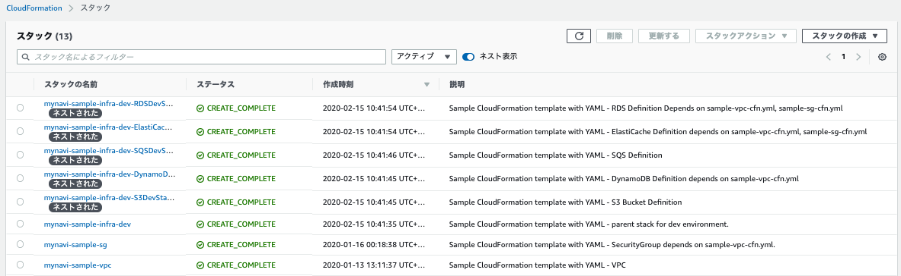

.. include:: ../module.txt

.. _section-automation-infra-devops-cloudformation-13-label:

基盤・デプロイ自動化実践
==================================================================

マイクロサービスアーキテクチャの基盤・デプロイ自動化
-------------------------------------------------------------------------------------------------------------------------------------

|br|

本連載では、以下のイメージの構成にあるAWSリソース基盤自動化環境の構築を実践しています。

|br|

.. figure:: img/automation_infra_devops_cloudformation/cloudformation-scope.png

|br|

前回は、S3およびSQSを構築するテンプレートを実装しました。続く今回は、これまで実装してきたテンプレートの親となるネストテンプレートを作成する方法を紹介します。
実際のソースコードは `GitHub <https://github.com/debugroom/mynavi-sample-cloudformation>`_ 上にコミットしています。
ソースコード中で本質的でない記述を一部省略しているので、実行コードを作成する場合は、必要に応じて適宜GitHub上のソースコードも参照してください。

|br|

.. _section-cloudformation-nestedstack-sample-label:

NestedStackの作成
^^^^^^^^^^^^^^^^^^^^^^^^^^^^^^^^^^^^^^^^^^^^^^^^^^^^^^^^^^^^^^^^^^^^^^^^^^^^^^^^^^^^^^^^^^^^^^^^^^^^^^^^^^^^^^^

|br|

`第21回 <https://news.mynavi.jp/itsearch/article/devsoft/4725>`_ で、CloudFormationがサポートする機能として、複数のテンプレートでネスト(親子)を構成するNestedStackがあることを紹介しました。
NestedStackはテンプレートを分割したり、複数のテンプレートをまとめて実行したいとき、共通のパラメータや定義を複数のテンプレートで共有したいときに利用します。
ただし、制約として参照するテンプレートをS3へアップロードしておく必要があります。

NestedStackを使用する場合、リソースタイプが、 `AWS::CloudFormation::Stack <https://docs.aws.amazon.com/ja_jp/AWSCloudFormation/latest/UserGuide/aws-properties-stack.html>`_
であるリソース定義を使用します。プロパティとして設定可能な属性は、上記リンク先の通りですが、VPCとサブネット、インターネットゲートウェイ、セキュリティグループについては既に構築済みの前提として、
今回はこれまでの連載で実装してきたRDS、ElastiCache、S3、SQSを構築するテンプレートを子テンプレートとして、開発環境としてひとつにまとめて実行するための親テンプレートを作成してみます。テンプレートのサンプルは以下の通りです。

|br|

.. sourcecode:: none

   AWSTemplateFormatVersion: '2010-09-09'

   Description: Sample CloudFormation template with YAML - parent stack for dev environment.

   Parameters:
     VPCName:
       Description: Target VPC Stack Name
       Type: String
       MinLength: 1
       MaxLength: 255
       AllowedPattern: ^[a-zA-Z][-a-zA-Z0-9]*$
       Default: mynavi-sample-cloudformation-vpc
     EnvType:                                                               #(A)
       Description: Which environments to deploy your service.
       Type: String
       AllowedValues: ["Dev"]
       Default: Dev
     LocalhostIpAddress:                                                    #(B)
       Description: CiderBlock paramater for VPC
       Type: String
       MinLength: 9
       MaxLength: 18
       AllowedPattern: (\d{1,3})\.(\d{1,3})\.(\d{1,3})\.(\d{1,3})/(\d{1,2})
       Default: 172.200.2.58/32

   Resources:
     RDSDevStack:                                                           #(C)
       Type: AWS::CloudFormation::Stack
       Properties:
         TemplateURL: ./sample-rds-cfn.yml                                  #(D)
         Parameters:                                                        #(E)
           VPCName: !Sub ${VPCName}
           EnvType: !Sub ${EnvType}
           SecurityGroupDev: !Ref SecurityGroupRdsPostgresForDev

     DynamoDBDevStack:                                                      #(F)
       Type: AWS::CloudFormation::Stack
       Properties:
         TemplateURL: ./sample-dynamodb-cfn.yml
         Parameters:
           VPCName: !Sub ${VPCName}
           EnvType: !Sub ${EnvType}

   # ElastiCache is not permitted public access, use local redis except dev environmant in vpc.
     ElastiCacheDevStack:                                                   #(G)
       Type: AWS::CloudFormation::Stack
       Properties:
         TemplateURL: ./sample-elasticache-cfn.yml
         Parameters:
           VPCName: !Sub ${VPCName}
           EnvType: !Sub ${EnvType}
           SecurityGroupDev: !Ref SecurityGroupElastiCacheRedisForDev

     S3DevStack:                                                            #(H)
       Type: AWS::CloudFormation::Stack
       Properties:
         TemplateURL: ./sample-s3-cfn.yml
         Parameters:
           EnvType: !Sub ${EnvType}

     SQSDevStack:                                                           #(I)
       Type: AWS::CloudFormation::Stack
       Properties:
         TemplateURL: ./sample-sqs-cfn.yml
         Parameters:
           EnvType: !Sub ${EnvType}

     SecurityGroupRdsPostgresForDev:                                        #(J)
       Type: AWS::EC2::SecurityGroup
       Properties:
         GroupName: SecurityGroupRdsPostgresForDev
         GroupDescription: db access only local machine for dev
         VpcId:
           Fn::ImportValue: !Sub ${VPCName}-VPCID
         Tags:
           - Key: Name
             Value: !Sub ${VPCName}-SecurityGroupRdsPostgresForDev

     SecurityGroupIngressRdsPostgresForDev:                                 #(K)
       Type: AWS::EC2::SecurityGroupIngress
       Properties:
         GroupId: !Ref SecurityGroupRdsPostgresForDev
         IpProtocol: tcp
         FromPort: 5432
         ToPort: 5432
         CidrIp: !Ref LocalhostIpAddress

     SecurityGroupElastiCacheRedisForDev:                                   #(L)
       Type: AWS::EC2::SecurityGroup
       Properties:
         GroupName: SecurityGroupElastiCacheForDev
         GroupDescription: elasticache access only local machine for dev
         VpcId:
           Fn::ImportValue: !Sub ${VPCName}-VPCID
         Tags:
           - Key: Name
             Value: !Sub ${VPCName}-SecurityGroupElastiCacheRedisForDev

     SecurityGroupIngressElastiCacheRedisForDev:                            #(M)
       Type: AWS::EC2::SecurityGroupIngress
       Properties:
         GroupId: !Ref SecurityGroupElastiCacheRedisForDev
         IpProtocol: tcp
         FromPort: 6379
         ToPort: 6379
         CidrIp: !Ref LocalhostIpAddress

|br|

NestedStackとして作成した親テンプレートの記述の基本となるポイントは(A)〜(M)の通りです。

|br|

.. list-table:: NestedStackとして作成した親テンプレート記述のポイント
   :widths: 1, 9

   * - 記述
     - 説明

   * - (A)
     - パラメータとして、EnvTypeを指定します。今回は開発環境向けのテンプレートとするため、デフォルト値"Dev"のみを許容する設定としておきます。

   * - (B)
     - パラメータとして、LocalhostIpAddressを指定します。開発環境の端末のIPアドレスを指定して、RDSおよびElastiCacheへのアクセスを許可するセキュリティグループへ渡す用途で使用します。

   * - (C)
     - RDSを構築するテンプレートを開発環境用スタックとしてリソース定義します。

   * - (D)
     - 以前実装したRDSテンプレートの相対パスを指定します。本来、S3にテンプレートをアップロードしてそのオブジェクトキーを指定しなければなりませんが、後述の手順でパスを置き換えるコマンドを実行します。

   * - (E)
     - 親テンプレートから子のテンプレートに渡すパラメータを指定します。子テンプレートに定義したParametersと同じ論理名を指定し、渡すパラメータを設定します。

   * - (F)
     - DynamoDBを構築するテンプレートを開発環境用スタックとしてリソース定義します。子テンプレートに渡すパラメータの定義方法は(E)と同様です。

   * - (G)
     - ElastiCacheを構築するテンプレートを開発環境用スタックとしてリソース定義します。子テンプレートに渡すパラメータの定義方法は(E)と同様です。なお、 :ref:`section-cloudformation-elasticache-sample-label` でも記載しましたが、ElastiCacheのアクセスはVPC内にある開発端末にかぎりアクセスが許可されます。

   * - (H)
     - S3を構築するテンプレートを開発環境用スタックとしてリソース定義します。子テンプレートに渡すパラメータの定義方法は(E)と同様です。

   * - (I)
     - SQSを構築するテンプレートを開発環境用スタックとしてリソース定義します。子テンプレートに渡すパラメータの定義方法は(E)と同様です。

   * - (J)
     - (E)で定義したパラメータとして渡すセキュリティグループを定義します。

   * - (K)
     - (J)で定義した(RDSへのアクセスを許可する)セキュリティグループのインバウンド接続ルールを定義します。

   * - (L)
     - (G)で定義したパラメータとして渡すセキュリティグループを定義します。

   * - (M)
     - (L)で定義した(ElastiCacheへのアクセスを許可する)セキュリティグループのインバウンド接続ルールを定義します。

|br|

.. note:: 生成するリソースの実行順序を制御するにはDependsOnプロパティを使用します。上記では、RDSやElastiCacheで使用するセキュリティグループを前もって作成する必要がありますが、リソース定義自体にセキュリティグループが参照されているので、自動でCloudFormationが実行順序を判断してくれるので明示的に定義する必要はありません。

.. note:: 子テンプレートのパラメータを親テンプレートで参照したい場合は、子テンプレートでOutputs要素にパラメータを定義したのち、GetAtt関数で参照します。例えば、子テンプレートに定義したRDSの開発環境のエンドポイントを参照したい場合、" !GetAtt RDSDevStack.Outputs.RDSDevInstanceEndPoint ” となります。

|br|

作成したテンプレートで指定した子のテンプレートのURLは本来S3にアップロードしてそのオブジェクトキーを指定しなければなりません。AWS CLIの"aws cloudformation package"コマンドで、特定のS3バケットを指定し実行することで、バケットへのアップロードおよびURLをオブジェクトキーに置き換えたテンプレートを生成できます。

事前にアップロード先のバケットを作成した上で(ここでは `クラウドネイティブ第25回 <https://news.mynavi.jp/itsearch/article/devsoft/4597>`_ と同様の手順で、debugroom-mynavi-sample-cloudformation-packageというバケットを事前に作成しておきます)、パッケージを実行するヘルパースクリプトを以下のように作成して実行します。

|br|

.. sourcecode:: bash

   #!/usr/bin/env bash

   template_path="sample-infra-dev-cfn.yml"
   output_template="sample-infra-dev-package-cfn.yml"
   s3_bucket="debugroom-mynavi-sample-cloudformation-package"

   aws cloudformation package --template-file ${template_path} --s3-bucket ${s3_bucket} --output-template-file ${output_template}

|br|

実行が正常に終了すると、URLのパスが置き換わったテンプレートが作成されます。

|br|

.. sourcecode:: none

   AWSTemplateFormatVersion: '2010-09-09'

   #omit

   Resources:
     RDSDevStack:
       Type: AWS::CloudFormation::Stack
       Properties:
         TemplateURL: https://s3.ap-northeast-1.amazonaws.com/debugroom-mynavi-sample-cloudformation-package/85f621985a23d88cd5c0be512e717b3f.template
         Parameters:
           VPCName:
             Fn::Sub: ${VPCName}
           EnvType:
             Fn::Sub: ${EnvType}
           SecurityGroupDev:
             Ref: SecurityGroupRdsPostgresForDev

   #omit

|br|

生成されたテンプレートを以下のようにヘルパースクリプトを用いて実行すると、定義したリソースがまとめて実行されます。

|br|

.. sourcecode:: bash

   #!/usr/bin/env bash

   stack_name="mynavi-sample-infra-dev"
   template_path="sample-infra-dev-package-cfn.yml"

   parameters="EnvType=Dev"

   aws cloudformation deploy --stack-name ${stack_name} --template-file ${template_path} --parameter-overrides ${parameters} --capabilities CAPABILITY_IAM

|br|

|br|

今回は複数のリソースをNestedStackを使ってまとめて一括構築するCloudFormationテンプレートを実装しました。次回は、CloudFormationを使って作成したリソースの情報にアクセスするSpringCloudAWSアプリケーションの実装方法の解説を進めていきます。

|br|

著者紹介
------------------------------------------------------------------

川畑 光平(KAWABATA Kohei) - NTTデータ 課長代理

.. figure:: img/automation_infra_devops_overview/pic_image01.jpg

金融機関システム業務アプリケーション開発・システム基盤担当を経て、現在はソフトウェア開発自動化関連の研究開発・推進に従事。

Red Hat Certified Engineer、Pivotal Certified Spring Professional、AWS Certified Solutions Architect Professional等の資格を持ち、アプリケーション基盤・クラウドなど様々な開発プロジェクト支援にも携わる。

`2019 APN AWS Top Engineers & Ambassadors <https://aws.amazon.com/jp/blogs/psa/japan-apn-ambassador-2019/>`_ 選出。
