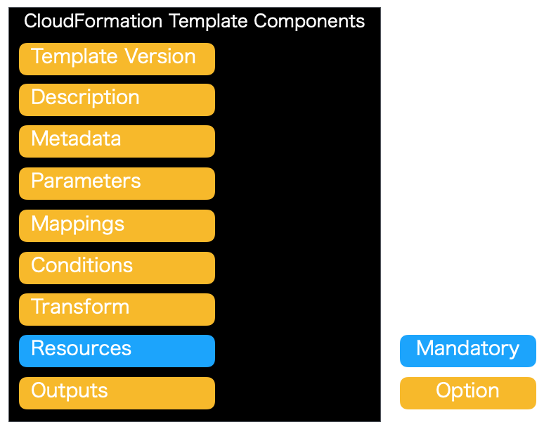

.. include:: ../module.txt

.. _section-automation-infra-devops-cloudformation-1-label:

基盤・デプロイ自動化実践
==================================================================

マイクロサービスアーキテクチャの基盤・デプロイ自動化
-------------------------------------------------------------------------------------------------------------------------------------

.. _section-automation-infra-devops-infrastructure-automation-using-cloudformation-label:

AWS CloudFormationを使用した基盤自動化
^^^^^^^^^^^^^^^^^^^^^^^^^^^^^^^^^^^^^^^^^^^^^^^^^^^^^^^^^^^^^^^^^^^^^^^^^^^^^^^^^^^^^^^

|br|

本連載では、以下のイメージの構成のようなマイクロサービスアーキテクチャにおける、基盤自動化環境の構築を実践していきます。

|br|

.. figure:: img/automation_infra_devops_overview/MicroServiceArchitecture.png

|br|

前回までにECSコンテナ、RDSを使ったSonarQubeServerによる静的チェック環境の構築から、SpringBootを使ったマイクロサービスにおける各種テストコードの実装、
GitHubへプッシュされたソースコードに対するCodeBuildを使ったビルド・テスト、SonarScannerによる静的チェック結果の可視化といった一連の継続的インテグレーション自動化を実現しました。
また、Developブランチへのソースコードプッシュを契機に、ECSコンテナアプリケーションをステージング・プロダクション環境へデプロイするパイプラインを通して継続的デリバリの仕組みを解説してきました。
これらの環境は全てAWSコンソールを通して手動で行ってきましたが、今回からはこれまで解説してきた構築作業をコード化して構築する(InfrastructureAsCode:IaC)ことができるCloudFormationを使った基盤自動化について解説していきます。

|br|

.. _section-cloudformation-overview-label:

AWS CloudFormationの概要
^^^^^^^^^^^^^^^^^^^^^^^^^^^^^^^^^^^^^^^^^^^^^^^^^^^^^^^^^^^^^^^^^^^^^^^^^^^^^^^^^^^^^^^

|br|

AWS CloudFormationはJSONやYAML形式で記述されたテンプレートテキストファイルから、AWS上のEC2プロビジョニングやS3などAWSリソースの環境構築を実行できるサービスです。
AWSインフラ環境構築作業をソフトウェアコード化し、環境構築作業の迅速化、作業ミスの防止、再利用などを実現できます。
`CloudFormationはAWSが提供する主要なほぼ全てのサービスをサポート <https://docs.aws.amazon.com/ja_jp/AWSCloudFormation/latest/UserGuide/aws-template-resource-type-ref.html>`_ しており、
無料で使用することができます(CloudFormationで構築したAWSサービスの費用は当然かかります)。

CloudFormationでは、定められた形式に従って記述されたテンプレートファイルを、AWSコンソール上もしくはCLI(CommandLineInterface)を使って実行します。
記述内容に従って、AWSリソースが自動構築されますが、構築されたリソースの集合をスタック(Stack)と呼びます。
CloudFormationでは、このスタック単位でAWSリソースの作成、変更、削除を行っていくことになります。

|br|

.. _section-cloudformation-template-overview-label:

テンプレートの基本要素と記述ルールの概要
^^^^^^^^^^^^^^^^^^^^^^^^^^^^^^^^^^^^^^^^^^^^^^^^^^^^^^^^^^^^^^^^^^^^^^^^^^^^^^^^^^^^^^^

|br|

次回以降から、「クラウドネイティブアプリケーションの基本」や、これまでの連載で紹介してきたAWSサービスごとに実際にテンプレートを作成し、解説を進めていきますが、
どのテンプレートにも共通する基本事項や要素、記述ルールについて簡単に説明します。冒頭でも説明した通り、テンプレートはJSONもしくはYAML形式で記述されたテキストファイルですが、
本連載では、記述の容易性、可読性に優れたYAML形式をベースにします(JSONでも書き方が変わるだけで記載内容は同じです)。

|br|

テンプレートは以下のような要素(青い必須要素と、必要に応じて記述するオプショナル要素)から構成されます。

|br|

|br|

各構成要素の説明は以下の通りです。

|br|

.. list-table:: CloudFormationテンプレートの構成要素
   :widths: 5, 14, 1

   * - 項目
     - 説明
     - 必須

   * - Template Version
     - テンプレートのバージョン。最新のテンプレートの形式バージョンは 2010-09-09 であり、2019年11月時点でも唯一の有効な値です。
     -

   * - Description
     - テンプレートの説明が記述されています。
     -

   * - Metadata
     - テンプレートに追加されたResourceの補足情報などを提供します。AWSコンソール上でテンプレートを読み込み、スタックを構築した際にMetadataを使用して項目の表示順序など制御することができます。
     -

   * - Parameters
     - AWSコンソール上でテンプレートを読み込み、スタックを構築した際に、ユーザが入力することを想定し、Parametersに指定された項目はGUI上からも指定ができるようになります。また、テンプレート上でParametersを記述する場合は、変数として使用できます。テンプレート内で定義し、複数の箇所で利用できるほか、テンプレートをネストした構成での親テンプレートからのプロパティ参照などにも使用されます。パラメータは文字列型やNumberなど複数の型をもち、入力値の制約なども定義できます。
     -

   * - Mappings
     - Mappingsでは、テンプレート内で使用する2次元キーバリューマッピングテーブルを記述できます。EC2インスタンスマシンイメージIDなど、リージョンやユーザの入力パラメータにより、使用したい項目が変わってくる場合などに利用されます。
     -

   * - Conditions
     - Resourcesの記述で条件を事前に定義したいときに記述します。プロダクションやステージング環境など異なる条件でリソース定義を分けたい場合などに利用します。
     -

   * - Transform
     - サーバレスアプリケーションの場合に使用します。AWS SAM(ServerlessApplicationModel)のバージョンを指定します。
     -

   * - Resources
     - CloudFormationで構築するスタックの構成要素となるAWSリソースを定義します。テンプレートの必須となる要素であり、AWSのリソースタイプにより定義できるプロパティは異なります。
     - ○

   * - Outputs
     - スタックを構築した後にAWSコンソール上で表示させたい項目や、他のテンプレートなどで取得したい情報を定義します。
     -

|br|

実際のテンプレートのサンプルは以下のようになります。サンプルでは、Template Version、Description、Parameters、Resources、Outputsで構成されたものです。

|br|

.. sourcecode:: none

   AWSTemplateFormatVersion: '2010-09-09'

   Description: Sample CloudFormation template with YAML

   Parameters:
     VPCStackName:                                 #パラメータ論理名
       Description: Target VPC Stack Name
       Type: String
       MinLength: 1
       MaxLength: 255
       AllowedPattern: ^[a-zA-Z][-a-zA-Z0-9]*$
       Default: sample-cloudformation-vpc

   Resources:
     SampleCloudFormationVPC:                      #リソース論理名
       Type: AWS::EC2::VPC
       Properties:
         CidrBlock: 172.100.0.0/16
         InstanceTenancy: default
         EnableDnsSupport: true
         EnableDnsHostnames: true
         Tags:
           - Key: Name
             Value: SampleCloudFormationVPC

   # omit

   Outputs:
     VPCID:                                        #アウトプット論理名
       Description: VPC ID
       Value: !Ref SampleCloudFormationVPC
       Export:
         Name: !Sub ${AWS::StackName}-VPCID        #組み込み関数および擬似パラメータ参照

|br|

特にParametersやMappings、Conditions、Resources、Outputsなどテンプレートの中核となる要素は、
各要素のトップレベルの直下に、「論理名」を定義します(上記のソースコードにも該当する論理名にコメントを付与しています)。
これらの論理名はテンプレートの作成者が独自に定義しますが、テンプレート内で一意になる必要があります。

|br|

.. _section-cloudformation-various-function-overview-label:

CloudFormationで利用可能な組み込みファンクションや擬似パラメータ、その他機能
^^^^^^^^^^^^^^^^^^^^^^^^^^^^^^^^^^^^^^^^^^^^^^^^^^^^^^^^^^^^^^^^^^^^^^^^^^^^^^^^^^^^^^^

|br|

CloudFormationでは、テンプレート内で、パラメータの参照や文字列操作などで利用できる組み込みファンクションや擬似パラメータ(Pseudo Parameters)が用意されています。
組み込みファンクションは「完全名」および「短縮系」２種類の方法で記述が可能ですが、可読性や記法の制約に合わせて双方組み合わせて記述するのが一般的です。主要なファンクションや記述法は以下の通りです。

|br|

.. list-table:: 組み込みファンクションの一覧
   :widths: 4, 7, 5, 5

   * - ファンクション
     - 説明
     - 完全名表記例
     - 簡略化表記例

   * - `Ref <https://docs.aws.amazon.com/ja_jp/AWSCloudFormation/latest/UserGuide/intrinsic-function-reference-ref.html>`_
     - リソース論理名の物理IDを参照します
     - Fn::Ref: SampleCloudFormationVPC
     - !Ref SampleCloudFormationVPC

   * - `Base64 <https://docs.aws.amazon.com/ja_jp/AWSCloudFormation/latest/UserGuide/intrinsic-function-reference-base64.html>`_
     - 文字列をBase64エンコードします
     - Fn::Base64: xxxxx
     - !Base64 xxxxx

   * - `Sub <https://docs.aws.amazon.com/ja_jp/AWSCloudFormation/latest/UserGuide/intrinsic-function-reference-sub.html>`_
     - 変数を含む文字列を指定した変数値で置き換えます
     - Fn::Sub: ${VPCStackName}-Output
     - !Sub ${VPCStackName}-Output

   * - `GetAtt <https://docs.aws.amazon.com/ja_jp/AWSCloudFormation/latest/UserGuide/intrinsic-function-reference-getatt.html>`_
     - リソースが持つ属性値を取得します(取得可能な属性値はリソースにより異なり、また一部に限られます。取得可能な属性はAWSリソースの各リンクを参照してください。)
     - Fn::GetAtt: ["SampleCloudFormationVPC", "CidrBlock"]
     - !GetAtt SampleCloudFormationVPC.CidrBlock

   * - `Select <https://docs.aws.amazon.com/ja_jp/AWSCloudFormation/latest/UserGuide/intrinsic-function-reference-select.html>`_
     - 配列内の要素を指定したインデックス番号に応じて取得します
     - Fn::Select: ["0", ["A", "B", "C"]]
     - !Select ["0" , ["A", "B", "C"]]

   * - `Join <https://docs.aws.amazon.com/ja_jp/AWSCloudFormation/latest/UserGuide/intrinsic-function-reference-join.html>`_
     - 文字列をデリミタを含めて結合します。単純な結合ならブランクを指定します。
     - Fn::Join: ["", ["A", "B"]]
     - !Join ["" , ["A", "B"]]

   * - `ImportValue <https://docs.aws.amazon.com/ja_jp/AWSCloudFormation/latest/UserGuide/intrinsic-function-reference-importvalue.html>`_
     - 別のスタックで使用されたリソースの出力を取り出します(クロススタックリファレンスで使用します)。
     - Fn::ImportValue: sample-cloudformation-vpc-VPCID
     - !ImportValue sample-cloudformation-vpc-VPCID

   * - `FindInMap <https://docs.aws.amazon.com/ja_jp/AWSCloudFormation/latest/UserGuide/intrinsic-function-reference-findinmap.html>`_
     - Mappingsからデータを取り出します。
     - Fn::FindInMap: [ MapLoggicalName, ap-northeast-1, AMI ]
     - !FindInMap [ MapLoggicalName, ap-northeast-1, AMI ]

   * - `Split <https://docs.aws.amazon.com/ja_jp/AWSCloudFormation/latest/UserGuide/intrinsic-function-reference-split.html>`_
     - 文字列を指定したデリミタで分割して配列を返却します。Select組み合わせるのが一般的です。
     - Fn::Split: [",", "A,B"]
     - !Split [",", "A,B"]

   * - `条件関数(IF、OR、And、Not、Equals) <https://docs.aws.amazon.com/ja_jp/AWSCloudFormation/latest/UserGuide/intrinsic-function-reference-conditions.html>`_
     - 主にConditionsで定義した条件を元に、Resourcesなどで条件判定の記述などに使用されます。
     - Fn::If: [ConditionsLogicalName, "A", "B"]
     - !If [ConditionsLogicalName, "A", "B"]

|br|

`擬似パラメータ <https://docs.aws.amazon.com/ja_jp/AWSCloudFormation/latest/UserGuide/pseudo-parameter-reference.html>`_ はAWS側で事前に定義したパラメータ群で、Ref関数により参照できます。利用可能な主なパラメータは以下の通りです。

.. list-table:: AWSが提供する擬似パラメータ
   :widths: 5, 14

   * - パラメータ
     - 説明

   * - AWS::Region
     - リージョン名を取得可能です。

   * - AWS::StackId
     - スタックIDを取得可能です。

   * - AWS::StackName
     - スタック名を取得可能です。

   * - AWS::AccountId
     - AWSアカウントIDを取得可能です。

|br|

その他、CloudFormationでは、以下のような機能をサポートしています。

* 複数のテンプレートでネスト(親子)を構成するNestedStack
* 他のテンプレートの出力を参照するクロススタックリファレンス
* テンプレートの標準機能で実現が難しい変換処理などLambda関数として呼び出すMacros機能
* AWS SystemsManagerParameterStoreやAWS SecretsManagerなどと連携し、パスワード等の認証情報を動的に参照するDynamicReference機能
* 変更を要求した箇所とそれにより影響をうけるリソース論理IDを事前に確認できるChangeSet機能
* 現状のリソースとの差分を検出するDrift Detection機能
* １つのテンプレートを複数のAWSアカウントおよび複数のリージョンに展開するStackSets機能
* AWSコンソールでドラッグアンドドロップでテンプレートを作成・編集できるCloudFormation Designer機能
* すでに構築済みのAWSリソースからCloudFormationテンプレートを作成するCloudFormer機能(2019年11月時点でベータ版)

|br|

.. _section-cloudformation-article-index-label:

CloudFormationを使った基盤自動化環境構築
^^^^^^^^^^^^^^^^^^^^^^^^^^^^^^^^^^^^^^^^^^^^^^^^^^^^^^^^^^^^^^^^^^^^^^^^^^^^^^^^^^^^^^^

|br|

以上、CloudFormationの概要やテンプレートの記述要領、様々な機能を概説しました。次回以降から、これまで当連載で構築してきたクラウドネイティブアプリケーションや
CI/CD環境に対して、上述したテンプレート記述の要領に則り、また、様々な上記の機能を活用しながら、実践的に基盤自動化環境の構築を解説していきます。
以下の目次に従って、解説を進めていく予定です。

#. CloudFormation開発環境の設定

   #. AmazonCLI(CommandLineInterface)の実行環境/AWS認証情報の設定
   #. テンプレートのコード補完・文法チェック等を実行する各種検証プラグインインストール
   #. 統合開発環境(IntelliJ IDEA)の設定
   #. CloudFormation実行ヘルパースクリプトの作成

#. クラウドネイティブアプリケーション基盤構築自動化実践・解説

   #. VPC/Subnet/RouteTable/InternetGateway/SecurityGroup構築自動化テンプレート
   #. NATGateway/ApplicationLoadBalancer構築自動化テンプレート
   #. ECSクラスタ/タスク定義/サービス構築自動化テンプレート
   #. RDS構築自動化テンプレート
   #. DynamoDB構築自動化テンプート
   #. ElastiCache構築自動化テンプレート
   #. S3構築自動化テンプレート
   #. SQS構築自動化テンプート

#. CI/CD基盤構築自動化実践・解説

   #. CodeBuild構築自動化テンプレート
   #. CodePipeline構築自動化テンプレート

次回は、CloudFormation環境構築の最初のステップとして、AmazonCLIの実行環境設定を解説します。

|br|

著者紹介
------------------------------------------------------------------

川畑 光平(KAWABATA Kohei) - NTTデータ 課長代理

.. figure:: img/automation_infra_devops_overview/pic_image01.jpg

金融機関システム業務アプリケーション開発・システム基盤担当を経て、現在はソフトウェア開発自動化関連の研究開発・推進に従事。

Red Hat Certified Engineer、Pivotal Certified Spring Professional、AWS Certified Solutions Architect Professional等の資格を持ち、アプリケーション基盤・クラウドなど様々な開発プロジェクト支援にも携わる。

`2019 APN AWS Top Engineers & Ambassadors <https://aws.amazon.com/jp/blogs/psa/japan-apn-ambassador-2019/>`_ 選出。
