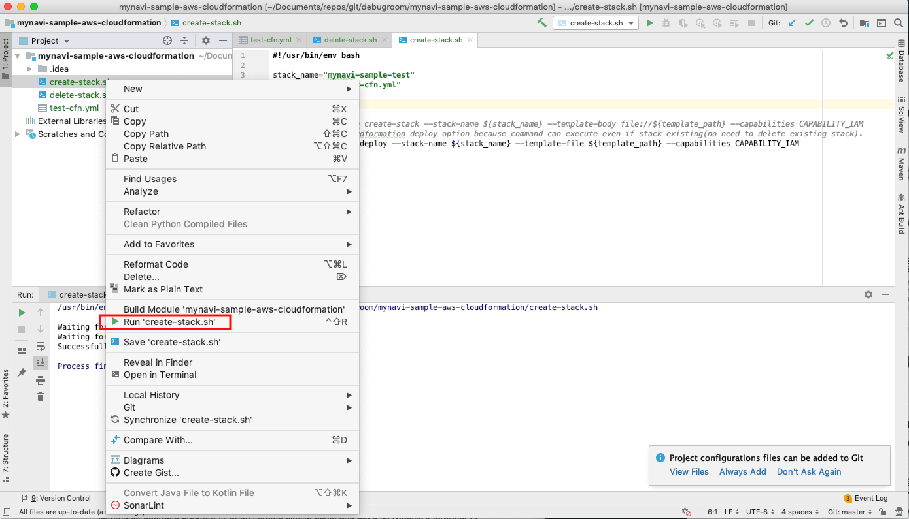
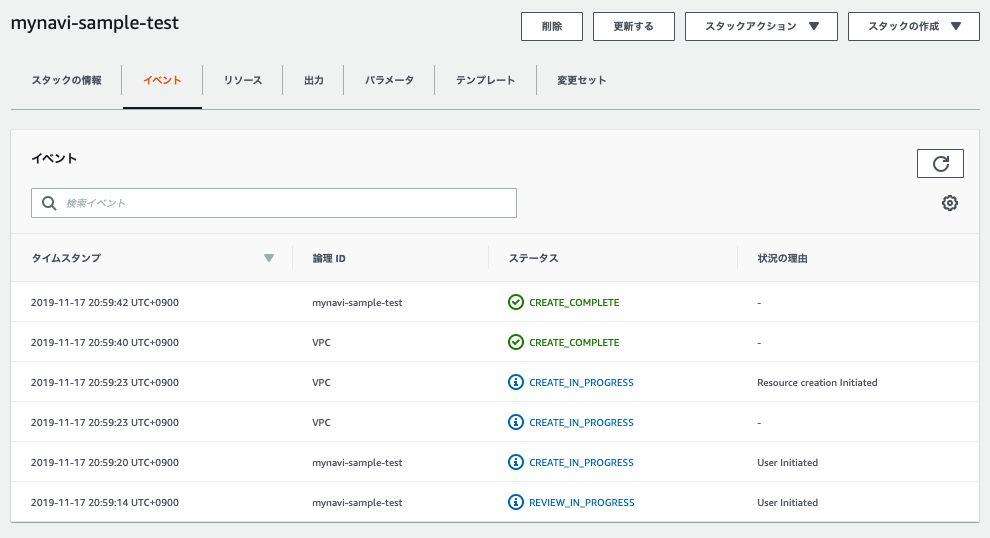
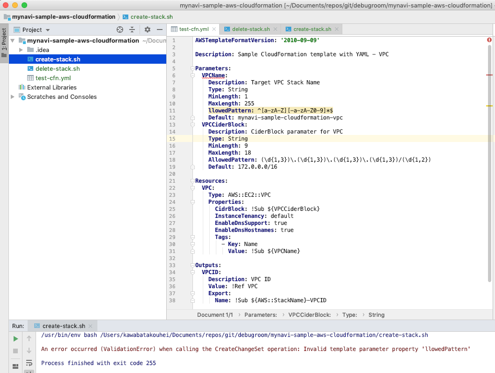
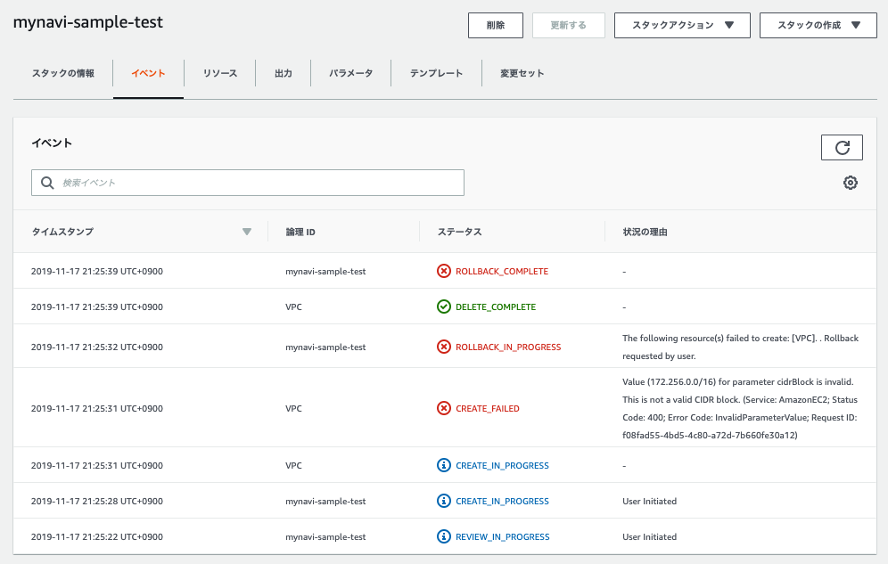

.. include:: ../module.txt

.. _section-automation-infra-devops-cloudformation-4-label:

基盤・デプロイ自動化実践
==================================================================

マイクロサービスアーキテクチャの基盤・デプロイ自動化
-------------------------------------------------------------------------------------------------------------------------------------

|br|

本連載では、以下のイメージの構成のようなマイクロサービスアーキテクチャにおける、基盤自動化環境の構築を実践していきます。

|br|

.. figure:: img/automation_infra_devops_overview/MicroServiceArchitecture.png

|br|　

前回は、テンプレートのコード補完・文法チェック等を実行する検証プラグインのインストール方法や、統合開発環境(IntelliJ IDEA)の設定方法を概説しました。
続く今回は、CloudFormationの簡単なサンプルを作成し、テンプレート記述の基本を解説した上で、実行するためのヘルパースクリプトや実行エラーの確認方法等を説明します。
なお、実際のソースコードは `GitHub <https://github.com/debugroom/mynavi-sample-cloudformation>`_ 上にコミットしています。
ソースコード中で本質的でない記述を一部省略しているので、実行コードを作成する場合は、必要に応じて適宜GitHub上のソースコードも参照してください。

|br|

.. _section-cloudformation-basic-sample-label:

CloudFormationテンプレート記述の基本
^^^^^^^^^^^^^^^^^^^^^^^^^^^^^^^^^^^^^^^^^^^^^^^^^^^^^^^^^^^^^^^^^^^^^^^^^^^^^^^^^^^^^^^

|br|

:ref:`section-cloudformation-template-overview-label` で説明した通り、テンプレートファイルではResources要素が必須となります。
加えて、Template VersionやDescritpion、Parameters、Outputs等が一般的によく使用される要素になります。ここではシンプルにVPCを構築するテンプレート(test-cfn.yml)を作成してみましょう。

|br|

.. sourcecode:: none

   AWSTemplateFormatVersion: '2010-09-09'                                    #(A)

   Description: Sample CloudFormation template with YAML - VPC               #(B)

   Parameters:                                                               #(C)
     VPCName:                                                                #(D)
       Description: Target VPC Stack Name                                    #(E)
       Type: String
       MinLength: 1
       MaxLength: 255
       AllowedPattern: ^[a-zA-Z][-a-zA-Z0-9]*$
       Default: mynavi-sample-cloudformation-vpc
     VPCCiderBlock:
       Description: CiderBlock paramater for VPC
       Type: String
       MinLength: 9
       MaxLength: 18
       AllowedPattern: (\d{1,3})\.(\d{1,3})\.(\d{1,3})\.(\d{1,3})/(\d{1,2})
       Default: 172.0.0.0/16

   Resources:                                                                #(F)
     VPC:                                                                    #(G)
       Type: AWS::EC2::VPC                                                   #(H)
       Properties:                                                           #(I)
         CidrBlock: !Sub ${VPCCiderBlock}                                    #(J)
         InstanceTenancy: default
         EnableDnsSupport: true
         EnableDnsHostnames: true
         Tags:
           - Key: Name
             Value: !Sub ${VPCName}

   Outputs:                                                                  #(K)
     VPCID:                                                                  #(L)
       Description: VPC ID                                                   #(M)
       Value: !Ref VPC
       Export:
         Name: !Sub ${AWS::StackName}-VPCID

|br|

テンプレートの記述の基本となるポイントは(A)〜(M)の通りです。

|br|

.. list-table:: CloudFormationテンプレート記述のポイント
   :widths: 1, 9

   * - 記述
     - 説明

   * - (A)
     - テンプレートバージョンを指定します。2019年11月現時点でもバージョンは"2010-09-09"が唯一のバージョンになります。

   * - (B)
     - Description要素にはテンプレートの概要を記述します。

   * - (C)
     - Parameter要素では、Stack構築時にパラメータとして動的に設定する値を記述します。パラメータ化する対象は、テンプレートの再利用性を踏まえ決定します。

   * - (D)
     - Parameter要素の直下では、パラメータ論理名を任意に定義します。これはユニークな値でなければなりません。なお、テンプートに指定できるパラメータの数は最大60個です。

   * - (E)
     - Parameter要素でパラメータの属性などを定義していきます。こちらに記載する内容は下記別表「Parametersの主なプロパティ」を参照してください。

   * - (F)
     - 記述が必須となるResources要素です。Stackとして構築するAWSリソースを定義していきます。

   * - (G)
     - Resources要素の直下では、リソース論理名を任意に定義します。これはユニークな値でなければなりません。

   * - (H)
     - AWSリソースのタイプを定義します。AWS::(ServiceName)::(Resource)の形で指定されます。

   * - (I)
     - AWSリソースは必ず必須となる幾つかのプロパティと、オプションで設定するプロパティが存在します。各リソースタイプによりプロパティ定義は異なります。

   * - (J)
     - プロパティ内で、パラメータ値を設定する場合、組み込みファンクション「!Sub」で変数を含む文字列を指定した変数値で置き換えます.

   * - (K)
     - スタック構築後、コンソール上から表示させたいプロパティや、他のテンプレートに渡したいパラメータがある場合(クロススタックリファレンス)、Outputs要素を指定します。

   * - (L)
     - Outputs要素の直下では、アウトプット論理名を任意に定義します。これはユニークな値でなければなりません。

   * - (M)
     - Outputs要素では、論理名の配下に、出力値の説明であるDescription、実際の出力値となるValue(必須)、出力後の物理名となるExport:Name属性を指定します。詳細は、`AWS公式ページ 出力 <https://docs.aws.amazon.com/ja_jp/AWSCloudFormation/latest/UserGuide/outputs-section-structure.html>`_ を参照してください。

|br|

.. list-table:: Parametersの主なプロパティ
   :widths: 3, 7, 1

   * - プロパティ
     - 説明
     - 必須

   * - Description
     - プロパティの詳細な説明を記載します。
     -

   * - Type
     - パラメータのデータ型を指定します。String、Numner、List<Number>、CommaDelimitedList、AWS固有パラメータ、SSMパラメータが指定可能です。詳細は、`AWS公式ページ パラメータ <https://docs.aws.amazon.com/ja_jp/AWSCloudFormation/latest/UserGuide/parameters-section-structure.html>`_ を参照してください。
     - ◯

   * - MinLength
     - 文字列型プロパティの最小文字数を設定します。
     -

   * - MaxLength
     - 文字列型プロパティの最大文字数を設定します。
     -

   * - MinValue
     - 数字型プロパティの最小値を設定します。
     -

   * - MaxValue
     - 数字型プロパティの最大値を設定します。
     -

   * - AllowedPattern
     - 入力可能な文字列のパターンを正規表現で設定します。
     -

   * - AllowedValues
     - 入力可能な文字列を一覧で指定します。
     -

   * - NoEcho
     - (AWSコンソールでの)入力時にマスク表示(*****)する場合設定します。
     -

   * - ConstraintDescription
     - 入力値が制約に引っかかった時に表示する説明を記述します。
     -

|br|

テンプレート作成後、AmazonCLIを使ってコマンド実行します。スタックを作成するには、`aws cloudformation create-stack コマンド <https://docs.aws.amazon.com/ja_jp/AWSCloudFormation/latest/UserGuide/using-cfn-cli-creating-stack.html>`_ を実行するのが基本ですが、
このコマンドでは、一度Stackを作成するとアップデートなどを行う際も、一度 `aws cloudformation delete-stack コマンド <https://docs.aws.amazon.com/ja_jp/AWSCloudFormation/latest/UserGuide/using-cfn-cli-deleting-stack.html>`_ などでスタックを削除してから再実行する必要があるので、
ChangeSetを同時に作成し、初回作成後もテンプレートを更新した場合もそのまま使用可能な `aws cloudformation deploy コマンド <https://docs.aws.amazon.com/ja_jp/AWSCloudFormation/latest/UserGuide/using-cfn-cli-deploy.html>`_ を使用して、スタックを作成しましょう。

|br|

コマンド実行の引数として、テンプレートのファイルパスや、入力パラメータなど毎回長いコマンドを実行するのも大変なため、実行のヘルパースクリプトを以下の通り作成します。
引数は、作成時のスタック名とテンプレートファイルのパス、今回は関係ありませんが、IAMロールを作成する際に必要なcapabilitiesオプションを指定して実行してみます。

|br|

.. sourcecode:: bash

   #!/usr/bin/env bash

   stack_name="mynavi-sample-test"
   template_path="test-cfn.yml"

   #aws cloudformation create-stack --stack-name ${stack_name} --template-body file://${template_path} --capabilities CAPABILITY_IAM
   # It is better cloudformation deploy option because command can execute even if stack existing(no need to delete existing stack).
   aws cloudformation deploy --stack-name ${stack_name} --template-file ${template_path} --capabilities CAPABILITY_IAM

|br|

ターミナルなどから実行できますが、テンプレート作成エディタで使っているIntelliJ IDEA上から作成したスクリプトを実行します。

|br|

|br|

コマンドが無事正常実行されると、下記の通り、AWSコンソール上のCloudFormationサービスからもスタックが作成されたことを確認できます。

|br|

|br|

一方、テンプレートに記述誤りがあり、CloudFormation実行中に誤ってエラーが発生した場合はどうなるのでしょうか？
単純な記法誤りなどは、前回のイメージにもあった通り、IntelliJ IDEAでコーディングしている段階でエラー検出されます。
エラーが検出されている中で強引に実行しても、下記の通り、スクリプト実行時にエラーで終了してしまいます。

|br|

|br|

しかし、記法上問題なくても論理的にありえないエラーの場合などは実行中にエラーが発生します。以下は、VPC上のCIDRを論理的にありえないアドレス(172.256.0.0/16)になるように入力パラメータを変更して実行した場合の例です。

|br|

.. sourcecode:: bash

   #!/usr/bin/env bash

   stack_name="mynavi-sample-test"
   template_path="test-cfn.yml"
   parameters="VPCCiderBlock=172.256.0.0/16"

   #aws cloudformation create-stack --stack-name ${stack_name} --template-body file://${template_path} --capabilities CAPABILITY_IAM
   # It is better cloudformation deploy option because command can execute even if stack existing(no need to delete existing stack).

   if [ "$parameters" == "" ]; then
       aws cloudformation deploy --stack-name ${stack_name} --template-file ${template_path} --capabilities CAPABILITY_IAM
   else
       aws cloudformation deploy --stack-name ${stack_name} --template-file ${template_path} --parameter-overrides ${parameters} --capabilities CAPABILITY_IAM
   fi

|br|

この場合、コマンド実行中にエラーとなり、それまでの処理はロールバックされます。AWSコンソール上で、CloudFormationサービスの対象のスタックで、イベントタブからエラーとなった原因を確認できます。

|br|

|br|

上記は単純な論理的エラーの例ですが、作成対象のリソースによっては、IAM権限不足や設定誤りなど、テンプレートの初回作成時は実行エラーになるケースがしばしば発生します。
都度ロールバックやテンプレートの修正、再実行の繰り返しになるため、上記のように記法誤りの早期検出や、ヘルパースクリプトの作成など繰り返し再実行がしやすい環境でテンプレートを開発していくことを推奨します。

|br|

さて、次回以降は、「クラウドネイティブアプリケーションの基本」などこれまでの連載でコンソール上から手動で構築してきた、以下のようなAWSリソースを、実際にCloudFormationを使って構築するテンプレートの解説を進めていきます。

|br|

.. figure:: img/automation_infra_devops_cloudformation/cloudformation-scope.png

|br|

次回は、今回作成したVPCに加え、パブリック・プライベートサブネット、ルートテーブルおよびインターネットゲートウェイを構築するスタックテンプレートの解説です。

|br|

著者紹介
------------------------------------------------------------------

川畑 光平(KAWABATA Kohei) - NTTデータ 課長代理

.. figure:: img/automation_infra_devops_overview/pic_image01.jpg

金融機関システム業務アプリケーション開発・システム基盤担当を経て、現在はソフトウェア開発自動化関連の研究開発・推進に従事。

Red Hat Certified Engineer、Pivotal Certified Spring Professional、AWS Certified Solutions Architect Professional等の資格を持ち、アプリケーション基盤・クラウドなど様々な開発プロジェクト支援にも携わる。

`2019 APN AWS Top Engineers & Ambassadors <https://aws.amazon.com/jp/blogs/psa/japan-apn-ambassador-2019/>`_ 選出。
