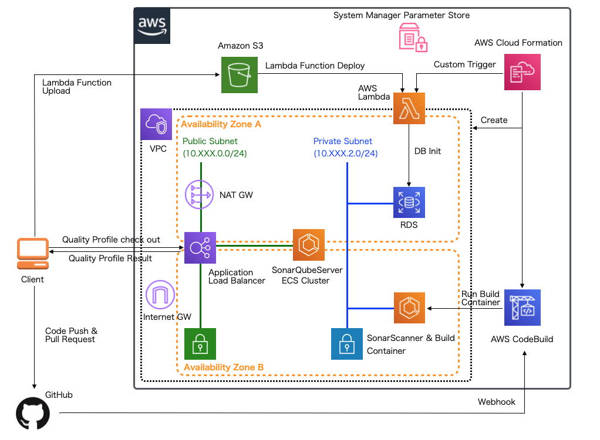
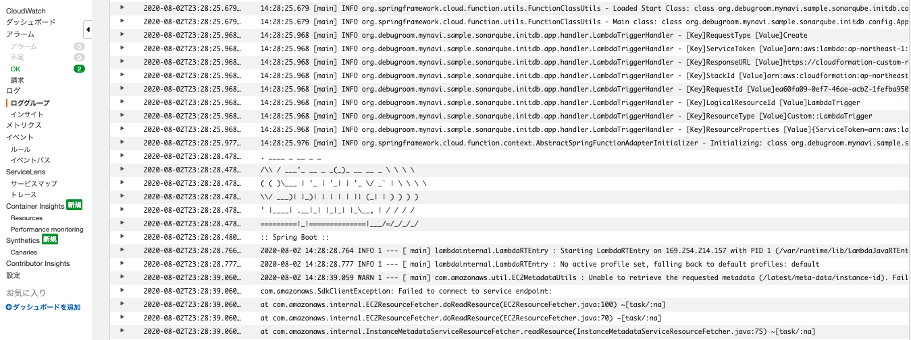

.. include:: ../module.txt

.. _section-automation-infra-devops-cloudformation-22-label:

【第42回】AWS CloudFormationを用いた基盤自動化(22)継続的インテグレーション環境の構築(3)
-------------------------------------------------------------------------------------------------------------------------------------

|br|

本連載では、AWSリソース基盤構築の自動化を実践しています。現在は `第2回 <https://news.mynavi.jp/itsearch/article/devsoft/4463>`_ から解説してきた継続的インテグレーション環境をCloudFormationを使って自動構築しています。

|br|

|br|

前回は、CloudFormationのカスタムリソースを使ってRDS構築後のデータベースにユーザを追加する処理をLambdaファンクションとして実装し、S3バケットへアップロードしています。
続く今回は、LambdaをデプロイするCloudFormationや前回実装したファンクションを実行するカスタムリソーステンプレートを作成します。

本連載で実際に作成するアプリケーションでは `GitHub <https://github.com/debugroom/mynavi-sample-sonarqube-aws>`_ 上にコミットしています。
以降に記載するソースコードでは、import文など本質的でない記述を省略している部分があるので、実行コードを作成する際は、必要に応じて適宜GitHubにあるソースコードも参照してください。

.. _section-cloudformation-sonarqube-server-lambda-deploy-label:

Lambdaをデプロイするテンプレート
^^^^^^^^^^^^^^^^^^^^^^^^^^^^^^^^^^^^^^^^^^^^^^^^^^^^^^^^^^^^^^^^^^^^^^^^^^^^^^^^^^^^^^^^^^^^^^^^^^^^^^^^^^^^^^^

|br|

続いて、LambdaファクションをデプロイするCloudFormationテンプレートを実装します。

|br|

.. sourcecode:: none

   AWSTemplateFormatVersion: '2010-09-09'

   Description: Lambda for create user in RDS template with YAML - Depends On base/1-vpc-cfn.yml, base/2-sg-cfn.yml.

   // omit

   Resources:
     LambdaForCreatingTableInRds:
       Type: AWS::Lambda::Function                                              # (A)
       Properties:
         Code:
           S3Bucket:
             Fn::ImportValue: !Sub ${VPCName}-Lambda-S3Bucket                   # (B)
         S3Key: mynavi-sample-sonarqube-initdb-0.0.1-SNAPSHOT-aws.jar           # (C)
         Handler: org.debugroom.mynavi.sample.sonarqube.initdb.app.handler.LambdaTriggerHandler::handleRequest
                                                                                # (D)
         FunctionName: mynavi-sonarqube-cfn-rds-dbinit-function
         Environment:
           Variables:
             FUNCTION_NAME: initDBFunction                                      # (E)
         MemorySize: 1024                                                       # (F)
         Runtime: java8
         Timeout: 120
         VpcConfig:                                                             # (G)
           SecurityGroupIds:
             - Fn::ImportValue: !Sub ${VPCName}-SecurityGroupLambda             # (H)
           SubnetIds:                                                           # (I)
             - Fn::ImportValue: !Sub ${VPCName}-PrivateSubnet1
             - Fn::ImportValue: !Sub ${VPCName}-PrivateSubnet2
         Role: !GetAtt LambdaRDSAccessRole.Arn                                  # (J)

     LambdaRDSAccessRole:                                                       # (K)
       Type: AWS::IAM::Role
       Properties:
         Path: /
         AssumeRolePolicyDocument:
           Statement:
             - Action: sts:AssumeRole
               Effect: Allow
               Principal:
                 Service: lambda.amazonaws.com
           ManagedPolicyArns:
             - arn:aws:iam::aws:policy/service-role/AWSLambdaVPCAccessExecutionRole
                                                                                # (L)

     CloudFormationAccessPolicy:                                                # (M)
       Type: AWS::IAM::Policy
       Properties:
         PolicyName: ma-Lambda-CloudFormationAccessPolicy
         PolicyDocument:
           Statement:
             - Effect: Allow
               Action:
                 - "cloudformation:*"
               Resource: "*"
         Roles:
           - !Ref LambdaRDSAccessRole

     SSMAccessPolicy:                                                           # (N)
       Type: AWS::IAM::Policy
       Properties:
         PolicyName: ma-lambda-SSMAccessPolicy
         PolicyDocument:
           Statement:
             - Effect: Allow
               Action:
               - "cloudwatch:PutMetricData"
               # omit
         Roles:
           - !Ref LambdaRDSAccessRole

   Outputs:                                                                     # (O)
     LambdaForCreateUserInRdsArn:
       Description: Lambda function for creating table in rds
       Value: !GetAtt LambdaForCreatingTableInRds.Arn
       Export:
         Name: !Sub ${VPCName}-LamdaForCreateUserInRdsArn

|br|

テンプレートのポイントになる箇所は以下の通りです。

|br|

.. list-table:: Lambdaファンクションのデプロイ用のテンプレートの作成
   :widths: 1, 19

   * - 項番
     - 説明

   * - (A)
     - Lambdaファンクションとしてのリソースを定義します。定義の詳細は `AWS::Lambda::Function <https://docs.aws.amazon.com/ja_jp/AWSCloudFormation/latest/UserGuide/aws-resource-lambda-function.html>`_ も参照してください。

   * - (B)
     -  前々回作成したデプロイ用S3テンプレートのOutput要素で出力したバケット名をクロススタックリファレンスを使って取得します。

   * - (C)
     - 前回作成したシェルスクリプト内でMavenビルド・S3へアップロードしたLambdaファンクションのJarファイル名を指定します。

   * - (D)
     - 前回実装したHandlerクラスのFQCNとハンドラメソッドを指定します。

   * - (E)
     - `クラウドネイティブ基本編の第2回 <https://news.mynavi.jp/itsearch/article/devsoft/4318>`_ と同様、環境変数にFUNCTION_NAMEとして、ファンクションクラスとなるBean名を指定しておきます(Spring Cloud Functionでは、実行する関数を環境変数FUNCTION_NAMEで指定したBean名で取得するためです)。

   * - (F)
     - ファンクション実行時のメモリサイズを指定します。SpringアプリケーションをLambdaで実行する場合1024MB以上のメモリサイズを確保しなければ、起動時間が大幅にかかってしまうケースがあります。

   * - (G)
     - Lambdaが接続するVPCの設定を行います。

   * - (H)
     - Lambdaに割り当てるセキュリティグループを指定します。前々回セキュリティグループのテンプレートで実装した通り、このセキュリティグループはRDSの接続が許可されています。

   * - (I)
     - Lambdaに割り当てるサブネットを指定します。ここではプライベートサブネットを指定しておきます。

   * - (J)
     - Lambdaに設定するIAMロールのARNを指定します。ここでは(K)で定義したARNを設定します。

   * - (K)
     - Lambdaに設定するIAMロールを定義します。ファンクション内の実装では、CloudFormationのスタック参照、SystemsManager Parameter Storeの参照を行いますが、(M)、(N)で定義したポリシーからアタッチして、このロールを参照するように設定します。

   * - (L)
     - LambdaがVPCにアクセスするために必要な、AWSLambdaVPCAccessExecutionRoleをアタッチします。詳細は `VPC 内のリソースにアクセスするための Lambda 関数の設定 <https://docs.aws.amazon.com/ja_jp/lambda/latest/dg/configuration-vpc.html>`_ も参照してください。

   * - (M)
     - CloudFormationスタックのアクセスを可能にするIAMポリシーを定義し、(K)のロールへアタッチします。

   * - (N)
     - SystemsManager Parameter Storeへのアクセスを可能にするIAMポリシーを定義し、(K)のロールへアタッチします。

   * - (O)
     - 後述するカスタムリソーステンプレートのイベント設定で参照するため、LambdaファンクションのARNをOutput要素として出力します。

|br|

作成したテンプレートをCLIなどで実行し、Lambdaファンクションをデプロイします。

|br|

.. _section-cloudformation-custom-resource-label:

Lambdaをデプロイするテンプレート
^^^^^^^^^^^^^^^^^^^^^^^^^^^^^^^^^^^^^^^^^^^^^^^^^^^^^^^^^^^^^^^^^^^^^^^^^^^^^^^^^^^^^^^^^^^^^^^^^^^^^^^^^^^^^^^

|br|

次に、このLambdaを起動するカスタムリソーステンプレートを作成します。ServiceTokenには、前節の表(0)で出力したLambdaファンクションのARNを指定します。

|br|

.. sourcecode:: none

   # omit

   Resources:
     LambdaTrigger:
       Type: Custom::LambdaTrigger
       Properties:
         ServiceToken:
           Fn::ImportValue: !Sub ${VPCName}-LamdaForCreateUserInRdsArn
          Region: !Ref "AWS::Region"

|br|

このテンプレートを実行すると、Lambdaが起動して、CloudWatch LogsにデプロイしたLambdaファンクションの実行ログが出力されます。

|br|

|br|

.. note:: 実行時にエラーが発生し、Lambdaファンクション内でResponseURLにシグナルを送れずに終わってしまうと、CloudFormationのスタックのステータスがProgress中で止まったままとなります。
   その場合は、 `こちらのリンク <https://aws.amazon.com/jp/premiumsupport/knowledge-center/cloudformation-lambda-resource-delete/>`_ を参考に CloudWatch Logsに出力された
   ResponseURL、StackId、RequestIdなどのパラメータを指定して直接リクエストを送信してステータスを完了させる方が簡易です（そのままにしておいても一時間後にエラーになって終わるだけです)。

|br|

今回はLambdaをデプロイするCloudFormationや前回実装したファンクションを実行するカスタムリソーステンプレートを作成し、RDSへの初期化処理を行うLambdaファンクションを実行しました。
次回はSonarQubeServerを起動するCloudFormationテンプレートを実装します。

|br|

著者紹介
^^^^^^^^^^^^^^^^^^^^^^^^^^^^^^^^^^^^^^^^^^^^^^^^^^^^^^^^^^^^^^^^^^^^^^^^^^^^^^^^^^^^^^^^^^^^^^^^^^^^^^^^^^^^^^^

川畑 光平(KAWABATA Kohei) - NTTデータ 課長代理

.. figure:: img/automation_infra_devops_overview/pic_image01.jpg

金融機関システム業務アプリケーション開発・システム基盤担当を経て、現在はソフトウェア開発自動化関連の研究開発・推進に従事。

Red Hat Certified Engineer、Pivotal Certified Spring Professional、AWS Certified Solutions Architect Professional等の資格を持ち、アプリケーション基盤・クラウドなど様々な開発プロジェクト支援にも携わる。

`2019 APN AWS Top Engineers & Ambassadors <https://aws.amazon.com/jp/blogs/psa/japan-apn-ambassador-2019/>`_ 選出。
