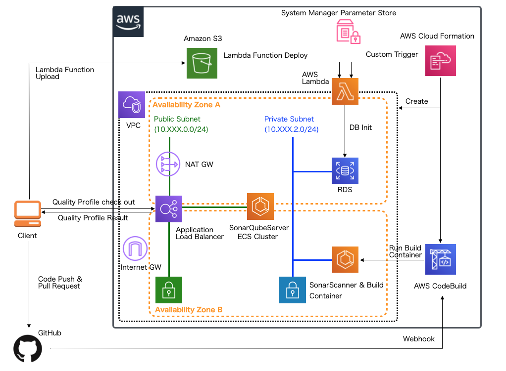

.. include:: ../module.txt

.. _section-automation-infra-devops-cloudformation-21-label:

【第41回】AWS CloudFormationを用いた基盤自動化(21)継続的インテグレーション環境の構築(2)
-------------------------------------------------------------------------------------------------------------------------------------

|br|

本連載では、AWSリソース基盤構築の自動化を実践しています。現在は `第2回 <https://news.mynavi.jp/itsearch/article/devsoft/4463>`_ から解説してきた継続的インテグレーション環境をCloudFormationを使って自動構築しています。

|br|

|br|

前回は、SonarQubeServerのベース環境となるAWSリソース(VPC、セキュリティグループ、ALB、ECSクラスタ)の実装とRDS環境を作成しています。
続く今回は、CloudFormationのカスタムリソースを使って、RDS構築後のデータベースにユーザを追加するLambdaファンクションを実装します。

本連載で実際に作成するアプリケーションでは `GitHub <https://github.com/debugroom/mynavi-sample-sonarqube-aws>`_ 上にコミットしています。
以降に記載するソースコードでは、import文など本質的でない記述を省略している部分があるので、実行コードを作成する際は、必要に応じて適宜GitHubにあるソースコードも参照してください。

なお、今回実装するAWS Lambdaファンクションは以下のランタイム・ライブラリを使って実装するものとします。

|br|

.. list-table::
   :widths: 5, 5

   * - 動作対象
     - バージョン

   * - Java
     - 1.8

   * - Spring Boot
     - 2.3.2.RELEASE

   * - Spring Cloud Function
     - 3.0.8.RELEASE

   * - Spring Cloud AWS
     - 2.2.2.RELEASE

   * - AmazonSDK Lambda Java event
     - 2.0.2

   * - AmazonSDK Lambda Java core
     - 1.1.0

|br|

.. _section-cloudformation-aws-lambda-backed-custom-resource-label:

CloudFormationカスタムリソース(AWS Lambda-backed カスタムリソース)とLambdaファンクションの実装
^^^^^^^^^^^^^^^^^^^^^^^^^^^^^^^^^^^^^^^^^^^^^^^^^^^^^^^^^^^^^^^^^^^^^^^^^^^^^^^^^^^^^^^^^^^^^^^^^^^^^^^^^^^^^^^^^^^^^^^^^^^

|br|

`CloundFormationのカスタムリソース <https://docs.aws.amazon.com/ja_jp/AWSCloudFormation/latest/UserGuide/template-custom-resources.html>`_ とは、
ユーザが任意のリソースタイプ名を定義し、CloudFormationスタックとして利用できる機能です。 `AWS Lambda-backed カスタムリソース <https://docs.aws.amazon.com/ja_jp/AWSCloudFormation/latest/UserGuide/template-custom-resources-lambda.html>`_ は
AWS Lambdaファンクションと関連づけることができるカスタムリソースで、CloudFormationスタックが作成、更新、削除されるたびにLambdaファンクションを呼び出すことができます。

今回は、クラウドネイティブ基本編 `第1回 <https://news.mynavi.jp/itsearch/article/devsoft/4316>`_ でも解説した Spring Cloud Functionや
`第12回 <https://news.mynavi.jp/itsearch/article/devsoft/4426>`_ でも解説したSpring Cloud AWSを使用して、RDSに初期処理を行う(ユーザの作成を行うDDLを実行する)Lambdaファンクションを実装します。
以下の通り、spring-cloud-functionやspring-cloud-starter-aws、DDLを実行するのでJDBC Templateが使えるspring-boot-starter-data-jdbcを含めておいてください。
また、RDSのエンドポイントやパスワードはCloudFormationのスタック情報やSystems Manager Parameter Storeから取得するので、AWS SDKのaws-java-sdk-ssm、aws-java-sdk-core、
Lambdaファンクション実装のためのaws-lambda-java-coreおよび、aws-lambda-java-eventsも必要になります。CloudFormationのスタック情報からデータを取得する実装の詳細は `本連載の第34回 <https://news.mynavi.jp/itsearch/article/devsoft/4948>`_ も適宜参考にしてください。
今回は、設定クラスなど既に解説が行っているものは省略して、差分があるポイントのみ説明していきます。

|br|

.. sourcecode:: xml

   <dependencies>
     <dependency>
        <groupId>org.springframework.boot</groupId>
        <artifactId>spring-boot-starter-data-jdbc</artifactId>
     </dependency>
     <dependency>
        <groupId>org.springframework.cloud</groupId>
        <artifactId>spring-cloud-function-context</artifactId>
     </dependency>
     <dependency>
        <groupId>org.springframework.cloud</groupId>
        <artifactId>spring-cloud-function-adapter-aws</artifactId>
     </dependency>
     <dependency>
        <groupId>org.springframework.cloud</groupId>
        <artifactId>spring-cloud-starter-aws</artifactId>
     </dependency>
     <dependency>
        <groupId>org.springframework.cloud</groupId>
        <artifactId>spring-cloud-starter-aws-jdbc</artifactId>
     </dependency>
     <dependency>
        <groupId>com.amazonaws</groupId>
        <artifactId>aws-lambda-java-events</artifactId>
        <version>2.0.2</version>
     </dependency>
     <dependency>
        <groupId>com.amazonaws</groupId>
        <artifactId>aws-lambda-java-core</artifactId>
        <version>1.1.0</version>
     </dependency>
     <dependency>
        <groupId>com.amazonaws</groupId>
        <artifactId>aws-java-sdk-ssm</artifactId>
        <version>1.11.756</version>
     </dependency>
     <dependency>
        <groupId>com.amazonaws</groupId>
        <artifactId>aws-java-sdk-core</artifactId>
        <version>1.11.756</version>
     </dependency>

|br|

クラウドネイティブ基本編 `第1回 <https://news.mynavi.jp/itsearch/article/devsoft/4316>`_ と同様、HandlerクラスとFunctionクラスを実装します。
これまでのhandleRequest()メソッドは継承クラスのものをオーバーライドするのみでしたが、今回はCloudFormationからの複数のイベントをハンドリングするので以下の通り実装します。

|br|

.. sourcecode:: java

   package org.debugroom.mynavi.sample.sonarqube.initdb.app.handler;

   import com.amazonaws.services.lambda.runtime.Context;
   import lombok.extern.slf4j.Slf4j;
   import org.debugroom.mynavi.sample.sonarqube.initdb.app.CloudFormationResponseSender;
   import org.debugroom.mynavi.sample.sonarqube.initdb.app.model.Status;
   import org.springframework.cloud.function.adapter.aws.SpringBootRequestHandler;
   import reactor.core.publisher.Flux;

   import java.util.Map;
   import java.util.Objects;

   @Slf4j
   public class LambdaTriggerHandler extends
        SpringBootRequestHandler<Map<String, Object>, String> {                                       // (A)

       @Override
       public Object handleRequest(Map<String, Object> event, Context context) {                      // (B)
           for(String key : event.keySet()){
               log.info("[Key]" + key + " [Value]" + event.get(key).toString());                      // (C)
           }
           Object requestType = event.get("RequestType");                                             // (D)
           if(requestType != null && Objects.equals(requestType.toString(), "Delete")){               // (E)
               CloudFormationResponseSender.send(event, context, Status.SUCCESS,
                 event.get("ResourceProperties"), event.get("PhysicalResourceId").toString(), false); // (F)
               return Flux.just("Complete!");                                                         // (G)
           }
           Object result = super.handleRequest(event, context);                                       // (H)
           if(requestType != null && result instanceof Flux){
               CloudFormationResponseSender.send(event, context, Status.SUCCESS,
                 event.get("ResourceProperties"), null, false);                                       // (I)
           }
           return result;
        }

    }

|br|

各実装の詳細は以下の通りです。

|br|

.. list-table:: Handlerクラスで実装する処理
   :widths: 1, 19

   * - 項番
     - 説明

   * - (A)
     - CloudFormationからのイベントを受け取るため、SpringBootRequestHandlerをInput型パラメータとしてMap<String, Object>型を、Output型パラメータとしてStringを指定します。

   * - (B)
     - handleRequest()メソッドをオーバーライドします。CloudFormationからは、スタックの作成、更新、削除といったイベントでLambdaファンクションがコールされるため、イベントに応じて異なる処理を行うように実装します。

   * - (C)
     - イベントのパラメータをログ出力して表示させます。このログはCloudWatchに出力されますが、トラブルシューティング時に必要なデータになります。

   * - (D)
     - イベントの種別を取得します。スタックの作成、更新、削除がそれぞれ"Create"、"Update"、"Delete"に対応します。

   * - (E)
     - スタックを削除する場合の処理を実装します。

   * - (F)
     - イベントのパラメータに含まれているResponseURLに、"SUCCESS"シグナルを送信します。実装の詳細は後述します。この処理がなければ、スタックの削除処理が完了しません。

   * - (G)
     - 処理完了後は適当な文字列を出力します。この文字列はCloudWatch上に出力されるので、完了通知などに利用することができます。

   * - (H)
     - Functionクラスに実装した処理を呼び出します。実装の詳細は後述します。

   * - (I)
     - (H)の実行後、イベントのパラメータに含まれているResponseURLに、"SUCCESS"シグナルを送信します。実装の詳細は後述します。この処理がなければ、スタックの作成・更新処理が完了しません。

|br|

また、CloudFormationにシグナルを送信するためのCloudFormationResponseSenderの実装は以下の通りです。

|br|

.. sourcecode:: java

   package org.debugroom.mynavi.sample.sonarqube.initdb.app;

   import com.amazonaws.services.lambda.runtime.Context;
   import com.fasterxml.jackson.databind.ObjectMapper;
   import com.fasterxml.jackson.databind.PropertyNamingStrategy;
   import lombok.extern.slf4j.Slf4j;
   import org.debugroom.mynavi.sample.sonarqube.initdb.app.model.CfnResponse;
   import org.debugroom.mynavi.sample.sonarqube.initdb.app.model.Status;
   import org.springframework.boot.web.client.RestTemplateBuilder;
   import org.springframework.http.HttpEntity;
   import org.springframework.http.HttpHeaders;
   import org.springframework.http.HttpMethod;
   import org.springframework.http.MediaType;
   import org.springframework.http.converter.json.MappingJackson2HttpMessageConverter;
   import org.springframework.util.LinkedMultiValueMap;
   import org.springframework.util.MultiValueMap;
   import org.springframework.web.client.RestOperations;
   import org.springframework.web.util.UriComponentsBuilder;

   import java.io.UnsupportedEncodingException;
   import java.net.URI;
   import java.net.URLDecoder;
   import java.net.URLEncoder;
   import java.nio.charset.StandardCharsets;
   import java.util.Arrays;
   import java.util.Collections;
   import java.util.Map;

   @Slf4j
   public class CloudFormationResponseSender {

       public static <T> void send(Map<String, Object> event, Context context,
                             Status status, T responseData, String physicalResourceId,
                             boolean noEcho){
           Object responseURL = event.get("ResponseURL");                              // (A)

           ObjectMapper mapper = new ObjectMapper()
             .setPropertyNamingStrategy(PropertyNamingStrategy.UPPER_CAMEL_CASE);      // (B)
           MappingJackson2HttpMessageConverter converter =
             new MappingJackson2HttpMessageConverter();
           converter.setObjectMapper(mapper);
           RestOperations restOperations = new RestTemplateBuilder()
             .messageConverters(Arrays.asList(converter))
             .build();                                                                 // (C)

           if(responseURL != null){
               log.info("ResponseURL : " + responseURL.toString());
               CfnResponse<T> cfnResponse = CfnResponse.<T>builder()
                 .Status(status)
                 .Reason("See the details in CloudWatch Log Stream: " + context.getLogStreamName())
                 .PhysicalResourceId(physicalResourceId == null ?
                         context.getLogStreamName(): physicalResourceId)
                 .StackId(event.get("StackId").toString())
                 .RequestId(event.get("RequestId").toString())
                 .LogicalResourceId(event.get("LogicalResourceId").toString())
                 .NoEcho(noEcho)
                 .Data(responseData)
                 .build();                                                              // (D)

               HttpHeaders headers = new HttpHeaders();
               headers.setContentType(MediaType.APPLICATION_JSON);
               HttpEntity<CfnResponse> requestEntity = new HttpEntity<>(cfnResponse, headers);
               restOperations.exchange(getUri(responseURL.toString()),
                 HttpMethod.PUT, requestEntity, Void.class);                            // (E)
          }else {
              throw new IllegalStateException("No ResponseURL to send.");
          }
       }

       protected static URI getUri(String responseURL){                                 // (F)

           String url = responseURL.split("\\?")[0];
           MultiValueMap<String, String> params = new LinkedMultiValueMap<>();

           try {
               String[] urlParams = responseURL.split("\\?")[1].split("&");
               for(String param : urlParams){
                   String key = param.split("=")[0];
                   String value = URLDecoder.decode(param.split("=")[1], StandardCharsets.UTF_8.toString());
                   params.put(key, Collections.singletonList(URLEncoder.encode(value, "UTF-8")));
               }
           }catch (UnsupportedEncodingException e){
               e.printStackTrace();
           }

           return UriComponentsBuilder.fromHttpUrl(url)
             .queryParams(params)
             .build(true)
             .toUri();
       }
   }

|br|

実装のポイントは以下の通りです。

|br|

.. list-table:: CloudFormationResponseSenderの実装のポイント
   :widths: 1, 19

   * - 項番
     - 説明

   * - (A)
     - インプットパラメータから、ResponseURLを抽出します。

   * - (B)
     - CloudFormationに送信するJSON文字列パラメータの変数は英大文字で始まるため、JacksonのマッパーライブラリのPropertyNamingStrategyをUPPER_CAMEL_CASEに指定します。

   * - (C)
     - (B)を設定したコンバータをセットして、RestOperationsを生成します。

   * - (D)
     - 送信するJSON文字列パラメータを生成します。パラメータの詳細は `AWSドキュメント「cfn-response モジュール」 <https://docs.aws.amazon.com/ja_jp/AWSCloudFormation/latest/UserGuide/cfn-lambda-function-code-cfnresponsemodule.html>`_ を参考にしてください。

   * - (E)
     - ResponseURLに対し、(D)のパラメータやHTTPヘッダを付与して、PUTメソッドでリクエストを送信します。

   * - (F)
     - 既にURLエンコードされたResponseURLが2重エンコードにならないよう、パラメータを分解して取得し直してからURIを再作成します。

|br|

.. warning:: 使用する通信ライブラリによっては、既にURLエンコードされた文字列を２重にエンコードして無効なリクエストになってしまう場合があるため、ライブラリの仕様に注意して実装する必要があります。

|br|

また、Handlerから呼び出されるFunctionクラスの実装は以下の通りです。JdbcTemplateを使ってDDLをRDSに対して実行します。パスワードなどの秘匿データはSystemsManager ParameterStoreから取得する実装にしています。

|br|

.. sourcecode:: java

   package org.debugroom.mynavi.sample.sonarqube.initdb.app.function;

   import com.amazonaws.services.simplesystemsmanagement.AWSSimpleSystemsManagement;
   import com.amazonaws.services.simplesystemsmanagement.model.GetParameterRequest;
   import lombok.extern.slf4j.Slf4j;
   import org.springframework.beans.factory.annotation.Autowired;
   import org.springframework.jdbc.core.JdbcTemplate;
   import reactor.core.publisher.Flux;

   import java.util.Map;
   import java.util.function.Function;

   @Slf4j
   public class InitDBFunction implements Function<Map<String, Object>, Flux<String>> {

       @Autowired
       private JdbcTemplate jdbcTemplate;

       @Autowired
       AWSSimpleSystemsManagement awsSimpleSystemsManagement;

       @Override
       public Flux<String> apply(Map<String, Object> stringObjectMap) {
           GetParameterRequest request = new GetParameterRequest();
           request.setName("mynavi-sonarqube-rds-sonar-password");
           request.setWithDecryption(true);
           jdbcTemplate.execute("CREATE ROLE sonar WITH LOGIN PASSWORD '"
             + awsSimpleSystemsManagement.getParameter(request).getParameter().getValue()
             + "';");
           return Flux.just("Complete!");
       }
   }

|br|

第一回のやり方と同じく、実装したソースコードをLambdaファンクションとしてビルドして、前回作成したS3バケットにアップロードするシェルスクリプトを作成して実行します。

|br|

.. sourcecode:: bash

   #!/usr/bin/env bash

   bucket_name=debugroom-mynavi-sonarqube-cfn-lambda-bucket
   stack_name="mynavi-sonarqube-s3-lambda"
   template_path="rds/1-s3-lambda-deploy-cfn.yml"
   s3_objectkey="mynavi-sample-sonarqube-initdb-0.0.1-SNAPSHOT-aws.jar"

   if [ "" == "`aws s3 ls | grep $bucket_name`" ]; then
       aws cloudformation deploy --stack-name ${stack_name} --template-file ${template_path} --capabilities CAPABILITY_IAM
   fi

   cd rds/lambda-sonarqube-dbinit
   ./mvnw package
   aws s3 cp target/${s3_objectkey} s3://${bucket_name}/

|br|

今回はRDSへの初期化処理を行うLambdaファンクションを実装して、S3へアップロードしました。次回はLambdaデプロイやカスタムリソースを実行するCloudFormationテンプレートを実装します。

|br|

著者紹介
^^^^^^^^^^^^^^^^^^^^^^^^^^^^^^^^^^^^^^^^^^^^^^^^^^^^^^^^^^^^^^^^^^^^^^^^^^^^^^^^^^^^^^^^^^^^^^^^^^^^^^^^^^^^^^^

川畑 光平(KAWABATA Kohei) - NTTデータ 課長代理

.. figure:: img/automation_infra_devops_overview/pic_image01.jpg

金融機関システム業務アプリケーション開発・システム基盤担当を経て、現在はソフトウェア開発自動化関連の研究開発・推進に従事。

Red Hat Certified Engineer、Pivotal Certified Spring Professional、AWS Certified Solutions Architect Professional等の資格を持ち、アプリケーション基盤・クラウドなど様々な開発プロジェクト支援にも携わる。

`2019 APN AWS Top Engineers & Ambassadors <https://aws.amazon.com/jp/blogs/psa/japan-apn-ambassador-2019/>`_ 選出。
