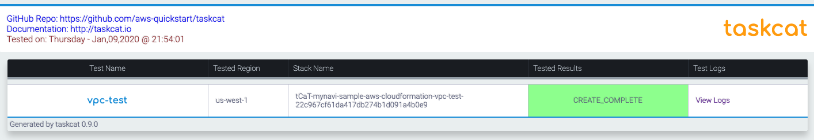
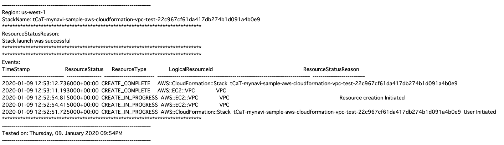

.. include:: ../module.txt

.. _section-automation-infra-devops-cloudformation-5-label:

基盤・デプロイ自動化実践
==================================================================

マイクロサービスアーキテクチャの基盤・デプロイ自動化
-------------------------------------------------------------------------------------------------------------------------------------

|br|

本連載では、以下のイメージの構成のようなマイクロサービスアーキテクチャにおける、基盤自動化環境の構築を実践していきます。

|br|

.. figure:: img/automation_infra_devops_overview/MicroServiceArchitecture.png

|br|　

前回は、CloudFormationテンプレートの簡単なサンプルを作成し、テンプレート記述の基本を解説した上で、実行するためのヘルパースクリプトや実行エラーの確認方法等を説明しました。
今回は、AWSから提供されているマルチリージョンで複数のテンプレートのテスト実行が同時に可能なオープンソースツール「taskcat」を使って、作成したテンプレートをテストする環境を構築し、結果を出力する方法の解説を進めていきます。
なお、実際のソースコードは `GitHub <https://github.com/debugroom/mynavi-sample-cloudformation>`_ 上にコミットしています。
ソースコード中で本質的でない記述を一部省略しているので、実行コードを作成する場合は、必要に応じて適宜GitHub上のソースコードも参照してください。

また、「taskcat」実行環境は以下のバージョンで実施しています。バージョンの差異により実行するコマンドが異なる場合がありますのでご留意ください。

|br|

.. list-table::
   :widths: 5, 5

   * - 動作対象
     - バージョン

   * - MacOS Mojave
     - 10.14.16

   * - Python
     - 3.6.5

   * - pip
     - 10.0.1

   * - taskcat
     - 0.9.8

|br|

.. _section-cloudformation-taskcat-overview-label:

taskcatの概要
^^^^^^^^^^^^^^^^^^^^^^^^^^^^^^^^^^^^^^^^^^^^^^^^^^^^^^^^^^^^^^^^^^^^^^^^^^^^^^^^^^^^^^^

|br|

taskcatはAWS Quickstart Teamが提供しているCloudFormationテンプレートをテストするオープンソースのツールです。
複数のリージョンで複数のテンプレートを任意にテスト実行でき、テストパラメータ等も細かく設定しながら、正常/失敗終了したかどうかレポートを証跡としてHTML出力することができます。
taskcatでは、指定したリージョンのAWS環境で実際にスタックを構築し、テスト実行しますが、終了後は自動的にスタックは削除される形になります。

taskcat自体はPythonを使って実装されたツールですが、2020年1月現在でサポートされているのは、Pythonおよびパッケージ管理ツールであるpipがインストールされたMacOSXもしくはLinuxOSが対象です。
Windowsはサポートされていませんが、`Windows Subsystem for Linux(WSL) <https://docs.microsoft.com/en-us/windows/wsl/about>`_ がインストールされたWindows10環境であれば、LinuxOSと同様の手順で実行が可能です。
また、将来的にはdockerを使った実行環境の提供も予定されているようです。

|br|

.. _section-cloudformation-taskcat-install-label:

事前準備：taskcatのインストールと認証情報の設定
^^^^^^^^^^^^^^^^^^^^^^^^^^^^^^^^^^^^^^^^^^^^^^^^^^^^^^^^^^^^^^^^^^^^^^^^^^^^^^^^^^^^^^^

|br|

`taskcatの公式手順 <https://github.com/aws-quickstart/taskcat>`_ と全く同じになりますが、ここでは、MacOSXにPython3およびpip3がインストールされていることを前提にtaskcatをインストールしてみましょう。
taskcatのインストールはpip3を使って実行でき、非常に簡単です。

|br|

.. sourcecode:: none

   # pip3 install taskcat --user

   Collecting taskcat
   Downloading https://files.pythonhosted.org/packages/fe/a7/cc58c276c77b0e15529fcf5d67d2f3004deed8003667b6dec50e76d6138f/taskcat-0.9.8-py3-none-any.whl (73kB)
   100% |████████████████████████████████| 81kB 2.4MB/s

   // omit

   Successfully installed backports.shutil-get-terminal-size-1.0.0 dataclasses-0.7 dataclasses-jsonschema-2.12.0 docker-3.7.3 dulwich-0.19.14 mock-2.0.0 mypy-extensions-0.4.3 pbr-5.4.4 reprint-0.5.2 requests-2.22.0 tabulate-0.8.6 taskcat-0.9.8 typing-extensions-3.7.4.1

|br|

.. warning:: 公式の手順では--userオプションがない手順も紹介されていますが、これはAdministrator権限を持つrootユーザがインストールする場合です。MacOSXではユーザディレクトリ側にインストールするよう--userオプションを使用しましょう。

|br|

インストールが完了したらtaskcat --verisonコマンドを実行してみます。バナーのアスキーアートとバージョンが表示されれば無事インストールされています。

|br|

.. sourcecode:: none

   # taskcat --version
    _            _             _
   | |_ __ _ ___| | _____ __ _| |_
   | __/ _` / __| |/ / __/ _` | __|
   | || (_| \__ \   < (_| (_| | |_
   \__\__,_|___/_|\_\___\__,_|\__|

   version 0.9.8
   0.9.8

|br|

なお、taskcatではCloudFormationを実行する中でAWS認証情報を使用するので、:ref:`section-amazon-cli-overview-label` の時と同様、認証情報を~/.aws/Credential配下に保存しておいてください。

|br|

.. _section-cloudformation-taskcat-execution-label:

taskcatの設定とテスト実行
^^^^^^^^^^^^^^^^^^^^^^^^^^^^^^^^^^^^^^^^^^^^^^^^^^^^^^^^^^^^^^^^^^^^^^^^^^^^^^^^^^^^^^^
|br|

環境構築が終わったところで、　前回「 :ref:`section-cloudformation-basic-sample-label` 」で、サンプルとして作成した、下記のようなVPCを構築するテンプレートをテストしてみましょう。

|br|

.. sourcecode:: none

   AWSTemplateFormatVersion: '2010-09-09'

   Description: Sample CloudFormation template with YAML - VPC

   Parameters:
     VPCName:
       Description: Target VPC Stack Name
       Type: String
       MinLength: 1
       MaxLength: 255
       AllowedPattern: ^[a-zA-Z][-a-zA-Z0-9]*$
       Default: mynavi-sample-cloudformation-vpc
     VPCCiderBlock:
       Description: CiderBlock paramater for VPC
       Type: String
       MinLength: 9
       MaxLength: 18
       AllowedPattern: (\d{1,3})\.(\d{1,3})\.(\d{1,3})\.(\d{1,3})/(\d{1,2})
       Default: 172.0.0.0/16

   Resources:
     VPC:
       Type: AWS::EC2::VPC
       Properties:
         CidrBlock: !Sub ${VPCCiderBlock}
         InstanceTenancy: default
         EnableDnsSupport: true
         EnableDnsHostnames: true
         Tags:
           - Key: Name
             Value: !Sub ${VPCName}

   Outputs:
     VPCID:
       Description: VPC ID
       Value: !Ref VPC
       Export:
         Name: !Sub ${AWS::StackName}-VPCID

|br|

テンプレートを作成したプロジェクトのルートと同じディレクトリに「 .taskcat.yml 」という名前の設定ファイルを作成します。以下のサンプルでは最低限実行に必要なシンプルな設定で構成します。

|br|

.. sourcecode:: none

   project:                                   #(1)
     name: sample-aws-cloudformation          #(2)
     regions:
       - us-west-1                            #(3)
   tests:                                     #(4)
     vpc-test:                                #(5)
       template: ./test-cfn.yaml              #(6)

|br|

なお、設定ファイルはユーザルートディレクトリに配置するグローバルな設定ファイルと、プロジェクトごとに作成する設定ファイル２種類同じ名前で存在し、各々設定が異なります。
指定可能なパラメータは `taskcat GitHubページのConfigFiles <https://github.com/aws-quickstart/taskcat#config-files>`_ を参照してください。最小限の設定ファイルのポイントは(1)〜(6)の通りです。

|br|

.. list-table:: .taskcat.yml設定ファイル記述のポイント
   :widths: 1, 9

   * - 記述
     - 説明

   * - (1)
     - Project要素配下にはプロジェクトに関する固有の設定を行います。

   * - (2)
     - Project/Name要素にはプロジェクト名称を設定します。アウトプットをS3にアップロードするときはキープレフィクスとして使用されます。

   * - (3)
     - Project/regions要素には、テストを実行するAWSリージョン識別子を配列で指定します。

   * - (4)
     - tests要素配下には実行する各テストに関する固有の設定を行います。

   * - (5)
     - テストの論理名を任意に設定します。論理名を複数設定することで異なるテストを実行することができます。

   * - (6)
     - tests/論理名/template要素には、テスト対象のCloudFormationテンプレートを指定します。

|br|

設定ファイルを作成したのち、プロジェクトのルートディレクトリで下記のコマンドを実行します。

|br|

.. sourcecode:: none

   # taskcat test run

    _            _             _
   | |_ __ _ ___| | _____ __ _| |_
   | __/ _` / __| |/ / __/ _` | __|
   | || (_| \__ \   < (_| (_| | |_
   \__\__,_|___/_|\_\___\__,_|\__|

   version 0.9.8
   [INFO   ] : Lint passed for test vpc-test on template /Users/xxxxxx/mynavi-sample-aws-cloudformation/test-cfn.yml
   [S3: -> ] s3://tcat-mynavi-sample-aws-cloudforma4u25doz5/mynavi-sample-aws-cloudformation/sample-vpc-cfn.yml
   [S3: -> ] s3://tcat-mynavi-sample-aws-cloudforma4u25doz5/mynavi-sample-aws-cloudformation/taskcat-test.sh
   [S3: -> ] s3://tcat-mynavi-sample-aws-cloudforma4u25doz5/mynavi-sample-aws-cloudformation/sample-sg-cfn.yml
   [S3: -> ] s3://tcat-mynavi-sample-aws-cloudforma4u25doz5/mynavi-sample-aws-cloudformation/test-cfn.yml
   [S3: -> ] s3://tcat-mynavi-sample-aws-cloudforma4u25doz5/mynavi-sample-aws-cloudformation/create-stack.sh
   [S3: -> ] s3://tcat-mynavi-sample-aws-cloudforma4u25doz5/mynavi-sample-aws-cloudformation/delete-stack.sh
   [INFO   ] : ┏ stack Ⓜ tCaT-mynavi-sample-aws-cloudformation-vpc-test-22c967cf61da417db274b1d091a4b0e9
   [INFO   ] : ┣ region: us-west-1
   [INFO   ] : ┗ status: CREATE_COMPLETE
   [INFO   ] : Collecting CloudFormation Logs
   [INFO   ] : Collecting logs for tCaT-mynavi-sample-aws-cloudformation-vpc-test-22c967cf61da417db274b1d091a4b0e9
   [INFO   ] : 	 |StackName: tCaT-mynavi-sample-aws-cloudformation-vpc-test-22c967cf61da417db274b1d091a4b0e9
   [INFO   ] : 	 |Region: us-west-1
   [INFO   ] : 	 |Logging to: /Users/xxxxxx/mynavi-sample-aws-cloudformation/taskcat_outputs/tCaT-mynavi-sample-aws-cloudformation-vpc-test-22c967cf61da417db274b1d091a4b0e9-us-west-1-cfnlogs.txt
   [INFO   ] : 	 |Tested on: Thursday, 09. January 2020 09:54PM
   [INFO   ] : ------------------------------------------------------------------------------------------
   [INFO   ] : ResourceStatusReason:
   [INFO   ] : Stack launch was successful
   [INFO   ] : ==========================================================================================
   [INFO   ] : Reporting on arn:aws:cloudformation:us-west-1:YYYYYYYYY:stack/tCaT-mynavi-sample-aws-cloudformation-vpc-test-22c967cf61da417db274b1d091a4b0e9/f20ba780-32de-11ea-966b-06aba12266cd
   [INFO   ] : Deleting stack: arn:aws:cloudformation:us-west-1:YYYYYYYYY:stack/tCaT-mynavi-sample-aws-cloudformation-vpc-test-22c967cf61da417db274b1d091a4b0e9/f20ba780-32de-11ea-966b-06aba12266cd
   [INFO   ] : ┏ stack Ⓜ tCaT-mynavi-sample-aws-cloudformation-vpc-test-22c967cf61da417db274b1d091a4b0e9
   [INFO   ] : ┣ region: us-west-1
   [INFO   ] : ┗ status: DELETE_COMPLETE
   Not in terminal, reprint now using normal build-in print function.

         ┏ stack Ⓜ tCaT-mynavi-sample-aws-cloudformation-vpc-test-22c967cf61da417db274b1d091a4b0e9
         ┣ region: us-west-1
         ┗ status: CREATE_IN_PROGRESS
         ┏ stack Ⓜ tCaT-mynavi-sample-aws-cloudformation-vpc-test-22c967cf61da417db274b1d091a4b0e9
         ┣ region: us-west-1
         ┗ status: CREATE_IN_PROGRESS
         ┏ stack Ⓜ tCaT-mynavi-sample-aws-cloudformation-vpc-test-22c967cf61da417db274b1d091a4b0e9
         ┣ region: us-west-1
         ┗ status: CREATE_IN_PROGRESS
         ┏ stack Ⓜ tCaT-mynavi-sample-aws-cloudformation-vpc-test-22c967cf61da417db274b1d091a4b0e9
         ┣ region: us-west-1
         ┗ status: CREATE_IN_PROGRESS
         ┏ stack Ⓜ tCaT-mynavi-sample-aws-cloudformation-vpc-test-22c967cf61da417db274b1d091a4b0e9
         ┣ region: us-west-1
         ┗ status: CREATE_IN_PROGRESS
         ┏ stack Ⓜ tCaT-mynavi-sample-aws-cloudformation-vpc-test-22c967cf61da417db274b1d091a4b0e9
         ┣ region: us-west-1
         ┗ status: CREATE_IN_PROGRESS
         ┏ stack Ⓜ tCaT-mynavi-sample-aws-cloudformation-vpc-test-22c967cf61da417db274b1d091a4b0e9
         ┣ region: us-west-1
         ┗ status: DELETE_IN_PROGRESS
         ┏ stack Ⓜ tCaT-mynavi-sample-aws-cloudformation-vpc-test-22c967cf61da417db274b1d091a4b0e9
         ┣ region: us-west-1
         ┗ status: DELETE_IN_PROGRESS
         ┏ stack Ⓜ tCaT-mynavi-sample-aws-cloudformation-vpc-test-22c967cf61da417db274b1d091a4b0e9
         ┣ region: us-west-1
         ┗ status: DELETE_IN_PROGRESS
         ┏ stack Ⓜ tCaT-mynavi-sample-aws-cloudformation-vpc-test-22c967cf61da417db274b1d091a4b0e9
         ┣ region: us-west-1
         ┗ status: DELETE_IN_PROGRESS
         ┏ stack Ⓜ tCaT-mynavi-sample-aws-cloudformation-vpc-test-22c967cf61da417db274b1d091a4b0e9
         ┣ region: us-west-1
         ┗ status: DELETE_IN_PROGRESS
         ┏ stack Ⓜ tCaT-mynavi-sample-aws-cloudformation-vpc-test-22c967cf61da417db274b1d091a4b0e9
         ┣ region: us-west-1
         ┗ status: DELETE_IN_PROGRESS

|br|

.. warning:: 2020年1月現在のtaskcatの最新バージョンは0.9.8ですが、バージョン0.8.x以前とは実行コマンドも設定ファイルの記述要領も異なります。詳細は `taskcat GitHub Migrating from 0.8 <https://github.com/aws-quickstart/taskcat#migrating-from-08x>`_ も参照してください。

|br|

実行結果ログを見ると、指定したリージョンでスタックが正常に作成された後、レポートが作成され、プロジェクトルートにtaskcat_outputsディレクトリができて証跡が格納されたことが分かります。その後、スタックは削除されています。
HTML形式で出力される証跡は以下のようなイメージです。

|br|

|br|

続いて、パラメータを変更してテスト実行してみましょう。tests/vpc-test要素配下にparameters要素を作り、パラメータをハッシュ形式で指定します。

|br|

.. sourcecode:: none

   project:                                   #(1)
     name: sample-aws-cloudformation          #(2)
     regions:
       - us-west-1                            #(3)
   tests:                                     #(4)
     vpc-test:                                #(5)
       parameters:
         VPCCiderBlock: 172.255.0.0/16        # New!
       template: ./test-cfn.yaml              #(6)

|br|

再びコマンドを実行すると、パラメータが変更されてスタックが構築されていることがわかります。下記はテスト実行中に作成されたVPCをマネジメントコンソールから確認した際のイメージです。

|br|

.. figure:: img/automation_infra_devops_cloudformation/management_console_vpc_confirm_taskcat_test.png

|br|

.. note:: テストが完了するとスタックは削除されてしまうため、どのようなパラメータでリソースが作成されたのか後から確認したい場合は、CloudTrailで、スタック構築の中で発生したイベントを取得して確認すると良いでしょう。

   .. figure:: img/automation_infra_devops_cloudformation/management_console_cloudtrail_confirm_taskcat_test-1.png

   .. figure:: img/automation_infra_devops_cloudformation/management_console_cloudtrail_confirm_taskcat_test-2.png

|br|

このように、taskcatを使用すると、本番と同様に、複数の別のリージョンで、複数のテンプレートの、複数のテストケースを任意に実行し、結果をエビデンスとして残すことが可能です。
加えて、taskcatのようにCloudFormationテンプレートの自動テストが可能なツールがあることは、テンプレートコード自体をCI/CDの対象として管理し、運用することを可能にします。
CodeBuildやCodePipelineを使ったCloudFormationテンプレートのCI/CD環境の構築方法については、以降の連載の中で扱います。

|br|

さて、次回以降は、いよいよ「クラウドネイティブアプリケーションの基本」などこれまでの連載でコンソール上から手動で構築してきた、以下のようなAWSリソースを、実際にCloudFormationを使って構築するテンプレートの解説を進めていきます。

|br|

.. figure:: img/automation_infra_devops_cloudformation/cloudformation-scope.png

|br|

次回は、前回作成したVPCに加え、パブリック・プライベートサブネット、ルートテーブルおよびインターネットゲートウェイを構築するスタックテンプレートの解説です。

|br|

著者紹介
------------------------------------------------------------------

川畑 光平(KAWABATA Kohei) - NTTデータ 課長代理

.. figure:: img/automation_infra_devops_overview/pic_image01.jpg

金融機関システム業務アプリケーション開発・システム基盤担当を経て、現在はソフトウェア開発自動化関連の研究開発・推進に従事。

Red Hat Certified Engineer、Pivotal Certified Spring Professional、AWS Certified Solutions Architect Professional等の資格を持ち、アプリケーション基盤・クラウドなど様々な開発プロジェクト支援にも携わる。

`2019 APN AWS Top Engineers & Ambassadors <https://aws.amazon.com/jp/blogs/psa/japan-apn-ambassador-2019/>`_ 選出。
