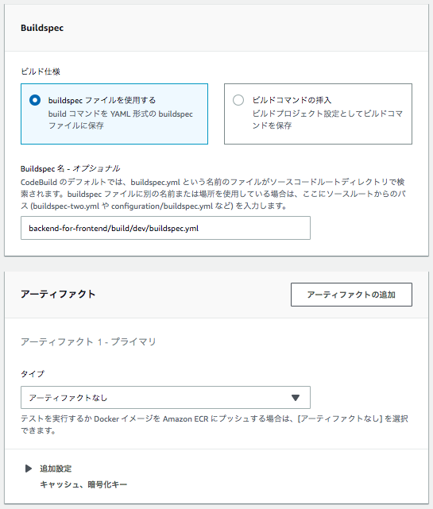

.. include:: ../module.txt

.. _section-automation-infra-devops-codebuild-label:

基盤・デプロイ自動化実践
==================================================================

マイクロサービスアーキテクチャの基盤・デプロイ自動化
-------------------------------------------------------------------------------------------------------------------------------------

|br|

本連載では、以下のイメージに沿って「CodeBuild」「SonarQube」を使った継続的インテグレーション(CI：Continuous integration)環境を実際に構築しています。|br|

.. figure:: img/automation_infra_devops_actual_experience/sample-continuous-integration.png
   :scale: 100%

|br|

前回は、AWSから提供されている、buildspec.ymlの挙動をローカル端末で確認できるCodeBuild Local環境を構築し、環境変数を一元管理するAWS Sysmtes Managerを設定して、buildspec.ymlを作成して検証しました。
続く今回は、AWS CodeBuildを設定し、GitHubへのプッシュやプルリクエストに対して、CodeBuildを実行するよう設定してみます。

|br|

.. _section-codebuild-create-security-group-label:

事前準備：セキュリティグループの作成
^^^^^^^^^^^^^^^^^^^^^^^^^^^^^^^^^^^^^^^^^^^^^^^^^^^^^^^^^^^^^^^^^^^^^^^^^^^^^^^^^^^^^^^

|br|

事前準備として、CodeBuildが実行するビルド環境のコンテナイメージに適用するセキュリティグループを、「VPC」サービスで作成しておきましょう。
ビルドに必要なソフトウェアやGitHubへソースコードを取得するための任意のアウトバウンド許可設定があれば、特にインバウンド許可は必要ありません。

|br|

|br|

.. figure:: img/automation_infra_devops_codebuild/management_console_vpc_create_security_group_2.png
   :scale: 100%

|br|

.. _section-codebuild-setting-codebuild-label:

CodeBuildの設定
^^^^^^^^^^^^^^^^^^^^^^^^^^^^^^^^^^^^^^^^^^^^^^^^^^^^^^^^^^^^^^^^^^^^^^^^^^^^^^^^^^^^^^^

|br|

AWSコンソールメニューから、「CodeBuild」サービスを選択し、「プロジェクトの作成」ボタンを押下します。

|br|

.. figure:: img/automation_infra_devops_codebuild/management_console_codebuild_create_project_bff_1.png
   :scale: 100%

|br|

CodeBuildの主な設定項目は以下の通りです。説明に記載の要領に従って入力したのち、「ビルドプロジェクトを作成する」ボタンを押下してください。
なお、各項目の必須は `CodeBuildでビルドプロジェクトを作成する <https://docs.aws.amazon.com/ja_jp/codebuild/latest/userguide/create-project.html#create-project-console>`_ にある表を参考にしてください。

|br|

.. list-table:: CodeBuildの設定
   :widths: 2, 3, 7

   * - 入力箇所
     - 項目
     - 説明

   * - プロジェクトの設定
     - プロジェクト名
     - ビルドの単位でプロジェクト名を記載します。

   * -
     - ビルドバッジ
     - ビルドバッジはビルドステータスを個別定義・明示化するオプションです。詳細は `ビルドバッジサンプル <https://docs.aws.amazon.com/ja_jp/codebuild/latest/userguide/sample-build-badges.html>`_ を参照してください。

   * -
     - 追加設定：タグ
     - AWSサービスで使用するタグの名前と値を入力します。

   * - 送信元
     - ソースプロバイダ
     - ソースコードが格納されているプロバイダを提供します。AmazonS3、CodeCommit、Bitbucket、GitHub、GitHub Enterpriseから選択可能です。以降はGitHubを選択した場合の設定要領を記載します。

   * -
     - レポジトリ
     - パブリックレポジトリか特定のGitHubアカウントのレポジトリかを選択します。特定のGitHubアカウントは初回OAuth認証により接続します。

   * -
     - GitHubレポジトリ
     - GitHubアカウントのレポジトリを選択した場合、プルダウンでレポジトリを指定します。

   * -
     - 追加設定：Gitクローンの深さ
     - コミットされた最新履歴からのバージョンの数を指定します。最新は1で、直前のコミットは2と順次続きます。全てはFULLです。

   * -
     - 追加設定：Gitサブモジュール
     - Gitのサブモジュール機能(別の外部プロジェクト)を含む場合、「Gitサブモジュールを使用する」を選択します。

   * - プライマリリソースのウェブフックイベント
     - ウェブフック
     - レポジトリへのコードプッシュ時やプルリクエスト実行時にビルドを実行する場合チェックします。詳細は次節にて詳述します。

   * - 環境
     - 環境イメージ
     - ビルドを実行するコンテナイメージを指定します。デフォルトではUbuntuが使われます。

   * -
     - ランタイム※マネージド型イメージの場合
     - ビルドコンテナの種別を選択します。Strandardのみ選択が可能です。

   * -
     - イメージ※マネージド型イメージの場合
     - コンテナイメージのバージョンを選択します。2019年6月では1.0もしくは2.0が選択可能です。

   * -
     - サービスロール
     - CodeBuildの実行に必要なポリシーをアタッチしたサービスロールを設定します。複数のビルドプロジェクトで関連付けが可能ですが、最大10のビルドプロジェクトまでしか関連付けができないので注意が必要です。

   * -
     - 追加設定：タイムアウト
     - ビルド処理にかかるタイムアウト時間を設定します。デフォルト1時間です。

   * -
     - 追加設定：キュータイムアウト
     - ビルドをキューに入れてからタイムアウトするまでの時間を設定します。

   * -
     - 追加設定：証明書
     - GitHub Enterpriseなどで証明書をインストールしている場合にアクセス許可するための証明書を設定します。

   * -
     - 追加設定：コンピューティング
     - ビルドするコンテナの処理スペックを選択します。

   * -
     - 追加設定：VPC
     - ビルドコンテナからアクセスするVPCを設定します。

   * -
     - 追加設定：環境変数
     - コンテナイメージへ設定したい環境変数を設定します。

   * - Buildspec
     - ビルド仕様
     - ビルド処理仕様としてbuildspec.ymlからコマンドを設定として入力するか選択します。

   * -
     - buildspec名
     - デフォルトではソースコードのルートディレクトリにあるbuildspec.ymlが選択されますが、別の名前や場所を使用している場合に入力します。

   * - アーティファクト
     - タイプ
     - ビルド実行時に生成されるアプリケーションを出力する方式を選択します。S3か、コンテナイメージを作成する場合、なしを選択します。

   * -
     - 追加設定:暗号キー
     - アーティファクトを暗号化する場合に使用されるAWS KMSカスタマーマスターキーを指定します。

   * -
     - 追加設定:キャッシュタイプ
     - アーティファクトをキャッシュする場合に選択します。S3もしくはローカルが選択可能です。

   * - ログ
     - CloudWatch Logs
     - CloudWatch Logsにビルド時の出力ログをアップロードするか選択します。

   * -
     - グループ名
     - CloudWatch Logsのグループ名を指定します。

   * -
     - ストリーム名
     - CloudWatch Logsのストリーム名を指定します。

|br|

.. figure:: img/automation_infra_devops_codebuild/management_console_codebuild_create_project_bff_2.png
   :scale: 100%

|br|

|br|

.. figure:: img/automation_infra_devops_codebuild/management_console_codebuild_create_project_bff_4.png
   :scale: 100%

|br|

.. figure:: img/automation_infra_devops_codebuild/management_console_codebuild_create_project_bff_5.png
   :scale: 100%

|br|

.. figure:: img/automation_infra_devops_codebuild/management_console_codebuild_create_project_bff_6.png
   :scale: 100%

|br|

|br|

.. figure:: img/automation_infra_devops_codebuild/management_console_codebuild_create_project_bff_8.png
   :scale: 100%

|br|

早速ビルドの実行と行きたいところですが、その前にAWS Systems Manager ParameterStoreへアクセスするための権限設定を追加で実施する必要があります。
|br|

.. _section-codebuild-iam-setting-ssm-label:

AWS Systems Manager Parameter Storeへのアクセス権限の付与
^^^^^^^^^^^^^^^^^^^^^^^^^^^^^^^^^^^^^^^^^^^^^^^^^^^^^^^^^^^^^^^^^^^^^^^^^^^^^^^^^^^^^^^

|br|

前回設定したAWS Systems Manager Parameter Storeで定義したデータを参照するのに、アクセス権限を付与しておかなければ実行エラーとなるため、
前節で作成されるサービスロールにSystems Managerのアクセス権限を割り当てておきます。

AWSコンソールで、「IAM」サービスから「ロール」メニューを選択し、作成したポリシーに対して、以下の通り、「AmazonSSMFullAccess」のポリシーをアタッチしてください。

|br|

.. figure:: img/automation_infra_devops_codebuild/management_console_iam_attach_ssm_access.png
   :scale: 100%

|br|

.. _section-codebuild-build-execution-label:

Buildの実行とGitHubのWebHook設定
^^^^^^^^^^^^^^^^^^^^^^^^^^^^^^^^^^^^^^^^^^^^^^^^^^^^^^^^^^^^^^^^^^^^^^^^^^^^^^^^^^^^^^^

|br|

アクセス権限の付与が完了したら、早速ビルドを実行してみましょう。「ビルドの開始」ボタンを押下し、buildspec.ymlに記載された各フェーズやログが出力されることを確認します。

|br|

.. figure:: img/automation_infra_devops_codebuild/management_console_codebuild_build_execution_1.png
   :scale: 100%

|br|

.. figure:: img/automation_infra_devops_codebuild/management_console_codebuild_build_execution_2.png
   :scale: 100%

|br|

ビルドが正常に実行できることを確認したら、次はプルリクエストや特定のブランチに対するプッシュを契機に上記のビルド処理が実行されるよう、
CodeBuildのWebhookやGitHubのWebhookの設定を行います。今回は以下のような条件でビルド処理が実行されるように設定してみましょう。

|br|

著者紹介
------------------------------------------------------------------

川畑 光平(KAWABATA Kohei) - NTTデータ 課長代理

.. figure:: img/automation_infra_devops_overview/pic_image01.jpg
   :scale: 100%

金融機関システム業務アプリケーション開発・システム基盤担当を経て、現在はソフトウェア開発自動化関連の研究開発・推進に従事。

Red Hat Certified Engineer、Pivotal Certified Spring Professional、AWS Certified Solutions Architect Professional等の資格を持ち、アプリケーション基盤・クラウドなど様々な開発プロジェクト支援にも携わる。

`2019 APN AWS Top Engineers & Ambassadors <https://aws.amazon.com/jp/blogs/psa/japan-apn-ambassador-2019/>`_ 選出。
