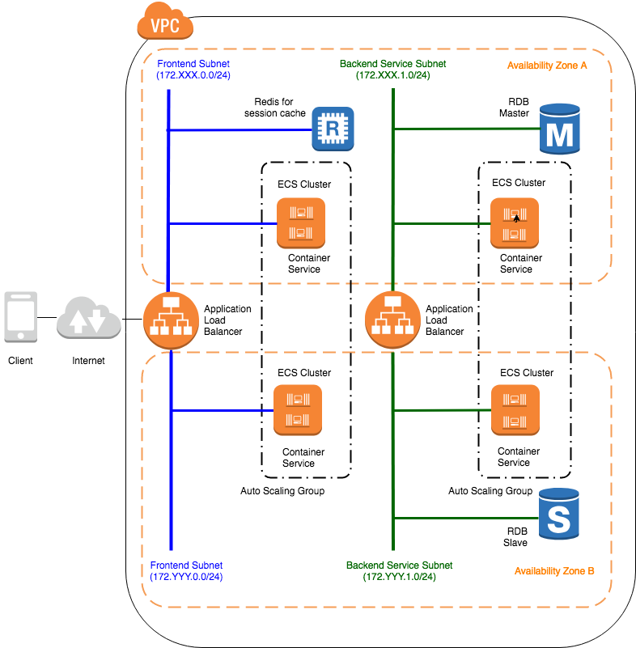
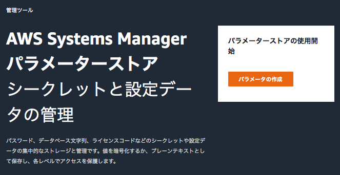
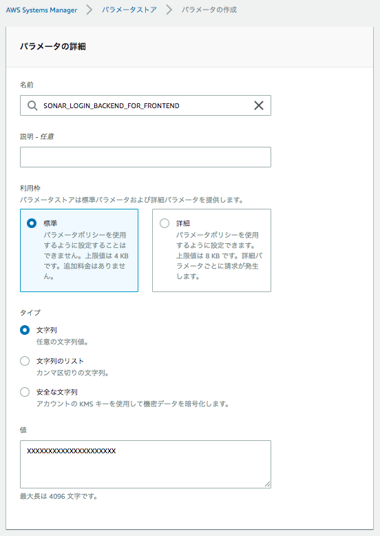

.. include:: ../module.txt

.. _section-automation-infra-devops-codebuild-local-label:

基盤・デプロイ自動化実践
==================================================================

マイクロサービスアーキテクチャの基盤・デプロイ自動化
-------------------------------------------------------------------------------------------------------------------------------------

|br|

.. _section-automation-infra-devops-continuous-integration-automation-using-codebuild-1-label:

AWS CodeBuildを用いた継続的インテグレーション自動化1
^^^^^^^^^^^^^^^^^^^^^^^^^^^^^^^^^^^^^^^^^^^^^^^^^^^^^^^^^^^^^^^^^^^^^^^^^^^^^^^^^^^^^^^

|br|

本連載では、以下のイメージに沿って「CodeBuild」「SonarQube」を使った継続的インテグレーション(CI：Continuous integration)環境を実際に構築しています。|br|

.. figure:: img/automation_infra_devops_actual_experience/sample-continuous-integration.png

|br|

前回までに、以下のイメージに沿った、マイクロサービスアプリケーションや、それを呼び出すWebアプリケーションの単体・結合・E2E(EndToEnd)テストのコードを実装しました。

|br|

|br|

続く今回は、GitHubにプッシュしたこのアプリケーションのソースコードやテストコードをAWS CodeBuildを使ってビルド・テストを行った後、カバレッジなどのソースコードメトリクスをスキャンした結果をSonarQuberServerへ連携する環境(最初のイメージの(3)〜(6))の構築を進めていきます。

|br|

.. _section-codebuild-setting-codebuild-overview-label:

CodeBuildの概要
^^^^^^^^^^^^^^^^^^^^^^^^^^^^^^^^^^^^^^^^^^^^^^^^^^^^^^^^^^^^^^^^^^^^^^^^^^^^^^^^^^^^^^^

|br|

AWS CodeBuildはクラウドでアプリケーションのビルドを行う従量課金型サービスです。
ビルドの元になるソースコードはS3に保存したものに加え、AWS CodeCommit、GitHub、BitBucketなどの各Gitベースのバージョン管理システムをサポートします。
Jenkins等同様のCIツールでも同じことは行えるものの、クラウドでマネージドな環境下で行われるため、大規模開発でのコミットやプルリクエスト後のテスト、ビルド処理をマシンリソースを気にせず実行できることがメリットです。

CodeBuildを利用するには、アプリケーションソースコードプロジェクト内のディレクトリに、ビルドを行う単位でbuildspec.ymlというビルド処理の手順を示したファイルを作成する必要があります。
このbuildspec.ymlを元に、CodeBuildが、Ubuntuをベースとしたデフォルトのビルド用コンテナイメージをAWSクラウド内で実行し、成果物アーティファクトを生成するようなかたちでビルド処理が実行されます。

|br|

シンプルなアプリケーションビルド処理の場合は、ルートディレクトリに配置したbuildspec.ymlをGitHub等へコミットして、AWSコンソールのCodeBuildサービス内で、ソースコードプロジェクトの配置場所やビルドコンテナの条件等の設定を行うにより簡単に環境構築できます。しかし、
実プロジェクトでアプリケーションをビルドする場合は、マルチプロジェクト構成や日本語ロケールなどに起因してトラブルが発生しがちであるため、まず最初に、buildspec.ymlのデバッグ環境構築を目的としてAWSから提供されている、buildspec.ymlの挙動をローカル端末で確認可能な
CodeBuild Localの環境を構築し、buildspec.ymlを簡単に検証できるようにします。

また、CodeBuildを使ったビルド中に、静的解析結果やカバレッジなどを取得して、SonarQubeServerへ連携するSonarScannerの実行を盛り込みます。実行に必要なパラメータを環境変数として、一元的に管理できるAWS Systems Manager Parameter Storeも合わせて設定していきます。

|br|

.. _section-codebuild-setting-codebuild-local-label:

CodeBuild Localの環境設定
^^^^^^^^^^^^^^^^^^^^^^^^^^^^^^^^^^^^^^^^^^^^^^^^^^^^^^^^^^^^^^^^^^^^^^^^^^^^^^^^^^^^^^^

|br|

`CodeBuild Local は2018年5月からAWSによってサポートされています。 <https://aws.amazon.com/jp/blogs/devops/announcing-local-build-support-for-aws-codebuild>`_ CodeBuild Localの利用により、以下のようなことができるようになります。

* buildspec.ymlのローカルでの検証
* codebuildと同等の環境でコミット前にアプリケーションをテストとビルド
* ローカル環境で検証後、素早くバグフィクス

CodeBuild Localを利用するには、事前に以下を実施しておく必要があります。

#. 実際にビルド実行環境コンテナイメージ(デフォルトではUbuntu)を作成
#. 環境コンテナを起動するためのエージェントコンテナイメージを取得

なお、CodeBuild Localを実行する際は2のエージェントコンテナイメージをDocker runするかたちになりますが、実行スクリプトが提供されているため、
この実行スクリプトに1のコンテナイメージ名やアーティファクトの出力先フォルダ、認証情報など情報を渡して実行することになります。

1の手順としては、`CodeBuild LocalのGitHub README <https://github.com/aws/aws-codebuild-docker-images>`_ の手順にそって、Dockerがインストールされたローカル端末でターミナルやGitBash等を使って、
適当なディレクトリで、ビルド実行環境のコンテナイメージがあるaws-codebuild-docker-imagesのレポジトリをGit cloneします。そして、ビルド用のコンテナイメージ(2019年6月時点の正式サポートでは、starndard:1.0および2.0)を構築する
Dockerfileがあるディレクトリへ移動し、docker buildコマンドを実行します。

|br|

.. sourcecode:: bash

   $ git clone https://github.com/aws/aws-codebuild-docker-images.git
   $ cd aws-codebuild-docker-images
   $ cd ubuntu/standard/2.0
   $ docker build -t aws/codebuild/standard:2.0 .

|br|

続いて、2.環境コンテナを起動するためのエージェントコンテナイメージをプルします。

|br|

.. sourcecode:: bash

   $ docker pull amazon/aws-codebuild-local:latest --disable-content-trust=false

|br|

これでCodeBuild Localを実行する準備は整いましたが、buildspec.ymlを作成していく前に、ビルド中にSonarScannerを実行するために、
SonarQubeのURLやトークンを、buildspec.yml中に定義した環境変数から取得できるよう、AWS Systems Manager Parameter Storeの設定を行います。

|br|

.. _section-codebuild-setting-sms-label:

AWS Systems Manager Parameter Storeの概要と設定
^^^^^^^^^^^^^^^^^^^^^^^^^^^^^^^^^^^^^^^^^^^^^^^^^^^^^^^^^^^^^^^^^^^^^^^^^^^^^^^^^^^^^^^

|br|

AWS Systems Manager Parameter Storeはパスワードやデータベース文字列、ライセンスコードなどアプリケーションに直接実装せずに環境変数を経由して設定するデータ等を一元的に管理するためのサービスです。
特に多くのEC2インスタンスやECSタスク上にデプロイされたアプリケーションなどで同一のデータを参照したい場合有効であり、データは階層構造をとることができます。
データ値はプレーンテキストまたはAWS KMSを使用して暗号化データとして使用でき、Parameter Store自体で、暗号化や復号化も同時に実行してくれます。データの参照はIAMにより細かくアクセス制御でき、以下のAWSサービスから利用可能です。

* Amazon EC2
* Amazon ECS
* AWS Lambda
* AWS CloudFormation
* AWS CodeBuild
* AWS CodeDeploy

また、暗号化や通知、モニタリング、監査を行うため、以下のサービスと連動して機能します。

* AWS KMS
* Amazon SNS
* Amazon CloudWatch
* AWS CloudTrail

.. note:: 以前はデータサイズが4KBまで、スループット上限は規定範囲内でしたが、`2019年4月のアップデートでアドバンスドパラメータオプションが導入 <https://aws.amazon.com/jp/about-aws/whats-new/2019/04/aws_systems_manager_parameter_store_introduces_advanced_parameters/>`_ され、10000を変えるパラメータの作成、最大8KB、スループットの上限緩和(デフォルト40tpsから最大1000tpsまで)等、拡張されました。

|br|

Parameter Storeを利用するには、AWSコンソールで 「Systems Manager」サービスから「Parameter Store」メニューを選択し、「パラメータの作成」ボタンを押下します。

|br|

|br|

パラメータの名前と値をそれぞれ入力し、「パラメータの作成」ボタンを押下します。

|br|

なお、CodeBuildなど各サービスからParameterStoreを参照するためには、Sysmtems Managerの権限を付与しておく必要があります。
今回のCodeBuild Localのようにローカル端末からアクセスする場合は、SSMアクセス許可ポリシーをアタッチして権限をしたユーザの認証情報をローカル端末のホームフォルダ配下の.aws/credentialsに置いておく必要があります。
第2回「 :ref:`section-create-rds-for-sonarqube-label` 」の際、RDSへアクセスするユーザを作成し、権限を付与している手順を紹介していますが、
これ同様の要領で、ユーザに「AmazonSSMFullAccess」ポリシーを付与して、認証情報をローカル端末へ設定しておきましょう。

.. note:: ユーザや認証情報をIAMを使って作成する実際の手順は `Amazon RDSにアクセスするSpringアプリケーション(1) ユーザ／認証情報の作成 <https://news.mynavi.jp/itsearch/article/devsoft/4422>`_ に記載しています。

|br|

.. _section-codebuild-create-buildspec-label:

buildspec.ymlの作成とCodeBuild Localの実行
^^^^^^^^^^^^^^^^^^^^^^^^^^^^^^^^^^^^^^^^^^^^^^^^^^^^^^^^^^^^^^^^^^^^^^^^^^^^^^^^^^^^^^^

|br|

CodeBuild Localを使用する事前準備ができたところで、buildspec.ymlを作成します。buildspec.ymlの記載方法・仕様は `AWSの公式 CodeBuildのビルド仕様に関するリファレンス <https://docs.aws.amazon.com/ja_jp/codebuild/latest/userguide/build-spec-ref.html>`_ に詳細な説明がありますが、
ここでは、前回までに実装したBFFアプリケーション向けに作成したbuildspec.ymlをサンプルに、ポイントとなる箇所の解説を進めます。なお、buildspec.ymlはBackendおよびBFFアプリケーションについては、プロジェクトの配下にbuild/devディレクトリを作成してその中に保存しておきます。

|br|

.. note:: 次回以降で、別の用途でbuildspec.ymlを作成する必要があるので、CodeBuildがデフォルトで読み込む対象であるソースコードルートディレクトリに保存せず、別途ディレクトリを分けて保存しておきます。

|br|

.. sourcecode:: bash

   version: 0.2
   env:
     parameter-store:
       SONAR_HOST_URL: "SONAR_HOST_URL"
       SONAR_LOGIN: "SONAR_LOGIN_BACKEND_FOR_FRONTEND"                  # …(A)
   phases:
     install:
       runtime-versions:
         docker: 18                                                     # …(B)
       commands:
         - apt-get update -y
         - apt-get -y install language-pack-ja-base language-pack-ja    # …(C)
     pre_build:
       commands:
         - /usr/sbin/update-locale LANG=ja_JP.UTF-8 LANGUAGE="ja_JP:ja"
         - export LC_ALL="ja_JP.UTF-8"
         - locale-gen ja_JP.UTF-8
         - dpkg-reconfigure locales                                     # …(D)
     build:
       commands:
         - mvn -f common/pom.xml install                                # …(E)
         - mvn -f backend-for-frontend/pom.xml package sonar:sonar -Dspring.profiles.active="test" -Dsonar.host.url=${SONAR_HOST_URL} -Dsonar.login=${SONAR_LOGIN}
                                                                        # …(F)
   artifacts:
     files:
       - backend-for-frontend/target/mynavi-sample-continuous-integration-backend-for-frontend-0.0.1-SNAPSHOT.jar

|br|

.. list-table:: BFFアプリケーションのビルド・テストするbuildspec.yml
   :widths: 1, 19

   * - 項番
     - 説明

   * - (A)
     - AWS Systems Manager Parameter Storeで設定したデータを環境変数に設定します。ダブルクォーテーションで囲まれた値がParamter Storeで定義した名称です。

   * - (B)
     - Ubuntu Standard Image 2.0 以降を使用する場合は、buildspec ファイルで runtime-versions を指定する必要があります。詳細については、「 `buildspec ファイルのランタイムバージョンの指定 <https://docs.aws.amazon.com/ja_jp/codebuild/latest/userguide/build-spec-ref.html#runtime-versions-buildspec-file>`_ 」を参照してください。

   * - (C)
     - 日本語ロケールのランゲージパックを取得します。

   * - (D)
     - OSのデフォルトロケールを「ja_JP」に変更します。もとの「en_US」だと、アプリケーション内でSpringのMessageSourceから取得したメッセージが英語となりアサーションに失敗するため、デフォルトロケールを日本語におきます。

   * - (E)
     - BFFアプリケーションは共通のcommonライブラリに依存しているため、事前にMaven installで.m2配下にライブラリをインストールしておきます。

   * - (F)
     - mvnコマンドでゴールをpackageに指定し、BFFアプリケーションをテスト・ビルドします。またsonar:sonarで、SonarScannerプラグインを実行することにより、ビルド後にSonarQubeServerへ静的チェック結果を送信します。なお、このソースコードプロジェクト内にあるBFFのE2Eテストコードはバックエンドアプリケーションの起動が必要なため、このビルドでは実行されないよう、pom.xml上で実行をスキップする設定になっています。E2Eテストの設定クラスを読み込むことがないよう、Springプロファイル設定をspring.profiles.active="test"としておきます。

   * - (G)
     - ビルドが完了すると、アーティファクトとしてbackend-for-frontend/targetフォルダに作成したJARファイルを保存します。

|br|

上記のサンプルの要領で、同様に、backendプロジェクトやcommonプロジェクトにbuildspec.ymlを作成します。
また、前節でgit cloneしたhttps://github.com/aws/aws-codebuild-docker-images.git内には、local_builds/codebuild_build.shがあるので、以下のように、ソースコードのプロジェクトルートにコピーしてください。

|br|

.. sourcecode:: bash

   [mynavi-sample-continuous-integration]
       │
       ├-[backend]
       │   ├- src
       │   │   ├-main .....
       │   │   └-test .....
       │   ├- build
       │   │   ├-dev
       │   │   │  └- buildspec.yml
       │   │  .....
       │   └- pom.xml
       │
       ├-[backend-for-frontend]
       │   ├- src
       │   │   ├-main .....
       │   │   └-test .....
       │   ├- build
       │   │   ├-dev
       │   │   │  └- buildspec.yml
       │   │  .....
       │   └- pom.xml
       │
       ├-[common]
       │   ├- src
       │   │   ├-main .....
       │   │   └-test .....
       │   ├- buildspec.yml
       │   │  .....
       │   └- pom.xml
       │
       ├- codebuild_build.sh
       └- pom.xml

|br|

上記で作成したbuildspec.ymlに対して、CodeBuild Localを実行するには、プロジェクトルートで、codebuild_build.shの引数に以下のようなオプションを与えて実行します。

|br|

.. sourcecode:: bash

   $ ./codebuild_build.sh -i aws/codebuild/standard:2.0 -a backend-for-frontend/target/ -c -b backend-for-frontend/build/dev/buildspec.yml

|br|

各オプションの説明は以下の通りです。

|br|

.. list-table:: codebuild_build.shのオプション
   :widths: 2, 8

   * - オプション
     - 説明

   * - iオプション(必須)
     - 事前準備で作成したCodeBuildでビルドするコンテナイメージを指定する。

   * - aオプション(必須)
     - アーティファクトを出力するディレクトリを指定する。

   * - cオプション
     - AWS認証情報を指定する(デフォルトでは~/.aws/credentialsの認証情報が使用される)

   * - bオプション
     - buildspec.ymlを指定する。

|br|

スクリプトを実行すると、以下の通り、CodeBuildがローカルのDocker環境で実行されます。

|br|

.. sourcecode:: bash

   Build Command:

   docker run -it -v /var/run/docker.sock:/var/run/docker.sock -e "IMAGE_NAME=aws/codebuild/standard:2.0" -e "ARTIFACTS=/xxxxx/mynavi-sample-continuous-integration/backend-for-frontend/target/" -e "SOURCE=/xxxxxx/mynavi-sample-continuous-integration" -e "BUILDSPEC=/xxxxxx/mynavi-sample-continuous-integration/backend-for-frontend/build/dev/buildspec.yml" -e "AWS_CONFIGURATION=/yyyyyy/.aws" -e "INITIATOR=kawabatakouhei" amazon/aws-codebuild-local:latest

   Removing agent-resources_build_1 ... done
   Removing agent-resources_agent_1 ... done
   Removing network agent-resources_default
   Removing volume agent-resources_source_volume
   Removing volume agent-resources_user_volume
   Creating network "agent-resources_default" with the default driver
   Creating volume "agent-resources_source_volume" with local driver
   Creating volume "agent-resources_user_volume" with local driver
   Creating agent-resources_agent_1 ... done
   Creating agent-resources_build_1 ... done
   Attaching to agent-resources_agent_1, agent-resources_build_1
   agent_1  | [Container] 2019/06/27 19:25:01 Waiting for agent ping

   // omit

   agent_1  | [INFO] Analysis total time: 24.128 s
   agent_1  | [INFO] ------------------------------------------------------------------------
   agent_1  | [INFO] BUILD SUCCESS
   agent_1  | [INFO] ------------------------------------------------------------------------
   agent_1  | [INFO] Total time:  02:14 min
   agent_1  | [INFO] Finished at: 2019-06-28T10:04:54Z
   agent_1  | [INFO] ------------------------------------------------------------------------
   agent_1  |
   agent_1  | [Container] 2019/06/28 10:04:54 Phase complete: BUILD State: SUCCEEDED
   agent_1  | [Container] 2019/06/28 10:04:54 Phase context status code:  Message:
   agent_1  | [Container] 2019/06/28 10:04:54 Entering phase POST_BUILD
   agent_1  | [Container] 2019/06/28 10:04:54 Phase complete: POST_BUILD State: SUCCEEDED
   agent_1  | [Container] 2019/06/28 10:04:54 Phase context status code:  Message:
   agent_1  | [Container] 2019/06/28 10:04:54 Expanding base directory path: .
   agent_1  | [Container] 2019/06/28 10:04:54 Assembling file list
   agent_1  | [Container] 2019/06/28 10:04:54 Expanding .
   agent_1  | [Container] 2019/06/28 10:04:54 Expanding artifact file paths for base directory .
   agent_1  | [Container] 2019/06/28 10:04:54 Assembling file list
   agent_1  | [Container] 2019/06/28 10:04:54 Expanding backend-for-frontend/target/mynavi-sample-continuous-integration-backend-for-frontend-0.0.1-SNAPSHOT.jar
   agent_1  | [Container] 2019/06/28 10:04:54 Found 1 file(s)
   agent_1  | [Container] 2019/06/28 10:04:54 Preparing to copy secondary artifacts
   agent_1  | [Container] 2019/06/28 10:04:54 No secondary artifacts defined in buildspec
   agent_1  | [Container] 2019/06/28 10:04:54 Phase complete: UPLOAD_ARTIFACTS State: SUCCEEDED
   agent_1  | [Container] 2019/06/28 10:04:54 Phase context status code:  Message:

|br|

上記の、buildspec.ymlをGitHub上のソースコードにコミット・プッシュすると、CodeBuildを使用できる準備が整います。次回は、AWSコンソール上からCodeBuildを設定し、GitHubへのコミットやプルリクエストに応じてビルド・テストを実行するよう設定してみます。

|br|

著者紹介
------------------------------------------------------------------

川畑 光平(KAWABATA Kohei) - NTTデータ 課長代理

.. figure:: img/automation_infra_devops_overview/pic_image01.jpg

金融機関システム業務アプリケーション開発・システム基盤担当を経て、現在はソフトウェア開発自動化関連の研究開発・推進に従事。

Red Hat Certified Engineer、Pivotal Certified Spring Professional、AWS Certified Solutions Architect Professional等の資格を持ち、アプリケーション基盤・クラウドなど様々な開発プロジェクト支援にも携わる。

`2019 APN AWS Top Engineers & Ambassadors <https://aws.amazon.com/jp/blogs/psa/japan-apn-ambassador-2019/>`_ 選出。
