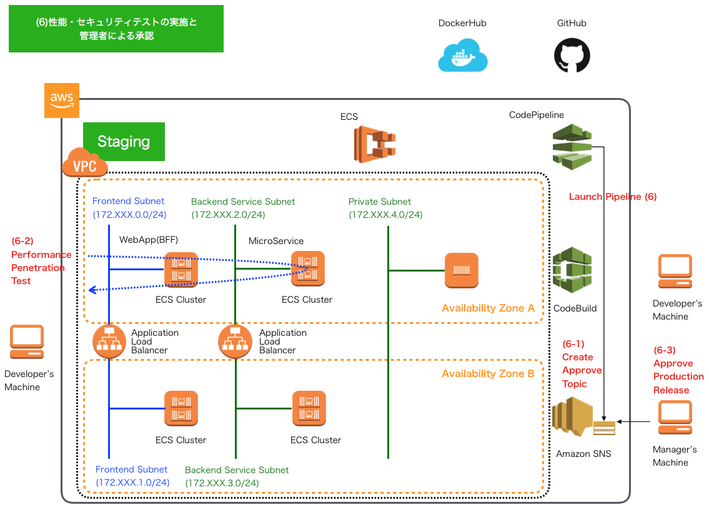
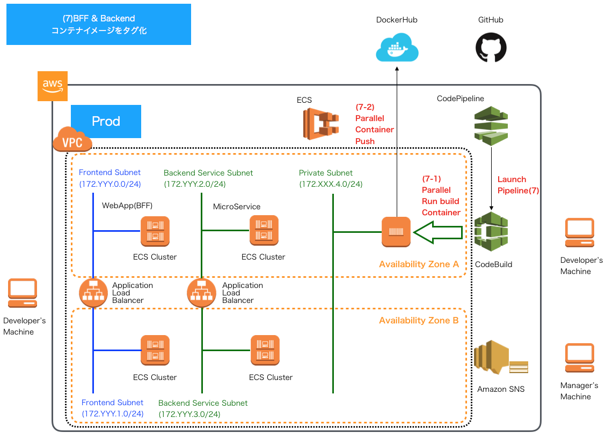
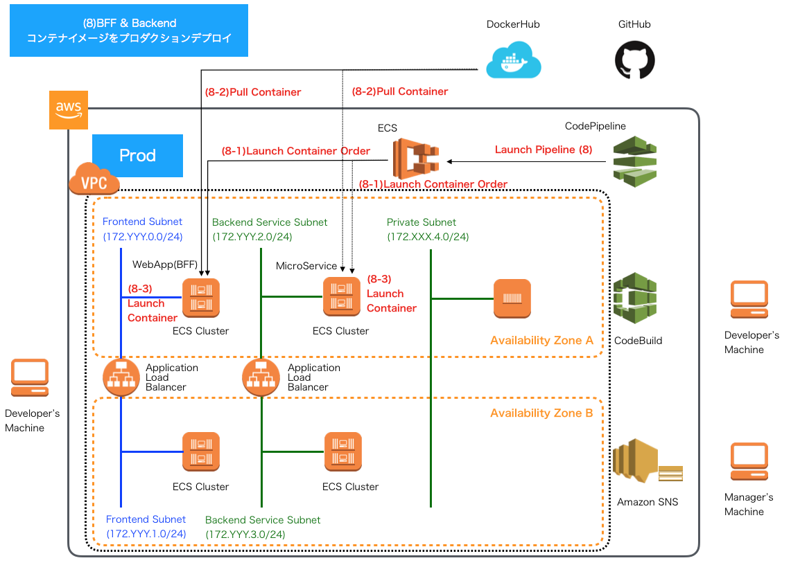

.. include:: ../module.txt

.. _section-automation-infra-devops-codepipeline-1-label:

基盤・デプロイ自動化実践
==================================================================

マイクロサービスアーキテクチャの基盤・デプロイ自動化
-------------------------------------------------------------------------------------------------------------------------------------

.. _section-automation-infra-devops-continuous-delivery-automation-using-codepipeline-label:

AWS CodePipeLineを用いた継続的デリバリ自動化
^^^^^^^^^^^^^^^^^^^^^^^^^^^^^^^^^^^^^^^^^^^^^^^^^^^^^^^^^^^^^^^^^^^^^^^^^^^^^^^^^^^^^^^

|br|

本連載では、以下のイメージの構成のようなマイクロサービスアーキテクチャでの継続的インテグレーション(Continuous Integration:CI)や継続的デリバリ(Continuous Delivery:CD)の自動化環境の構築を実践しています。

|br|

.. figure:: img/automation_infra_devops_overview/MicroServiceArchitecture.png
   :scale: 100%

|br|

前回までにECSコンテナ、RDSを使ったSonarQubeServerによる静的チェック環境の構築から、SpringBootを使ったマイクロサービスにおける各種テストコードの実装、
GitHubへプッシュされたソースコードに対するCodeBuildを使ったビルド・テスト、SonarScannerによる静的チェック結果の可視化といった一連の継続的インテグレーション自動化の仕組みを解説してきました。
継続的インテグレーションは以下のようなGit Flowをベースとしたブランチ構成で、feature/＊＊＊＊＊＊ブランチを対象に、赤字の吹き出しのタイミングで、ソースコードのGitHubへのプッシュを契機にビルド・テスト・静的解析結果可視化の自動化を実現しています。

|br|

.. figure:: img/automation_infra_devops_codebuild/branch_strategy.png
   :scale: 100%

|br|

feature/＊＊＊＊ブランチに対する機能実装が完了した後は、developブランチに対してプルリクスト(Pull Request:PR)をコードオーナーや管理者に送信してマージ要求を行います。
developブランチへPRが発出されると、以下のようなプロセスを経て、プロダクション環境へリリースしていくものとします。

#. バックエンドのマイクロサービスのコンテナイメージのビルド
#. マイクロサービスコンテナイメージをプロダクションとほぼ同等のステージング環境へデプロイ
#. Webアプリケーション(BFF)のE2Eテストとして、Seleniumテストコード実行
#. Webアプリケーション(BFF)のコンテナイメージのビルド
#. Webアプリケーション(BFF)のステージング環境へデプロイ
#. パフォーマンステストやセキュリティテスト、受入等のその他テスト後の管理者によるリリース承認
#. ステージング環境でテスト済みのコンテナイメージをリリース用にタグ付け
#. プロダクション環境へリリース

|br|

続く今回からは、上記の一連の流れをAWS CodePipelineを使ってパイプライン的に自動化する仕組みを構築・解説していきます。
今回はCodePipelineの概要および、リリースまでのパイプライン構成および実行環境構成イメージを解説します。

|br|

.. _section-codebuild-setting-codepipeline-overview-label:

CodePipelineの概要
^^^^^^^^^^^^^^^^^^^^^^^^^^^^^^^^^^^^^^^^^^^^^^^^^^^^^^^^^^^^^^^^^^^^^^^^^^^^^^^^^^^^^^^

|br|

CodePipelineはアプリケーションのソースコードコミット・プッシュやプルリクエストを契機として、テスト・ビルドやステージング・プロダクション環境へのデプロイといった一連のソフトウェアリリースプロセスを自動化・可視化し、継続的インテグレーション・デリバリーを実現するサービスです。
主な特徴・メリットとして、以下のような点が挙げられます。

* ECR、S3、ElasticBeanstalk、CodeCommit、CodeDeploy、CodeBuild、LambdaといったAWSの様々なサービスと統合し、リリースプロセスを構築できること。
* アプリケーション実行環境となるECSやEC2などへのデプロイをシームレスに行えること。
* クラウド実行ベースのCodeBuildとの連携により、マシンリソースを気にせず、様々なソースコードレポジトリに対し同時に多数のビルド処理やデプロイが行えること。
* GitHubやJenkinsなどの主要なレポジトリやCIツールとの連携もシームレスに実行できること。

それでは、本連載で解説中の前節のイメージ図にあるマイクロサービスアーキテクチャでのアプリケーションリリースプロセスの自動化を、CodePipelineを使って実際に進めていきましょう。

|br|

.. _section-codebuild-setting-codepipeline-pipeline-overview-label:

マイクロサービスでのパイプライン構成
^^^^^^^^^^^^^^^^^^^^^^^^^^^^^^^^^^^^^^^^^^^^^^^^^^^^^^^^^^^^^^^^^^^^^^^^^^^^^^^^^^^^^^^

|br|

前節のブランチ構成のイメージに基づき、feature/＊＊＊＊ブランチから、developブランチへのPRを契機として、以下のようなリリースプロセスに基づくパイプラインを構成します。

|br|

.. figure:: img/automation_infra_devops_codepipeline/pipeline.png
   :scale: 100%

|br|

各パイプラインの具体的な処理のイメージは以下の通りです。

|br|

1. バックエンドのマイクロサービスのコンテナイメージのビルド

|br|

.. figure:: img/automation_infra_devops_codepipeline/pipeline-1.png
   :scale: 100%

|br|

2. マイクロサービスコンテナイメージをプロダクションとほぼ同等のステージング環境へデプロイ

|br|

.. figure:: img/automation_infra_devops_codepipeline/pipeline-2.png
   :scale: 100%

|br|

3. Webアプリケーション(BFF)のE2Eテストとして、Seleniumテストコード実行

|br|

.. figure:: img/automation_infra_devops_codepipeline/pipeline-3.png
   :scale: 100%

|br|

4. Webアプリケーション(BFF)のコンテナイメージのビルド

|br|

.. figure:: img/automation_infra_devops_codepipeline/pipeline-4.png
   :scale: 100%

|br|

5. Webアプリケーション(BFF)のステージング環境へデプロイ

|br|

.. figure:: img/automation_infra_devops_codepipeline/pipeline-5.png
   :scale: 100%

|br|

6. パフォーマンステストやセキュリティテスト、受入等のその他テスト後の管理者によるリリース承認

|br|

|br|

7. ステージング環境でテスト済みのコンテナイメージをリリース用にタグ付け

|br|

|br|

8. プロダクション環境へリリース

|br|

|br|

次回以降は、各パイプラインの処理の内容を説明し、実際に環境を構築していきます。

|br|

著者紹介
------------------------------------------------------------------

川畑 光平(KAWABATA Kohei) - NTTデータ 課長代理

.. figure:: img/automation_infra_devops_overview/pic_image01.jpg
   :scale: 100%

金融機関システム業務アプリケーション開発・システム基盤担当を経て、現在はソフトウェア開発自動化関連の研究開発・推進に従事。

Red Hat Certified Engineer、Pivotal Certified Spring Professional、AWS Certified Solutions Architect Professional等の資格を持ち、アプリケーション基盤・クラウドなど様々な開発プロジェクト支援にも携わる。

`2019 APN AWS Top Engineers & Ambassadors <https://aws.amazon.com/jp/blogs/psa/japan-apn-ambassador-2019/>`_ 選出。
