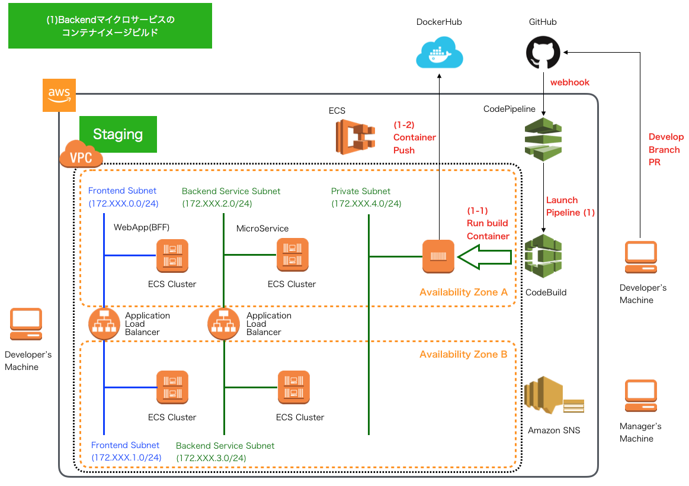

.. include:: ../module.txt

.. _section-automation-infra-devops-codepipeline-2-label:

基盤・デプロイ自動化実践
==================================================================

マイクロサービスアーキテクチャの基盤・デプロイ自動化
-------------------------------------------------------------------------------------------------------------------------------------

.. _section-codepipeline-setting-codepipeline--build-backend-container-staging-label:

(1)バックエンドのマイクロサービスアプリケーションをビルドし、DockerHubへプッシュするパイプラインの構築
^^^^^^^^^^^^^^^^^^^^^^^^^^^^^^^^^^^^^^^^^^^^^^^^^^^^^^^^^^^^^^^^^^^^^^^^^^^^^^^^^^^^^^^^^^^^^^^^^^^^^^^^^^^^^^^^^^^^^^^^^

|br|

本連載では、マイクロサービスアーキテクチャでの継続的デリバリ(Continuous Delivery:CD)を以下のようなパイプラインで実現していきます。

|br|

.. figure:: img/automation_infra_devops_codepipeline/pipeline.png

|br|

今回は、最初のパイプライン処理として `GitHub上のアプリケーションソースコードのdevelopブランチ <https://github.com/debugroom/mynavi-sample-continuous-integration/tree/develop>`_ へのプルリクエスト(PullRequest:PR)を契機に、
GitHub⇒CodePipelineへのWebhookにより、(1)バックエンドのマイクロサービスアプリケーションをビルドし、DockerHubへプッシュするパイプライン処理を構築していきます。

|br|

1. バックエンドのマイクロサービスのコンテナイメージのビルド

* (1-1) CodeBuildがbackendアプリケーションのステージング環境向けbuildspec.ymlに記載したビルド処理を行うコンテナを実行します。
* (1-2) ビルド処理の中で、アプリケーション実行コンテナイメージを作成し、DockerHubへプッシュします。

|br|

|br|

.. _section-codepipeline-create-backend-staging-buildspec-label:

Backendマイクロサービスのコンテナイメージをビルドするbuildspec.ymlおよびDockerfileの作成
^^^^^^^^^^^^^^^^^^^^^^^^^^^^^^^^^^^^^^^^^^^^^^^^^^^^^^^^^^^^^^^^^^^^^^^^^^^^^^^^^^^^^^^^^^^^^^^^^^^^^^^^^^^^^^^

|br|

最初に、デプロイするBackendマイクロサービスアプリケーションのコンテナイメージを構築するbuildspec.ymlを作成します(上記イメージ1-1で実行)。
以前のCodeBuildの説明「 :ref:`section-codebuild-create-buildspec-label` 」時に作成したbuildspecと同じような構成で、ソースコードプロジェクトのBackendマイクロサービスプロジェクトに、build/staging/buildspec.ymlを作成します。

|br|

.. sourcecode:: bash

   [project-root]
       │
       ├-[backend]
       │   ├- src
       │   │   ├- main .....
       │   │   └- test .....
       │   ├- build
       │   │   ├- production
       │   │   |   └- dockerfile
       │   │   ├- staging
       │   │   │   └- buildspec.yml
       │   │  .....
       │   └- pom.xml
       │  .....
       └- pom.xml

|br|

buildspec.ymlは以下の通りです。

|br|

.. sourcecode:: bash

   version: 0.2
   env:
     parameter-store:
     DOCKER_USER: "DOCKER_USER"
     DOCKER_PASSWORD: "DOCKER_PASSWORD"
     DOCKER_REPO : "DOCKER_REPO"
     IMAGE_REPO_NAME: "BACKEND_IMAGE_REPO_NAME"
     IMAGE_TAG: "BACKEND_IMAGE_TAG_STAGING"                                     # …(A)
   phases:
     install:
       runtime-versions:
         docker: 18                                                             # …(B)
     pre_build:
       commands:
         - echo Logging in to Docker Hub...
         - docker login -u $DOCKER_USER -p $DOCKER_PASSWORD $DOCKER_REPO        # …(C)
     build:
       commands:
         - echo Build started on `date`
         - echo Building the Docker image...
         - docker build -t $IMAGE_REPO_NAME:$IMAGE_TAG backend/build/production # …(D)
         - docker tag $IMAGE_REPO_NAME:$IMAGE_TAG $IMAGE_REPO_NAME:$IMAGE_TAG   # …(E)
     post_build:
       commands:
         - echo Build completed on `date`
         - echo Pushing the Docker image...
         - docker push $IMAGE_REPO_NAME:$IMAGE_TAG                              # …(F)
         - printf '[{"name":"mynavi-sample-continuous-delivery-backend-staging","imageUri":"%s"}]' $IMAGE_REPO_NAME:$IMAGE_TAG > imagedefinitions.json
                                                                                # …(G)
   artifacts:
     files:
       - imagedefinitions.json                                                  # …(H)

|br|

.. list-table:: Backendマイクロサービスのコンテナイメージを作成するbuildspec.yml
   :widths: 1, 19

   * - 項番
     - 説明

   * - (A)
     - AWS Systems Manager Parameter Storeで設定したデータを環境変数に設定します。ダブルクォーテーションで囲まれた値がParamter Storeで定義した名称です。ここでは、DockerHubのユーザIDやパスワード、ビルドするコンテナイメージの名称、バージョン名、タグ名を設定します。

   * - (B)
     - Ubuntu Standard Image 2.0 以降を使用する場合は、buildspec ファイルで runtime-versions を指定する必要があります。詳細については、「 `buildspec ファイルのランタイムバージョンの指定 <https://docs.aws.amazon.com/ja_jp/codebuild/latest/userguide/build-spec-ref.html#runtime-versions-buildspec-file>`_ 」を参照してください。

   * - (C)
     - DockerHubへログインします。

   * - (D)
     - Dockerイメージをビルドします。Dockerfileは後述しますが、backend/build/productionに配置し、最終的にProduction環境へリリースするものを使用します。

   * - (E)
     - 作成したコンテナイメージにタグを割り当てます。StagingではX.X.SNAPSHOT(Xはバージョン)とします。

   * - (F)
     - 作成したコンテナイメージをDockerHubへプッシュします。

   * - (G)
     - 次回以降、ECSでコンテナイメージをクラスタへデプロイするために、コンテナイメージ名とURIを定義したimagedefinitions.jsonというJSON形式のファイルを作成します。なお、ここでname属性はECSタスク定義で設定するタスク名と一致させておく必要がありますので注意してください。

   * - (H)
     - imagedefinitions.jsonファイルをアーティファクトとして出力します。なお、このアーティファクトファイルはCodePipelineによりS3バケットに保存されるかたちになります。

|br|

また、buildspec.ymlから実行される、ProductionのDockerfileは以下の通りです。こちらは、筆者の別連載 `AWSで作るクラウドネイティブアプリケーション第４回 <https://news.mynavi.jp/itsearch/article/devsoft/4390>`_ で解説したDockerfileとほぼ同じ構成ですので詳細はそちらを参照していただくとして、ここでの説明は割愛します。

|br|

.. sourcecode:: bash

   # Dockerfile for sample service using embedded tomcat server

   FROM centos:centos7
   MAINTAINER debugroom

   RUN yum install -y \
       java-1.8.0-openjdk \
       java-1.8.0-openjdk-devel \
       wget tar iproute git

   RUN rm -f /etc/rpm/macros.image-language-conf && \
       sed -i '/^override_install_langs=/d' /etc/yum.conf && \
       yum -y reinstall glibc-common && \
       yum clean all

   ENV LANG="ja_JP.UTF-8" \
       LANGUAGE="ja_JP:ja" \
       LC_ALL="ja_JP.UTF-8"

   RUN wget http://repos.fedorapeople.org/repos/dchen/apache-maven/epel-apache-maven.repo -O /etc/yum.repos.d/epel-apache-maven.repo
   RUN sed -i s/\$releasever/6/g /etc/yum.repos.d/epel-apache-maven.repo
   RUN yum install -y apache-maven
   ENV JAVA_HOME /etc/alternatives/jre
   RUN git clone https://github.com/debugroom/mynavi-sample-continuous-integration.git /usr/local/mynavi-sample-continuous-integration
   RUN mvn install -f /usr/local/mynavi-sample-continuous-integration/common/pom.xml
   RUN mvn package -f /usr/local/mynavi-sample-continuous-integration/backend/pom.xml
   RUN cp /etc/localtime /etc/localtime.org
   RUN ln -sf  /usr/share/zoneinfo/Asia/Tokyo /etc/localtime

   EXPOSE 8080

   CMD java -jar -Dspring.profiles.active=production /usr/local/mynavi-sample-continuous-integration/backend/target/mynavi-sample-continuous-integration-backend-0.0.1-SNAPSHOT.jar

|br|

.. _section-codepipeline-setting-ssm-definition-backend-staging-label:

AWS Sysmtems Managers Parameter Storeでの環境変数の定義
^^^^^^^^^^^^^^^^^^^^^^^^^^^^^^^^^^^^^^^^^^^^^^^^^^^^^^^^^^^^^^^^^^^^^^^^^^^^^^^^^^^^^^^^^^^^^^^^^^^^^^^^^^^^^^^

|br|

CodePipelineの設定を行う前に、前節のbuildspec.ymlで使用する環境変数を定義しておきます。設定の要領は、 :ref:`section-codebuild-setting-sms-label` と同様です。以下のパラメータを定義します。

* "DOCKER_USER" : DockerHubのユーザ名
* "DOCKER_PASSWORD"：DockerHubのユーザのパスワード
* "DOCKER_REPO"： https://index.docker.io/v1/
* "BACKEND_IMAGE_REPO_NAME"：debugroom/mynavi-sample-backend
* "BACKEND_IMAGE_TAG_STAGING"：1.0.SNAPSHOT

|br|

.. _section-codepipeline-setting-codepipeline-backend-base-label:

CodePipelineの設定
^^^^^^^^^^^^^^^^^^^^^^^^^^^^^^^^^^^^^^^^^^^^^^^^^^^^^^^^^^^^^^^^^^^^^^^^^^^^^^^^^^^^^^^^^^^^^^^^^^^^^^^^^^^^^^^

|br|

AWSコンソールの「CodePipeline」サービスを選択し、「パイプラインの作成」ボタンを押下します。

|br|

.. figure:: img/automation_infra_devops_codepipeline/management_console_codepipeline_create_project_0_base_backend.png

|br|

パイプラインの名称とロール名を入力します。

|br|

.. figure:: img/automation_infra_devops_codepipeline/management_console_codepipeline_create_project_1_base_backend.png

|br|

ソースプロバイダでGitHubを選択し、(初回はOAuth認証してから)、レポジトリとブランチを選択します。トリガー対象となる「develop」ブランチを選択しておきます。
検出オプションは「GitHubウェブフック」を選択しますが、プルリクエストイベントのフィルタ設定は後ほど行います。

|br|

.. figure:: img/automation_infra_devops_codepipeline/management_console_codepipeline_create_project_2_base_backend.png

|br|

続いて、コンテナイメージをビルドするための設定を行います。CodePipelineからCodeBuildを実行するイメージになります。プロバイダを「CodeBuild」、リージョンを「東京リージョン」を選択し、「プロジェクトを作成する」を押下して、「CodeBuild」プロジェクトを作成しましょう。

|br|

.. figure:: img/automation_infra_devops_codepipeline/management_console_codepipeline_create_project_3_base_backend.png

|br|

設定の要領は、 :ref:`section-codebuild-setting-codebuild-label` と同様です。ただし、１箇所だけ「特権付与」にチェックを忘れずに入れるようにします。今回Buildイメージの中でdockerコマンドを利用するため、アクセス権限の付与が必要です。
また、buildspec.ymlは前節で作成したパスに配置されてあるものを指定するようにしましょう。入力後に、「CodePipelineに進む」を押下し、元のパイプラインの設定画面に戻り、「次に」ボタンを押下して、次の設定へ進みます。

|br|

.. figure:: img/automation_infra_devops_codepipeline/management_console_codepipeline_create_project_4_codebuild_backend.png

|br|

.. figure:: img/automation_infra_devops_codepipeline/management_console_codepipeline_create_project_5_codebuild_backend.png

|br|

.. figure:: img/automation_infra_devops_codepipeline/management_console_codepipeline_create_project_6_codebuild_backend.png

|br|

|br|

.. figure:: img/automation_infra_devops_codepipeline/management_console_codepipeline_create_project_8_codebuild_backend.png

|br|

デプロイステージは、次回設定するのでここでは「導入段階をスキップ」を選択して、パイプラインを作成します。

|br|

.. figure:: img/automation_infra_devops_codepipeline/management_console_codepipeline_create_project_9_base_backend.png

|br|

作成するとパイプライン処理が起動し始めます。ただし、ここでは作成したパイプラインのサービスロールにSystems Manager Paramter Storeの権限を付与していないので。実行エラーになります。

|br|

.. figure:: img/automation_infra_devops_codepipeline/management_console_codepipeline_create_project_10_base_backend.png

|br|

:ref:`section-codebuild-iam-setting-ssm-label` と同様、作成したサービスロールにアクセス権限を付与します。
また、「編集する」ボタンで、以下の通り、GitHubからのWebhookで、feature/＊＊＊＊＊ブランチからのdevelopブランチに対するPRがマージされたことをトリガーとするよう設定しておきましょう。

* イベントタイプ：PULL_REQUEST_MERGED
* HEAD_REF：^refs/heads/develop$
* BASE_REF：^refs/heads/feature/.*

|br|

|br|

設定後、改めて、パイプライン処理を実行してみましょう。ビルド処理が無事完了し、DockerHub上にコンテナイメージがプッシュされているか確認します。

|br|

|br|

.. figure:: img/automation_infra_devops_codepipeline/dockerhub_backend_image.png

|br|

これでベースとなるパイプラインとBakcendサービスのコンテナイメージのビルド処理パイプラインが作成されました。次回以降は、ECSクラスタ上にコンテナイメージをデプロイするパイプラインを構築していきます。

|br|

著者紹介
------------------------------------------------------------------

川畑 光平(KAWABATA Kohei) - NTTデータ 課長代理

.. figure:: img/automation_infra_devops_overview/pic_image01.jpg

金融機関システム業務アプリケーション開発・システム基盤担当を経て、現在はソフトウェア開発自動化関連の研究開発・推進に従事。

Red Hat Certified Engineer、Pivotal Certified Spring Professional、AWS Certified Solutions Architect Professional等の資格を持ち、アプリケーション基盤・クラウドなど様々な開発プロジェクト支援にも携わる。

`2019 APN AWS Top Engineers & Ambassadors <https://aws.amazon.com/jp/blogs/psa/japan-apn-ambassador-2019/>`_ 選出。
