.. include:: ../module.txt

.. _section-automation-infra-devops-codepipeline-4-label:

基盤・デプロイ自動化実践
==================================================================

マイクロサービスアーキテクチャの基盤・デプロイ自動化
-------------------------------------------------------------------------------------------------------------------------------------

.. _section-codepipeline-setting-codepipeline-e2etest-bff-label:

(3)E2Eテストを実行するパイプラインの構築
^^^^^^^^^^^^^^^^^^^^^^^^^^^^^^^^^^^^^^^^^^^^^^^^^^^^^^^^^^^^^^^^^^^^^^^^^^^^^^^^^^^^^^^

|br|

本連載では、マイクロサービスアーキテクチャでの継続的デリバリ(Continuous Delivery:CD)を以下のようなパイプラインで実現していきます。

|br|

.. figure:: img/automation_infra_devops_codepipeline/pipeline.png

|br|

前回は(2)ECSクラスタ上にバックエンドのマイクロサービスアプリケーションのコンテナイメージをデプロイするパイプラインを構築しました。
続く今回は、:ref:`section-e2e-test-for-webapp-label` で実装したE2Eテストを実行するパイプラインを構築します。

|br|

3. Webアプリケーション(BFF)のE2Eテストとして、Seleniumテストコード実行

* (3-1) CodeBuildがBFFアプリケーションソースプロジェクトにあるbuildspec_e2e.ymlに記載したビルド処理(テスト)を行うコンテナを実行します。
* (3-2) ビルド処理の中で、GitHubからBFFのアプリケーションソースコードをクローンします。
* (3-3) ビルド処理の中で、MavenビルドによりSeleniumを使ったE2Eテストを実行します。E2Eテストでは前回デプロイしたバックエンドアプリケーションの呼び出しを通してテスト実行されます。

|br|

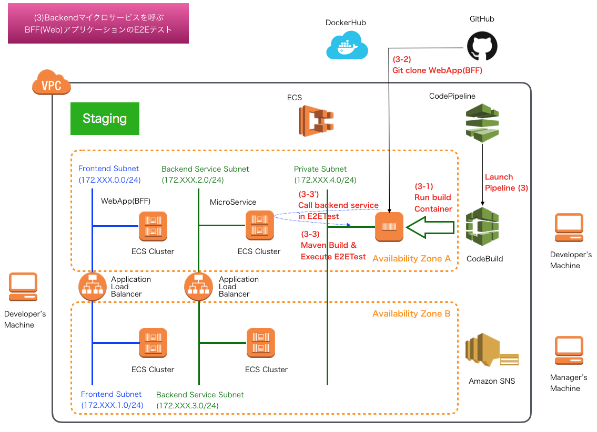

|br|

.. _section-codepipeline-setting-codepipeline-create-buildspec-for-e2etest-label:

E2Eテストを実行するbuildspec.ymlの実装
^^^^^^^^^^^^^^^^^^^^^^^^^^^^^^^^^^^^^^^^^^^^^^^^^^^^^^^^^^^^^^^^^^^^^^^^^^^^^^^^^^^^^^^^^^^^^^^^^^^^^^^^^^^^^^^

|br|

今回作成するパイプラインは前回のコンテナビルド時と同様、CodeBuildを起動してE2Eテストを実行します。`CodeBuildで使用されているデフォルトのUbuntuをベースとしたビルド用コンテナイメージにはChromeDriverがインストールされている <https://github.com/aws/aws-codebuild-docker-images/blob/master/ubuntu/standard/2.0/Dockerfile>`_ ので、
それをそのまま利用します。下記のようなディレクトリ構成で、E2Eテストを実行するbuildspec_e2e.ymlを作成しましょう。
|br|

.. sourcecode:: bash

   [project-root]
       │
       ├-[backend-for-frontend]
       │   ├- src
       │   │   ├- main .....
       │   │   └- test .....
       │   ├- build
       │   │   ├- staging
       │   │   |   ├- buildspec_e2e.yml
       │   │   │   └- buildspec.yml
       │   │  .....
       │   └- pom.xml
       │  .....
       └- pom.xml

|br|

作成するbuildspec_e2e.ymlは以下の通りです。

|br|

.. sourcecode:: bash

   version: 0.2
   env:
     parameter-store:
       SERVICE_DNS: "SERVICE_DNS_STAGING"                                       # …(A)
   phases:
     install:
       runtime-versions:
         docker: 18                                                             # …(B)
       commands:
         - apt-get update -y
         - apt-get -y install language-pack-ja-base language-pack-ja
     pre_build:
       commands:
         - /usr/sbin/update-locale LANG=ja_JP.UTF-8 LANGUAGE="ja_JP:ja"
         - export LC_ALL="ja_JP.UTF-8"
         - locale-gen ja_JP.UTF-8
         - dpkg-reconfigure locales                                             # …(C)
     build:
       commands:
         - mvn -f common/pom.xml install                                        # …(D)
         - mvn -P e2e-test -f backend-for-frontend/pom.xml test -Dspring.profiles.active="dev"
                                                                                # …(E)
         - export ARTIFACT_FILENAME="test-evidence-"`date "+%Y%m%d_%H%M%S"`.zip # …(F)
         - zip -r $ARTIFACT_FILENAME backend-for-frontend/test-evidence         # …(G)
   artifacts:
     files:
       - $ARTIFACT_FILENAME                                                     # …(H)

|br|

.. list-table:: Backendマイクロサービスのコンテナイメージを作成するbuildspec.yml
   :widths: 1, 19

   * - 項番
     - 説明

   * - (A)
     - AWS Systems Manager Parameter Storeで設定したデータを環境変数に設定します。ダブルクォーテーションで囲まれた値がParameter Storeで定義した名称です。ここでは、ParamterStoreを通して、"SERVICE_DNS_STAGING"にアクセスするバックエンドサービスをパスルーティングするALBのDNSが設定されることになります。

   * - (B)
     - Ubuntu Standard Image 2.0 以降を使用する場合は、buildspec ファイルで runtime-versions を指定する必要があります。詳細については、「 `buildspec ファイルのランタイムバージョンの指定 <https://docs.aws.amazon.com/ja_jp/codebuild/latest/userguide/build-spec-ref.html#runtime-versions-buildspec-file>`_ 」を参照してください。

   * - (C)
     - コンテナイメージのデフォルトロケールをja_JPに変更します。ロケールがデフォルトのen_USだと、テスト実行時にSpringのMessageSourceで英語メッセージプロパティを選択し、テストケースによってはエラーとなるものがでてきます。

   * - (D)
     - アプリケーションは共通ライブラリに依存しているため、ライブラリをビルドして.m2/配下にインストールするようにします。

   * - (E)
     - Mavenプロファイル「e2e-test」を指定して、ゴールを"test"に設定して、Mavenビルドによるテストを実行します。プロファイルではE2Eテストにカテゴライズされたテスト(@Categoryアノテーションに特定のインターフェースが指定されたテストクラス)が実行されるよう、`pom.xml <https://github.com/debugroom/mynavi-sample-continuous-integration/blob/master/backend-for-frontend/pom.xml>`_ に設定してあります。

   * - (F)
     - テスト実行結果をアーカイブ化するファイル名をタイムスタンプを使って環境変数として定義します。

   * - (G)
     - テスト実行結果をZIPアーカイブ化します。

   * - (H)
     - 作成したアーティファクト名を指定します。アーティファクトはS3へ転送されます。

|br|

.. _section-codepipeline-setting-pipeline-for-e2etest-label:

E2Eテストを実行するパイプラインの設定
^^^^^^^^^^^^^^^^^^^^^^^^^^^^^^^^^^^^^^^^^^^^^^^^^^^^^^^^^^^^^^^^^^^^^^^^^^^^^^^^^^^^^^^^^^^^^^^^^^^^^^^^^^^^^^^

|br|

パイプラインの設定に入る前に、E2Eテスト用のCodeBuildプロジェクトを作成します。 :ref:`section-codebuild-setting-codebuild-label` と同様の要領で CodeBuildサービスから「ビルドプロジェクトを作成する」ボタンを押下して、新規のCodeBuildプロジェクトを作成しますが、以下の項目について留意して設定します。

|br|

.. list-table:: CodeBuildの設定
   :widths: 2, 3, 7

   * - 入力箇所
     - 項目
     - 説明

   * - プライマリリソースのウェブフックイベント
     - ウェブフック
     - レポジトリへのコードプッシュ時やプルリクエスト実行時にビルドを実行する場合チェックします。パイプラインから起動されるため、ここではチェックしません。

   * - 環境
     - 特権付与
     - dockerコマンドなどを実行する場合、チェックが必要です。今回のE2Eテストではチェックは不要です。

   * -
     - サービスロール
     - CodeBuildの実行に必要なポリシーをアタッチしたサービスロールを設定します。複数のビルドプロジェクトで関連付けが可能ですが、最大10のビルドプロジェクトまでしか関連付けができないので注意が必要です。なお、サービスロールを新規作成する場合は作成後にSystemsManagerのアクセス権限を付与します。

   * -
     - 追加設定：VPC
     - バックエンドサービス向けのALBのセキュリティグループ設定によりますが、アクセスが許可されたVPCを設定します。

   * -
     - 追加設定：サブネット
     - バックエンドサービス向けのALBのセキュリティグループ設定によりますが、アクセスが許可されたサブネットを設定します。

   * -
     - 追加設定：環境変数
     - コンテナイメージへ設定したい環境変数を設定します。作成したBFFアプリケーションのプロジェクトではテスト用の `application.yml <https://github.com/debugroom/mynavi-sample-continuous-integration/blob/master/backend-for-frontend/src/test/resources/application.yml>`_ にChromeDriverのパスを示す環境変数CHROME_DRIVER_PATHを必要としています。CodeBuildのデフォルトのコンテナイメージでドライバーのパスは/usr/bin/chromedriverにあるので環境変数として設定してください。

   * - Buildspec
     - buildspec名
     - デフォルトではソースコードのルートディレクトリにあるbuildspec.ymlが選択されますが、別の名前や場所を使用している場合に入力します。ここでは、前節で作成したbackend-for-frontend/build/staging/buildspec_e2e.ymlを指定します。

   * - アーティファクト
     - タイプ
     - ビルド実行時に生成されるアプリケーションを出力する方式を選択します。今回テスト証跡をS3へ出力するものとします。

   * -
     - バケット名
     - アーティファクトを出力するバケット名を設定します。

   * -
     - 名前
     - アーティファクト名称を設定します。

   * -
     - セマンティックバージョンの有効化
     - buildspec.ymlで指定されたアーティファクト名を使用する場合にチェックします。

   * -
     - パス
     - アーティファクトを出力するバケット内のフォルダを設定します。

   * -
     - 名前空間のタイプ
     - アーティファクトの出力でビルドIDでディレクトリを作成する場合に設定します。

   * -
     - アーティファクトのパッケージ化
     - アーティファクトをZIP圧縮する場合に設定します。今回はbuildspec.yml内で圧縮処理をかけているので設定不要です。

   * -
     - アーティファクトの暗号化の解除
     - アーティファクトを暗号化して送信する場合、出力時に暗号化を解除するか設定します。

|br|

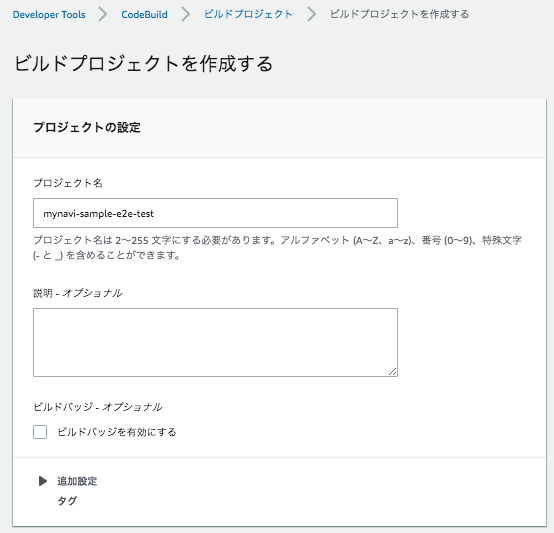

|br|
|br|

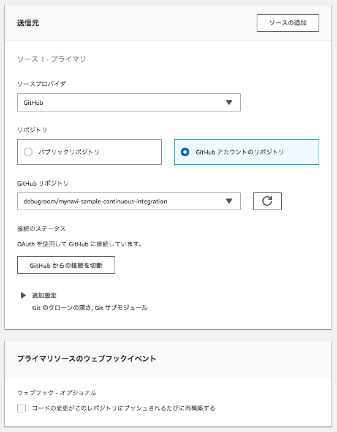

|br|
|br|

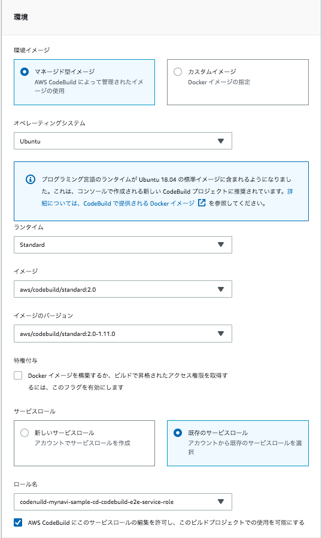

|br|
|br|

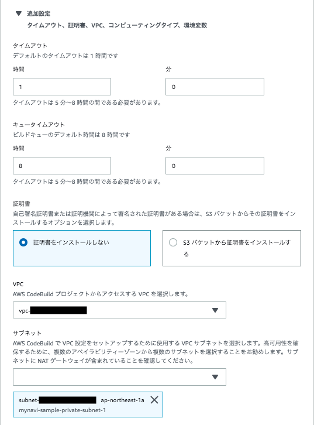

|br|
|br|

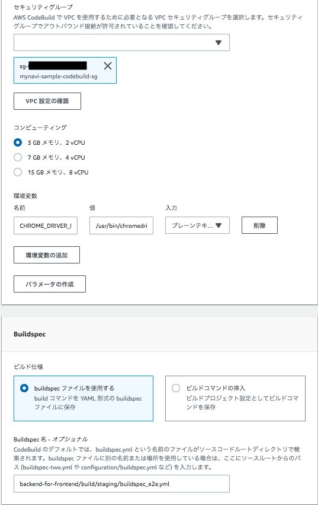

|br|

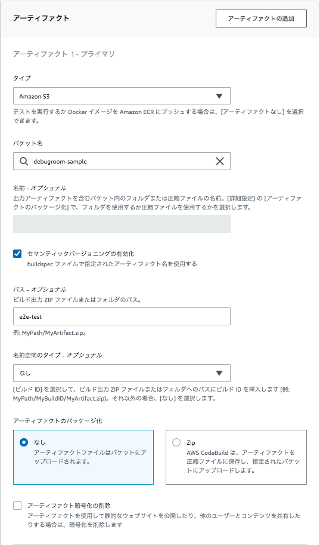

|br|
|br|

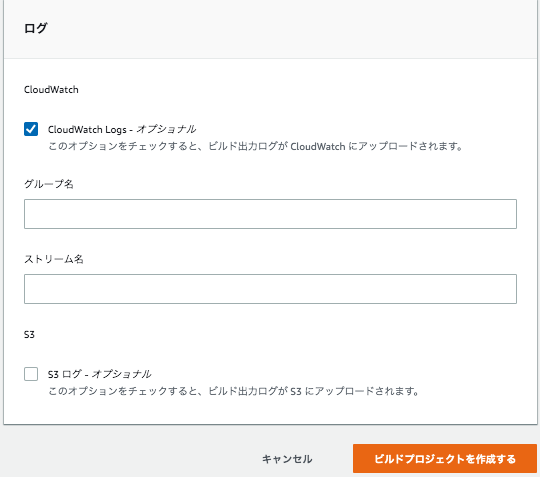

|br|

プロジェクトを作成したら、CodeBuildからSystemsManagerParameterStoreに環境変数のアクセスができるよう、サービスロールに権限を付与しておきます。

|br|

.. figure:: img/automation_infra_devops_codepipeline/management_console_codepipeline_edit_project_26_add_ssm.png

|br|
|br|

E2Eテストを実行するパイプラインを作成します。CodePipelineサービス・メニューで、これまで作成してきたパイプラインを選択し、「編集する」ボタンを押下します。
末端の「ステージを追加する」ボタンを選択します。

|br|

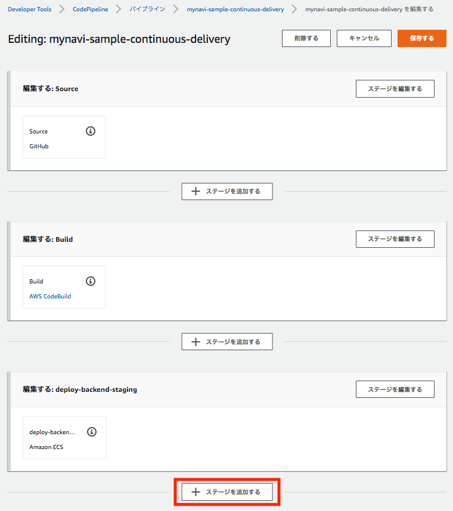

|br|

任意のステージ名を入力します。

|br|

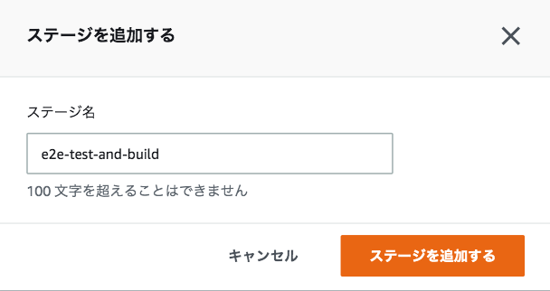

|br|

ステージが作成されたら、「アクションを追加する」ボタンを押下し、以下の要領でアクションを設定し、「完了」ボタンを押下します。

* アクション名：任意のアクション名を追加します。
* アクションプロバイダー：「AWS CodeBuild」を選択します。
* リージョン：ステージング環境があるリージョンを選択します。
* 入力アーティファクト：１番目のパイプラインで出力アーティファクトとなっている「SourceArtifact」を選択します。なお、これはGitHubからチェックアウトしたソースコードプロジェクトで実体はS3にZIPアーカイブされて保存されています。
* プロジェクト名：先ほど作成したプロジェクトを入力します。
* 出力アーティファクト：出力アーティファクト名を入力します。buildspec.ymlでは、最終的にテストの画面イメージをZIPアーカイブ化して出力しています。

|br|

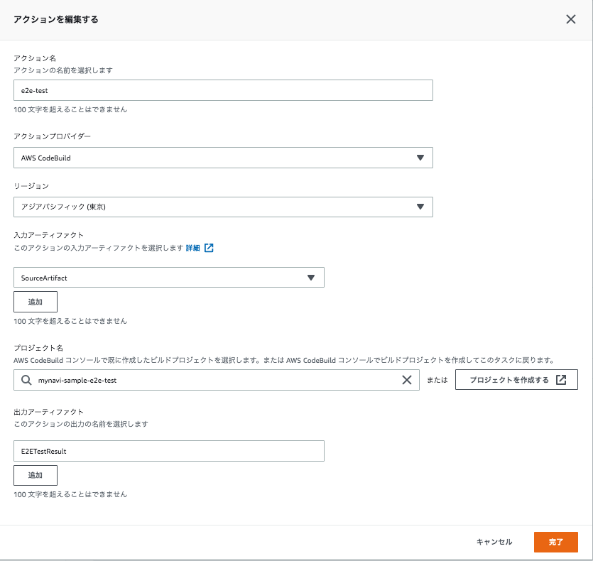

|br|

設定完了後、「変更をリリースする」ボタンを押下し、パイプラインを起動して、E2Eテストが実行されるか確認します。

|br|

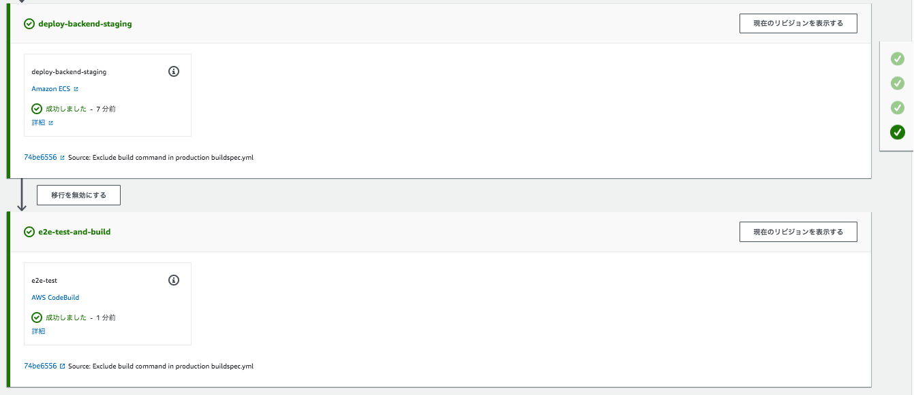

|br|

これでE2Eテスト用のパイプラインが作成されました。今回はCodeBuildから提供されているデフォルトのUbuntuのビルドイメージを使ってChromeでのE2Eテストを実行しましたが、他のブラウザやWindowsOSのテストが必要な場合は
このパイプラインの中で、別のコンテナイメージを使用したテストコンテナを作成し、並行してテストパイプライン処理を構成すると良いでしょう。
マシンリソースを気にすることなく、並列でテストを並走可能なのはCodeBuildならではのメリットです。

次回は、BFFアプリケーションのコンテナイメージをビルドしてDockerHubへプッシュするパイプラインを構築します。

|br|

著者紹介
------------------------------------------------------------------

川畑 光平(KAWABATA Kohei) - NTTデータ 課長代理

.. figure:: img/automation_infra_devops_overview/pic_image01.jpg

金融機関システム業務アプリケーション開発・システム基盤担当を経て、現在はソフトウェア開発自動化関連の研究開発・推進に従事。

Red Hat Certified Engineer、Pivotal Certified Spring Professional、AWS Certified Solutions Architect Professional等の資格を持ち、アプリケーション基盤・クラウドなど様々な開発プロジェクト支援にも携わる。

`2019 APN AWS Top Engineers & Ambassadors <https://aws.amazon.com/jp/blogs/psa/japan-apn-ambassador-2019/>`_ 選出。
