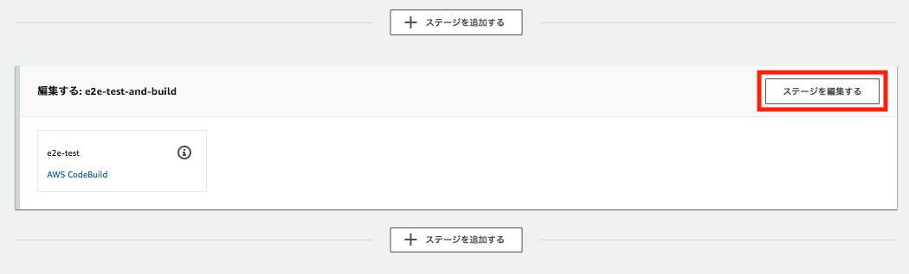
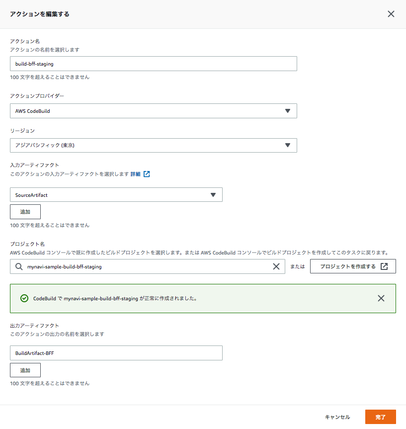
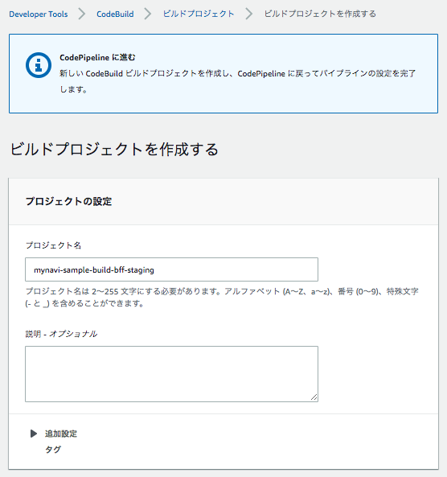
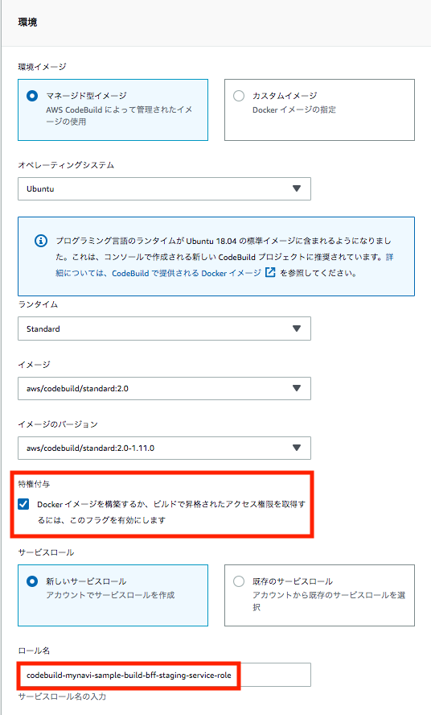
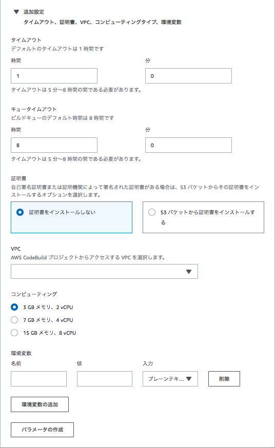
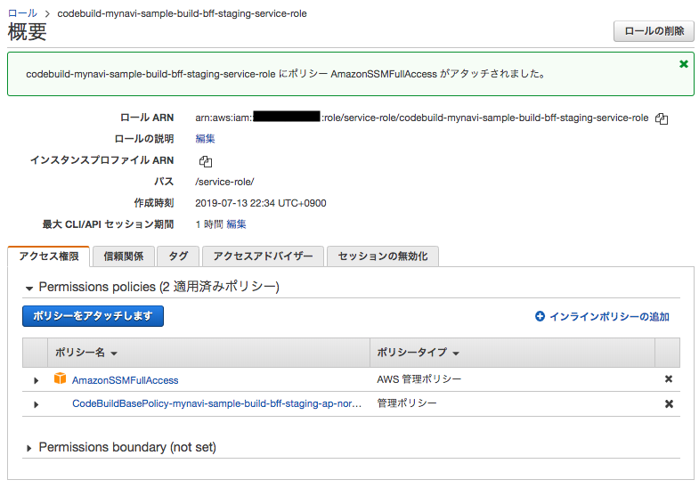
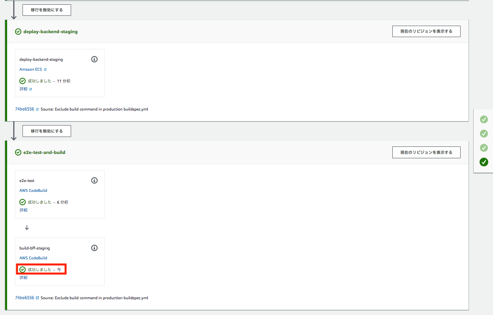
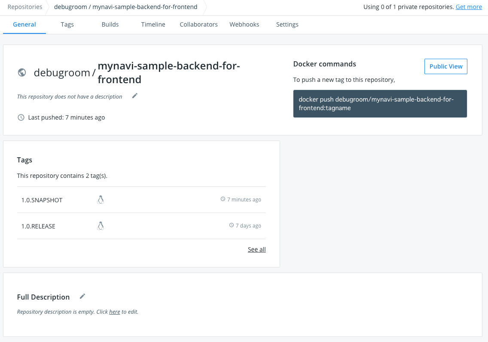

.. include:: ../module.txt

.. _section-automation-infra-devops-codepipeline-5-label:

【第16回】AWS CodePipeLineを用いた継続的デリバリ自動化(4)
-------------------------------------------------------------------------------------------------------------------------------------

.. _section-codepipeline-setting-codepipeline-build-bff-label:

(4)Web(BFF)アプリケーションのコンテナイメージをビルドして、DockerHubへプッシュするパイプラインの構築
^^^^^^^^^^^^^^^^^^^^^^^^^^^^^^^^^^^^^^^^^^^^^^^^^^^^^^^^^^^^^^^^^^^^^^^^^^^^^^^^^^^^^^^^^^^^^^^^^^^^^^^^^^^^^^^^^^^^^^^^^^^^^^^^

|br|

本連載では、マイクロサービスアーキテクチャでの継続的デリバリ(Continuous Delivery:CD)を以下のようなパイプラインで実現していきます。

|br|

.. figure:: img/automation_infra_devops_codepipeline/pipeline.png

|br|

前回は(3)E2Eテストを実行するパイプラインを構築しました。続く今回は、E2Eテストが完了したWeb(BackendForFrontend:BFF)アプリケーションのコンテナイメージをビルドして、DockerHubへプッシュするパイプラインを構築します。

|br|

4. Webアプリケーション(BFF)のコンテナイメージのビルド

* (4-1) CodeBuildがBFFアプリケーションのステージング環境向けbuildspec.ymlに記載したビルド処理を行うコンテナを実行します。
* (4-2) ビルド処理の中で、BFFアプリケーション実行コンテナイメージを作成し、DockerHubへプッシュします。

|br|

.. figure:: img/automation_infra_devops_codepipeline/pipeline-4.png

|br|

.. _section-codepipeline-create-buildspec-for-building-bff-label:

BFFアプリケーションをビルドするbuildspec.ymlおよびDockerfileの作成
^^^^^^^^^^^^^^^^^^^^^^^^^^^^^^^^^^^^^^^^^^^^^^^^^^^^^^^^^^^^^^^^^^^^^^^^^^^^^^^^^^^^^^^^^^^^^^^^^^^^^^^^^^^^^^^

|br|

:ref:`section-codepipeline-create-backend-staging-buildspec-label` と同様にアプリケーションをコンテナイメージ化するbuildspec.ymlをbackend-for-fronted/build/staging/配下に作成します。

|br|

.. sourcecode:: bash

   [project-root]
       │
       ├-[backend-for-frontend]
       │   ├- src
       │   │   ├- main .....
       │   │   └- test .....
       │   ├- build
       │   │   ├- production
       │   │   |   └- dockerfile
       │   │   ├- staging
       │   │   |   ├- buildspec_e2e.yml
       │   │   │   └- buildspec.yml
       │   │  .....
       │   └- pom.xml
       │  .....
       └- pom.xml

|br|

buildspec.ymlの実装内容の説明はリンク先と同様です。

|br|

.. sourcecode:: bash

   version: 0.2
   env:
     parameter-store:
       DOCKER_USER: "DOCKER_USER"
       DOCKER_PASSWORD: "DOCKER_PASSWORD"
       DOCKER_REPO : "DOCKER_REPO"
       IMAGE_REPO_NAME: "BACKEND_FOR_FRONTEND_IMAGE_REPO_NAME"
       IMAGE_TAG: "BACKEND_FOR_FRONTEND_IMAGE_TAG_STAGING"
   phases:
     install:
       runtime-versions:
         docker: 18
     pre_build:
       commands:
         - echo Logging in to Docker Hub...
         - docker login -u $DOCKER_USER -p $DOCKER_PASSWORD $DOCKER_REPO
     build:
       commands:
         - echo Build started on `date`
         - echo Building the Docker image...
         - docker build -t $IMAGE_REPO_NAME:$IMAGE_TAG backend-for-frontend/build/production
         - docker tag $IMAGE_REPO_NAME:$IMAGE_TAG $IMAGE_REPO_NAME:$IMAGE_TAG
     post_build:
       commands:
         - echo Build completed on `date`
         - echo Pushing the Docker image...
         - docker push $IMAGE_REPO_NAME:$IMAGE_TAG
         - printf '[{"name":"mynavi-sample-continuous-delivery-bff-staging","imageUri":"%s"}]' $IMAGE_REPO_NAME:$IMAGE_TAG > imagedefinitions.json
  artifacts:
    files:
      - imagedefinitions.json

|br|

また、buildspec.yml内で、docker buildコマンドにより実行されるDockerfileは以下になります。こちらも、:ref:`section-codepipeline-create-backend-staging-buildspec-label` と同様、プロダクション環境に配置するコンテナイメージを想定して作成しています。

|br|

.. sourcecode:: bash

   # Dockerfile for sample service using embedded tomcat server

   FROM centos:centos7
   MAINTAINER debugroom

   RUN yum install -y \
       java-1.8.0-openjdk \
       java-1.8.0-openjdk-devel \
       wget tar iproute git

   RUN rm -f /etc/rpm/macros.image-language-conf && \
       sed -i '/^override_install_langs=/d' /etc/yum.conf && \
       yum -y reinstall glibc-common && \
       yum clean all

   ENV LANG="ja_JP.UTF-8" \
       LANGUAGE="ja_JP:ja" \
       LC_ALL="ja_JP.UTF-8"

   RUN wget http://repos.fedorapeople.org/repos/dchen/apache-maven/epel-apache-maven.repo -O /etc/yum.repos.d/epel-apache-maven.repo
   RUN sed -i s/\$releasever/6/g /etc/yum.repos.d/epel-apache-maven.repo
   RUN yum install -y apache-maven
   ENV JAVA_HOME /etc/alternatives/jre
   RUN git clone https://github.com/debugroom/mynavi-sample-continuous-integration.git /usr/local/mynavi-sample-continuous-integration
   RUN mvn install -f /usr/local/mynavi-sample-continuous-integration/common/pom.xml
   RUN mvn package -f /usr/local/mynavi-sample-continuous-integration/backend-for-frontend/pom.xml -Dspring.profiles.active="production"
   RUN cp /etc/localtime /etc/localtime.org
   RUN ln -sf  /usr/share/zoneinfo/Asia/Tokyo /etc/localtime

   EXPOSE 8080

   CMD java -jar -Dspring.profiles.active=production /usr/local/mynavi-sample-continuous-integration/backend-for-frontend/target/mynavi-sample-continuous-integration-backend-for-frontend-0.0.1-SNAPSHOT.jar

|br|

.. _section-codepipeline-setting-ssm-definition-bff-staging-label:

AWS Sysmtems Managers Parameter Storeでの環境変数の定義
^^^^^^^^^^^^^^^^^^^^^^^^^^^^^^^^^^^^^^^^^^^^^^^^^^^^^^^^^^^^^^^^^^^^^^^^^^^^^^^^^^^^^^^^^^^^^^^^^^^^^^^^^^^^^^^

|br|

CodePipelineの設定を行う前に、前節のbuildspec.ymlで使用する環境変数を定義しておきます。設定の要領は、 :ref:`section-codebuild-setting-sms-label` と同様です。以下のパラメータを定義します。

* "BACKEND_FOR_FRONTEND_IMAGE_REPO_NAME"：debugroom/mynavi-sample-backend-for-frontend
* "BACKEND_FOR_FRONTEND_IMAGE_TAG_STAGING"：1.0.SNAPSHOT

|br|

.. _section-codepipeline-setting-pipeline-for-building-bff-label:

ビルドプロジェクトの作成とCodePipelineの設定
^^^^^^^^^^^^^^^^^^^^^^^^^^^^^^^^^^^^^^^^^^^^^^^^^^^^^^^^^^^^^^^^^^^^^^^^^^^^^^^^^^^^^^^^^^^^^^^^^^^^^^^^^^^^^^^

|br|

これまで作成してきたCodePipelineを編集してBFFアプリケーションのコンテナイメージを作成するためのCodeBuildプロジェクトを作成し、設定します。
AWSコンソールの「CodePipeline」サービスを選択し、パイプラインを選択して、「編集する」ボタンを押下します。

|br|

.. figure:: img/automation_infra_devops_codepipeline/management_console_codepipeline_edit_project_31_build_bff_staging.png

|br|

今回は、前回作成したE2Eテストのステージにアクションを追加するので、「ステージを編集する」ボタンを押下し、アクションを追加します。

|br|

|br|

コンテナイメージをビルドするための設定を行います。以下の要領でアクションを設定し、「完了」ボタンを押下します。

* アクション名：任意のアクション名を追加します。
* アクションプロバイダー：「AWS CodeBuild」を選択します。
* リージョン：ステージング環境があるリージョンを選択します。
* 入力アーティファクト：１番目のパイプラインで出力アーティファクトとなっている「SourceArtifact」を選択します。なお、これはGitHubからチェックアウトしたソースコードプロジェクトで実体はS3にZIPアーカイブされて保存されています。
* プロジェクト名：「プロジェクトを作成する」ボタンを押下して、後述する要領で「CodeBuild」プロジェクトを作成します。
* 出力アーティファクト：出力アーティファクトはこれまでのアーティファクト名と重複しない任意の名称を入力します。

|br|

|br|

また、CodeBuildプロジェクトの設定要領は :ref:`section-codebuild-setting-codebuild-label` と同様ですが、以下の点に留意して設定しましょう。

|br|

.. list-table:: CodeBuildの設定
   :widths: 2, 3, 7

   * - 入力箇所
     - 項目
     - 説明

   * - 環境
     - 特権付与
     - buildspec.yml内で、dockerコマンドなどを実行する場合、チェックが必要です。

   * -
     - サービスロール
     - CodeBuildの実行に必要なポリシーをアタッチしたサービスロールを設定します。複数のビルドプロジェクトで関連付けが可能ですが、最大10のビルドプロジェクトまでしか関連付けができないので注意が必要です。なお、サービスロールを新規作成する場合は作成後にSystemsManagerのアクセス権限を付与します。

   * - Buildspec
     - buildspec名
     - デフォルトではソースコードのルートディレクトリにあるbuildspec.ymlが選択されますが、別の名前や場所を使用している場合に入力します。ここでは、前節で作成したbackend-for-frontend/build/staging/buildspec.ymlを指定します。

|br|

|br|
|br|

|br|

|br|
|br|

.. figure:: img/automation_infra_devops_codepipeline/management_console_codepipeline_edit_project_37_codebuild_bff_staging.png

|br|

プロジェクトを作成したら、CodeBuildからSystemsManagerParameterStoreに環境変数のアクセスができるよう、サービスロールに権限を付与しておきます。

|br|

|br|

権限の付与後、「変更をリリースする」ボタンを押下し、パイプラインを起動して、正常にビルドが完了するか確認します。

|br|

|br|

DockerHub上にも、コンテナイメージがプッシュされていることを確認します。

|br|

|br|

これでBFFアプリケーションのコンテナイメージをビルドして、DockerHubへプッシュするパイプラインが作成できました。次回は、BFFアプリケーションをステージングデプロイするパイプラインを構築します。

|br|

著者紹介
^^^^^^^^^^^^^^^^^^^^^^^^^^^^^^^^^^^^^^^^^^^^^^^^^^^^^^^^^^^^^^^^^^^^^^^^^^^^^^^^^^^^^^^^^^^^^^^^^^^^^^^^^^^^^^^^^^^^^^^^^^^^^^^^

川畑 光平(KAWABATA Kohei) - NTTデータ 課長代理

.. figure:: img/automation_infra_devops_overview/pic_image01.jpg

金融機関システム業務アプリケーション開発・システム基盤担当を経て、現在はソフトウェア開発自動化関連の研究開発・推進に従事。

Red Hat Certified Engineer、Pivotal Certified Spring Professional、AWS Certified Solutions Architect Professional等の資格を持ち、アプリケーション基盤・クラウドなど様々な開発プロジェクト支援にも携わる。

`2019 APN AWS Top Engineers & Ambassadors <https://aws.amazon.com/jp/blogs/psa/japan-apn-ambassador-2019/>`_ 選出。
