.. include:: ../module.txt

.. _section-automation-infra-devops-codepipeline-6-label:

基盤・デプロイ自動化実践
==================================================================

マイクロサービスアーキテクチャの基盤・デプロイ自動化
-------------------------------------------------------------------------------------------------------------------------------------

.. _section-codepipeline-setting-codepipeline-deploy-bff-label:

(5)Webアプリケーションコンテナをステージング環境へデプロイするパイプラインの構築
^^^^^^^^^^^^^^^^^^^^^^^^^^^^^^^^^^^^^^^^^^^^^^^^^^^^^^^^^^^^^^^^^^^^^^^^^^^^^^^^^^^^^^^^^^^^^^^^^^^^^^^^^^^^^^^^^^^^^^^^^^^^^^^^

|br|

本連載では、マイクロサービスアーキテクチャでの継続的デリバリ(Continuous Delivery:CD)を以下のようなパイプラインで実現していきます。

|br|

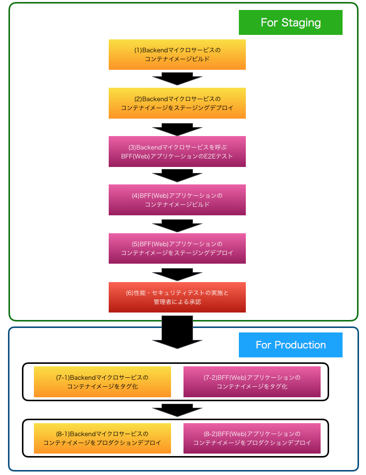

|br|

前回は(4)E2Eテストが完了したWeb(BackendForFrontend:BFF)アプリケーションのコンテナイメージをビルドして、DockerHubへプッシュするパイプラインを構築しました。
続く今回は、そのコンテナをステージング環境へデプロイするパイプラインを構築します。

|br|

5. Webアプリケーション(BFF)のステージング環境へデプロイ

* (5-1) ECSクラスタ上にアプリケーションコンテナを実行させる命令を発出します。
* (5-2) ECSエージェントが(4-2)でプッシュしたコンテナをECSクラスタ上にプルします。
* (5-3) ECSクラスタ上でアプリケーションコンテナが実行されます。

|br|

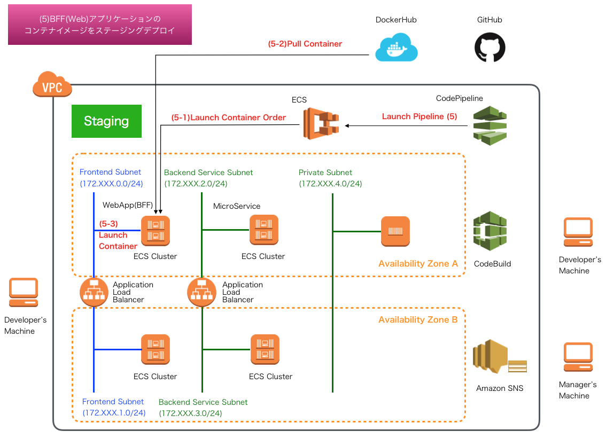

|br|

.. _section-codepipeline-setting-bff-staging-environment-label:

事前準備：Web(BFF)アプリケーションのステージング環境の構築
^^^^^^^^^^^^^^^^^^^^^^^^^^^^^^^^^^^^^^^^^^^^^^^^^^^^^^^^^^^^^^^^^^^^^^^^^^^^^^^^^^^^^^^^^^^^^^^^^^^^^^^^^^^^^^^

|br|

パイプラインの設定を行う前に、BFFアプリケーションをデプロイする先であるステージング環境のアプリケーションロードバランサ、ECSクラスタ、タスク定義、サービスの構築を行います。
作成方法の要領は、以下の手順と同様です。

* アプリケーションロードバランサ： `AWS ECS上に構築するSpringアプリケーション(2) <https://news.mynavi.jp/itsearch/article/devsoft/4359>`_
* ECSクラスタ： `AWS ECS上に構築するSpringアプリケーション(5) <https://news.mynavi.jp/itsearch/article/devsoft/4405>`_
* ECSタスク定義： `AWS ECS上に構築するSpringアプリケーション(6) <https://news.mynavi.jp/itsearch/article/devsoft/4408>`_
* ECSサービス実行： `AWS ECS上に構築するSpringアプリケーション(7) <https://news.mynavi.jp/itsearch/article/devsoft/4416>`_

|br|

上記の設定では、マイクロサービスにおけるステージング環境の構築と同様、:ref:`section-codepipeline-setting-codepipeline-backend-staging-environment-label` の表の記載してある、
タスクのメモリ、CPU、コンテナ名、イメージ設定で同様の留意が必要です。加えて、BFFアプリケーションは、マイクロサービスを呼び出すため、
バックエンドサブネットのロードバランサのDNSを `applicaiton.yml <https://github.com/debugroom/mynavi-sample-continuous-integration/blob/master/backend-for-frontend/src/main/resources/application.yml>`_ で環境変数から取得するよう定義しています。
そのため、このアプリケーションロードバランサのDNSを、BFFアプリケーションコンテナの実行時に環境変数として渡すように、下記の要領に従って設定します。
コンテナ実行時に参照する環境変数はECSタスク定義で設定しておくことが可能ですが、ここでは更に、SystemsManager ParameterStoreを経由して環境変数を取得するものとし、ECSサービスを実行するサービスロールにSSMのアクセス権限を付与しておきましょう。
このように設定しておくことで、ステージング・プロダクションともに同一のコンテナイメージで、コンテナ実行時の環境変数を切り替えて、テストが完了したステージング環境のコンテナイメージをそのままプロダクション環境で利用できるようになります。

|br|

.. list-table::
   :widths: 2, 3, 5

   * - 設定箇所
     - 設定内容
     - 説明

   * - ECSタスク定義：コンテナの追加
     - 環境：環境変数
     - バックエンドマイクロサービスへパスルーティングするアプリケーションロードバランサのDNSをSERVICE_DNS環境変数として設定します。ステージング環境での具体的な設定値は、SystemsManagerParameterStoreで定義した"SERVICE_DNS_STAGING"から取得するよう、ValueFromフィールドを設定します。

|br|

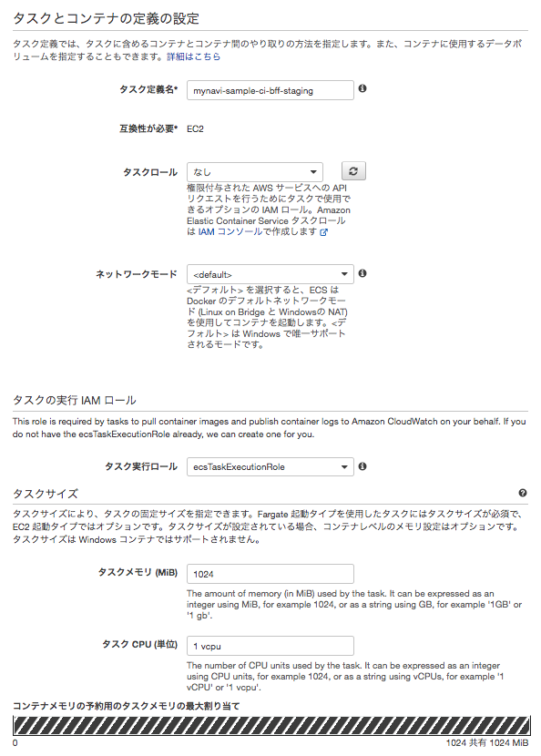

|br|

|br|

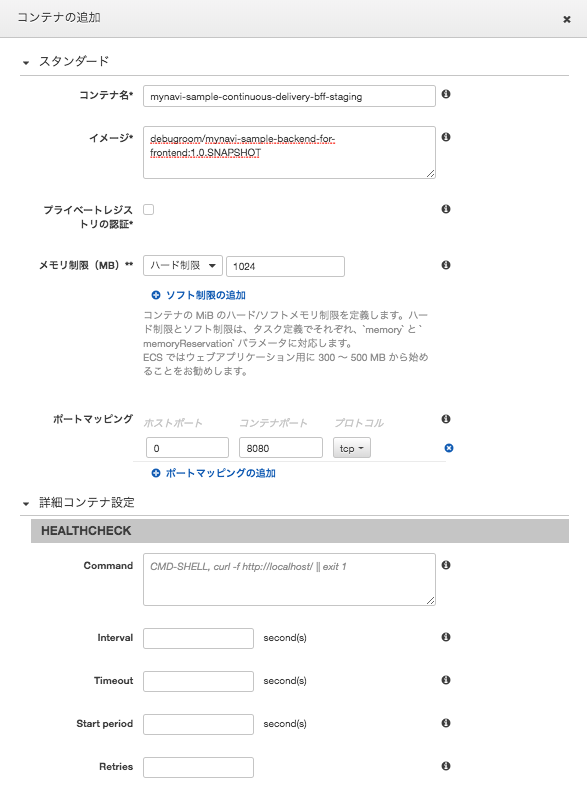

|br|

|br|

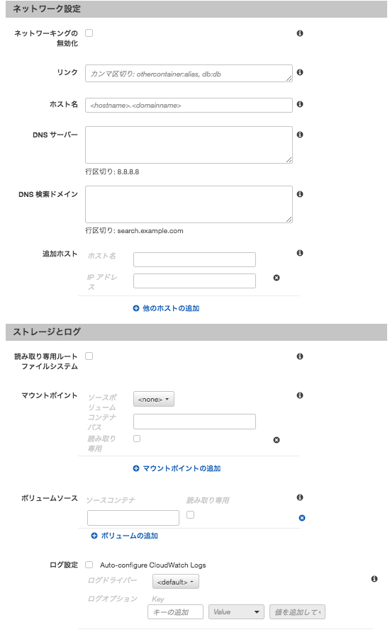

|br|

|br|

.. _section-codepipeline-setting-ssm-definition-bff-staging-and-ecs-service-role-label:

AWS Sysmtems Managers Parameter Storeでの環境変数の定義とECSサービスロールへのアクセス権限の付与
^^^^^^^^^^^^^^^^^^^^^^^^^^^^^^^^^^^^^^^^^^^^^^^^^^^^^^^^^^^^^^^^^^^^^^^^^^^^^^^^^^^^^^^^^^^^^^^^^^^^^^^^^^^^^^^

|br|

CodePipelineの設定を行う前に、前節のECSで使用する環境変数を定義しておきます。設定の要領は、 :ref:`section-codebuild-setting-sms-label` と同様です。以下のパラメータを定義します。

* "SERVICE_DNS_STAGING"：前節で作成したアプリケーションロードバランサーのDNS

|br|

また、前節で設定しているECSのタスク実行IAMロールにSystemsManagerParameterStoreのアクセス権限を付与しておきましょう。

|br|

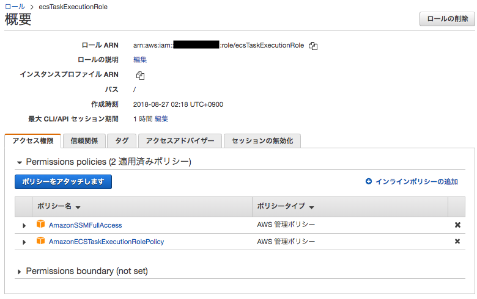

|br|

.. _section-codepipeline-setting-pipeline-deploy-bff-staging-label:

Web(BFF)アプリケーションのステージング環境へのデプロイ
^^^^^^^^^^^^^^^^^^^^^^^^^^^^^^^^^^^^^^^^^^^^^^^^^^^^^^^^^^^^^^^^^^^^^^^^^^^^^^^^^^^^^^^^^^^^^^^^^^^^^^^^^^^^^^^

|br|

これまで作成してきたCodePipelineを編集して、BFFアプリケーションのコンテナイメージをデプロイ設定します。
AWSコンソールの「CodePipeline」サービスを選択し、パイプラインを選択して、「編集する」ボタンを押下します。

|br|

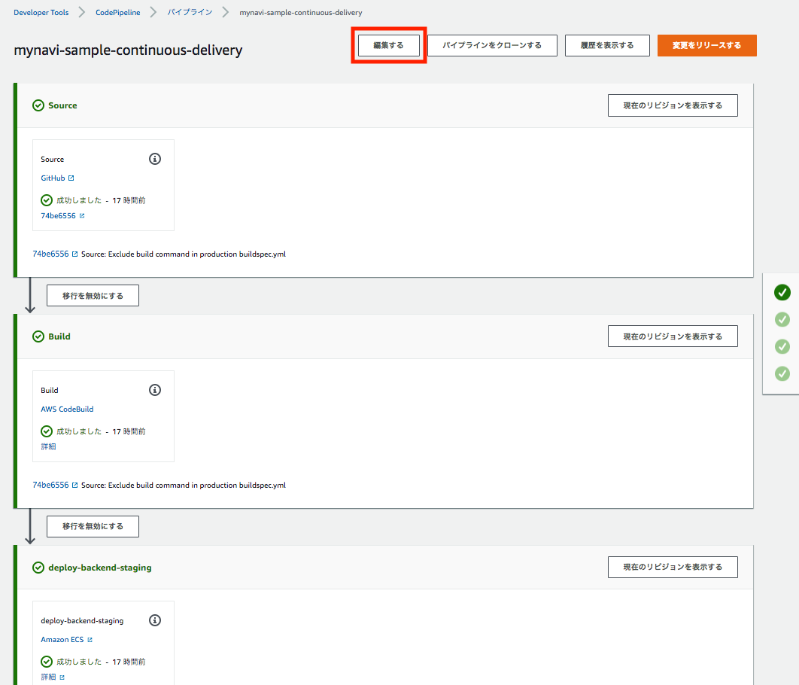

|br|

「ステージを追加する」ボタンを押下し、新たなステージを追加します。

|br|

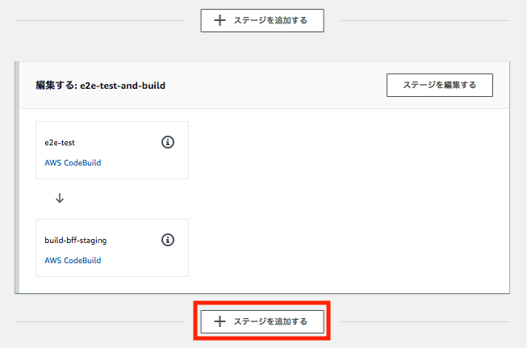

|br|

任意のステージ名を設定します。

|br|

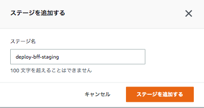

|br|

コンテナイメージをデプロイするための設定を行います。以下の要領でアクションを設定し、「完了」ボタンを押下します。

* アクション名：任意のアクション名を追加します。
* アクションプロバイダー：「Amazon ECS」を選択します。
* リージョン：ステージング環境があるリージョンを選択します。
* 入力アーティファクト：前回のコンテナをビルドするパイプラインで出力アーティファクトとなっている「BuildArtifact-BFF」を選択します。なお、この実体はimagedefinition.jsonであり、S3に保存されています。
* クラスタ名： 前節で作成したECSクラスタを選択します。
* サービス名： 前節で作成したECSサービスを選択します。
* イメージ定義ファイル：前回のパイプライン処理でbuildspec.ymlで出力したimagedefition.jsonを設定します。

|br|

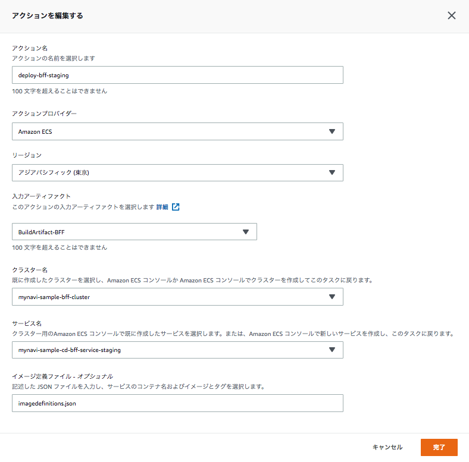

|br|

設定完了後、「変更をリリースする」ボタンを押下し、デプロイが問題なく完了するか確認します。

|br|

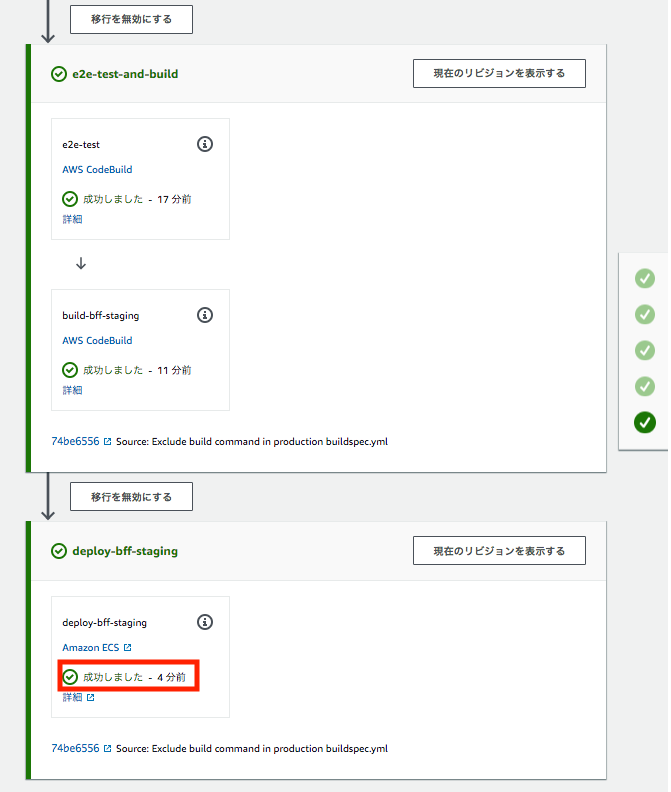

|br|

これでBFFアプリケーションをステージング環境へデプロイするパイプラインが作成できました。次回は、AmazonSNSへのトピックの作成とパイプラインの一時停止を行い、ステージング環境で実行したテスト結果を確認し、プロダクション環境へのリリースを承認するプロセスを行うパイプラインを作成します。

|br|

著者紹介
------------------------------------------------------------------

川畑 光平(KAWABATA Kohei) - NTTデータ 課長代理

.. figure:: img/automation_infra_devops_overview/pic_image01.jpg
   :scale: 100%

金融機関システム業務アプリケーション開発・システム基盤担当を経て、現在はソフトウェア開発自動化関連の研究開発・推進に従事。

Red Hat Certified Engineer、Pivotal Certified Spring Professional、AWS Certified Solutions Architect Professional等の資格を持ち、アプリケーション基盤・クラウドなど様々な開発プロジェクト支援にも携わる。

`2019 APN AWS Top Engineers & Ambassadors <https://aws.amazon.com/jp/blogs/psa/japan-apn-ambassador-2019/>`_ 選出。
