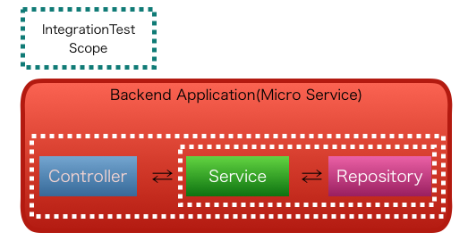

.. include:: ../module.txt

.. _section-automation-infra-devops-microservice-integration-test-label:

基盤・デプロイ自動化実践
==================================================================

マイクロサービスアーキテクチャの基盤・デプロイ自動化
------------------------------------------------------------------

|br|

.. _section-integration-test-for-microservice-label:

マイクロサービスにおける結合テスト
^^^^^^^^^^^^^^^^^^^^^^^^^^^^^^^^^^^^^^^^^^^^^^^^^^^^^^^^^^^^^^^^^^^^^^^^^^^^^^^^^^^^^^^

|br|

前回は、マイクロサービス(Backend)の単体テストの実装例や検証観点、テスト戦略のポイントを説明しました。
今回はバックエンドで実行されるマイクロサービスの結合テストです。アプリケーションおよびテストのパッケージ・コンポーネント構成は前回と同様、以下としています。

|br|

.. sourcecode:: bash

   [backend]
     └src
       ├main
       │ ├java
       │ │ └org
       │ │   └debugroom
       │ │     └mynavi
       │ │       └sample
       │ │         └continuous
       │ │           └integration
       │ │             └backend
       │ │               └app                                  ... アプリケーション層のパッケージ
       │ │               │ └model                              ... リクエストパラメータのモデルクラスパッケージ
       │ │               │ │ ├Xxxxx.java                       ... 入力チェックルール等が定義されるモデルクラス
       │ │               │ │ └XxxxxMapper.java                 ... ドメイン層のモデルクラスと相互変換するマッパークラス
       │ │               │ └web                                ... MvcConfigでコンポーネントスキャンの対象とするパッケージ
       │ │               │   └BackendRestController.java       ... リクエストハンドリング・ドメインサービス呼び出して、Resourceを返却するコントローラクラス
       │ │               └domain                               ... ドメイン層のパッケージ
       │ │               │ └model
       │ │               │ │ └entity                           ... JPAConfigでスキャン対象とするエンティティクラスパッケージ
       │ │               │ │   └Xxxxx.java                     ... JPAエンティティクラス
       │ │               │ ├repository                         ... JPAConfigでスキャン対象とするレポジトリクラスパッケージ
       │ │               │ │ ├specification                    ... JPAでテーブル結合等の条件を指定するクラスパッケージ
       │ │               │ │ │ └Xxxxx.java                     ... JPAでテーブル結合等の条件を指定するクラス
       │ │               │ │ └XxxxxRepository.java             ... レポジトリインタフェースクラス
       │ │               │ └service                            ... DomainConfigでコンポーネントスキャンの対象とするサービスクラスパッケージ
       │ │               │   ├SampleService.java               ... DBへ基本的なCRUDアクセスを行うサービスインタフェースクラス
       │ │               │   ├SampleServiceImpl.java           ... SampleServiceの実装クラス
       │ │               │   ├SampleOneToOneService.java       ... 1対1の関連をもつテーブルアクセスを行うサービスインタフェースクラス
       │ │               │   ├SampleOneToOneServiceImpl.java   ... SampleOneToOneServiceの実装クラス
       │ │               │   ├SampleOneToManyService.java      ... 1対多の関連をもつテーブルアクセスを行うサービスインタフェースクラス
       │ │               │   ├SampleOneToManyServiceImpl.java  ... SampleOneToOneServiceの実装クラス
       │ │               │   ├SampleManyToManyService.java     ... 多対多の関連をもつテーブルアクセスを行うサービスインタフェースクラス
       │ │               │   └SampleManyToManyServiceImpl.java ... サービス実装クラス
       │ │               └config                               ... 設定クラス用のパッケージ
       │ │                   ├App.java                         ... アプリケーション起動クラス
       │ │                   ├DevConfig.java                   ... 開発環境固有の設定クラス
       │ │                   ├DomainConfig.java                ... ドメイン層に関する設定クラス
       │ │                   ├JPAConfig.java                   ... JPA設定クラス
       │ │                   └MvcConfig.java                   ... アプリケーション層に関する設定クラス
       │ └resources
       │   ├application.yml                                    ... アプリケーション設定ファイル
       │   └application-dev.yml                                ... プロファイル"dev"で有効になるアプリケーション設定ファイル
       test                                                    ... テストパッケージフォルダ
         ├java
         │ └org
         │   └debugroom
         │     └mynavi
         │       └sample
         │         └continuous
         │           └integration
         │             └backend
         │               ├app
         │               │ └web
         │               │   └BackendRestControllerTest.java   ... Controllerのテストクラス
         │               ├domain
         │               │ ├DataJpaTestConfig.java             ... Repositoryのテスト設定クラス
         │               │ ├repository                         ... Repositoryテストパッケージ
         │               │ │ └XxxxRepositoryTest.java          ... Repositoryのテストクラス
         │               │ └service                            ... Serviceテストパッケージ
         │               │   └XxxxServiceTest.java             ... Serviceのテストクラス
         │               └config
         │                 └TestConfig.java                    ... Testの汎用設定クラス
         └resources
           ├META-INF
           │ └dbunit                                           ... DBUnitのテーブルデータ用パッケージ
           │   └domain
           │     └service
           │       └XxxxServiceTest                            ... テストクラスごとのフォルダ
           │         └Xxxx                                     ... テストケースごとのフォルダ
           │           ├Xxxxx.csv                              ... 各テーブルのテストデータ
           │           └table-ordering.txt                     ... 読み込み対象のテーブル名を記載したテキストファイル
           └application.yml                                    ... テスト用のアプリケーション設定ファイル

|br|

各コンポーネントは `TERASOLUNAのガイドライン レイヤの依存関係 <http://terasolunaorg.github.io/guideline/5.5.1.RELEASE/ja/Overview/ApplicationLayering.html#id9>`_ を基本的に踏襲していますが、Controller→Service→Repositoryという単方向の呼び出ししかありません。
そのため、結合試験としては、下記のイメージ通り、Service→Repositoryおよび、Controller→Service→Repositoryといった順に積み上げ式で試験を進めることにします(Repositoryをスタブ化し、ControllerとServiceのみの結合試験は除外できます)。

|br|

|br|

各テストの観点は以下の通りです。コンポーネントの内部構造は意識せず、ブラックボックス的に処理実行後のIOやデータベース反映結果を中心に検証します。

|br|

.. list-table::
   :widths: 3, 3, 3, 11

   * - アプリケーション
     - 試験
     - コンポーネント
     - 検証観点

   * - マイクロサービス |br| (Backend)
     - 結合試験
     - Service⇔Repository
     - ・データベースから正しく値が取得できるか |br| ・データベースへ正しくデータが反映できるか |br| ・設定ファイルが正しく動作するか

   * -
     -
     - Controller⇔Service⇔Repository
     - ・期待したレスポンスが返却されるか |br| ・モデル間のデータマッピングが正しく実行されているか |br| ・設定ファイルが正しく動作するか

|br|

.. _section-service-repository-integration-test-for-microservice-label:

Service⇔Repositoryの結合テスト実装
^^^^^^^^^^^^^^^^^^^^^^^^^^^^^^^^^^^^^^^^^^^^^^^^^^^^^^^^^^^^^^^^^^^^^^^^^^^^^^^^^^^^^^^

|br|

データベースからの基本的なデータ取得については、Repositoryの単体テストで妥当性確認はとれているので、データベースへの更新結果を中心にDBUnitを用いて検証します(複雑な条件のデータ取得は処理結合レベルでバリエーションテストを実施した方がよりベターです)。
また、Serviceの単体でも分岐条件などで発生するビジネスエラーや設定されるメッセージの確認はとれているので、ServiceがRepositoryを正しく呼び出すことができるか、
プロパティなどの設定が正しく動作するかを@SpringBootTestアノテーションを使って、SpringBootApplicationを起動した場合のように検証します。
Serviceクラスを起点としたサンプル結合テストコードは以下の通りです。

|br|

.. sourcecode:: java

   package org.debugroom.mynavi.sample.continuous.integration.backend.domain.service;

   // omit
   import com.github.springtestdbunit.DbUnitTestExecutionListener;
   import com.github.springtestdbunit.annotation.DbUnitConfiguration;
   import com.github.springtestdbunit.annotation.ExpectedDatabase;
   import com.github.springtestdbunit.annotation.ExpectedDatabases;
   import com.github.springtestdbunit.assertion.DatabaseAssertionMode;
   import com.github.springtestdbunit.dataset.AbstractDataSetLoader;

   import org.dbunit.dataset.IDataSet;
   import org.dbunit.dataset.csv.CsvDataSet;

   import org.springframework.boot.test.context.SpringBootTest;
   import org.springframework.test.context.TestExecutionListeners;
   import org.springframework.test.context.junit4.SpringRunner;
   import org.springframework.test.context.support.DependencyInjectionTestExecutionListener;
   import org.springframework.test.context.support.DirtiesContextTestExecutionListener;
   import org.springframework.test.context.transaction.TransactionalTestExecutionListener;

   // omit

   @RunWith(SpringRunner.class)                                                 // …(A)
   @SpringBootTest(classes = {
         TestConfig.ServiceTestConfig.class,
   }, webEnvironment =  SpringBootTest.WebEnvironment.NONE)                     // …(B)
   @TestExecutionListeners({ DependencyInjectionTestExecutionListener.class,
         DirtiesContextTestExecutionListener.class,
         TransactionalTestExecutionListener.class,
         DbUnitTestExecutionListener.class })                                   // …(C)
   @DbUnitConfiguration(dataSetLoader = IntegrationTest.CsvDataSetLoader.class) // …(D)
   @ActiveProfiles("dev")
   public static class IntegrationTest{

       public static class CsvDataSetLoader extends AbstractDataSetLoader{  // …(E)
           @Override
           protected IDataSet createDataSet(Resource resource) throws Exception {
               return new CsvDataSet(resource.getFile());
           }
       }

       // omit

       @Autowired
       SampleService sampleService;

       @Test
       @ExpectedDatabases({                                                       // …(F)
             @ExpectedDatabase(
                     value = "classpath:/META-INF/dbunit/domain/service/SampleServiceImplTest/add",
                     table = "usr", assertionMode = DatabaseAssertionMode.NON_STRICT),
             @ExpectedDatabase(
                     value = "classpath:/META-INF/dbunit/domain/service/SampleServiceImplTest/add",
                     table = "address", assertionMode = DatabaseAssertionMode.NON_STRICT),
             @ExpectedDatabase(
                     value = "classpath:/META-INF/dbunit/domain/service/SampleServiceImplTest/add",
                     table = "email", assertionMode = DatabaseAssertionMode.NON_STRICT_UNORDERED),
             @ExpectedDatabase(
                     value = "classpath:/META-INF/dbunit/domain/service/SampleServiceImplTest/add",
                     table = "membership", assertionMode = DatabaseAssertionMode.NON_STRICT_UNORDERED),
       })
       public void addNormalTest() throws BusinessException{
           // omit
           User addUser = User.builder()
                 .firstName("saburo")
                 .familyName("mynavi")
                 .loginId("saburo.mynavi")
                 .isLogin(false)
                 .addressByUserId(addAddress)
                 .emailsByUserId(Arrays.asList(new Email[]{addEmail1, addEmail2}))
                 .membershipsByUserId(Arrays.asList(new Membership[]{membership1}))
                 .build();
          sampleService.add(addUser);
       }

|br|

.. list-table:: Service⇔Repositoryの結合テストコードの説明
   :widths: 1, 19

   * - 項番
     - 説明

   * - (A)
     - テストランナーとして、SpringRunnerを指定します。

   * - (B)
     - @SpringBootTestアノテーションには、テスト向け固有の設定クラスを任意に指定し、Controllerを介さない場合、Webコンテナ(Server)を起動しないオプションを指定しておきます。

   * - (C)
     - DBUnitで使用するTestExecutionListenerの設定を行います。ここでは詳しい説明は割愛しますが、詳細は `TERASOLUNAガイドライン TestExecutionListenerの登録 <http://terasolunaorg.github.io/guideline/5.5.1.RELEASE/ja/UnitTest/ImplementsOfUnitTest/UsageOfLibraryForTest.html#usageoflibraryfortestregistrationoftestexecutionlistener>`_ を参照してください。

   * - (D)
     - テストに使うデータベースへのデータ設定にはCSV形式のデータファイルを使用します。なお、データはExcel形式でもできますが、実行パフォーマンスの問題やコードコミット時にバイナリファイルで差分比較ができなくなるためCSVの方がベターです。詳細は `テストデータのセットアップ <http://terasolunaorg.github.io/guideline/5.5.1.RELEASE/ja/UnitTest/ImplementsOfUnitTest/PreparationForTest.html#spring-test-dbunit>`_ を参照してください。

   * - (E)
     - CSV形式でデータロードするための拡張クラスです。

   * - (F)
     - テストメソッド実行後に期待するデータベースのデータを各テーブルごとに設定します。詳細は `Spring Test DBUnitを利用したテスト <http://terasolunaorg.github.io/guideline/5.5.1.RELEASE/ja/UnitTest/ImplementsOfUnitTest/ImplementsOfTestByLayer.html#spring-test-dbunit>`_ も参照してください。

|br|

サンプルとして実装したテストケースと検証観点は以下になります。テストケースの順序をうまく設定すること(AddしてからFindAllする)でトランザクションの有効化なども合わせて、処理結合テストレベルで検証するようにしています。
なお、下記のように、プロファイル"dev"で有効化する設定クラスを作成し、データベースおよびテストデータは事前にHSQLなどのインメモリDBに設定しておきます。

|br|

.. sourcecode:: java

   package org.debugroom.mynavi.sample.continuous.integration.backend.config;

   import javax.sql.DataSource;

   import org.springframework.context.annotation.Bean;
   import org.springframework.context.annotation.Configuration;
   import org.springframework.context.annotation.Profile;
   import org.springframework.jdbc.datasource.embedded.EmbeddedDatabaseBuilder;
   import org.springframework.jdbc.datasource.embedded.EmbeddedDatabaseType;

   @Profile("dev")
   @Configuration
   public class DevConfig {

       @Bean
       public DataSource dataSource(){
           return (new EmbeddedDatabaseBuilder())
             .setType(EmbeddedDatabaseType.HSQL)
             .addScript("classpath:ddl/schema.sql")
             .addScript("classpath:ddl/data.sql")
             .build();
       }
   }

.. _SampleService#add: https://github.com/debugroom/mynavi-sample-continuous-integration/blob/master/backend/src/main/java/org/debugroom/mynavi/sample/continuous/integration/backend/domain/service/SampleServiceImpl.java#L52
.. _SampleServiceTest#addNormalTest(): https://github.com/debugroom/mynavi-sample-continuous-integration/blob/master/backend/src/test/java/org/debugroom/mynavi/sample/continuous/integration/backend/domain/service/SampleServiceImplTest.java#L348
.. _SampleService#findOne: https://github.com/debugroom/mynavi-sample-continuous-integration/blob/master/backend/src/main/java/org/debugroom/mynavi/sample/continuous/integration/backend/domain/service/SampleServiceImpl.java#L35
.. _SampleServiceTest#findOneNormalTest(): https://github.com/debugroom/mynavi-sample-continuous-integration/blob/master/backend/src/test/java/org/debugroom/mynavi/sample/continuous/integration/backend/domain/service/SampleServiceImplTest.java#L375
.. _SampleService#findAll: https://github.com/debugroom/mynavi-sample-continuous-integration/blob/master/backend/src/main/java/org/debugroom/mynavi/sample/continuous/integration/backend/domain/service/SampleServiceImpl.java#L47
.. _SampleServiceTest#findAllNormalTest(): https://github.com/debugroom/mynavi-sample-continuous-integration/blob/master/backend/src/test/java/org/debugroom/mynavi/sample/continuous/integration/backend/domain/service/SampleServiceImplTest.java#L382
.. _SampleService#update: https://github.com/debugroom/mynavi-sample-continuous-integration/blob/master/backend/src/main/java/org/debugroom/mynavi/sample/continuous/integration/backend/domain/service/SampleServiceImpl.java#L98
.. _SampleServiceTest#updateNormalTest(): https://github.com/debugroom/mynavi-sample-continuous-integration/blob/master/backend/src/test/java/org/debugroom/mynavi/sample/continuous/integration/backend/domain/service/SampleServiceImplTest.java#L404
.. _SampleService#delete: https://github.com/debugroom/mynavi-sample-continuous-integration/blob/master/backend/src/main/java/org/debugroom/mynavi/sample/continuous/integration/backend/domain/service/SampleServiceImpl.java#L145
.. _SampleServiceTest#deleteNormalTest(): https://github.com/debugroom/mynavi-sample-continuous-integration/blob/master/backend/src/test/java/org/debugroom/mynavi/sample/continuous/integration/backend/domain/service/SampleServiceImplTest.java#L447
.. _SampleOneToOneService#findAddressOf: https://github.com/debugroom/mynavi-sample-continuous-integration/blob/master/backend/src/main/java/org/debugroom/mynavi/sample/continuous/integration/backend/domain/service/SampleOneToOneServiceImpl.java#L33
.. _SampleOneToOneServiceTest#findAddressOfNormalTest(): https://github.com/debugroom/mynavi-sample-continuous-integration/blob/master/backend/src/test/java/org/debugroom/mynavi/sample/continuous/integration/backend/domain/service/SampleOneToOneServiceImplTest.java#L168
.. _SampleOneToOneService#findUserHavingAddressOfZipCode: https://github.com/debugroom/mynavi-sample-continuous-integration/blob/master/backend/src/main/java/org/debugroom/mynavi/sample/continuous/integration/backend/domain/service/SampleOneToOneServiceImpl.java#L45
.. _SampleOneToOneServiceTest#findUserHavingAddressOfZipCodeNormalTest1(): https://github.com/debugroom/mynavi-sample-continuous-integration/blob/master/backend/src/test/java/org/debugroom/mynavi/sample/continuous/integration/backend/domain/service/SampleOneToOneServiceImplTest.java#L175
.. _SampleOneToOneServiceTest#findUserHavingAddressOfZipCodeNormalTest2(): https://github.com/debugroom/mynavi-sample-continuous-integration/blob/master/backend/src/test/java/org/debugroom/mynavi/sample/continuous/integration/backend/domain/service/SampleOneToOneServiceImplTest.java#L184
.. _SampleOneToOneService#findUserNotHavingAddressOfZipCode: https://github.com/debugroom/mynavi-sample-continuous-integration/blob/master/backend/src/main/java/org/debugroom/mynavi/sample/continuous/integration/backend/domain/service/SampleOneToOneServiceImpl.java#L51
.. _SampleOneToOneServiceTest#findUserNotHavingAddressOfZipCodeNormalTest1(): https://github.com/debugroom/mynavi-sample-continuous-integration/blob/master/backend/src/test/java/org/debugroom/mynavi/sample/continuous/integration/backend/domain/service/SampleOneToOneServiceImplTest.java#L190
.. _SampleOneToOneServiceTest#findUserNotHavingAddressOfZipCodeNormalTest2(): https://github.com/debugroom/mynavi-sample-continuous-integration/blob/master/backend/src/test/java/org/debugroom/mynavi/sample/continuous/integration/backend/domain/service/SampleOneToOneServiceImplTest.java#L199
.. _SampleOneToOneService#update: https://github.com/debugroom/mynavi-sample-continuous-integration/blob/master/backend/src/main/java/org/debugroom/mynavi/sample/continuous/integration/backend/domain/service/SampleOneToOneServiceImpl.java#L57
.. _SampleOneToOneServiceTest#updateTestNormal(): https://github.com/debugroom/mynavi-sample-continuous-integration/blob/master/backend/src/test/java/org/debugroom/mynavi/sample/continuous/integration/backend/domain/service/SampleOneToOneServiceImplTest.java#L213
.. _SampleOneToManyService#getEmailsOf: https://github.com/debugroom/mynavi-sample-continuous-integration/blob/master/backend/src/main/java/org/debugroom/mynavi/sample/continuous/integration/backend/domain/service/SampleOneToManyServiceImpl.java#L38
.. _SampleOneToManyServiceTest#getEmailsOfNormalTest(): https://github.com/debugroom/mynavi-sample-continuous-integration/blob/master/backend/src/test/java/org/debugroom/mynavi/sample/continuous/integration/backend/domain/service/SampleOneToManyServiceImplTest.java#L202
.. _SampleOneToManyService#add: https://github.com/debugroom/mynavi-sample-continuous-integration/blob/master/backend/src/main/java/org/debugroom/mynavi/sample/continuous/integration/backend/domain/service/SampleOneToManyServiceImpl.java#L55
.. _SampleOneToManyServiceTest#addNormalTest(): https://github.com/debugroom/mynavi-sample-continuous-integration/blob/master/backend/src/test/java/org/debugroom/mynavi/sample/continuous/integration/backend/domain/service/SampleOneToManyServiceImplTest.java#L217
.. _SampleOneToManyService#update: https://github.com/debugroom/mynavi-sample-continuous-integration/blob/master/backend/src/main/java/org/debugroom/mynavi/sample/continuous/integration/backend/domain/service/SampleOneToManyServiceImpl.java#L74
.. _SampleOneToManyServiceTest#updateNormalTest(): https://github.com/debugroom/mynavi-sample-continuous-integration/blob/master/backend/src/test/java/org/debugroom/mynavi/sample/continuous/integration/backend/domain/service/SampleOneToManyServiceImplTest.java#L236
.. _SampleOneToManyService#delete: https://github.com/debugroom/mynavi-sample-continuous-integration/blob/master/backend/src/main/java/org/debugroom/mynavi/sample/continuous/integration/backend/domain/service/SampleOneToManyServiceImpl.java#L92
.. _SampleOneToManyServiceTest#deleteNormalTest1(): https://github.com/debugroom/mynavi-sample-continuous-integration/blob/master/backend/src/test/java/org/debugroom/mynavi/sample/continuous/integration/backend/domain/service/SampleOneToManyServiceImplTest.java#L251
.. _SampleOneToManyServiceTest#deleteNormalTest2(): https://github.com/debugroom/mynavi-sample-continuous-integration/blob/master/backend/src/test/java/org/debugroom/mynavi/sample/continuous/integration/backend/domain/service/SampleOneToManyServiceImplTest.java#L265
.. _SampleOneToManyService#deleteAll: https://github.com/debugroom/mynavi-sample-continuous-integration/blob/master/backend/src/main/java/org/debugroom/mynavi/sample/continuous/integration/backend/domain/service/SampleOneToManyServiceImpl.java#L122
.. _SampleOneToManyServiceTest#deleteAllNormalTest(): https://github.com/debugroom/mynavi-sample-continuous-integration/blob/master/backend/src/test/java/org/debugroom/mynavi/sample/continuous/integration/backend/domain/service/SampleOneToManyServiceImplTest.java#L279
.. _SampleManyToManyService#getGroupOf: https://github.com/debugroom/mynavi-sample-continuous-integration/blob/master/backend/src/main/java/org/debugroom/mynavi/sample/continuous/integration/backend/domain/service/SampleManyToManyServiceImpl.java#L40
.. _SampleManyToManyServiceTest#getGroupOfUserNormalTest(): https://github.com/debugroom/mynavi-sample-continuous-integration/blob/master/backend/src/test/java/org/debugroom/mynavi/sample/continuous/integration/backend/domain/service/SampleManyToManyServiceImplTest.java#L186
.. _SampleManyToManyService#getUserOf: https://github.com/debugroom/mynavi-sample-continuous-integration/blob/master/backend/src/main/java/org/debugroom/mynavi/sample/continuous/integration/backend/domain/service/SampleManyToManyServiceImpl.java#L46
.. _SampleManyToManyServiceTest#getUserOfGroupNormalTest(): https://github.com/debugroom/mynavi-sample-continuous-integration/blob/master/backend/src/test/java/org/debugroom/mynavi/sample/continuous/integration/backend/domain/service/SampleManyToManyServiceImplTest.java#L198
.. _SampleManyToManyService#getUserOfNot: https://github.com/debugroom/mynavi-sample-continuous-integration/blob/master/backend/src/main/java/org/debugroom/mynavi/sample/continuous/integration/backend/domain/service/SampleManyToManyServiceImpl.java#L52
.. _SampleManyToManyServiceTest#getUserOfNotGroupNormalTest(): https://github.com/debugroom/mynavi-sample-continuous-integration/blob/master/backend/src/test/java/org/debugroom/mynavi/sample/continuous/integration/backend/domain/service/SampleManyToManyServiceImplTest.java#L208
.. _SampleManyToManyService#addUserTo: https://github.com/debugroom/mynavi-sample-continuous-integration/blob/master/backend/src/main/java/org/debugroom/mynavi/sample/continuous/integration/backend/domain/service/SampleManyToManyServiceImpl.java#L58
.. _SampleManyToManyServiceTest#addUserToGroupNormalTest(): https://github.com/debugroom/mynavi-sample-continuous-integration/blob/master/backend/src/test/java/org/debugroom/mynavi/sample/continuous/integration/backend/domain/service/SampleManyToManyServiceImplTest.java#L223
.. _SampleManyToManyService#deleteUserFrom: https://github.com/debugroom/mynavi-sample-continuous-integration/blob/master/backend/src/main/java/org/debugroom/mynavi/sample/continuous/integration/backend/domain/service/SampleManyToManyServiceImpl.java#L86
.. _SampleManyToManyServiceTest#deleteUserFromGroupNormalTest(): https://github.com/debugroom/mynavi-sample-continuous-integration/blob/master/backend/src/test/java/org/debugroom/mynavi/sample/continuous/integration/backend/domain/service/SampleManyToManyServiceImplTest.java#L235
.. _SampleManyToManyService#delete: https://github.com/debugroom/mynavi-sample-continuous-integration/blob/master/backend/src/main/java/org/debugroom/mynavi/sample/continuous/integration/backend/domain/service/SampleManyToManyServiceImpl.java#L109
.. _SampleManyToManyServiceTest#deleteGroupNormalTest(): https://github.com/debugroom/mynavi-sample-continuous-integration/blob/master/backend/src/test/java/org/debugroom/mynavi/sample/continuous/integration/backend/domain/service/SampleManyToManyServiceImplTest.java#L250

|br|

.. list-table::
   :widths: 7, 6, 7

   * - ユースケース
     - 主な処理実装クラス・メソッド |br| テストメソッド
     - 検証観点

   * - [正常系]ユーザを追加する
     - `SampleService#add`_  |br| |br|  `SampleServiceTest#addNormalTest()`_
     - ・データベースへ正しくデータが反映できるか

   * - [正常系]ユーザを検索する
     - `SampleService#findOne`_  |br| |br|  `SampleServiceTest#findOneNormalTest()`_
     - ・データベースから正しく値が取得できるか |br| ・(Autowiredインジェクション等)設定が正しいか

   * - [正常系]全ユーザを検索する
     - `SampleService#findAll`_  |br| |br|  `SampleServiceTest#findAllNormalTest()`_
     - ・(トランザクション)設定が正しいか

   * - [正常系]ユーザを更新する
     - `SampleService#update`_  |br| |br|  `SampleServiceTest#updateNormalTest()`_
     - ・データベースへ正しくデータが反映できるか(想定した部分以外まで更新されていないか)

   * - [正常系]ユーザを削除する
     - `SampleService#delete`_  |br| |br|  `SampleServiceTest#deleteNormalTest()`_
     - ・データベースへ正しくデータが反映できるか(想定した部分以外まで削除されていないか)

   * - [正常系]指定したユーザの住所を取得する
     - `SampleOneToOneService#findAddressOf`_  |br| |br|  `SampleOneToOneServiceTest#findAddressOfNormalTest()`_
     - ・データベースから正しく値が取得できるか |br| ・(Autowiredインジェクション等)設定が正しいか

   * - [正常系]指定した郵便番号の住所をもつユーザを取得する(1)
     - `SampleOneToOneService#findUserHavingAddressOfZipCode`_  |br| |br|  `SampleOneToOneServiceTest#findUserHavingAddressOfZipCodeNormalTest1()`_
     - ・データベースから正しく値が取得できるか

   * - [正常系]指定した郵便番号の住所をもつユーザを取得する(2)
     - `SampleOneToOneService#findUserHavingAddressOfZipCode`_  |br| |br|  `SampleOneToOneServiceTest#findUserHavingAddressOfZipCodeNormalTest2()`_
     - ・データベースから正しく値が取得できるか

   * - [正常系]指定した郵便番号の住所をもたないユーザを取得する(1)
     - `SampleOneToOneService#findUserHavingAddressOfZipCode`_  |br| |br|  `SampleOneToOneServiceTest#findUserHavingAddressOfZipCodeNormalTest1()`_
     - ・データベースから正しく値が取得できるか

   * - [正常系]指定した郵便番号の住所をもたないユーザを取得する(2)
     - `SampleOneToOneService#findUserHavingAddressOfZipCode`_  |br| |br|  `SampleOneToOneServiceTest#findUserHavingAddressOfZipCodeNormalTest2()`_
     - ・データベースから正しく値が取得できるか

   * - [正常系]住所を更新する。
     - `SampleOneToOneService#update`_  |br| |br|  `SampleOneToOneServiceTest#updateTestNormal()`_
     - ・データベースへ正しくデータが反映できるか(想定した部分以外まで削除されていないか)

   * - [正常系]指定したユーザのメールリストを取得する
     - `SampleOneToManyService#getEmailsOf`_  |br| |br|  `SampleOneToManyServiceTest#getEmailsOfNormalTest()`_
     - ・データベースから正しく値が取得できるか |br| ・(Autowiredインジェクション等)設定が正しいか

   * - [正常系]メールを追加する。
     - `SampleOneToManyService#add`_  |br| |br|  `SampleOneToManyServiceTest#addNormalTest()`_
     - ・データベースへ正しくデータが反映できるか

   * - [正常系]メールを更新する。
     - `SampleOneToManyService#update`_  |br| |br|  `SampleOneToManyServiceTest#updateNormalTest()`_
     - ・データベースへ正しくデータが反映できるか(想定した部分以外まで更新されていないか)

   * - [正常系]メールを削除する(1)。
     - `SampleOneToManyService#delete`_  |br| |br|  `SampleOneToManyServiceTest#deleteNormalTest1()`_
     - ・データベースへ正しくデータが反映できるか(想定した部分以外まで削除されていないか)

   * - [正常系]メールを削除する(2)。
     - `SampleOneToManyService#delete`_  |br| |br|  `SampleOneToManyServiceTest#deleteNormalTest2()`_
     - ・データベースへ正しくデータが反映できるか(想定した部分以外まで削除されていないか)

   * - [正常系]全てのメールを削除する。
     - `SampleOneToManyService#deleteAll`_  |br| |br|  `SampleOneToManyServiceTest#deleteAllNormalTest()`_
     - ・データベースへ正しくデータが反映できるか(想定した部分以外まで削除されていないか)

   * - [正常系]ユーザが所属するグループを取得する
     - `SampleManyToManyService#getGroupOf`_  |br| |br|  `SampleManyToManyServiceTest#getGroupOfUserNormalTest()`_
     - ・データベースから正しく値が取得できるか |br| ・(Autowiredインジェクション等)設定が正しいか

   * - [正常系]指定したグループに所属するユーザを取得する
     - `SampleManyToManyService#getUserOf`_  |br| |br|  `SampleManyToManyServiceTest#getUserOfGroupNormalTest()`_
     - ・データベースから正しく値が取得できるか

   * - [正常系]指定したグループに所属しないユーザを取得する
     - `SampleManyToManyService#getUserOfNot`_  |br| |br|  `SampleManyToManyServiceTest#getUserOfNotGroupNormalTest()`_
     - ・データベースから正しく値が取得できるか

   * - [正常系]指定したグループにユーザを追加する
     - `SampleManyToManyService#addUserTo`_  |br| |br|  `SampleManyToManyServiceTest#addUserToGroupNormalTest()`_
     - ・データベースへ正しくデータが反映できるか

   * - [正常系]指定したグループからユーザを削除する
     - `SampleManyToManyService#deleteUserFrom`_  |br| |br|  `SampleManyToManyServiceTest#deleteUserFromGroupNormalTest()`_
     - ・データベースへ正しくデータが反映できるか(想定した部分以外まで削除されていないか)

   * - [正常系]指定したグループを削除する
     - `SampleManyToManyService#delete`_  |br| |br|  `SampleManyToManyServiceTest#deleteGroupNormalTest()`_
     - ・データベースへ正しくデータが反映できるか(想定した部分以外まで削除されていないか)

|br|

.. _section-controller-service-repository-integration-test-for-microservice-label:

Controller⇔Service⇔Repositoryの結合テスト実装
^^^^^^^^^^^^^^^^^^^^^^^^^^^^^^^^^^^^^^^^^^^^^^^^^^^^^^^^^^^^^^^^^^^^^^^^^^^^^^^^^^^^^^^

|br|

Controller⇔Service⇔Repositoryの結合テストでは、実際にアプリケーションを起動した時と同様、HTTPリクエストを送信し、期待したHTTPレスポンスが返ってくるか検証します。
データベースへの反映結果は前節のService⇔Repositoryで確認が取れているので、Service実行後のアウトプットが期待した通り、HTTPレスポンスに変換されるか、モデルのデータマッピングが正しく実行されているか、アプリケーションの設定が正しく動作するかといった点が主な観点になります。
Controllerクラスを起点とした結合テストサンプルコードは以下の通りです。

.. sourcecode:: java

   package org.debugroom.mynavi.sample.continuous.integration.backend.app.web;

   // omit

   import org.springframework.boot.test.context.SpringBootTest;
   import org.springframework.boot.test.web.client.TestRestTemplate;
   import org.springframework.boot.web.server.LocalServerPort;
   import org.springframework.test.context.junit4.SpringRunner;

   // omit

   @RunWith(SpringRunner.class)                                      // …(A)
   @SpringBootTest(classes = TestConfig.ControllerTestConfig.class,
      webEnvironment = SpringBootTest.WebEnvironment.RANDOM_PORT)    // …(B)
   public static class IntegrationTest{

       private static final String testServer = "localhost";

       @Autowired
       TestRestTemplate testRestTemplate;                           // …(C)

       @LocalServerPort
       int port;                                                    // …(D)

       private String testServerURL;

       @Before
       public void setUp(){
           testServerURL = "http://" + testServer + ":" + port;     // …(E)
       }

       @Test
       public void getUsersNormalTest(){
           ResponseEntity<UserResource[]> responseEntity = testRestTemplate
             .getForEntity(testServerURL + "/api/v1/users", UserResource[].class);

           List<UserResource> userResources = Arrays.asList(responseEntity.getBody());

           assertThat(userResources.size(), is(3));
           userResources.forEach(userResource -> {
               switch (Long.toString(userResource.getUserId())){
                   case "1":
                       assertThat(userResource.getFirstName(), is("hanako"));
                       assertThat(userResource.getFamilyName(), is("mynavi"));
                       break;
                   // omit
               }
           });

      }

|br|

.. list-table:: Controller⇔Service⇔Repositoryの結合テストコードの説明
   :widths: 1, 19

   * - 項番
     - 説明

   * - (A)
     - テストランナーとして、SpringRunnerを指定します。

   * - (B)
     - @SpringBootTestアノテーションには、テスト向け固有の設定クラスを任意に指定し、Webコンテナ(Server)の起動時のポートをランダムで指定しておきます。

   * - (C)
     - 起動したテストアプリケーションに対して、リクエストを送信するTestRestTemplateをインジェクションします。

   * - (D)
     - (B)でランダム指定したポートを取得します。

   * - (E)
     - セットアップメソッドで、HTTPリクエストを送信するテストサーバURLを作成します。

|br|

サンプルとして実装したテストケースと検証観点は以下になります。異常系のバリエーションは単体テストで検証しているため、
基本的には、エラー時のHTTPレスポンス生成が正しく実行されるかといった点のみを検証しています。

.. _BackendController#getUsers: https://github.com/debugroom/mynavi-sample-continuous-integration/blob/master/backend/src/main/java/org/debugroom/mynavi/sample/continuous/integration/backend/app/web/BackendContoller.java#L53
.. _BackendControllerTest#getUsersNormalTest(): https://github.com/debugroom/mynavi-sample-continuous-integration/blob/master/backend/src/test/java/org/debugroom/mynavi/sample/continuous/integration/backend/app/web/BackendControllerTest.java#L578
.. _BackendController#getUser: https://github.com/debugroom/mynavi-sample-continuous-integration/blob/master/backend/src/main/java/org/debugroom/mynavi/sample/continuous/integration/backend/app/web/BackendContoller.java#L58
.. _BackendControllerTest#getUserNormalTest(): https://github.com/debugroom/mynavi-sample-continuous-integration/blob/master/backend/src/test/java/org/debugroom/mynavi/sample/continuous/integration/backend/app/web/BackendControllerTest.java#L605
.. _BackendControllerTest#getUserAbnormalTest(): https://github.com/debugroom/mynavi-sample-continuous-integration/blob/master/backend/src/test/java/org/debugroom/mynavi/sample/continuous/integration/backend/app/web/BackendControllerTest.java#L622
.. _BackendController#addUser: https://github.com/debugroom/mynavi-sample-continuous-integration/blob/master/backend/src/main/java/org/debugroom/mynavi/sample/continuous/integration/backend/app/web/BackendContoller.java#L65
.. _BackendControllerTest#addUserNormalTest(): https://github.com/debugroom/mynavi-sample-continuous-integration/blob/master/backend/src/test/java/org/debugroom/mynavi/sample/continuous/integration/backend/app/web/BackendControllerTest.java#L636
.. _BackendController#updateUser: https://github.com/debugroom/mynavi-sample-continuous-integration/blob/master/backend/src/main/java/org/debugroom/mynavi/sample/continuous/integration/backend/app/web/BackendContoller.java#L74
.. _BackendControllerTest#updateUserNormalTest(): https://github.com/debugroom/mynavi-sample-continuous-integration/blob/master/backend/src/test/java/org/debugroom/mynavi/sample/continuous/integration/backend/app/web/BackendControllerTest.java#L675
.. _BackendController#deleteUser: https://github.com/debugroom/mynavi-sample-continuous-integration/blob/master/backend/src/main/java/org/debugroom/mynavi/sample/continuous/integration/backend/app/web/BackendContoller.java#L82
.. _BackendControllerTest#deleteUserNormalTest(): https://github.com/debugroom/mynavi-sample-continuous-integration/blob/master/backend/src/test/java/org/debugroom/mynavi/sample/continuous/integration/backend/app/web/BackendControllerTest.java#L718
.. _BackendController#findUserOfLoginId: https://github.com/debugroom/mynavi-sample-continuous-integration/blob/master/backend/src/main/java/org/debugroom/mynavi/sample/continuous/integration/backend/app/web/BackendContoller.java#L89
.. _BackendControllerTest#findUserOfLoginIdNormalTest(): https://github.com/debugroom/mynavi-sample-continuous-integration/blob/master/backend/src/test/java/org/debugroom/mynavi/sample/continuous/integration/backend/app/web/BackendControllerTest.java#L737
.. _BackendController#findAddressOfUser: https://github.com/debugroom/mynavi-sample-continuous-integration/blob/master/backend/src/main/java/org/debugroom/mynavi/sample/continuous/integration/backend/app/web/BackendContoller.java#L97
.. _BackendControllerTest#findAddressOfUserNormalTest(): https://github.com/debugroom/mynavi-sample-continuous-integration/blob/master/backend/src/test/java/org/debugroom/mynavi/sample/continuous/integration/backend/app/web/BackendControllerTest.java#L752
.. _BackendController#findUsersHavingAddressOfZipCode: https://github.com/debugroom/mynavi-sample-continuous-integration/blob/master/backend/src/main/java/org/debugroom/mynavi/sample/continuous/integration/backend/app/web/BackendContoller.java#L104
.. _BackendControllerTest#findUsersHavingAddressOfZipCodeNormalTest(): https://github.com/debugroom/mynavi-sample-continuous-integration/blob/master/backend/src/test/java/org/debugroom/mynavi/sample/continuous/integration/backend/app/web/BackendControllerTest.java#L766
.. _BackendController#findUsersNotHavingAddressOfZipCode: https://github.com/debugroom/mynavi-sample-continuous-integration/blob/master/backend/src/main/java/org/debugroom/mynavi/sample/continuous/integration/backend/app/web/BackendContoller.java#L111
.. _BackendControllerTest#findUsersNotHavingAddressOfZipCodeNormalTest(): https://github.com/debugroom/mynavi-sample-continuous-integration/blob/master/backend/src/test/java/org/debugroom/mynavi/sample/continuous/integration/backend/app/web/BackendControllerTest.java#L789
.. _BackendController#updateAddress: https://github.com/debugroom/mynavi-sample-continuous-integration/blob/master/backend/src/main/java/org/debugroom/mynavi/sample/continuous/integration/backend/app/web/BackendContoller.java#L118
.. _BackendControllerTest#updateAddressNormalTest(): https://github.com/debugroom/mynavi-sample-continuous-integration/blob/master/backend/src/test/java/org/debugroom/mynavi/sample/continuous/integration/backend/app/web/BackendControllerTest.java#L809
.. _BackendController#findEmailsOfUser: https://github.com/debugroom/mynavi-sample-continuous-integration/blob/master/backend/src/main/java/org/debugroom/mynavi/sample/continuous/integration/backend/app/web/BackendContoller.java#L125
.. _BackendControllerTest#findEmailsOfUserNormalTest(): https://github.com/debugroom/mynavi-sample-continuous-integration/blob/master/backend/src/test/java/org/debugroom/mynavi/sample/continuous/integration/backend/app/web/BackendControllerTest.java#L831
.. _BackendController#findUserHavingEmail: https://github.com/debugroom/mynavi-sample-continuous-integration/blob/master/backend/src/main/java/org/debugroom/mynavi/sample/continuous/integration/backend/app/web/BackendContoller.java#L132
.. _BackendControllerTest#findUserHavingEmailNormalTest(): https://github.com/debugroom/mynavi-sample-continuous-integration/blob/master/backend/src/test/java/org/debugroom/mynavi/sample/continuous/integration/backend/app/web/BackendControllerTest.java#L851
.. _BackendController#addEmail: https://github.com/debugroom/mynavi-sample-continuous-integration/blob/master/backend/src/main/java/org/debugroom/mynavi/sample/continuous/integration/backend/app/web/BackendContoller.java#L139
.. _BackendControllerTest#addEmailNormalTest(): https://github.com/debugroom/mynavi-sample-continuous-integration/blob/master/backend/src/test/java/org/debugroom/mynavi/sample/continuous/integration/backend/app/web/BackendControllerTest.java#L869
.. _BackendController#updateEmail: https://github.com/debugroom/mynavi-sample-continuous-integration/blob/master/backend/src/main/java/org/debugroom/mynavi/sample/continuous/integration/backend/app/web/BackendContoller.java#L146
.. _BackendControllerTest#updateEmailNormalTest(): https://github.com/debugroom/mynavi-sample-continuous-integration/blob/master/backend/src/test/java/org/debugroom/mynavi/sample/continuous/integration/backend/app/web/BackendControllerTest.java#L890
.. _BackendController#deleteEmail: https://github.com/debugroom/mynavi-sample-continuous-integration/blob/master/backend/src/main/java/org/debugroom/mynavi/sample/continuous/integration/backend/app/web/BackendContoller.java#L153
.. _BackendControllerTest#deleteEmailNormalTest(): https://github.com/debugroom/mynavi-sample-continuous-integration/blob/master/backend/src/test/java/org/debugroom/mynavi/sample/continuous/integration/backend/app/web/BackendControllerTest.java#L912
.. _BackendController#findGroupsOfUser: https://github.com/debugroom/mynavi-sample-continuous-integration/blob/master/backend/src/main/java/org/debugroom/mynavi/sample/continuous/integration/backend/app/web/BackendContoller.java#L167
.. _BackendControllerTest#findGroupsOfUserNormalTest(): https://github.com/debugroom/mynavi-sample-continuous-integration/blob/master/backend/src/test/java/org/debugroom/mynavi/sample/continuous/integration/backend/app/web/BackendControllerTest.java#L932
.. _BackendController#findUsersOfGroup: https://github.com/debugroom/mynavi-sample-continuous-integration/blob/master/backend/src/main/java/org/debugroom/mynavi/sample/continuous/integration/backend/app/web/BackendContoller.java#L173
.. _BackendControllerTest#findUsersOfGroupNormalTest(): https://github.com/debugroom/mynavi-sample-continuous-integration/blob/master/backend/src/test/java/org/debugroom/mynavi/sample/continuous/integration/backend/app/web/BackendControllerTest.java#L952
.. _BackendController#findUsersOfNotGroup: https://github.com/debugroom/mynavi-sample-continuous-integration/blob/master/backend/src/main/java/org/debugroom/mynavi/sample/continuous/integration/backend/app/web/BackendContoller.java#L179
.. _BackendControllerTest#findUsersOfNotGroupNormalTest(): https://github.com/debugroom/mynavi-sample-continuous-integration/blob/master/backend/src/test/java/org/debugroom/mynavi/sample/continuous/integration/backend/app/web/BackendControllerTest.java#L972
.. _BackendController#addUserToGroup: https://github.com/debugroom/mynavi-sample-continuous-integration/blob/master/backend/src/main/java/org/debugroom/mynavi/sample/continuous/integration/backend/app/web/BackendContoller.java#L185
.. _BackendControllerTest#addUserToGroupNormalTest(): https://github.com/debugroom/mynavi-sample-continuous-integration/blob/master/backend/src/test/java/org/debugroom/mynavi/sample/continuous/integration/backend/app/web/BackendControllerTest.java#L995
.. _BackendController#deleteUserFromGroup: https://github.com/debugroom/mynavi-sample-continuous-integration/blob/master/backend/src/main/java/org/debugroom/mynavi/sample/continuous/integration/backend/app/web/BackendContoller.java#L194
.. _BackendControllerTest#deleteUserFromGroupNormalTest(): https://github.com/debugroom/mynavi-sample-continuous-integration/blob/master/backend/src/test/java/org/debugroom/mynavi/sample/continuous/integration/backend/app/web/BackendControllerTest.java#L1009
.. _BackendController#deleteGroup: https://github.com/debugroom/mynavi-sample-continuous-integration/blob/master/backend/src/main/java/org/debugroom/mynavi/sample/continuous/integration/backend/app/web/BackendContoller.java#L203
.. _BackendControllerTest#deleteGroupNormalTest(): https://github.com/debugroom/mynavi-sample-continuous-integration/blob/master/backend/src/test/java/org/debugroom/mynavi/sample/continuous/integration/backend/app/web/BackendControllerTest.java#L1021

|br|

.. list-table::
   :widths: 7, 6, 7

   * - ユースケース
     - 主な処理実装クラス・メソッド |br| テストメソッド
     - 検証観点

   * - [正常系]ユーザの一覧を取得する
     - `BackendController#getUsers`_  |br| |br|  `BackendControllerTest#getUsersNormalTest()`_
     - ・期待したレスポンスが返却されるか  |br| ・設定ファイルが正しく動作するか

   * - [正常系]ユーザを取得する
     - `BackendController#getUser`_  |br| |br|  `BackendControllerTest#getUserNormalTest()`_
     - ・期待したレスポンスが返却されるか |br| |br| ・モデル間のデータマッピングが正しく実行されているか

   * - [異常系]ユーザを取得する
     - `BackendController#getUser`_  |br| |br|  `BackendControllerTest#getUserAbnormalTest()`_
     - ・期待したレスポンスが返却されるか(エラー)

   * - [正常系]ユーザを追加する
     - `BackendController#addUser`_  |br| |br|  `BackendControllerTest#addUserNormalTest()`_
     - ・期待したレスポンスが返却されるか

   * - [正常系]ユーザを更新する
     - `BackendController#updateUser`_  |br| |br|  `BackendControllerTest#updateUserNormalTest()`_
     - ・期待したレスポンスが返却されるか

   * - [正常系]ユーザを削除する
     - `BackendController#deleteUser`_  |br| |br|  `BackendControllerTest#deleteUserNormalTest()`_
     - ・期待したレスポンスが返却されるか

   * - [正常系]指定したログインIDを持つユーザを検索する
     - `BackendController#findUserOfLoginId`_  |br| |br|  `BackendControllerTest#findUserOfLoginIdNormalTest()`_
     - ・期待したレスポンスが返却されるか

   * - [正常系]指定したユーザの住所を取得する
     - `BackendController#findAddressOfUser`_  |br| |br|  `BackendControllerTest#findAddressOfUserNormalTest()`_
     - ・期待したレスポンスが返却されるか |br| |br| ・モデル間のデータマッピングが正しく実行されているか

   * - [正常系]指定した郵便番号の住所を持つユーザを検索する
     - `BackendController#findUsersHavingAddressOfZipCode`_  |br| |br|  `BackendControllerTest#findUsersHavingAddressOfZipCodeNormalTest()`_
     - ・期待したレスポンスが返却されるか

   * - [正常系]指定した郵便番号の住所を持たないユーザを検索する
     - `BackendController#findUsersNotHavingAddressOfZipCode`_  |br| |br|  `BackendControllerTest#findUsersNotHavingAddressOfZipCodeNormalTest()`_
     - ・期待したレスポンスが返却されるか

   * - [正常系]住所を更新する
     - `BackendController#updateAddress`_  |br| |br|  `BackendControllerTest#updateAddressNormalTest()`_
     - ・期待したレスポンスが返却されるか

   * - [正常系]指定したユーザのメールアドレスリストを取得する
     - `BackendController#findEmailsOfUser`_  |br| |br|  `BackendControllerTest#findEmailsOfUserNormalTest()`_
     - ・期待したレスポンスが返却されるか |br| |br| ・モデル間のデータマッピングが正しく実行されているか

   * - [正常系]指定したメールアドレスをもつユーザを取得する
     - `BackendController#findUserHavingEmail`_  |br| |br|  `BackendControllerTest#findUserHavingEmailNormalTest()`_
     - ・期待したレスポンスが返却されるか

   * - [正常系]メールアドレスを追加する
     - `BackendController#addEmail`_  |br| |br|  `BackendControllerTest#addEmailNormalTest()`_
     - ・期待したレスポンスが返却されるか

   * - [正常系]メールアドレスを更新する
     - `BackendController#updateEmail`_  |br| |br|  `BackendControllerTest#updateEmailNormalTest()`_
     - ・期待したレスポンスが返却されるか

   * - [正常系]メールアドレスを削除する
     - `BackendController#deleteEmail`_  |br| |br|  `BackendControllerTest#deleteEmailNormalTest()`_
     - ・期待したレスポンスが返却されるか

   * - [正常系]ユーザが所属するグループを取得する
     - `BackendController#findGroupsOfUser`_  |br| |br|  `BackendControllerTest#findGroupsOfUserNormalTest()`_
     - ・期待したレスポンスが返却されるか |br| |br| ・モデル間のデータマッピングが正しく実行されているか

   * - [正常系]指定したグループに所属するユーザを取得する
     - `BackendController#findUsersOfGroup`_  |br| |br|  `BackendControllerTest#findUsersOfGroupNormalTest()`_
     - ・期待したレスポンスが返却されるか

   * - [正常系]指定したグループに所属しないユーザを取得する
     - `BackendController#findUsersOfNotGroup`_  |br| |br|  `BackendControllerTest#findUsersOfNotGroupNormalTest()`_
     - ・期待したレスポンスが返却されるか

   * - [正常系]ユーザを指定したグループに追加する
     - `BackendController#addUserToGroup`_  |br| |br|  `BackendControllerTest#addUserToGroupNormalTest()`_
     - ・期待したレスポンスが返却されるか

   * - [正常系]ユーザを指定したグループから削除する
     - `BackendController#deleteUserFromGroup`_  |br| |br|  `BackendControllerTest#deleteUserFromGroupNormalTest()`_
     - ・期待したレスポンスが返却されるか

   * - [正常系]グループを削除する
     - `BackendController#deleteGroup`_  |br| |br|  `BackendControllerTest#deleteGroupNormalTest()`_
     - ・期待したレスポンスが返却されるか

|br|

.. _section-integration-test-strategy-for-microservice-label:

マイクロサービスにおける結合テスト戦略と品質評価
^^^^^^^^^^^^^^^^^^^^^^^^^^^^^^^^^^^^^^^^^^^^^^^^^^^^^^^^^^^^^^^^^^^^^^^^^^^^^^^^^^^^^^^

|br|

(1)Service⇔Repository、(2)Controller⇔Service⇔Repositoryの結合テストコード実装を解説してきました。単体テストと似通った試験を実施しても非効率になりますので、効率的な結合テスト戦略策定のポイントとしては、

* コンポーネントの内部構造は意識せず、ブラックボックス的に処理実行後のInputOutputやデータベース反映結果を中心に検証する。
* テストケースの順序をうまく設定すること(AddしてからFindAllするなど)でトランザクションの有効化なども合わせて、処理結合テストレベルで検証する。
* 探索的テストを導入し、実装状況に応じてテストケースの重複を極力減らしながらテストコードを作成する
* 機能や処理の重要度に応じて、テスト実施内容に濃淡をつける(ビジネス的にそこまで重要でない処理の参照系はテストしない等)

テストクラスの量を増やしたくないのであれば、(1)を除外して、(2)で(1)のテスト観点を含めて検証しても問題ありません。
テスト品質は、ユースケース数に対するテストケースの割合、テストケースの定性的評価などを加えつつ評価するとよいでしょう。

|br|

次回は引き続き、マイクロサービスを呼び出すWebアプリケーションにおいて、単体テストコードをSpringBootでどのように実装するか、解説していきます。

|br|

著者紹介
------------------------------------------------------------------

川畑 光平(KAWABATA Kohei) - NTTデータ 課長代理

.. figure:: img/automation_infra_devops_overview/pic_image01.jpg

金融機関システム業務アプリケーション開発・システム基盤担当を経て、現在はソフトウェア開発自動化関連の研究開発・推進に従事。

Red Hat Certified Engineer、Pivotal Certified Spring Professional、AWS Certified Solutions Architect Professional等の資格を持ち、アプリケーション基盤・クラウドなど様々な開発プロジェクト支援にも携わる。

`2019 APN AWS Top Engineers & Ambassadors <https://aws.amazon.com/jp/blogs/psa/japan-apn-ambassador-2019/>`_ 選出。
