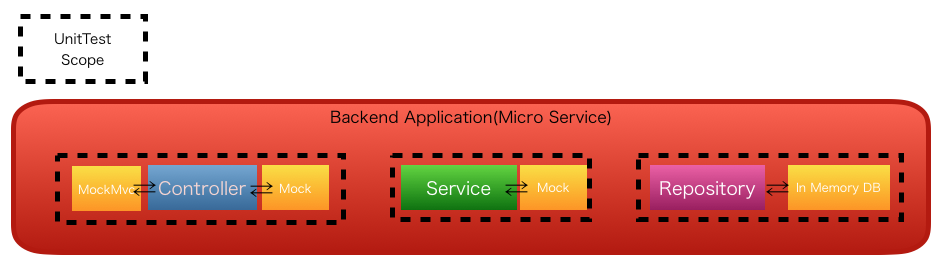

.. include:: ../module.txt

.. _section-automation-infra-devops-microservice-unittest-label:

基盤・デプロイ自動化実践
==================================================================

マイクロサービスアーキテクチャの基盤・デプロイ自動化
------------------------------------------------------------------

|br|

.. _section-application-test-for-microservice-label:

マイクロサービスにおける単体テスト
^^^^^^^^^^^^^^^^^^^^^^^^^^^^^^^^^^^^^^^^^^^^^^^^^^^^^^^^^^^^^^^^^^^^^^^^^^^^^^^^^^^^^^^

|br|

前回は、マイクロサービス(Backend)やそれを呼び出すWebアプリケーション(BackendForFrontend:BFF)の
パッケージ・コンポーネント構成を示し、テスト観点を例示しました。今回からはテストを実装する際のポイントを説明していきます。

まずバックエンドで実行されるマイクロサービスの単体テストです。アプリケーションおよびテストのパッケージ・コンポーネント構成は以下としています。

|br|

.. sourcecode:: bash

   [backend]
     └src
       ├main
       │ ├java
       │ │ └org
       │ │   └debugroom
       │ │     └mynavi
       │ │       └sample
       │ │         └continuous
       │ │           └integration
       │ │             └backend
       │ │               └app                                  ... アプリケーション層のパッケージ
       │ │               │ └model                              ... リクエストパラメータのモデルクラスパッケージ
       │ │               │ │ ├Xxxxx.java                       ... 入力チェックルール等が定義されるモデルクラス
       │ │               │ │ └XxxxxMapper.java                 ... ドメイン層のモデルクラスと相互変換するマッパークラス
       │ │               │ └web                                ... MvcConfigでコンポーネントスキャンの対象とするパッケージ
       │ │               │   └BackendRestController.java       ... リクエストハンドリング・ドメインサービス呼び出して、Resourceを返却するコントローラクラス
       │ │               └domain                               ... ドメイン層のパッケージ
       │ │               │ └model
       │ │               │ │ └entity                           ... JPAConfigでスキャン対象とするエンティティクラスパッケージ
       │ │               │ │   └Xxxxx.java                     ... JPAエンティティクラス
       │ │               │ ├repository                         ... JPAConfigでスキャン対象とするレポジトリクラスパッケージ
       │ │               │ │ ├specification                    ... JPAでテーブル結合等の条件を指定するクラスパッケージ
       │ │               │ │ │ └Xxxxx.java                     ... JPAでテーブル結合等の条件を指定するクラス
       │ │               │ │ └XxxxxRepository.java             ... レポジトリインターフェースクラス
       │ │               │ └service                            ... DomainConfigでコンポーネントスキャンの対象とするサービスクラスパッケージ
       │ │               │   ├SampleService.java               ... DBへ基本的なCRUDアクセスを行うサービスインターフェースクラス
       │ │               │   ├SampleServiceImpl.java           ... SampleServiceの実装クラス
       │ │               │   ├SampleOneToOneService.java       ... 1対1の関連をもつテーブルアクセスを行うサービスインターフェースクラス
       │ │               │   ├SampleOneToOneServiceImpl.java   ... SampleOneToOneServiceの実装クラス
       │ │               │   ├SampleOneToManyService.java      ... 1対多の関連をもつテーブルアクセスを行うサービスインターフェースクラス
       │ │               │   ├SampleOneToManyServiceImpl.java  ... SampleOneToOneServiceの実装クラス
       │ │               │   ├SampleManyToManyService.java     ... 多対多の関連をもつテーブルアクセスを行うサービスインターフェースクラス
       │ │               │   └SampleManyToManyServiceImpl.java ... サービス実装クラス
       │ │               └config                               ... 設定クラス用のパッケージ
       │ │                   ├App.java                         ... アプリケーション起動クラス
       │ │                   ├DevConfig.java                   ... 開発環境固有の設定クラス
       │ │                   ├DomainConfig.java                ... ドメイン層に関する設定クラス
       │ │                   ├JPAConfig.java                   ... JPA設定クラス
       │ │                   └MvcConfig.java                   ... アプリケーション層に関する設定クラス
       │ └resources
       │   ├application.yml                                    ... アプリケーション設定ファイル
       │   └application-dev.yml                                ... プロファイル"dev"で有効になるアプリケーション設定ファイル
       test                                                    ... テストパッケージフォルダ
         ├java
         │ └org
         │   └debugroom
         │     └mynavi
         │       └sample
         │         └continuous
         │           └integration
         │             └backend
         │               ├app
         │               │ └web
         │               │   └BackendRestControllerTest.java   ... Controllerのテストクラス
         │               └domain
         │                 ├DataJpaTestConfig.java             ... Repositoryのテスト設定クラス
         │                 ├repository                         ... Repositoryテストパッケージ
         │                 │ └XxxxRepositoryTest.java          ... Repositoryのテストクラス
         │                 └service                            ... Serviceテストパッケージ
         │                   └XxxxServiceTest.java             ... Serviceのテストクラス
         └resources
           ├META-INF
           │ └dbunit                                           ... DBUnitのテーブルデータ用パッケージ
           │   └domain
           │     └service
           │       └XxxxServiceTest                            ... テストクラスごとのフォルダ
           │         └Xxxx                                     ... テストケースごとのフォルダ
           │           ├Xxxxx.csv                              ... 各テーブルのテストデータ
           │           └table-ordering.txt                     ... 読み込み対象のテーブル名を記載したテキストファイル
           └application.yml                                    ... テスト用のアプリケーション設定ファイル

|br|

一般にソフトウェアの単体テストでは、

* 開発組織やプロジェクト
* プログラミング言語
* テストのスコープとする処理・機能、プログラム単位
* Webアプリケーションやモバイルなどアプリケーション特性

などの違いにより、その定義・検証観点は異なります。Java、Springにおける単体テストでは、
依存するコンポーネントをモックやスタブで置き換えて、テストを行えるように様々な機能が提供されています。
SpringBootを使ってアプリケーションを実装する場合は、主にController、Service、Repositoryという単位で単体コンポーネントと考え、
以下のイメージの通り、モックやスタブの設定を行い、表に示すような観点で実施するのがベターです。

|br|

|br|

.. list-table::
   :widths: 3, 3, 3, 11

   * - アプリケーション
     - 試験
     - コンポーネント
     - 検証観点

   * - マイクロサービス |br| (Backend)
     - 単体試験
     - Respository
     - ・エンティティクラスがテーブル定義と一致しているか |br| ・O/Rマッピング設定が妥当か |br| ・記載したSQLクエリが正しく実行されるか |br| ・カスタムクエリメソッドが想定通り実行されるか |br| ・指定した結合条件でデータが正しく取得できるか

   * -
     -
     - Service
     - ・Service実行の結果、正しくアウトプットが返されるか |br| ・Service実行の結果、正しくビジネス例外が返されるか |br| ・例外に正しくメッセージが設定されているか

   * -
     -
     - Controller
     - ・指定したHTTPメソッドやURLで正しくリクエストハンドリングされるか |br| ・リクエストパラメータやパス変数が正しくマッピングされるか |br| ・入力チェックが正しく行われているか |br| ・入力チェックやビジネスエラー発生時に正しいHTTPステータスを返却するか |br| ・入力チェックやビジネスエラー発生時に正しいメッセージやパラメータを返却するか

|br|

.. _section-repository-test-for-microservice-label:

Repositoryの単体テストの実装
^^^^^^^^^^^^^^^^^^^^^^^^^^^^^^^^^^^^^^^^^^^^^^^^^^^^^^^^^^^^^^^^^^^^^^^^^^^^^^^^^^^^^^^

|br|

RepositoryはEricEvansのドメイン駆動設計で有名となった、データを永続化するコンポーネントの表現です。
J2EEパターンで言うところの「DataAccessObject(DAO)」に相当します。主な違いとしてはRepositoryはよりビジネスドメインのルール・制約を含んでおり、
より低いレベルのAPIをもつデータベースアクセスコンポーネントにない、よりビジネス的な意味合いを含むコンポーネントです。
save()メソッドがRepositoryの持つAPIであり、Insert()メソッドがDAOが持つAPIと考えるとわかりやすいでしょう。
AddressやEmailをもつUserを永続化する場合、AddressやEmailを設定したUserに対し、repository#save(User)を一度呼べば済むのか、
emailDao#insert(email)、addressDao#insert(address)、userDao#insert(User)の３セットコールするのか、実装ではより顕著な差が現れます。
また、永続化する先のデータストアがファイルなのか、RDBなのか、NoSQLデータベースなのか、他システムのデータストアかもRepositoryは問いません。
(ファイルを永続化する場合にinsertは表現として少々不適当)。つまり、Repositoryはデータ永続化のためのより抽象的なコンポーネントとして表現されます。

このマイクロサービスでは永続化先をRDBに設定しているため、上記の表に記載したテスト観点を設定していますが、Repositoryクラスの永続化先や実装ライブラリに応じて、
適切な観点でテストを実施するようにしてください。以降、RDBとSpringDataJPAを用いたSpringBoot実装のテストについて述べます。

|br|

Springではテスト実行環境を自動構築するいくつかのアノテーションを提供しています。SpringBootを使用したアプリケーションのテスト向けに提供されている
@SpringBootTestアノテーションを利用しても、Repositoryのテストを実行することは可能ですが、テストで使用しない
コンポーネントを含めてテスト環境を構築し、起動時間のオーバーヘッドがあるため、実行速度の観点からJPAのRepositoryの単体テストでは、@DataJpaTestを使用するのがベターです。

|br|

.. note:: @DataJpaTest以外にも@JdbcTestや@DataRedisTest、@DataMongoDBTestなど、データストアやORマッパーライブラリのに応じて同様の機能をもつアノテーションがサードパーティ含め提供されています。

|br|

使用方法としては、JUnitテストランナーとしてorg.springframework.test.context.junit4.SpringRunnerを指定したテストクラスに、
org.springframework.boot.test.autoconfigure.orm.jpa.DataJpaTestアノテーションを付与します。これで、テスト環境実行環境として、
pom.xmlで依存性を定義したH2やHSQLなどのライブラリに応じて、テスト用のインメモリDBが構築され、テストデータを設定するためにテスト用のEntityMangerである
TestEntityManagerがテスト用のDIコンテナに追加されるようになります。@AutowiredでTestEntityManagerを取得して、
@Beforeを付与したテストのセットアップメソッドを用意して、前もって準備しておきたいテストデータをインメモリDBへ事前保存し、@Testメソッドでテスト検証コードを記載する形で利用します。

|br|

.. sourcecode:: xml
   :caption: pom.xmlの依存性定義

   <dependency>
    <groupId>org.hsqldb</groupId>
    <artifactId>hsqldb</artifactId>
    <scope>runtime</scope>
   </dependency>

|br|

.. sourcecode:: java

   package org.debugroom.mynavi.sample.continuous.integration.backend.domain.repository;

   import static org.hamcrest.CoreMatchers.*;
   import static org.junit.Assert.*;

   import org.junit.Before;
   import org.junit.Test;
   import org.junit.runner.RunWith;
   import org.springframework.beans.factory.annotation.Autowired;
   import org.springframework.boot.test.autoconfigure.orm.jpa.DataJpaTest;
   import org.springframework.boot.test.autoconfigure.orm.jpa.TestEntityManager;
   import org.springframework.test.context.junit4.SpringRunner;

   // omit

   @RunWith(SpringRunner.class)
   @DataJpaTest
   public class UserRepositoryTest {

       @Autowired
       TestEntityManager testEntityManager;

       @Autowired
       UserRepository userRepository;

       @Before
       public void before(){
           // omit
           testEntityManager.persist(
                   User.builder()
                           .userId(userIdA)
                           .firstName("taro")
                           .familyName("mynavi")
                           .loginId("taro.mynavi")
                           .addressByUserId(address1)
                           .membershipsByUserId(
                                   Arrays.asList(new Membership[]{
                                           membership1, membership3}))
                           .ver(0)
                           .lastUpdatedAt(DateUtil.now())
                   .build());
      }

      // omit

      @Test
      public void testFindByLoginIdNormalCase(){
          Optional<User> optionalUser = userRepository.findByLoginId("taro.mynavi");
          User user = optionalUser.get();
          assertThat(user.getUserId(), is(0L));
          assertThat(user.getFirstName(), is("taro"));
      }

      // omit
   }

.. warning:: @DataJpaTestアノテーションに限らずですが、SpringBootで提供されている、いくつかのテスト用のアノテーションはテストクラスと同一もしくはその上位にあるパッケージに@SpringBootApplicaitonが付与された起動クラスが必要になります。
   SpringBoot起動クラスがsrc/main上のテストクラスと同一もしくはその上位にあるパッケージにあれば問題ありませんが、本アプリケーションのように
   テストクラスのパッケージの上位ルート上にもないconfigパッケージにある場合は、テスト用のパッケージに@SpringBootApplicaitonが付与されたクラスを作成しておきましょう。

Repositoryで定義したfindやsaveなどのインターフェースのメソッドに対するテストを実装し、期待結果を検証することで、
テーブル定義とエンティティクラスの整合性や、エンティティクラスへのデータマッピング、SQLクエリの実行可否など、
Repositoryやエンティティクラスの定義、SQL定義の実装が妥当か検証が可能です。テーブルの結合によるデータ取得やRDBの集計関数を使ったデータアクセスなども
合わせて検証が可能なので、データ取得に関するエラーはこの単体テストで検出できるようにしておきましょう。
ただし、データベースの更新については、データベースの反映結果を取得して個別にアサーションを記載するとアサーションコード量が膨大になり大変なので、
次回以降で解説する結合試験でDBUnitを用いて、テーブルデータをまとめて検証した方が簡易ですので、ここでは検証対象には含めないでおきます。

著者紹介
------------------------------------------------------------------

川畑 光平(KAWABATA Kohei) - NTTデータ 課長代理

.. figure:: img/automation_infra_devops_overview/pic_image01.jpg
   :scale: 100%

金融機関システム業務アプリケーション開発・システム基盤担当を経て、現在はソフトウェア開発自動化関連の研究開発・推進に従事。

Red Hat Certified Engineer、Pivotal Certified Spring Professional、AWS Certified Solutions Architect Professional等の資格を持ち、アプリケーション基盤・クラウドなど様々な開発プロジェクト支援にも携わる。
