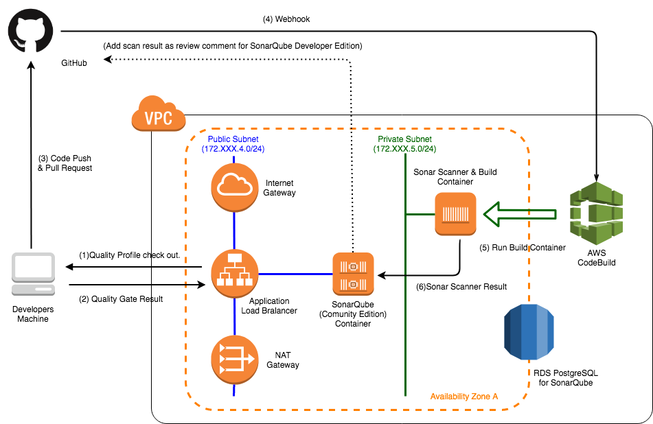

.. include:: ../module.txt

.. _section-automation-infra-devops-sonarlint-label:

基盤・デプロイ自動化実践
==================================================================

マイクロサービスアーキテクチャの基盤・デプロイ自動化
-------------------------------------------------------------------------------------------------------------------------------------

|br|

本連載では、以下のイメージにならって、CodeBuild、SonarQubeを使った継続的インテグレーション(Continuous integration:CI)環境を実際に構築していきます。

|br|

|br|

前回はECSクラスタ上にSonarQubeServerを構築しました。今回はプロジェクトを作成し、QualityProfileで静的チェックルールを定義して、開発端末のIDEに設定してみます。

|br|

.. _section-sonarqube-create-project-label:

SonarQubeプロジェクトの作成
^^^^^^^^^^^^^^^^^^^^^^^^^^^^^^^^^^^^^^^^^^^^^^^^^^^^^^^^^^^^^^^^^^^^^^^^^^^^^^^^^^^^^^^

|br|

管理者ユーザ(初期設定ではadmin:admin)でログインし、右上の＋ボタンから「create new project」を選択します。
プロジェクトを一意に指定するProject Keyと表示名となるDisplay Nameを入力し、「setup」ボタンを押下します。

|br|

.. figure:: img/automation_infra_devops_sonarqube/sonarqube-create-project-1.png
   :scale: 100%

|br|

「Generate」ボタンを押下し、プロジェクトへアクセスするためのキーとなるアクセストークンを生成します。

|br|

|br|

生成されたトークンは開発端末のセットアップやビルド実行時のキーとして利用するので、無くさないように保存してください。

|br|

.. figure:: img/automation_infra_devops_sonarqube/sonarqube-create-project-3.png
   :scale: 100%

|br|

.. _section-sonarqube-3rd-party-plugin-install-and-create-quality-profile-label:

サードパーティ製プラグインのインストールとカスタムQualityProfileの作成・適用
^^^^^^^^^^^^^^^^^^^^^^^^^^^^^^^^^^^^^^^^^^^^^^^^^^^^^^^^^^^^^^^^^^^^^^^^^^^^^^^^^^^^^^^^^^^^^^^^^^^^^^^

|br|

SonarQubeは様々な言語のチェックルールがデフォルトで設定されていますが、サードバーティ製のプラグインをインストールすることで
ルール追加などのカスタマイズを行うことができます。ここでは、「Findbugs」プラグインを追加して、デフォルトのチェックルールを
追加した新たなプロファイルを作成してみましょう。

「Findbugs」プラグインを追加するには「Administration」メニューを選択して、「MarketPlace」タブを選択してから、
検索フォームで「Findbugs」と入力します。対象がピックアップされたら「install」ボタンを押下して、プラグインをインストールします。

|br|

.. figure:: img/automation_infra_devops_sonarqube/sonarqube-install-findbugs-1.png
   :scale: 100%

|br|

インストール後は再起動を求められます。アプリケーションの再起動を行ったのち、再び管理者権限でログインしなおしてください。
「Quality Profiles」メニューを選ぶと、Java言語のプロファイルの中に、インストールした「Findbugs」のチェックルールが追加されていることが確認できます。
続いて、元々のデフォルトルールである「Sonar way」に「Findbugs」プラグインのルールを追加したプロファイルを作成してみましょう。
Javaの「Sonar way」プロファイルのカスタム用のためのボタンを押下し、「copy」を選択します。

|br|

|br|

新しく作成するプロファイルの名称を入力します。

|br|

.. figure:: img/automation_infra_devops_sonarqube/sonarqube-customize-quality-profile-2.png
   :scale: 100%

|br|

コピー前のデフォルトルールでは379のチェックルールが定義されていますが、ここに新たにルールを追加してみましょう。
「Activate More」ボタンを押下します。

|br|

|br|

「common java」にある5つのルールを追加してみます。「Bulk Change」ボタンを押下することで、まとめて5つのルールを有効化できます。

|br|

.. figure:: img/automation_infra_devops_sonarqube/sonarqube-customize-quality-profile-4.png
   :scale: 100%

|br|

アクティベートするプロファイルを選択すると、ルールが追加されます。

|br|

.. figure:: img/automation_infra_devops_sonarqube/sonarqube-customize-quality-profile-6.png
   :scale: 100%

|br|

作成したプロファイルを先ほど作成したプロジェクトに適用します。プロジェクトの「Administration」タブで「Quality Profiles」を選択します。

|br|

.. figure:: img/automation_infra_devops_sonarqube/sonarqube-setting-quality-profile-1.png
   :scale: 100%

|br|

Javaの設定を先ほど作成したプロファイルに設定します。

|br|

.. figure:: img/automation_infra_devops_sonarqube/sonarqube-setting-quality-profile-2.png
   :scale: 100%

|br|

これで静的チェックルールの定義・設定が完了しました。続いて開発端末のIDEに上記のチェックルールが追加されたSonarLintの設定を行います。

|br|

.. note:: 静的チェックルールの定義については、`SpringFramework開発元のSonarQubeの設定 <https://sonar.spring.io/profiles>`_ が公開されているので、適宜参考にしてください。

|br|

.. _section-sonarqube-setting-sonarlint-for-intellij-label:

IntelliJ IDEAへのSonarLintのインストールとプロジェクトの設定
^^^^^^^^^^^^^^^^^^^^^^^^^^^^^^^^^^^^^^^^^^^^^^^^^^^^^^^^^^^^^^^^^^^^^^^^^^^^^^^^^^^^^^^^^^^^^^^^^^^^^^^

|br|

今回は開発端末のIDEとして、IntelliJ IDEAへのSonarLintプラグインのインストール方法とプロジェクトの設定方法を例として記載します。
IntelliJ IDEAでは、「Preference」から、「Plugins」を選択し、「Browse Repositories」ボタンを押下します。

|br|

.. figure:: img/automation_infra_devops_sonarqube/intellij-install-sonarlint-1.png
   :scale: 100%

|br|

検索フォームから「SonarLint」を入力し、「install」ボタンを押下します。インストール後に再起動を求められるので、再起動してください。

|br|

.. figure:: img/automation_infra_devops_sonarqube/intellij-install-sonarlint-2.png
   :scale: 100%

|br|

再起動後に再び「Preference」から、「Other Settings」メニューを選択し、「SonarLint General Settings」を選択します。
「SonarQube Servers」で「＋」ボタンを押下し、適当な「Configuration Name」を入力して、
前回「 :ref:`section-create-alb-for-sonarqube-label` 」で作成している「SonarQube」サーバのALBのDNSを入力し、「Next」ボタンを押下します。

|br|

|br|

前節で取得したトークンを入力します。

|br|

|br|

SonarQube serverが追加されるので、引き続き、「SonarLint Project Settings」を選択します。

|br|

.. figure:: img/automation_infra_devops_sonarqube/intellij-sonarlint-general-settings-3.png
   :scale: 100%

|br|

「search in list」ボタンを押下し、SonarQubeServerのプロジェクトを選択して、「Apply」ボタンを押してください。

|br|

.. figure:: img/automation_infra_devops_sonarqube/intellij-sonarlint-project-settings-1.png
   :scale: 100%

|br|

この設定で、コーディング時にチェック結果やサジェストが表示されるようになります。

|br|

.. figure:: img/automation_infra_devops_sonarqube/intellij-sonarlint-check-1.png
   :scale: 100%

|br|

これで静的チェックを実行しながらコーディングする環境が整いました。次回以降は、マイクロサービスにおけるテストコードの実装について詳述していきます。

|br|

著者紹介
------------------------------------------------------------------

川畑 光平(KAWABATA Kohei) - NTTデータ 課長代理

.. figure:: img/automation_infra_devops_overview/pic_image01.jpg
   :scale: 100%

金融機関システム業務アプリケーション開発・システム基盤担当を経て、現在はソフトウェア開発自動化関連の研究開発・推進に従事。

Red Hat Certified Engineer、Pivotal Certified Spring Professional、AWS Certified Solutions Architect Professional等の資格を持ち、アプリケーション基盤・クラウドなど様々な開発プロジェクト支援にも携わる。
