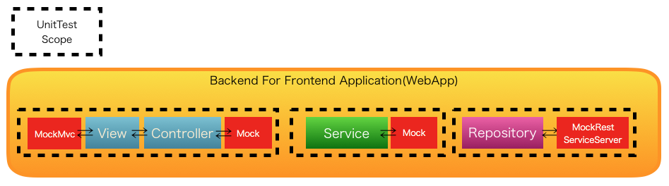

.. include:: ../module.txt

.. _section-automation-infra-devops-webapp-unittest-label:

基盤・デプロイ自動化実践
==================================================================

マイクロサービスアーキテクチャの基盤・デプロイ自動化
------------------------------------------------------------------

|br|

.. _section-application-test-1-for-web-application-label:

マイクロサービスを呼び出すWebアプリケーションの単体テスト・EndToEndテスト(前編)
^^^^^^^^^^^^^^^^^^^^^^^^^^^^^^^^^^^^^^^^^^^^^^^^^^^^^^^^^^^^^^^^^^^^^^^^^^^^^^^^^^^^^^^^^^^^^^^^

|br|

前回までに、マイクロサービス(Backend)の単体・結合テストコードや効率的なテスト戦略のポイントなどを解説して来ました。今回からはマイクロサービスを呼び出す側のWebアプリケーション(BackendForFrontend:BFFアプリケーション)における単体テストおよび、
マイクロサービスを含めたEndToEndテストを実装する際のポイントやテスト戦略を説明していきます。

アプリケーションおよびテストのパッケージ・コンポーネント構成は以下としています。

|br|

.. sourcecode:: bash

   [backend-for-frontend]
     └src
       ├main
       │ ├java
       │ │ └org
       │ │   └debugroom
       │ │     └mynavi
       │ │       └sample
       │ │         └continuous
       │ │           └integration
       │ │             └bff
       │ │               └app                                          ... アプリケーション層のパッケージ
       │ │               │ └model                                      ... リクエストパラメータのモデルクラスパッケージ
       │ │               │ │ ├XxxxxForm.java                           ... HTMLフォームを表現するモデルクラス
       │ │               │ │ ├Xxxxx.java                               ... 入力チェックルール等定義するモデルクラス
       │ │               │ │ └XxxxxMapper.java                         ... commonプロジェクトにあるResourceクラスと相互変換するマッパークラス
       │ │               │ └web                                        ... MvcConfigでコンポーネントスキャンの対象とするパッケージ
       │ │               │   └BackendForFrontendController.java        ... リクエストハンドリング・ドメインサービス呼び出し後、テンプレートViewへ遷移するコントローラクラス
       │ │               └domain                                       ... ドメイン層のパッケージ
       │ │               │ ├repository                                 ... レポジトリクラスパッケージ
       │ │               │ │ ├XxxxxResourceRepository.java             ... Resourceレポジトリインタフェースクラス
       │ │               │ │ └XxxxxResourceRepositoryImpl.java         ... マイクロサービスへアクセスするRestClientを使用したレポジトリ実装クラス
       │ │               │ └service                                    ... DomainConfigでコンポーネントスキャンの対象とするサービスクラスパッケージ
       │ │               │   ├SampleService.java                       ... シンプルに１つのマイクロサービスにアクセスするサービスクラス
       │ │               │   ├SampleServiceImpl.java                   ... SampleServiceの実装クラス
       │ │               │   ├OrchestrateService.java                  ... マイクロサービスの実行フロー制御を行うサービスクラス
       │ │               │   └OrchestrateServiceImpl.java              ... OrchestrateServiceインタフェースの実装クラス
       │ │               └config                                       ... 設定クラス用のパッケージ
       │ │                   ├WebApp.java                              ... Webアプリケーション起動クラス
       │ │                   ├DomainConfig.java                        ... ドメイン層に関する設定クラス
       │ │                   └MvcConfig.java                           ... アプリケーション層に関する設定クラス
       │ └resources
       │   ├static                                                     ... 静的リソースフォルダ
       │   │ ├css                                                      ... CSSフォルダ
       │   │ │ ├Xxxxx.css                                              ... 各ページごとのCSSファイル(幅1280px以上)
       │   │ │ ├Xxxxx_mobile.css                                       ... 各ページごとのCSSファイル(幅320px以上)
       │   │ │ └Xxxxx_tablet.css                                       ... 各ページごとのCSSファイル(幅768px以上)
       │   │ └js                                                       ... JavaScriptフォルダ
       │   │   └Xxxxx.js                                               ... 各ページごとのJSファイル
       │   ├template                                                   ... Thymeleaf用テンプレートフォルダ
       │   │ └Xxxxx.html                                               ... ThymeleafテンプレートHTML
       │   ├application.yml                                            ... アプリケーション設定ファイル
       │   ├application-dev.yml                                        ... プロファイル"dev"で有効になるアプリケーション設定ファイル
       │   ├messages.properties                                        ... デフォルトメッセージ定義ファイル
       │   ├messages_ja.properties                                     ... ロケールがjaの際に有効になるメッセージ定義ファイル
       │   └ValidationMessages.properties                              ... 入力チェックエラーメッセージ定義ファイル
       └test                                                           ... テストパッケージフォルダ
         ├java
         │ └org
         │   └debugroom
         │     └mynavi
         │       └sample
         │         └continuous
         │           └integration
         │             └bff
         │               ├app
         │               │ └web
         │               │   ├selenium                                 ... seleniumで使用するクラスパッケージ
         │               │   │ ├PortalPage.java                        ... Pageオブジェクトクラス
         │               │   │ └SeleniumProperties.java                ... Repositoryのテストクラス
         │               │   └BackendForFrontendControllerTest.java    ... Controllerのテストクラス
         │               ├domain
         │               │ ├repository                                 ... Repositoryテストパッケージ
         │               │ │ └XxxxResoutceRepositoryTest.java          ... XxxxxResourceRepositoryのテストクラス
         │               │ └service                                    ... Serviceテストパッケージ
         │               │   └OrchestrateServiceImplTest.java          ... OrchestrateServiceのテストクラス
         │               └config
         │                 └TestConfig.java                            ... Testの汎用設定クラス
         └resources
           └application.yml                                            ... テスト用のアプリケーション設定ファイル

|br|

マイクロサービスのアプリケーション構成同様、BFFアプリケーションでも主にController、Service、Repositoryという単位でコンポーネントを構成しています。
主なビジネス処理はバックエンド側のサービスにあるため、ControllerやServiceなどから直接RestTemplateなどのRestClientを使ってマイクロサービスを呼び出した方がシンプルで効率的に思えるかもしれませんが、
マイクロサービスの呼び出しが、レスポンスを待つ同期型中心となる場合、呼び出し側アプリケーションもこのようなレイヤ構造にしておくことで以下のような２つのメリットがあります。

* RestClientを使ったバックエンドのマイクロサービスの呼び出しをRepositoryの実装クラスにしておくことで、マイクロサービスで発生したビジネスエラーやシステムエラー、サービス呼び出しの通信エラーなどの例外ハンドリングを１箇所に集中できる。
* エラー発生時のリトライや、複数のマイクロサービスを呼び出した際に発生したエラーに伴う、例えばSAGAパターンを使ったロールバック処理などをServiceクラスに実装し、トランザクション境界を明確化できる。

それなりの規模のアプリケーションになってくると、単純にRestTemplateを使って呼び出すだけでは、バックエンドのマイクロサービスを呼び出す際のTryCatch文が乱立してコードの見通しも悪くなるため、
バックエンドのマイクロサービスをResourceの永続先レポジトリと捉え、ControllerからService経由で呼び出した方がスッキリします。本アプリケーションではこうした構成を前提にテストクラスを以下のような観点で実装していきます。

|br|

|br|

.. list-table::
   :widths: 3, 3, 3, 11

   * - アプリケーション
     - 試験
     - コンポーネント
     - 検証観点

   * - Webアプリケーション |br| (BFF)
     - 単体試験
     - Respository(RestClient)
     - ・正しくビジネス例外が返されるか |br| ・異常なレスポンスを受け取った場合正しくシステム例外が返されるか |br| ・例外に正しくメッセージが設定されるか |br|・マイクロサービス側のサーバエラー発生時に正しくシステム例外が返されるか

   * -
     -
     - Service
     - ・Service実行の結果、正しくアウトプットが返されるか |br| ・Service実行の結果、正しくビジネス例外が返されるか |br| ・例外に正しくメッセージが設定されているか

   * -
     -
     - (View⇔)Controller
     - ・指定したHTTPメソッドやURLで正しくリクエストハンドリングされるか |br| ・リクエストパラメータやパス変数が正しくマッピングされるか |br| ・入力チェックが正しく行われているか |br| ・入力チェックやビジネスエラー発生時に正しいメッセージやパラメータを返却するか |br| ・サービス実行結果が正しく画面に表示されるか |br|  ・非同期通信の実行結果が正しく画面に表示されるか

   * -
     - EndToEndテスト
     - [BFF] ⇔ [Backend]
     - ・ユースケースシナリオ通り操作した時に、正しく画面に結果が表示されるか |br|  ・ユースケースシナリオ通り操作した時に、エラーメッセージが正しく表示されるか |br|・データベースへ正しくデータが反映できるか |br|  ・画面表示のレイアウトが崩れていないか |br| ・ブラウザごとに表示が異なっていないか

|br|

また、以降、SpringBootを使ってテストコード実装を進めていきますが、プロジェクトのpom.xmlにspring-boot-starter-testのライブラリを含めておいてください。

|br|

.. sourcecode:: xml

   <dependencies>
     <dependency>
       <groupId>org.springframework.boot</groupId>
       <artifactId>spring-boot-starter-test</artifactId>
       <scope>test</scope>
     </dependency>
   </dependencies>

|br|

.. _section-repository-test-for-webapp-label:

マイクロサービスを呼び出すWebAPのRepository単体テスト実装
^^^^^^^^^^^^^^^^^^^^^^^^^^^^^^^^^^^^^^^^^^^^^^^^^^^^^^^^^^^^^^^^^^^^^^^^^^^^^^^^^^^^^^^

|br|

前節でも説明した通り、このBFFアプリケーションでは、バックエンドのマイクロサービスの呼び出しを `ResourceクラスのRepository <https://github.com/debugroom/mynavi-sample-continuous-integration/blob/master/backend-for-frontend/src/main/java/org/debugroom/mynavi/sample/continuous/integration/bff/domain/repository/UserResourceRepositoryImpl.java>`_ として実装します。
リンク先のソースコードをみるとわかる通り、マイクロサービスから返却されるレスポンスはResourceオブジェクトに加え、マイクロサービスで発生した、HTTPステータスコードが400(BadRequest)でセットされたビジネスエラーやバリデーションエラー、ステータスコードが500のサーバエラーや通信エラーなどで返される場合もあります。
単体テストでは主にエラーが発生した場合の異常系のバリエーションケースを中心に、正しく例外ハンドリングが行われるかを検証します。とはいえ、実際にバックエンドのマイクロサービスを起動させてテストを実施するわけではなく、
REST通信に関わるエラーレスポンスなどを擬似的に生成可能な、Springから提供されているorg.springframework.test.web.client.MockRestServiceServerを使って、マイクロサービスの呼び出しをスタブ化して実行します。
また、RestTemplateを使ったテスト環境を簡易的に構築するorg.springframework.boot.test.autoconfigure.web.client.RestClientTestアノテーションを使用します。サンプルのテストコードは以下の通りです。

|br|

.. sourcecode:: java

   package org.debugroom.mynavi.sample.continuous.integration.bff.domain.repository;

   // omit

   import org.springframework.beans.factory.annotation.Autowired;
   import org.springframework.boot.test.autoconfigure.web.client.RestClientTest;
   import org.springframework.context.MessageSource;
   import org.springframework.test.context.ContextConfiguration;
   import org.springframework.test.context.junit4.SpringRunner;
   import org.springframework.test.web.client.MockRestServiceServer;
   import org.springframework.test.web.client.match.MockRestRequestMatchers;
   import org.springframework.test.web.client.response.MockRestResponseCreators;
   import org.springframework.web.client.RestTemplate;

   @RunWith(Enclosed.class)
   public class UserResourceRepositoryImplTest {

       @RunWith(SpringRunner.class)                                  // …(A)
       @RestClientTest                                               // …(B)
       @ContextConfiguration(classes = {UnitTest.Config.class,
                TestConfig.UnitTestConfig.class})                    // …(C)
       public static class UnitTest{

           //omit

           @Autowired
           RestTemplate restTemplate;

           @Autowired
           MessageSource messageSource;

           @Autowired
           ObjectMapper objectMapper;

           @Autowired
           UserResourceRepository userResourceRepository;

           @Rule
           public ExpectedException expectedException = ExpectedException.none();

           @Test
           public void findOneAbnormalTest1() throws Exception{

               MockRestServiceServer mockRestServiceServer = MockRestServiceServer
                     .bindTo(restTemplate).build();              // …(D)

               Long userId = 0L;

               String errorCode = "E0001";
               BusinessException businessException = new BusinessException(errorCode,
                     messageSource.getMessage(errorCode, new Long[]{userId},
                         Locale.getDefault()), Long.toString(userId));
               String jsonResponseBody1 = objectMapper.writeValueAsString(
                     BusinessExceptionResponse.builder()
                             .businessException(businessException)
                             .build());                         // …(E)

               mockRestServiceServer
                 .expect(MockRestRequestMatchers.requestTo("/backend/api/v1/users/0"))
                 .andExpect(MockRestRequestMatchers.method(HttpMethod.GET))
                 .andRespond(MockRestResponseCreators.withBadRequest().body(
                             jsonResponseBody1));               // …(F)

               expectedException.expect(BusinessException.class);
               expectedException.expect(BusinessExceptionMatcher.builder()
                     .businessException(businessException).build());

              userResourceRepository.findOne(userId);

         }
         // omit
   }

|br|

.. list-table:: マイクロサービスを呼び出すRepositoryクラスの単体テストコードの説明
   :widths: 1, 19

   * - 項番
     - 説明

   * - (A)
     - テストランナーとして、SpringRunnerを指定します。

   * - (B)
     - @RestClientTestアノテーションを付与します。

   * - (C)
     - UserResourceRepositoryでは、異常系のエラーメッセージの取得にMessageSourceを使用するため、テスト用のDIコンテナから取得できるように設定しておきます。@ContextConfigurationについては、 `TERASOLUNAガイドライン Spring TestのDI機能 <http://terasolunaorg.github.io/guideline/5.5.1.RELEASE/ja/UnitTest/ImplementsOfUnitTest/UsageOfLibraryForTest.html#spring-testdi>`_ を適宜参照してください。

   * - (D)
     - MockRestServiceServerを動作させるRestTemplateを設定します。なお、@AutowiredでMockRestServiceServerをインジェクションしてもよいです。

   * - (E)
     - エラーメッセージを設定したビジネス例外をJSON表現の文字列化します。

   * - (F)
     - MockRestServiceServerが指定したURLでHTTPステータスコード400で(E)の文字列を返却するように設定します。

|br|

サンプルとして実装したテストケースと検証観点は以下になります。

.. _UserResourceRepository#findOne: https://github.com/debugroom/mynavi-sample-continuous-integration/blob/master/backend-for-frontend/src/main/java/org/debugroom/mynavi/sample/continuous/integration/bff/domain/repository/UserResourceRepositoryImpl.java#L43
.. _UserResourceRepositoryTest#findOneAbnormalTest1(): https://github.com/debugroom/mynavi-sample-continuous-integration/blob/master/backend-for-frontend/src/test/java/org/debugroom/mynavi/sample/continuous/integration/bff/domain/repository/UserResourceRepositoryImplTest.java#L86
.. _UserResourceRepositoryTest#findOneAbnormalTest2(): https://github.com/debugroom/mynavi-sample-continuous-integration/blob/master/backend-for-frontend/src/test/java/org/debugroom/mynavi/sample/continuous/integration/bff/domain/repository/UserResourceRepositoryImplTest.java#L116
.. _UserResourceRepositoryTest#findOneAbnormalTest3(): https://github.com/debugroom/mynavi-sample-continuous-integration/blob/master/backend-for-frontend/src/test/java/org/debugroom/mynavi/sample/continuous/integration/bff/domain/repository/UserResourceRepositoryImplTest.java#L146
.. _UserResourceRepositoryTest#findOneAbnormalTest4(): https://github.com/debugroom/mynavi-sample-continuous-integration/blob/master/backend-for-frontend/src/test/java/org/debugroom/mynavi/sample/continuous/integration/bff/domain/repository/UserResourceRepositoryImplTest.java#L198
.. _UserResourceRepository#findAll: https://github.com/debugroom/mynavi-sample-continuous-integration/blob/master/backend-for-frontend/src/main/java/org/debugroom/mynavi/sample/continuous/integration/bff/domain/repository/UserResourceRepositoryImpl.java#L72
.. _UserResourceRepositoryTest#findAllAbnormalTest1(): https://github.com/debugroom/mynavi-sample-continuous-integration/blob/master/backend-for-frontend/src/test/java/org/debugroom/mynavi/sample/continuous/integration/bff/domain/repository/UserResourceRepositoryImplTest.java#L228
.. _UserResourceRepositoryTest#findAllAbnormalTest2(): https://github.com/debugroom/mynavi-sample-continuous-integration/blob/master/backend-for-frontend/src/test/java/org/debugroom/mynavi/sample/continuous/integration/bff/domain/repository/UserResourceRepositoryImplTest.java#L252
.. _UserResourceRepository#save: https://github.com/debugroom/mynavi-sample-continuous-integration/blob/master/backend-for-frontend/src/main/java/org/debugroom/mynavi/sample/continuous/integration/bff/domain/repository/UserResourceRepositoryImpl.java#L88
.. _UserResourceRepositoryTest#saveNormalTest(): https://github.com/debugroom/mynavi-sample-continuous-integration/blob/master/backend-for-frontend/src/test/java/org/debugroom/mynavi/sample/continuous/integration/bff/domain/repository/UserResourceRepositoryImplTest.java#L276
.. _UserResourceRepositoryTest#saveAbnormalTest1(): https://github.com/debugroom/mynavi-sample-continuous-integration/blob/master/backend-for-frontend/src/test/java/org/debugroom/mynavi/sample/continuous/integration/bff/domain/repository/UserResourceRepositoryImplTest.java#L332
.. _UserResourceRepositoryTest#saveAbnormalTest2(): https://github.com/debugroom/mynavi-sample-continuous-integration/blob/master/backend-for-frontend/src/test/java/org/debugroom/mynavi/sample/continuous/integration/bff/domain/repository/UserResourceRepositoryImplTest.java#L388
.. _UserResourceRepositoryTest#saveAbnormalTest3(): https://github.com/debugroom/mynavi-sample-continuous-integration/blob/master/backend-for-frontend/src/test/java/org/debugroom/mynavi/sample/continuous/integration/bff/domain/repository/UserResourceRepositoryImplTest.java#L444
.. _UserResourceRepositoryTest#saveAbnormalTest4(): https://github.com/debugroom/mynavi-sample-continuous-integration/blob/master/backend-for-frontend/src/test/java/org/debugroom/mynavi/sample/continuous/integration/bff/domain/repository/UserResourceRepositoryImplTest.java#L500
.. _UserResourceRepositoryTest#saveAbnormalTest5(): https://github.com/debugroom/mynavi-sample-continuous-integration/blob/master/backend-for-frontend/src/test/java/org/debugroom/mynavi/sample/continuous/integration/bff/domain/repository/UserResourceRepositoryImplTest.java#L553
.. _UserResourceRepository#delete: https://github.com/debugroom/mynavi-sample-continuous-integration/blob/master/backend-for-frontend/src/main/java/org/debugroom/mynavi/sample/continuous/integration/bff/domain/repository/UserResourceRepositoryImpl.java#L121
.. _UserResourceRepositoryTest#deleteAbnormalTest1(): https://github.com/debugroom/mynavi-sample-continuous-integration/blob/master/backend-for-frontend/src/test/java/org/debugroom/mynavi/sample/continuous/integration/bff/domain/repository/UserResourceRepositoryImplTest.java#L604
.. _UserResourceRepositoryTest#deleteAbnormalTest2(): https://github.com/debugroom/mynavi-sample-continuous-integration/blob/master/backend-for-frontend/src/test/java/org/debugroom/mynavi/sample/continuous/integration/bff/domain/repository/UserResourceRepositoryImplTest.java#L635
.. _UserResourceRepositoryTest#deleteAbnormalTest3(): https://github.com/debugroom/mynavi-sample-continuous-integration/blob/master/backend-for-frontend/src/test/java/org/debugroom/mynavi/sample/continuous/integration/bff/domain/repository/UserResourceRepositoryImplTest.java#L666
.. _UserResourceRepositoryTest#deleteAbnormalTest4(): https://github.com/debugroom/mynavi-sample-continuous-integration/blob/master/backend-for-frontend/src/test/java/org/debugroom/mynavi/sample/continuous/integration/bff/domain/repository/UserResourceRepositoryImplTest.java#L718
.. _UserResourceRepository#findByLoginId: https://github.com/debugroom/mynavi-sample-continuous-integration/blob/master/backend-for-frontend/src/main/java/org/debugroom/mynavi/sample/continuous/integration/bff/domain/repository/UserResourceRepositoryImpl.java#L150
.. _UserResourceRepositoryTest#findByLoginIdAbnormalTest1(): https://github.com/debugroom/mynavi-sample-continuous-integration/blob/master/backend-for-frontend/src/test/java/org/debugroom/mynavi/sample/continuous/integration/bff/domain/repository/UserResourceRepositoryImplTest.java#L748
.. _UserResourceRepositoryTest#findByLoginIdAbnormalTest2(): https://github.com/debugroom/mynavi-sample-continuous-integration/blob/master/backend-for-frontend/src/test/java/org/debugroom/mynavi/sample/continuous/integration/bff/domain/repository/UserResourceRepositoryImplTest.java#L781
.. _UserResourceRepositoryTest#findByLoginIdAbnormalTest3(): https://github.com/debugroom/mynavi-sample-continuous-integration/blob/master/backend-for-frontend/src/test/java/org/debugroom/mynavi/sample/continuous/integration/bff/domain/repository/UserResourceRepositoryImplTest.java#L814
.. _UserResourceRepositoryTest#findByLoginIdAbnormalTest4(): https://github.com/debugroom/mynavi-sample-continuous-integration/blob/master/backend-for-frontend/src/test/java/org/debugroom/mynavi/sample/continuous/integration/bff/domain/repository/UserResourceRepositoryImplTest.java#L843

|br|

.. list-table::
   :widths: 7, 6, 7

   * - ユースケース
     - 主な処理実装クラス・メソッド |br| テストメソッド
     - 検証観点

   * - [異常系]ユーザリソースを検索する1
     - `UserResourceRepository#findOne`_  |br| |br|  `UserResourceRepositoryTest#findOneAbnormalTest1()`_
     - ・正しくビジネス例外が返されるか

   * - [異常系]ユーザリソースを検索する2
     - `UserResourceRepository#findOne`_  |br| |br|  `UserResourceRepositoryTest#findOneAbnormalTest2()`_
     - ・異常なレスポンスを受け取った場合正しくシステム例外が返されるか |br| ・例外に正しくメッセージが設定されるか

   * - [異常系]ユーザリソースを検索する3
     - `UserResourceRepository#findOne`_  |br| |br|  `UserResourceRepositoryTest#findOneAbnormalTest3()`_
     - ・異常なレスポンスを受け取った場合正しくシステム例外が返されるか |br| ・例外に正しくメッセージが設定されるか

   * - [異常系]ユーザリソースを検索する4
     - `UserResourceRepository#findOne`_  |br| |br|  `UserResourceRepositoryTest#findOneAbnormalTest4()`_
     - ・マイクロサービス側のサーバエラー発生時に正しくシステム例外が返されるか |br| ・例外に正しくメッセージが設定されるか

   * - [異常系]全てのユーザリソースを検索する1
     - `UserResourceRepository#findAll`_  |br| |br|  `UserResourceRepositoryTest#findAllAbnormalTest1()`_
     - ・異常なレスポンスを受け取った場合正しくシステム例外が返されるか |br| ・例外に正しくメッセージが設定されるか

   * - [異常系]全てのユーザリソースを検索する2
     - `UserResourceRepository#findAll`_  |br| |br|  `UserResourceRepositoryTest#findAllAbnormalTest2()`_
     - ・マイクロサービス側のサーバエラー発生時に正しくシステム例外が返されるか |br| ・例外に正しくメッセージが設定されるか

   * - [正常系]ユーザリソースを追加する
     - `UserResourceRepository#save`_  |br| |br|  `UserResourceRepositoryTest#saveNormalTest()`_
     - ・正しいステータスコードでアウトプットが返されるか

   * - [異常系]ユーザリソースを追加する1
     - `UserResourceRepository#save`_  |br| |br|  `UserResourceRepositoryTest#saveAbnormalTest1()`_
     - ・正しくビジネス例外が返されるか

   * - [異常系]ユーザリソースを追加する2
     - `UserResourceRepository#save`_  |br| |br|  `UserResourceRepositoryTest#saveAbnormalTest2()`_
     - ・正しくビジネス例外が返されるか |br| ・例外に正しくメッセージが設定されるか

   * - [異常系]ユーザリソースを追加する3
     - `UserResourceRepository#save`_  |br| |br|  `UserResourceRepositoryTest#saveAbnormalTest3()`_
     - ・異常なレスポンスを受け取った場合正しくシステム例外が返されるか |br| ・例外に正しくメッセージが設定されるか

   * - [異常系]ユーザリソースを追加する4
     - `UserResourceRepository#save`_  |br| |br|  `UserResourceRepositoryTest#saveAbnormalTest4()`_
     - ・異常なレスポンスを受け取った場合正しくシステム例外が返されるか |br| ・例外に正しくメッセージが設定されるか

   * - [異常系]ユーザリソースを追加する5
     - `UserResourceRepository#save`_  |br| |br|  `UserResourceRepositoryTest#saveAbnormalTest5()`_
     - ・マイクロサービス側のサーバエラー発生時に正しくシステム例外が返されるか |br| ・例外に正しくメッセージが設定されるか

   * - [異常系]ユーザリソースを削除する1
     - `UserResourceRepository#delete`_  |br| |br|  `UserResourceRepositoryTest#deleteAbnormalTest1()`_
     - ・正しくビジネス例外が返されるか

   * - [異常系]ユーザリソースを削除する2
     - `UserResourceRepository#delete`_  |br| |br|  `UserResourceRepositoryTest#deleteAbnormalTest2()`_
     - ・異常なレスポンスを受け取った場合正しくシステム例外が返されるか |br| ・例外に正しくメッセージが設定されるか

   * - [異常系]ユーザリソースを削除する3
     - `UserResourceRepository#delete`_  |br| |br|  `UserResourceRepositoryTest#deleteAbnormalTest3()`_
     - ・異常なレスポンスを受け取った場合正しくシステム例外が返されるか |br| ・例外に正しくメッセージが設定されるか

   * - [異常系]ユーザリソースを削除する4
     - `UserResourceRepository#delete`_  |br| |br|  `UserResourceRepositoryTest#deleteAbnormalTest4()`_
     - ・マイクロサービス側のサーバエラー発生時に正しくシステム例外が返されるか |br| ・例外に正しくメッセージが設定されるか

   * - [異常系]指定したログインIDをもつユーザリソースを検索する1
     - `UserResourceRepository#findByLoginId`_  |br| |br|  `UserResourceRepositoryTest#findByLoginIdAbnormalTest1()`_
     - ・正しくビジネス例外が返されるか

   * - [異常系]指定したログインIDをもつユーザリソースを検索する2
     - `UserResourceRepository#findByLoginId`_  |br| |br|  `UserResourceRepositoryTest#findByLoginIdAbnormalTest2()`_
     - ・異常なレスポンスを受け取った場合正しくシステム例外が返されるか |br| ・例外に正しくメッセージが設定されるか

   * - [異常系]指定したログインIDをもつユーザリソースを検索する3
     - `UserResourceRepository#findByLoginId`_  |br| |br|  `UserResourceRepositoryTest#findByLoginIdAbnormalTest3()`_
     - ・異常なレスポンスを受け取った場合正しくシステム例外が返されるか |br| ・例外に正しくメッセージが設定されるか

   * - [異常系]指定したログインIDをもつユーザリソースを検索する4
     - `UserResourceRepository#findByLoginId`_  |br| |br|  `UserResourceRepositoryTest#findByLoginIdAbnormalTest4()`_
     - ・マイクロサービス側のサーバエラー発生時に正しくシステム例外が返されるか |br| ・例外に正しくメッセージが設定されるか

|br|

.. warning:: 本来であればシステム例外は各コンポーネントの中で個別にハンドリングするのではなく、AOPなどで一律ハンドリングし、各業務開発者が意識せずに済むようにAP基盤部品として作成しておく方がベターです。今回はサンプルとしてシステム例外時のハンドリングもテストケースに含めています。

|br|

.. _section-service-test-for-webapp-label:

マイクロサービスを呼び出すWebAPのService単体テスト実装
^^^^^^^^^^^^^^^^^^^^^^^^^^^^^^^^^^^^^^^^^^^^^^^^^^^^^^^^^^^^^^^^^^^^^^^^^^^^^^^^^^^^^^^

|br|

前節でも説明した通り、このBFFアプリケーションでは。主なビジネス処理であるバックエンドのマイクロサービスを呼び出すかたちですが、
Repositoryに実際の呼び出し処理を委譲し、Serviceではエラー発生時のリトライや、複数のマイクロサービスを呼び出した際に発生したエラー時のロールバック処理などの責務をもたせて実装します。
このようなサービスのフロー制御を実行する役割をオーケストレーションと呼び、エラー発生時のマイクロサービスの処理結果をロールバックする補償トランザクションを実行するパターンをSAGAパターンと呼びます。
SAGAパターンの詳細は `microservices.io Pattern:Saga <https://microservices.io/patterns/data/saga.html>`_ によくまとめられていますのでこちらも適宜参考にしてください。
以下のサンプルは、ユーザデータを複数保存する場合に、マイクロサービスを複数回呼び出し、エラーが発生した際、SAGAパターンに従ってロールバック処理するServiceコードの例です。

|br|

.. sourcecode:: java

   package org.debugroom.mynavi.sample.continuous.integration.bff.domain.service;

   // omit

   @Service
   public class OrchestrateServiceImpl implements OrchestrateService {

       @Autowired
       UserResourceRepository userResourceRepository;

       @Override
       public List<UserResource> addUsers(List<UserResource> addUserResources)
             throws BusinessException{
           List<UserResource> userResources = new ArrayList<>();
           for (UserResource addUserResource : addUserResources){
               try{
                   userResources.add(userResourceRepository.save(addUserResource));
               }catch (BusinessException e){
               // Rollback for SAGA Pattern.
                   for(UserResource userResource : userResources){
                       userResourceRepository.delete(userResource.getUserId());
                   }
                   throw e;
               }
          }
          return userResources;
       }
   }

|br|

こうした処理が実装されたServiceですが、実際のマイクロサービスの呼び出しはRepositoryに隠蔽されているため、テストコードもマイクロサービスにおけるServiceのそれと基本的に違いはありません。
Repositoryをモック化して、DIコンテナとともに実行に必要なコンポーネントをオートコンフィグレーションする@SpringBootTestアノテーションを用いて、
MessageSourceなどのコンポーネントはSpringのDIコンテナから取得できるようにしてテストコードを実装します。

Serviceの単体サンプルコードは以下の通りです。

|br|

.. sourcecode:: java

   package org.debugroom.mynavi.sample.continuous.integration.bff.domain.service;

   // omit

   import org.springframework.boot.test.context.SpringBootTest;
   import org.springframework.boot.test.mock.mockito.MockBean;
   import org.springframework.test.context.junit4.SpringRunner;

   @RunWith(Enclosed.class)
   public class OrchestrateServiceImplTest {

       // omit

       @RunWith(SpringRunner.class)
       @SpringBootTest(classes = {
           OrchestrateServiceImplTest.UnitTest.Config.class
        }, webEnvironment = SpringBootTest.WebEnvironment.NONE)
       public static class UnitTest{

           // omit

           @MockBean
           UserResourceRepository userResourceRepositoryMock;

           @Autowired
           OrchestrateService orchestrateService;

           @Rule
           public ExpectedException expectedException = ExpectedException.none();

           // omit
           @Before
           public void setUp() throws Exception{
               // omit
               when(userResourceRepositoryMock.save(mockUser1)).thenReturn(mockUser1);
               when(userResourceRepositoryMock.save(mockUser2)).thenThrow(BusinessException.class);
               // omit
           }

           @Test
           public void addUsersAbnormalTest1() throws Exception{
               //omit
               UserResource user1 = UserResource.builder()
                        .userId(userId1).firstName("taro").familyName("mynavi")
                        .loginId("taro.mynavi").address(address1)
                        .emailList(Arrays.asList(new EmailResource[]{email1, email2})).build();
               UserResource user2 = UserResource.builder()
                        .userId(userId2).familyName("mynavi").firstName("hanako")
                        .loginId("hanako.mynavi").address(address2)
                        .emailList(Arrays.asList(new EmailResource[]{email3})).build();
               //omit
               expectedException.expect(BusinessException.class);

               orchestrateService.addUsers(Arrays.asList(
                   new UserResource[]{user1, user2}));
          }
          // omit

|br|

上記のテスト実装により、Sevice実行時のアウトプットオブジェクトの妥当性やビジネス例外発生の妥当性、ビジネス例外のメッセージなどを
検証できます。サンプルで作成したテストケースは、Serviceの異常系処理を中心に、以下のようなユースケース・検証観点をもとに実装しています。
Serviceが複数のサービスにアクセスする場合のSAGAパターンによるロールバックや、リトライ処理などオーケストレーションの責務を負う場合は、Seviceの単体テストで適宜異常系のバリエーションを追加して検証するのがベターです。

.. _OrchestrateService#addUsers: https://github.com/debugroom/mynavi-sample-continuous-integration/blob/master/backend-for-frontend/src/main/java/org/debugroom/mynavi/sample/continuous/integration/bff/domain/service/OrchestrateServiceImpl.java#L20
.. _OrchestrateServiceImplTest#addUsersAbnormalTest1(): https://github.com/debugroom/mynavi-sample-continuous-integration/blob/master/backend-for-frontend/src/test/java/org/debugroom/mynavi/sample/continuous/integration/bff/domain/service/OrchestrateServiceImplTest.java#L141
.. _OrchestrateServiceImplTest#addUsersAbnormalTest2(): https://github.com/debugroom/mynavi-sample-continuous-integration/blob/master/backend-for-frontend/src/test/java/org/debugroom/mynavi/sample/continuous/integration/bff/domain/service/OrchestrateServiceImplTest.java#L197

|br|

.. list-table::
   :widths: 7, 6, 7

   * - ユースケース
     - 主な処理実装クラス・メソッド |br| テストメソッド
     - 検証観点

   * - [異常系]複数のユーザ情報を追加する(1)
     - `OrchestrateService#addUsers`_ |br| `OrchestrateServiceImplTest#addUsersAbnormalTest1()`_
     - ・Service実行の結果、正しくビジネス例外が返されるか

   * - [異常系]複数のユーザ情報を追加する(2)
     - `OrchestrateService#addUsers`_ |br| `OrchestrateServiceImplTest#addUsersAbnormalTest2()`_
     - ・マイクロサービス側のサーバエラー発生時に正しくシステム例外が返されるか

|br|

.. note:: このサンプルでは、ユーザを保存するマイクロサービスを複数回呼び出し、処理の途中でビジネスエラーが発生した場合、それまで成功した保存データを逆に削除していくロールバック処理をcatch節の中で実装します。ロールバック処理も含めて正常に完了した場合はビジネスエラーを返却し、また、マイクロサービスへの呼び出しの途中でサーバーエラーが発生した場合は、Repositoryからシステムエラーをスローする仕様を想定したテストケースとしています。

|br|

次回は、HTMLUnitを使用したBFFアプリケーションでのControllerの単体テスト、Seleniumを使用したEndToEndのテストコードをSpringBootを使って実装していきます。

|br|

著者紹介
------------------------------------------------------------------

川畑 光平(KAWABATA Kohei) - NTTデータ 課長代理

.. figure:: img/automation_infra_devops_overview/pic_image01.jpg
   :scale: 100%

金融機関システム業務アプリケーション開発・システム基盤担当を経て、現在はソフトウェア開発自動化関連の研究開発・推進に従事。

Red Hat Certified Engineer、Pivotal Certified Spring Professional、AWS Certified Solutions Architect Professional等の資格を持ち、アプリケーション基盤・クラウドなど様々な開発プロジェクト支援にも携わる。

`2019 APN AWS Top Engineers & Ambassadors <https://aws.amazon.com/jp/blogs/psa/japan-apn-ambassador-2019/>`_ 選出。
