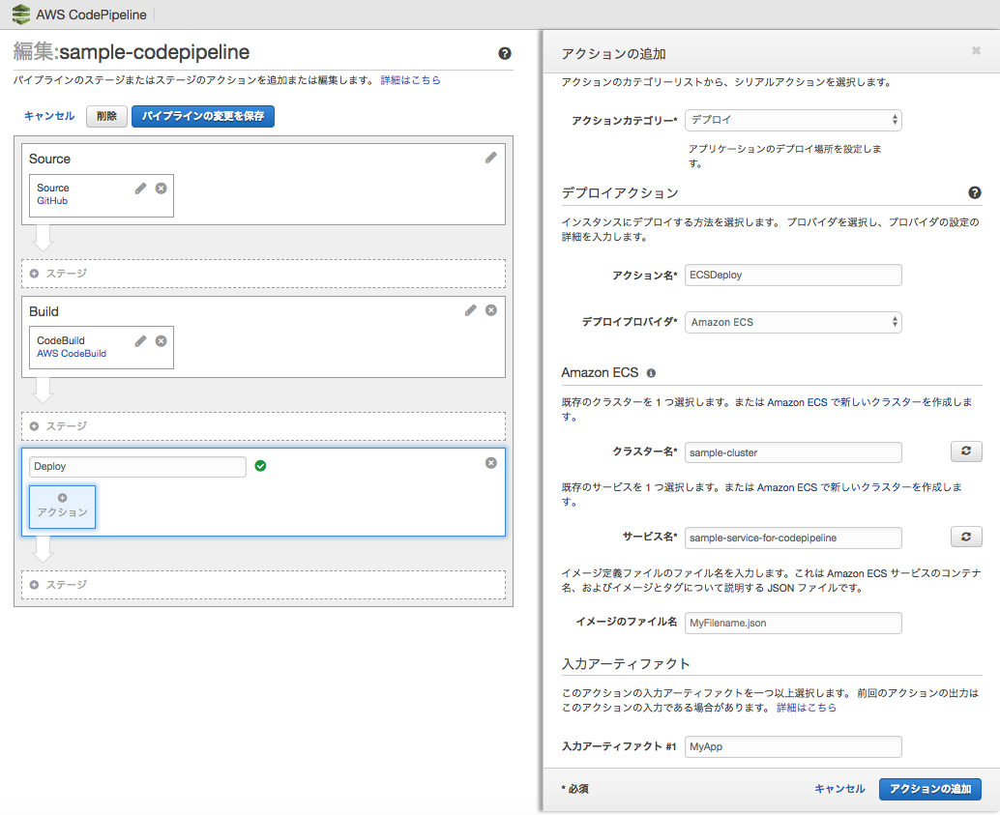

.. include:: module.txt

.. _section-automation-infra-devops-overview-label:

ソフトウェア開発自動化
==================================================================

第4回 基盤・デプロイ自動化
------------------------------------------------------------------

第1回から第3回までの連載で、コーディング、テストの自動化についてそれぞれ解説してきました。
今回は、基盤・デプロイ自動化の発展経緯を整理し、最近の動向であるマイクロサービスアーキテクチャのアプリケーションのCI/CD
およびアプリケーション基盤構築の実現例を記述します。

.. list-table:: 4つの自動化領域
   :widths: 1, 4, 4, 1

   * - No
     - 対象領域
     - 内容
     - 今回の対象
   * - 1
     - コーディングの自動化
     - 複雑・多様なロジックの自動生成
     -
   * - 2
     - テストの自動化
     - 試験項目の自動生成と自動実行
     -
   * - 3
     - ビルド・リリースの自動化
     - ビルドやテスト環境へのリリースの自動化
     - ◯
   * - 4
     - システム基盤構築の自動化
     - システム基盤の自動インストール・設定
     - ◯

|br|

基盤構築自動化の発展経緯
------------------------------------------------------------------

|br|
Amazon Web ServiceなどのIaaSおよびOpenstackなどのクラウドコンピューティングオープンソースソフトウェアの登場により、
ロードバランサやAPサーバ、監視といったアプリケーション実行環境を自動構築することが身近になってきました。

従来、オンプレミス環境(企業がもつ自社のデータセンタ環境)では、各々物理サーバを導入し、アプリケーションを配備していました。
一度構築した後も、保守期限を迎えるまで、手間暇かけてメンテナンスしつつ長く使うのが一般的で、ゼロから構築するケースは稀でした。

しかし、クラウド環境下では、様々なユーザが、クラウド上でサーバリソースを共有するため、仮想マシン上にゲストOSをプロビジョニングする(OSをロードし、固有の設定を行う)形態が主となります。
OSを停止するたびにアプリケーション環境は破棄され、同一の実行環境を繰り返し、構築することが必要になります。
それに加えて、オートスケールなど、サーバリソースを動的に増減できるクラウドならではのスケーラビリティを活かすために、
サーバを素早く正確に構築し、アプリケーション環境に組みこまなければなりません。

こうした事情から、一度サーバ環境を構築した後は特に変更を加えず、破棄して新しく作り直す概念「`イミュータブルインフラストラクチャ <https://ja.wikipedia.org/wiki/Immutable_Infrastructure>`_ 」が生まれ、
アプリケーション環境構築の実行スピードや作業品質の向上を目的に、作業をコード化して実行する手段(Infrastructure As Code)が求められ、「Puppet」・「Ansible」・「Chef」といった基盤環境構築ツールが普及していきます。

他方、仮想化技術は発展を続け、OSを丸ごと実行するハイパーバイザ型と比べて、ハードウェアリソースの消費コストが小さい
Dockerなどのコンテナ技術が発達し、近年広く普及しつつあります。また、Kubernetesなどの
コンテナのリソース管理・スケール調整などを行い、大規模なコンテナアプリケーション実行環境を管理するオーケストレションツールが脚光を浴びています。
これらのミドルウェアを含め、アプリケーション実行環境全体の包括的なInfrastructure As Codeのツールとして、「Amazon Cloud Formation」や「Terraform」を使った基盤構築のコード化が近年のトレンドとなっています。

|br|

継続的インテグレーション、継続的デリバリの発展
-------------------------------------------------------------------------------------------------------

|br|

継続的インテグレーション(Continuous Integration:CI)・継続的デリバリ(Continuous Delivery:CD)では、オープンソースソフトウェアのJenkinsを中心として、

#. GitHubなどのソースコードチェックアウト
#. Maven/Gradleなどのビルドツールの実行
#. JUnitなどのテストコードを用いたテスト実行
#. 静的解析ツールを用いたインスペクション
#. 商用環境サーバやライブラリ管理ツールへのデプロイ

といった一連のソフトウェア開発・リリースサイクルを自動化する手法が主流として発展してきましたが、
こちらも仮想化技術やコンテナ技術の普及により、物理サーバを中心とした単一のサーバ環境だけに留まらなくなってきています。
例えば、ソースコードコミット時に、Jenkinsがコンテナを起動して仮想のテスト環境を構築し、マルチコンテナで並列的にテストを行うなどの手法が活用されます。

また、リリースの際は、`ブルーグリーンデプロイメント <https://www.nttpc.co.jp/yougo/%E3%83%96%E3%83%AB%E3%83%BC%E3%82%B0%E3%83%AA%E3%83%BC%E3%83%B3%E3%83%87%E3%83%97%E3%83%AD%E3%82%A4%E3%83%A1%E3%83%B3%E3%83%88.html>`_ といった、
アプリケーションのマルチコンテナ化を利用して、迅速な環境構築かつ、ロールバックが容易なローリングアップデートリリース手法が脚光を浴びています。

このように複雑化するCI/CD実行環境において、ステージング環境・プロダクション環境への一連のリリースサイクルをパイプライン化して可視化する、
AWS CodePipelineなどのツールも活用の機会が増えつつあります。

|br|

マイクロサービスにおける基盤自動化
-------------------------------------------------------------------------------------------------------------------------------------

|br|

こうした状況の中で、疎結合性・独立性を重視し、開発のアジリティを向上させるマイクロサービスアーキテクチャが
基盤構築の自動化・継続的インテグレーションにも変化をもたらしつつあります。

従来のモノリシックなアプリケーション(全ての機能が一つのアプリケーションパッケージにまとまっている形)に比べ、
マイクロサービスでは、アプリケーション構成はもとより、チーム間での開発体制からリリースの単位までこれまでとは異なる形で行うことを要求されます。
マイクロサービス間で影響を局所化し、開発におけるアジリティ向上を実現するために、以下のようにアプリケーションを構成・開発することが要求されるケースが多いです。

* アプリケーションは複数のマイクロサービスで構成する。各サービス単位にチームが分けられ、リリース・デプロイまでの開発プロセスを独立して構築する。
* 多数のサービスはコンテナをベースに構築され、各サービスそれぞれがスケーリング可能な形でデプロイされる。

こうした近年のトレンドに基づき、マイクロサービスアーキテクチャのアプリケーション構成、基盤自動化/継続的インテグレーション・デリバリを実現する例を実際に見てみましょう。
以下に、マイクロサービスアーキテクチャで構築されるアプリケーションの構成例を示します。

.. figure:: img/automation_infra_devops_overview/MicroServiceArchitecture.png
   :scale: 100%

[アプリケーションの構成]

* アプリケーションはAmazon Web Service上に構築するWebアプリケーションとする。
* アプリケーションはフロントエンドとバックエンドのサービスに分割し、各サービスはAWS ECSコンテナ上にデプロイされるものとする。
* ECSコンテナ内の各サービスは組み込みTomcatを内蔵するSpringBootアプリケーションで実装する。
* 各サービス間はRESTベースのHTTPリクエストでメッセージ通信を行い、ApplicationLoadBalancerを介して負荷分散する。

なお、サービスをフロントエンドとバックエンドに分割するのは以下の理由・目的のためです。

.. list-table:: フロントエンドとバックエンドの役割
   :widths: 5, 5

   * - フロントエンドの役割
     - バックエンドの役割

   * - * サービスマッピング(IP・ポート)
       * ブラウザからHTTPメソッド変換(GET・POST⇔GET・POST・PUT・DELETE・OPTION)
       * セッション共有(キャッシュサーバ)
       * セキュリティ

         * 認証・認可
         * 入力チェック
         * バックエンドサービスURIの隠蔽
         * クライアント⇔バックエンドの直接アクセス禁止

       * クラウド依存処理の集約(S3アクセス等)
     - * RESTfulアーキテクチャインターフェース(GET/POST/PUT/DELETE/OPTIONS)
       * Resource Base URI (/api/v1/users/1)
       * 耐障害性を高める冪等性の実現
       * スケーラビリティを容易にするステートレス処理の実現
       * データベースなどセキュリティ的に保護する必要があるリソースへのアクセス

.. note:: クライアントはSPA(シングルページアーキテクチャ)で、サーバ側は単純なAPIを提供する場合など、フロントエンド部分をAPI Gatewayなどの商用のプロダクト・サービスで代替する例も多くあります。

|br|

他方、各マイクロサービスがECSコンテナにより管理、ApplicationLoadBalancerを介することで、
以下のようなマイクロサービスアーキテクチャ上の課題をカバーできます。

[ECSコンテナやALBを使用することでカバーできるポイント]

* ヘルスチェックによるサービス監視
* サービスディスカバリ(ヘルスチェックでNGだと再起動)
* ロードバランシング
* ハードリソース調整/監視(CloudWatch)
* パスベースルーティング

こうしたアプリケーション実行環境の構成は、単純な構成管理ツールだけでは実現できず、AWSリソースを含めた環境構築を自動化するAWS CloudFormationや、
マルチクラウドプラットフォームをサポートするTerraformなどを使って自動構築することができます。

|br|

マイクロサービスにおける継続的インテグレーション・デリバリ
-------------------------------------------------------------------------------------------------------------------------------------

DevOpsとして、下記のように、各サービスを構成するマルチコンテナ環境下でのステージング・
プロダクション環境へのデプロイまでの一連のサイクルを可視化するパイプラインを構成できます。

AWS CodePipelineを用いて、以下の一連のプロセスを自動化・可視化します。

#. GitHub上のDevelopブランチへソースコードをコミットもしくはプルリクエスト
#. AWS CodeBuildを使って、ビルド・テストを実行、
#. コンテナイメージを作成して、DockerHub上へプッシュ、
#. アプリケーションをステージング環境のAWS ECSへデプロイ

[CodePipeLineの設定例]

ステージング環境での検証の後、テストしたアプリケーションのプロダクション環境へのリリースを自動化して行います。

まとめ
------------------------------------------------------------------

これまで基盤自動化・ビルド・リリースの自動化は仮想化技術とともに発展してきました。
さらに、コンテナ技術、それらを活用したマイクロサービスアーキテクチャが進展することにより、基盤自動化や継続的インテグレーション・デリバリの分野にも大きな影響を及ぼしています。
今後の自動化はアーキテクチャ・基盤・リリースプロセスを一体として考え、構築していく必要がありそうです。

著者紹介
------------------------------------------------------------------

川畑 光平(KAWABATA Kohei) - NTTデータ 課長代理

.. figure:: img/automation_infra_devops_overview/pic_image01.jpg
   :scale: 100%

金融機関システム業務アプリケーション開発・システム基盤担当を経て、現在はソフトウェア開発自動化関連の研究開発・推進に従事。

Red Hat Certified Engineer、Pivotal Certified Spring Professional、AWS Certified Solutions Architect Professional等の資格を持ち、アプリケーション基盤・クラウドなど様々な開発支援にも携わる。
