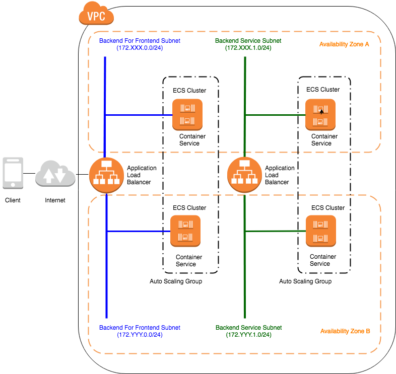
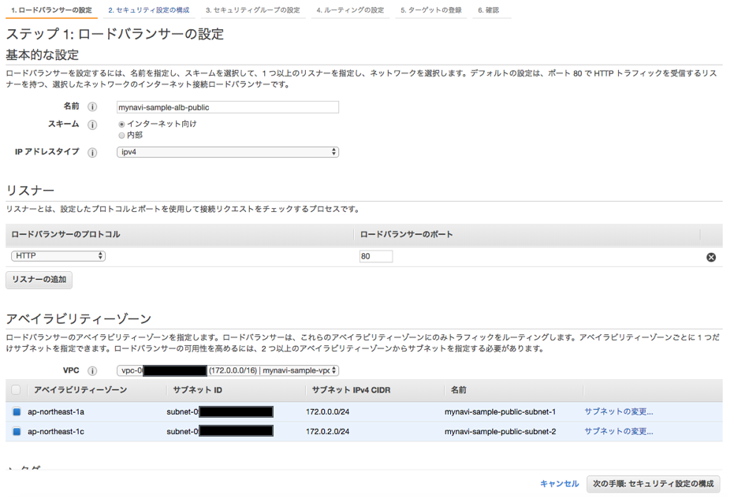
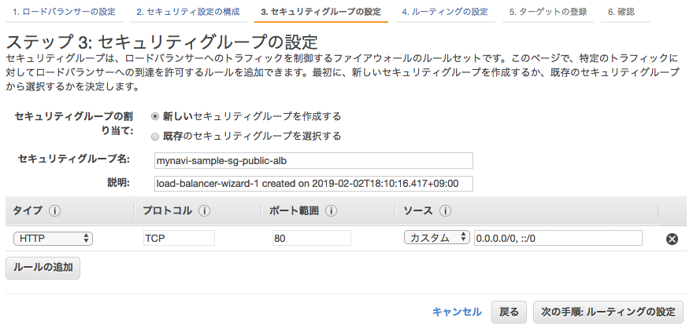
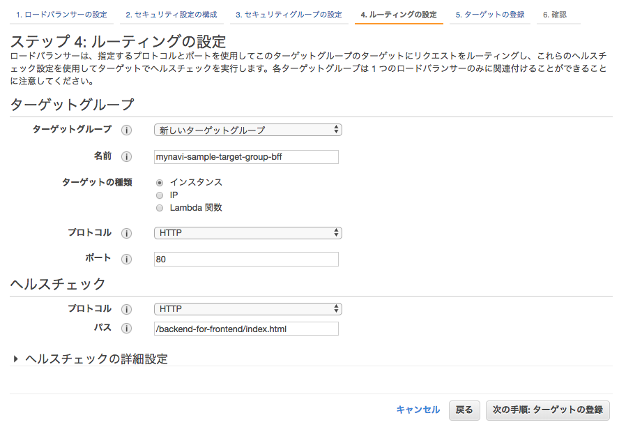
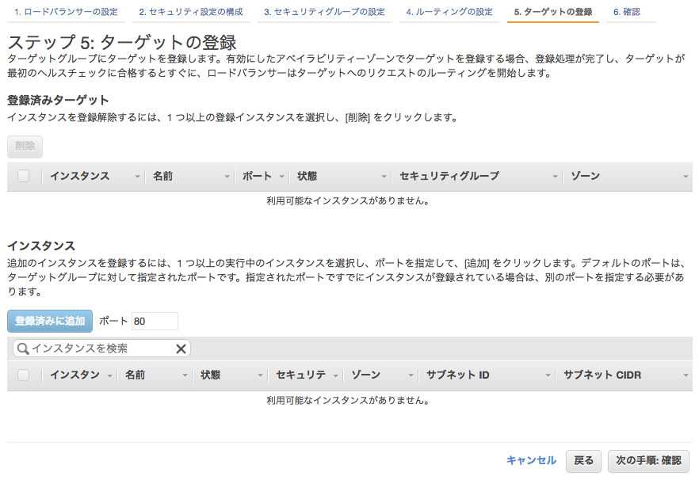
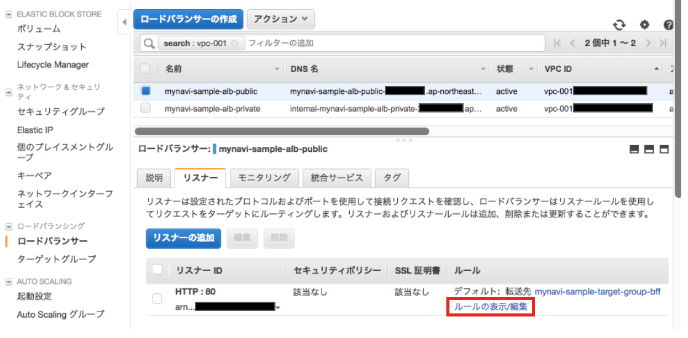
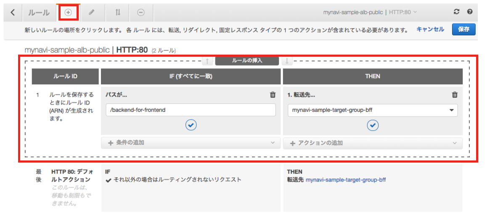

.. include:: ../module.txt

.. _section-cloud-native-ecs-2nd-label:

【第5回】ECSコンテナAP開発(2)ALB構築
----------------------------------------------------------------------------------------

|br|

クラウド時代が到来し、ますます広がりを見せつつあるコンテナ技術。第2回は、AWS ECS上でSpringアプリケーションを構築する方法を説明します。本稿は以下のステップに沿って、解説しています。

#. VPC(Virtual Private Cloud)環境の構築
#. アプリケーションロードバランサ(ALB)の作成
#. Springを使用したコンテナアプリケーションの実装方法
#. Dockerコンテナの作成・DockerHubへのプッシュ
#. ECSクラスタの作成
#. ECSタスクの定義
#. ECSサービスの実行

前回の記事「 :ref:`section-cloud-native-ecs-1st-label` 」では、以下イメージの構成に沿って、VPC環境を構築しました。今回は「2.アプリケーションロードバランサ(ALB)の作成」です。

|br|

|br|

.. _section-cloud-native-ecs-create-alb-label:

(2)アプリケーションロードバランサー(ALB)の作成
^^^^^^^^^^^^^^^^^^^^^^^^^^^^^^^^^^^^^^^^^^^^^^^^^^^^^^^^^^^^^^^^^^^^^^^^^^^^^^^^^^^^^^^^^^^^^^^^^^^^^^^^^

|br|

VPCの環境では、パブリックとプライベートにサブネットを分割しました。プライベートサブネットのECSコンテナへは、基本VPC内以外からのアクセスは受け付けないよう、ロードバランサーにもセキュリティグループを設定しておく必要があり、
一方、パブリックサブネットのECSコンテナはインターネットからの接続を受け付けるようにするため、ロードバランサーもパブリック用とプライベート用２種類作成します。

|br|

.. note:: AWSでロードバランサーはElastic Load Balancer(ELB)というサービス名で提供されてます。ELBにはいくつか種類があり、代表的なものはアプリケーションロードバランサー(ALB)です。ALBの代表的な機能としては、パケットの内容に応じたコンテントベースのルーティングで、レイヤー7（L7）スイッチが備える機能をもちます。ALBが提供される以前のロードバランシングサービスは「Classic Load Balancer（CLB）」という名称に変更されました。 ELBは、新しいALBと従来のCLB、後述するNLBを合わせたロードバランシングサービスの総称として表現されます。ALBの特徴は以下の通りです。|br|

  [ALBの特徴]

  * パスベースルーティング
  * コンテナ化されたアプリケーションのサポート
  * HTTP/2サポート
  * WebSocketサポート
  * StickySessionの強化
  * ヘルスチェックの強化
  * インスタンスのヘルスチェックは従来通りHTTP/HTTPSでpingを実行
  * レスポンスコードの指定（200〜299複数）
  * CloudWatchのメトリクス強化（ターゲットグループ単位）

  |br| ALB、ELBはリバースプロキシ型の負荷分散サービスを提供する一方、もっとも最新のNLBはL4 NATロードバランサです。

  [NLBの特徴]

  * 固定IPアドレス
  * Pre-warming申請不要
  * ゾーナリティ
  * Source Address Preservation
  * フェイルオーバーに対応

  |br| 各ロードバランシングサービスの比較は `Elastic Load Balancing 製品の詳細 <https://aws.amazon.com/jp/elasticloadbalancing/features/#compare>`_ に詳細がまとめられていますので、適宜参考にしてください。

|br|

次回(3)でも後述しますが、パブリックサブネットのBFFアプリケーションでは、バックエンドのコンテナアプリケーションを呼び出す際に、ロードバランサーを経由するHTTPリクエストを送信します。この時、ロードバランサーでは、ALBのパスベースルーティング機能を使ってコンテナアプリケーションを識別しますので、ロードバランサーにはALBを指定しておいてください。

|br|

「EC2」サービスから、「ロードバランサー」メニューを選択し、「ロードバランサーの作成」を押下します。ALBを選択し、「作成」ボタンを押下します。

.. figure:: img/aws-ecs/management-console-ec2-create-alb-1.png

|br|

以下の要領に従って、ALBを設定します。「セキュリティ設定の構成」ボタンを押下後、そのまま「セキュリティグループの設定」ボタンを押下し、先に進んでください。

.. list-table:: ALBの設定項目
   :widths: 3, 7

   * - 入力項目
     - 説明

   * - 名前
     - ALBに設定する任意の名前を入力します。

   * - スキーム
     - ALBが使用されるサブネットに従って、設定します。パブリックサブネットはインターネット向け、プライベートサブネットは内部向けを設定してください。

   * - アドレスタイプ
     - ロードバランサーで取り扱うIPアドレスタイプを設定します。ここではIPv4を設定してください。

   * - リスナー：ロードバランサーのプロトコル・ポート
     - HTTPかHTTPSかを指定します。本番環境などはHTTPSを指定しますが、今回はHTTP:80を設定しておきます。

   * - アベイラビリティゾーン：VPC
     - 前回作成したVPCを指定します。

   * - アベイラビリティゾーン：アベイラビリティゾーンおよびサブネット
     - ロードバランシングするアベイラビリティゾーンおよびそのサブネットを指定します。上記のスキームに合わせて設定してください。

|br|

ロードバランサーのセキュリティグループを作成します。後々、作成するECSクラスタのセキュリティグループの発信元ソースに、このロードバランサーのセキュリティグループを許可対象として設定することになるので、ここでは今回ユニークに割り当てるセキュリティグループを新規作成してください。

* セキュリティグループの割り当て：新しいセキュリティグループを作成する
* セキュリティグループ名：任意のセキュリティグループ名を入力
* タイプ：HTTP
* プロトコル：TCP
* ポート範囲：80
* ソース：0.0.0.0/0

|br|

.. note:: プライベートサブネットのロードバランサー設定では、以下の通り、VPC内からのアクセスしか許可しないよう、セキュリティグループを設定しておきます。

   * タイプ：HTTP
   * プロトコル：TCP
   * ポート範囲：80
   * ソース：172.0.0.0/16

   .. figure:: img/aws-ecs/management-console-ec2-create-alb-4.png

|br|

コンテナを実行するECSクラスタ向けのターゲットグループを指定します。ちなみに複数の違う種類のコンテナを配置する場合は、各コンテナアプリケーションごとにターゲットグループを指定されることになります。

[ターゲットグループ]

* ターゲットグループ：新しいターゲットグループ
* 名前：任意のターゲットグループ名(32文字以内)
* ターゲットの種類：ECSクラスタとなるインスタンスを指定するため、インスタンスを指定して下さい。
* プロトコル：HTTP
* ポート：80

[ヘルスチェック]

* プロトコル：HTTP
* パス：アプリケーションを実行した時に正常応答する場合のパスを指定してください。

.. note:: ヘルスチェックするアプリケーションのURLがhttp://localhost:8080/backend-for-frontend/index.htmlであれば、パス名はアプリケーションコンテキストパス以下となる/backend-for-frontend/index.htmlを指定します。

|br|

ターゲットグループにはECSサービスの作成で改めて登録するので、ここでは特に何もターゲットの登録をせずALBを作成してください。

|br|

作成したロードバランサーにパスベースのルーティングをターゲットグループに対して設定します。「EC2」サービスから「ロードバランサー」メニューを選択し、作成した２つのパブリック・プライベート用のロードバランサーを各々選択し、「リスナー」タブから「ルールの表示/編集」リンクを押下します。

|br|

画面上部のプラスボタンを押下し、ルールを追加します。各ターゲットグループにどのパスで、どのターゲットグループへルーティングするかを設定します。条件を設定した後、「保存」ボタンを押して、パスベースのルーティングのルールを保存してください。

.. note:: パスとして指定する値は、アプリケーションのコンテキストルートに相当するだけを設定しておくと、次回(3)で作成するSpringアプリケーションで柔軟なサービス呼び出しができます。

以上で、ALBの設定は終了です。次回はECSコンテナで実行するSpringアプリケーションについて実装方法を解説します。

|br|

著者紹介
^^^^^^^^^^^^^^^^^^^^^^^^^^^^^^^^^^^^^^^^^^^^^^^^^^^^^^^^^^^^^^^^^^^^^^^^^^^^^^^^^^^^^^^^^^^^^^^^^^^^^^^^^

川畑 光平(KAWABATA Kohei)

.. figure:: img/aws-lambda-and-api-gateway/pic_image01.jpg

某システムインテグレータにて、金融機関システム業務アプリケーション開発・システム基盤担当を経て、現在はソフトウェア開発自動化関連の研究開発・推進に従事。

Red Hat Certified Engineer、Pivotal Certified Spring Professional、AWS Certified Solutions Architect Professional等の資格を持ち、アプリケーション基盤・クラウドなど様々な開発プロジェクト支援にも携わる。

本連載記事の内容に対するご意見・ご質問は `Facebook <https://www.facebook.com/kohei.kawabata.5>`_ まで。
