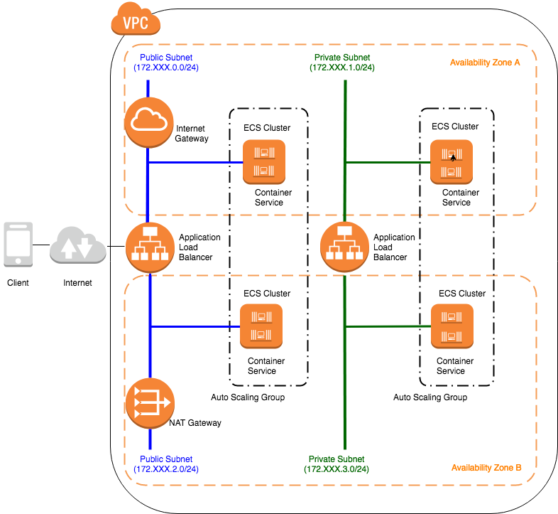
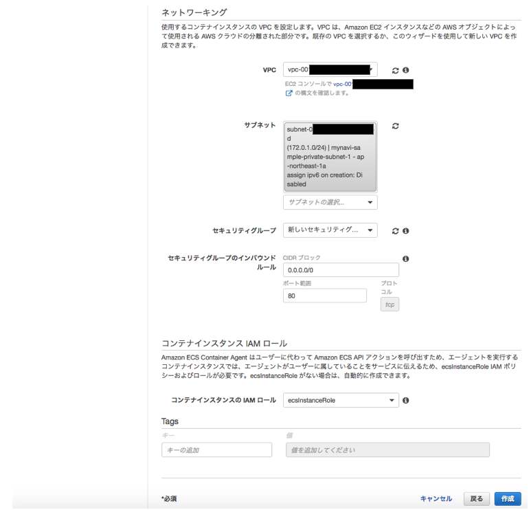

.. include:: ../module.txt

.. _section-cloud-native-ecs-label-5:

AWSで作るクラウドネイティブアプリケーションの基本
========================================================================================

.. _section-cloud-native-ecs-5th-label:

第2回 AWS ECS上に構築するSpringアプリケーション(5)
----------------------------------------------------------------------------------------

|br|

クラウド時代が到来し、ますます広がりを見せつつあるコンテナ技術。第2回は、AWS ECS上でSpringアプリケーションを構築する方法を説明します。本稿は以下のステップに沿って、解説しています。

#. VPC(Virtual Private Cloud)環境の構築
#. アプリケーションロードバランサ(ALB)の作成
#. Springを使用したコンテナアプリケーションの実装方法
#. Dockerコンテナの作成・DockerHubへのプッシュ
#. ECSクラスタの作成
#. ECSタスクの定義
#. ECSサービスの実行

前回の記事「 :ref:`section-cloud-native-ecs-4th-label` 」までに、VPC環境・ALBを構築し、ECSコンテナ上で動くパブリック・プライベートサブネット用２種類のアプリケーションを作成した上で、
Dockerコンテナイメージを作成して、DockerHubレジストリにプッシュするところまで解説しました。構成イメージは以下の通りです。

|br|

|br|

続く今回はECSクラスタを作成します。

|br|

.. _section-cloud-native-ecs-create-cluster-label:

(5)ECSクラスタの作成
^^^^^^^^^^^^^^^^^^^^^^^^^^^^^^^^^^^^^^^^^^^^^^^^^^^^^^^^^^^^^^^^^^^^^^^^^^^^^^^^^^^^^^^^^^^^^^^^^^^^^^^^^

|br|

ECSクラスタはパブリックサブネット・プライベートサブネット双方に作成します。EC2起動型のECSクラスタ自体はECSコンテナ(Dockerコンテナ)を実行するEC2インスタンスそのもので、
EC2と同様、実行するマシンのスペックなどを選択して、各アベイラビリティゾーン毎にプロビジョニングします。

今回はサンプルのため、パブリック・プライベートサブネットともに
クラスタは１つのアベイラビリティゾーンにだけしか配置しませんが、ALBからはターゲットグループでコンテナを指定するかたちになるので、ロードバランス上問題はありません。

「Amazon ECS」サービスから、「クラスター」メニューを選択し、「クラスタの作成」ボタンを押下します。クラスターテンプレートの選択で、「EC2 Linux + ネットワーキング」を選択し、
「次のステップへ」ボタンを押下します。

|br|

.. figure:: img/aws-ecs/management-console-ecs-create-cluster-1.png
   :scale: 100%

|br|

以下の要領に従って、ECSクラスタの設定を行います。

.. list-table:: ECSクラスタの入力項目
   :widths: 3, 7

   * - 入力項目
     - 説明

   * - クラスター名
     - クラスタ名として任意の名称を入力します。

   * - プロビジョニングモデル
     - クラスタとして実行するEC2インスタンスの種別を設定します。ここでは、オンデマンドインスタンスを設定します。

   * - EC2インスタンスタイプ
     - クラスタとして実行するEC2インスタンスのスペックを設定します。Springアプリケーションを実行するECSコンテナあたり最低1GB程度メモリ消費するので、1クラスタに配置したいコンテナ数に合わせてインスタンスタイプを選択してください。

   * - インスタンス数
     - 実行するクラスタのインスタンス数を指定します。

   * - EBSストレージ
     - ECSクラスタのストレージサイズを設定します。Dockerイメージ自体で相当のデータサイズを消費することに加え、実行アプリケーションで使用するストレージサイズを踏まえ、大きめの値を設定してください。

   * - キーペア
     - ECSクラスタへSSH接続するためのキーペアを指定します。

   * - VPC
     - クラスタを作成するVPCを指定します。

   * - サブネット
     - クラスタを作成するサブネットを指定します。ここでは、パブリック・プライベートのいずれかを指定してサブネット作成してください。

   * - セキュリティグループ
     - ECSクラスタに設定するセキュリティグループを指定します。後述しますが、ロードバランサからの動的ポーティングを設定するため、ここでは新しいセキュリティグループを選択してください。

   * - コンテナインスタンスIAMロール
     - ecsInstanceRoleを指定します。

|br|

|br|

.. warning:: ecsInstanceRoleとは、AmazonEC2ContainerServiceforEC2Roleポリシーが付与されたIAM ロールです。

   .. sourcecode:: java

      {
        "Version": "2012-10-17",
        "Statement": [
        {
            "Effect": "Allow",
            "Action": [
                "ecs:CreateCluster",
                "ecs:DeregisterContainerInstance",
                "ecs:DiscoverPollEndpoint",
                "ecs:Poll",
                "ecs:RegisterContainerInstance",
                "ecs:StartTelemetrySession",
                "ecs:UpdateContainerInstancesState",
                "ecs:Submit*",
                "ecr:GetAuthorizationToken",
                "ecr:BatchCheckLayerAvailability",
                "ecr:GetDownloadUrlForLayer",
                "ecr:BatchGetImage",
                "logs:CreateLogStream",
                "logs:PutLogEvents"
            ],
            "Resource": "*"
        }
        ]
      }

   当ポリシーをECSクラスタのIAMロールへアタッチしなければ、Dockerコンテナをサービスとして起動できなくなるため注意しましょう。

|br|

.. note:: プロビジョニングモデルで、オンデマンドインスタンスを選択しても、EC2リザーブドインスタンスは有効になります。リザーブドインスタンスを適用するのであれば、対応するEC2インスタンスタイプを指定しましょう。

|br|

次に、作成したECSクラスタのセキュリティグループ設定で、ロードバランサからの接続および、トラブルシューティング時のSSH接続アクセス許可を追加します。
特に、ロードバランサからの接続は動的ポーティングでコンテナを運用する場合、ALBからの通信でポート32768-61000を許可する必要があります。

「EC2」サービスから、「セキュリティグループ」を選択し、上記で作成したECSクラスタのセキュリティグループを選択して、インバウンドルールを変更して下さい。なお、ALBからの通信のソースはALBに設定しているセキュリティグループを指定します。

|br|

|br|

パブリック・プライベートサブネット各々ECSクラスタを作成すれば設定は完了です。次回は、実際にECSクラスタへ配置するコンテナを定義するためにECSタスク定義を行います。

|br|

著者紹介
------------------------------------------------------------------

川畑 光平(KAWABATA Kohei)

.. figure:: img/aws-lambda-and-api-gateway/pic_image01.jpg
   :scale: 100%

某システムインテグレータにて、金融機関システム業務アプリケーション開発・システム基盤担当を経て、現在はソフトウェア開発自動化関連の研究開発・推進に従事。

Red Hat Certified Engineer、Pivotal Certified Spring Professional、AWS Certified Solutions Architect Professional等の資格を持ち、アプリケーション基盤・クラウドなど様々な開発プロジェクト支援にも携わる。

本連載記事の内容に対するご意見・ご質問は `Facebook <https://www.facebook.com/kohei.kawabata.5>`_ まで。
