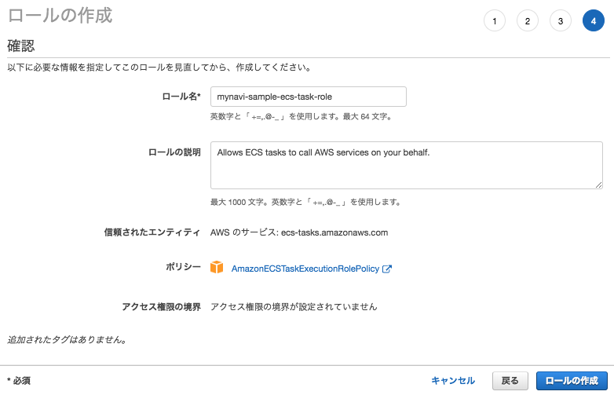
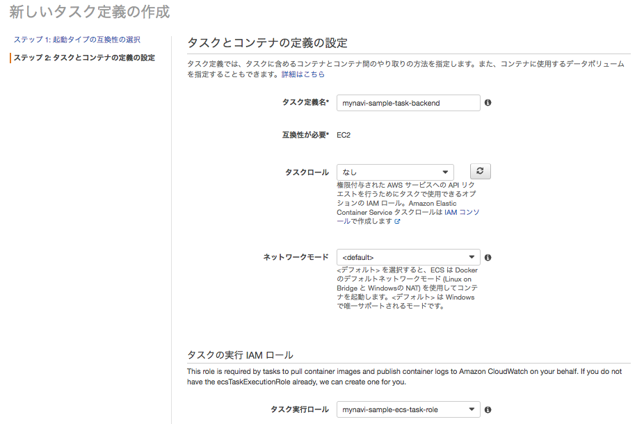

.. include:: ../module.txt

.. _section-cloud-native-ecs-label-6:

AWSで作るクラウドネイティブアプリケーションの基本
========================================================================================

.. _section-cloud-native-ecs-6th-label:

第2回 AWS ECS上に構築するSpringアプリケーション(6)
----------------------------------------------------------------------------------------

|br|

クラウド時代が到来し、ますます広がりを見せつつあるコンテナ技術。第2回は、AWS ECS上でSpringアプリケーションを構築する方法を説明します。本稿は以下のステップに沿って、解説しています。

#. VPC(Virtual Private Cloud)環境の構築
#. アプリケーションロードバランサ(ALB)の作成
#. Springを使用したコンテナアプリケーションの実装方法
#. Dockerコンテナの作成・DockerHubへのプッシュ
#. ECSクラスタの作成
#. ECSタスクの定義
#. ECSサービスの実行

前回の記事「 :ref:`section-cloud-native-ecs-5th-label` 」までに、以下イメージの構成に沿って、VPC環境・ALBを構築した後、ECSコンテナ上で動くパブリック・プライベートサブネット用２種類のアプリケーションを作成し、
Dockerコンテナイメージを作成してレジストリにプッシュしました。そして、コンテナを実行するためのECSクラスタを作成し、今回は「6. ECSタスクの定義」です。

|br|

.. figure:: img/aws-ecs/ecs-architecture.png
   :scale: 100%

|br|

.. _section-cloud-native-ecs-define-task-label:

(6)ECSタスクの定義
^^^^^^^^^^^^^^^^^^^^^^^^^^^^^^^^^^^^^^^^^^^^^^^^^^^^^^^^^^^^^^^^^^^^^^^^^^^^^^^^^^^^^^^^^^^^^^^^^^^^^^^^^

|br|

ECSタスク定義では、前回プッシュしたDockerコンテナイメージのレジストリURLや割り当てるCPU、メモリ、マッピングするポートといったECSコンテナに関する設定を行います。
ECSタスクが実際にサービスとして実行されるには、コンテナイメージをプルしたり、CloudWachへログを送信するためのECSタスク実行用のIAMロールが必要です。また、必要に応じてコンテナ内のアプリケーションの動作のために必要なロールも事前に定義しておく必要があります。

|br|

まずはECSコンテナに割り当てるタスク実行用のIAMロールを作成します。「IAM」サービスから「ロール」メニューを選択し、「ロールの作成」ボタンを押下します。
「Elastic Container Service」を選び、「ユースケースの選択」で「Elastic Container Service Task」を選択してください。

|br|

|br|

アタッチするアクセス権限のポリシーに「AmazonECSTaskExecutionRolePolicy」をアタッチします。

|br|

.. figure:: img/aws-ecs/management-console-iam-create-ecsrole-2.png
   :scale: 100%

|br|

「ロール名」に任意の名前を入力して、「ロールの作成」ボタンを押下します。

|br|

|br|

同様に、アプリケーションの処理に応じて、必要なロールを作成してください。(例えば、アプリケーションがS3へアクセスするならS3アクセスポリシーを割り当てたIAMロールを設定します)。

引き続き、ECSタスク定義を実行します。「ECS」サービスで、「タスク定義」メニューを選択し、「新しいタスク定義の作成」ボタンを押下してください。「起動タイプの互換性の選択」には「EC2」を選択します。

|br|

|br|

以下の要領に従って、ECSタスク定義の設定を行います。

.. list-table:: ECSタスク定義の入力項目
   :widths: 2, 8

   * - 入力項目
     - 説明

   * - タスク定義名
     - タスク定義として任意の名称を入力します。

   * - タスクロール
     - アプリケーションの処理内容に応じて必要なIAMロールを設定します。特にAWSのサービスを利用する処理がなければ、「なし」も選択できます。 詳細は 「 `タスク用のIAMロール <https://docs.aws.amazon.com/ja_jp/AmazonECS/latest/developerguide/task-iam-roles.html>`_ 」を参照してください。

   * - ネットワークモード
     - コンテナとクラスタ間のネットワーク変換の方式を指定します。通常はデフォルトでかまいません。

   * - タスク実行ロール
     - 上記で作成したタスク実行用のIAMロールを指定します。詳細は「 `タスク実行用のIAMロール <https://docs.aws.amazon.com/ja_jp/AmazonECS/latest/developerguide/task_execution_IAM_role.html>`_ 」を参照してください。

   * - タスクメモリ
     - コンテナに割り当てるメモリを指定します。Springアプリケーションを実行する際は最低1024MB以上は割り当ててください。

   * - タスクCPU
     - コンテナに割り当てるCPUユニット数を指定します。

|br|

.. figure:: img/aws-ecs/management-console-ecs-create-task-3.png
   :scale: 100%

|br|

また、コンテナの定義は以下の要領に従って、実行してください。

.. list-table:: コンテナ定義の入力項目
   :widths: 2, 8

   * - 入力項目
     - 説明

   * - コンテナ名
     - コンテナの任意の名称を入力します。

   * - イメージ
     - DockerイメージのあるレジストリURLを[registry-url]/[namespace]/[image]:[tag]の形式で指定します。Docker Hubの公開レポジトリであれば、[namespace]/[image]の形式でも可能です。

   * - プライベートレジストリの認証
     - 認証が必要なプライベートレジストリからコンテナイメージを取得する場合に指定します。

   * - メモリ制限
     - コンテナに割り当てるメモリを指定します。Springアプリケーションを実行する際は最低1024MB以上は割り当ててください。

   * - ポートマッピング
     - コンテナアプリケーションにマッピングするポート番号を指定します。例えば、ECSクラスタが80番ポートで受け付けて、コンテナが8080番ポートに変換して実行する場合、ホストポートに80を、コンテナポートに8080を指定します。なお、動的ポートマッピングを使用する場合は0を設定してください。

|br|

|br|

.. note:: 詳細コンテナの設定はスキップしても問題ありませんが、アプリケーションへの環境変数など必要に応じて設定してください。

|br|

パブリック・プライベート用アプリケーションのコンテナイメージをそれぞれタスク定義すれば完了です。第二回の最後となる次回は、ECSサービスを実行してみます。

|br|

著者紹介
------------------------------------------------------------------

川畑 光平(KAWABATA Kohei)

.. figure:: img/aws-lambda-and-api-gateway/pic_image01.jpg
   :scale: 100%

某システムインテグレータにて、金融機関システム業務アプリケーション開発・システム基盤担当を経て、現在はソフトウェア開発自動化関連の研究開発・推進に従事。

Red Hat Certified Engineer、Pivotal Certified Spring Professional、AWS Certified Solutions Architect Professional等の資格を持ち、アプリケーション基盤・クラウドなど様々な開発プロジェクト支援にも携わる。

本連載記事の内容に対するご意見・ご質問は `Facebook <https://www.facebook.com/kohei.kawabata.5>`_ まで。
