.. include:: ../module.txt

.. _section-cloud-native-api-gateway-and-lambda-label-3:

AWSで作るクラウドネイティブアプリケーションの基本
========================================================================================

.. _section-cloud-native-api-gateway-and-lambda-3rd-label:

第1回 API GatewayとLambdaを使ったサーバレスSpringアプリケーション(3)
----------------------------------------------------------------------------------------

|br|

クラウド時代が到来し、ますます広がりを見せつつあるサーバレス開発。初回はAWS LambdaとAPI Gatewayを使ったサーバレス環境下でSpringアプリケーションを構築する方法を解説します。

|br|

前回の記事「 :ref:`section-cloud-native-api-gateway-and-lambda-2nd-label` 」ではサーバレスアプリケーションをAWS Lambdaへ登録しました。
今回は、Amazon API Gatewayを設定して、登録したLambda関数を呼び出してみましょう。

|br|

.. _section-setting-api-gateway-label:

Amazon API Gatewayの設定
^^^^^^^^^^^^^^^^^^^^^^^^^^^^^^^^^^^^^^^^^^^^^^^^^^^^^^^^^^^^^^^^^^^^^^^^^^^^^^^^^^^^^^^^^^^^^^^^^^^^^^^^^

|br|

リクエストを受け付けて、設定したAWS Lambdaを実行するためのAPI Gatewayの設定を行います。AWSコンソールの
API Gatewayサービスメニューから、以下を入力して、「APIの作成」を押下してください。

* Protocol : REST
* 新しいAPIの作成：新しいAPI
* API名：任意の名前を入力
* エンドポイントタイプ：リージョン

|br|

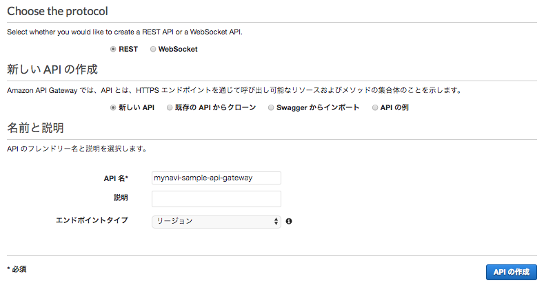

|br|

API作成後、「アクション」ボタンから「リソースの作成」を選択します。

|br|

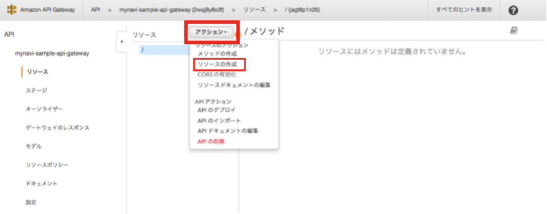

|br|

リソース名とリソースパスを設定し、「リソースの作成」ボタンを押下します。

|br|

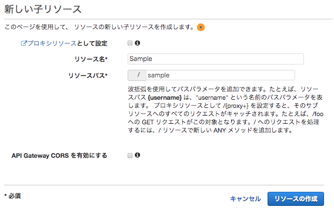

|br|

作成したリソースを選択し、再び「アクション」メニューからメソッドの作成を選択し、POSTメソッドを選択、チェックボタンを押下します。

.. warning:: GETメソッドを指定すると、SpringBootApiGatewayRequestHandlerでは、JSONリクエストボディがなくなるため、エラーになります。2019.1月現在、この問題は `ISSUE <https://github.com/spring-cloud/spring-cloud-function/issues/189>`_ として起票されています

|br|

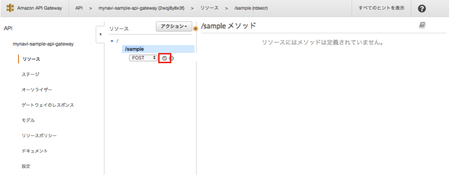

|br|

以下の設定内容に従って、POSTメソッドのセットアップを行い、「保存」ボタンを押下します。

* 統合タイプ：Lambda関数
* Lambdaプロキシ統合の使用：チェックする
* Lambdaリージョン：Lambdaを作成したリージョン
* Lamnda関数：前節で作成したLambda関数名を選択する。
* デフォルトタイムアウトの使用：チェックする

|br|

.. warning:: Lambdaプロキシ統合をチェックしないと、Lambdaファンション側にSpring Cloud Functionが期待するデータが来ないのでエラーとなります。忘れないようにチェックしておきましょう。なお、Lambdaプロキシ統合をチェックしないとエラーになる理由は、今回ハンドラクラスで継承したSpringBootApiGatewayRequestHandlerが、型パラメータとしてcom.amazonaws.services.lambda.runtime.events.APIGatewayProxyRequestEventを指定しているためです。Lambdaプロキシ統合でなければ、上記の型パラメータクラスに必要な情報が渡って来ないため、NullPointerExceptionでエラーになります。

|br|

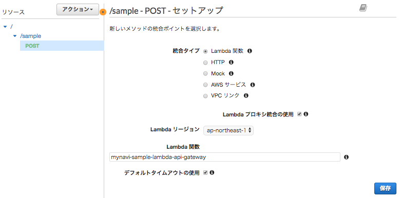

|br|

設定したLambda関数が正しく動くか動作テストを実施します。「テスト」リンクを押下します。

|br|

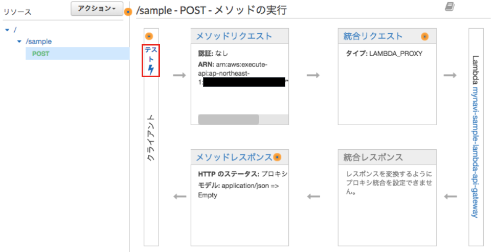

|br|

以下の項目を入力し、「テスト」ボタンを押下します。レスポンス本文に「Complete!」と表示されればアップロードしたサーバレスアプリケーションが正常に実行された結果です。

* リクエスト本文：{"test":"TestMessage"}

|br|

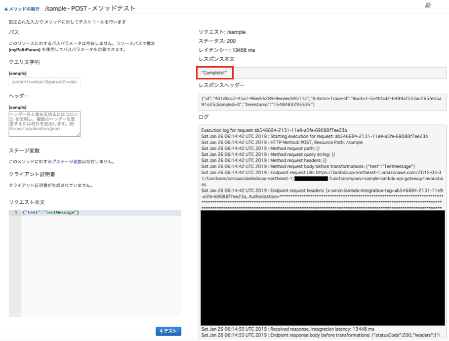

|br|

Lambda関数が正常に実行できることは確認できましたが、外からAPIをコールするためには、APIをデプロイすることが必要です。「アクション」メニューから「APIのデプロイ」を選択します。

|br|

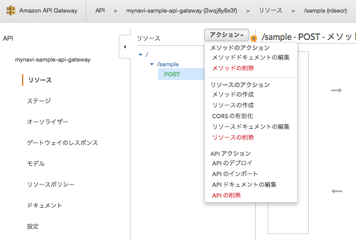

|br|

デプロイされるステージとして、「新しいステージ」を選択し、任意の名前を入力し、「デプロイ」ボタンを押下します。ステージ名はエンドポイントURLにも反映されるため、「prod」や「dev」などにするのが一般的です。

|br|

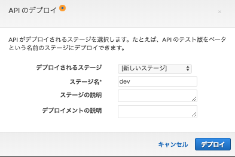

|br|

APIがデプロイされると、エンドポイントのURLが表示されます。このURLにリソース名を加えたものがリソースURLになります。

|br|

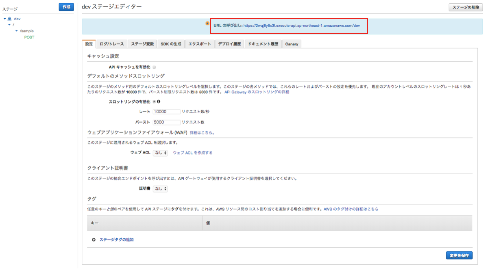

|br|

設定が終わったら、実際に外部のローカルクライアントから、curlコマンドなどでリクエストを送信し、実行結果を確認してみましょう。エンドポイントURLの最後にリソース名を付与するのを忘れないでください。

.. sourcecode:: bash

   curl -d '{"test":"TestMessage"}' https://xxxxxxxx.execute-api.ap-northeast-1.amazonaws.com/dev/sample

|br|

コマンドを実行した結果、"Complete!"というメッセージが返却されるのに加えて、CloudWatch Logsには、実行したLambda関数の結果が表示されます。

|br|

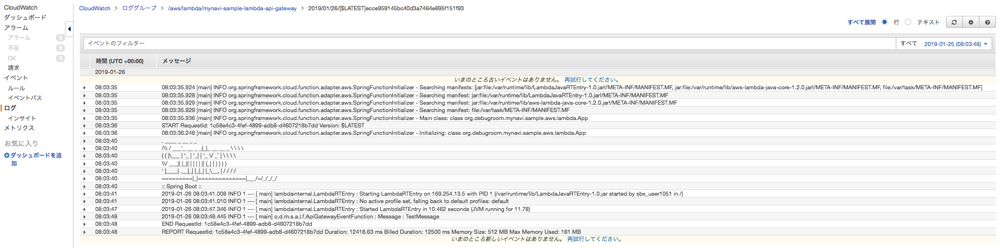

|br|

.. note:: Lambda関数の初回起動時はSpringFrameworkの起動でAPIリクエストを送信してから実行までに少々時間がかかります。２回目以降は実行環境が再利用されるので、即時処理されますが、実行環境は一定時間経つと破棄されるので、そうした制約を考慮しておきましょう。

|br|

まとめ
------------------------------------------------------------------

AWS LambdaやAmazon API Gateway、Spring Cloud Functionを利用することにより、ごくごく少量のコーディングで、サーバレスアプリケーションを実行することができます。
このサーバレス開発のスタックはとても簡易で、かつ拡張性も高く、エンタープライズ開発でも十分有用です。

著者紹介
------------------------------------------------------------------

川畑 光平(KAWABATA Kohei)

.. figure:: img/aws-lambda-and-api-gateway/pic_image01.jpg
   :scale: 100%

某システムインテグレータにて、金融機関システム業務アプリケーション開発・システム基盤担当を経て、現在はソフトウェア開発自動化関連の研究開発・推進に従事。

Red Hat Certified Engineer、Pivotal Certified Spring Professional、AWS Certified Solutions Architect Professional等の資格を持ち、アプリケーション基盤・クラウドなど様々な開発プロジェクト支援にも携わる。
