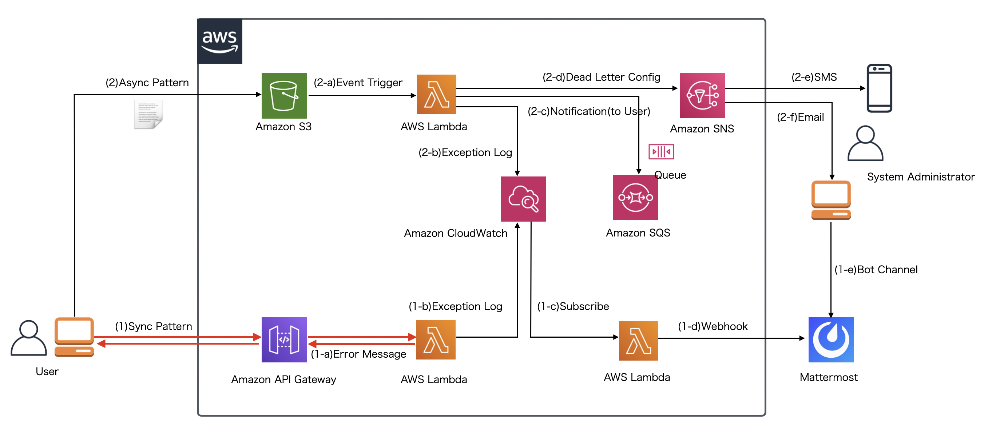
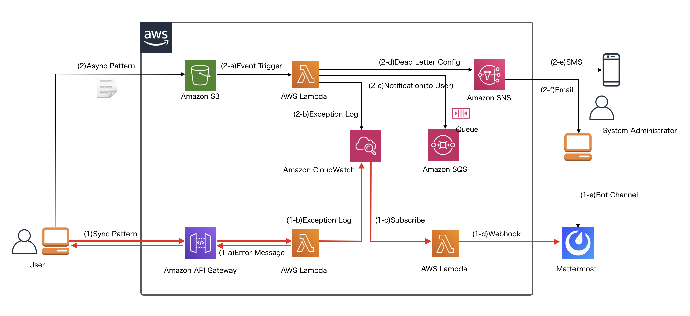

.. include:: ../module.txt

.. _section-cloud-native-lambda-error-handling-4th-label:

【第9回】AWS Lambdaにおけるサーバレスエラーハンドリング(4)
----------------------------------------------------------------------------------------

|br|

本連載では、AWS Lambdaを使ったサーバレス処理でのエラーハンドリング方法を解説しています。
前回は以下の赤字の矢印のスコープにおいて、同期的なLambdaの呼び出しでビジネスエラーが発生するケースを想定して、Spring Cloud Functionを使ったLambdaファンクション内でエラーハンドリングを実装し、API GatewayとLambda環境をCloudFormationテンプレートを使って構築する方法を解説しました。

|br|

|br|

今回からはAPI GatewayとLambda実行環境でシステムエラーが発生することを想定した以下のような赤い矢印でのケースを想定した実装を解説します。

|br|

|br|

システムエラーは :ref:`section-cloud-native-lambda-error-handling-concept-label` でも解説した通り、ユーザ側で対処しようがない、システムに問題が発生している時のエラーであり、
システム管理者や運用者による対処が必要になります。ユーザ側にエラーを通知するだけでなく、エラー原因・解析のためのログを残したり、運用担当へメッセージを通知する必要があります。
オンプレミスで構築されたシステムなどでは、通常サーバに出力されたエラーメッセージを監視ミドルウェアなどを通じて、運用担当へ通知を行う方法が一般的ですが、
本連載のように実行環境がクラウド環境、ましてサーバレスであるLambdaでは、基本的にCloudWatchを活用してエラー対処するための設定を行う必要があります。
このような場合のよくあるユースケースとして、上記の図にあるようにCloudWatchに出力されたログをイベント契機として新たにLambdaファンクションを実行し、システム管理者や運用担当者に、
MattermostなどのコミュニケーションツールのWebhook機能を使ってエラー通知する実装方法を今回以降紹介・解説していきます。

|br|

.. _section-cloud-native-lambda-error-handling-lambda-sync-execute-system-error-label:

Lambdaファンクションの同期呼び出し時のシステムエラーのハンドリングの実装
^^^^^^^^^^^^^^^^^^^^^^^^^^^^^^^^^^^^^^^^^^^^^^^^^^^^^^^^^^^^^^^^^^^^^^^^^^^^^^^^^^^^^^^^^^^^^^^^^^^^^^^^^^^^^^^^^^^^^^^^^^^^

|br|

:ref:`section-cloud-native-lambda-error-handling-spring-cloud-function-3-1-label` と同様の要領で、Spring Cloud Functionで実装されたLambdaファンクションのシステムエラーのハンドリング実装の解説を進めていきます。
FunctionInvokerから実行される、同期的なシステムエラーハンリングを実装したファンクションクラスは以下の通りです。

|br|

.. sourcecode:: java

   package org.debugroom.mynavi.sample.aws.lambda.errorhandling.app.function;

   // omit
   import java.util.function.Function;

   import org.springframework.messaging.Message;
   import org.springframework.messaging.support.MessageBuilder;

   import org.debugroom.mynavi.sample.aws.lambda.errorhandling.domain.service.CreateSystemErrorService;
   import org.debugroom.mynavi.sample.aws.lambda.errorhandling.app.model.SampleResource;

   import lombok.extern.slf4j.Slf4j;

   @Slf4j
   public class SyncExecuteSystemErrorFunction
        implements Function<Map<String, Object>, Message<SampleResource>> { //(1)

       @Autowired
       CreateSystemErrorService createSystemErrorService; //(2)

       @Override
       public Message<SampleResource> apply(Map<String, Object> stringObjectMap) {

           log.info(this.getClass().getName() + " has started!");
           log.info("[Input]" + stringObjectMap.toString()); //(3)

           createSystemErrorService.execute(); //(4)

           return MessageBuilder.withPayload(SampleResource.builder()
                .message("This code would never be reached.").build()).build(); //(5)

       }
   }

|br|

.. list-table:: システムエラーが発生するファンクションクラスの実装コードの詳細
   :widths: 1, 19

   * - 項番
     - 説明

   * - (1)
     - java.util.Functionクラスを実装します。インプット型としてMapクラスを、アウトプット型として、返却するクラスオブジェクトSampleResourceを型パラメータに指定したorg.springframework.messaging.Messageを指定します。

   * - (2)
     - システム例外(非検査例外)をスローするサービスクラスとしてCreateSystemErrorServiceを使用します。

   * - (3)
     - Slf4jのログ機能を使って、インプットパラメータおよびメタデータを標準出力に出力しています。標準出力した内容はCloudWatch側へログとして出力されます。

   * - (4)
     - 通常非検査例外は、想定外に発生するエラーに起因するものであり、キャッチするものでありません。
       ここでは、何かしら想定がにエラーが発生したことを想定して、Javaの非検査例外クラスであるRuntimeExceptionを継承したSystemExceptionクラスをスローするServiceを呼び出します。

   * - (5)
     - (4)で非検査例外であるSystemExceptionがスローされているので到達することはないコードです。スローされたタイミングでその処理は中断され、SystemExceptionのスタックトレースが標準出力へ出力されることになります。出力されたスタックトレースはCloudWatch Logsから確認可能です。

|br|

ここで、出力されたログに特定の文字列が含まれた場合、新たに別のLambdaファンクションを起動して、出力されたエラーの内容を外部のコミュニケーションツールであるMattermostへ連携する方法を紹介します。

|br|

.. _section-cloud-native-lambda-error-handling-lambda-sync-execute-system-error-notification-label:

CloudWatchに出力されたシステムエラーログを契機としたLambda関数の実装
^^^^^^^^^^^^^^^^^^^^^^^^^^^^^^^^^^^^^^^^^^^^^^^^^^^^^^^^^^^^^^^^^^^^^^^^^^^^^^^^^^^^^^^^^^^^^^^^^^^^^^^^^^^^^^^^^^^^^^^^^^^^

|br|

前節で実行されたLambdaファンクションのエラーログはCloudWatch Logsに出力されています。`AWSのユーザガイド「サブスクリプションを使用したログデータのリアルタイム処理」 <https://docs.aws.amazon.com/ja_jp/AmazonCloudWatch/latest/logs/Subscriptions.html>`_
にもあるとおり、CloudWatch Logsで出力された特定の文字列をサブスクリプションして、Lambdaファンクションを実行することができます。
この際、Lambdaに渡されるログのイベントデータはJSON形式で渡されますが、`「AWS Lambda のサブスクリプションフィルタ」 <https://docs.aws.amazon.com/ja_jp/AmazonCloudWatch/latest/logs/SubscriptionFilters.html#LambdaFunctionExample>`_
にもあるとおり、Data属性が、Base64でエンコードされており、gzip形式で圧縮されています。ログデータを受け取り、内容をデコードしてMattermostのWebhookURLへ通知するLambdaファンクション実装のサンプルは以下の通りです。

|br|

.. sourcecode:: java

   package org.debugroom.mynavi.sample.aws.lambda.errorhandling.app.function;

   import java.io.BufferedReader;
   import java.io.ByteArrayInputStream;
   import java.io.IOException;
   import java.io.InputStreamReader;
   import java.nio.charset.StandardCharsets;
   import java.util.HashMap;
   import java.util.Map;
   import java.util.Objects;
   import java.util.function.Function;
   import java.util.zip.GZIPInputStream;

   import com.amazonaws.util.Base64;
   import com.fasterxml.jackson.core.type.TypeReference;
   import com.fasterxml.jackson.databind.ObjectMapper;
   import lombok.extern.slf4j.Slf4j;
   import org.debugroom.mynavi.sample.aws.lambda.errorhandling.app.ServiceProperties;
   import org.debugroom.mynavi.sample.aws.lambda.errorhandling.domain.model.MattermostNotification;
   import org.debugroom.mynavi.sample.aws.lambda.errorhandling.domain.repository.NotificationRepository;
   import org.springframework.beans.factory.annotation.Autowired;
   import org.springframework.beans.factory.annotation.Qualifier;
   import org.springframework.messaging.Message;
   import org.springframework.messaging.support.MessageBuilder;

   @Slf4j
   public class NotifySystemErrorFunction implements Function<Map<String, Object>, Message<String>> { //(1)

       @Autowired
       ObjectMapper objectMapper;

       @Autowired
       ServiceProperties serviceProperties;

       @Autowired
       @Qualifier("notificationRepositoryMattermostImpl")
       NotificationRepository notificationRepository;  //(2)

       @Override
       public Message<String> apply(Map<String, Object> stringObjectMap) {

           log.info(this.getClass().getName() + " has started!");
           for(String key : stringObjectMap.keySet()){
               Object value = stringObjectMap.get(key);
               if(Objects.nonNull(value)){
                   log.info("[Key]" + key + " [Value]" + value.toString());
               }else {
                   log.info("[Key]" + key + " [Value]" + "null");
               }
           }
           Map<String, Object> decodeLogMap = decodeLog((Map)stringObjectMap.get("awslogs")); //(3)

           notificationRepository.save(MattermostNotification.builder()
                .text(decodeLogMap.toString())
                .channel(serviceProperties.getMattermost().getChannel()) // (4)
                .build());

           return MessageBuilder.withPayload("Complete!").build();
       }

       private Map<String, Object> decodeLog(Map<String, Object> inputLogMap){
           byte[] compressedDecodeLogs = Base64.decode(
                ((String)inputLogMap.get("data")).getBytes(StandardCharsets.UTF_8)); //(5)

           Map<String, Object> decodeLogMap = new HashMap<>();

           try(ByteArrayInputStream byteArrayInputStream = new ByteArrayInputStream(compressedDecodeLogs);
               GZIPInputStream gzipInputStream = new GZIPInputStream(byteArrayInputStream);
               InputStreamReader inputStreamReader = new InputStreamReader(gzipInputStream);
               BufferedReader bufferedReader = new BufferedReader(inputStreamReader)){

               StringBuilder stringBuilder = new StringBuilder();
               String line;
               while ((line = bufferedReader.readLine()) != null){
                   stringBuilder.append(line);
               }
               decodeLogMap = objectMapper.readValue(stringBuilder.toString(), new TypeReference<Map<String, Object>>() {}); //(6)
           } catch (IOException e){
               log.info(decodeLogMap.toString());
           }

           return decodeLogMap;

       }

   }

|br|

.. list-table:: CloudWatchから送信されてきたログメッセージをデコードし、Mattermostへ通知するファンクションクラスの実装コードの詳細
   :widths: 1, 19

   * - 項番
     - 説明

   * - (1)
     - java.util.Functionクラスを実装します。インプット型としてMapクラスを、アウトプット型として、文字列型を型パラメータに指定したorg.springframework.messaging.Messageを指定します。

   * - (2)
     - MattermostのWebhook用のURLにメッセージを送信するRepositoryクラスをインジェクションします。

   * - (3)
     - インプットデータから"awslogs"属性のデータを取り出し、Base64+Zip形式でエンコードされているログデータをデコードするメソッドを呼び出します。

   * - (4)
     - デコードしたログの文字列をMattermostの指定されたチャネルに送信します。チャネル名称はプロパティから指定するものとして実装しています。

   * - (5)
     - Base64エンコードされている文字列をデコードします。

   * - (6)
     - デコードされた文字列のをUnzip化してJSON文字列から、Map型のオブジェクトクラスに変換して返却します。

|br|

また、Mattermostへログメッセージを送信するのは、WebClientを使って下記の通り実装しています。なお、WebhookのURL自体はSystemsManager Parameter Storeに設定したパラメータを取得して送信します。

|br|

.. sourcecode:: java

   package org.debugroom.mynavi.sample.aws.lambda.errorhandling.domain.repository;

   import com.amazonaws.services.simplesystemsmanagement.AWSSimpleSystemsManagement;
   import com.amazonaws.services.simplesystemsmanagement.model.GetParameterRequest;
   import com.amazonaws.services.simplesystemsmanagement.model.GetParameterResult;
   import org.debugroom.mynavi.sample.aws.lambda.errorhandling.app.ServiceProperties;
   import org.debugroom.mynavi.sample.aws.lambda.errorhandling.domain.model.Notification;
   import org.springframework.beans.factory.annotation.Autowired;
   import org.springframework.stereotype.Component;
   import org.springframework.web.reactive.function.client.WebClient;

   @Component
   public class NotificationRepositoryMattermostImpl implements NotificationRepository {

       @Autowired
       ServiceProperties serviceProperties;

       @Autowired
       AWSSimpleSystemsManagement awsSimpleSystemsManagement;

       @Override
       public void save(Notification message) {
           WebClient webClient = WebClient.builder()
             .baseUrl(getParameterFromParameterStore(
                     serviceProperties.getSystemsManagerParameterStore()
                             .getMattermost()
                             .getInCommingWebhook(), false))
             .build();
           webClient.post()
             .bodyValue(message)
             .retrieve()
             .bodyToMono(Void.class)
             .block();
       }

       private String getParameterFromParameterStore(String paramName, boolean isEncripted){
           GetParameterRequest request = new GetParameterRequest();
           request.setName(paramName);
           request.setWithDecryption(isEncripted);
           GetParameterResult getParameterResult = awsSimpleSystemsManagement.getParameter(request);
           return getParameterResult.getParameter().getValue();
       }
   }

|br|

今回は、API GatewayとLambdaを使用した同期呼び出しで、システムエラーが発生した際に、CloudWatchに出力されたエラーログを契機として、システム管理者へ通知を行うファンクション実装を含めて解説しました。
次回は、システムエラーが発生した場合に今回実装したファンクションが呼び出されるように、CloudWatch Logsにサブスクリプションの設定を行い、実際にMattermostへメッセージが通知されることを確認してみます。

|br|

著者紹介
^^^^^^^^^^^^^^^^^^^^^^^^^^^^^^^^^^^^^^^^^^^^^^^^^^^^^^^^^^^^^^^^^^^^^^^^^^^^^^^^^^^^^^^^^^^^^^^^^^^^^^^^^

川畑 光平(KAWABATA Kohei) - NTTデータ エグゼクティブ ITスペシャリスト ソフトウェアアーキテクト・デジタルテクノロジーストラテジスト(クラウド)

.. figure:: img/aws-s3-and-lambda/aws_361383_075.jpeg

金融機関システム業務アプリケーション開発・システム基盤担当、ソフトウェア開発自動化関連の研究開発を経て、デジタル技術関連の研究開発・推進に従事。

Red Hat Certified Engineer、Pivotal Certified Spring Professional、AWS Certified Solutions Architect Professional等の資格を持ち、アプリケーション基盤・クラウドなど様々な開発プロジェクト支援にも携わる。

`AWS Top Engineers & Ambassadors <https://aws.amazon.com/jp/partners/ambassadors/?cards-body.sort-by=item.additionalFields.ambassadorName&cards-body.sort-order=asc&cards-body.q=kawabata&cards-body.q_operator=AND>`_ 選出。

本連載記事の内容に対するご意見・ご質問は `Facebook <https://www.facebook.com/kohei.kawabata.5>`_ まで。
