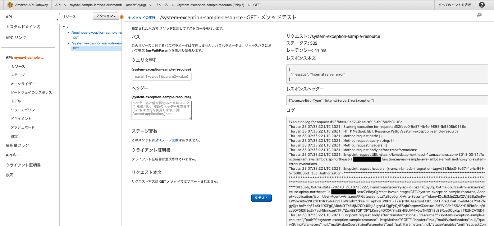
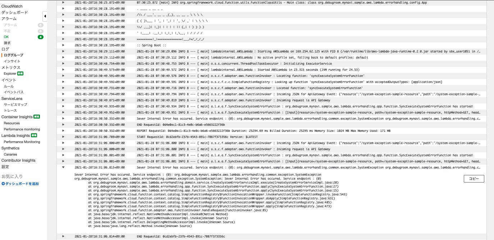
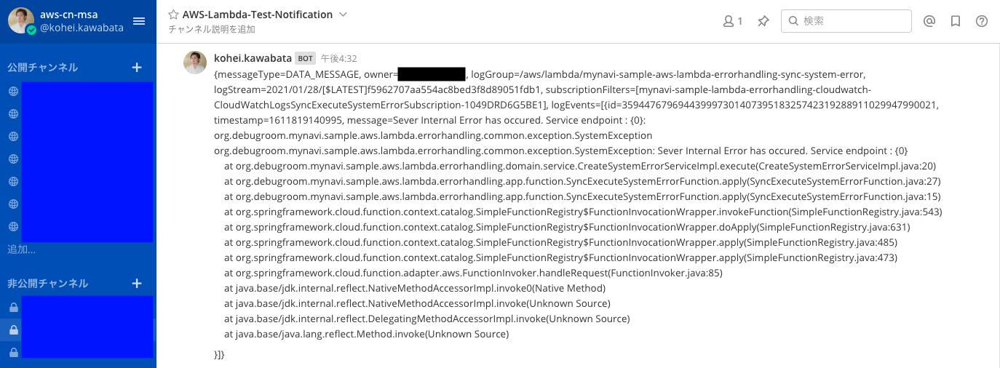

.. include:: ../module.txt

.. _section-cloud-native-lambda-error-handling-5th-label:

【第10回】AWS Lambdaにおけるサーバレスエラーハンドリング(5)
----------------------------------------------------------------------------------------

|br|

本連載では、AWS Lambdaを使ったサーバレス処理でのエラーハンドリング方法を解説しています。
前回は以下の赤字の矢印のスコープにおいて、同期的なLambdaの呼び出しでシステムエラーが発生するケースを想定して、CloudWatch　Logsに出力されたログをイベント契機として実行される、
Spring Cloud Functionを使ったLambdaファンクションを実装を解説しました。今回は実際にCloudWatch Logsに出力されたログをサブスクリプションして、Mattermostへメッセージ通知する環境を構築します。

|br|

.. figure:: img/aws-lambda-errorhandling/errorhandling-sync-system-error.png

|br|

.. _section-cloud-native-lambda-error-handling-lambda-cloudwatch-subscriptions-label:

CloudFormationを使用したLambda環境の構築・CloudWatchサブスリプションの設定
^^^^^^^^^^^^^^^^^^^^^^^^^^^^^^^^^^^^^^^^^^^^^^^^^^^^^^^^^^^^^^^^^^^^^^^^^^^^^^^^^^^^^^^^^^^^^^^^^^^^^^^^^^^^^^^^^^^^^^^^^^^^

|br|

:ref:`section-cloud-native-lambda-error-handling-lambda-cloud-formation-label` の手順で構築したLambdaテンプレートに、前回実装したLambdaファンクションを追加して、スタックを作成し直します。

|br|

.. sourcecode:: bash

   AWSTemplateFormatVersion: '2010-09-09'

   #omit

   Resources:
     LambdaForSyncExecuteSystemErrorFuntion:
       Type: AWS::Lambda::Function
       Properties:
         Code:
           S3Bucket:
             Fn::ImportValue: debugroom-mynavi-sample-lambda-errorhandling-deploy-s3-bucket
           S3Key: spring-cloud-3-1-lambda-function-0.0.1-SNAPSHOT-aws.jar
         Handler: org.springframework.cloud.function.adapter.aws.FunctionInvoker::handleRequest
         FunctionName: mynavi-sample-aws-lambda-errorhandling-sync-system-error
         Environment:
           Variables:
             SPRING_CLOUD_FUNCTION_DEFINITION: syncExecuteSystemErrorFunction
         MemorySize: 1024
         Runtime: java11
         Timeout: 120
         Role: !GetAtt LambdaRole.Arn

     #omit

     LambdaForNotifySystemErrorFuntion:
       Type: AWS::Lambda::Function
       Properties:
         Code:
           S3Bucket:
             Fn::ImportValue: debugroom-mynavi-sample-lambda-errorhandling-deploy-s3-bucket
           S3Key: spring-cloud-3-1-lambda-function-0.0.1-SNAPSHOT-aws.jar
         Handler: org.springframework.cloud.function.adapter.aws.FunctionInvoker::handleRequest
         FunctionName: mynavi-sample-aws-lambda-errorhandling-notify-system-error
         Environment:
           Variables:
             SPRING_CLOUD_FUNCTION_DEFINITION: notifySystemErrorFunction
         MemorySize: 1024
         Runtime: java11
         Timeout: 120
         Role: !GetAtt LambdaRole.Arn

     #omit

   Outputs:
     #omit

     LambdaForSyncExecuteSystemErrorFuntion:
       Description: Sync execute Lambda function for occuring system error function.
       Value: !Ref LambdaForSyncExecuteSystemErrorFuntion
       Export:
         Name: mynavi-sample-lambda-errorhandling-sync-execute-system-error-function-name

     LambdaForSyncExecuteSystemErrorFuntionArn:
       Description: Sync execute Lambda function for occuring system error function.
       Value: !GetAtt LambdaForSyncExecuteSystemErrorFuntion.Arn
       Export:
         Name: mynavi-sample-lambda-errorhandling-sync-execute-system-error-function-arn

     #omit

     LambdaForNotifySystemErrorFuntion:
       Description: Lambda function for notifying system error function.
       Value: !Ref LambdaForNotifySystemErrorFuntion
       Export:
         Name: mynavi-sample-lambda-errorhandling-notify-system-error-function-name

     LambdaForNotifiySystemErrorFuntionArn:
       Description: Lambda function for notifying system error function.
       Value: !GetAtt LambdaForNotifySystemErrorFuntion.Arn
       Export:
         Name: mynavi-sample-lambda-errorhandling-notify-system-error-function-arn

|br|

同様に、API Gatewayのテンプレートも、システムエラーが発生するファンクション向けにメソッドやリソースを定義して構築し直します。

|br|

.. sourcecode:: bash

   #omit

   ApiGatewaySystemExceptionResource:
     Type: "AWS::ApiGateway::Resource"
     Properties:
       RestApiId:
         Ref: ApiGatewayRestApi
       ParentId:
         Fn::GetAtt:
           - ApiGatewayRestApi
           - RootResourceId
       PathPart: "system-exception-sample-resource"

   #omit

   ApiGatewaySystemExceptionMethod:
     Type: "AWS::ApiGateway::Method"
     DependsOn: ApiGatewayModel
     Properties:
       RestApiId:
         Ref: ApiGatewayRestApi
       ResourceId:
         Ref: ApiGatewaySystemExceptionResource
       HttpMethod: "GET"
       AuthorizationType: "NONE"
       Integration:
         Type: "AWS_PROXY"
         Uri:
           Fn::Join:
             - ""
             - - "arn:aws:apigateway"
               - ":"
               - Ref: AWS::Region
               - ":"
               - "lambda:path/2015-03-31/functions/"
               - Fn::ImportValue: mynavi-sample-lambda-errorhandling-sync-execute-system-error-function-arn
               - "/invocations"
         IntegrationHttpMethod: "POST"
         PassthroughBehavior: WHEN_NO_MATCH
       MethodResponses:
         - StatusCode: 200
           ResponseModels:
             application/json: SampleSchema
         - StatusCode: 400
           ResponseModels:
             application/json: Error

   SystemErrorLambdaPermission:
     Type: "AWS::Lambda::Permission"
     Properties:
       FunctionName:
         Fn::ImportValue: mynavi-sample-lambda-errorhandling-sync-execute-system-error-function-name
       Action: "lambda:InvokeFunction"
       Principal: "apigateway.amazonaws.com"

|br|

続いて、CloudWatchにサブスクリプションフィルタおよびロググループ、実行権限に関するテンプレートを実装します。

|br|

.. sourcecode:: bash

   AWSTemplateFormatVersion: '2010-09-09'

   #omit

   Resources:
     CloudWatchLogsSyncExecuteSystemErrorSubscription:  #(1)
       Type: AWS::Logs::SubscriptionFilter
       Properties:
         LogGroupName: !Ref LogsGroupSyncExecuteSystemError
         FilterPattern: "Exception"                     #(2)
         DestinationArn:
           Fn::ImportValue: mynavi-sample-lambda-errorhandling-notify-system-error-function-arn #(3)

     LogsGroupSyncExecuteSystemError:
       Type: AWS::Logs::LogGroup
       Properties:
         LogGroupName:
           Fn::Join:
             - ""
             - - "/aws/lambda/"
               - Fn::ImportValue: mynavi-sample-lambda-errorhandling-sync-execute-system-error-function-name #(4)

     NotifyErrorLambdaPermission: #(5)
       Type: AWS::Lambda::Permission
       Properties:
         FunctionName:
           Fn::ImportValue: mynavi-sample-lambda-errorhandling-notify-system-error-function-name
         Action: lambda:InvokeFunction
         Principal: !Join [ ".", [ "logs", !Ref "AWS::Region", "amazonaws.com" ] ]
         SourceAccount: !Ref AWS::AccountId

|br|

.. list-table:: ファンクションクラスの実装コードの詳細
   :widths: 1, 19

   * - 項番
     - 説明

   * - (1)
     - CloudWatch Logsで特定のログをサブスクリプションする設定を行います。各プロパティの詳細は `Type: AWS::Logs::SubscriptionFilter <Type: AWS::Logs::SubscriptionFilter>`_ を参照してください。

   * - (2)
     - ログでピックアップ対象とする文字列パターンを指定します。前節の実際の実装ではSystemExceptionをスローしていますが、実際は様々な想定外のExceptionクラスがスローされることになるので、「Exception」をパターン文字列として設定します。

   * - (3)
     - 実行するLambdaファンクションのARNをクロススタックリファレンスで参照します。

   * - (4)
     - 監視対象とするロググループを指定します。前節で作成したシステム例外を発生するLambdaファンクションのログが出力されるロググループを指定しています。

   * - (5)
     - ロググループにLambdaの実行権限を付与します。

|br|

これらのテンプレートを実行し、環境を構築します。また、本連載では説明は省略しますが、 `Mattermost環境の構築 <https://docs.mattermost.com/guides/administrator.html#installing-mattermost>`_ や、`Webhook <https://docs.mattermost.com/developer/webhooks-incoming.html>`_ の設定を行い、
URLをSystemsManager ParameterStoreに設定しておきます。なお、SystemsManager ParameterStoreの設定に関しては、AWSで実践! 基盤構築・デプロイ自動化で解説した  `「第29回」 <https://news.mynavi.jp/itsearch/article/devsoft/4869>`_ などを適宜参考にしてください。

必要な環境構築・設定後、:ref:`section-cloud-native-lambda-error-handling-apigateway-cloud-formation-label` で実行した要領と同様、API Gatewayからシステムエラーが発生するファンクションを実行すると以下の通り、API Gatewayからインターナルサーバエラーが返却されます。

|br|

|br|

CloudWatch Logsには発生したエラーのスタックトレースが記録されます。

|br|

|br|

CloudWatch Logsのサブスクリプションが別途Lambdaファンクションを呼び出し、Mattermost側へエラー内容を通知します。システム管理者や運用担当者はエラーの内容を確認して、AWSの外で優先度を設定し対応することができます。

|br|

|br|

|br|

今回は、API GatewayとLambdaを使用した同期呼び出しで、システムエラーが発生した際に、CloudWatchに出力されたエラーログを契機として、システム管理者へ通知を行うLambdaファンクション実装を含めて解説しました。
次回は、S3などのマネージドサービスから非同期に実行されるLambdaファンクション内で発生したエラーのハンドリングについて解説を進めていきます。

|br|

著者紹介
^^^^^^^^^^^^^^^^^^^^^^^^^^^^^^^^^^^^^^^^^^^^^^^^^^^^^^^^^^^^^^^^^^^^^^^^^^^^^^^^^^^^^^^^^^^^^^^^^^^^^^^^^

川畑 光平(KAWABATA Kohei) - NTTデータ エグゼクティブ ITスペシャリスト ソフトウェアアーキテクト・デジタルテクノロジーストラテジスト(クラウド)

.. figure:: img/aws-s3-and-lambda/aws_361383_075.jpeg

金融機関システム業務アプリケーション開発・システム基盤担当、ソフトウェア開発自動化関連の研究開発を経て、デジタル技術関連の研究開発・推進に従事。

Red Hat Certified Engineer、Pivotal Certified Spring Professional、AWS Certified Solutions Architect Professional等の資格を持ち、アプリケーション基盤・クラウドなど様々な開発プロジェクト支援にも携わる。

`AWS Top Engineers & Ambassadors <https://aws.amazon.com/jp/partners/ambassadors/?cards-body.sort-by=item.additionalFields.ambassadorName&cards-body.sort-order=asc&cards-body.q=kawabata&cards-body.q_operator=AND>`_ 選出。

本連載記事の内容に対するご意見・ご質問は `Facebook <https://www.facebook.com/kohei.kawabata.5>`_ まで。
