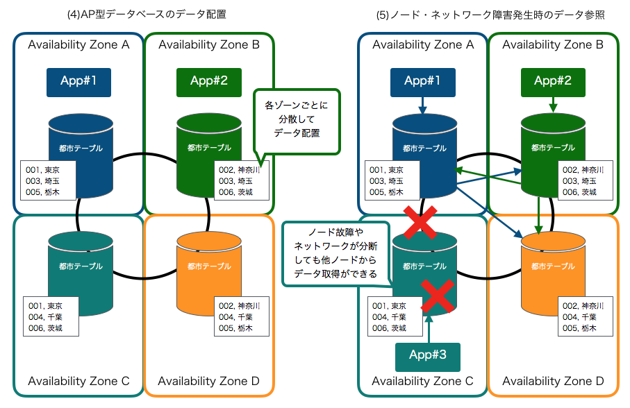

.. include:: ../module.txt

.. _section-cloud-native-nosql-1st-1-label:

【第14回】NoSQL(1)-基礎-CAP定理を元にしたデータベースの分類とデータ特性
----------------------------------------------------------------------------------------

|br|

クラウドの普及に伴い、ビッグデータやキーバリュー型データの格納など、ますます活用の機会が広がりつつあるNoSQLデータベース。
第3回は代表的なNoSQLプロダクトであるAmazon DynamoDBやApache Cassandra、Amazon ElastiCacheへアクセスするSpringアプリケーションを開発する方法について、わかりやすく解説します。

本連載では、以下のステップで解説を進めていきます。

|br|

#. NoSQLデータベースの特徴とデータ特性

   * **CAP定理を元にしたデータベースの分類とデータ特性**
   * AP型データベースAmazon DynamoDBとApache Cassandraの特徴

#. Amazon DynamoDBへアクセスするSpringアプリケーション

   * Amazon DynamoDBの概要及び構築と認証情報の作成
   * Spring Data DynamoDBを用いたアプリケーション(1)
   * Spring Data DynamoDBを用いたアプリケーション(2)

#. Apache CassandraへアクセスするSpringアプリケーション

   * Apache Cassandraの概要及びローカル環境構築
   * Spring Data Cassandraを用いたアプリケーション(1)
   * Spring Data Cassandraを用いたアプリケーション(2)

#. Amazon ElastiCacheへアクセスするSpringアプリケーション

   * AmazonElasiCacheの概要及びローカル環境でのRedisServer構築
   * Spring SessionとSpring Data Redisを用いたアプリケーション(1)
   * Spring SessionとSpring Data Redisを用いたアプリケーション(2)
   * Amazon ElastiCacheの設定
   * セッション共有するECSアプリケーションの構築(1)
   * セッション共有するECSアプリケーションの構築(2)

|br|

なお、本連載は以下の前提知識がある開発者を想定しています。

|br|

.. list-table::
   :widths: 3, 7

   * - 対象読者
     - 前提知識

   * - エンタープライズ開発者
     - Java言語及びSpringFrameworkを使った開発に従事したことがある経験者。経験がなければ、|br|
       `こちらのチュートリアル <http://terasolunaorg.github.io/guideline/5.4.1.RELEASE/ja/Tutorial/index.html>`_ を実施することを推奨します。TERASOLUNAはSpringのベストプラクティスをまとめた開発方法論で、このチュートリアルでは、JavaやSpring Frameworkを使った開発に必要な最低限の知識を得ることができます。

   * -
     - GitHubなどのバージョン管理ツールやApache Mavenなどのライブラリ管理ツールを使った開発に従事したことがある経験者。

   * - AWS開発経験者
     - AWSアカウントをもち、コンソール上で各サービスを実行したことがある経験者

   * - コンテナ及びUnix・Linux経験者
     - Dockerなどのコンテナ技術を使用した経験がある、またはPOSIXコマンドによるUNIX、LINUX系OSを操作したことがある経験者。

|br|

また、動作環境は以下のバージョンで実施しています。

|br|

.. list-table::
   :widths: 5, 5

   * - 動作対象
     - バージョン

   * - Java
     - 1.8

   * - Spring Boot
     - 2.1.2.RELEASE

   * - Spring Data DynamoDB
     - 5.0.1

   * - Spring Data Cassandra
     - 2.1.2.RELEASE

   * - Spring Session
     - 2.1.4.RELEASE

   * - Spring Data Redis
     - 2.1.5.RELEASE

   * - Docker
     - 18.09.2, build 6247962

   * - CentOS
     - 7.6.1810

   * - Apache Cassandra
     - 3.0.6

   * - Redis(Local)
     - 3.2.12

   * - ElastiCache(Redis)
     - 5.0.3

|br|

将来的には、AWSコンソール上の画面イメージや操作、バージョンアップによりJavaのソースコード内で使用するクラスが異なる可能性があります。

|br|

.. _section-cloud-native-nosql-overview-label:

NoSQLデータベースの特徴とデータ特性
^^^^^^^^^^^^^^^^^^^^^^^^^^^^^^^^^^^^^^^^^^^^^^^^^^^^^^^^^^^^^^^^^^^^^^^^^^^^^^^^^^^^^^^^^^^^^^^^^^^^^^^^^

|br|

.. _section-cloud-native-nosql-category-by-cap-label:

CAP定理を基づくデータベースの分類
^^^^^^^^^^^^^^^^^^^^^^^^^^^^^^^^^^^^^^^^^^^^^^^^^^^^^^^^^^^^^^^^^^^^^^^^^^^^^^^^^^^^^^^^^^^^^^^^^^^^^^^^^

|br|

リレーショナルデータベース(RDB)と対比して、NoSQLデータベースでは、キーバリュー型やドキュメント指向型、カラム指向型、グラフ指向型など、機能や特徴によって幾つかの分類方法がありますが、
その中のひとつに分散データベースという観点から分類する方法があります。この分類の基礎の考え方になっているのが、ブリューワのCAP定理と呼ばれる、広域に分散した環境下におけるデータベース・サービスに関する理論です。
後々に、保存に適したデータ特性やデータモデルの検討にも関係してくるので、ここで基礎的な内容を押さえておきましょう。

|br|

CAP定理は、限定的な条件が前提にはなるのですが、「広域な環境で分散してデータを保存する場合に、以下の３つの特性のうち、２つまでしか同時に満たすことができない」という定理です。

.. list-table:: CAP定理における３つの特性
   :widths: 2, 2, 6

   * - 特性
     -
     - 概要

   * - 一貫性
     - Consistency
     - あるデータに対する読み取りは、どのノードにおいても、必ずそのデータの最も新しい書き込みの結果を返すか、エラーを返す

   * - 可用性
     - Availability
     - システムを構成するノードに障害が発生していたとしても、常に読み込みと書き込みが可能である。

   * - ネットワーク分断耐性
     - Partition Tolerance
     - システムを構成するノード間の通信が一時的に分断されても、機能が継続される。

|br|

.. note:: CAP定理は、定理として成立するには狭義の条件を前提として証明されたものであるため、厳密に3つのうち常に２つが満たされる訳ではなく、原則論として、２つの特性を重視すると残りの1つが失われると捉えた方がよいです。

|br|

この観点からデータベース全体を分類すると、RDBは一貫性(Consistency)と可用性(Availability)を重視したデータベースです(CA型)。

定理を説明する単純な例として、広域(複数のアベイラビリティゾーン)を跨いで、都市名データをキーとともに都市テーブルへ保存することを考えます。
こうした分散された環境下では、RDBは、以下の様ないずれかの方法でデータベース間の同期をとりながら更新するケースが一般的です。

|br|

#. DBMSの機能を使い、Master/Slave構成でデータベースを更新
#. X/Openに対応した分散トランザクションマネージャを使い、２フェーズコミットで双方のデータベースを更新

|br|

上記では単純化のために2つのアベイラビリティゾーンに限定してますが、複数のゾーンにあるデータは、いずれも常に最新のデータを返し(Consistencyが保証される)、複数同時に壊れるという稀なケースを除いて、片方のノードが障害発生しても可用性(Availability)も保証されます。
ただし、この構成はネットワークが分断されると、一貫性・可用性共に崩れてしまいます。実際にはネットワークも２重化されていたり障害になることは稀ですが、ゾーン間の通信が使用不能になると、CA型データベースとして機能不全に陥ります。
つまり、一貫性・可用性を保ちつつ、同時にネットワーク分断耐性を満たすことはできません。

|br|

他方、可用性(Availability)を下げることをトレードオフとして、一貫性(Consistency)とネットワーク分断耐性(Partition Tolerance)を高める手法もあります(CP型)。
データを複数のアベイラビリティゾーン(の別ノード)に分けて保存する方式で、一般的にこの方法はシャーディング(Sharding)と呼ばれます。シャーディングは、どちらかといえば性能向上を目的とした負荷分散のためにRDBなどでもよく利用される手法ですが、
特定のデータノードが一時的に分断されても一貫性(Consistency)は保持されますが、ノードの数が増えることで故障確率が上昇し、読み込みと書き込みが制限され、可用性(Availability)が損なわれる確率が上がります。
CP型の特徴であるシャーディングを機能として有するデータベースとしては、Apache HBaseやMongoDB、Redisなどが有名なプロダクトです。

.. figure:: img/aws-nosql/cp-database.png

|br|

最後に、一貫性(Consistency)を下げることをトレードオフとして、高い可用性(Availability)とネットワーク分断耐性(Partition Tolerance)を持つデータベース(AP型)の代表例が、Amazon DynamoDB及びApache Cassandraです。
AP型データベースでは、以下のイメージの様に、複数のアベイラビリティゾーンにデータベースを配置し、１つのノードやネットワークに障害が起きてもデータが損なうことがないよう、各ノードにデータを分散して配置します。
大きな特徴として単一障害点がなく、どこのノードからでもデータ更新が可能であり、スケーラビリティにも優れた、まさにクラウドらしい分散型構成ですが
ノードの故障時や通信のエラーにより、複数のノード間で整合性のとれない(一貫性を損なう)ケースが発生する様になります。これらの問題を解決する手段として、読み込み時に最新のデータで古いノードのデータを更新するReadRepair機能や、
Quorumをベースとした結果整合性(雑に言えば、不整合が出た場合に、なるべく多くの一致したデータを判定する多数決に似た手法)により一貫性を担保しています。

|br|

このようにCAPによる特性に応じて、各データベースに適したユースケースやデータ特性をまとめると以下の様になります。

.. figure:: img/aws-nosql/database-cap-category.png

|br|

.. list-table:: 各データベースに適したユースケースやデータ特性
   :widths: 2, 5, 13

   * - タイプ
     - ユースケース・データ特性
     - 理由

   * - CA型
     - 複雑な検索条件
     - 集合関数や射影・結合、副問い合わせなど様々なオプションがあるケース。

   * -
     - 厳密なトランザクション・整合性
     - 多額の決済データや人命に関わるようなデータなど、厳密な一貫性が必要なケース。

   * -
     - 高負荷なアップデート処理が多い
     - 正規化を前提としたデータ構造により、アップデートの処理コストを最小限に抑えたいケース。

   * - CP型
     - キャッシュ
     - 一部が利用できなくても大きな問題はなく、かつスケーラビリティが図れるデータを利用して、高速化を測りたいケース。

   * -
     - 高速バッチ処理
     - OLAP(online analytical processing)、ETL(Extract/Transform/Load)、BI(Business Intelligence)等、シャーディングによる高速処理が見込めるケース。

   * - AP型
     - スケーラブルアプリケーション
     - コネクションプール等や単一障害点がボトルネックとなりがちな、多数のアプリケーションからデータアクセスされる場合や、需要の予測が難しく後からスケーラビリティを図りたいケース。

   * -
     - マルチリージョンデータベース
     - グローバルな複数のデータセンターにまたがってデータを共通化・レプリケートしたいケース。

   * -
     - 大量の書き込み
     - IoTセンサーデータなど、リードレプリカでは対応が難しい書き込みが多いケース。

|br|

次回は、よりクラウドならでは特性を備えたAP型データベースをもう少し深掘りし、DynamoDBやApache Cassandraの特徴や違いについて触れてみます。

|br|

著者紹介
^^^^^^^^^^^^^^^^^^^^^^^^^^^^^^^^^^^^^^^^^^^^^^^^^^^^^^^^^^^^^^^^^^^^^^^^^^^^^^^^^^^^^^^^^^^^^^^^^^^^^^^^^

川畑 光平(KAWABATA Kohei)

.. figure:: img/aws-lambda-and-api-gateway/pic_image01.jpg

某システムインテグレータにて、金融機関システム業務アプリケーション開発・システム基盤担当を経て、現在はソフトウェア開発自動化関連の研究開発・推進に従事。

Red Hat Certified Engineer、Pivotal Certified Spring Professional、AWS Certified Solutions Architect Professional等の資格を持ち、アプリケーション基盤・クラウドなど様々な開発プロジェクト支援にも携わる。

本連載記事の内容に対するご意見・ご質問は `Facebook <https://www.facebook.com/kohei.kawabata.5>`_ まで。
