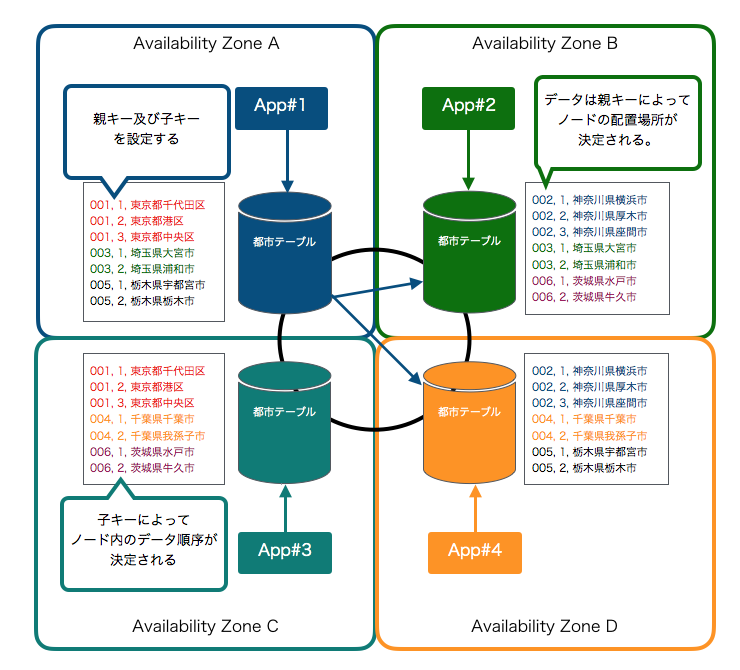

.. include:: ../module.txt

.. _section-cloud-native-nosql-label-1-2:

AWSで作るクラウドネイティブアプリケーションの基本
========================================================================================

.. _section-cloud-native-nosql-1st-2-label:

第3回 AWS上に構築するNoSQLアプリケーション(1)-2
----------------------------------------------------------------------------------------

|br|

.. _section-cloud-native-nosql-overview-2-label:

NoSQLデータベースの特徴とデータ特性
^^^^^^^^^^^^^^^^^^^^^^^^^^^^^^^^^^^^^^^^^^^^^^^^^^^^^^^^^^^^^^^^^^^^^^^^^^^^^^^^^^^^^^^^^^^^^^^^^^^^^^^^^

|br|

クラウド時代が到来し、ビッグデータやキーバリュー型データなどで、ますます活用の機会が広がりつつあるNoSQLデータベース。第3回は代表的なNoSQLプロダクトであるAmazon DynamoDBやApache Cassandra、
Amazon ElastiCacheへアクセスするSpringアプリケーションを構築する方法を説明します。本連載では、以下の様なステップで進めていきます。

|br|

#. NoSQLデータベースの特徴とデータ特性

   * CAP定理を元にしたデータベースの分類とデータ特性
   * AP型データベースAmazon DynamoDBとApache Cassandraの特徴                          …◯

#. Amazon DynamoDBへアクセスするSpringアプリケーション

   * Amazon DynamoDBの概要及び構築と認証情報の設定
   * Spring Data DynamoDBを用いたアプリケーション(1)
   * Spring Data DynamoDBを用いたアプリケーション(2)

#. Apache CassandraへアクセスするSpringアプリケーション

   * ローカル環境におけるApache Cassandraの構築
   * Spring Data Cassandraを用いたアプリケーション(1)
   * Spring Data Cassandraを用いたアプリケーション(2)

#. Amazon ElastiCacheへアクセスするSpringアプリケーション

   * ローカル環境におけるRedisの構築
   * Spring SessionとSpring Data Redisを用いたアプリケーション(1)
   * Spring SessionとSpring Data Redisを用いたアプリケーション(2)
   * Amazon ElastiCacheの設定
   * セッション共有するECSアプリケーションの構築(1)
   * セッション共有するECSアプリケーションの構築(2)

|br|

前回 :ref:`section-cloud-native-nosql-category-by-cap-label` では、リレーショナルデータベースやNoSQLデータベースをCAP定理を元に分類し、その特性に応じて適したユースケースやデータ特性を整理しました。
今回はその分類のうち、可用性(Availability)とネットワーク分断耐性(Partition Tolerance)を重視したAP型データベースの代表例であるAmazon DynamoDB及び、
Apache Cassandraの特徴を比較しながら深掘りします。なお、Cassandraは、DynamoDBの分散モデルを参考にFacebook社が開発したオープンソースのNoSQLデータベースです。
Amazon DynamoDBはその実装が厳密に公開されていないため、同様のアーキテクチャをもつApache Cassandraを合わせて比較することで理解を深める意図があります。

|br|

.. _section-cloud-native-nosql-feature-label:

AP型データベースAmazon DynamoDBとApache Cassandraの特徴
"""""""""""""""""""""""""""""""""""""""""""""""""""""""""""""""""""""""""""""""""""""""""

|br|

前回も触れた通り、AP型のNoSQLデータベースは一貫性(Consistency)の低下をトレードオフとして、高い可用性(Availability)とネットワーク分断耐性(Partition Tolerance)に重点を置いています。
以下のイメージの様に、複数のアベイラビリティゾーンにデータベースを配置し、１つのノードやネットワークに障害が起きてもデータが損なうことがないよう、各ノードにデータを分散して配置します。
大きな特徴として単一障害点がなく、どこのノードからでもデータ更新が可能であり、ノードも任意に追加・設定できるスケーラビリティにも優れた分散型構成ですが
ノードの故障時や通信のエラーにより、複数のノード間で整合性のとれない(一貫性を損なう)ケースが発生する様になります。多くは読み込み時に最新のデータで古いノードのデータを更新するReadRepair機能や、
Quorumをベースとした結果整合性(雑に言えば不整合が出た場合に、なるべく多くの一致したデータを判定する多数決に似ている手法)により一貫性を担保しています。

.. figure:: img/aws-nosql/ap-database.png
   :scale: 100%

|br|

Apache Cassandraは、Amazon DynamoDBのデータベース分散モデルを参考にデザインされています。当然そのデータ分散配置に関する特徴を継承していますが、
まず、両者で共通して押さえておかなれければならないものの１つとして、各ノードに配置されるデータとキーの考え方についてです。
Amazon DynamoDB、Apache CassandraはConsistent Hashing方式により、各ノードと配置されるデータを決定していますが、大まかなイメージを掴むために、上記の図の「都市テーブル」に市区情報を加えて構成される形に変更してみましょう。
都道府県と市・区は1：Nの関係になりますが、都道府県を区別するキーを親キー、市や区を区別するキーを子キーとします。DynamoDBとCassandraには以下の様な名称で対応づけられるキーがあります。

|br|

.. list-table:: Amazon DynamoDBとApache Cassandraの親子キーの対応関係
   :widths: 3, 3, 3

   * - データベース
     - 親キー
     - 子キー

   * - Amazon DynamoDB
     - パーティションキー(Partition Key)
     - ソートキー(Sort Key)

   * - Apache Cassandra
     - パーティションカラム(Partition Column)
     - クラスタカラム(Cluster Column)

|br|

.. note:: Amazon DynamoDBではパーティションキーは以前の名称としてはハッシュキー(Hash Key)、ソートキーはレンジキー(Range Key)という名称で使われていました。また、現在はパーティションキーとソートキーを合わせてプライマリキー(Primary Key)と呼んでいます。

|br|

なお、Amazon DynamoDBとApache Cassandraでは分散データ方式として、以下の様な違いがあります。

.. list-table:: Amazon DynamoDBとApache Cassandraの違い
   :widths: 3, 3, 3

   * - 特性
     - Amazon DynamoDB
     - Apache Cassandra

   * - 配置するノード数上限
     - AWSマネージド構築
     - 上限なしで任意に設定

   * - レプリケーションファクタ(ノードに配置するデータのレプリケーション数)
     - 同一リージョンで３つのレプリケーション(DynamoDBはリージョンごとのサービス)
     - テーブルごとに任意設定が可能。

   * - 結果整合性のオプション
     - 読込は結果整合性か強い整合性かを選択。|br| 【弱い読込み結果整合性】2/3以上の読込で結果一致した場合正常応答 |br| 【書込み】2/3以上の書込が成功した場合正常応答 |br| 【強い読込み整合性】全てのReadRepairが完了している状態で、結果を応答
     - ユーザ側で設定可能な読込・書込一貫性 |br| ※読み込むレプリカ数と書き込むレプリカ数を指定できる。指定に達しない場合エラー

どちらのデータベースにおいても、以下の様なルールを押さえておく必要があります。

* 親キーで配置されるノードが決定する。
* ノード内のデータ順序を決定する子キーを任意に設定できる。
* 親子関係を有しないデータは親キーでデータを一意に特定できるようにしておく必要がある。
* 子キーにはインデックスを設定できる

|br|

また、上記のような分散DBアーキテクチャを踏まえると、当然リレーショナルデータベースではできていた以下の様な当たり前のことができなくなります。

|br|

.. list-table:: RDBとの機能的な差・制約による違いとその理由
   :widths: 3, 7

   * - 制約
     - 理由

   * - テーブル間結合ができない
     - データがテーブルごとに分散して配置されているので、テーブル同士を結合して、データを射影するといった操作はできない

   * - 外部キーがない
     - プロダクトの性質上、キーはプライマリーキー(親キー)とセカンダリキー(子キー)に限定される

   * - 条件指定でプライマリキー以外使用できない
     - データが分散して配置されているので、プライマリキー以外で検索をかけることができない |br| ※対処として、インデックスを作成する、もしくは性能上問題出る可能性はあるが、セカンダリキーは指定できる。

   * - 副問合せができない
     - データが分載して配置されているので、検索結果のデータを条件とすることはできない

   * - GROUP BY等集約関数が存在しない
     - データが分散して配置されているので、集約に必要なデータが検索時に足りない

   * - OR、NOTの演算子はなくANDのみ
     - プロダクトの性質上、サポートしていない

|br|

上記の制約はプロダクトによって差がありますが、基本リレーショナルデータベースで実現できる機能を使いたい場合は、リレーショナルデータベースを導入すべきであり、
NoSQLデータベースは、その特性を生かしたユースケースに対し導入を検討すべきです。ただし、AP型NoSQLデータベースを導入する場合でも、上記の様な色々な機能要件を求められるケースもあるため、
アプリケーションの設計時に上記のような制約をしっかり意識しておき、データベースの機能に委ねるべきか、不足する機能に代替する処理をアプリケーションで実装すべきかを判断できる様にしておきましょう。

次回以降は、Amazon DynamoDBのより詳細な特徴を整理し、実際にDynamoDBを構築していきます。

|br|

著者紹介
------------------------------------------------------------------

川畑 光平(KAWABATA Kohei)

.. figure:: img/aws-lambda-and-api-gateway/pic_image01.jpg
   :scale: 100%

某システムインテグレータにて、金融機関システム業務アプリケーション開発・システム基盤担当を経て、現在はソフトウェア開発自動化関連の研究開発・推進に従事。

Red Hat Certified Engineer、Pivotal Certified Spring Professional、AWS Certified Solutions Architect Professional等の資格を持ち、アプリケーション基盤・クラウドなど様々な開発プロジェクト支援にも携わる。

本連載記事の内容に対するご意見・ご質問は `Facebook <https://www.facebook.com/kohei.kawabata.5>`_ まで。
