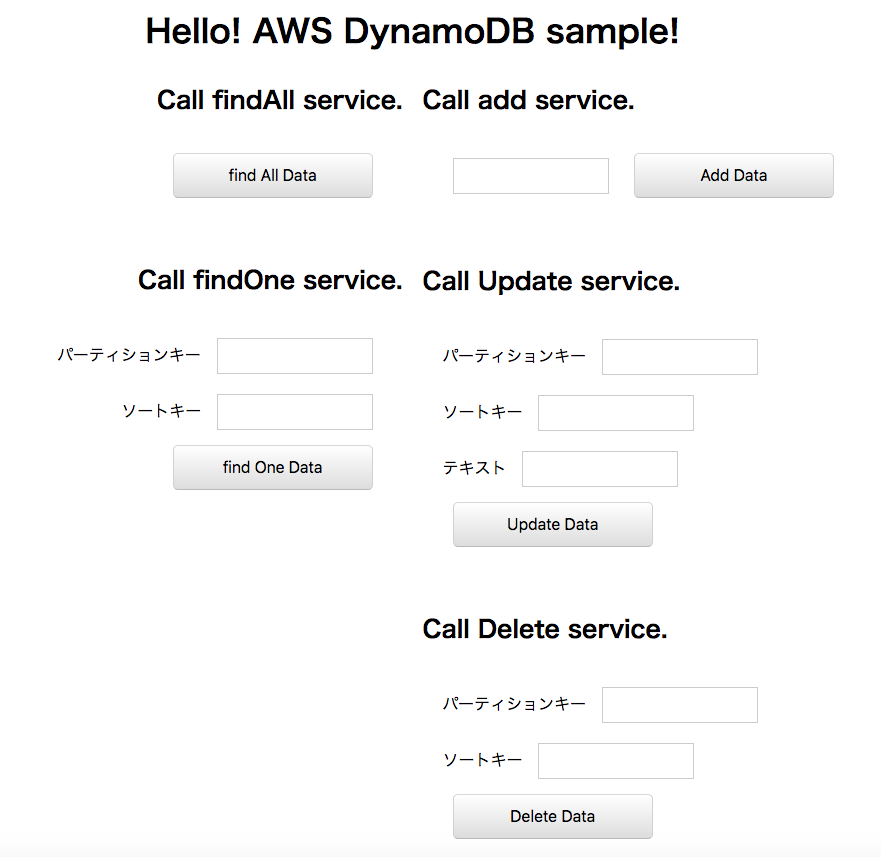
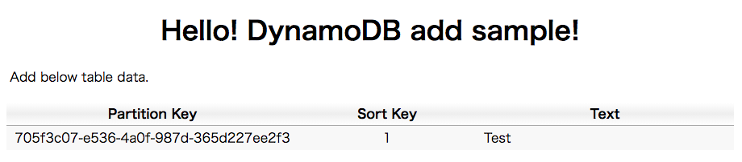
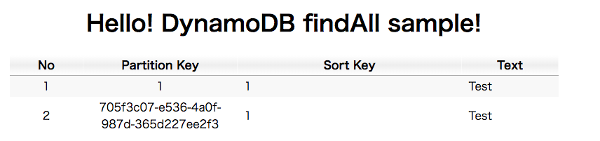
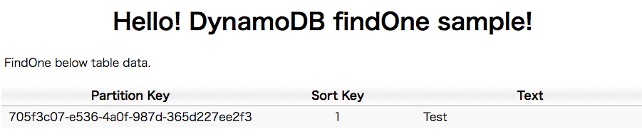
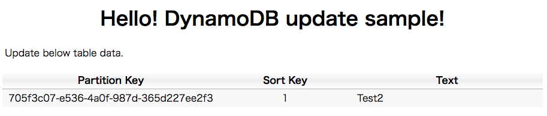
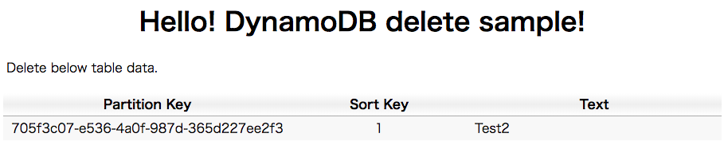

.. include:: ../module.txt

.. _section-cloud-native-nosql-label-2-3:

AWSで作るクラウドネイティブアプリケーションの基本
========================================================================================

.. _section-cloud-native-nosql-2nd-3-label:

第3回 AWS上に構築するNoSQLアプリケーション(2)-3
----------------------------------------------------------------------------------------

|br|

.. _section-cloud-native-nosql-spring-applicaiton-2-3-label:

Amazon DynamoDBへアクセスするSpringアプリケーション
^^^^^^^^^^^^^^^^^^^^^^^^^^^^^^^^^^^^^^^^^^^^^^^^^^^^^^^^^^^^^^^^^^^^^^^^^^^^^^^^^^^^^^^^^^^^^^^^^^^^^^^^^

|br|

クラウド時代が到来し、ビッグデータやキーバリュー型データなどで、ますます活用の機会が広がりつつあるNoSQLデータベース。第3回は代表的なNoSQLプロダクトであるAmazon DynamoDBやApache Cassandra、
Amazon ElastiCacheへアクセスするSpringアプリケーションを構築する方法を説明します。本連載では、以下の様なステップで進めていきます。

|br|

#. NoSQLデータベースの特徴とデータ特性

   * CAP定理を元にしたデータベースの分類とデータ特性
   * AP型データベースAmazon DynamoDBとApache Cassandraの特徴

#. Amazon DynamoDBへアクセスするSpringアプリケーション

   * Amazon DynamoDBの概要及び構築と認証情報の設定
   * Spring Data DynamoDBを用いたアプリケーション(1)
   * Spring Data DynamoDBを用いたアプリケーション(2)

#. Apache CassandraへアクセスするSpringアプリケーション

   * ローカル環境におけるApache Cassandraの構築
   * Spring Data Cassandraを用いたアプリケーション(1)
   * Spring Data Cassandraを用いたアプリケーション(2)

#. Amazon ElastiCacheへアクセスするSpringアプリケーション

   * ローカル環境におけるRedisの構築
   * Spring SessionとSpring Cloud Data Redisを用いたアプリケーション(1)
   * Spring SessionとSpring Cloud Data Redisを用いたアプリケーション(2)
   * Amazon ElastiCacheの設定
   * セッション共有するECSアプリケーションの構築

|br|

前回、:ref:`section-cloud-native-spring-data-dynamodb-implementation-1-label` に引き続き、 今回はSpring Data DynamoDBを使ってデータベースアクセスするアプリケーションを実装していていきます。

|br|

Spring Data DynamoDBを使ったアプリケーション実装(2)
"""""""""""""""""""""""""""""""""""""""""""""""""""""""""""""""""""""""""""""""""""""""""

|br|

アプリケーションコンポーネントの実装に移ります。画面から受け取るリクエストパラメータコンポーネントを以下の様に作成しています。

|br|

リクエストパラメータオブジェクト

.. sourcecode:: java

   package org.debugroom.mynavi.sample.spring.data.dynamodb.app.model;

   @AllArgsConstructor
   @NoArgsConstructor
   @Builder
   @Data
   public class SampleModel implements Serializable {

       private String samplePartitionKey;
       private String sampleSortKey;
       private String sampleText;

  }

|br|

Controllerでは、以下5種類のリクエストを受け取り、ロジックを実行して結果をテンプレートに渡す処理を実装します。

* データを全件取得するServiceを実行し、実行結果をfindAll.htmlのテンプレートへ渡す処理。
* 指定したパーティションキー・ソートキーをもつデータを取得するServiceを実行し、実行結果をfindOne.htmlのテンプレートへ渡す処理
* データ追加するServiceを実行し、実行結果をadd.htmlのテンプレートに渡す処理。
* 指定したパーティションキー・ソートキーのデータを更新するServiceを実行し、実行結果update.htmlのテンプレートへ渡す処理
* 指定したパーティションキー・ソートキーのデータを削除するServiceを実行し、実行結果delete.htmlのテンプレートへ渡す処理

|br|

.. sourcecode:: java

   package org.debugroom.mynavi.sample.spring.data.dynamodb.app.web;

   import org.springframework.beans.factory.annotation.Autowired;
   import org.springframework.stereotype.Controller;
   import org.springframework.ui.Model;
   import org.springframework.web.bind.annotation.RequestMapping;
   import org.springframework.web.bind.annotation.RequestMethod;

   @Controller
   public class SampleController {

       @Autowired
       SampleService sampleService;

       @RequestMapping(method = RequestMethod.GET, value="findAll")
       public String findAll(Model model){
           model.addAttribute("mynaviSampleTables", sampleService.getMynaviSampleTables());
           return "findAll";
       }

       @RequestMapping(method = RequestMethod.GET, value="findOne")
       public String findOne(SampleModel sampleModel, Model model){
           model.addAttribute("mynaviSampleTable", sampleService.getMynaviSampleTable(
                   SampleModelMapper.mapToMynaviSampleTableKey(sampleModel)));
           return "findOne";
       }

       @RequestMapping(method = RequestMethod.POST,  value="add")
       public String add(SampleModel sampleModel, Model model){
           model.addAttribute("mynaviSampleTable",
                   sampleService.addMynaviSampleTable(SampleModelMapper.map(sampleModel)));
           return "add";
       }

       @RequestMapping(method = RequestMethod.POST, value = "update")
       public String update(SampleModel sampleModel, Model model){
           model.addAttribute("mynaviSampleTable",
                   sampleService.updateMynaviSampleTable(SampleModelMapper.map(sampleModel)));
           return "update";
       }

       @RequestMapping(method = RequestMethod.POST, value = "delete")
       public String delete(SampleModel sampleModel, Model model){
           model.addAttribute("mynaviSampleTable",
                   sampleService.deleteMynaviSampleTable(
                           SampleModelMapper.mapToMynaviSampleTableKey(sampleModel)));
           return "delete";
       }

   }

|br|

また、Serviceを呼び出す際にリクエストパラメータオブジェクトをServiceのインプットオブジェクトとなっているDynamoDBのテーブルクラスやプライマリキークラスへ変換するマッパーをインターフェースで実装します。

.. sourcecode:: java

   package org.debugroom.mynavi.sample.spring.data.dynamodb.app.model;

   import org.debugroom.mynavi.sample.spring.data.dynamodb.domain.model.MynaviSampleTable;

   public interface SampleModelMapper {

       public static MynaviSampleTable map(SampleModel sampleModel){
           return MynaviSampleTable.builder()
               .samplePartitionKey(sampleModel.getSamplePartitionKey())
               .sampleSortKey(sampleModel.getSampleSortKey())
               .sampleText(sampleModel.getSampleText())
               .build();
       }

       public static MynaviSampleTableKey mapToMynaviSampleTableKey(SampleModel sampleModel){
           return MynaviSampleTableKey.builder()
               .samplePartitionKey(sampleModel.getSamplePartitionKey())
               .sampleSortKey(sampleModel.getSampleSortKey())
               .build();
       }

   }

|br|

.. note:: Java8からstaticメソッドであれば、インターフェースでも実装できる様になっています。

|br|

Serviceの実装は、以下の通り、CRUD処理をRepositoryを通して実行します。

* findAll：作成したDynamoDBのテーブルの全件データをList型で受け取る処理
* findOne：指定したパーティションキー・ソートキーでデータを取得する処理
* add：パーティションキーにランダムなUUID文字列を、ソートキーには"1"を設定し、リクエストから受け取ったテキスト文字列を設定して保存するロジックです。
* update：指定したパーティションキー・ソートキーのテキストデータを更新する処理
* delete：指定したパーティションキー・ソートキーのデータを削除する処理

|br|

.. sourcecode:: java

   package org.debugroom.mynavi.sample.spring.data.dynamodb.domain.service;

   import org.springframework.beans.factory.annotation.Autowired;
   import org.springframework.stereotype.Service;

   @Service
   public class SampleServiceImpl implements SampleService{

       @Autowired
       SampleRepository sampleRepository;

       @Override
       public MynaviSampleTable getMynaviSampleTable(MynaviSampleTableKey mynaviSampleTableKey) {
           return sampleRepository.findById(mynaviSampleTableKey).get();
       }

       @Override
       public List<MynaviSampleTable> getMynaviSampleTables() {
           List<MynaviSampleTable> sampleTables = new ArrayList<>();
           sampleRepository.findAll().iterator().forEachRemaining(sampleTables::add);
           return sampleTables;
       }

       @Override
       public MynaviSampleTable addMynaviSampleTable(MynaviSampleTable mynaviSampleTable) {
           mynaviSampleTable.setSamplePartitionKey(UUID.randomUUID().toString());
           mynaviSampleTable.setSampleSortKey("1");
           return sampleRepository.save(mynaviSampleTable);
       }

       @Override
       public MynaviSampleTable updateMynaviSampleTable(MynaviSampleTable mynaviSampleTable) {
           return sampleRepository.save(mynaviSampleTable);
       }

       @Override
       public MynaviSampleTable deleteMynaviSampleTable(MynaviSampleTableKey mynaviSampleTableKey) {
           MynaviSampleTable mynaviSampleTable = sampleRepository.findById(mynaviSampleTableKey).get();
           sampleRepository.deleteById(mynaviSampleTableKey);
           return mynaviSampleTable;
       }
   }

|br|

ここで、DynamoDBへアクセスするコンポーネントであるSampleRepositoryインターフェースは、以下の様な要領で実装しておく必要があります。

* org.socialsignin.spring.data.dynamodb.repository.EnableScanアノテーションを付与する
* org.springframework.data.repository.CrudRepositoryを継承する
* テーブルをモデル化したクラスとキーをCrudRepositoryの型パラメータに設定する。

|br|

.. sourcecode:: java

   package org.debugroom.mynavi.sample.spring.data.dynamodb.domain.repository;

   import org.debugroom.mynavi.sample.spring.data.dynamodb.domain.model.MynaviSampleTableKey;
   import org.socialsignin.spring.data.dynamodb.repository.EnableScan;
   import org.springframework.data.repository.CrudRepository;

   import org.debugroom.mynavi.sample.spring.data.dynamodb.domain.model.MynaviSampleTable;

   @EnableScan
   public interface SampleRepository extends CrudRepository<MynaviSampleTable, MynaviSampleTableKey> {
   }

|br|

.. note:: 特に実装クラスも作成せずインターフェースだけで、findAllやsaveメソッドが実行できる理由は、Spring Data DynamoDBが、GenericDAOパターンに基づく実装クラスを提供しているためです。
   GenericDAOパターンとはJavaの型パラメータを利用した実装で、CRUD処理をJavaのジェネリクス機構を使って実装しておき、テーブルの種類に応じて、
   型パラメータを設定することで、汎用的なCRUD共通処理を実装したDAO(DatabaseAccessObject)を作成しておくパターンです。
   Spring Data Dynamoに限らず、Spring Data JPAなど類似一連のプロダクトでは、同様にインターフェースを作成するだけで、
   基本的なCRUDはほぼ実装せずにデータベースアクセス処理を行うことが可能です。

|br|

型パラメータとして指定する、DynamoDBのテーブルクラスは以下の要領に則って作成します。

* テーブルクラスに@DynamoDBTableアノテーションを付与し、前回作成したDynamoDBテーブルのテーブル名を指定します。
* テーブルクラスにコンストラクタやGetter、Setterメソッドを付与する実装を省略する目的でLombokアノテーションを付与します。
* パーティションキーには@DynamoDBHashKey、ソートキーには@DynamoDBRangeKeyアノテーションを付与します。
* その他、追加したい属性には@DynamoDBAttributeアノテーションを付与します。

また、プライマリキーがパーティションキーとソートキーで構成される場合、プライマリキークラスを作成し、テーブルクラスに定義する必要があります。
プライマリキークラスには、org.springframework.data.annotation.Idアノテーションを付与し、Getter・Setterメソッドを付与してはいけません。
パーティションキーのみで構成される場合は、テーブルクラスに@DynamoDBHashKeyのみを設定し、Repositoryの型パラメータにはキーのプリミティブな型を設定してください。

|br|

.. sourcecode:: java

   package org.debugroom.mynavi.sample.spring.data.dynamodb.domain.model;

   import java.io.Serializable;
   import lombok.*;

   import org.springframework.data.annotation.Id;
   import com.amazonaws.services.dynamodbv2.datamodeling.DynamoDBHashKey;
   import com.amazonaws.services.dynamodbv2.datamodeling.DynamoDBRangeKey;
   import com.amazonaws.services.dynamodbv2.datamodeling.DynamoDBTable;
   import com.amazonaws.services.dynamodbv2.datamodeling.DynamoDBAttribute;

   @AllArgsConstructor
   @NoArgsConstructor
   @Builder
   @Data
   @DynamoDBTable(tableName = "mynavi-sample-table")
   public class MynaviSampleTable implements Serializable {

       @Id
       @Getter(AccessLevel.NONE)
       @Setter(AccessLevel.NONE)
       private MynaviSampleTableKey mynaviSampleTableKey;
       @DynamoDBHashKey
       private String samplePartitionKey;
       @DynamoDBRangeKey
       private String sampleSortKey;
       @DynamoDBAttribute
       private String sampleText;

   }

.. sourcecode:: java

   package org.debugroom.mynavi.sample.spring.data.dynamodb.domain.model;

   import com.amazonaws.services.dynamodbv2.datamodeling.DynamoDBHashKey;
   import com.amazonaws.services.dynamodbv2.datamodeling.DynamoDBRangeKey;

   import java.io.Serializable;
   import lombok.*;

   @AllArgsConstructor
   @NoArgsConstructor
   @Builder
   @Data
   public class MynaviSampleTableKey implements Serializable {

       @DynamoDBHashKey
       private String samplePartitionKey;
       @DynamoDBRangeKey
       private String sampleSortKey;

   }

|br|

.. note:: 上記のテーブルクラスでは一律@DataアノテーションによりSetter・Getterメソッドを付与していますが、プライマリキークラスにはAccessLevel.NONEを設定して除外しています。
   `Spring Data DynamoDBの公式Wiki <https://github.com/derjust/spring-data-dynamodb/wiki/Use-Hash-Range-keys>`_ にもありますが、
   プライマリキークラスにGetter・Setterメソッドをつけていると、「DynamoDBMappingException: not supported; requires @DynamoDBTyped or @DynamoDBTypeConverted」が発生します。

|br|

これでアプリケーションが作成しました。SpringBoot起動クラスを実行し、アプリケーションを実行しましょう。「http://localhost:8080/index.html」へブラウザからアクセスすると以下の様な画面が表示され、以下の５つのサービスが実行できます。

* 「find All Data」ボタンを押下すると、全てのデータが取得されます。
* パーティションキーとソートキーを指定して「find One Data」ボタンを押下すると、該当のデータが取得されます。
* 任意のテキストデータを入力し、「add Data」ボタンを押下すると、データが追加されます。パーティションキーはUUID、ソートキーは"1"固定です。
* パーティションキーとソートキーを指定して、テキストデータを入力し、「Update Data」ボタンを押下すると、該当のデータが更新されます。
* パーティションキーとソートキーを指定して「Delete Data」ボタンを押下すると、該当のデータが削除されます。

|br|

|br|

|br|

|br|

|br|

|br|

|br|

このように、DynamoDBへCRUD処理するアプリケーションをSpring Data Cassandraを用いて簡単に実装することができます。
実際のアプリケーションでは様々ユースケースに応じて、データモデルを検討しておく必要がありますが、応用編等で追々その辺りを触れたいと思います。
次回以降はApache Cassandraを構築して、同様にSpring Data Cassandraを使ってCRUD処理するアプリケーションを実装していきます。

著者紹介
------------------------------------------------------------------

川畑 光平(KAWABATA Kohei)

.. figure:: img/aws-lambda-and-api-gateway/pic_image01.jpg
   :scale: 100%

某システムインテグレータにて、金融機関システム業務アプリケーション開発・システム基盤担当を経て、現在はソフトウェア開発自動化関連の研究開発・推進に従事。

Red Hat Certified Engineer、Pivotal Certified Spring Professional、AWS Certified Solutions Architect Professional等の資格を持ち、アプリケーション基盤・クラウドなど様々な開発プロジェクト支援にも携わる。

本連載記事の内容に対するご意見・ご質問は `Facebook <https://www.facebook.com/kohei.kawabata.5>`_ まで。
