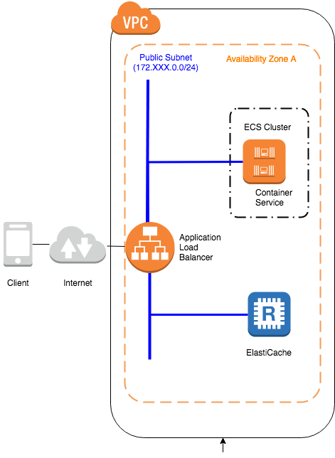

.. include:: ../module.txt

.. _section-cloud-native-nosql-label-4-1:

AWSで作るクラウドネイティブアプリケーションの基本
========================================================================================

.. _section-cloud-native-nosql-4th-1-label:

第3回 AWS上に構築するNoSQLアプリケーション(4)-1
----------------------------------------------------------------------------------------

|br|

.. _section-cloud-native-nosql-spring-applicaiton-4-1-label:

Amazon ElastiCacheへアクセスするSpringアプリケーション
^^^^^^^^^^^^^^^^^^^^^^^^^^^^^^^^^^^^^^^^^^^^^^^^^^^^^^^^^^^^^^^^^^^^^^^^^^^^^^^^^^^^^^^^^^^^^^^^^^^^^^^^^

|br|

クラウド時代が到来し、ビッグデータやキーバリュー型データなどで、ますます活用の機会が広がりつつあるNoSQLデータベース。第3回は代表的なNoSQLプロダクトであるAmazon DynamoDBやApache Cassandra、
Amazon ElastiCacheへアクセスするSpringアプリケーションを構築する方法を説明します。本連載では、以下の様なステップで進めていきます。

|br|

#. NoSQLデータベースの特徴とデータ特性

   * CAP定理を元にしたデータベースの分類とデータ特性
   * AP型データベースAmazon DynamoDBとApache Cassandraの特徴

#. Amazon DynamoDBへアクセスするSpringアプリケーション

   * Amazon DynamoDBの概要及び構築と認証情報の設定
   * Spring Data DynamoDBを用いたアプリケーション(1)
   * Spring Data DynamoDBを用いたアプリケーション(2)

#. Apache CassandraへアクセスするSpringアプリケーション

   * ローカル環境におけるApache Cassandraの構築
   * Spring Data Cassandraを用いたアプリケーション(1)
   * Spring Data Cassandraを用いたアプリケーション(2)

#. Amazon ElastiCacheへアクセスするSpringアプリケーション

   * ローカル環境におけるRedisの構築                        　　　　　　　　  …◯
   * Spring SessionとSpring Data Redisを用いたアプリケーション(1)
   * Spring SessionとSpring Data Redisを用いたアプリケーション(2)
   * Amazon ElastiCacheの設定
   * セッション共有するECSアプリケーションの構築(1)
   * セッション共有するECSアプリケーションの構築(2)

|br|

前回は、AP型データベースである、Apache CassandraデータベースへアクセスするSpringアプリケーションを構築しました。
今回はAmazon ElastiCache(Redis)の概要を説明し、実際に構築して見ます。

|br|

.. _section-cloud-native-elasticache-overview-label:

Amazon ElastiCacheの概要
"""""""""""""""""""""""""""""""""""""""""""""""""""""""""""""""""""""""""""""""""""""""""

|br|

Amazon ElastiCacheは、スケールアウト時のセッション状態や共通業務データなどを共有キャッシュすることにフォーカスしたサービスです。
種類としてMemcachedとRedisをオプションとして選択でき、以下のような観点で使い分けを行います。

.. list-table:: ElastiCache(MemcachedとRedis)の共有キャッシュとして違い
   :widths: 2, 2, 4

   * -
     - Memcached
     - Redis

   * - アクセス
     - マルチスレッド
     - シングルスレッド

   * - データ構造・タイプ
     - シンプル
     - 文字列からリスト・ハッシュ等複雑なデータ型をサポート

   * - 永続性
     - なし
     - あり

   * - マルチAZとフェイルオーバー
     - なし
     - あり

   * - その他の特徴
     - 水平スケール可能
     - スケールアウトは更新がマスターノードに集中するため不可(リードレプリカは可) |br|

特にRedisは前回  :ref:`section-cloud-native-nosql-category-by-cap-label` でも紹介した通り、CP型の特徴を持つキーバリュー型データストアであり、
シャーディングなどの高速化目的のキャッシュやスケールアウトしたアプリケーションでのセッションデータ共有で利用されます。今回は以下の図のように、Amazon ElastiCache(Redis)およびSpring Session、Spring Data Resisを使って、
ECSコンテナ上の複数のアプリケーション間でセッション情報を共有し、スケールアウト可能なステートフルアプリケーションを作成してみましょう。

|br|

|br|

.. _section-cloud-native-create-local-redis-label:

ローカル環境におけるRedisの構築
"""""""""""""""""""""""""""""""""""""""""""""""""""""""""""""""""""""""""""""""""""""""""

ElastiCacheはエンドポイントを持ち、任意の場所からアクセスできますが、通常セキュリティグループによりアクセス制御されます。
そのため、相応のメモリが必要になるのですが、ローカル環境でシングルノードのRedisを構築すると開発時は便利なので、ここでは、
Dockerを用いてゲストOSとして、CentOS7上にRedisを実行して見ます。ホストOSとなる端末はMacOS、Windowsどちらでもかまいませんが、
Dockerを事前にインストールしてください。以降はDockerがインストールされた端末を前提に進めていきます。

|br|

適当な任意のフォルダにDockerfileと言う名前で以下のファイルを作成してください。

.. sourcecode:: bash

   # Dockerfile for redis server

   # (A)
   FROM            docker.io/centos:latest
   # (B)
   MAINTAINER      debugroom

   # (C)
   RUN yum -y install epel-release
   # (D)
   RUN yum install -y redis
   # (E)
   RUN sed -i s/bind\ 127\.0\.0\.1/\#bind\ 127\.0\.0\.1/g /etc/redis.conf
   # (F)
   RUN sed -i s/protected\-mode\ yes/protected\-mode\ no/g /etc/redis.conf
   # (G)
   RUN systemctl enable redis.service
   # (H)
   EXPOSE 6379

|br|

.. list-table:: ローカル環境にあるCentOS7Dockerコンテナ上で、シングルノードRedisを構築するDockerfileの実行コマンド
   :widths: 1, 19

   * - 項番
     - コマンド

   * -
     - 説明

   * - (A)
     - FROM docker.io/centos:latest

   * -
     - コンテナイメージのベースとなるOSイメージを指定します。

   * - (B)
     - MAINTAINER debugroom

   * -
     - メンテナンスしている組織や個人の名称を指定します。省略可能です。

   * - (C)
     - RUN yum -y install epel-release

   * -
     - OSにEPEL(Extra Packages for Enterprise Linux)リポジトリを追加します。

   * - (D)
     - RUN yum install -y redis

   * -
     - Redisをインストールします。

   * - (E)
     - RUN sed -i s/bind\ 127\.0\.0\.1/\#bind\ 127\.0\.0\.1/g /etc/redis.conf

   * -
     - コンテナ外からのアクセスを許可するために、ループバックアドレス以外も許可するようRedisの設定ファイルを変更します。

   * - (F)
     - RUN sed -i s/protected\-mode\ yes/protected\-mode\ no/g /etc/redis.conf

   * -
     - コンテナ外からのアクセスを許可するために、プロテクトモードをオフにするようRedisの設定ファイルを変更します。

   * - (G)
     - RUN systemctl enable redis.service

   * -
     - コンテナ実行時にRedisのサービスを起動するよう設定します。

   * - (H)
     - EXPOSE 6379

   * -
     - Redisで使用する6379ポートを解放します。

|br|

上記のファイルを作成後、コマンドラインからDockerイメージを作成するコマンドを実行します。docker buildコマンドでイメージ名やタグを指定して、元になるDockerfileがあるディレクトリを指定してください。
ここでは、DockerHub上でのxxxxxxレポジトリにsample-redis-localというイメージをlatestタグをつけて実行しています。最後にDockerfileがあるカレントディレクトリを指定しています。

.. sourcecode:: bash

   docker build -t xxxxxx/sample-redis-local:latest .

|br|

Dockerイメージが作成されたら、コマンドラインからDockerプロセスを実行してください。なお、実行するコンテナ内でsystemctlサービスを実行するために、--privilegedオプションを付与する必要があります。
実行コンテナ名称(redis-serverとします。)と、コンテナイメージ名、コンテナの起動時は/sbin/initを実行し、systemdを起動する形でコンテナを実行します。

.. sourcecode:: bash

   docker run -d --privileged -p 6379:6379 --name redis-server xxxxxxx/sample-redis-local /sbin/init

|br|

これで、Redisの環境が構築できました。次回はこの構築したローカル環境のRedisにアクセスするSpringアプリケーションを実装してみます。

|br|

著者紹介
------------------------------------------------------------------

川畑 光平(KAWABATA Kohei)

.. figure:: img/aws-lambda-and-api-gateway/pic_image01.jpg
   :scale: 100%

某システムインテグレータにて、金融機関システム業務アプリケーション開発・システム基盤担当を経て、現在はソフトウェア開発自動化関連の研究開発・推進に従事。

Red Hat Certified Engineer、Pivotal Certified Spring Professional、AWS Certified Solutions Architect Professional等の資格を持ち、アプリケーション基盤・クラウドなど様々な開発プロジェクト支援にも携わる。

本連載記事の内容に対するご意見・ご質問は `Facebook <https://www.facebook.com/kohei.kawabata.5>`_ まで。
