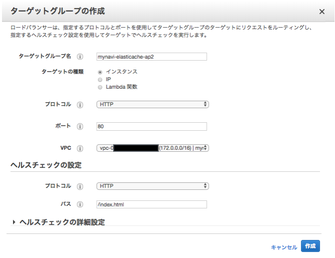
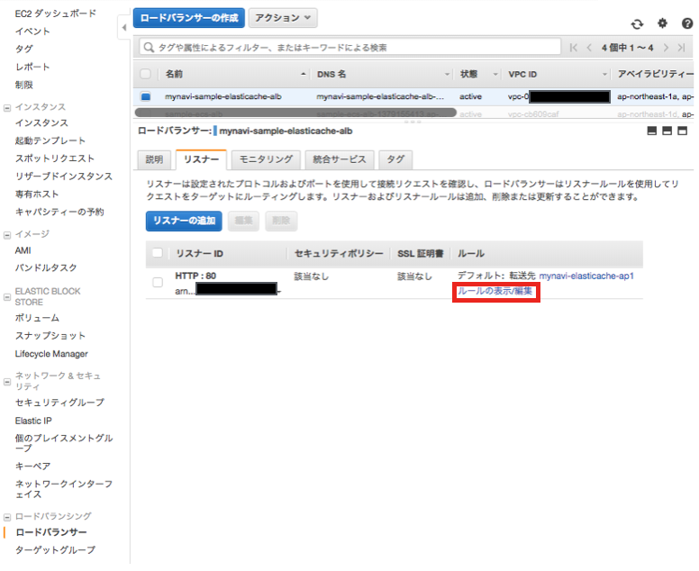
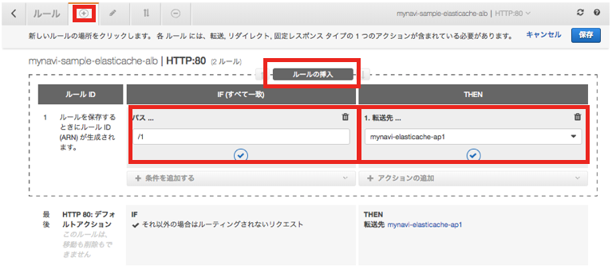

.. include:: ../module.txt

.. _section-cloud-native-nosql-label-4-5:

AWSで作るクラウドネイティブアプリケーションの基本
========================================================================================

.. _section-cloud-native-nosql-4th-5-label:

第3回 AWS上に構築するNoSQLアプリケーション(4)-5
----------------------------------------------------------------------------------------

|br|

.. _section-cloud-native-nosql-spring-applicaiton-4-5-label:

Amazon ElastiCacheへアクセスするSpringアプリケーション
^^^^^^^^^^^^^^^^^^^^^^^^^^^^^^^^^^^^^^^^^^^^^^^^^^^^^^^^^^^^^^^^^^^^^^^^^^^^^^^^^^^^^^^^^^^^^^^^^^^^^^^^^

|br|

クラウド時代が到来し、ビッグデータやキーバリュー型データなどで、ますます活用の機会が広がりつつあるNoSQLデータベース。第3回は代表的なNoSQLプロダクトであるAmazon DynamoDBやApache Cassandra、
Amazon ElastiCacheへアクセスするSpringアプリケーションを構築する方法を説明します。本連載では、以下の様なステップで進めていきます。

|br|

#. NoSQLデータベースの特徴とデータ特性

   * CAP定理を元にしたデータベースの分類とデータ特性
   * AP型データベースAmazon DynamoDBとApache Cassandraの特徴

#. Amazon DynamoDBへアクセスするSpringアプリケーション

   * Amazon DynamoDBの概要及び構築と認証情報の設定
   * Spring Data DynamoDBを用いたアプリケーション(1)
   * Spring Data DynamoDBを用いたアプリケーション(2)

#. Apache CassandraへアクセスするSpringアプリケーション

   * ローカル環境におけるApache Cassandraの構築
   * Spring Data Cassandraを用いたアプリケーション(1)
   * Spring Data Cassandraを用いたアプリケーション(2)

#. Amazon ElastiCacheへアクセスするSpringアプリケーション

   * ローカル環境におけるRedisの構築
   * Spring SessionとSpring Data Redisを用いたアプリケーション(1)
   * Spring SessionとSpring Data Redisを用いたアプリケーション(2)
   * Amazon ElastiCacheの設定
   * セッション共有するECSアプリケーションの構築(1)              …◯
   * セッション共有するECSアプリケーションの構築(2)

|br|

前回 :ref:`section-cloud-native-create-elasticache-redis-label` では、下記のイメージ図のように、VPC及びAmazon ElastiCacheを構築しました。
今回からは、ElastiCacheでセッション共有するアプリケーションを構築していきましょう。

|br|

.. figure:: img/aws-nosql/architecture-elasticache.png
   :scale: 100%

|br|

.. _section-cloud-native-create-session-sharing-application-1-label:

セッション共有するECSアプリケーションの構築(1)
"""""""""""""""""""""""""""""""""""""""""""""""""""""""""""""""""""""""""""""""""""""""""

|br|

.. _section-cloud-native-create-docker-image-app-and-redis-client-label:

アプリケーション・RedisクライアントのDockerイメージの作成
~~~~~~~~~~~~~~~~~~~~~~~~~~~~~~~~~~~~~~~~~~~~~~~~~~~~~~~~~~~~~~~~~~~~~~~~~~~~~~~~~~~~~~~~~

|br|

既に :ref:`section-cloud-native-spring-session-data-redis-implementation-2-label` でアプリケーションの実装は完了していますが、
ECSコンテナとして実行するためにDockerイメージを作成して、DockerHubなどのレジストリにプッシュしておく必要があります。加えて、ElastiCacheに追加されたセッションデータを確認するために、
ECSクラスタ上で実行するRedisクライアントをインストールしたDockerイメージも作成しておきましょう。

|br|

まず、アプリケーションのプロジェクトに以下のようなDockerfileを作成します。記述する内容は以前作成した :ref:`section-cloud-native-ecs-create-docker-image-label` とほぼ同一ですので、解説はこちらを参照してください。

.. sourcecode:: bash

   FROM centos:centos7
   MAINTAINER debugroom

   RUN yum install -y \
        java-1.8.0-openjdk \
        java-1.8.0-openjdk-devel \
        wget tar iproute git

   RUN wget http://repos.fedorapeople.org/repos/dchen/apache-maven/epel-apache-maven.repo -O /etc/yum.repos.d/epel-apache-maven.repo
   RUN sed -i s/\$releasever/6/g /etc/yum.repos.d/epel-apache-maven.repo
   RUN yum install -y apache-maven
   ENV JAVA_HOME /etc/alternatives/jre
   RUN git clone https://github.com/debugroom/mynavi-sample-aws-elasticache.git /var/local/mynavi-sample-aws-elasticache
   RUN mvn install -f /var/local/mynavi-sample-aws-elasticache/pom.xml

   RUN cp /etc/localtime /etc/localtime.org
   RUN ln -sf  /usr/share/zoneinfo/Asia/Tokyo /etc/localtime

   EXPOSE 8080

   CMD java -jar -Dspring.profiles.active=production /var/local/mynavi-sample-aws-elasticache/target/mynavi-sample-aws-elasticache-0.0.1-SNAPSHOT.jar

|br|

また、RedisクライアントとなるDockerfileを、以下の要領に沿って作成します。こちらも、記述内容は :ref:`section-cloud-native-create-local-redis-label` とほぼ重複していますので、解説はこちらを参照してください。

|br|

.. sourcecode:: bash

   # Dockerfile for redis client

   FROM            docker.io/centos:latest
   MAINTAINER      debugroom

   RUN yum -y install epel-release
   RUN yum install -y redis

|br|

上記のファイルを作成後、コマンドラインからDockerイメージを作成するコマンドを実行します。git cloneするアプリケーションは事前にGitHubなどへプッシュしておく必要があります。
その後、docker buildコマンドでイメージ名やタグを指定して、元になるDockerfileがあるディレクトリを指定してください。
アプリケーションのコンテナイメージ作成では、DockerHub上でのxxxxxxレポジトリにmynavi-sample-aws-elastiache-appというイメージをlatestタグをつけて実行しています。
イメージがビルドされた後は、コンテナイメージをレジストリにプッシュしておきましょう。

|br|

.. sourcecode:: bash

   docker build -t xxxxxx/mynavi-sample-aws-elasticache-app:latest .
   // omit
   docker push xxxxxx/mynavi-sample-aws-elasticache-app:latest

|br|

Redisクライアントのコンテナイメージ作成では、DockerHub上でのxxxxxxレポジトリにmynavi-sample-というイメージをlatestタグをつけて実行します。
同様にコンテナイメージの作成後はイメージをプッシュします。

|br|

.. sourcecode:: bash

   docker build -t xxxxxx/mynavi-sample-redis-client:latest .
   // omit
   docker push xxxxxx/mynavi-sample-redis-client:latest

|br|

続いて、アプリケーション環境の構築に移ります。

|br|

.. _section-cloud-native-create-alb-for-elasticache-app-label:

アプリケーションロードバランサー(ALB)の作成
~~~~~~~~~~~~~~~~~~~~~~~~~~~~~~~~~~~~~~~~~~~~~~~~~~~~~~~~~~~~~~~~~~~~~~~~~~~~~~~~~~~~~~~~~

アプリケーションは複数のECSコンテナで実行しますが、各アプリケーションが共通のセッションを利用していることを確認するため、
リクエストURLのパスパターンによって異なるコンテナへ処理が振り分けられるようにアプリケーションロードバランサー(ALB)を構成しましょう。
構築作業の要領は、:ref:`section-cloud-native-ecs-create-alb-label` とほぼ同様になりますので、入力項目の詳細はこちらも参照してください。

「EC2」サービスから、「ロードバランサー」メニューを選択し、「ロードバランサーの作成」ボタンを押下して、
以下の通り、ロードバランサーの構成を設定します。VPC及びサブネットは前回 :ref:`section-cloud-native-create-elasticache-redis-label` で作成したものを指定してください。

|br|

.. figure:: img/aws-nosql/management-console-ec2-create-alb-for-elasticache-1.png
   :scale: 100%

|br|

セキュリティ設定の構成は今回はHTTPを利用するので必要ありませんが、セキュリティグループの設定は、任意のソースからの80番ポートのリクエストを受け付けるものを指定します。

.. figure:: img/aws-nosql/management-console-ec2-create-alb-for-elasticache-2.png
   :scale: 100%

|br|

ターゲットグループは、ALB構築後にもう１つ作成を行いますが、ここでは１つ目を作成しておきます。

|br|

|br|

ターゲットの登録はECSコンテナの実行時に指定しますので、ここでは設定をスキップします。

|br|

引き続き、ターゲットグループをもう一つ作成しておきます。「EC2」サービスから、「ターゲットグループ」メニューを選択し、「ターゲットグループの作成」ボタンを押下して、
以下の通り、２つ目のターゲットグループを作成します。

|br|

|br|

ALBが特定のパスパターンで特定のコンテナのターゲットグループにディスパッチするよう、ALBの設定を行います。
「ロードバランサー」メニューから上記で作成したALBを選択し、「リスナー」タブにある、「ルールの表示/編集」を選択します。

|br|

|br|

以下の通り、アプリケーションで実装したcontainerGroupパラメータのパターンに応じて、異なるターゲットグループへディスパッチするよう設定を追加します。

* パスパターン：/1の場合、ターゲットグループ「mynavi-elasticache-ap1」へ転送するよう設定

|br|

|br|

* パスパターン：/2の場合、ターゲットグループ「mynavi-elasticache-ap2」へ転送するよう設定
* パスパターン：それ以外の場合、ターゲットグループ「mynavi-elasticache-ap1」へ転送するよう設定

|br|

.. figure:: img/aws-nosql/management-console-ec2-setting-alb-for-elasticache-3.png
   :scale: 100%

|br|

引き続き、次回はECSクラスタの構築とタスク定義を行い、ECSサービスをデプロイします。

|br|

著者紹介
------------------------------------------------------------------

川畑 光平(KAWABATA Kohei)

.. figure:: img/aws-lambda-and-api-gateway/pic_image01.jpg
   :scale: 100%

某システムインテグレータにて、金融機関システム業務アプリケーション開発・システム基盤担当を経て、現在はソフトウェア開発自動化関連の研究開発・推進に従事。

Red Hat Certified Engineer、Pivotal Certified Spring Professional、AWS Certified Solutions Architect Professional等の資格を持ち、アプリケーション基盤・クラウドなど様々な開発プロジェクト支援にも携わる。

本連載記事の内容に対するご意見・ご質問は `Facebook <https://www.facebook.com/kohei.kawabata.5>`_ まで。
