.. include:: ../module.txt

.. _section-cloud-native-nosql-label-4-6:

AWSで作るクラウドネイティブアプリケーションの基本
========================================================================================

.. _section-cloud-native-nosql-4th-6-label:

第3回 AWS上に構築するNoSQLアプリケーション(4)-6
----------------------------------------------------------------------------------------

|br|

.. _section-cloud-native-nosql-spring-applicaiton-4-6-label:

Amazon ElastiCacheへアクセスするSpringアプリケーション
^^^^^^^^^^^^^^^^^^^^^^^^^^^^^^^^^^^^^^^^^^^^^^^^^^^^^^^^^^^^^^^^^^^^^^^^^^^^^^^^^^^^^^^^^^^^^^^^^^^^^^^^^

|br|

クラウド時代が到来し、ビッグデータやキーバリュー型データなどで、ますます活用の機会が広がりつつあるNoSQLデータベース。第3回は代表的なNoSQLプロダクトであるAmazon DynamoDBやApache Cassandra、
Amazon ElastiCacheへアクセスするSpringアプリケーションを構築する方法を説明します。本連載では、以下の様なステップで進めていきます。

|br|

#. NoSQLデータベースの特徴とデータ特性

   * CAP定理を元にしたデータベースの分類とデータ特性
   * AP型データベースAmazon DynamoDBとApache Cassandraの特徴

#. Amazon DynamoDBへアクセスするSpringアプリケーション

   * Amazon DynamoDBの概要及び構築と認証情報の設定
   * Spring Data DynamoDBを用いたアプリケーション(1)
   * Spring Data DynamoDBを用いたアプリケーション(2)

#. Apache CassandraへアクセスするSpringアプリケーション

   * ローカル環境におけるApache Cassandraの構築
   * Spring Data Cassandraを用いたアプリケーション(1)
   * Spring Data Cassandraを用いたアプリケーション(2)

#. Amazon ElastiCacheへアクセスするSpringアプリケーション

   * ローカル環境におけるRedisの構築
   * Spring SessionとSpring Data Redisを用いたアプリケーション(1)
   * Spring SessionとSpring Data Redisを用いたアプリケーション(2)
   * Amazon ElastiCacheの設定
   * セッション共有するECSアプリケーションの構築(1)
   * セッション共有するECSアプリケーションの構築(2)              …◯

|br|

前回 :ref:`section-cloud-native-create-session-sharing-application-1-label` では、アプリケーション及びRedisクライアントのDockerイメージを作成し、アプリケーションロードバランサーを構築しました。
下記のイメージ通りに、今回はECSクラスタを作成し、ECSタスク定義を行って、コンテナをデプロイしてアプリケーションを実行しましょう。

|br|

.. figure:: img/aws-nosql/architecture-elasticache.png
   :scale: 100%

|br|

.. _section-cloud-native-create-session-sharing-application-2-label:

セッション共有するECSアプリケーションの構築(2)
"""""""""""""""""""""""""""""""""""""""""""""""""""""""""""""""""""""""""""""""""""""""""

|br|

.. _section-cloud-native-create-ecs-cluster-for-elasticache-label:

ECSクラスタ及びセキュリティグループの設定
~~~~~~~~~~~~~~~~~~~~~~~~~~~~~~~~~~~~~~~~~~~~~~~~~~~~~~~~~~~~~~~~~~~~~~~~~~~~~~~~~~~~~~~~~

|br|

ECSコンテナを実行するためのECSクラスタ及びセキュリティグループを設定します。設定内容は :ref:`section-cloud-native-ecs-create-cluster-label` ほぼ同一となりますので、詳細な入力の要領はリンク先を参考にしてください。

なお、ECSクラスタに設定するセキュリティグループは、Redisクライアントを実行するためのSSH接続と、ALBからのリクエスト転送を動的ポートで接続するので、以下の通り、22番と、32768-61000のアクセス許可するものを作成しておきます。

|br|

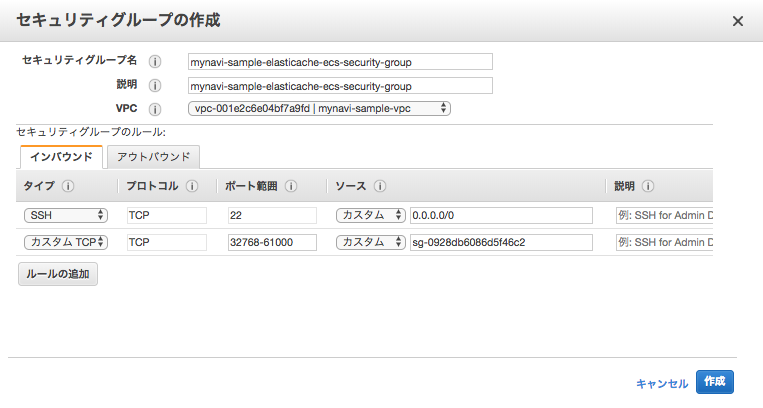

|br|

上記で作成したセキュリティグループを指定して、ECSクラスタを作成します。VPCはElastiCache構築時に作成したVPCを指定してください。

|br|

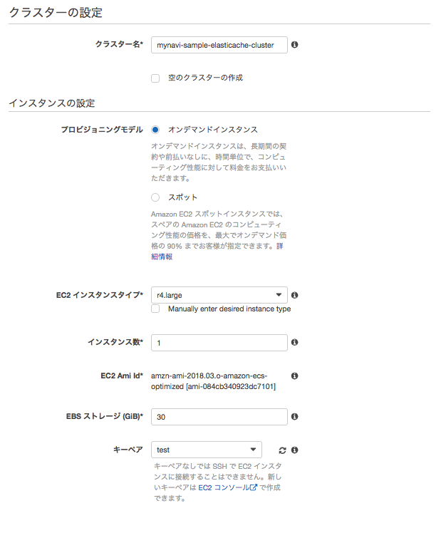

|br|

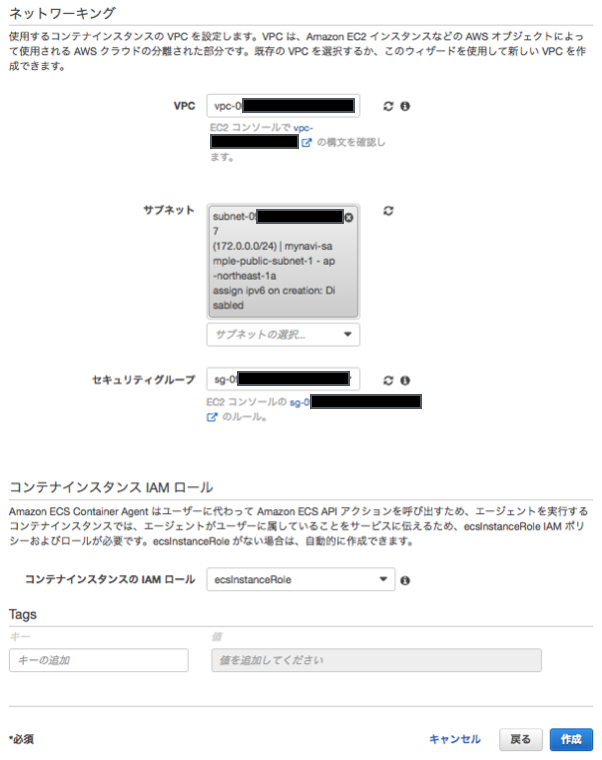

|br|

.. _section-cloud-native-create-ecs-task-for-elasticache-label:

ECSタスクの定義
~~~~~~~~~~~~~~~~~~~~~~~~~~~~~~~~~~~~~~~~~~~~~~~~~~~~~~~~~~~~~~~~~~~~~~~~~~~~~~~~~~~~~~~~~

前回、DockerHubレポジトリへプッシュしたコンテナイメージを利用して、ECSタスク定義を行います。設定作業の要領は、:ref:`section-cloud-native-ecs-define-task-label` とほぼ同様になりますので、入力項目の詳細はこちらも参照してください。

|br|

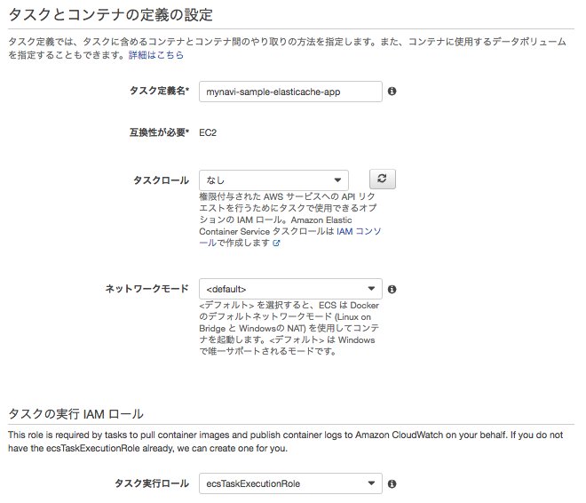

|br|

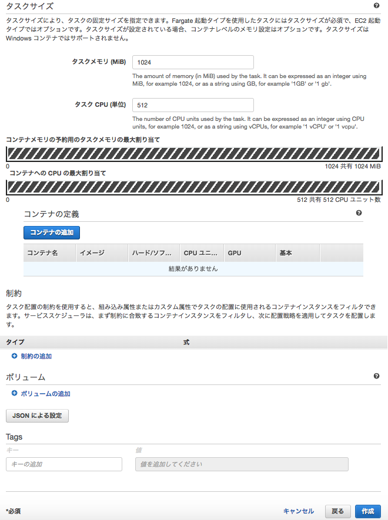

|br|

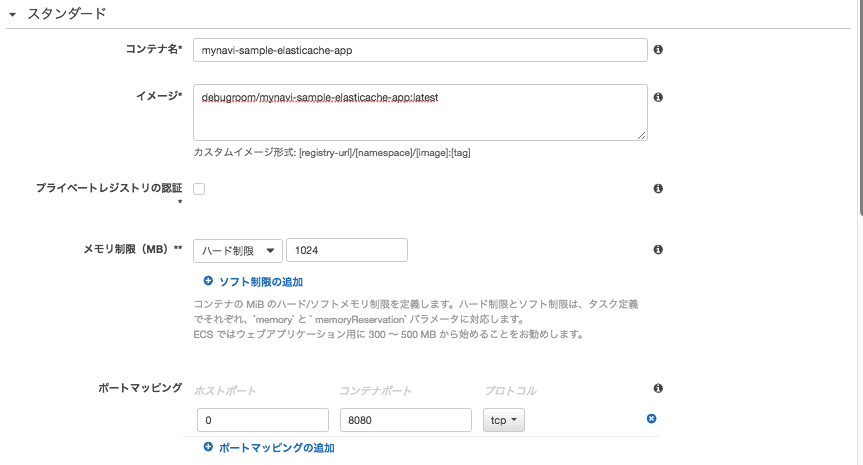

|br|

上記のリンクの設定要領との差分の中で特筆すべき点として、アプリケーションではElastiCacheのエンドポイントを環境変数REDIS_CLUSTER_ENDPOINTで取得する実装になっているため、ElastiCacheのエンドポイントを下記の通りに設定してください。

|br|

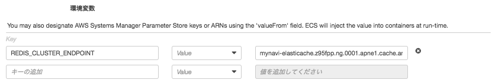

|br|

.. warning:: メモリサイズは1024MB、CPUタスクは512以上を最低指定するようにしてください。ヘルスチェックの実行までにアプリケーションの起動が完了せず、強制停止・再起動となり、コンテナが永久起動ループになる可能性があります。

|br|

.. _section-cloud-native-create-ecs-service-for-elasticache-label:

ECSサービスの実行・アプリケーション起動の確認
~~~~~~~~~~~~~~~~~~~~~~~~~~~~~~~~~~~~~~~~~~~~~~~~~~~~~~~~~~~~~~~~~~~~~~~~~~~~~~~~~~~~~~~~~

|br|

ターゲットグループを指定して、コンテナをECSサービスとして起動します。作業の要領は、:ref:`section-cloud-native-ecs-create-service-label` とほぼ同様になりますので、入力項目の詳細はこちらも参照してください。
今回、ロードバランサーからは２つのパスパターンごとに、ターゲットグループを指定していますので、ECSサービスを２つ起動するよう実行します。

|br|

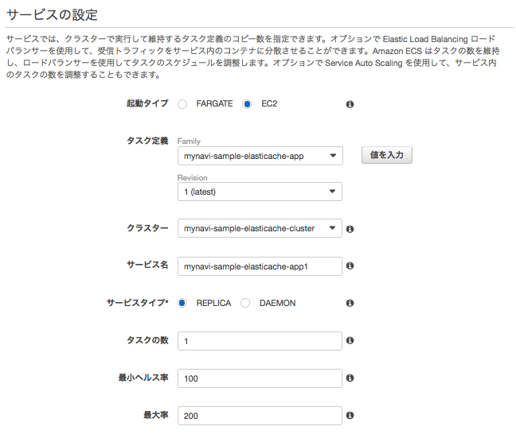

|br|

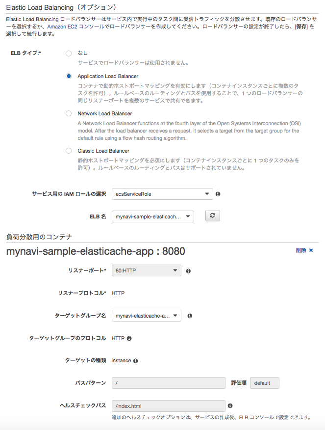

|br|

サービスが問題なく起動したら、ブラウザで、ALBのDNSを指定して、以下の例のようなURLでアクセスします。

* アプリケーションのURLの例：http://xxxxxxxx.ap-northeast-1.elb.amazonaws.com/index.html

|br|

アプリケーションの画面が表示されたら、実行コンテナ番号を1もしくは2で指定して「sharedSession」ボタンを押下すると、それぞれ実行したコンテナのホスト名が切り替わって表示されます。

|br|

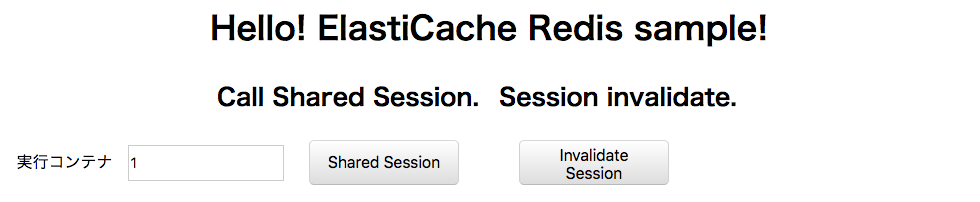

|br|

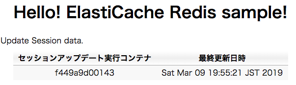

|br|

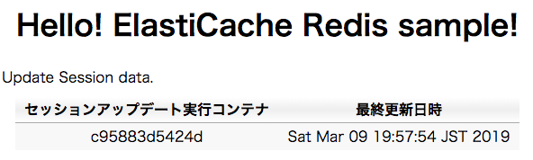

|br|

ECSクラスタに、前回プッシュしたDockerイメージをpullして、Redis-Clientを構築し、実際にElastiCacheに格納されているデータを確認します。

|br|

.. sourcecode:: bash

   [ec2-user@ip-172-0-0-226 ~]$  docker pull debugroom/mynavi-sample-redis-client:latest
    latest: Pulling from debugroom/mynavi-sample-redis-client
    // omit
    [ec2-user@ip-172-0-0-226 ~]$ docker run -it --name redis-client debugroom/mynavi-sample-redis-client /bin/bash
    [root@2952f1af394a /]# redis-cli -h mynavi-elasticache.z95fpp.ng.0001.apne1.cache.amazonaws.com
    mynavi-elasticache.z95fpp.ng.0001.apne1.cache.amazonaws.com:6379>

|br|

コンテナ番号を指定し、「Shared Session」ボタンを押下します。

|br|

.. sourcecode:: bash

    mynavi-elasticache.z95fpp.ng.0001.apne1.cache.amazonaws.com:6379> keys *
    1) "spring:session:expirations:1552130880000"
    2) "spring:session:sessions:expires:e1237df7-5646-4382-aa12-41435ed09dc7"
    3) "spring:session:sessions:e1237df7-5646-4382-aa12-41435ed09dc7"
    mynavi-elasticache.z95fpp.ng.0001.apne1.cache.amazonaws.com:6379> hgetall "spring:session:sessions:e1237df7-5646-4382-aa12-41435ed09dc7"
    1) "creationTime"
    2) "1552128921707"
    3) "sessionAttr:scopedTarget.sampleSession"
    4) "{\"@class\":\"org.debugroom.mynavi.sample.aws.elasticache.app.web.model.SampleSession\",\"host\":\"c95883d5424d\",\"lastUpdatedAt\":[\"java.util.Date\",1552129074569]}"
    5) "lastAccessedTime"
    6) "1552129074379"
    7) "maxInactiveInterval"
    8) "1800"

|br|

別のコンテナ番号を指定し、再び「Shared Session」ボタンを押下します。SampleSession内のhostが切り替わっていることがわかります。

|br|

.. sourcecode:: bash

    mynavi-elasticache.z95fpp.ng.0001.apne1.cache.amazonaws.com:6379> hgetall "spring:session:sessions:e1237df7-5646-4382-aa12-41435ed09dc7"
    1) "creationTime"
    2) "1552128921707"
    3) "sessionAttr:scopedTarget.sampleSession"
    4) "{\"@class\":\"org.debugroom.mynavi.sample.aws.elasticache.app.web.model.SampleSession\",\"host\":\"f449a9d00143\",\"lastUpdatedAt\":[\"java.util.Date\",1552129676177]}"
    5) "lastAccessedTime"
    6) "1552129676176"
    7) "maxInactiveInterval"
    8) "1800"

著者紹介
------------------------------------------------------------------

川畑 光平(KAWABATA Kohei)

.. figure:: img/aws-lambda-and-api-gateway/pic_image01.jpg
   :scale: 100%

某システムインテグレータにて、金融機関システム業務アプリケーション開発・システム基盤担当を経て、現在はソフトウェア開発自動化関連の研究開発・推進に従事。

Red Hat Certified Engineer、Pivotal Certified Spring Professional、AWS Certified Solutions Architect Professional等の資格を持ち、アプリケーション基盤・クラウドなど様々な開発プロジェクト支援にも携わる。

本連載記事の内容に対するご意見・ご質問は `Facebook <https://www.facebook.com/kohei.kawabata.5>`_ まで。
