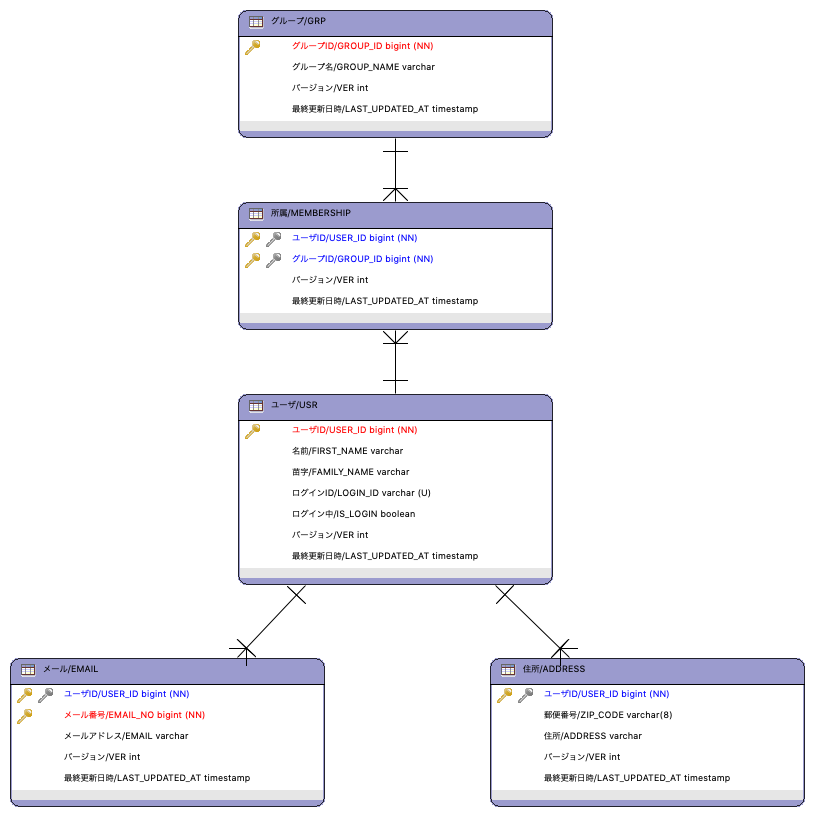
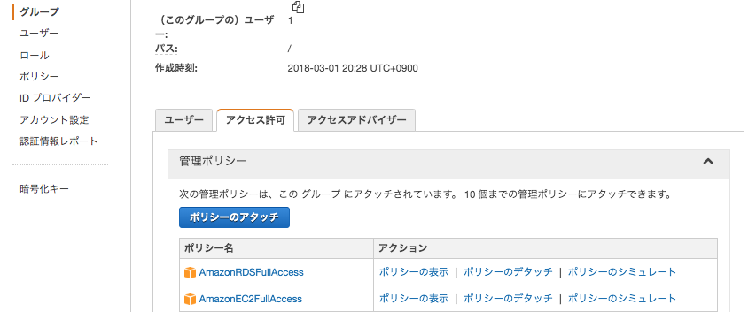

.. include:: ../module.txt

.. _section-cloud-native-rds-2nd-label:

【第12回】RDSへのテーブル構築とSpring Data JPAおよびSpring Cloud AWSを用いたRDSアクセスアプリケーションの実装(1)
--------------------------------------------------------------------------------------------------------------------------------

|br|

クラウド上のリレーショナルデータベースとして、AWSで利用可能なAmazon RDS。今回はPostgreSQLをベースとするAmazon RDSへアクセスする
Springアプリケーションの実装方法についてわかりやすく解説します。なお、データベースアクセスの実装にはSpring Data JPAおよび、
Spring Cloud AWSを用いて実装します。

|br|

#. Amazon RDSの概要とデータベース構築
#. **RDSへのテーブル構築とSpring Data JPAおよびSpring Cloud AWSを用いたRDSアクセスアプリケーションの実装(1)**
#. RDSへのテーブル構築とSpring Data JPAおよびSpring Cloud AWSを用いたRDSアクセスアプリケーションの実装(2)

|br|

前回に引き続き、Spring Data JPAおよびSpring Cloud AWSの概要を説明し、RDSへのテーブル構築、アプリケーション実装を進めていきます。

|br|

.. _section-cloud-native-spring-data-jpa-and-spring-cloud-aws-overview-label:

Spring Data JPAおよびSpring Cloud AWSの概要
^^^^^^^^^^^^^^^^^^^^^^^^^^^^^^^^^^^^^^^^^^^^^^^^^^^^^^^^^^^^^^^^^^^^^^^^^^^^^^^^^^^^^^^^^^^^^^^^^^^^^^^^^

|br|

`Spring Data JPA <https://spring.io/projects/spring-data-jpa>`_ は JavaEE(Enterprize Edition)の標準データベースアクセス仕様であるJPA(Java Persistence API)を使用して、
Repositoryを中核のコンポーネントとするデータベースアクセスで処理を抽象化し、CRUD操作などの実装を提供するフレームワークです。基本的なリレーショナルデータベースへのCRUDアクセスであれば、
エンティティクラスとレポジトリインターフェースを作成するだけでSQLを記述することなく、データベースアクセス処理を実装できます。Spring Data JPAは以下のような機能・実装を提供します。

* Javaのジェネリクスを利用した、GenericDAOパターンによるCRUD処理の実装
* 命名規約に基づくメソッド名からの自動SQLクエリの組み立て・実行
* 楽観ロックのサポート

JPAやSpring Data JPAの詳しい解説は本連載では割愛しますが、詳細を知りたい場合は `TERASOLUNA データベースアクセス(JPA)のガイドライン <http://terasolunaorg.github.io/guideline/5.4.1.RELEASE/ja/ArchitectureInDetail/DataAccessDetail/DataAccessJpa.html>`_ を適宜参照してください。

`Spring Cloud AWS <https://spring.io/projects/spring-cloud-aws>`_ はSpring Cloud プロジェクトのひとつで、AWSのS3やSQS、SNSといったサービスのSDKやAPIを統合するフレームワークです。
以下のようなサポートを提供し、AWSサービスとの統合を実現します。

* Amazon SQSにおけるSpring Messaging APIの実装
* AWS ElastiCacheにおけるSpring Cache APIの実装
* Amazon SNSにおけるアノテーションをベースとしたエンドポイントの設定・マッピング
* CloudFormationで定義した論理名リソースへのアクセス
* AWS RDSインスタンスの論理名からのデータソースの自動構築
* Amazon S3におけるResourceLoaderを使ったBucketアクセス

今回のメイントピックスであるRDSにおいては、以降、詳述しますが、Spring Cloud AWSではアプリケーションからアクセスするデータソースの自動構築をサポートします。

また、実際に作成したアプリケーションは `GitHub <https://github.com/debugroom/mynavi-sample-aws-rds>`_ 上にコミットしています。
以降記載されているソースコードで、インポート文など本質的でない記述を省略している部分がありますので、実行コードを作成する場合は、必要に応じて適宜GitHubソースコードも参照してください。

|br|

.. _section-cloud-native-spring-data-jpa-and-spring-cloud-aws-implementation-1st-label:

Spring Data JPAおよびSpring Cloud AWSを用いたRDSアクセスアプリケーションの実装(1)
^^^^^^^^^^^^^^^^^^^^^^^^^^^^^^^^^^^^^^^^^^^^^^^^^^^^^^^^^^^^^^^^^^^^^^^^^^^^^^^^^^^^^^^^^^^^^^^^^^^^^^^^^^^^^^^^^^^

|br|

Spring Data JPAとSpring Cloud AWSを使用するには、まず、Mavenプロジェクトのpom.xmlで、spring-boot-starter-data-jpaおよび、spring-cloud-starter-awsのライブラリを定義します。
また、RDSへアクセスするためにはspring-cloud-starter-aws-jdbcも合わせて追加する必要があります。なお、PostgreSQLのドライバや、エンティティクラスの実装を簡易化するためにLombokライブラリを追加しておきましょう。

|br|

.. sourcecode:: xml

   <dependencies>
     <dependency>
       <groupId>org.springframework.boot</groupId>
       <artifactId>spring-boot-starter-data-jpa</artifactId>
     </dependency>
     <dependency>
       <groupId>org.springframework.cloud</groupId>
       <artifactId>spring-cloud-starter-aws</artifactId>
     </dependency>
     <dependency>
       <groupId>org.springframework.cloud</groupId>
       <artifactId>spring-cloud-starter-aws-jdbc</artifactId>
     </dependency>
     <dependency>
       <groupId>org.postgresql</groupId>
       <artifactId>postgresql</artifactId>
       <scope>runtime</scope>
     </dependency>
     <dependency>
       <groupId>org.projectlombok</groupId>
       <artifactId>lombok</artifactId>
       <optional>true</optional>
     </dependency>
   </dependencies>

|br|

アプリケーションを実装していく前に、Spring Cloud AWSとSpring Data JPAを使って、アプリケーションがRDSアクセスする仕組みを押さえておく必要があります。

通常、RDSとJavaアプリケーションを接続する場合は、javax.sql.DataSourceの実装インスタンスにRDSエンドポイントとデータベースのユーザ名、パスワードを設定し、それからConnectionを取得すればアクセスできます。
前回RDSの概要でも説明した通り、RDSはセキュリティグループによりアクセス制御されるので、インバウンド接続許可設定されたIPアドレス帯であれば、アプリケーション内でDataSourceからConnectionを取得する実装で接続できます。

しかし、Spring Cloud AWSを使ったRDSへの接続では、AWSユーザ認証情報およびRDSインスタンスの論理名とデータベース接続ユーザのパスワードから、RDSエンドポイント等の必要な情報を取得し、DataSourceオブジェクトを構築します。
Spring Data JPAと組み合わせる場合は、JavaConfig上でSpring Cloud AWSにより自動作成されたDataSourceをインジェクションするよう設定すればOKです。
なお、下記の点線が示すようにSpring Cloud AWSを使用せず、直接DataSourceを構築する方法でも問題はありません。

|br|

.. figure:: img/aws-rds/rds_setting_overview.png

|br|

また、前回構築したRDSデータベースにテーブルを作成します。今回は以下のようなテーブル構成とします。

|br|

.. list-table:: アプリケーション
   :widths: 2, 2, 6

   * - テーブル名
     - 物理名
     - 説明

   * - グループ
     - GRP
     - グループを表すエンティティ。所属という実体関連を通してユーザとN:Nの関連を持つ。なおGROUPはPostgreSQLで予約語のため簡略化表記。

   * - 所属
     - MEMBERSHIP
     - 所属を表すエンティティ。グループとユーザにあるN対Nの関連を、N:1、1:Nの形で繋ぐ実体関連テーブル。

   * - ユーザ
     - USR
     - ユーザを表すエンティティ。なおUSERはPostgreSQLで予約語のため簡略化表記。

   * - 住所
     - ADDRESS
     - 住所を表すエンティティ。ユーザとは1：1の関連を持つ。

   * - メール
     - Email
     - メールを表すエンティティ。ユーザとは1：Nの関連を持つ。

|br|

|br|

各テーブルを構築するDDLは `こちら <https://github.com/debugroom/mynavi-sample-aws-rds/blob/master/ermaster/sql/sample_database_schema.sql>`_ を参照してください。
セキュリティグループでRDSのインバウンド接続が許可されたIPアドレスをもつEC2インスタンスなどで、PSQLクライアントなどをインストールし、
前回作成したRDSのエンドポイント、データベース、ユーザ名を指定してRDSに接続後、DDLを記載したSQLファイルをインポートするiコマンドで実行すれば、テーブル構築できます。

|br|

.. sourcecode:: bash

   [centos@ip-XXXX-XXX-XXX-XXX ~]$ psql -U username -d sample_database -h mynavi-sample-db.xxxxxxx.ap-northeast-1.rds.amazonaws.com
   Password for user username:
   psql (9.4.0, server 10.6)
   sample_database=> \i sample_database.sql

|br|

.. note:: CentOSのPSQLインストール方法ですが、EC2でCentOS7を実行した場合は、以下のコマンドでPSQLをインストールできます。

   .. sourcecode:: bash

      [centos@ip-XXXX-XXX-XXX-XXX ~]$ sudo yum update -y
      // omit
      [centos@ip-XXX-XXX-XXX-XXX ~]$ sudo yum install -y postgresql

|br|

それでは、アプリケーションの実装に進みます。今回作成するアプリケーションは以下の構成です。

.. list-table:: アプリケーション
   :widths: 3, 6, 1

   * - コンポーネント
     - 説明
     - 必須

   * - App
     - SpringBootアプリケーションを実行する起動クラス
     - ◯

   * - DomainConfig
     - サービスレイヤの設定を行うクラス
     -

   * - JpaConfig
     - JPAに関する設定クラス
     - ◯

   * - RDSConfig
     - RDSへの接続に関する設定クラス
     - ◯

   * - SampleService
     - 各Repositoryを使ってデータ設定するサービスを実装。トランザクション境界を設定。
     -

   * - Xxxxx(Entity)
     - データベースに定義したテーブルに対応するエンティティクラスです。
     - ◯

   * - XxxxxRepository
     - 各エンティティに対応するレポジトリです。
     - ◯

|br|

以降、各々のクラスについて解説を進めていきますが、事前に `AWS公式ページ「設定ファイルと認証情報ファイル」 <https://docs.aws.amazon.com/ja_jp/cli/latest/userguide/cli-configure-files.html>`_ を参考に
ユーザホームフォルダに.awsディレクトリを作成し、credentialというファイル名で、前回取得したCSV形式の認証キーに記載しているユーザ認証情報を、以下の形式で保存してください。

|br|

.. sourcecode:: bash

   [default]
   aws_access_key_id=XXXXXXXXXXXXXXXX
   aws_secret_access_key=YYYYYYYYYYYYYYYYYYYYYYYYYYYYY

|br|

また、上記のクレデンシャルをもつユーザはRDSへの接続権限を持つ必要があります。以下のように、AWSコンソールで「IAM」サービスメニューから、ユーザにRDBのアクセス権限を付与しておいてください。

|br|

|br|

それでは、実装していくクラスを説明します。まず、最初にSpringBoot起動クラス及び、各種設定クラスです。
@SpringBootApplicaitonアノテーションが付与された起動クラスは、同一パッケージにある@Configurationアノテーションが付与された設定クラス及び、
設定クラス内で@ComponentScanされたパッケージにあるクラスを読み取ります。今回は目的に応じて以下の3つに分類して設定クラスを作成します。

* Serviceをコンポーネントスキャンで読み取る設定クラス：DomainConfigクラス
* RDSの接続を行う設定クラス：RdsConfigクラス
* Spring Data JPAの接続を行う設定クラス：JpaConfigクラス

設定クラスは必ずしも複数である必要はなく一つにまとめても動作上問題ありませんが、クラス名と役割を対応づけて作成していた方が、
後々設定内容を混乱することなく、クラス名から識別できてベターです。

起動クラスはアプリケーションを構築後、SampleServiceクラスを取得し、RDSの各テーブルにデータを設定するメソッドを呼び出します。

|br|

.. sourcecode:: java

   package org.debugroom.mynavi.sample.aws.rds.config;

   import org.springframework.boot.SpringApplication;
   import org.springframework.boot.autoconfigure.SpringBootApplication;
   import org.springframework.context.ApplicationContext;
   import org.debugroom.mynavi.sample.aws.rds.domain.service.SampleService;

   @SpringBootApplication
   public class App {

       public static void main(String[] args) {

           ApplicationContext applicationContext = SpringApplication.run(App.class, args);
           SampleService sampleService = applicationContext.getBean(SampleService.class);

           sampleService.setData();
       }

   }

|br|

続いて、DomainConfigクラスではServiceなどビジネスロジックレイヤに属するコンポーネントがあるパッケージをスキャンする定義を追加しておきます。

|br|

.. sourcecode:: java

   package org.debugroom.mynavi.sample.aws.rds.config;

   import org.springframework.context.annotation.ComponentScan;
   import org.springframework.context.annotation.Configuration;

   @Configuration
   @ComponentScan("org.debugroom.mynavi.sample.aws.rds.domain.service")
   public class DomainConfig {
   }

|br|

次に、RDSへの接続情報を設定するRdsConfigですが、@EnableRdsInstanceアノテーションで、RDSの論理名および、DBユーザのパスワードを設定します。
セキュリティ上ハードコーディングは望ましくないので、プロパティファイル上でプレースホルダとして設定し、applicaiton.ymlを通じて環境変数から取得できるように定義しておきます。
この設定を行うことにより、Spring Cloud AWSがRDSから論理名の紐づくエンドポイントやPostgreSQLのユーザ情報を取得して、DataSourceオブジェクトが構築するようになります。

|br|

.. sourcecode:: java

   package org.debugroom.mynavi.sample.aws.rds.config;

   import org.springframework.context.annotation.Configuration;
   import org.springframework.cloud.aws.jdbc.config.annotation.EnableRdsInstance;

   @Configuration
   @EnableRdsInstance(
       dbInstanceIdentifier = "${rds.identifier}",
       password ="${rds.password}",
       readReplicaSupport = false)
   public class RdsConfig {
   }

|br|

applicaiton.yml

.. sourcecode:: bash

   rds:
     identifier: ${RDS_IDENTIFIER}
     password: ${RDS_PASSWORD}

|br|

なお、今回は開発する端末で直接環境変数を設定しても良いですが、前回RDS構築時に指定した論理名とパスワードを、applicaiton-dev.ymlで、プレースホルダにデフォルト値を設定するかたちで実装しておきます。

.. sourcecode:: bash

   rds:
     identifier:  ${RDS_IDENTIFIER:mynavi-sample-db}
     password: ${RDS_PASSWORD:xxxxxxxxxx}

|br|

JpaConfigでは、@EnableTransactionManagementを付与したConfigクラスを作成し、生成されたDataSourceをorg.springframework.orm.jpa.LocalContainerEntityManagerFactoryBeanに設定します。
また、エンティティクラスのパッケージや、トランザクションマネージャのBean定義、@EnableJpaRepositoriesでレポジトリクラスのパッケージを指定しておいてください。

|br|

.. sourcecode:: java

   package org.debugroom.mynavi.sample.aws.rds.config;

   import org.springframework.beans.factory.annotation.Autowired;
   import org.springframework.context.annotation.Bean;
   import org.springframework.context.annotation.Configuration;
   import org.springframework.data.jpa.repository.config.EnableJpaRepositories;
   import org.springframework.orm.jpa.JpaTransactionManager;
   import org.springframework.orm.jpa.JpaVendorAdapter;
   import org.springframework.orm.jpa.LocalContainerEntityManagerFactoryBean;
   import org.springframework.orm.jpa.vendor.HibernateJpaVendorAdapter;
   import org.springframework.transaction.PlatformTransactionManager;
   import org.springframework.transaction.annotation.EnableTransactionManagement;

   import javax.sql.DataSource;
   import java.util.Properties;

   @Configuration
   @EnableTransactionManagement
   @EnableJpaRepositories(basePackages="org.debugroom.mynavi.sample.aws.rds.domain.repository")
   public class JpaConfig {

       @Autowired
       DataSource dataSource;

       @Bean
       public PlatformTransactionManager transactionManager() throws Exception{
           return new JpaTransactionManager();
       }

       @Bean
       public LocalContainerEntityManagerFactoryBean entityManagerFactory(){

           JpaVendorAdapter adapter = new HibernateJpaVendorAdapter();

           Properties properties = new Properties();
           properties.setProperty("hibernate.show_sql", "true");
           properties.setProperty("hibernate.format_sql", "true");

           LocalContainerEntityManagerFactoryBean emfb = new LocalContainerEntityManagerFactoryBean();
           emfb.setPackagesToScan("org.debugroom.mynavi.sample.aws.rds.domain.model.entity");
           emfb.setJpaProperties(properties);
           emfb.setJpaVendorAdapter(adapter);
           emfb.setDataSource(dataSource);

           return emfb;
        }

   }

|br|

また、Spring Cloud AWSでは、通常、AWSのEC2インスタンスで実行されることを想定して、インスタンスプロファイル情報を取得する設定になっています。
インスタンスプロファイル情報はアプリケーションを実行するEC2インスタンスもしくはECSコンテナがもつ認証情報で、
`インスタンスやコンテナを実行する際、IAMロールから権限を割り当てるオプション <https://docs.aws.amazon.com/ja_jp/AWSEC2/latest/UserGuide/iam-roles-for-amazon-ec2.html>`_ により設定されます。
開発端末では当然、認証情報の取得エラーになるので、以下の通り、開発端末下だけで有効されるapplication-dev.ymlで、cloud.aws.credentials.profileに空白を、instaceProfileをfalseにしておきましょう。
また、リージョンの自動検出をOFFにするよう、cloud.aws.region.autoにfalseを、RDSが構築されているリージョンをcloud.aws.region.staticに手動設定しておきます。

|br|

applicaiton-dev.yml

.. sourcecode:: bash

   cloud:
     aws:
       credentials:
         profileName:
         instanceProfile: false
       region:
         auto: false
         static: ap-northeast-1

|br|

この設定により、Spring Cloud AWSは、com.amazonaws.auth.DefaultAWSCredentialsProviderChainを利用して、AWSの認証情報を取得していくようになります。DefaultAWSCredentialsProviderChainでは、以下の順序で情報を取得していく実装になっています。

#. 環境変数AWS_ACCESS_KEY_IDとAWS_SECRET_ACCESS_KEY
#. システムプロパティaws.accessKeyIdとaws.secretKey
#. ユーザのAWS認証情報ファイル
#. AWSインスタンスプロファイルの認証情報

これまでの設定では、ローカル環境ではユーザのAWS認証情報ファイルで取得する状態になっていますが、実はこの実装のまま本番環境へ持って行っても、最後のAWSインスタンスプロファイルから認証情報を取得できます。
この辺の挙動の詳細を知りたい方は `DefaultAWSCredentialsProviderChainの実装 <https://github.com/aws/aws-sdk-java/blob/master/aws-java-sdk-core/src/main/java/com/amazonaws/auth/DefaultAWSCredentialsProviderChain.java>`_ を参照してみてください。
開発環境・本番環境が変わるからといって、環境依存をなくすためにアプリケーション内でアクセスキーIDやシークレットキーを割り当てる実装は必要ありませんので、
開発環境(AWS内ではないローカル環境の場合)は.aws配下の認証情報を取得し、本番環境では、インスタンスのプロファイル上から認証情報を取得する実装を心がけてください。

|br|

なお、アプリケーション起動時に、Spring Cloud AWSのAuto-configurationであるContextStackAutoConfigurationによって、 アプリケーションのスタック名自動検出が有効になり、
AWS CloudFormationのスタックが見つからない場合、 AmazonServiceExceptionが発生しアプリケーションが起動しなくなります。そのため、application.ymlで、cloud.aws.stack.auto = falseを設定し、スタックの自動検出を無効化することでエラーを回避します。

|br|

application.yml

.. sourcecode:: bash

   cloud:
     aws:
       stack:
         auto: false

|br|

.. note:: アプリケーション実行時にjava.lang.reflect.InvocationTargetException Caused by: java.sql.SQLFeatureNotSupportedException: org.postgresql.jdbc.PgConnection.createClob()が発生する場合があります。
          PostgreSQLにCLOB型が存在しないため、チェックメソッドでスローしている例外で実行に支障はありませんが、出力を抑制したい場合は、クラスパス直下にhibernate.propertiesを作成し、hibernate.jdbc.lob.non_contextual_creationをtrueに設定すれば出力を抑制できます。

|br|

ここまで設定クラスの実装まで完了しました。次回はアプリケーションのSpring Data JPAを使用した処理実装を進めていきます。

|br|

著者紹介
^^^^^^^^^^^^^^^^^^^^^^^^^^^^^^^^^^^^^^^^^^^^^^^^^^^^^^^^^^^^^^^^^^^^^^^^^^^^^^^^^^^^^^^^^^^^^^^^^^^^^^^^^

川畑 光平(KAWABATA Kohei)

.. figure:: img/aws-lambda-and-api-gateway/pic_image01.jpg

某システムインテグレータにて、金融機関システム業務アプリケーション開発・システム基盤担当を経て、現在はソフトウェア開発自動化関連の研究開発・推進に従事。

Red Hat Certified Engineer、Pivotal Certified Spring Professional、AWS Certified Solutions Architect Professional等の資格を持ち、アプリケーション基盤・クラウドなど様々な開発プロジェクト支援にも携わる。

本連載記事の内容に対するご意見・ご質問は `Facebook <https://www.facebook.com/kohei.kawabata.5>`_ まで。
