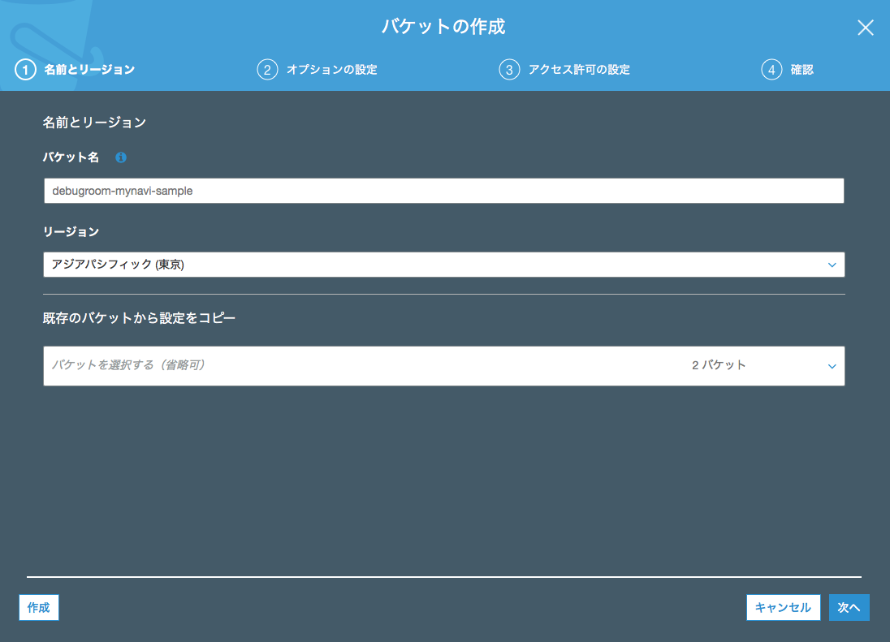
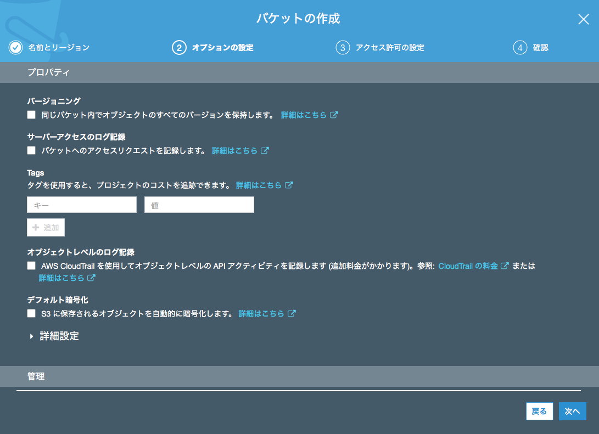
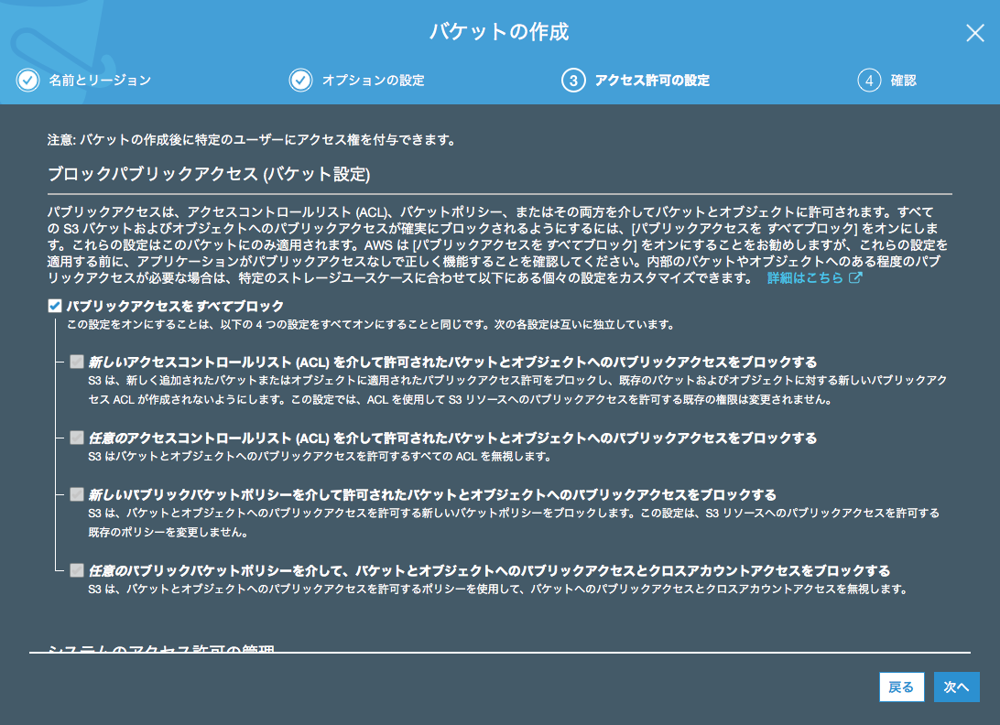
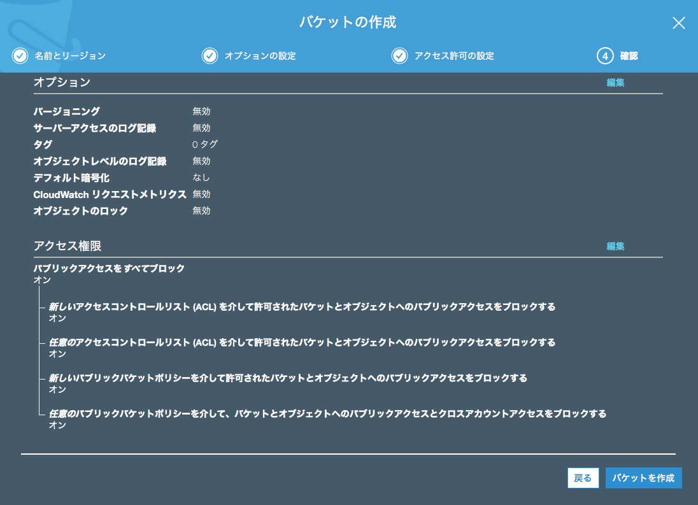
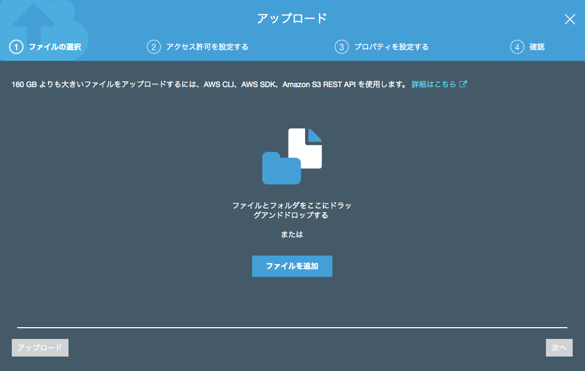
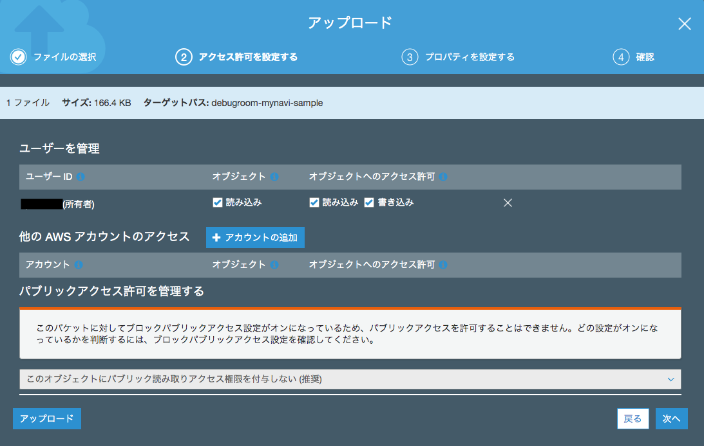
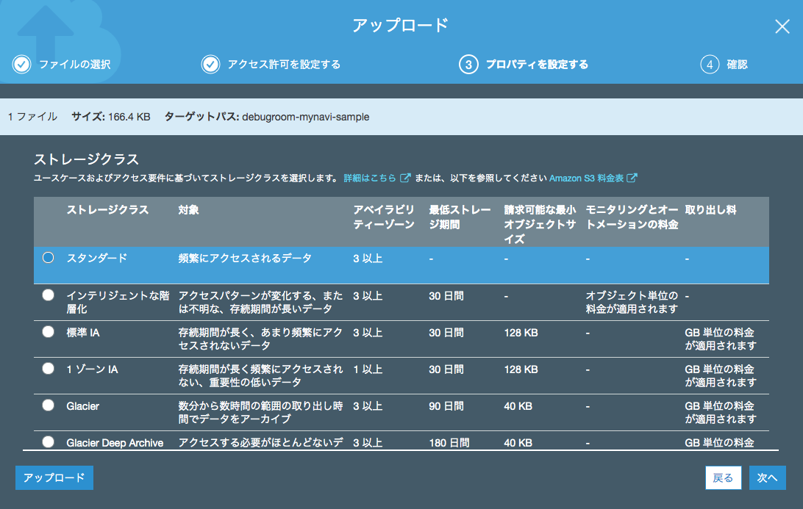
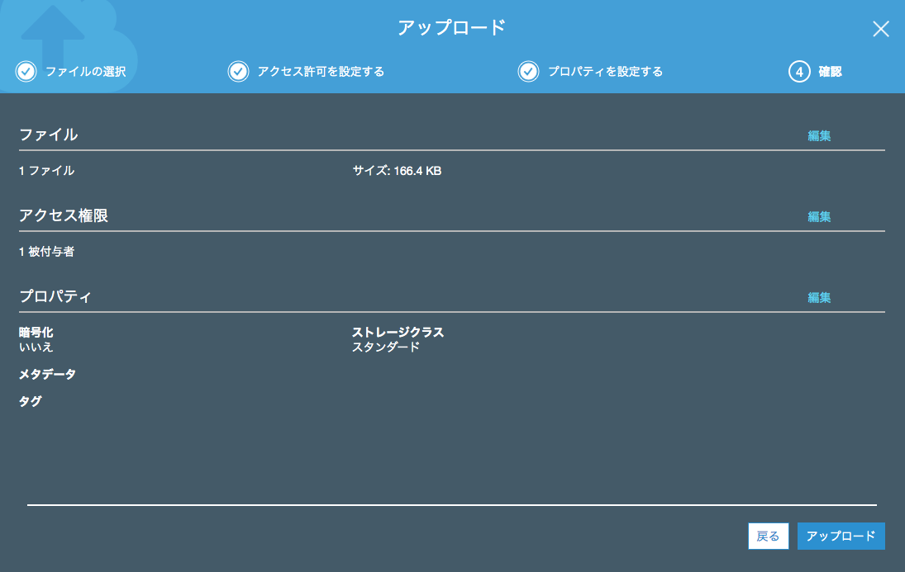

.. include:: ../module.txt

.. _section-cloud-native-s3-label1-1:

AWSで作るクラウドネイティブアプリケーションの基本
========================================================================================

.. _section-cloud-native-s3-1st-label:

Amazon S3の概要とバケットの作成・ファイルのアップロード
----------------------------------------------------------------------------------------

|br|

クラウド上のストレージとして、AWSで利用可能なAmazon S3。今回はSpring Cloud AWSを用いてAmazon S3へアクセスするSpringアプリケーションの実装方法について解説します。

本連載では、以下のステップで解説を進めていきます。

|br|

#. **Amazon S3の概要とバケットの作成・ファイルのアップロード**
#. Spring Cloud AWSを用いたアプリケーション実装(1)
#. Spring Cloud AWSを用いたアプリケーション実装(2)

|br|

なお、本連載は以下の前提知識がある開発者を想定しています。

|br|

.. list-table::
   :widths: 3, 7

   * - 対象読者
     - 前提知識

   * - エンタープライズ開発者
     - Java言語及びSpringFrameworkを使った開発に従事したことがある経験者。経験がなければ、|br|
       `こちらのチュートリアル <http://terasolunaorg.github.io/guideline/5.5.1.RELEASE/ja/Tutorial/index.html>`_ を実施することを推奨します。TERASOLUNAはSpringのベストプラクティスをまとめた開発方法論で、このチュートリアルでは、JavaやSpring Frameworkを使った開発に必要な最低限の知識を得ることができます。

   * -
     - GitHubなどのバージョン管理ツールやApache Mavenなどのライブラリ管理ツールを使った開発に従事したことがある経験者。

   * - AWS開発経験者
     - AWSアカウントをもち、コンソール上で各サービスを実行したことがある経験者

|br|

また、動作環境は以下のバージョンで実施しています。

|br|

.. list-table::
   :widths: 5, 5

   * - 動作対象
     - バージョン

   * - Java
     - 1.8

   * - Spring Boot
     - 2.1.6.RELEASE

   * - Spring Cloud AWS
     - 2.1.2.RELEASE

|br|

将来的には、AWSコンソール上の画面イメージや操作、バージョンアップによりJavaのソースコード内で使用するクラスが異なる可能性があります。

|br|

.. _section-cloud-native-s3-overview-label:

Amazon S3の概要
^^^^^^^^^^^^^^^^^^^^^^^^^^^^^^^^^^^^^^^^^^^^^^^^^^^^^^^^^^^^^^^^^^^^^^^^^^^^^^^^^^^^^^^^^^^^^^^^^^^^^^^^^

|br|

Amazon S3(Simple Storage Service)は、各リージョン毎で利用可能なWebベースのデータストレージサービスで、基本的にAWSコンソールやアプリケーションを経由して、データの保存や取出しが可能です。保存できるファイル数に限界はありませんが、
1ファイルあたり最大5TBに制限されます。

保存先のストレージの主な特徴として、データセンタ内の複数ストレージに必ず3箇所以上に複製されることにより、
きわめて高い信頼性を確保する(イレブン9のオーダー)とともにファイルにバージョンが付与可能なため、ユーザの誤操作による復元も可能となっています。
なお、S3のデータは同一リージョンの専用のデータ領域に保存されます。

データは、ユーザが最初に作成する「バケット」と呼ばれる保存場所に「オブジェクト」として、アップロードする形となります。
オブジェクトを保存するときは、オプションでスタンダード、低冗長化、標準IA、Glacierが選択できます。
発生料金は、概ね以下の通り、データ使用量に応じた従量課金性(リージョンにより単価は異なる)ですが、信頼性とアクセス頻度に応じて異なります。

|br|

.. list-table::
   :widths: 30, 30, 40
   :header-rows: 1

   * - オプション
     - 信頼性
     - 料金

   * - スタンダード
     - 99.999999999%
     - 1GBあたり３円程度
   * - 低冗長化
     - 99.99%
     - スタンダードの2/3
   * - 標準IA
     - 99.999999999%
     - スタンダードの2/3 |br| ただし、アクセス料金が高い
   * - Glacier
     - 99.999999999%
     - スタンダードの1/3 |br| データの取り出しに数時間必要。

|br|

S3へアクセスする全ての通信はSSLによって暗号化され、バケットごとにポリシーを設定でき、アクセスを詳細に制御可能です。
アップロードデータの自動暗号化機能もあり、こちらを有効化すると情報漏洩が発生してもデータの参照はできません。

また、S3はWebサーバとしても動作し、アップロードされたデータをそのままコンテンツとして保存できます。
ただし、スクリプト言語やデータベースの導入はできないため、動的なコンテンツは利用できませんが、HTMLや画像ファイルなどの静的なコンテンツならば、
信頼性が高いWebサイトをそのまま構築することが可能です。

|br|

.. _section-cloud-native-s3-create-bucket-and-upload-label:

バケットの作成とファイルのアップロード
^^^^^^^^^^^^^^^^^^^^^^^^^^^^^^^^^^^^^^^^^^^^^^^^^^^^^^^^^^^^^^^^^^^^^^^^^^^^^^^^^^^^^^^^^^^^^^^^^^^^^^^^^

|br|

まず最初にデータを保存するためのバケットを作成しましょう。AWSマネジメントコンソールからS3サービスメニューを選択し、「バケットを作成する」ボタンを押下して、バケット名とリージョンを選択します。

|br|

|br|

.. warning:: バケット名には小文字の英文字、数字およびハイフン(-)やドット(.)を含むことができますが、S3へのダイレクトアップロード時などにドットを含めるとエラーとなるため、`AWS 公式ページ「バケット命名規則」 <https://docs.aws.amazon.com/ja_jp/AmazonS3/latest/dev/BucketRestrictions.html>`_ に従って、バケット名を作成してください。なお、作成後にバケット名を変更することはできません。

|br|

オプションは今回は何も設定せず、「次へ」ボタンを押下します。

|br|

|br|

アクセス制御ではパブリックアクセスをブロックしておきます。

|br|

|br|

.. warning:: 最近では、S3のドメインを自動スキャンしてパブリックアクセスが可能なバケットに悪意のあるJavaScriptのコードを埋め込むセキュリティ攻撃が確認されているため、開発や検証用途のバケットだとしても基本的にパブリックアクセスは避けるように設定しましょう。

|br|

設定内容を確認し、「バケットを作成」ボタンを押下します。

|br|

|br|

バケットを作成できたら、ファイルをアップロードしてみましょう。作成したバケットを選択し、「アップロード」ボタンを押下します。
ダイアログが出てきたら「ファイルを追加」ボタンを押下し、ファイルを選択します。選択したら「次へ」ボタンを押下します。

|br|

|br|

.. note:: Amazon S3 では、オブジェクトのキー名に基づきバケットが仕切られるため、タイムスタンプやアルファベット順など、重複するプレフィックスを使用すると、特定のパーティションが使用される確率が高くなります。S3のリクエストのワークロードが1秒につき、100を超えるPUT、LIST、DELETE、あるいは300を超えるGETが見込まれるとき、`ガイドライン <https://docs.aws.amazon.com/AmazonS3/latest/dev/request-rate-perf-considerations.html>`_ に従い、パフォーマンスの向上のためにバケット名の先頭に異なる英数字の使用を検討しましょう。

|br|

アップロードするファイルへのアクセス権限を設定します。ここではデフォルトのまま所有者のみアクセス権限を設定しておきます。

|br|

|br|

アップロードするファイルのストレージオプションを選択します。ここでは「スタンダード」を選択します。

|br|

|br|

内容を確認したら「アップロード」ボタンを押下します。

|br|

|br|

これでファイルのアップロードができました。次回は、SpringアプリケーションでS3へアクセスする方法を説明し、実装していきます。

|br|

著者紹介
------------------------------------------------------------------

川畑 光平(KAWABATA Kohei)

.. figure:: img/aws-lambda-and-api-gateway/pic_image01.jpg

某システムインテグレータにて、金融機関システム業務アプリケーション開発・システム基盤担当を経て、現在はソフトウェア開発自動化関連の研究開発・推進に従事。

Red Hat Certified Engineer、Pivotal Certified Spring Professional、AWS Certified Solutions Architect Professional等の資格を持ち、アプリケーション基盤・クラウドなど様々な開発プロジェクト支援にも携わる。

`2019 APN AWS Top Engineers & Ambassadors <https://aws.amazon.com/jp/blogs/psa/japan-apn-ambassador-2019/>`_ 選出。

本連載記事の内容に対するご意見・ご質問は `Facebook <https://www.facebook.com/kohei.kawabata.5>`_ まで。
