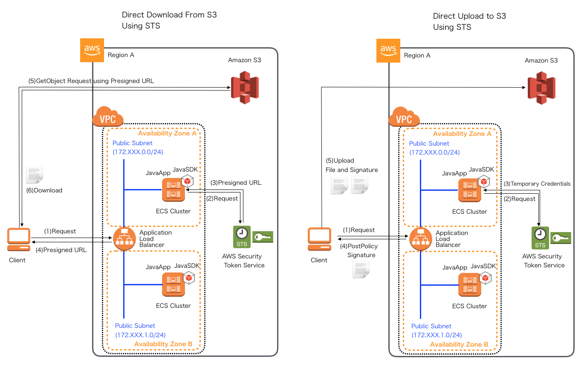

.. include:: ../module.txt

.. _section-cloud-native-s3-label-2:

AWSで作るクラウドネイティブアプリケーションの基本
========================================================================================

.. _section-cloud-native-s3-2nd-label:

Amazon S3にアクセスするSpringアプリケーション(1)
----------------------------------------------------------------------------------------

|br|

クラウド上のストレージとして、AWSで利用可能なAmazon S3。今回以降はSpring Cloud AWSを用いてAmazon S3へアクセスするSpringアプリケーションの実装方法について解説します。

|br|

#. Amazon S3の概要とバケットの作成・ファイルのアップロード
#. **Spring Cloud AWSを用いたアプリケーション実装(1)**
#. Spring Cloud AWSを用いたアプリケーション実装(2)

|br|

前回はAmazon S3の概要を説明し、バケットを作成、ファイルをアップロードしました。今回はアプリケーションにおけるS3アクセス方式について説明し、前回アップロードしたファイルにSpring Cloud AWSを使って、アクセスするアプリケーションを実装していきます。

|br|

.. _section-cloud-native-s3-access-application-implementation-label:

アプリケーションでのS3アクセス方式
^^^^^^^^^^^^^^^^^^^^^^^^^^^^^^^^^^^^^^^^^^^^^^^^^^^^^^^^^^^^^^^^^^^^^^^^^^^^^^^^^^^^^^^^^^^^^^^^^^^^^^^^^

|br|

EC2やECSなどをベースに構築したスケールイン・スケールアウトが可能なアプリケーション実行環境は(インスタンスの終了とともにデータが失われる)揮発性であるため、
従来、アプリケーションサーバのファイルシステムへアクセスして行なっていた処理はS3などの共通ストレージに対して行う方がベターです。

アプリケーションからS3へファイルをアップロード・ダウンロードする場合、大きく２つの方法があります。VPC内にあるEC2やECSなどで実行されているアプリケーション内からAmazonSDK(SoftwareDevelopersKit:要はライブラリ)を使って
S3へアクセスする方法と、AWS STS(SecurityTokenSerivce)を使って作成する一時的に有効な、署名付きURLやクレデンシャルキーなどを使って、クライアントから直接S3へアクセスする方式です。

|br|

1. VPC内のアプリケーションからSDKを使ってS3へアクセスする方法

|br|

.. figure:: img/aws-s3/S3Access.png

|br|

|br|

2. 一時的に有効な、署名付きURLやクレデンシャルキーを使って、クライアントからダイレクトアクセスする方法

|br|

|br|

アプリケーションから直接アクセスするやり方は、後述するSpring Cloud AWSなどを使用して、比較的容易に実装が可能です。反面、取り扱うファイルの量やサイズが大きくなる場合、アプリケーション自体に負荷がかかってしまうので、
2のようにクライアントから直接S3へアクセスする方式をとる方が望ましくなります。ただし、ダイレクトアクセス方式は、AWS上での一時的な認証情報取得やCORS設定、PostPolicyに施す署名のエンコード処理などでアプリケーション実装が複雑になるというデメリットがあります。
以下にポイントを整理するので、取り扱うユースケースやファイルの特性に応じて、処理を使い分けてください。

.. list-table:: 各アクセス方式のメリットデメリットと用途にマッチするユースケース
   :widths: 2, 5, 5

   * -
     - VPC内のアプリケーションからアクセス
     - 一時的に有効な、署名付きURLやクレデンシャルキーを使って、クライアントからダイレクトアクセス

   * - メリット
     - ・実装が容易 |br| ・VPC内でアクセスが完結するのでセキュリティが担保される
     - ・アプリケーションサーバに負荷がかからない |br| ・直接S3へアクセスするため、処理が高速

   * - デメリット
     - ・ファイルサイズが大きいとサーバに負荷がかかる
     - ・セキュリティ設定やアプリケーション実装が複雑 |br|

   * - ユースケース
     - ・テキストファイルなど比較的サイズが小さいものを扱う処理
     - ・画像や動画などの比較的サイズが大きいものを扱う処理 |br| ・クライアントから大量にファイルをやり取りする処理

|br|

また、前回のS3の概要でも説明した通り、S3は各リージョンごとに提供されるストレージサービスであり、
上記の構成のようにリージョンを跨がない、複数のアベイラビリティゾーンで構成されるアプリケーションであれば
いずれの方式でも特に問題はありませんが、同じアプリケーションを複数のリージョン(例えば東京と大阪)で運用する場合は
アクセスしたアプリケーションのリージョンによってファイルの有無に差が生じるため、`クロスリージョンレプリケーション <https://docs.aws.amazon.com/ja_jp/AmazonS3/latest/dev/crr.html>`_ の適用を検討しましょう。

|br|

.. _section-cloud-native-s3-access-using-spring-cloud-aws-implementation-1-label:

Spring Cloud AWSを使ったS3アクセスアプリケーション(1)
^^^^^^^^^^^^^^^^^^^^^^^^^^^^^^^^^^^^^^^^^^^^^^^^^^^^^^^^^^^^^^^^^^^^^^^^^^^^^^^^^^^^^^^^^^^^^^^^^^^^^^^^^

|br|

Spring Cloud AWSは `第12回 <https://news.mynavi.jp/itsearch/article/devsoft/4426>`_ でも説明した通り、AWSのサービスに対してサポートを提供していますが、
S3に関しては、org.springframework.core.io.ResourceLoaderを使用したBucketアクセス手段を提供しています。ResourceLoaderはSpringによって提供されている
リソースを抽象化したインターフェースで、アプリケーション上の実装でクラスパスやファイルシステム上などリソースの保存先の実体を意識せずにすみます。
S3オブジェクトに対しては、AmazonSDK上で以下のような操作がサポートされていますが、うち、Spring Cloud AWSが提供しているオブジェクト操作は以下の通りです。

|br|

.. list-table:: S3のサポートする操作
   :widths: 2, 6, 2
   :header-rows: 1

   * - S3の操作
     - 詳細
     - Spring Cloud AWSのサポート

   * - GET
     - オブジェクト全体もしくはオブジェクトの一部を取得する。バイトレンジの指定が可能。
     - ○
   * - List Key
     - プレフィックスと区切り記号でオブジェクトキーを一覧表示する。
     - ○
   * - PUT
     - オブジェクトのアップロード及び更新を行う。
     - ○
   * - DELETE
     - オブジェクトの削除を行う。
     -

|br|

その他、バケットの操作やダイレクトアップロード時に利用するAWS STSへ一時認証情報の取得処理などは、AmazonSDKのAPIを直接実行する必要があるので留意してください。
なお、Spring Cloud AWSを使ったアプリケーションの実装方法はNTTが提供する `Macchinetta Frameworkのガイドライン ファイル管理 <https://macchinetta.github.io/cloud-guideline/current/ja/AWSCollaboration/FileManagement/index.html>`_ でよく整理されています。
必要に応じて、こちらも参照してください。

本連載で実際に作成するアプリケーションでは `GitHub <https://github.com/debugroom/mynavi-sample-aws-s3>`_ 上にコミットしています。
以降に記載するソースコードでは、import文など本質的でない記述を省略している部分があるので、実行コードを作成する際は、必要に応じて適宜GitHubにあるソースコードも参照してください。

Spring Cloud AWSを使用するには、まず、Mavenプロジェクトのpom.xmlでspring-cloud-starter-awsのライブラリを定義します。
また、ファイルを画面上からアップロード・ダウンロードする処理を実装するので、以下の通り、spring-boot-starter-webおよびspring-boot-starter-tymeleafを、
ファイルの入出力処理やモデルオブジェクトを簡素化する目的で、Apacheのcommons-ioライブラリやLombokライブラリを追加します。

|br|

.. sourcecode:: xml

   <dependencies>
     <dependency>
       <groupId>org.springframework.boot</groupId>
       <artifactId>spring-boot-starter-thymeleaf</artifactId>
     </dependency>
     <dependency>
       <groupId>org.springframework.boot</groupId>
       <artifactId>spring-boot-starter-web</artifactId>
     </dependency>
     <dependency>
       <groupId>org.springframework.cloud</groupId>
       <artifactId>spring-cloud-starter-aws</artifactId>
     </dependency>
     <dependency>
       <groupId>org.projectlombok</groupId>
       <artifactId>lombok</artifactId>
       <optional>true</optional>
     </dependency>
     <dependency>
       <groupId>commons-io</groupId>
       <artifactId>commons-io</artifactId>
       <version>2.6</version>
      </dependency>
   </dependencies>

|br|

なお、thymeleafテンプレートエンジンに関する説明は省略しますが、必要に応じて、`Thymeleaf公式ドキュメント <https://www.thymeleaf.org/documentation.html>`_ や
`Macchinetta Framework テンプレートエンジン <https://macchinetta.github.io/server-guideline-thymeleaf/current/ja/ArchitectureInDetail/WebApplicationDetail/Thymeleaf.html>`_ を参照してください。

|br|

それでは、アプリケーションの実装に進みます。今回作成するアプリケーションは以下の構成です。

.. list-table:: アプリケーション
   :widths: 3, 6, 1

   * - コンポーネント
     - 説明
     - 必須

   * - WebApp
     - SpringBootアプリケーションを実行する起動クラス
     - ◯

   * - MvcConfig
     - SpringMVCの設定を行うクラス
     - ◯

   * - S3Config
     - S3への接続に関する設定クラス
     - ◯

   * - SampleController
     - ダウンロード・アップロードを呼び出し画面もしくはJSONレスポンスを返却するController
     - ◯

   * - XxxxxHelper
     - ダウンロード・アップロード各処理を実装したクラス。なおHelperとは `TERASOLUNAのガイドライン Helper <http://terasolunaorg.github.io/guideline/5.5.1.RELEASE/ja/Overview/ApplicationLayering.html#helper>`_ と同様、Controllerの複雑化を避けるために補助的に作成するクラスです。
     - ◯

|br|

以降、各々のクラスについて解説を進めていきますが、事前にAWSコンソールでアプリケーション用のユーザを作成し、 `AWS公式ページ「設定ファイルと認証情報ファイル」 <https://docs.aws.amazon.com/ja_jp/cli/latest/userguide/cli-configure-files.html>`_ を参考に
ユーザホームフォルダに.awsディレクトリを作成し、credentialというファイル名で、CSV形式の認証キーに記載しているユーザ認証情報を、以下の形式で保存してください。

|br|

.. sourcecode:: bash

   [default]
   aws_access_key_id=XXXXXXXXXXXXXXXX
   aws_secret_access_key=YYYYYYYYYYYYYYYYYYYYYYYYYYYYY

|br|

また、上記のクレデンシャルをもつユーザはS3への接続権限を持つ必要があります。以下のように、AWSコンソールで「IAM」サービスメニューから、ユーザにS3のアクセス権限を付与しておいてください。

|br|

|br|

それでは、実装していくクラスを説明します。まず、最初にSpringBoot起動クラス及び、各種設定クラスです。
@SpringBootApplicaitonアノテーションが付与された起動クラスは、同一パッケージにある@Configurationアノテーションが付与された設定クラス及び、
設定クラス内で@ComponentScanされたパッケージにあるクラスを読み取ります。今回は目的に応じて以下の2つに分類して設定クラスを作成します。

* SpringMVCの設定クラス：MvcConfigクラス
* S3の接続を行う設定クラス：S3Configクラス

設定クラスは必ずしも複数である必要はなく一つにまとめても動作上問題ありませんが、クラス名と役割を対応づけて作成していた方が、
後々設定内容を混乱することなく、クラス名から識別できてベターです。

|br|

.. sourcecode:: java

   package org.debugroom.mynavi.sample.aws.s3.config;

   import org.springframework.boot.SpringApplication;
   import org.springframework.boot.autoconfigure.SpringBootApplication;

   @SpringBootApplication
   public class WebApp {
       public static void main(String[] args) {
           SpringApplication.run(WebApp.class, args);
       }
   }

|br|

同一パッケージに配置するMvcConfigクラスでは、HTMLやCSSなどの静的リソースのURLと実際のリソースの物理配置の対応づけの定義をResourceHandlerRegistryに追加し、
Controller、Helperクラスを読み取るために、ComponentScanアノテーションに該当のパッケージを指定しておきます。また、今回は、
S3から取得した画像ファイルおよびテキストデータを返却するので、必要なMessageConverterを追加します。

|br|

.. sourcecode:: java

   package org.debugroom.mynavi.sample.aws.s3.config;

   // omit

   import org.springframework.context.annotation.Bean;
   import org.springframework.context.annotation.ComponentScan;
   import org.springframework.context.annotation.Configuration;
   import org.springframework.http.MediaType;
   import org.springframework.http.converter.BufferedImageHttpMessageConverter;
   import org.springframework.http.converter.ByteArrayHttpMessageConverter;
   import org.springframework.http.converter.HttpMessageConverter;
   import org.springframework.http.converter.StringHttpMessageConverter;
   import org.springframework.http.converter.json.MappingJackson2HttpMessageConverter;
   import org.springframework.web.servlet.config.annotation.ResourceHandlerRegistry;
   import org.springframework.web.servlet.config.annotation.ViewControllerRegistry;
   import org.springframework.web.servlet.config.annotation.WebMvcConfigurer;

   @ComponentScan("org.debugroom.mynavi.sample.aws.s3.app.web")
   @Configuration
   public class MvcConfig implements WebMvcConfigurer {

      @Override
      public void addResourceHandlers(ResourceHandlerRegistry registry) {
          registry.addResourceHandler("/static/**")
             .addResourceLocations("classpath:/static/");
      }

      @Override
      public void configureMessageConverters(List<HttpMessageConverter<?>> converters) {
          converters.add(new BufferedImageHttpMessageConverter());
          converters.add(byteArrayHttpMessageConverter());
          converters.add(new StringHttpMessageConverter());
          converters.add(new MappingJackson2HttpMessageConverter());
      }

      @Bean
      public ByteArrayHttpMessageConverter byteArrayHttpMessageConverter() {
          ByteArrayHttpMessageConverter arrayHttpMessageConverter = new ByteArrayHttpMessageConverter();
          arrayHttpMessageConverter.setSupportedMediaTypes(getSupportedMediaTypes());
          return arrayHttpMessageConverter;
      }

      private List<MediaType> getSupportedMediaTypes() {
          List<MediaType> list = new ArrayList<MediaType>();
          list.add(MediaType.IMAGE_JPEG);
          list.add(MediaType.IMAGE_PNG);
          list.add(MediaType.APPLICATION_OCTET_STREAM);
          return list;
      }

   }

|br|

次に、S3への接続情報を設定するS3Configですが、AmazonSDKで提供されているAmazonS3をBean定義するだけでOKです。

|br|

.. sourcecode:: java

   package org.debugroom.mynavi.sample.aws.s3.config;

   import com.amazonaws.services.s3.AmazonS3;
   import com.amazonaws.services.s3.AmazonS3ClientBuilder;
   import org.springframework.context.annotation.Bean;
   import org.springframework.context.annotation.Configuration;

   @Configuration
   public class S3Config {

       @Bean
       public AmazonS3 amazonS3(){
           return AmazonS3ClientBuilder.standard().build();
       }

   }

|br|

よく古いWeb記事でAccessKeyなどをプロパティファイルに設定している例を見かけますが、この方法は、AWSとしては非推奨であり、
本番環境ではEC2やECSが持つインスタンスプロファイルから、開発環境は~/.awsフォルダに保存してあるCredential情報等からアクセスキーを取得するのがベターです。
詳細は `第17回 <https://news.mynavi.jp/itsearch/article/cloud/4506>`_ の末端の脚注「AmazonDynamoDBClientBuilderについて」でも記載していますが、
Spring Cloud AWSは、com.amazonaws.auth.DefaultAWSCredentialsProviderChainを利用して、AWSの認証情報を取得します。
DefaultAWSCredentialsProviderChainでは、以下の順序で情報を取得していく実装になっています。

#. 環境変数AWS_ACCESS_KEY_IDとAWS_SECRET_ACCESS_KEY
#. システムプロパティaws.accessKeyIdとaws.secretKey
#. ユーザのAWS認証情報ファイル
#. AWSインスタンスプロファイルの認証情報

アクセスキーなどは設定せずに、開発端末下だけで有効されるapplication-dev.ymlで、cloud.aws.credentials.profileに空白を、instaceProfileをfalseにしておきましょう。
また、リージョンの自動検出をOFFにするよう、cloud.aws.region.autoにfalseを、今回アプリケーションが実行されるリージョンをcloud.aws.region.staticに手動設定しておきます。

|br|

applicaiton-dev.yml

.. sourcecode:: bash

   cloud:
     aws:
       credentials:
         profileName:
         instanceProfile: false
       region:
         auto: false
         static: ap-northeast-1

|br|

なお、アプリケーション起動時に、Spring Cloud AWSのAuto-configurationであるContextStackAutoConfigurationによって、 アプリケーションのスタック名自動検出が有効になり、
AWS CloudFormationのスタックが見つからない場合、 AmazonServiceExceptionが発生しアプリケーションが起動しなくなります。そのため、application.ymlで、cloud.aws.stack.auto = falseを設定し、スタックの自動検出を無効化することでエラーを回避します。

|br|

application.yml

.. sourcecode:: bash

   cloud:
     aws:
       stack:
         auto: false

|br|

ここまで設定クラスの実装まで完了しました。次回はアプリケーションのSpring Cloud AWSを使用したアプリケーションのS3アクセス処理実装を進めていきます。

|br|

著者紹介
------------------------------------------------------------------

川畑 光平(KAWABATA Kohei)

.. figure:: img/aws-lambda-and-api-gateway/pic_image01.jpg

某システムインテグレータにて、金融機関システム業務アプリケーション開発・システム基盤担当を経て、現在はソフトウェア開発自動化関連の研究開発・推進に従事。

Red Hat Certified Engineer、Pivotal Certified Spring Professional、AWS Certified Solutions Architect Professional等の資格を持ち、アプリケーション基盤・クラウドなど様々な開発プロジェクト支援にも携わる。

`2019 APN AWS Top Engineers & Ambassadors <https://aws.amazon.com/jp/blogs/psa/japan-apn-ambassador-2019/>`_ 選出。

本連載記事の内容に対するご意見・ご質問は `Facebook <https://www.facebook.com/kohei.kawabata.5>`_ まで。
