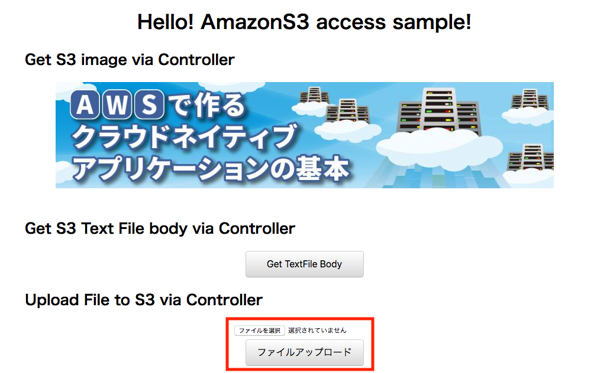
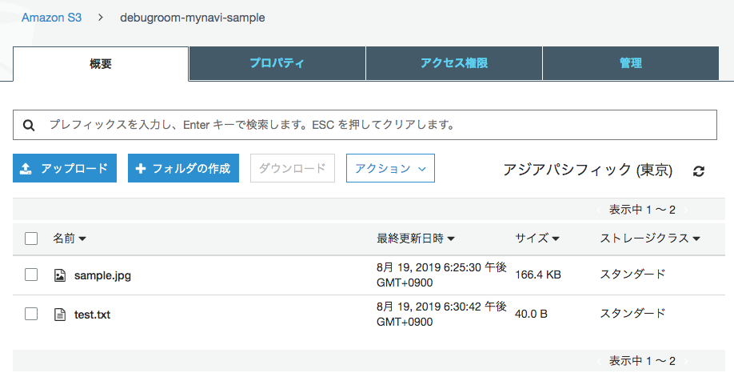
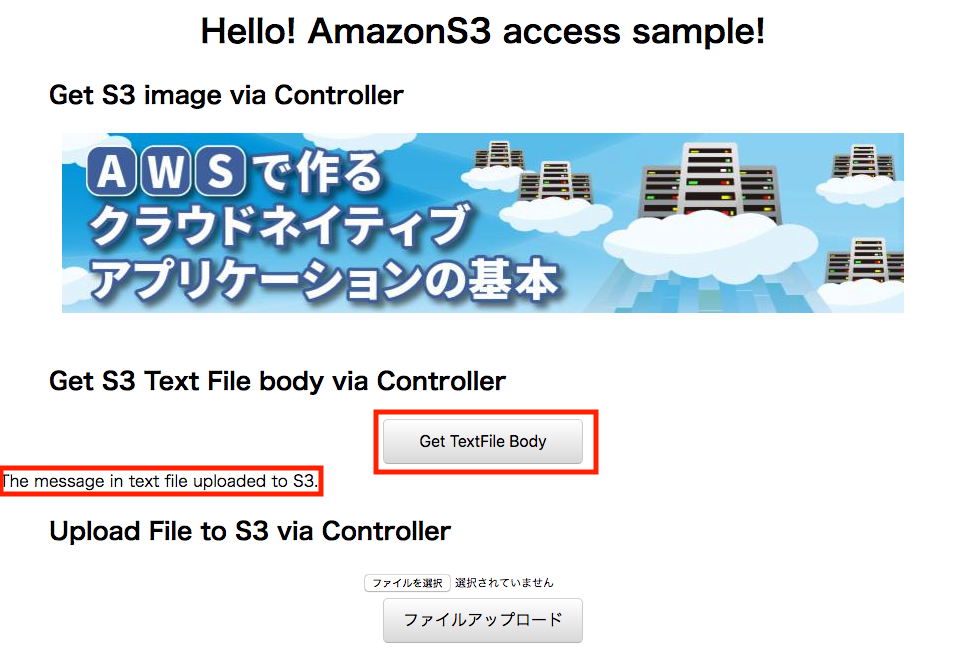

.. include:: ../module.txt

.. _section-cloud-native-s3-label-3:

AWSで作るクラウドネイティブアプリケーションの基本
========================================================================================

.. _section-cloud-native-nosql-3rd-label:

Amazon S3にアクセスするSpringアプリケーション(2)
----------------------------------------------------------------------------------------

|br|

クラウド上のストレージとして、AWSで利用可能なAmazon S3。今回以降はSpring Cloud AWSを用いてAmazon S3へアクセスするSpringアプリケーションの実装方法について解説します。

|br|

#. Amazon S3の概要とバケットの作成・ファイルのアップロード
#. Spring Cloud AWSを用いたアプリケーション実装(1)
#. **Spring Cloud AWSを用いたアプリケーション実装(2)**

|br|

前回、 :ref:`section-cloud-native-s3-access-using-spring-cloud-aws-implementation-1-label` に引き続き、 Spring Cloud AWSでS3へアクセスするアプリケーションを実装しています。

|br|

.. _section-cloud-native-spring-data-dynamodb-implementation-2-label:

Spring Cloud AWSを使ったS3アクセスアプリケーション(2)
"""""""""""""""""""""""""""""""""""""""""""""""""""""""""""""""""""""""""""""""""""""""""

|br|

アプリケーションコンポーネントの実装に移ります。Controllerでは、以下3種類の処理を実装します。

* S3のバケット内にアップロードしている画像ファイル「sample.jpg」を取得し、MediaType.IMAGE_JPEG_VALUEとして、画像データをレスポンスとして返却する処理※
* S3のバケット内にアップロードしているテキストファイル「test.txt」を取得し、中身の文字列をレスポンスとして返却する処理
* 画面からアップロードされたマルチパート形式のファイルをS3バケットに保存し、「uploadResult.html」へリダイレクトする処理

|br|

※今回は比較的小さいファイルサイズの画像を扱うことを想定して、Controllerから取得する例を実装しています。

|br|

.. sourcecode:: java

   package org.debugroom.mynavi.sample.aws.s3.app.web;

   import java.awt.image.BufferedImage;
   // omit

   import org.springframework.http.HttpStatus;
   import org.springframework.http.MediaType;
   import org.springframework.http.ResponseEntity;
   import org.springframework.stereotype.Controller;
   import org.springframework.web.bind.annotation.GetMapping;
   import org.springframework.web.bind.annotation.PostMapping;
   import org.springframework.web.bind.annotation.ResponseBody;

   @Controller
   public class SampleController {

       @Autowired
       S3DownloadHelper s3DownloadHelper;

       @Autowired
       S3UploadHelper s3UploadHelper;

       // omit

       @GetMapping(value = "/image",
            headers = "Accept=image/jpeg, image/jpg, image/png, image/gif",
            produces = {MediaType.IMAGE_JPEG_VALUE, MediaType.IMAGE_PNG_VALUE, MediaType.IMAGE_GIF_VALUE})
       @ResponseBody
       public ResponseEntity<BufferedImage> getImage(){
           return ResponseEntity.ok().body(
                s3DownloadHelper.getImage("sample.jpg"));
       }

       @GetMapping("getTextFileBody")
       @ResponseBody
       public ResponseEntity<String> getTextFileBody(){
           return ResponseEntity.ok().body(
                s3DownloadHelper.getTextFileBody("test.txt"));
       }

       @PostMapping("upload")
       public String upload(FileUploadForm fileUploadModel){
           s3UploadHelper.saveFile(fileUploadModel.getUploadFile());
           return "redirect:/uploadResult.html";
       }

       // omit

   }

|br|

ControllerからS3でのダウンロード、アップロードを行う処理をHelperとして実装します。
ダウンロード処理では、org.springframework.core.io.ResourceLoaderで、
S3のバケットプレフィックスを指定してオブジェクトキーを指定し、InputStreamとして読み込みを行います。

|br|

.. sourcecode:: java

   package org.debugroom.mynavi.sample.aws.s3.app.web.helper;

   import javax.imageio.ImageIO;
   import java.awt.image.BufferedImage;
   import java.io.IOException;
   import java.io.InputStream;

   import org.apache.commons.io.IOUtils;

   import org.springframework.beans.factory.annotation.Autowired;
   import org.springframework.beans.factory.annotation.Value;
   import org.springframework.core.io.Resource;
   import org.springframework.core.io.ResourceLoader;
   import org.springframework.stereotype.Component;

   @Component
   public class S3DownloadHelper{

       private static final String S3_BUCKET_PREFIX = "s3://";
       private static final String DIRECTORY_DELIMITER = "/";

       @Value("${bucket.name}")
       private String bucketName;

       @Autowired
       ResourceLoader resourceLoader;

       public BufferedImage getImage(String imageFilePath){
           Resource resource = resourceLoader.getResource(
             new StringBuilder()
             .append(S3_BUCKET_PREFIX)
             .append(bucketName)
             .append(DIRECTORY_DELIMITER)
             .append(imageFilePath)
             .toString());
           BufferedImage image = null;
           try(InputStream inputStream = resource.getInputStream()){
               image = ImageIO.read(inputStream);
           }catch (IOException e){
               e.printStackTrace();
           }
           return image;
       }

       public String getTextFileBody(String textFilePath){
           Resource resource = resourceLoader.getResource(
             new StringBuilder()
             .append(S3_BUCKET_PREFIX)
             .append(bucketName)
             .append(DIRECTORY_DELIMITER)
             .append(textFilePath)
             .toString());
           String textBody = null;
           try(InputStream inputStream = resource.getInputStream()){
               textBody = IOUtils.toString(inputStream, "UTF-8");
           }catch (IOException e){
               e.printStackTrace();
           }
           return textBody;
       }
   }

|br|

アップロード処理は同じくResourceLoaderを経由して、S3のバケットプレフィックスを保存したいオブジェクトキーと組み合わせ、
WritableResourceとして取得し、OutputStreamにデータを保存します。その他、バケット上のディレクトリを含めた、
オブジェクキーの有無はResourcePatternResolverを使って検索ができますが、ディレクトリの作成はSDKのAmazonS3を使って操作を行う必要があります。

|br|

.. sourcecode:: java

   package org.debugroom.mynavi.sample.aws.s3.app.web.helper;

   // omit

   import com.amazonaws.services.s3.AmazonS3;
   import com.amazonaws.services.s3.model.ObjectMetadata;
   import com.amazonaws.services.s3.model.PutObjectRequest;

   import org.apache.commons.io.IOUtils;

   import org.springframework.beans.factory.annotation.Autowired;
   import org.springframework.beans.factory.annotation.Value;
   import org.springframework.core.io.Resource;
   import org.springframework.core.io.ResourceLoader;
   import org.springframework.core.io.WritableResource;
   import org.springframework.core.io.support.ResourcePatternResolver;
   import org.springframework.stereotype.Component;
   import org.springframework.web.multipart.MultipartFile;

   @Component
   public class S3UploadHelper{

       private static final String S3_BUCKET_PREFIX = "s3://";
       private static final String DIRECTORY_DELIMITER = "/";

       @Value("${bucket.name}")
       private String bucketName;

       @Autowired
       ResourceLoader resourceLoader;

       @Autowired
       ResourcePatternResolver resourcePatternResolver;

       @Autowired
       AmazonS3 amazonS3;

       public String saveFile(MultipartFile multipartFile){
           String objectKey = new StringBuilder()
             .append(S3_BUCKET_PREFIX)
             .append(bucketName)
             .append(DIRECTORY_DELIMITER)
             .append(multipartFile.getOriginalFilename())
             .toString();
           WritableResource writableResource = (WritableResource)resourceLoader.getResource(objectKey);
           try(InputStream inputStream = multipartFile.getInputStream();
                   OutputStream outputStream = writableResource.getOutputStream()){
               IOUtils.copy(inputStream, outputStream);
           }catch (IOException e){
               e.printStackTrace();
           }
           return objectKey;
        }

       public boolean existsDirectory(String directoryPath){
           try{
               List<Resource> resourceList = Arrays.asList(
                 resourcePatternResolver.getResources(directoryPath + "/**"));
               if (resourceList.size() == 0){
                   return false;
               }
           }catch (IOException e){
               e.printStackTrace();
           }
           return true;
       }

       public void createDirectory(String directoryPath){
           ObjectMetadata objectMetadata = new ObjectMetadata();
           try(InputStream emptyContent = new ByteArrayInputStream(new byte[0]);){
               PutObjectRequest putObjectRequest = new PutObjectRequest(
                   bucketName, directoryPath, emptyContent, objectMetadata);
               amazonS3.putObject(putObjectRequest);
       }catch (IOException e){
           e.printStackTrace();;
       }
   }

|br|

実装が完了したら、画面を作成し、実際に画像がダウンロードされるかを確認し、アップロード処理を実行してみましょう。
今回アップロードしていた「sample.jpg」は当連載のバナー画像であり、「test.txt」をアップロードして、
「Get TextFile Body」ボタンを押して、その内容を取得してみます。

|br|

|br|

ファイルがアップロードされていることが確認できます。

|br|

|br|

アップロードしたファイルを取得します。

|br|

|br|

このように、S3にアクセスしてダウンロード・アップロードするアプリケーションをSpring Cloud AWSを用いて簡単に実装することができます。
AWS上に構築するクラウドネイティブなアプリケーションは、データ保存にS3を利用することで、可用性・信頼性が高い構成が可能です。
なお、署名つきURLや、一時認証情報を使って、クライアントからS3に直接ファイルをダウンロード・アップロードする方法については、
今回GitHub上にサンプル実装していますが、AWS上のIAMアクセスロール設定やサーバ側のアプリケーション実装が複雑で基本の範疇を越えるため、
詳細な解説は発展編へ譲りたいと思います。

|br|

次回は、基本編の最終になりますが、AmazonSQSを使ったSpringアプリケーション(オンライン・バッチ)の実装方法を解説します。

|br|

著者紹介
------------------------------------------------------------------

川畑 光平(KAWABATA Kohei)

.. figure:: img/aws-lambda-and-api-gateway/pic_image01.jpg
   :scale: 100%

某システムインテグレータにて、金融機関システム業務アプリケーション開発・システム基盤担当を経て、現在はソフトウェア開発自動化関連の研究開発・推進に従事。

Red Hat Certified Engineer、Pivotal Certified Spring Professional、AWS Certified Solutions Architect Professional等の資格を持ち、アプリケーション基盤・クラウドなど様々な開発プロジェクト支援にも携わる。

`2019 APN AWS Top Engineers & Ambassadors <https://aws.amazon.com/jp/blogs/psa/japan-apn-ambassador-2019/>`_ 選出。

本連載記事の内容に対するご意見・ご質問は `Facebook <https://www.facebook.com/kohei.kawabata.5>`_ まで。
