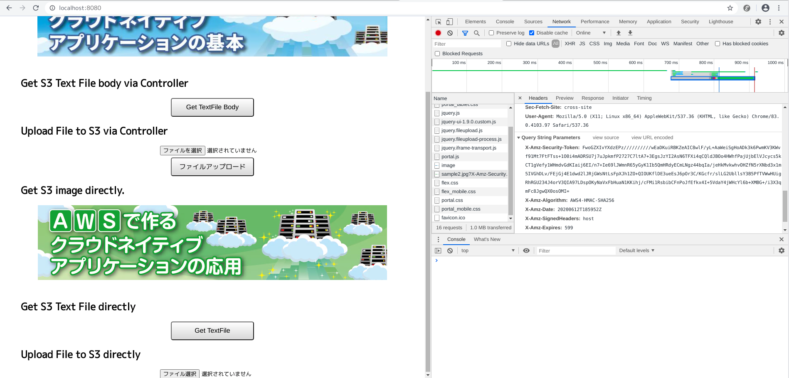

.. include:: ../module.txt

.. _section-cloud-native-s3-5th-label:

【第2回】AmazonS3へダイレクトアクセスするアプリケーション実装(5)
----------------------------------------------------------------------------------------

|br|

クラウド上のストレージとして、AWSで利用可能なAmazon S3。今回以降はAmazon S3へクライアントからダイレクトアクセスするSpringアプリケーションの実装方法について解説します。

前回は、S3へダイレクトアクセスする方式や、AWSリソースのアクセスを一時的に許可する認証情報を作成するためのサービスであるSTSを説明し、一時的な認証情報を発行するためのIAMロールや、S3へのバケットアクセスポリシーを作成しました。
続く今回は、署名付きURLを使ってS3にあるファイルへダイレクトダウンロードするアプリケーションを実装していきます。

|br|

.. figure:: img/aws-s3/S3DirectAccessNewIcon.png

|br|

.. _section-cloud-native-s3-direct-download-implementation-1-label:

署名付きURLを使ってS3にあるファイルへダイレクトダウンロードするアプリケーション
^^^^^^^^^^^^^^^^^^^^^^^^^^^^^^^^^^^^^^^^^^^^^^^^^^^^^^^^^^^^^^^^^^^^^^^^^^^^^^^^^^^^^^^^^^^^^^^^^^^^^^^^^

|br|

ベースとなるアプリケーションは `基本編第26回 <https://news.mynavi.jp/itsearch/article/cloud/4615>`_ で実装したものと同様のものを使用します。
アプリケーション内からS3へアクセスを行う場合は、Spring Cloud AWSを使ってResourceLoader経由でもデータ取得できましたが、
バケットの操作やダイレクトアップロード時に利用するAWS STSへ一時認証情報の取得処理などは、AmazonSDKのAPIを直接実行する必要があり、今回の実装ではSpring Cloud AWSのライブラリは使用しません。

本連載で実際に作成するアプリケーションでは `GitHub <https://github.com/debugroom/mynavi-sample-aws-s3>`_ 上にコミットしています。
以降に記載するソースコードでは、import文など本質的でない記述を省略している部分があるので、実行コードを作成する際は、必要に応じて適宜GitHubにあるソースコードも参照してください。

今回のアプリケーション実装では、ライブラリとしてSTSやIAMのSDKライブラリが必要になります。基本編で定義した、spring-boot-starter-webなどのライブラリに加えて、以下のSDKライブラリ定義をpom.xmlに追加しましょう。

|br|

.. sourcecode:: xml

   <dependencies>
     <dependency>
       <groupId>com.amazonaws</groupId>
       <artifactId>aws-java-sdk-sts</artifactId>
       <version>1.11.415</version>
     </dependency>
     <dependency>
       <groupId>com.amazonaws</groupId>
       <artifactId>aws-java-sdk-iam</artifactId>
       <version>1.11.415</version>
     </dependency>
   </dependencies>

|br|

それでは、アプリケーションの実装の解説に進みます。基本編で作成していたアプリケーションは以下の構成でしたが、今回はダイレクトアクセスを実現するS3DirectDownloadHelperクラスを追加して、SampleControllerに実行するこのHelperを呼び出す処理を適宜追加します。

.. list-table:: アプリケーション
   :widths: 3, 6, 1

   * - コンポーネント
     - 説明
     - 必須

   * - WebApp
     - SpringBootアプリケーションを実行する起動クラス
     - ◯

   * - MvcConfig
     - SpringMVCの設定を行うクラス
     - ◯

   * - S3Config
     - S3への接続に関する設定クラス
     - ◯

   * - SampleController
     - ダウンロード・アップロードを呼び出し画面もしくはJSONレスポンスを返却するController
     - ◯

   * - XxxxxHelper
     - ダウンロード・アップロード各処理を実装したクラス。なおHelperとは `TERASOLUNAのガイドライン Helper <http://terasolunaorg.github.io/guideline/5.5.1.RELEASE/ja/Overview/ApplicationLayering.html#helper>`_ と同様、Controllerの複雑化を避けるために補助的に作成するクラスです。
     - ◯

|br|

以降、解説を進めていきますが、前回説明した通り、事前にAWSコンソールでアプリケーション用のユーザを作成しておき、 `AWS公式ページ「設定ファイルと認証情報ファイル」 <https://docs.aws.amazon.com/ja_jp/cli/latest/userguide/cli-configure-files.html>`_ を参考に
ユーザホームフォルダに.awsディレクトリを作成し、credentialというファイル名で、CSV形式の認証キーに記載しているユーザ認証情報を、以下の形式で保存してください。

|br|

.. sourcecode:: bash

   [default]
   aws_access_key_id=XXXXXXXXXXXXXXXX
   aws_secret_access_key=YYYYYYYYYYYYYYYYYYYYYYYYYYYYY

|br|

それでは、実装していくHelperクラスを説明します。S3へのダイレクトダウンロードアクセスは一時的にアクセスが可能な署名付きURLを発行して、
それをブラウザなどのクライアント側へ渡すことで実現します。Helperクラス内でこの署名付きURLを生成する処理を実装しますが、(a)HTMLのimg要素等からアクセスされる場合と、(b)ブラウザからファイルダウンロードのような形で取得する場合とで少々実装が異なります。
また、(c)JavaScriptからXMLHttpRequestなどを使ってアクセスを行う場合、CORS(Cross Origin Resource Sharing)の設定をS3に行う必要があります。(c)は次回ダイレクトアップロード時に改めて解説しますが、
今回はサーバサイド側で(a)と(b)の場合で分けて、署名付きURLを取得する処理を実装してみましょう。

|br|

.. note:: CORSについて

   ブラウザには、XSS(Cross Site Scripting:クロスサイトスクリプティング)やCSRF(Cross Site Request Forgeries:クロスサイトリクエストフォージェリ)といったセキュリティ脅威に対する対策として、開いているドメイン(http://exampleA.com)とは異なるドメイン(http://exampleB.com)へのアクセスを制御する仕組みがあり、
   (`同一オリジンポリシー <https://developer.mozilla.org/ja/docs/Web/Security/Same-origin_policy#Cross-origin_network_access>`_ と呼びます)、CORSはクロスドメインでのアクセスを安全に実行するための仕様です。

|br|

.. sourcecode:: java

   package org.debugroom.mynavi.sample.aws.s3.app.web.helper;

   // omit

   import com.amazonaws.HttpMethod;
   import com.amazonaws.auth.STSAssumeRoleSessionCredentialsProvider;
   import com.amazonaws.auth.policy.Policy;
   import com.amazonaws.auth.policy.Statement;
   import com.amazonaws.auth.policy.actions.S3Actions;
   import com.amazonaws.services.identitymanagement.AmazonIdentityManagementClientBuilder;
   import com.amazonaws.services.identitymanagement.model.GetRoleRequest;
   import com.amazonaws.services.s3.AmazonS3;
   import com.amazonaws.services.s3.AmazonS3ClientBuilder;
   import com.amazonaws.services.s3.model.GeneratePresignedUrlRequest;
   import com.amazonaws.services.s3.model.ResponseHeaderOverrides;

   import org.springframework.beans.factory.InitializingBean;
   import org.springframework.beans.factory.annotation.Value;

   // omit

   @Component
   public class S3DirectDownloadHelper implements InitializingBean {               // …(A)

       private static final String RESOURCE_ARN_PREFIX = "arn:aws:s3:::";
       private static final String DIRECTORY_DELIMITER = "/";

       @Value("${bucket.name}")
       private String bucketName;

       @Value("${sts.min.duration.minutes}")
       private int stsMinDurationMinutes;

       @Value("${s3.download.role.name}")
       private String roleName;                                                    // …(B)
       @Value("${s3.download.role.session.name}")
       private String roleSessionName;                                             // …(C)
       @Value("${s3.download.duration.seconds}")
       private int durationSeconds;                                                // …(D)
       private String roleArn;                                                     // …(E)

       public URL getPresignedUrl(String filePath){                                // …(F)
           AmazonS3 amazonS3 = getS3ClientWithDownloadPolicy(filePath);
           Date expiration = Date.from(ZonedDateTime.now().plusSeconds(durationSeconds).toInstant());
           return amazonS3.generatePresignedUrl(bucketName, filePath, expiration); // …(G)
       }

       public URL getDownloadPresignedUrl(String filePath){                        // …(H)
           AmazonS3 amazonS3 = getS3ClientWithDownloadPolicy(filePath);
           Date expiration = Date.from(ZonedDateTime.now().plusSeconds(durationSeconds).toInstant());
           String fileName = StringUtils.substringAfterLast(filePath, DIRECTORY_DELIMITER);
           ResponseHeaderOverrides responseHeaderOverrides = new ResponseHeaderOverrides();
           responseHeaderOverrides.withContentDisposition(new StringBuilder()
             .append("attachment;filename=")
             .append("".equals(fileName) ? filePath : fileName)
             .toString());                                                         // …(I)
           GeneratePresignedUrlRequest generatePresignedUrlRequest
             = new GeneratePresignedUrlRequest(bucketName, filePath, HttpMethod.GET);
           generatePresignedUrlRequest.withExpiration(expiration);
           generatePresignedUrlRequest.withResponseHeaders(responseHeaderOverrides);
           return amazonS3.generatePresignedUrl(generatePresignedUrlRequest);      // …(J)
       }

       private AmazonS3 getS3ClientWithDownloadPolicy(String objectKey){           // …(K)
           // Create ARN for download S3 Object.
           String resourceArn = new StringBuilder()
             .append(RESOURCE_ARN_PREFIX)
             .append(bucketName)
             .append(DIRECTORY_DELIMITER)
             .append(objectKey)
             .toString();
           // Create IAM Policy provided temporary security credentials.
           Statement statement = new Statement(Statement.Effect.Allow)
             .withActions(S3Actions.GetObject)
             .withResources(new com.amazonaws.auth.policy.Resource(resourceArn));
           String iamPolicy = new Policy().withStatements(statement).toJson();     // …(L)

           // return S3Client with setting above iam policy.
           return AmazonS3ClientBuilder.standard()
             .withCredentials(new STSAssumeRoleSessionCredentialsProvider
                     .Builder(roleArn, roleSessionName)
                     .withRoleSessionDurationSeconds(
                             (int)TimeUnit.MINUTES.toSeconds(stsMinDurationMinutes))
                     .withScopeDownPolicy(iamPolicy)
                     .build())
             .build();                                                             // …(M)
       }

       @Override
       public void afterPropertiesSet() throws Exception {                         // …(N)
           GetRoleRequest getRoleRequest = new GetRoleRequest().withRoleName(roleName);
           roleArn = AmazonIdentityManagementClientBuilder.standard().build()
             .getRole(getRoleRequest).getRole().getArn();                          // …(O)
       }

    }

|br|

S3DirectDownloadHelperクラスコードの説明は以下の通りです。

|br|

.. list-table:: S3DirectDownloadHelperクラスコードの説明
   :widths: 1, 19

   * - 項番
     - 説明

   * - (A)
     - org.springframework.beans.factory.InitializingBeanインターフェースを実装します。これにより、(N)でオーバーライドしたafterPropertiesSet()メソッドがSpringBootの起動時、application.ymlに記載したプロパティが読み込まれた後にコールされることになります。

   * - (B)
     - application.ymlに前回作成したIAMロール名を記載しておき、@Valueでインジェクションします。

   * - (C)
     - application.ymlにRoleSessionNameを記載しておき、@Valueでインジェクションします。RoleSessionNameはIAMロールを利用したユーザとしてCloudTrailなどで表示できます。

   * - (D)
     - application.ymlにダウンロードするリソースへのアクセス継続時間を秒で設定しておき、durationSecondsとして、@Valueでインジェクションします。

   * - (E)
     - (N)で前回作成したIAMロール名のARNを取得し、設定します。

   * - (F)
     - filePathで指定したS3にあるファイルのオブジェクトキーに対し、一時的にアクセス可能な署名付きURLを取得するメソッドです。

   * - (G)
     - HTMLのimg要素などでアクセスされる場合に返却する署名付きURLを生成します。

   * - (H)
     - filePathで指定したS3にあるファイルのオブジェクトキーに対し、ブラウザからのファイルダウンロード用途で、一時的にアクセス可能な署名付きURLを取得するメソッドです。

   * - (I)
     - ファイルダウンロードでは、URLのレスポンスヘッダにおいて、Content-Dispositonヘッダとしてattachment+filenameパラメータを付与します。

   * - (J)
     - (I)で作成したレスポンスヘッダを設定したリクエストを元に、ブラウザのファイルダウンロードでアクセスされる場合に返却する署名付きURLを生成します。

   * - (K)
     - S3にあるファイルオブジェクトキーにダイレクトアクセスするS3クライアントを返すプライベートメソッドです。(F)と(H)のメソッド双方から使用されます。

   * - (L)
     - ダイレクトアクセスするS3にあるファイルオブジェクトキーのARNに対して、IAMポリシーとしてアクセス許可を付与したステートメントのJSON表現を取得します。

   * - (M)
     - STSAssumeRoleSessionCredentialsProviderを使って、(B)〜(E)および(L)で作成したIAMポリシーを設定したS3クライアントを生成して返却します。

   * - (N)
     - このHelperクラスがSpringのDIコンテナによって生成された後に、呼ばれるメソッドです。

   * - (O)
     - AmazonIdentityManagementClientを使用して、ロール名からARNを取得し、(E)に設定します。

|br|

当ヘルパークラスで使用するプロパティをapplication.ymlに定義します。

|br|

applicaiton.yml

.. sourcecode:: bash

   bucket:
     name: debugroom-mynavi-sample
   s3:
     download:
       role:
         name: mynavi-sample-s3-download-role
         session:
           name: mynavi-sample
       duration:
         seconds: 600
   sts:
     min:
       duration:
         minutes: 15

|br|

Controllerクラスで(F)と(H)を呼び出すリクエストハンドラメソッドを実装します。

|br|

.. sourcecode:: java

   package org.debugroom.mynavi.sample.aws.s3.app.web;

   // omit

   @Controller
   public class SampleController {

       // omit

       @Autowired
       S3DirectDownloadHelper s3DirectDownloadHelper;

       @GetMapping("portal")
       public String portal(Model model){
          model.addAttribute("imageUrl",
            s3DirectDownloadHelper.getPresignedUrl("sample.jpg").toString());
          return "portal";
       }

       @GetMapping("downloadFile")
       @ResponseBody
       public ResponseEntity<String> downloadFile(){
           return ResponseEntity.ok().body(
            s3DirectDownloadHelper.getDownloadPresignedUrl("test.txt").toString());
       }

       // omit

   }

|br|

上記のメソッドを呼び出すリクエストは、HTMLやJavaScriptなどのブラウザで実行されるクライアントで行われます。下記は、ThymeleafおよびjQueryを使って、img要素やJavaScriptで、S3へダイレクトダウンロードしている箇所です。

|br|

resources/templates/portal.html

.. sourcecode:: html

   <!DOCTYPE html>
   <html xmlns:th="http://www.thymeleaf.org" lang="ja">
   <html lang="ja">

   // omit

   <h2>Get S3 image directly.</h2>
   

   <h2>Get S3 Text File directly</h2>
   <form id="downloadFileForm" action="/downloadFile" method="get" >
     <button id="downloadFileBodyButton" name="downloadFileBodyButton" class="main-button" type="button" onclick="downloadFile()" >Get TextFile</button>
   </form>

   // omit
   

|br|

resources/static/js/portal.js

.. sourcecode:: javascript

   // omit

   function downloadFile() {
       $.get("/downloadFile", function (data) {
           var downloadLink = document.createElement("a");
           downloadLink.href = data.toString();
           downloadLink.click();
       })
   }

|br|

実際に発行された署名付きURLについては、Chromeのデベロッパーツールなどでダイレクトアクセスしたリクエストで確認できます。

|br|

|br|

今回は署名付きURLを用いてS3へダイレクトアクセスする実装を紹介しました。次回はS3へダイレクトアップロードする実装を紹介します。

|br|

著者紹介
^^^^^^^^^^^^^^^^^^^^^^^^^^^^^^^^^^^^^^^^^^^^^^^^^^^^^^^^^^^^^^^^^^^^^^^^^^^^^^^^^^^^^^^^^^^^^^^^^^^^^^^^^

川畑 光平(KAWABATA Kohei) - NTTデータ

.. figure:: img/aws-s3/aws_361383_075.jpeg

金融機関システム業務アプリケーション開発・システム基盤担当、ソフトウェア開発自動化関連の研究開発を経て、デジタル技術関連の研究開発・推進に従事。

Red Hat Certified Engineer、Pivotal Certified Spring Professional、AWS Certified Solutions Architect Professional等の資格を持ち、アプリケーション基盤・クラウドなど様々な開発プロジェクト支援にも携わる。

`AWS Top Engineers & Ambassadors <https://aws.amazon.com/jp/partners/ambassadors/?cards-body.sort-by=item.additionalFields.ambassadorName&cards-body.sort-order=asc&cards-body.q=kawabata&cards-body.q_operator=AND>`_ 選出。

本連載記事の内容に対するご意見・ご質問は `Facebook <https://www.facebook.com/kohei.kawabata.5>`_ まで。
