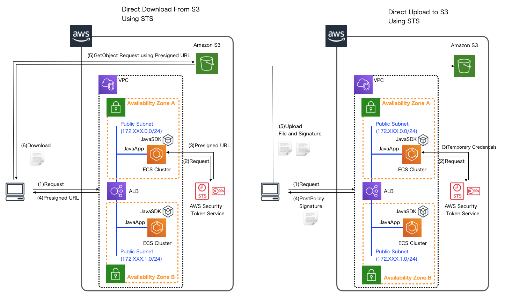

.. include:: ../module.txt

.. _section-cloud-native-s3-6th-label:

【第3回】AmazonS3へダイレクトアクセスするアプリケーション実装(6)
----------------------------------------------------------------------------------------

|br|

クラウド上のストレージとして、AWSで利用可能なAmazon S3。前回から引き続き、Amazon S3へクライアントからダイレクトアクセスするSpringアプリケーションの実装方法について解説します。

前回は、署名付きURLを使ってS3にあるファイルへダイレクトダウンロードするアプリケーションを解説しました。続く今回は、S3へファイルをダイレクトアップロードするアプリケーションの実装方法を紹介します。

|br|

|br|

.. _section-cloud-native-s3-cors-setting-label:

S3へのCORSの設定
^^^^^^^^^^^^^^^^^^^^^^^^^^^^^^^^^^^^^^^^^^^^^^^^^^^^^^^^^^^^^^^^^^^^^^^^^^^^^^^^^^^^^^^^^^^^^^^^^^^^^^^^^

|br|

前回も解説した通り、ブラウザには、XSS(Cross Site Scripting:クロスサイトスクリプティング)やCSRF(Cross Site Request Forgeries:クロスサイトリクエストフォージェリ)といったセキュリティ脅威に対する対策として、
開いているドメイン(http://exampleA.com)とは異なるドメイン(http://exampleB.com)へのアクセスを制御する仕組みがあり(同一オリジンポリシー)、CORSはクロスドメインでのアクセスを安全に実行するための仕様です。

今回のアプリケーションはブラウザ上で実行するJavaScriptからAjax(XMLHttpRequest)を使って、S3へファイルアップロードを行うため、事前にS3へCORS設定を行っておく必要があります。
マネジメントコンソールからS3サービスを選択し、対象のバケットを選択して、アクセス制御タブでCORS設定が行えます。

|br|

|br|

S3側にはクロスドメインで参照してくるドメインと許可する操作を設定します。今回はローカルで動作するアプリケーション(http://localhost:8080)からのファイルアップロードを許可するように以下の通り、CORS構成を追加しましょう。

|br|

.. sourcecode:: bash

   <?xml version="1.0" encoding="UTF-8"?>
   <CORSConfiguration xmlns="http://s3.amazonaws.com/doc/2006-03-01/">
   <CORSRule>
       <AllowedOrigin>http://localhost:8080</AllowedOrigin>
       <AllowedMethod>POST</AllowedMethod>
       <AllowedHeader>*</AllowedHeader>
   </CORSRule>
   </CORSConfiguration>

|br|

.. note:: 上記は開発環境としてローカルで動作する場合の設定で、商用環境などでは別途そのドメインを指定する必要があります。

|br|

.. _section-cloud-native-s3-direct-upload-implementation-1-label:

クライアントからS3へダイレクトファイルアップロードするアプリケーション
^^^^^^^^^^^^^^^^^^^^^^^^^^^^^^^^^^^^^^^^^^^^^^^^^^^^^^^^^^^^^^^^^^^^^^^^^^^^^^^^^^^^^^^^^^^^^^^^^^^^^^^^^

|br|

ベースとなるアプリケーションは 前回に引き続き、`基本編第26回 <https://news.mynavi.jp/itsearch/article/cloud/4615>`_ で実装したものと同様のものを使用します。

本連載で実際に作成するアプリケーションでは `GitHub <https://github.com/debugroom/mynavi-sample-aws-s3>`_ 上にコミットしています。
以降に記載するソースコードでは、import文など本質的でない記述を省略している部分があるので、実行コードを作成する際は、必要に応じて適宜GitHubにあるソースコードも参照してください。

それでは、アプリケーションの実装の解説に進みます。前回同様、今回はダイレクトアクセスを実現するS3DirectUploadHelperクラスを追加して、SampleControllerにこのHelperを呼び出す処理を適宜追加します。
S3へのダイレクトアップロードアクセスは、まずSTSから、アップロードするS3のバケットに対してアクセスを許可する一時認証情報を取得して、アップロード時にAWS側で検証を行うためのPostポリシーなどを生成し、
ブラウザなどのクライアントへ渡してアップロードを実行します。クライアントへ返却する必要がある最低限の情報を表したモデルオブジェクトは以下の通りです。

|br|

.. sourcecode:: java

   package org.debugroom.mynavi.sample.aws.s3.app.model;

   // omit

   public class DirectUploadAuthorization implements Serializable {

       private String objectKey;     // アップロードファイルのオブジェクトキー
       private String acl;           // アップロードしたファイルの公開範囲
       private String uploadUrl;     // POSTメソッドでアクセスするアップロード先のURL
       private String policy;        // POSTポリシードキュメント(Base64エンコードが必要)
       private String securityToken; // 一時的認証情報のセキュリティトークン
       private String date;          // 日時情報(UTCTimezone ISO8601:YYYYMMDD'T'HHMMSS'Z')
       private String algorithm;     // "AWS4-HMAC-SHA256"固定
       private String credential;    // 一時的認証情報やリージョンを含む文字列
       private String signature;     // POSTポリシーに対する署名の16進数表現
       private String fileSizeLimit; // アップロードファイルサイズ上限

   }

|br|

PostポリシーはS3DirectUploadHelperクラス内で生成しますが、一時認証情報に加えてアップロードファイルの条件やメタデータを付与して、
Base64エンコードなどを施した上で、HMAC SHA-1アルゴリズムを用いて、一時認証情報のシークレットキーで署名する処理を行います。Helperクラスの実装は以下の通りです。

|br|

.. sourcecode:: java

   package org.debugroom.mynavi.sample.aws.s3.app.web.helper;

   // omit

   import javax.crypto.Mac;
   import javax.crypto.spec.SecretKeySpec;

   import com.amazonaws.auth.policy.Policy;
   import com.amazonaws.auth.policy.Statement;
   import com.amazonaws.auth.policy.actions.S3Actions;
   import com.amazonaws.services.identitymanagement.AmazonIdentityManagementClientBuilder;
   import com.amazonaws.services.identitymanagement.model.GetRoleRequest;
   import com.amazonaws.services.s3.AmazonS3;
   import com.amazonaws.services.s3.model.ObjectMetadata;
   import com.amazonaws.services.s3.model.PutObjectRequest;
   import com.amazonaws.services.securitytoken.AWSSecurityTokenServiceClientBuilder;
   import com.amazonaws.services.securitytoken.model.AssumeRoleRequest;
   import com.amazonaws.services.securitytoken.model.Credentials;
   import com.fasterxml.jackson.core.JsonProcessingException;
   import com.fasterxml.jackson.databind.ObjectMapper;

   import org.apache.commons.codec.binary.Base64;
   import org.apache.commons.codec.binary.Hex;
   import org.joda.time.DateTime;
   import org.joda.time.DateTimeZone;

   // omit

   import org.debugroom.mynavi.sample.aws.s3.app.model.DirectUploadAuthorization;
   import org.debugroom.mynavi.sample.aws.s3.app.model.PostPolicy;

   @Component
   public class S3DirectUploadHelper implements InitializingBean {                 // …(1)

       private static final String RESOURCE_ARN_PREFIX = "arn:aws:s3:::";
       private static final String ALGORITHM = "HmacSHA256";

       @Value("${bucket.name}")                                                    // …(2)
       private String bucketName;
       @Value("${cloud.aws.region.static}")
       private String region;
       @Value("${sts.min.duration.minutes}")
       private int stsMinDurationMinutes;
       @Value("${s3.upload.duration.seconds}")
       private int durationSeconds;
       @Value("${s3.upload.acl}")
       private String accessControlLevel;
       @Value("${s3.upload.limitBytes}")
       private String fileSizeLimit;
       @Value("${s3.upload.role.name}")
       private String roleName;
       @Value("${s3.upload.role.session.name}")
       private String roleSessionName;
       private String roleArn;                                                     // …(3)

       // omit

       public DirectUploadAuthorization createDirectUploadAuthorization(
                   String uploadDirectory){                                        // …(4)
           String objectKey = new StringBuilder().append(uploadDirectory).append("/").toString();
           Credentials credentials = getTemporaryCredentials(objectKey);           // …(5)
           DateTime nowUTC = new DateTime(DateTimeZone.UTC);
           String dateString = nowUTC.toString("yyyyMMdd");
           String credentialString = createCredentialString(credentials.getAccessKeyId(),
                   dateString, region, "s3");                                      // …(6)
           String securityToken = credentials.getSessionToken();                   // …(7)
           String uploadUrl = createUploadUrl(region);          　　　　　　         // …(8)
           String algorithm = "AWS4-HMAC-SHA256";
           String iso8601dateTime = nowUTC.toString("yyyyMMdd'T'HHmmss'Z'");

           PostPolicy postPolicy = PostPolicy.builder()
                   .expiration(nowUTC.plusSeconds(durationSeconds).toString())
                   .conditions(new String[][]{
                       {"eq", "$bucket", bucketName},
                       {"starts-with", "$key", objectKey},
                       {"eq", "$acl", accessControlLevel},
                       {"eq", "$x-amz-credential", credentialString},
                       {"eq", "$x-amz-security-token", securityToken},
                       {"eq", "$x-amz-algorithm", algorithm},
                       {"eq", "$x-amz-date", iso8601dateTime},
                       {"content-length-range", "0", fileSizeLimit},
                   })
                   .build();                                                       // …(9)

           String policyDocument = null;
           try{
               policyDocument = objectMapper.writeValueAsString(postPolicy);       // …(10)
           }catch (JsonProcessingException e){
               e.printStackTrace();
           }

           String base64Policy = Base64.encodeBase64String(
                   policyDocument.getBytes(StandardCharsets.UTF_8));               // …(11)

           byte[] signingKey = getSignatureKey(credentials.getSecretAccessKey(),   // …(12)
                   dateString, region, "s3");

           String signatureForPolicy = Hex.encodeHexString(calculateHmacSHA256(
                   base64Policy, signingKey));                  　　　　　　　　　    // …(13)

           return DirectUploadAuthorization.builder()
                   .uploadUrl(uploadUrl)
                   .acl(accessControlLevel)
                   .date(iso8601dateTime)
                   .objectKey(objectKey)
                   .securityToken(securityToken)
                   .algorithm(algorithm)
                   .credential(credentialString)
                   .signature(signatureForPolicy)
                   .policy(base64Policy)
                   .fileSizeLimit(fileSizeLimit)
                   .build();                  　　　　　　　　　　　　　　　　　　　　    // …(14)
       }

       private Credentials getTemporaryCredentials(String objectKey){
           String resourceArn = new StringBuilder()
                   .append(RESOURCE_ARN_PREFIX)
                   .append(bucketName).append("/")
                   .append(objectKey).append("*")
                   .toString();

           Statement statement = new Statement(Statement.Effect.Allow)
                   .withActions(S3Actions.PutObject)
                   .withResources(new com.amazonaws.auth.policy.Resource(resourceArn));
           String iamPolicy = new Policy().withStatements(statement).toJson();     // …(15)

           AssumeRoleRequest assumeRoleRequest = new AssumeRoleRequest()
                   .withRoleArn(roleArn)
                   .withDurationSeconds((int)TimeUnit.MINUTES.toSeconds(stsMinDurationMinutes))
                   .withRoleSessionName(roleSessionName)
                   .withPolicy(iamPolicy);
           return AWSSecurityTokenServiceClientBuilder.standard().build()
                   .assumeRole(assumeRoleRequest).getCredentials();                // …(16)
       }

       private String createCredentialString(String accessKey, String date, String region, String serviceName){
           return new StringBuilder()
                   .append(accessKey).append("/")
                   .append(date).append("/")
                   .append(region).append("/")
                   .append(serviceName).append("/aws4_request")
                   .toString();                                                    // …(17)
       }

       private String createUploadUrl(String region){
           return new StringBuilder()
                   .append("https://").append(bucketName).append(".s3-").append(region).append(".amazonaws.com/")
                   .toString();                  　　　　　　　　　　　　　　　　　      // …(18)
       }

       private byte[] getSignatureKey(String key, String dateStamp, String region,
                                      String serviceName){
           byte[] kSecret = new StringBuilder().append("AWS4").append(key).toString()
                   .getBytes(StandardCharsets.UTF_8);
           byte[] kDate = calculateHmacSHA256(dateStamp, kSecret);
           byte[] kRegion = calculateHmacSHA256(region, kDate);
           byte[] kService = calculateHmacSHA256(serviceName, kRegion);
           byte[] kSigning = calculateHmacSHA256("aws4_request", kService);
           return kSigning;                                                        // …(19)
       }

       private byte[] calculateHmacSHA256(String stringToSign, byte[] signingKey){
           Mac mac = null;
           try{
               mac = Mac.getInstance(ALGORITHM);
               mac.init(new SecretKeySpec(signingKey, ALGORITHM));
           }catch (NoSuchAlgorithmException | InvalidKeyException e){
               e.printStackTrace();
           }
           return mac.doFinal(stringToSign.getBytes(StandardCharsets.UTF_8));      // …(20)
       }

       @Override
       public void afterPropertiesSet() throws Exception {
           GetRoleRequest getRoleRequest = new GetRoleRequest().withRoleName(roleName);
           roleArn = AmazonIdentityManagementClientBuilder.standard().build()
                   .getRole(getRoleRequest).getRole().getArn();                    // …(21)
       }

   }

|br|

S3DirectUploadHelperクラスコードの説明は以下の通りです。

|br|

.. list-table:: S3DirectUploadHelperクラスコードの説明
   :widths: 1, 19

   * - 項番
     - 説明

   * - (1)
     - 前回と同様、org.springframework.beans.factory.InitializingBeanインターフェースを実装します。これにより、(21)でオーバーライドしたafterPropertiesSet()メソッドがSpringBootの起動時、
       application.ymlに記載したプロパティが読み込まれた後にコールされることになります。

   * - (2)
     - application.ymlに必要なプロパティを定義して、@Valueでインジェクションします。今回必要なものは、バケット名、S3のリージョン、STSの一時認証情報の有効期限(分)、アップロードを許可する時間(秒)、
       アップロードしたファイルのアクセス制御レベル、ファイルアップロードするファイルサイズ上限、第一回で作成したアップロード用のIAMロール名、ロールセッション名です。

   * - (3)
     - (21)で、第一回で作成したアップロード用のIAMロール名のARNを取得し、設定します。

   * - (4)
     - クライアント(今回はブラウザ)からPOSTメソッドでダイレクトアップロードするために必要な認証情報を作成するメソッドを定義します。クライアントへ返却する情報を表したモデルオブジェクトは後述します。
       なお、このメソッドの引数としてアップロードするバケットのディレクトリに相当するオブジェクトキーを渡します。

   * - (5)
     - S3へ一時的にアクセスする認証情報を取得するプライベートメソッドを呼び出します。詳細な説明は(15)、(16)を参照してください。

   * - (6)
     - クライアントからのPOSTメソッドで指定するカスタムパラメータX-Amz-Credentialに設定する文字列を作成するプライベートメソッドを呼び出します。詳細な説明は(17)を参照してください。

   * - (7)
     - (5)で取得した一時認証情報から、セッショントークンを取得します。

   * - (8)
     - S3のリージョンを元に、アップロードするS3のURLを生成するプライベートメソッドを呼び出します。詳細な説明は(18)を参照してください。

   * - (9)
     - S3へ非公開バケットへアップロードを行う場合に必要なPOSTポリシーを作成します。今回作成するPOSTポリシーオブジェクトは後述しますが、アップロードファイルの上限やアップロードするファイル名のオブジェクトキーパターン、
       メタデータなどの情報を追加します。POSTポリシーに含まれていない情報が、実際アップロードするリクエストに含まれていた場合、アップロードに失敗するので注意してください※。

   * - (10)
     - 作成したPOSTポリシーオブジェクトをJacksonのマッパーライブラリを用いて、JSON表現の文字列に変換します。

   * - (11)
     - (10)で作成したJSON形式の文字列をBase64でエンコーティングします。この処理以降のPOSTポリシーの署名の処理の流れは `Authenticating Requests: Browser-Based Uploads Using POST (AWS Signature Version 4) <https://docs.aws.amazon.com/ja_jp/AmazonS3/latest/API/sigv4-authentication-HTTPPOST.html>`_ も参考にして下さい。

   * - (12)
     - (5)で生成した一時認証情報から取得したシークレットキー、日付、リージョン、サービスをキーにしてHMAC SHA-1アルゴリズムで署名のキーを作成します。詳細な説明は(19)を参照してください。

   * - (13)
     - (11)で作成したBase64エンコードされた文字列を署名キーで再度署名し、16進数表現の文字列に変換します。

   * - (14)
     - (13)までで作成した情報を元に、クライアントへ返却するモデルオブジェクトを生成します。

   * - (15)
     - 指定されたオブジェクトキー名でアップロードすることを許可するIAMポリシーを作成して、JSON表現の文字列に変換します。

   * - (16)
     - AssumeRole APIを実行して、(15)で作成したIAMポリシーに対する一時認証情報を取得して返却します。

   * - (17)
     - POSTリクエストで、X-Amz-Credentialに設定する文字列を作成するメソッドです。このメソッドで作成する文字列の詳細な書式は
       `Authenticating Requests: Using Query Parameters (AWS Signature Version 4) <https://docs.aws.amazon.com/AmazonS3/latest/API/sigv4-query-string-auth.html>`_ も参考にして下さい。

   * - (18)
     - 指定されたリージョンとバケット名に応じて、アップロードするS3BucketのURLを作成するメソッドです。

   * - (19)
     - 一時認証情報から取得したシークレットキー、日付、リージョン、サービス名を元に署名のバイト文字列を取得するメソッドです。このメソッドの実装は、
       `署名バージョン 4 署名キーを取得する方法の例 <https://docs.aws.amazon.com/ja_jp/general/latest/gr/signature-v4-examples.html#signature-v4-examples-java>`_ も参考にしてください。

   * - (20)
     - 署名キーを使って、HmacSHA256アルゴリズムでハッシュ計算するメソッドです。

   * - (21)
     - AmazonIdentityManagementClientを使用して、ロール名からARNを取得し、(3)に設定します。

|br|

.. note:: ※なお、今回POSTポリシーは以下のような条件を設定するモデルとしています。クライアントからリクエスト送信する際にこれらの条件と一致しない、もしくは不要な条件が含まれていた場合アップロードに失敗するので注意してください。

   .. sourcecode:: javascript

      {"eq", "$bucket", bucketName},                         // バケット名が完全一致
      {"starts-with", "$key", objectKey},                    // オブジェクトキー名が前方一致
      {"eq", "$acl", accessControlLevel},                    // ACLが完全一致
      {"eq", "$x-amz-credential", credentialString},         // 認証情報が完全一致
      {"eq", "$x-amz-security-token", securityToken},        // セキュリティトークンが完全一致
      {"eq", "$x-amz-algorithm", algorithm},                 // アルゴリズムが完全一致
      {"eq", "$x-amz-date", iso8601dateTime},                // 日付書式が完全一致
      {"content-length-range", "0", fileSizeLimit},          // ファイル上限サイズを指定

   必要に応じて条件は変更可能です。詳細は、`Example: Browser-Based Upload using HTTP POST (Using AWS Signature Version 4) <https://docs.aws.amazon.com/AmazonS3/latest/API/sigv4-post-example.html>`_ や
    `Creating a POST Policy <https://docs.aws.amazon.com/ja_jp/AmazonS3/latest/API/sigv4-HTTPPOSTConstructPolicy.html>`_ も参照して下さい。

|br|

当ヘルパークラスで使用するプロパティをapplication.ymlに定義します。

|br|

applicaiton.yml

.. sourcecode:: bash

   bucket:
     name: debugroom-mynavi-sample
   s3:
     upload:
       role:
         name: mynavi-sample-s3-upload-role
         session:
           name: mynavi-sample
       duration:
         seconds: 86400
       limitBytes: 10000000000
       acl: private
   sts:
     min:
       duration:
         minutes: 15

|br|
Controllerクラスで(4)を呼び出すリクエストハンドラメソッドを実装します。

|br|

.. sourcecode:: java

   package org.debugroom.mynavi.sample.aws.s3.app.web;

   // omit

   @Controller
   public class SampleController {

       // omit

       @Autowired
       S3DirectUploadHelper s3DirectUploadHelper;

       @GetMapping("/upload/authorization")
       @ResponseBody
       public ResponseEntity<DirectUploadAuthorization>
               getDirectUploadAuthorization(){
           String fileUploadPath = UUID.randomUUID().toString();
           s3DirectUploadHelper.createDirectory(fileUploadPath);
           return ResponseEntity.status(HttpStatus.OK).body(
                   s3DirectUploadHelper.createDirectUploadAuthorization(
                   fileUploadPath));
       }

       // omit

   }

|br|

上記のメソッドを呼び出すリクエストは、HTMLやJavaScriptなどのブラウザで実行されるクライアントで行われます。下記は、ThymeleafおよびjQueryを使ってS3へダイレクトアップロードしている箇所です。

|br|

resources/templates/portal.html

.. sourcecode:: html

   <!DOCTYPE html>
   <html xmlns:th="http://www.thymeleaf.org" lang="ja">
   <html lang="ja">

   // omit

   <h2>Upload File to S3 directly</h2>

   <form id="directUploadForm" action="" method="" enctype="multipart/form-data">
       <input id="directUploadInput" name="uploadFiles" multiple type="file" data-authorization-url="/upload/authorization" />
   </form>

   

|br|

ブラウザはファイルアップロード要求をサーバ側に対して行い、ダイレクトアップロードに必要な情報(DirectUploadAuthorization)を取得した後、ダイレクトアップロード処理を実行します。
サンプルとなる(jQueryUploadを使用した)JavaScript実装は以下の通りです。

|br|

resources/static/js/portal.js

.. sourcecode:: none

   // omit

   function uploadFiles(){
       var progressPanel = $("#progress");
       if(progressPanel != null){
           progressPanel.remove();
       }
       // ダイアログボタンを押すと表示する。
       $("#directUploadForm").after('
アップロードの準備中…
');
       var formData = new FormData;
       // ダイアログを選択すると呼ばれる。
       $("#directUploadInput").fileupload({
           forceIframeTransport : true,
   //        url: "" // url option is for hr, not working
           acceptFileTypes: /(\.|\/)(txt|gif|jpe?g|png|mp4|MOV|mov|m4v)$/i,
           formData: formData,
           // ダイアログでFileを選択すると呼ばれる。(マルチアップロードがあることを想定)
           add: function(e, data){
               // S3へダイレクトアップロードするURLおよび認証情報をサーバへ要求する。
               $.ajax({
                   url: $("#directUploadInput").data("authorizationUrl"),
                   type: "GET",
                   async:true,
               }).done(function(directUploadAuthorization, textStatus, jqXHR){
                   $("pre-message").remove();
                   var uploadUrl;
                   // ダイアログで選択したファイルごとに、進行状況を表示しながらアップロードする。
                   $.each(data.originalFiles, function(index, value){
                       var fileName = data.files[index].name.replace(".", "-");
                       $("#progress-" + fileName).remove();
                       $("#errorMessage-" + fileName).remove();
                       $("#progress").appendChild(
                           $('

0%
'));
                       $('#progress-' + fileName + ' .progress-bar').css('width', 0 + '%');
                       $("#progress-" + fileName).before($('アップロード進行状況： '
                           + data.files[index].name + ' '));
                       // アップロードするファイルがサポート形式か判定する
                       var isSupportedFile = false;
                       switch (data.files[index].type) {
                           case "text/plain":
                               isSupportedFile = true;
                               break;
                           case "image/gif":
                               isSupportedFile = true;
                               break;
                           case "image/jpeg":
                               isSupportedFile = true;
                               break;
                           case "image/png":
                               isSupportedFile = true;
                               break;
                           case "video/mpeg":
                               isSupportedFile = true;
                               break;
                           case "video/mp4":
                               isSupportedFile = true;
                               break;
                           case "video/quicktime":
                               isSupportedFile = true;
                               break;
                           default:
                               break;
                       }
                       アップロードするファイルと共に送信するメタ情報を作成する。
                       formData = new FormData();
                       if(isSupportedFile){
                           uploadUrl = directUploadAuthorization.uploadUrl;
                           formData.append('key', directUploadAuthorization.objectKey + data.files[index].name);
                           formData.append('x-amz-credential', directUploadAuthorization.credential);
                           formData.append('acl', directUploadAuthorization.acl);
                           formData.append('x-amz-security-token', directUploadAuthorization.securityToken);
                           formData.append('x-amz-algorithm', directUploadAuthorization.algorithm);
                           formData.append('x-amz-date', directUploadAuthorization.date);
                           formData.append('policy', directUploadAuthorization.policy);
                           formData.append('x-amz-signature', directUploadAuthorization.signature);
                           formData.append('file', data.files[index]);
                           // S3へダイレクトアップロードする
                           $.ajax({
                               url: uploadUrl,
                               type: 'POST',
                               dataType: 'json',
                               data: formData,
                               contentType: false,
                               processData: false,
                               xhr : function(){
                                   var XHR = $.ajaxSettings.xhr();
                                   if(XHR.upload){
                                       XHR.upload.addEventListener('progress',function(e){
                                           var progre = parseInt(e.loaded/e.total*100);
                                           $('#progress-' + fileName + ' .progress-bar').css({width: ((progre+1)*95/100)+'%'});
                                           $("#progress-ratio-" + fileName).text(progre);
                                       }, false);
                                   }
                                   return XHR;
                               },
                           }).done(function(data, textStatus, jqXHR){
                               $("#upload-label-" + fileName).html($("#upload-label-" + fileName).html() + " アップロードが完了しました。 ");
                               $("#progress-" + fileName).remove();
                           }).fail(function(jqXHR, textStatus, errorThrown){
                               $("#errorMessage-" + fileName).remove();
                               $("#thumbnailPanel").after($(''
                                   + 'ファイルアップロード中にエラーが発生しました。' + fileName + ''));
                           });
                       }else {
                           $("#errorMessage-" + fileName).remove();
                           $("#thumbnailPanel").before($('サポートされない形式です。'
                               + fileName + ''));
                       }
                   });
               }).fail(function(jqXHR, textStatus, errorThrown){});
           }, done : function(e, data){}, fail: function(e, data){}
       });
   }

|br|

今回はS3へダイレクトアップロードする実装を紹介しました。次回はS3へダイレクトアップロードした後、S3でイベントを発生させ、Lambdaファンクションで後続処理を行う実装を紹介します。

|br|

著者紹介
^^^^^^^^^^^^^^^^^^^^^^^^^^^^^^^^^^^^^^^^^^^^^^^^^^^^^^^^^^^^^^^^^^^^^^^^^^^^^^^^^^^^^^^^^^^^^^^^^^^^^^^^^

川畑 光平(KAWABATA Kohei) - NTTデータ

.. figure:: img/aws-s3/aws_361383_075.jpeg

金融機関システム業務アプリケーション開発・システム基盤担当、ソフトウェア開発自動化関連の研究開発を経て、デジタル技術関連の研究開発・推進に従事。

Red Hat Certified Engineer、Pivotal Certified Spring Professional、AWS Certified Solutions Architect Professional等の資格を持ち、アプリケーション基盤・クラウドなど様々な開発プロジェクト支援にも携わる。

`AWS Top Engineers & Ambassadors <https://aws.amazon.com/jp/partners/ambassadors/?cards-body.sort-by=item.additionalFields.ambassadorName&cards-body.sort-order=asc&cards-body.q=kawabata&cards-body.q_operator=AND>`_ 選出。

本連載記事の内容に対するご意見・ご質問は `Facebook <https://www.facebook.com/kohei.kawabata.5>`_ まで。
