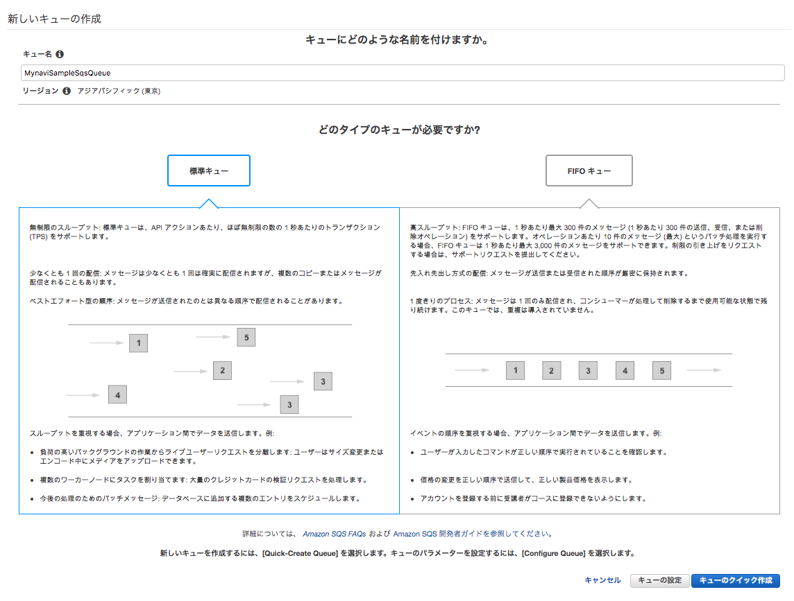
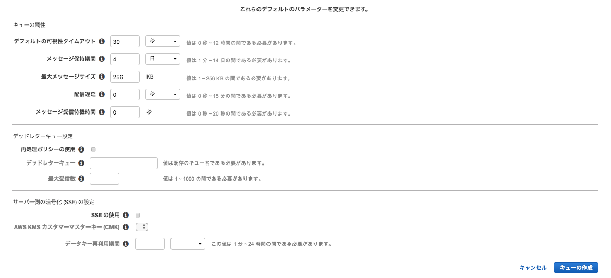

.. include:: ../module.txt

.. _section-cloud-native-sqs-1st-label:

【第28回】AmazonSQSを使用する実装(1)
----------------------------------------------------------------------------------------

|br|

クラウド上のメッセージキューサービスとして、AWSで利用可能なAmazon SQS。今回からはSpring Cloud AWSを用いてAmazon SQSへアクセスするSpringアプリケーションの実装方法について解説します。

本連載では、以下のステップで解説を進めていきます。

|br|

#. **Amazon SQSの概要とアプリケーション処理パターン、SQSキューの作成**
#. Spring Cloud AWSを用いたSQSProducerアプリケーション実装
#. Spring Batchを用いたバッチアプリケーション実装(1)
#. Spring Batchを用いたバッチアプリケーション実装(2)
#. Spring Cloud AWSを用いたSQSConsumerアプリケーション実装

|br|

なお、本連載は以下の前提知識がある開発者を想定しています。

|br|

.. list-table::
   :widths: 3, 7

   * - 対象読者
     - 前提知識

   * - エンタープライズ開発者
     - Java言語及びSpringFrameworkを使った開発に従事したことがある経験者。経験がなければ、|br|
       `こちらのチュートリアル <http://terasolunaorg.github.io/guideline/5.5.1.RELEASE/ja/Tutorial/index.html>`_ を実施することを推奨します。TERASOLUNAはSpringのベストプラクティスをまとめた開発方法論で、このチュートリアルでは、JavaやSpring Frameworkを使った開発に必要な最低限の知識を得ることができます。

   * -
     - GitHubなどのバージョン管理ツールやApache Mavenなどのライブラリ管理ツールを使った開発に従事したことがある経験者。

   * - AWS開発経験者
     - AWSアカウントをもち、コンソール上で各サービスを実行したことがある経験者

|br|

また、動作環境は以下のバージョンで実施しています。

|br|

.. list-table::
   :widths: 5, 5

   * - 動作対象
     - バージョン

   * - Java
     - 1.8

   * - Spring Boot
     - 2.1.7.RELEASE

   * - Spring Batch
     - 4.1.2.RELEASE

   * - Spring Cloud AWS
     - 2.1.2.RELEASE

|br|

将来的には、AWSコンソール上の画面イメージや操作、バージョンアップによりJavaのソースコード内で使用するクラスが異なる可能性があります。

|br|

.. _section-cloud-native-sqs-overview-label:

Amazon SQSの概要
^^^^^^^^^^^^^^^^^^^^^^^^^^^^^^^^^^^^^^^^^^^^^^^^^^^^^^^^^^^^^^^^^^^^^^^^^^^^^^^^^^^^^^^^^^^^^^^^^^^^^^^^^

|br|

Amazon SQS(Simple Queue Service)はS3と同じく、リージョン単位で提供される完全マネージド分散型キュー配信方式のメッセージサービスです。
複数のサーバに複数のメッセージのコピーを保存して信頼性を確保しながら最低一度の配信を保証しています。
大容量のデータを高スループットで転送可能であり、メッセージ送信の信頼性が高く、各コンポーネントを疎結合にして、アプリケーションを構成することが可能です。|br|
メッセージキューは以下のようなURLフォーマット、メッセージID、受信ハンドル(ReceiptHandle)で識別され、操作用のAPIが提供されています。

http://sqs.<region>.amazonaws.com/<accout-id>

.. list-table:: キューの操作
   :widths: 20, 80
   :header-rows: 1

   * - API
     - 概要

   * - CreateQueue
     - 新しいキューを作成するか、既存のキューのURLを返す
   * - SetQueueAttribute
     - キューの属性を設定する。属性値は下記表を参照。
   * - GetQueueAttribute
     - キューの属性を取得する。属性値は下記表を参照。
   * - GetQueueUrl
     - キューのURLを取得する。
   * - ListQueues
     - キューのリストを取得する。
   * - DeleteQueues
     - キューを削除する。

|br|

.. list-table:: キューの属性
   :widths: 20, 80
   :header-rows: 1

   * - 属性名
     - 概要

   * - DelaySecounds
     - メッセージの遅延配信時間
   * - MaximumMessageSize
     - メッセージに含まれる最大バイト数(デフォルト・最大値ともに256KiB)
   * - MessageRetentionPeriod
     - メッセージが保持される秒数(デフォルト４日、最大１４日)
   * - RecieveMessageWaitTimeSeconds
     - 呼び出しがメッセージ到着を待機する時間(デフォルト0秒、最大20秒)
   * - Visibility Timeout
     - 特定のアプリケーションコンポーネントからキューがメッセージを取得した後、 |br| その他からメッセージが不可視となる時間。

|br|

SQSでは、通常メッセージの処理順序でシーケンス性が保証されません。メッセージ順序を保証する場合はFIFOキューを利用します。
また、SQSには可視性タイムアウト(Visibility Timeout)機能があります。あるキューが処理中に異常処理した場合に、
別のノードでキューを処理するためにキューをロックした状態で残すようにしていますが、可視性タイムアウトとはそのロック時間を指します。
ロックをかけるのは、複数のノードが同じキューを処理することを避けるためです。また、処理できなかったキューを除外し、デッドレターキューとして、別のキューに蓄積しておくことも可能です。
キューは他のユーザとも共有することができ、暗号化オプション、匿名で他のAWSユーザと共有するオプション、アクセス許可を利用して特定のユーザとシェアするオプションがあります。なお、その場合、料金はメッセージの所有者です。

|br|

.. _section-cloud-native-sqs-application-process-pattern-label:

SQSを使ったアプリケーションの処理パターン
^^^^^^^^^^^^^^^^^^^^^^^^^^^^^^^^^^^^^^^^^^^^^^^^^^^^^^^^^^^^^^^^^^^^^^^^^^^^^^^^^^^^^^^^^^^^^^^^^^^^^^^^^

|br|

上述の特性をもつキューですが、アプリケーションの処理中にキュー操作を組み込むことにより、疎結合で耐障害性・パフォーマンスに優れたアプリケーションを構築することができます。
キューを使った代表的な処理パターンは以下の通りです。

#. Webアプリケーションが処理要求を受け付け、クライアントには受付要求が完了したことを返却する。

   #. 後続の処理は別のイベントを契機として、後続の処理を１つのトランザクションとして非同期実行します(翌日付の振込などが代表的な例です)。
   #. Webアプリケーションの受付とは別に負荷が高い処理を別プロセスで実行します(ディレードバッチとも呼ばれます。帳票データを一括してPDF化する処理要求などが代表的な例です)

#. 他のアプリケーションからの処理要求を契機として、一括処理を起動する。

   #. マネジメントセグメントにある運用端末から、バックヤードでフロントから受け付けたデータの一連の業務処理実行を行います(銀行口座開設の受付に対する審査などが代表的な例です)。

#. クラウドサービスへのイベントを契機として、一括処理を起動する

   #. 共有ストレージへの書き込み、メタ情報の永続化を１つのトランザクションとして実行します(画像データのサムネイル作成やそのファイルパスをデータストアに保存する処理などが代表的な例です)

|br|

.. figure:: img/aws-sqs/sqs-pattern.png

|br|

処理やワークロードに応じて、適切なユースケースで、SQSを活用し、一部のサーバに障害が起こった場合でも安定して処理を行うことができますが、上記の非同期処理においては、同期型処理の場合に比べ、
実行エラーの対処が複雑化しがちなため、ユーザビリティを損なわない適切な例外ハンドリング設計が重要になります。

|br|

.. _section-cloud-native-sqs-create-queue-label:

SQSキューの作成
^^^^^^^^^^^^^^^^^^^^^^^^^^^^^^^^^^^^^^^^^^^^^^^^^^^^^^^^^^^^^^^^^^^^^^^^^^^^^^^^^^^^^^^^^^^^^^^^^^^^^^^^^

|br|

それでは、早速AWSコンソールからキューを作成して使用してみましょう。サービスメニューからSimpleQueueServiceを選択し、「新しいキューの作成」ボタンを押下し、
キュー名を入力してキューのタイプを選択します。

|br|

|br|

前節で説明した、デフォルト可視性やデッドレターキュー等のオプション設定を行う場合は、「キューの設定」ボタンを押下します(フォームに入力の要領が書いているので説明は省略します)。
オプションのパラメータを必要に応じて入力し、「キューの作成」ボタンを押下します。

|br|

|br|

これでキューの設定が完了しました。次回以降はこのキューにメッセージを送信・ポーリングで取得するProducer、Consumerアプリケーション及び、そこから実行されるSpringBatchアプリケーションを実装していきます。

|br|

著者紹介
^^^^^^^^^^^^^^^^^^^^^^^^^^^^^^^^^^^^^^^^^^^^^^^^^^^^^^^^^^^^^^^^^^^^^^^^^^^^^^^^^^^^^^^^^^^^^^^^^^^^^^^^^

川畑 光平(KAWABATA Kohei)

.. figure:: img/aws-lambda-and-api-gateway/pic_image01.jpg

某システムインテグレータにて、金融機関システム業務アプリケーション開発・システム基盤担当を経て、現在はソフトウェア開発自動化関連の研究開発・推進に従事。

Red Hat Certified Engineer、Pivotal Certified Spring Professional、AWS Certified Solutions Architect Professional等の資格を持ち、アプリケーション基盤・クラウドなど様々な開発プロジェクト支援にも携わる。

`2019 APN AWS Top Engineers & Ambassadors <https://aws.amazon.com/jp/blogs/psa/japan-apn-ambassador-2019/>`_ 選出。

本連載記事の内容に対するご意見・ご質問は `Facebook <https://www.facebook.com/kohei.kawabata.5>`_ まで。
