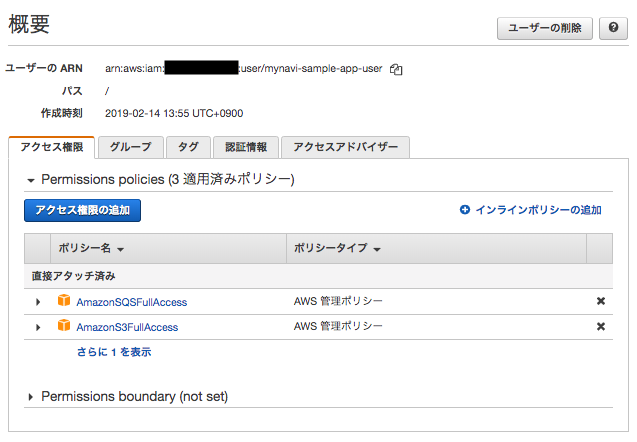

.. include:: ../module.txt

.. _section-cloud-native-sqs-label-2:

AWSで作るクラウドネイティブアプリケーションの基本
========================================================================================

.. _section-cloud-native-sqs-2nd-label:

Amazon SQSを使ったSpringアプリケーション(2)
----------------------------------------------------------------------------------------

|br|

本連載では、以下のステップで解説を進めていきます。

|br|

#. Amazon SQSの概要とアプリケーション処理パターン、SQSキューの作成
#. **Spring Cloud AWSを用いたSQSProducerアプリケーション実装**
#. Spring Batchを用いたバッチアプリケーション実装(1)
#. Spring Batchを用いたバッチアプリケーション実装(2)
#. Spring Cloud AWSを用いたSQSConsumerアプリケーション実装

|br|

前回はAmazon SQSの概要やアプリケーションにSQSを組み込んだ構成のパターンを説明し、実際にコンソール上からキューを作成しました。今回は、下記のようにSQSへキューを送信するProducerアプリケーションをSpring Cloud AWSを使って実装していきます。

|br|

.. figure:: img/aws-sqs/sqs-pattern.png

|br|

.. _section-cloud-native-sqs-producer-using-spring-cloud-aws-implementation-1-label:

Spring Cloud AWSを使ったProducerアプリケーション
^^^^^^^^^^^^^^^^^^^^^^^^^^^^^^^^^^^^^^^^^^^^^^^^^^^^^^^^^^^^^^^^^^^^^^^^^^^^^^^^^^^^^^^^^^^^^^^^^^^^^^^^^

|br|

Spring Cloud AWSは `第12回 <https://news.mynavi.jp/itsearch/article/devsoft/4426>`_ でも説明した通り、AWSのサービスに対してサポートを提供していますが、
SQSに関しては、org.springframework.cloud.aws.messaging.core.QueueMessagingTemplateを使用したメッセージ送受信機能や、
org.springframework.cloud.aws.messaging.listener.annotation.SqsListenerを使用したメッセージポーリング機能を提供しています。

ここでは、まず最初にSQSへメッセージの送信を行うProducerアプリケーションを作成します。
本連載で実際に作成するProducerアプリケーションは `GitHub <https://github.com/debugroom/mynavi-sample-aws-sqs/tree/master/sqs-producer>`_ 上にコミットしています。
以降に記載するソースコードでは、import文など本質的でない記述を省略している部分があるので、実行コードを作成する際は、必要に応じて適宜GitHubにあるソースコードも参照してください。

Spring Cloud AWSを使用するには、まず、Mavenプロジェクトのpom.xmlでspring-cloud-starter-awsのライブラリを定義します。
加えて、SQSを利用するにはspring-cloud-starter-aws-messagingのライブラリを追加してください。
また、リクエストを受け付け、パラメータをSQSに送信する処理を実装するので、以下の通り、spring-boot-starter-webを、
モデルオブジェクトを簡素化する目的で、Lombokライブラリを追加します。

|br|

.. sourcecode:: xml

   <dependencies>
     <dependency>
       <groupId>org.springframework.boot</groupId>
       <artifactId>spring-boot-starter-web</artifactId>
     </dependency>
     <dependency>
       <groupId>org.springframework.cloud</groupId>
       <artifactId>spring-cloud-starter-aws</artifactId>
     </dependency>
     <dependency>
       <groupId>org.springframework.cloud</groupId>
       <artifactId>spring-cloud-starter-aws-messaging</artifactId>
     </dependency>
     <dependency>
       <groupId>org.projectlombok</groupId>
       <artifactId>lombok</artifactId>
       <optional>true</optional>
     </dependency>
   </dependencies>

|br|

それでは、Producerアプリケーションの実装に進みます。今回作成するProducerアプリケーションは以下の構成です。

.. list-table:: アプリケーション
   :widths: 3, 6, 1

   * - コンポーネント
     - 説明
     - 必須

   * - WebApp
     - SpringBootアプリケーションを実行する起動クラス
     - ◯

   * - MvcConfig
     - SpringMVCの設定を行うクラス
     -

   * - DomainConfig
     - サービス・インフラストラクチャレイヤの設定を行うクラス
     -

   * - SqsConfig
     - SQSへの接続に関する設定クラス
     - ◯

   * - SampleRestController
     - リクエストを受け取り、SampleRepositoryを呼び出して、JSONレスポンスを返却するController
     - ◯

   * - SampleRepository
     - QueueMessagingTemplateを使って、SQSへメッセージ送信を行うクラス
     - ◯

   * - Sample
     - SampleRepositoryの永続化データモデル
     -

|br|

以降、各々のクラスについて解説を進めていきますが、事前にAWSコンソールでアプリケーション用のユーザを作成し、 `AWS公式ページ「設定ファイルと認証情報ファイル」 <https://docs.aws.amazon.com/ja_jp/cli/latest/userguide/cli-configure-files.html>`_ を参考に
ユーザホームフォルダに.awsディレクトリを作成し、credentialというファイル名で、CSV形式の認証キーに記載しているユーザ認証情報を、以下の形式で保存してください。

|br|

.. sourcecode:: bash

   [default]
   aws_access_key_id=XXXXXXXXXXXXXXXX
   aws_secret_access_key=YYYYYYYYYYYYYYYYYYYYYYYYYYYYY

|br|

また、上記のクレデンシャルをもつユーザはSQSへの接続権限を持つ必要があります。以下のように、AWSコンソールで「IAM」サービスメニューから、ユーザにSQSのアクセス権限を付与しておいてください。

|br|

|br|

それでは、実装していくクラスを説明します。まず、最初にSpringBoot起動クラス及び、各種設定クラスです。
@SpringBootApplicaitonアノテーションが付与された起動クラスは、同一パッケージにある@Configurationアノテーションが付与された設定クラス及び、
設定クラス内で@ComponentScanされたパッケージにあるクラスを読み取ります。今回は目的に応じて以下の3つに分類して設定クラスを作成します。

* SpringMVCの設定クラス：MvcConfigクラス
* サービス・インフラストラクチャレイヤ設定クラス：DomainConfigクラス
* SQSの接続を行う設定クラス：SqsConfigクラス

設定クラスは必ずしも複数である必要はなく一つにまとめても動作上問題ありませんが、クラス名と役割を対応づけて作成していた方が、
後々設定内容を混乱することなく、クラス名から識別できてベターです。

|br|

.. sourcecode:: java

   package org.debugroom.mynavi.sample.aws.sqs.config;

   import org.springframework.boot.SpringApplication;
   import org.springframework.boot.autoconfigure.SpringBootApplication;

   @SpringBootApplication
   public class WebApp {

       public static void main(String[] args) {
           SpringApplication.run(WebApp.class, args);
       }

   }

|br|

今回リクエストを受け付けるControllerはRestControllerとして作成するため、同一パッケージに配置するMvcConfigクラスでは、
org.springframework.web.servlet.config.annotation.WebMvcConfigurerを継承し、Controllerクラスのあるパッケージを
コンポーネントスキャンする設定を加えておくだけでOKです。

|br|

.. sourcecode:: java

   package org.debugroom.mynavi.sample.aws.sqs.config;

   import org.springframework.context.annotation.ComponentScan;
   import org.springframework.context.annotation.Configuration;
   import org.springframework.web.servlet.config.annotation.WebMvcConfigurer;

   @Configuration
   @ComponentScan("org.debugroom.mynavi.sample.aws.sqs.app.web")
   public class MvcConfig implements WebMvcConfigurer {
   }

|br|

SQSに対してメッセージを送信するコンポーネントは、メッセージを永続化するRepositoryとして実装します。
DomainConfigではRepositoryの実装クラスのあるパッケージをコンポーネントスキャンする設定を加えておくだけでOKです。

|br|

.. sourcecode:: java

   package org.debugroom.mynavi.sample.aws.sqs.config;

   import org.springframework.context.annotation.ComponentScan;
   import org.springframework.context.annotation.Configuration;

   @Configuration
   @ComponentScan("org.debugroom.mynavi.sample.aws.sqs.domain")
   public class DomainConfig {
   }

|br|

次に、SQSへの接続情報を設定するSqsConfigですが、AmazonSDKで提供されているAmazonSQSAsyncを設定した、QueueMessagingTemplateクラスをBean定義します。
また、AmazonSQSAsyncの内部で設定されるEndpointConfigurationには前回作成したSQSキューがあるリージョンとエンドポイントを設定してBean定義しておきます。

|br|

.. sourcecode:: java

   package org.debugroom.mynavi.sample.aws.sqs.config;

   import com.amazonaws.client.builder.AwsClientBuilder;
   import com.amazonaws.services.sqs.AmazonSQSAsync;

   import org.springframework.beans.factory.annotation.Autowired;
   import org.springframework.beans.factory.annotation.Value;
   import org.springframework.cloud.aws.messaging.core.QueueMessagingTemplate;
   import org.springframework.context.annotation.Bean;
   import org.springframework.context.annotation.Configuration;

   @Configuration
   public class SqsConfig {

       @Value("${queue.endpoint}")
       private String queueEndpoint;
       @Value("${cloud.aws.region.static}")
       private String region;

       @Autowired
       AmazonSQSAsync amazonSQSAsync;

       @Bean
       public AwsClientBuilder.EndpointConfiguration endpointConfiguration(){
           return new AwsClientBuilder.EndpointConfiguration(queueEndpoint, region);
       }

       @Bean
       public QueueMessagingTemplate queueMessagingTemplate(){
           return new QueueMessagingTemplate(amazonSQSAsync);
       }

   }

|br|

上記の設定では、 :ref:`section-cloud-native-s3-access-using-spring-cloud-aws-implementation-1-label` と同様、
Spring Cloud AWSがcom.amazonaws.auth.DefaultAWSCredentialsProviderChainを利用して、AWSの認証情報を取得します。
アクセスキーなどは設定せずに、開発端末下だけで有効されるapplication-dev.ymlで、cloud.aws.credentials.profileに空白を、instaceProfileをfalseにしておきましょう。
また、リージョンの自動検出をOFFにするよう、cloud.aws.region.autoにfalseを、今回アプリケーションが実行されるリージョンをcloud.aws.region.staticに手動設定しておきます。

|br|

applicaiton-dev.yml

.. sourcecode:: bash

   cloud:
     aws:
       credentials:
         profileName:
         instanceProfile: false
       region:
         auto: false
         static: ap-northeast-1

|br|

また、applicaiton.ymlでは、アプリケーションのスタック名自動検出の無効化とキューのエンドポイントを設定しておきます。

|br|

application.yml

.. sourcecode:: bash

   cloud:
     aws:
       stack:
         auto: false
   queue:
     endpoint: https://sqs.ap-northeast-1.amazonaws.com/

|br|

続いて、リクエストを受け付けるControllerの実装ですが、SQSへのメッセージ送信が実装されているSampleRepositoryをを呼び出し、文字列のJSONデータを返却する処理を実装します。

|br|

.. sourcecode:: java

   package org.debugroom.mynavi.sample.aws.sqs.app.web;

   import org.springframework.beans.factory.annotation.Autowired;
   import org.springframework.web.bind.annotation.GetMapping;
   import org.springframework.web.bind.annotation.RequestMapping;
   import org.springframework.web.bind.annotation.RestController;

   import org.debugroom.mynavi.sample.aws.sqs.domain.model.Sample;
   import org.debugroom.mynavi.sample.aws.sqs.domain.repository.SampleRepository;

   @RestController
   @RequestMapping("api/v1")
   public class SampleRestController {

       @Autowired
       SampleRepository sampleRepository;

       @GetMapping("/batch")
       public String batch(String message){
           sampleRepository.save(
             Sample.builder()
                     .message(message)
                     .build());
           return "Queue accepted.";
       }
   }

|br|

最後に実際にSQSキューへメッセージを送信するRepositoryクラスです。インジェクションしたQueueMessagingTemplate#convertAndSend()メソッドを呼び出すだけですが、
第一引数には、前回作成したキューの名称を、第２引数にメッセージ本体となる文字列を設定します。

|br|

.. sourcecode:: java

   package org.debugroom.mynavi.sample.aws.sqs.domain.repository;

   import org.springframework.beans.factory.annotation.Autowired;
   import org.springframework.cloud.aws.messaging.core.QueueMessagingTemplate;
   import org.springframework.stereotype.Component;

   import org.debugroom.mynavi.sample.aws.sqs.domain.model.Sample;

   @Component
   public class SampleRepositoryImpl implements SampleRepository{

       @Autowired
       QueueMessagingTemplate queueMessagingTemplate;

       @Override
       public void save(Sample sample) {
           queueMessagingTemplate.convertAndSend("MynaviSampleSqsQueue", sample.getMessage());
       }

   }

|br|

起動クラスを実行してアプリケーションを起動し、コマンドラインなどからHTTPリクエストを送信し、Controllerを呼び出します。正常に完了するとControllerから完了メッセージが返却されます。

|br|

.. sourcecode:: bash

   >curl http://localhost:8080/api/v1/batch?message=test
   Queue accepted.

|br|

AWSコンソール上で、前回作成したキューを選択し、「キュー操作」から「メッセージの表示・削除」を選択すると、キューにメッセージが蓄積されていることが確認できます。

|br|

|br|

これで、メッセージを送信するProducerアプリケーションが実装できました。次回は、このメッセージを受信するConsumerアプリケーションから実行されるBatch処理をSpringBatchを使って作成します。

|br|

著者紹介
------------------------------------------------------------------

川畑 光平(KAWABATA Kohei)

.. figure:: img/aws-lambda-and-api-gateway/pic_image01.jpg

某システムインテグレータにて、金融機関システム業務アプリケーション開発・システム基盤担当を経て、現在はソフトウェア開発自動化関連の研究開発・推進に従事。

Red Hat Certified Engineer、Pivotal Certified Spring Professional、AWS Certified Solutions Architect Professional等の資格を持ち、アプリケーション基盤・クラウドなど様々な開発プロジェクト支援にも携わる。

`2019 APN AWS Top Engineers & Ambassadors <https://aws.amazon.com/jp/blogs/psa/japan-apn-ambassador-2019/>`_ 選出。

本連載記事の内容に対するご意見・ご質問は `Facebook <https://www.facebook.com/kohei.kawabata.5>`_ まで。
