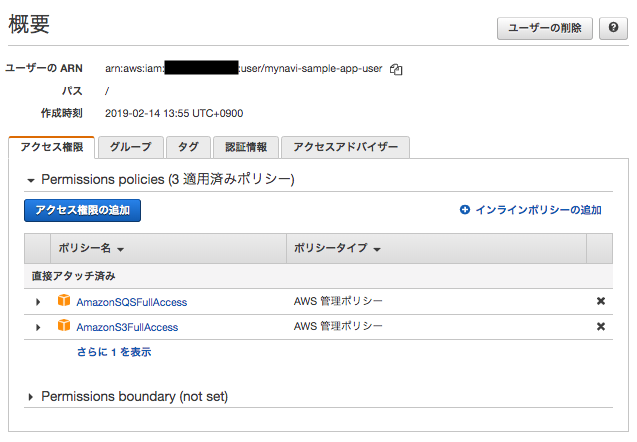

.. include:: ../module.txt

.. _section-cloud-native-sqs-label-5:

AWSで作るクラウドネイティブアプリケーションの基本
========================================================================================

.. _section-cloud-native-sqs-5th-label:

Amazon SQSを使ったSpringアプリケーション(5)
----------------------------------------------------------------------------------------

|br|

本連載では、以下のステップで解説を進めていきます。

|br|

#. Amazon SQSの概要とアプリケーション処理パターン、SQSキューの作成
#. Spring Cloud AWSを用いたSQSProducerアプリケーション実装
#. Spring Batchを用いたバッチアプリケーション実装(1)
#. Spring Batchを用いたバッチアプリケーション実装(2)
#. **Spring Cloud AWSを用いたSQSConsumerアプリケーション実装**

|br|

前回はSpringBatchを使ってバッチアプリケーションを実装しました。今回はSQSメッセージをポーリングして取得するConsumerアプリケーションをSpring Cloud AWSを使って実装し、前回作成したバッチを実行してみます。

|br|

.. figure:: img/aws-sqs/sqs-pattern.png

|br|

.. _section-cloud-native-sqs-consumer-using-spring-cloud-aws-implementation-1-label:

Spring Cloud AWSを使ったConsumerアプリケーション
^^^^^^^^^^^^^^^^^^^^^^^^^^^^^^^^^^^^^^^^^^^^^^^^^^^^^^^^^^^^^^^^^^^^^^^^^^^^^^^^^^^^^^^^^^^^^^^^^^^^^^^^^

|br|

Spring Cloud AWSでは、org.springframework.cloud.aws.messaging.listener.annotation.SqsListenerを使用したメッセージポーリング機能を提供しています。
本連載で実際に作成するConsumerアプリケーションは `GitHub <https://github.com/debugroom/mynavi-sample-aws-sqs/tree/master/sqs-consumer>`_ 上にコミットしています。
以降に記載するソースコードでは、import文など本質的でない記述を省略している部分があるので、実行コードを作成する際は、必要に応じて適宜GitHubにあるソースコードも参照してください。

Spring Cloud AWSを使用するには、前回同様、Mavenプロジェクトのpom.xmlでspring-cloud-starter-aws、spring-cloud-starter-aws-messagingのライブラリを追加してください。
また、モデルオブジェクトを簡素化する目的でLombokライブラリと、前回作成したSpringBatchのプロジェクトを追加します。

|br|

.. sourcecode:: xml

   <dependencies>
     <dependency>
       <groupId>org.springframework.cloud</groupId>
       <artifactId>spring-cloud-starter-aws</artifactId>
     </dependency>
     <dependency>
       <groupId>org.springframework.cloud</groupId>
       <artifactId>spring-cloud-starter-aws-messaging</artifactId>
     </dependency>
     <dependency>
       <groupId>org.projectlombok</groupId>
       <artifactId>lombok</artifactId>
       <optional>true</optional>
     </dependency>
     <dependency>
       <groupId>org.debugroom</groupId>
       <artifactId>spring-batch</artifactId>
       <version>0.0.1-SNAPSHOT</version>
     </dependency>
   </dependencies>

|br|

それでは、Consumerアプリケーションの実装に進みます。今回作成するConsumerアプリケーションは以下の構成です。

.. list-table:: アプリケーション
   :widths: 3, 6, 1

   * - コンポーネント
     - 説明
     - 必須

   * - App
     - SpringBootアプリケーションを実行する起動クラス
     - ◯

   * - SqsConfig
     - SQSへの接続に関する設定クラス
     - ◯

   * - MessageListener
     - SQSへメッセージのポーリングを行い、メッセージがキューに蓄積されると、メッセージを取得してSpringBatchを実行するクラス
     - ◯

|br|

以降、各々のクラスについて解説を進めていきますが、事前にAWSコンソールでアプリケーション用のユーザを作成し、 `AWS公式ページ「設定ファイルと認証情報ファイル」 <https://docs.aws.amazon.com/ja_jp/cli/latest/userguide/cli-configure-files.html>`_ を参考に
ユーザホームフォルダに.awsディレクトリを作成し、credentialというファイル名で、CSV形式の認証キーに記載しているユーザ認証情報を、以下の形式で保存してください。

|br|

.. sourcecode:: bash

   [default]
   aws_access_key_id=XXXXXXXXXXXXXXXX
   aws_secret_access_key=YYYYYYYYYYYYYYYYYYYYYYYYYYYYY

|br|

また、上記のクレデンシャルをもつユーザはSQSへの接続権限を持つ必要があります。以下のように、AWSコンソールで「IAM」サービスメニューから、ユーザにSQSのアクセス権限を付与しておいてください。

|br|

|br|

それでは、実装していくクラスを説明します。まず、最初にSpringBoot起動クラス及び、各種設定クラスです。
@SpringBootApplicaitonアノテーションが付与された起動クラスは、同一パッケージにある@Configurationアノテーションが付与された設定クラス及び、
設定クラス内で@ComponentScanされたパッケージにあるクラスを読み取ります。今回は以下の設定クラスを作成します。

* SQSの接続を行う設定クラス：SqsConfigクラス

設定クラスはクラス名と役割を対応づけて作成していた方が、後々設定内容を混乱することなく、クラス名から識別できてベターです。

|br|

.. sourcecode:: java

   package org.debugroom.mynavi.sample.aws.sqs.config;

   import org.springframework.boot.SpringApplication;
   import org.springframework.boot.autoconfigure.SpringBootApplication;

   @SpringBootApplication
   public class App {

       public static void main(String[] args) {
           SpringApplication.run(App.class, args);
       }

   }

|br|

次に、SQSへの接続情報を設定するSqsConfigですが、Producerアプリケーションの時と同様、AmazonSQSAsyncの内部で設定されるEndpointConfigurationには、SQSキューがあるリージョンとエンドポイントを設定してBean定義しておきます。

|br|

.. sourcecode:: java

   package org.debugroom.mynavi.sample.aws.sqs.config;

   import com.amazonaws.client.builder.AwsClientBuilder;
   import com.amazonaws.services.sqs.AmazonSQSAsync;
   import org.springframework.beans.factory.annotation.Autowired;
   import org.springframework.beans.factory.annotation.Value;
   import org.springframework.context.annotation.Bean;
   import org.springframework.context.annotation.ComponentScan;
   import org.springframework.context.annotation.Configuration;

   @ComponentScan("org.debugroom.mynavi.sample.aws.sqs.app.listener")
   @Configuration
   public class SqsConfig {

       @Value("${queue.endpoint}")
       private String queueEndpoint;
       @Value("${cloud.aws.region.static}")
       private String region;

       @Bean
       public AwsClientBuilder.EndpointConfiguration endpointConfiguration(){
           return new AwsClientBuilder.EndpointConfiguration(queueEndpoint, region);
       }

   }

|br|

上記の設定では、 :ref:`section-cloud-native-s3-access-using-spring-cloud-aws-implementation-1-label` と同様、
Spring Cloud AWSがcom.amazonaws.auth.DefaultAWSCredentialsProviderChainを利用して、AWSの認証情報を取得します。
アクセスキーなどは設定せずに、開発端末下だけで有効されるapplication-dev.ymlで、cloud.aws.credentials.profileに空白を、instaceProfileをfalseにしておきましょう。
また、リージョンの自動検出をOFFにするよう、cloud.aws.region.autoにfalseを、今回アプリケーションが実行されるリージョンをcloud.aws.region.staticに手動設定しておきます。

|br|

applicaiton-dev.yml

.. sourcecode:: bash

   cloud:
     aws:
       credentials:
         profileName:
         instanceProfile: false
       region:
         auto: false
         static: ap-northeast-1

|br|

applicaiton.ymlでは、アプリケーションのスタック名自動検出の無効化とキューのエンドポイントを設定しておきます。また、アプリケーション起動時にバッチが実行されることがないよう、spring.batch.job.enabledプロパティをfalseに設定しておきます。

|br|

application.yml

.. sourcecode:: bash

   spring:
     batch:
       job:
         enabled: false
   cloud:
     aws:
       stack:
         auto: false
   queue:
     endpoint: https://sqs.ap-northeast-1.amazonaws.com/

|br|

続いて、SQSへポーリングを行うListenerの実装ですが、SQSへのメッセージを取得後に、前回作成したSpringBatchのジョブを実行するよう実装します。
クラスにorg.springframework.cloud.aws.messaging.config.annotation.EnableSqsアノテーションを付与し、SQSからメッセージを取得した後、実行する処理メソッドに
org.springframework.cloud.aws.messaging.listener.annotation.SqsListenerアノテーションを付与します。Value属性には :ref:`section-cloud-native-sqs-create-queue-label` で指定したキュー名を指定します。
バッチ処理はorg.springframework.batch.core.launch.JobLauncherおよび、org.springframework.batch.core.Jobをインジェクションして、JobLauncherにパラメータとJobを引数で渡してrun()メソッドを実行します。
SpringBatchではジョブパラメータが同じだと、同一ジョブと見なされ実行エラーになるため、パラメータにタイムスタンプを追加しておきます。なお、この実装はスレッドセーフを考慮してない実装なので、その点留意してください。

|br|

.. sourcecode:: java

   package org.debugroom.mynavi.sample.aws.sqs.app.listener;

   // omit

   import org.springframework.batch.core.Job;
   import org.springframework.batch.core.JobExecution;
   import org.springframework.batch.core.JobParameter;
   import org.springframework.batch.core.JobParameters;
   import org.springframework.batch.core.JobParametersInvalidException;
   import org.springframework.batch.core.launch.JobLauncher;
   import org.springframework.batch.core.repository.JobExecutionAlreadyRunningException;
   import org.springframework.batch.core.repository.JobInstanceAlreadyCompleteException;
   import org.springframework.batch.core.repository.JobRestartException;
   import org.springframework.batch.item.ExecutionContext;
   import org.springframework.beans.factory.annotation.Autowired;
   import org.springframework.cloud.aws.messaging.config.annotation.EnableSqs;
   import org.springframework.cloud.aws.messaging.listener.SqsMessageDeletionPolicy;
   import org.springframework.cloud.aws.messaging.listener.annotation.SqsListener;
   import org.springframework.stereotype.Component;

   @Component
   @EnableSqs
   public class MessageListener {

       @Autowired
       JobLauncher jobLauncher;

       @Autowired
       Job job;

       @SqsListener(value = "MynaviSampleSqsQueue", deletionPolicy = SqsMessageDeletionPolicy.ON_SUCCESS)
       public void onMessage(String message) throws
         JobExecutionAlreadyRunningException, JobRestartException,
         JobInstanceAlreadyCompleteException, JobParametersInvalidException {
           Map<String, JobParameter> jobParameterMap = new HashMap<>();
           jobParameterMap.put("param", new JobParameter(message));
           jobParameterMap.put("time", new JobParameter(System.currentTimeMillis()));
           JobParameters jobParameters = new JobParameters(jobParameterMap);
           JobExecution jobExecution = jobLauncher.run(job, jobParameters);
           ExecutionContext executionContext = jobExecution.getExecutionContext();
       }
   }

|br|

起動クラスを実行してアプリケーションを起動すると、キューに蓄積されていたメッセージを取得し、バッチジョブが起動します。

|br|

.. sourcecode:: none

   2019-09-14 00:40:24.305  INFO 98462 --- [enerContainer-2] o.s.b.c.l.support.SimpleJobLauncher      : Job: [SimpleJob: [name=job]] launched with the following parameters: [{param=test, time=1568389224299}]
   2019-09-14 00:40:24.307  INFO 98462 --- [enerContainer-2] o.d.m.s.a.s.a.b.listener.SampleListener  : org.debugroom.mynavi.sample.aws.sqs.app.batch.listener.SampleListener#beforeJob started.
   2019-09-14 00:40:24.314  INFO 98462 --- [enerContainer-2] o.s.batch.core.job.SimpleStepHandler     : Executing step: [step1]
   2019-09-14 00:40:24.318  INFO 98462 --- [enerContainer-2] o.d.m.s.a.s.a.batch.step.SampleTasklet   : org.debugroom.mynavi.sample.aws.sqs.app.batch.step.SampleTasklet#execute() starteds. input param : test
   2019-09-14 00:40:24.333  INFO 98462 --- [enerContainer-2] o.s.batch.core.job.SimpleStepHandler     : Executing step: [partitionStep]
   2019-09-14 00:40:24.358  INFO 98462 --- [cTaskExecutor-7] o.d.m.s.a.s.a.b.step.SampleProcessor     : org.debugroom.mynavi.sample.aws.sqs.app.batch.step.SampleProcessor started. sample.stepParam:test1 stepExecution.partitionId:test1
   2019-09-14 00:40:24.358  INFO 98462 --- [cTaskExecutor-7] o.d.m.s.a.s.app.batch.step.SampleWriter  : org.debugroom.mynavi.sample.aws.sqs.app.batch.step.SampleWriter started.
   2019-09-14 00:40:24.359  INFO 98462 --- [cTaskExecutor-7] o.d.m.s.a.s.app.batch.step.SampleWriter  : org.debugroom.mynavi.sample.aws.sqs.app.batch.step.SampleWriter sample.stepParam:test1
   2019-09-14 00:40:24.360  INFO 98462 --- [cTaskExecutor-6] o.d.m.s.a.s.a.b.step.SampleProcessor     : org.debugroom.mynavi.sample.aws.sqs.app.batch.step.SampleProcessor started. sample.stepParam:test5 stepExecution.partitionId:test5
   2019-09-14 00:40:24.360  INFO 98462 --- [cTaskExecutor-6] o.d.m.s.a.s.app.batch.step.SampleWriter  : org.debugroom.mynavi.sample.aws.sqs.app.batch.step.SampleWriter started.
   2019-09-14 00:40:24.361  INFO 98462 --- [cTaskExecutor-6] o.d.m.s.a.s.app.batch.step.SampleWriter  : org.debugroom.mynavi.sample.aws.sqs.app.batch.step.SampleWriter sample.stepParam:test5
   2019-09-14 00:40:24.362  INFO 98462 --- [TaskExecutor-10] o.d.m.s.a.s.a.b.step.SampleProcessor     : org.debugroom.mynavi.sample.aws.sqs.app.batch.step.SampleProcessor started. sample.stepParam:test2 stepExecution.partitionId:test2
   2019-09-14 00:40:24.365  INFO 98462 --- [TaskExecutor-10] o.d.m.s.a.s.app.batch.step.SampleWriter  : org.debugroom.mynavi.sample.aws.sqs.app.batch.step.SampleWriter started.
   2019-09-14 00:40:24.365  INFO 98462 --- [TaskExecutor-10] o.d.m.s.a.s.app.batch.step.SampleWriter  : org.debugroom.mynavi.sample.aws.sqs.app.batch.step.SampleWriter sample.stepParam:test2
   2019-09-14 00:40:24.371  INFO 98462 --- [cTaskExecutor-8] o.d.m.s.a.s.a.b.step.SampleProcessor     : org.debugroom.mynavi.sample.aws.sqs.app.batch.step.SampleProcessor started. sample.stepParam:test3 stepExecution.partitionId:test3
   2019-09-14 00:40:24.373  INFO 98462 --- [cTaskExecutor-8] o.d.m.s.a.s.app.batch.step.SampleWriter  : org.debugroom.mynavi.sample.aws.sqs.app.batch.step.SampleWriter started.
   2019-09-14 00:40:24.373  INFO 98462 --- [cTaskExecutor-8] o.d.m.s.a.s.app.batch.step.SampleWriter  : org.debugroom.mynavi.sample.aws.sqs.app.batch.step.SampleWriter sample.stepParam:test3
   2019-09-14 00:40:24.374  INFO 98462 --- [cTaskExecutor-9] o.d.m.s.a.s.a.b.step.SampleProcessor     : org.debugroom.mynavi.sample.aws.sqs.app.batch.step.SampleProcessor started. sample.stepParam:test4 stepExecution.partitionId:test4
   2019-09-14 00:40:24.376  INFO 98462 --- [cTaskExecutor-9] o.d.m.s.a.s.app.batch.step.SampleWriter  : org.debugroom.mynavi.sample.aws.sqs.app.batch.step.SampleWriter started.
   2019-09-14 00:40:24.376  INFO 98462 --- [cTaskExecutor-9] o.d.m.s.a.s.app.batch.step.SampleWriter  : org.debugroom.mynavi.sample.aws.sqs.app.batch.step.SampleWriter sample.stepParam:test4
   2019-09-14 00:40:24.390  INFO 98462 --- [enerContainer-2] o.d.m.s.a.s.a.b.listener.SampleListener  : org.debugroom.mynavi.sample.aws.sqs.app.batch.listener.SampleListener#afterJob started.
   2019-09-14 00:40:24.395  INFO 98462 --- [enerContainer-2] o.s.b.c.l.support.SimpleJobLauncher      : Job: [SimpleJob: [name=job]] completed with the following parameters: [{param=test, time=1568389224299}] and the following status: [COMPLETED]

|br|

これで、メッセージを取得するConsumerアプリケーションが実装できました。このようにSpringCloudAWSを使って、AmazonSQSのキューを使ったアプリケーション連携を簡単に実装できます。
:ref:`section-cloud-native-sqs-application-process-pattern-label` でも触れたように、S3へのイベントを契機にして実行したAWS Lambdaファンクションの中でキューを送信するといった、
クラウド連携サービスもSpringCloudFucntionなどを組み合わせると簡単に実装できるようになります。今回は説明していませんが、Spring Cloud Functionを使って、
`Lambdaファンクションの実装例 <https://github.com/debugroom/mynavi-sample-aws-sqs/tree/master/lambda-sqs-producer>`_ も作成しています。
なお、Spring Cloud Functionの説明は `第１回 <https://news.mynavi.jp/itsearch/article/devsoft/4316>`_ で説明しているのでこちらも適宜参考にしてください。
また、バッチ処理はECSタスクスケジューラと組み合わせることで、時刻起動するディレードバッチといった構成にすることも可能です。

|br|

.. _section-cloud-native-conclusion-label:

最後に
^^^^^^^^^^^^^^^^^^^^^^^^^^^^^^^^^^^^^^^^^^^^^^^^^^^^^^^^^^^^^^^^^^^^^^^^^^^^^^^^^^^^^^^^^^^^^^^^^^^^^^^^^

|br|

これまで、SpringCloudFucntionを使ったAWS Lambdaファンクションの実装、API Gatewayの設定、ECSを使ったSpringBootアプリケーションの実装、
SpringCloudAWSを使ったRDS、DynamoDB、ElastiCache、S3、SQSといったAWSでよく使われるサービスと
デファクトスタンダードなSpringアプリケーションの実装例を解説してきました。実プロジェクトでのアプリケーションは、
これに認証や認可処理が入って来たり、そのままでは商用アプリケーションとしては成り立ちませんが、クラウドネイティブなアプリケーションの実装方法として、
基本事項を解説してこれたと思います。AWSには本連載で説明したサービスの他にも、AmazonCognitoやEKS、AppMeshといった、やや難易度が高くなる数々のサービスがあります。
近いうちに、「AWSで作るクラウドネイティブアプリケーション発展編」としてご紹介できればと思います。

|br|

著者紹介
------------------------------------------------------------------

川畑 光平(KAWABATA Kohei)

.. figure:: img/aws-lambda-and-api-gateway/pic_image01.jpg

某システムインテグレータにて、金融機関システム業務アプリケーション開発・システム基盤担当を経て、現在はソフトウェア開発自動化関連の研究開発・推進に従事。

Red Hat Certified Engineer、Pivotal Certified Spring Professional、AWS Certified Solutions Architect Professional等の資格を持ち、アプリケーション基盤・クラウドなど様々な開発プロジェクト支援にも携わる。

`2019 APN AWS Top Engineers & Ambassadors <https://aws.amazon.com/jp/blogs/psa/japan-apn-ambassador-2019/>`_ 選出。

本連載記事の内容に対するご意見・ご質問は `Facebook <https://www.facebook.com/kohei.kawabata.5>`_ まで。
