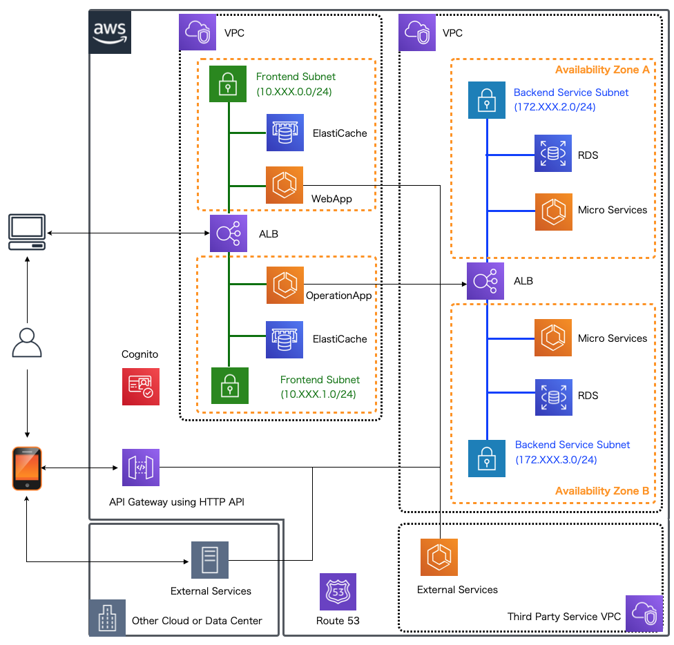

.. include:: ../module.txt

.. _section-aws-microservice-architecture-label:

【第2回】本連載でモデルとするマイクロサービスアーキテクチャ
------------------------------------------------------------------

|br|

前回はマイクロサービスアーキテクチャのメリットや導入で課題になりがちな検討項目、
マイクロサービスアプリケーションを構築するにあたって、AWSがサポートする主なサービスを紹介しました。

今回からは、本連載のテーマであるAWS上でマイクロサービスアプリケーションを構築するための具体的なアーキテクチャの概要と、
そのアーキテクチャを実現する上で、難しいハードルのひとつである認証／認可処理の全体像や考え方を解説していきます。

前回も説明した通り、近年ではWebアプリケーション、モバイル、運用端末といったマルチクライアントに加え、サードパーティ製のサービスに利用されることを想定し、
ビジネスロジックを切り出してAPI化し、マイクロサービス化を検討するケースが増えつつあります。例えば、「オープンAPI」に端を発し、金融業界で標準仕様策定が進められている「オープンバンキング」や「FAPI(Financial-grade API)」に則ったAPIの公開や、
政府を中心としたパブリックセクターでも、公共データを営利目的・非営利目的を問わず、二次利用可能なルールの下で、機械判読に適した形で、無償で公開する「オープンデータ」の取組を推進しており、これをREST APIとして公開することも並行して進められています。
エンタープライズ分野でも有益なデータをもつ企業が、社内外向けに様々な目的でAPIを公開している事例も多くなってきましたが、
既存システムで稼働しているアプリケーションをAPI化して不特定多数のユーザやサービスに公開する場合、リクエスト量に応じてスケールアウト・縮退する機能を有するクラウドが有力な選択肢としてあがります。

|br|

|br|

図のアーキテクチャでは、アプリケーションや他の外部サービスから呼び出すビジネスロジックを切り出してマイクロサービスとしてAPI化して、バックエンドとなるプライベートサブネットに、API化したマイクロサービスをスケーラブルなコンテナアプリケーションとして配置し、
保護が必要なデータベースアクセスなどもそのコンテナアプリケーション内で行います。バックエンドAPIの呼び出しはインターナルなALBを経由して行い、フロントエンドとなるパブリックサブネットに配置した
各種Webアプリケーション・運用のためのアプリケーションや、他のVPC、オンプレミスや他クラウドで動くサードパーティ製のサービスからアクセスできるように構成します。
なお、スマートフォンやタブレットで動くネイティブアプリケーション(またはシングルページアーキテクチャ:SPAアプリケーション)向けにはAPI Gatewayを経由して、バックエンドのAPIに直接アクセスできるように構成することもできます。
本連載では、上記のアーキテクチャに基づき、AWSのサービスを組み合わせてアプリケーションを構成・実装していく方法を紹介していきます。

このような構成をとる場合、同時にAPIを、厳格なセキュリティのもとで適切な権限に応じてアクセスさせる仕組みが必要になります。APIとして切り出されたマイクロサービスを適切に保護し、第３者を含めて公開するためには、
OIDC(Open ID Connect)やOAuth2.0などの標準化されたセキュリティ仕様を準拠したミドルウェアやサービスを組み込んだアーキテクチャで構成する必要があります。

|br|

OIDC／OAuth2.0
^^^^^^^^^^^^^^^^^^^^^^^^^^^^^^^^^^^^^^^^^^^^^^^^^^^^^^^^^^^^^^

|br|

OIDC(1.0)やOAuth2.0は各々が単体で１冊の本が書けてしまう程、内容が深く重要なセキュリティに関する仕様です。
これらはRFC(Request for Comments:インターネット関連の標準技術)として、複数の仕様文書から構成されています。先にOAuth2.0について解説を行いますが、
詳細まで踏み込むと本連載の趣旨から大きく外れてしまうため、適宜ポイントを抜粋しながら解説します。詳細については
`TERASOLUNAのガイドライン 9.9 OAuth <http://terasolunaorg.github.io/guideline/5.6.0.RELEASE/ja/Security/OAuth.html>`_
等である程度体系的にまとめられているので、必要に応じて参照してください。

OAuth2.0とは、あるアプリケーションの一部の処理をWebサービスとして公開するときに、不特定多数のクライアントやサードパーティサービス(第３者製のアプリケーション)が、
そのサービスを適切な権限に応じて利用できるようにするためのセキュリティ仕様(認可)です。
具体的に言えば、正当に認証されたクライアントに対し、アクセスする対象のWebサービスやアクセス元の情報、権限の情報をまとめたアクセストークンを発行し、
ターゲットとなるWebサービスでトークンを解析して、安全にWebサービスを利用するセキュリティ仕様になります。通常アプリケーションで実装されるフォーム認証・認可処理等と比較して、
サードパーティ製のアプリケーションに対して、ユーザの認証情報を渡すことなく、権限に応じた処理の実行の許可を与える(認可)点が特徴です。
OAuth2.0では、それを実現するために４つのロールを定義して、認可処理フローを仕様化しています。

|br|

.. list-table:: OAuth2.0におけるロール
   :widths: 2, 8

   * - ロール
     - 詳細

   * - リソースオーナー
     - 保護されたリソースへのアクセスを許可するロール。人（エンドユーザ）など。

   * - リソースサーバ
     - 保護されたリソースを提供するサーバ。

   * - 認可サーバ
     - リソースオーナの認証と、アクセストークン（クライアントがリソースサーバにアクセスするときに必要な情報）の発行を行うサーバ。

   * - クライアント
     - リソースオーナの認可を得て、リソースオーナの代理として保護されたリソースに対してリクエストを行うロール。Webアプリケーションやサードパーティサービスなど。クライアント情報は事前に認可サーバに登録され、認可サーバ内で一意な情報であるクライアントIDにより管理される。

|br|

OAuth2.0ではクライアントのタイプ(Webサービスを利用したいアプリケーションの種別)に応じて、グラントタイプというカテゴリーで4分類し、各々のタイプでアクセストークンの発行手法を仕様としてまとめていますが、
特別な理由がない限り、主に「認可コードグラント」というタイプの手法を使ってアクセストークンを扱うことが一般的です。他の手法は用途に応じて適切に利用しないとセキュリティホールになりえます。

OIDCはOAuth2.0の拡張としてまとめられた認証及びそのフローに関する仕様になります。リソースオーナーがID、パスワード等を用いて自身の認証を行った後、
クライアントとなるアプリケーションに自身の情報(ユーザークレイム：UserClaim)をまとめたIDトークンを発行する仕様です。
OAuth2.0と同様、認証・認可サーバがもつ認可エンドポイントやトークンエンドポイントに、同様のフローでリクエストを送信することでアクセストークンとIDトークンを同時に取得できます。

前節で掲載したアーキテクチャ図にOAuth2.0やOIDCのロールを当てはめると、以下のようになります。ロールとなり得る対象に、種別ごとに分けて赤い丸でA〜Fをマッピングしています。

|br|

.. figure:: img/architecture/microservice-oauth.png

|br|

.. list-table:: OAuth2.0におけるロールとその対象のマッピング
   :widths: 1, 2, 7

   * - 対象
     - 種別
     - 説明

   * - A
     - リソースオーナー
     - リソースオーナーはWebアプリケーションやモバイルアプリケーションを利用するユーザです。各アプリケーションで認証を行い、そのアプリケーションに対して適切な許可を与える(選択する)ことを実施します。

   * - B
     - リソースサーバ
     - ビジネスロジックを切り出してAPI化してバックエンドで実行されているマイクロサービスをリソースサーバとして扱います。リソースサーバはクライアントからアクセストークンを受け取って正当性を検証し、権限に応じてリソース(要求されたデータ)を返却する処理を実行します。

   * - C
     - 認可サーバ
     - OAuth2.0の認可サーバとしてAmazon Cognitoを利用します。Cognitoについては次回以降詳細に解説しますが、ユーザの認証・認可サーバでもあり、IDトークン、アクセストークンの発行を行います。
       なお、CognitoはOIDCに完全に準拠した認証プロバイダではないため、トークンの無効化や動的クライアント機能など、必要な要件を満たすために別のOIDC準拠のプロバイダと連携する必要があります。

   * - D
     - クライアント
     - クライアントの代表例として、Webアプリケーションがあります。リソースオーナーがブラウザを介し利用するWebサービスアプリケーションであったり、運用を行うアプリケーション等、Cからアクセストークンを受け取って、Bへアクセスします。

   * - E
     - クライアント
     - スマートフォンやタブレットなどで実行されるネイティブなアプリケーションもクライアントとなり得ます。ネイティブアプリケーションの中には別のアプリケーションを利用している中で、サードパーティ製サービスとして、同じデータにアクセスするケースもあるかもしません。

   * - F
     - クライアント
     - 同じAWS内で実行しているか、他のクラウドで動いているか、いずれにせよサードパーティ製のサービスもRoute53 Resolver等の機能を用いて、クライアントとしてCからアクセストークンを受け取り、Bにアクセスします。

|br|

複数のクライアントが登場しますが、認証・認可サーバとしてAmazon Cognitoを利用した場合、いずれも概ね以下のような認可コードグラントフローで、クライアントがIDトークンやアクセストークンを取得するアーキテクチャにすることができます。
詳細は次回以降順次解説を進めていきますが、認証処理をはじめ、マイクロサービスからデータを取得するまでの全体的な処理の流れを理解しておくことが重要です。

|br|

.. figure:: img/architecture/granted-code-flow.png

|br|

リソースオーナーから一度クライアントが正当に認証・認可されれば、発行されたアクセストークンを用いて、点線の枠内でマイクロサービスに継続的にアクセスするかたちとなります。
アクセストークンの有効期限はデフォルトでは1時間程度に設定されており、有効期限が切れるとリフレッシュトークンを使って、最新のアクセストークンを認可サーバから再び入手するかたちで実装しておきます。

|br|

.. note:: スマートフォンやタブレットでもブラウザを介してWebアプリケーションにアクセスすることも当然ありますが、Eでは主にネイティブアプリケーションを想定しており、
   ネイティブアプリケーションのユーザーエージェントとしてはWebViewを使用することを前提としています。また、SPAアプリケーション等、ブラウザでJavaScriptを用いる場合はインプリシットフローを用いて直接アクセストークンを受ける実装にするケースもあります。

.. note:: EのネイティブアプリケーションなどのクライアントではリソースサーバへAPI Gatewayを通じてアクセスします。ここではクライアントに付与されるIDトークンを用いてAPI Gatewayで認証処理を実行した後に、リソースサーバでアクセストークンの検証を行います。
   詳細は次回以降、API Gateway HTTP APIの構築を行う手順で解説します。

.. note:: なお、クライアントの処理がユーザエージェント側で実行されるものは認可コードグラントフローでも認可コードが不当に奪取されることがないよう、コードチャレンジなどの値を付与するなど実装面で気を付ける必要があります(RFC7636:PKCE)。

|br|

今回は、本連載でAWS上に構成、実装していくアーキテクチャと認証・認可の全体像や考え方を解説しました。次回以降は、実際にアプリケーションを実装するためのベースとなる環境を構築していきます。

|br|

著者紹介
------------------------------------------------------------------

川畑 光平(KAWABATA Kohei) - NTTデータ

.. figure:: img/overview/aws_361383_075.jpeg

金融機関システム業務アプリケーション開発・システム基盤担当、ソフトウェア開発自動化関連の研究開発を経て、デジタル技術関連の研究開発・推進に従事。

Red Hat Certified Engineer、Pivotal Certified Spring Professional、AWS Certified Solutions Architect Professional等の資格を持ち、アプリケーション基盤・クラウドなど様々な開発プロジェクト支援にも携わる。

`AWS Top Engineers & Ambassadors <https://aws.amazon.com/jp/partners/ambassadors/?cards-body.sort-by=item.additionalFields.ambassadorName&cards-body.sort-order=asc&cards-body.q=kawabata&cards-body.q_operator=AND>`_ 選出。

本連載記事の内容に対するご意見・ご質問は `Facebook <https://www.facebook.com/kohei.kawabata.5>`_ まで。
