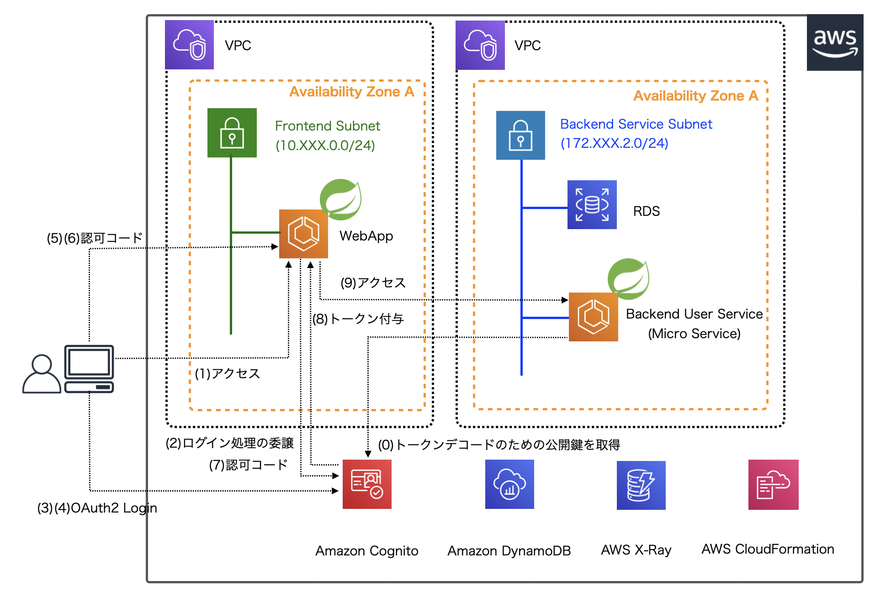

.. include:: ../module.txt

.. _section-aws-microservice-cognito-oauth2-login-4-label:

【第15回】Amazon Cognito + Spring Sercurityを使ったOAuth2 Loginの実装(4)
===============================================================================================

|br|

前回から、以下のイメージのようにOAuth2 Loginをベースとしたアーキテクチャを想定した環境構築を進めています。

|br|

|br|

前回は、AWSコンソール上から、OAuth2 Loginに必要なアプリクライアントの設定を行い、IDプールを構築しました。
今回からは前回までにマネジメントコンソールで手動設定した内容をAWS CloudFormationを使って構築します。なお、CloudFormationを使って環境構築するメリットのひとつに、
アプリケーションからCloudFormationで構築したリソースの情報をスタック経由で参照できる点にあります。
こちらは連載 `「AWSで実践！基盤構築・デプロイ自動化第34回」 <https://news.mynavi.jp/itsearch/article/devsoft/4948>`_ でも詳しく解説しています。
今後OAuth2 Loginアプリケーションを作成する際には、CloudFormationのスタック情報を参照するように実装していきますので、その点、踏まえた上で、
今回からのCloudFormationによる環境構築の解説を読み進めていただければと思います。

なお、実際のソースコードは `GitHub <https://github.com/debugroom/mynavi-sample-aws-microservice/tree/feature_4_cognito-oauth2-login>`_ 上にコミットしています。以降のソースコードでは本質的でない記述を一部省略しているので、実行コードを作成する場合は、必要に応じて適宜GitHub上のソースコードも参照してください。

CloudFormationを使ったCognitoユーザプール、IDプールの構築
----------------------------------------------------------------------------------

|br|

前回までに作成した環境をCloudFormationを使って構築します。なお、このテンプレートは `第7回 <https://news.mynavi.jp/itsearch/article/devsoft/5186>`_
などで構築した環境を前提として追加で実装したものです。そのため、事前に `こちら <https://github.com/debugroom/mynavi-sample-aws-microservice/tree/feature_3-xray/cloudformation>`_
の環境が作成されていることを前提に解説を進めます。CloudFormationテンプレートは以下の通りです。

|br|

.. sourcecode:: none

   AWSTemplateFormatVersion: '2010-09-09'

   # omit

   Parameters:
     # omit
     EnvType:                                                               #(A)
       Description: Which environments to deploy your service.
       Type: String
       AllowedValues: ["Dev", "Staging", "Production"]
       Default: Dev

    Conditions:                                                             #(B)
      ProductionResources: {"Fn::Equals" : [{"Ref":"EnvType"}, "Production"]}
      StagingResources: !Equals [ !Ref EnvType, "Staging"]
      DevResources: {"Fn::Equals" : [{"Ref":"EnvType"}, "Dev"]}

    Resources:
      MynaviSampleUserPool:                                                 #(C)
        Type: AWS::Cognito::UserPool
        Properties:
          UserPoolName: !If ["ProductionResources", "mynavi-sample-microservice-userpool",  !If ["StagingResources", "staging_mynavi-sample-microservice-userpool", "dev_mynavi-sample-microservice-userpool"]]
                                                                            #(D)
          AliasAttributes:
            - email
          UsernameConfiguration:
            CaseSensitive: false
          Policies:
            PasswordPolicy:
              MinimumLength: 6
              RequireLowercase: true
              RequireNumbers: false
              RequireSymbols: false
              RequireUppercase: false
          Schema:
            - Name: family_name
              AttributeDataType: String
              Mutable: true
              Required: true
            - Name: given_name
              AttributeDataType: String
              Mutable: true
              Required: true
            - Name: loginId
              AttributeDataType: String
              Mutable: false
              Required: false
            - Name: isAdmin
              AttributeDataType: Number
              Mutable: true
              Required: false
              NumberAttributeConstraints:
                MinValue: "0"
                MaxValue: "2"

     # omit

     MynaviBackendAppClient:                                                #(E)
       Type: AWS::Cognito::UserPoolClient
       Properties:
         ClientName: !If ["ProductionResources", "mynavi-sample-microservice-backend-app",  !If ["StagingResources", "staging_mynavi-sample-microservice-backend-app", "dev_mynavi-sample-microservice-backend-app"]]
         GenerateSecret: true
         RefreshTokenValidity: 30
         UserPoolId : !Ref MynaviSampleUserPool
         CallbackURLs:
           - !If ["ProductionResources", "https://xxxx/login/oauth2/code/cognito",  !If ["StagingResources", "https://xxxx/login/oauth2/code/cofnito", "http://localhost:8080/frontend/login/oauth2/code/cognito"]]
         LogoutURLs:
           - !If ["ProductionResources", "https://xxxx/",  !If ["StagingResources", "https://xxxx/", "http://localhost:8080/frontend"]]
         AllowedOAuthFlows:
           - code
         AllowedOAuthScopes:
           - openid
           - aws.cognito.signin.user.admin
           - profile
         AllowedOAuthFlowsUserPoolClient: true
         SupportedIdentityProviders:
           - COGNITO
         ExplicitAuthFlows:
           - ALLOW_ADMIN_USER_PASSWORD_AUTH
           - ALLOW_REFRESH_TOKEN_AUTH

     MynaviSampleUserPoolDomain:                                            #(F)
       Type: AWS::Cognito::UserPoolDomain
       Properties:
         Domain: debugroom-mynavi-sample-microservice
         UserPoolId: !Ref MynaviSampleUserPool

     MynaviSampleIdentityPool:                                              #(G)
       Type: AWS::Cognito::IdentityPool
       Properties:
         IdentityPoolName:  !If ["ProductionResources", "mynavi-sample-microservice-idpool",  !If ["StagingResources", "staging_mynavi-sample-microservice-idpool", "dev_mynavi-sample-microservice-idpool"]]
         AllowUnauthenticatedIdentities: false
         CognitoIdentityProviders:
           - ClientId:
               Ref: MynaviBackendAppClient
             ProviderName:
               Fn::Join:                                                    #(H)
                 - ""
                 - - "cognito-idp."
                   - !Sub ${AWS::Region}
                   - ".amazonaws.com/"
                   - !Ref MynaviSampleUserPool

     MynaviSampleUnauthenticatedPolicy:                                     #(I)
       Type: AWS::IAM::ManagedPolicy
       Properties:
         PolicyDocument:
           Version: "2012-10-17"
           Statement:
             - Effect: Allow
               Action:
                 - mobileanalytics:PutEvents
                 - cognito-sync:*
               Resource:
                 - "*"

     MynaviSampleUnauthenticatedRole:                                       #(J)
       Type: AWS::IAM::Role
       Properties:
         AssumeRolePolicyDocument:
           Version: "2012-10-17"
           Statement:
             - Effect: Allow
               Action: "sts:AssumeRoleWithWebIdentity"
               Principal:
                 Federated: cognito-identity.amazonaws.com
               Condition:
                 StringEquals:
                   "cognito-identity.amazonaws.com:aud": !Ref MynaviSampleIdentityPool
                 ForAnyValue:StringLike:
                   "cognito-identity.amazonaws.com:amr": unauthenticated
         ManagedPolicyArns:
           - !Ref MynaviSampleUnauthenticatedPolicy

     MynaviSampleAuthenticatedPolicy:                                       #(K)
       Type: AWS::IAM::ManagedPolicy
       Properties:
         PolicyDocument:
           Version: "2012-10-17"
           Statement:
             - Effect: Allow
               Action:
                 - mobileanalytics:PutEvents
                 - cognito-sync:*
                 - cognito-identity:*
               Resource:
                 - "*"

     MynaviSampleAuthenticatedRole:                                         #(L)
       Type: AWS::IAM::Role
       Properties:
         AssumeRolePolicyDocument:
           Version: "2012-10-17"
           Statement:
             - Effect: Allow
               Action: "sts:AssumeRoleWithWebIdentity"
         Principal:
           Federated: cognito-identity.amazonaws.com
         Condition:
           StringEquals:
             "cognito-identity.amazonaws.com:aud": !Ref MynaviSampleIdentityPool
           ForAnyValue:StringLike:
             "cognito-identity.amazonaws.com:amr": authenticated
       ManagedPolicyArns:
         - !Ref MynaviSampleAuthenticatedPolicy

     RoleAttachment:                                                        #(M)
       Type: AWS::Cognito::IdentityPoolRoleAttachment
       Properties:
         IdentityPoolId: !Ref MynaviSampleIdentityPool
         Roles:
           unauthenticated : !GetAtt MynaviSampleUnauthenticatedRole.Arn
           authenticated: !GetAtt MynaviSampleAuthenticatedRole.Arn

   Outputs:
     MynaviSampleUserPool:                                                  #(O)
       Description: UserPool ID
       Value: !Ref MynaviSampleUserPool
       Export:
         Name: !Sub ${VPCName}-Cognito-${EnvType}-UserPool

    # omit

     MynaviSampleBackendAppClientID:                                        #(P)
       Description: BackendApp Client
       Value: !Ref MynaviBackendAppClient
       Export:
         Name: !Sub ${VPCName}-Cognito-${EnvType}-AppClientId

     MynaviSampleRedirectUri:                                               #(Q)
       Description: RedirectUri
       Value: !If ["ProductionResources", "https://xxxx/login/oauth2/code/cognito",  !If ["StagingResources", "https://xxxx/login/oauth2/code/cofnito", "http://localhost:8080/frontend/login/oauth2/code/cognito"]]
       Export:
         Name: !Sub ${VPCName}-Cognito-${EnvType}-RedirectUri

     MynaviSampleJwkSetUri:                                                 #(R)
       Description: jwk-set-uri
       Value:
         Fn::Join:
           - ""
           - - "https://cognito-idp."
             - !Sub ${AWS::Region}
             - ".amazonaws.com/"
             - !Ref MynaviSampleUserPool
             - "/.well-known/jwks.json"
       Export:
         Name: !Sub ${VPCName}-Cognito-${EnvType}-JwkSetUri

     MynaviSampleUserPoolDomain:                                            #(S)
       Description: User Pool Domain
       Value:
         Fn::Join:
           - ""
           - - "https://"
             - !Ref MynaviSampleUserPoolDomain
             - ".auth."
             - !Sub ${AWS::Region}
             - ".amazoncognito.com"
       Export:
         Name: !Sub ${VPCName}-Cognito-${EnvType}-UserPoolDomain

以下の設定内容に従って、アプリクライアントの設定を行います。

|br|

.. list-table::
   :widths: 1, 9

   * - 項番
     - 説明

   * - A
     - 環境をパラメータとして指定します。パラメータの値に応じて、名称やドメインURLなど切り替えるために使用します。

   * - B
     - Aで指定したパラメータを用いてConditions要素で切り替えます。Conditionsの使用方法については、 `「AWSで実践！基盤構築・デプロイ自動化第29回」 <https://news.mynavi.jp/itsearch/article/devsoft/4869>`_ も参考にしてください。

   * - C
     - ユーザプールを定義します。各プロパティの詳細は `AWS::Cognito::UserPool <https://docs.aws.amazon.com/ja_jp/AWSCloudFormation/latest/UserGuide/aws-resource-cognito-userpool.html>`_ も参考にしてください。設定内容は `第13回 <https://news.mynavi.jp/itsearch/article/devsoft/5319>`_ と同様になるようにしています。

   * - D
     - Bで定義したConditionsを使ってユーザプール名を環境ごとに切り替えて作成するようにします。

   * - E
     - アプリクライアントを定義します。各プロパティの詳細は `AWS::Cognito::UserPoolClient <https://docs.aws.amazon.com/ja_jp/AWSCloudFormation/latest/UserGuide/aws-resource-cognito-userpoolclient.html>`_ も参考にしてください。設定内容は `第14回 <https://news.mynavi.jp/itsearch/article/devsoft/5368>`_ と同様になるようにしています。

   * - F
     - ユーザプールのドメインを定義します。各プロパティの詳細は `AWS::Cognito::UserPoolDomain <https://docs.aws.amazon.com/ja_jp/AWSCloudFormation/latest/UserGuide/aws-resource-cognito-userpooldomain.html>`_ も参考にしてください。設定内容は 第14回と同様になるようにしています。

   * - G
     - IDプールのドメインを定義します。各プロパティの詳細は `AWS::Cognito::IdentityPool <https://docs.aws.amazon.com/ja_jp/AWSCloudFormation/latest/UserGuide/aws-resource-cognito-identitypool.html>`_ も参考にしてください。設定内容は 第14回と同様になるようにしています。

   * - H
     - プロバイダ名をJOIN関数を使用して生成します。

   * - I
     - IDプールに設定する非認証ユーザのポリシーを定義します。各プロパティの詳細は、`AWS::IAM::ManagedPolicy <https://docs.aws.amazon.com/ja_jp/AWSCloudFormation/latest/UserGuide/aws-resource-iam-managedpolicy.html>`_ も参考にしてください。設定内容は 第14回で作成されるものと同様になるようにしています。

   * - J
     - IDプールに設定する非認証ユーザのロールを定義します。各プロパティの詳細は、`AWS::IAM::Role <https://docs.aws.amazon.com/ja_jp/AWSCloudFormation/latest/UserGuide/aws-resource-iam-role.html>`_ も参考にしてください。設定内容は 第14回で作成されるものと同様になるようにしています。

   * - K
     - IDプールに設定する認証ユーザのポリシーを定義します。各プロパティの詳細は、`AWS::IAM::ManagedPolicy <https://docs.aws.amazon.com/ja_jp/AWSCloudFormation/latest/UserGuide/aws-resource-iam-managedpolicy.html>`_ も参考にしてください。設定内容は 第14回で作成されるものと同様になるようにしています。

   * - L
     - IDプールに設定する認証ユーザのロールを定義します。各プロパティの詳細は、`AWS::IAM::Role <https://docs.aws.amazon.com/ja_jp/AWSCloudFormation/latest/UserGuide/aws-resource-iam-role.html>`_ も参考にしてください。設定内容は 第14回で作成されるものと同様になるようにしています。

   * - M
     - IDプールに設定するロールアタッチメントを定義します。各プロパティの詳細は、`AWS::Cognito::IdentityPoolRoleAttachment <https://docs.aws.amazon.com/ja_jp/AWSCloudFormation/latest/UserGuide/aws-resource-cognito-identitypoolroleattachment.html>`_ も参考にしてください。J、Lで作成したロールをアタッチします。

   * - O
     - 今後解説するOAuth2 Loginアプリケーション実装でスタック情報経由で参照するため、ユーザプールIDを出力します。

   * - P
     - 今後解説するOAuth2 Loginアプリケーション実装でスタック情報経由で参照するため、アプリクライアントIDを出力します。

   * - Q
     - 今後解説するOAuth2 Loginアプリケーション実装でスタック情報経由で参照するため、OAuth2ログイン後のリダイレクトURLを出力します。

   * - R
     - 今後解説するOAuth2 Loginアプリケーション実装でスタック情報経由で参照するため、CognitoユーザプールのJWK:JSON Web Key(公開鍵)のURLを出力します。

   * - S
     - 今後解説するOAuth2 Loginアプリケーション実装でスタック情報経由で参照するため、ユーザプールのドメインを出力します。

|br|

.. note:: CloudFormationのOutputでは、実装アプリケーションに必要なアプリクライアントのクライアントシークレット値を出力することはできません。
   そのため、アプリケーションの実装では、Systems Manager Parameter Store経由でクライアントシークレットを取得する実装にするものとします。
   次回、SDKを使って、構築したアプリクライアントからクライアントシークレットを取得し、Parameter StoreにセットするLambda関数を作成し、
   CloudFormationのカスタムリソースとして実行する方法を紹介します。

|br|

今回は、OAuth2 Loginを行う場合の、CognitoのCloudFormationテンプレートを解説しました。
次回以降は、OAuth2 Loginアプリケーションを実装する前に、構築したCognitoの初期化として、ユーザプールへユーザを追加したり、
構築したアプリクライアントからクライアントシークレットをParameter Storeへ設定するLambda関数を実装し、
CloudFormationのカスタムリソースとして実行する方法を解説していきます。

|br|

著者紹介
------------------------------------------------------------------

川畑 光平(KAWABATA Kohei) - NTTデータ エグゼクティブ ITスペシャリスト ソフトウェアアーキテクト・デジタルテクノロジーストラテジスト(クラウド)

.. figure:: img/overview/aws_361383_075.jpeg

金融機関システム業務アプリケーション開発・システム基盤担当、ソフトウェア開発自動化関連の研究開発を経て、デジタル技術関連の研究開発・推進に従事。

Red Hat Certified Engineer、Pivotal Certified Spring Professional、AWS Certified Solutions Architect Professional等の資格を持ち、アプリケーション基盤・クラウドなど様々な開発プロジェクト支援にも携わる。

`AWS Top Engineers & Ambassadors <https://aws.amazon.com/jp/partners/ambassadors/?cards-body.sort-by=item.additionalFields.ambassadorName&cards-body.sort-order=asc&cards-body.q=kawabata&cards-body.q_operator=AND>`_ 選出。

本連載記事の内容に対するご意見・ご質問は `Facebook <https://www.facebook.com/kohei.kawabata.5>`_ まで。
