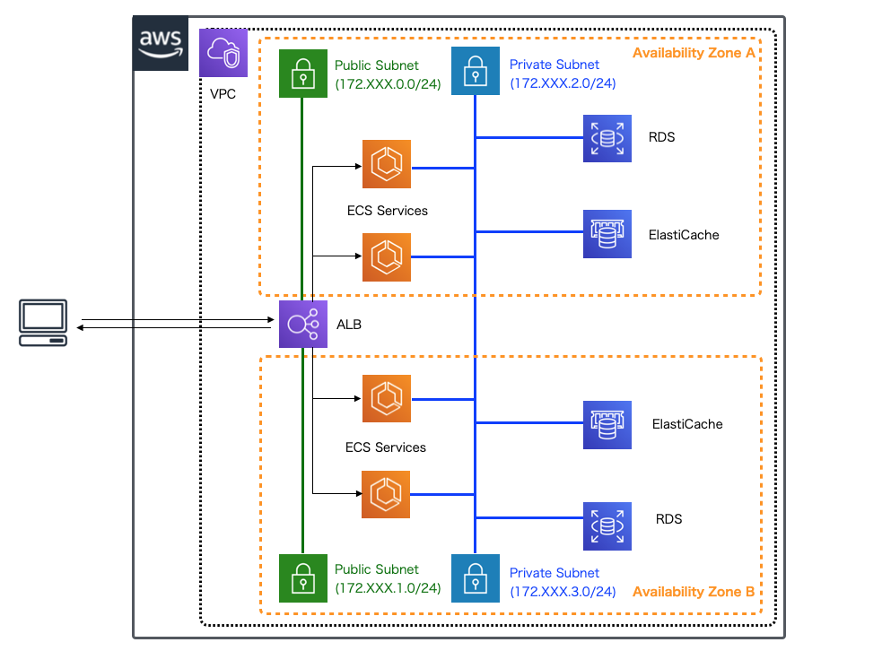

.. include:: ../module.txt

.. _section-aws-microservice-overview-label:

AWSで作るマイクロサービスアプリケーション
==================================================================

第1回 マイクロサービスアーキテクチャで目指すもの
------------------------------------------------------------------

|br|

2014年にJames LewisとMartin Flowlerが提唱したマイクロサービスですが、一時はバズワードと呼べるほどトレンド化し、
特にクラウドでのデフォルトのアーキテクチャスタイルに位置付ける程に、キャッチコピーとして雑誌・記事やアナリストレポートに登場しています。
近年では政府のシステム入札案件の要件としても見かけるようになってきました。筆者の連載、「 `AWSで実践！基盤構築・デプロイ自動化第一回 <https://news.mynavi.jp/itsearch/article/devsoft/4379>`_ 」の中でも、
マイクロサービスアプリケーションの特徴について触れていますが、ただ、提唱された当初と比べて、少し目指している目的が広がってきています。

従来、マイクロサービスでは、下記の図のような構成によって、以下に示すようなメリットが得られるアーキテクチャを目指してきました。

* 開発チームごとに分担した各サービスの疎結合性／独立性が向上し、開発のアジリティが向上する
* 使用頻度の高い特定の機能を、サービス単位でスケールできるため、アプリケーションパフォーマンスが向上する
* 独立したサービスの集合でアプリケーションが構成されるため、特定のサービスが障害などで機能不全に陥ってもシステム全体が機能不全に陥ることはなく可用性が向上する

|br|

|br|

近年では下記の図のように、Webアプリケーション、モバイル、運用端末といったマルチクライアントに加え、サードパーティサービスに利用されることを想定し、
ビジネスロジックを切り出してAPI化し、マイクロサービスアーキテクチャを検討する動きも目立ちつつあります。

|br|

.. figure:: img/overview/microservice.png

|br|

.. note:: サードパーティサービスとの連携に関して、こうした様々なサービスを組み合わせて、あらたな付加価値をつける試みは、SOA(Service Oriented Architecture)やマッシュアップなどマイクロサービスが提唱される以前からありましたが、
   サービス連携時の複雑なセキュリティ対策や多数のクライアントが接続するための拡張性に難があり、広く普及させるために障害となる多くの問題を抱えていました。近年このような潮流が再び巻き起こっているのは
   クラウド化によりスケーラビリティが容易に図れるようになったことやOAuth2、OIDCなどの標準化されたセキュリティ技術の普及により、技術的なハードルが下がってきたことが背景にあります。

|br|

一方で、このようなマイクロサービスアーキテクチャでのアプリケーションを構築するのは容易ではありません。サービス分離によるトランザクションの分割・通信エラーの発生や、データベースが分離された構成での一貫性担保の問題、
揮発性のあるサーバ環境での永続化処理の実行、各サービス自体のスケーラビリティの確保、様々なクライアントから実行される場合の認証・認可といったセキュリティ対策などアプリケーション実装も相応に複雑になります。
例えば、元々モノリシックだったWebアプリケーションのドメインロジックを分離して、上記の図のようにBackend Service APIとして切り出した場合、以下のようなアーキテクチャ上の検討課題がでてきます。

|br|

.. list-table:: アプリケーションアーキテクチャの検討課題
   :widths: 2, 8

   * - 課題
     - 詳細

   * - サービス実行フロー制御
     - 処理のオーケストレーション・コレオグラフィといったサービス実行フロー制御、エラーハンドリング方式

   * - トランザクション管理
     - 複数の更新系Backend Serviceを実行する場合の業務トランザクションのロールバックや補償トランザクション

   * - ステートフル共有データストア
     - アプリケーションにスケーラビリティを持たせることを目的とした、ステートフル(状態)データを共有するためのデータストアの利用や、データストア障害に伴うフェイルオーバー発生時のエラーハンドリング

   * - サービスディスカバリ方式
     - サービスが動的にスケールアウト・縮退する場合のBackend Service APIのサービスディスカバリ

   * - サービス間通信方式
     - Backend Service APIを呼び出す場合の同期・非同期の使い分け、リトライ・サーキットブレイカー処理

   * - サービス認証・認可方式
     - OIDC、OAuth2.0に準拠した、JWTを使ったアクセストークンの連携方式

   * - ロギング・モニタリング方式
     - アプリケーション・サービスを跨いでトレーサビリティを確保するためのロギング、各サービスごとのモニタリング

   * - Backend Serviceステートレス化・冪等生
     - スケールアウトを容易にする、Backend Serviceのステートレス化を前提としたREST準拠API規約・ルール(HTTPステータスコード等)、耐障害性向上のための冪等性をもつ処理実装

   * - マネージドサービス連携
     - 揮発性であるコンテナ・サーバレス環境下で、データ永続化のためのマネージドストレージやキューを利用する場合の方式

   * - マルチクライアントにおけるサービス分割
     - Webアプリケーション以外にも、モバイルなどのSPAクライアント、サードパーティサービス連携がある場合のサービス分割・ビジネスロジックの分離方針

|br|

そのような中で、AWSではマイクロサービスアーキテクチャベースのアプリケーション構築をサポートする以下のサービスが提供されています。

|br|

.. list-table:: マイクロサービスアプリケーション構築する場合によく利用するサービス
   :widths: 2, 8

   * - サービス
     - 説明

   * - Elastic Load Balancing
     - Classic Load Balancer、Application LoadBalancer、Network LoadBalancerで構成されるサービス。詳細は 「 `AWSで作るクラウドネイティブアプリケーションの基本第5回 <https://news.mynavi.jp/itsearch/article/devsoft/4359>`_ 」を参照して下さい。
       ALBでは、各コンテナにデプロイされたマイクロサービスのIP・ポートを意識せずにパスベースでルーティングを行うことができます。

   * - Route53
     - 通常のDNSサービスに加えて、ECS上にデプロイしたマイクロサービスの `サービスレジストリ・ディスカバリ機能 <https://aws.amazon.com/jp/blogs/news/amazon-ecs-service-discovery/>`_ や
       オンプレミスや別のデータセンタからのルーティングなどの `リゾルバ機能 <https://docs.aws.amazon.com/ja_jp/Route53/latest/DeveloperGuide/resolver.html>`_ があります。

   * - Amazon ECS
     - マイクロサービスアプリケーションがデプロイされたDockerコンテナを実行するコンテナオーケストレーションサービスです。
       コンテナの死活監視やオートスケーリングなどを実行します。詳細は 「 `AWSで作るクラウドネイティブアプリケーションの基本第4回 <https://news.mynavi.jp/itsearch/article/devsoft/4354>`_ 」を参照して下さい

   * - Amazon EKS
     - マイクロサービスアプリケーションがデプロイされたコンテナを実行する、オープンソースのコンテナオーケストレーションツールKuberntesのマネージドサービスです。機能的にはECSと同等です。

   * - Amazon ElastiCache
     - 複数のマイクロサービスアプリケーションのデータ共有のためのキャッシュストレージとして利用できるサービスです。詳細は 「 `AWSで作るクラウドネイティブアプリケーションの基本第19回 <https://news.mynavi.jp/itsearch/article/devsoft/4523>`_ 」を参照して下さい

   * - Amazon API Gateway
     - マイクロサービスアプリケーションのAPIゲートウェイとして利用できるサービスです。REST APIの定義やデプロイ、サービスへのHTTPリクエスト・レスポンス変換などを実行します。
       詳細は 「 `AWSで作るクラウドネイティブアプリケーションの基本第3回 <https://news.mynavi.jp/itsearch/article/devsoft/4321>`_ 」を参照して下さい

   * - AWS Lambda
     - サーバレスでマイクロサービスアプリケーションの実行が可能なサービスです。詳細は 「 `AWSで作るクラウドネイティブアプリケーションの基本第2回 <https://news.mynavi.jp/itsearch/article/devsoft/4318>`_ 」を参照して下さい

   * - AWS Cognito
     - 認証・認可サービスです。外部の認証Providerとの連携や、IAMロールに応じたAWSリソースへのアクセス制御、マルチデバイス間でデータ同期する機能などもあります。

   * - Cloud Map
     - クラウドリソースのDNSサービスです。IPアドレスが割り当てられているEC2やRDSなどのAWSリソースに加え、LambdaやDynamoDB、SQSといったARNが割り当てられたリソースに対しても名前解決が可能です。

   * - App Mesh
     - オープンソースのサービスメッシュプロキシEnvoyのマネージドサービスです。サービス間の通信、監視、ログやメトリクス出力などを実行できます。

   * - X Ray
     - マイクロサービスアプリケーションを分析することができるサービスです。サービス実行時間の計測やトレース、フィルタリングによる可視化などが行えます。

   * - Amazon SQS
     - マネージドキューサービスです。マイクロサービス間の非同期メッセージ連携などで利用します。詳細は 「 `AWSで作るクラウドネイティブアプリケーションの基本第28回 <https://news.mynavi.jp/itsearch/article/devsoft/4656>`_ 」を参照して下さい

   * - Amazon SNS
     - Publish/Subscribe型のメッセージ配信サービスです。複数のマイクロサービスへメッセージを連携する場合などで利用します。詳細は 「 `AWSで実践！基盤構築・デプロイ自動化第18回 <https://news.mynavi.jp/itsearch/article/devsoft/4682>`_ 」を参照して下さい

   * - Amazon MSK (Managed Streaming for Apache Kafka)
     - オープンソースのメッセージキューミドルウェアであるApache Kafkaのマネージドサービスです。非同期メッセージ連携などで利用します。Kafkaではデータの流量制御等きめ細やかな設定が可能です。

   * - Amazon MQ
     - マイクロサービス間の非同期メッセージ連携などで利用します。メッセージの到達保証を担保したい場合に利用します。

|br|

ただし、当然これらがのサービスがマイクロサービスアーキテクチャにおける課題を全てカバーしてくれるわけではありません。
必要に応じて、様々なオープンソースのプロダクトを組み合わせながらアプリケーションを構成・実装していく必要があります。
本連載では、AWSのマネージドサービスを駆使しながら、マイクロサービスのメリットを最大限享受できる、SpringBootをベースとしたアプリケーションアーキテクチャの実装例を紹介していきます。
(いまだこの分野の技術は栄枯盛衰が激しく、各プロダクトの機能追加や新たなサービスの登場によりベストプラクティスは変わっていくので、AWSクラウド上での実装例のひとつとして捉えていただくと良いと思います)

|br|

次回以降は、マイクロサービスアプリケーションを構築していく上で、難しいハードルの一つである認証・認可処理をどのように実現していくか全体像を解説します。

|br|

著者紹介
------------------------------------------------------------------

川畑 光平(KAWABATA Kohei) - NTTデータ

.. figure:: img/overview/aws_361383_075.jpeg

金融機関システム業務アプリケーション開発・システム基盤担当、ソフトウェア開発自動化関連の研究開発を経て、デジタル技術関連の研究開発・推進に従事。

Red Hat Certified Engineer、Pivotal Certified Spring Professional、AWS Certified Solutions Architect Professional等の資格を持ち、アプリケーション基盤・クラウドなど様々な開発プロジェクト支援にも携わる。

`AWS Top Engineers & Ambassadors <https://aws.amazon.com/jp/partners/ambassadors/?cards-body.sort-by=item.additionalFields.ambassadorName&cards-body.sort-order=asc&cards-body.q=kawabata&cards-body.q_operator=AND>`_ 選出。

本連載記事の内容に対するご意見・ご質問は `Facebook <https://www.facebook.com/kohei.kawabata.5>`_ まで。
