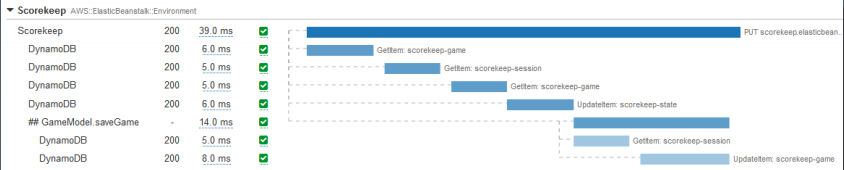
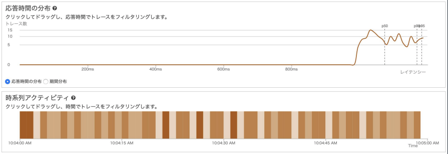
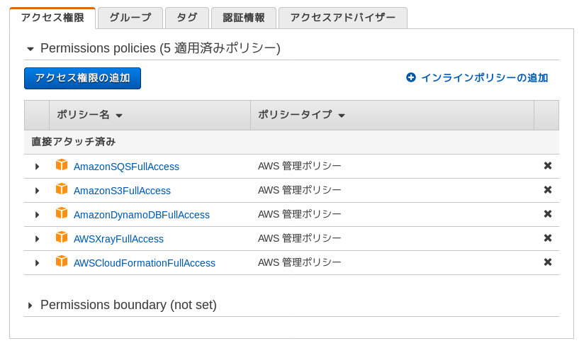

.. include:: ../module.txt

.. _section-aws-microservice-xray-1-label:

【第8回】AWS X-Rayを用いたマイクロサービスの可視化(1)
====================================================================

|br|

本連載では、以下に示すようなマイクロサービスアーキテクチャのアプリケーション環境を構築しています。

|br|

.. figure:: img/webapp/service-architecture.png

|br|

前回までにバックエンドのマイクロサービスからユーザの情報を取得して、フロントエンドのWebアプリケーションで認証・認可を行う処理を実装しました。
このようにリクエストの呼び出しが複数のアプリケーション、マイクロサービスに跨がって多段に及ぶ場合は通信時の問題が生じる可能性があるため、呼び出し状況の可視化が重要になります。
具体的な問題としては、サービス呼び出しのレスポンスタイム遅延やエラー発生状況、その際のリクエスト呼び出し状況のトレーシング・ログの可視化です。今回以降は、
AWS X-Rayを用いて、マイクロサービスの呼び出し状況の可視化を行い、リクエストの呼び出し結果をDynamoDBに保存するようにアプリケーションを修正してみましょう。

|br|

AWS X-Rayの概要
------------------------------------------------------------------

|br|

AWS X-Rayはアプリケーションのメトリクス収集・可視化・分析ができるサービスです。
アプリケーション内に処理開始・終了時間などのメトリクスを収集する環境を設定し、以下のイメージ図のように、
別のアプリケーションサービスやS3やRDS、DynamoDB、SQSといったAWSリソースの呼び出し状況を可視化することができます。

|br|

.. figure:: img/xray/xray-servicemap.png
   :align: center

   AWS X-Rayのサービスマップ

|br|

X-Rayは呼び出し関係やリクエスト処理の成功・失敗状況を可視化できる上述のサービスマップ、
アプリケーションの処理状況をセグメント・サブセグメントと呼ばれる単位で実行時間を詳細化して可視化できるトレースリスト、
応答時間の分布や期間分布を解析するアナリティクスツールの３種類の機能があります。

|br|

   AWS X-Rayのトレースリスト

|br|

   AWS X-Rayのアナリティクスツール

|br|

X-Rayではメトリクス収集のためのSDKライブラリが様々な言語で提供されており、JavaやNode.js、Python、#C、Ruby、Go言語で利用可能です。
アプリケーションの処理の中でX-RayのSDKライブラリのAPIを呼び出すことでトレースデータを収集し、
アプリケーションを実行しているサーバやコンテナ環境で動くX-Rayデーモンが定期的にAWS側へデータ送信します。
X-Rayデーモンの実行環境はEC2やECSをはじめ、AppMesh、AWS Lambda、API Gatewayなど様々なAWSリソースでサポートされています。
収集したデータはCloudWatchとも統合されているので実行ログを細かく手動で解析することも可能です。

|br|

ローカル環境で動かすAWS X-Rayの環境設定
------------------------------------------------------------------

|br|

では、実際にX-Rayを使ってアプリケーションのメトリクスを収集できる環境を構築していきましょう。
まず、ローカルの端末でX-Rayの実行環境を構築してみます。

本連載で実際に作成するアプリケーションでは `GitHub <https://github.com/debugroom/mynavi-sample-aws-microservice/tree/feature_3-xray>`_ 上にコミットしています。
以降に記載するソースコードでは、本質的でない記述を省略している部分があるので、実行コードを作成する際は、必要に応じて適宜GitHubにあるソースコードも参照してください。

前節でも解説した通り、X-Rayを実行するにはメトリクス情報を送信するためのX-Rayデーモンの実行及び、アプリケーションからSDKのライブラリを呼び出してトレースデータを収集する必要があります。
X-Rayデーモンは `AWS公式サイトのページ 「AWS X-Ray デーモン」 <https://docs.aws.amazon.com/ja_jp/xray/latest/devguide/xray-daemon.html>`_ に従って、ダウンロード、インストールすればよいですが、
本連載では、`Docker コンテナで X-Ray デーモンを実行する <https://docs.aws.amazon.com/ja_jp/xray/latest/devguide/xray-daemon-local.html>`_ に記載の手順と同様、
ローカル端末にインストールされたDocker上で、X-Rayデーモンが実行されたAmazonLinuxマシンイメージを実行してみます。

なお、事前にDockerのインストール(本連載では主題から外れるので割愛します)、AWSコンソールのIAMメニューでアプリケーション用のユーザを作成して、 `AWS公式ページ「設定ファイルと認証情報ファイル」 <https://docs.aws.amazon.com/ja_jp/cli/latest/userguide/cli-configure-files.html>`_ を参考に
ユーザホームフォルダに.awsディレクトリを作成し、credentialというファイル名で、CSV形式の認証キーに記載しているユーザ認証情報を、以下の形式で保存してください。

|br|

.. sourcecode:: bash

   [default]
   aws_access_key_id=XXXXXXXXXXXXXXXX
   aws_secret_access_key=YYYYYYYYYYYYYYYYYYYYYYYYYYYYY

|br|

また、上記のクレデンシャルをもつユーザはX-Rayへの接続権限を持つ必要があります。以下のように、AWSコンソールで「IAM」サービスメニューから、ユーザにX-Rayのアクセス権限を付与しておいてください。

|br|

|br|

それでは、デーモン実行環境の構築に進みます。Dockerがインストールされた端末で、以下のようなDockerfileを作成します。

.. sourcecode:: bash
   :caption: common/src/main/docker/xray-daemon/Dockerfile

   FROM amazonlinux
   RUN yum install -y unzip
   RUN curl -o daemon.zip https://s3.us-east-2.amazonaws.com/aws-xray-assets.us-east-2/xray-daemon/aws-xray-daemon-linux-3.x.zip
   RUN unzip daemon.zip && cp xray /usr/bin/xray
   ENTRYPOINT ["/usr/bin/xray", "-t", "0.0.0.0:2000", "-b", "0.0.0.0:2000"]
   EXPOSE 2000/udp
   EXPOSE 2000/tcp

|br|

作成したら、Dockerイメージをビルドして実行します。実行する際は、vオプションを使って、ローカル端末にある~/.aws配下のクレデンシャル情報をDockerイメージ内の/root/.awsへマウントするように設定し、
リージョン情報を環境変数で設定、2000番ポートをオープンして、Dockerイメージを実行します。以下の通り、プロキシが立ち上がればOKです。

|br|

.. sourcecode:: bash

   $ docker build -t test/xray-daemon common/src/main/docker/xray-daemon

   // omit

   $ docker run --attach STDOUT -v ~/.aws/:/root/.aws/ --net=host -e AWS_REGION=ap-northeast-1 --name xray-daemon -p 2000:2000/udp test/xray-daemon:latest -o

   WARNING: Published ports are discarded when using host network mode
   2020-09-05T23:08:58Z [Info] Initializing AWS X-Ray daemon 3.2.0
   2020-09-05T23:08:58Z [Info] Using buffer memory limit of 160 MB
   2020-09-05T23:08:58Z [Info] 2560 segment buffers allocated
   2020-09-05T23:08:58Z [Info] Using region: ap-northeast-1
   2020-09-05T23:08:58Z [Info] HTTP Proxy server using X-Ray Endpoint : https://xray.ap-northeast-1.amazonaws.com
   2020-09-05T23:08:58Z [Info] Starting proxy http server on 0.0.0.0:2000

|br|

今回はAWS X-Rayの概要を説明し、実行に必要なX-RayデーモンのDockerイメージを作成し実行しました。次回はX-Rayのトレースデータを収集するための設定を実装していきます。

|br|

著者紹介
------------------------------------------------------------------

川畑 光平(KAWABATA Kohei) - NTTデータ

.. figure:: img/overview/aws_361383_075.jpeg

金融機関システム業務アプリケーション開発・システム基盤担当、ソフトウェア開発自動化関連の研究開発を経て、デジタル技術関連の研究開発・推進に従事。

Red Hat Certified Engineer、Pivotal Certified Spring Professional、AWS Certified Solutions Architect Professional等の資格を持ち、アプリケーション基盤・クラウドなど様々な開発プロジェクト支援にも携わる。

`AWS Top Engineers & Ambassadors <https://aws.amazon.com/jp/partners/ambassadors/?cards-body.sort-by=item.additionalFields.ambassadorName&cards-body.sort-order=asc&cards-body.q=kawabata&cards-body.q_operator=AND>`_ 選出。

本連載記事の内容に対するご意見・ご質問は `Facebook <https://www.facebook.com/kohei.kawabata.5>`_ まで。
