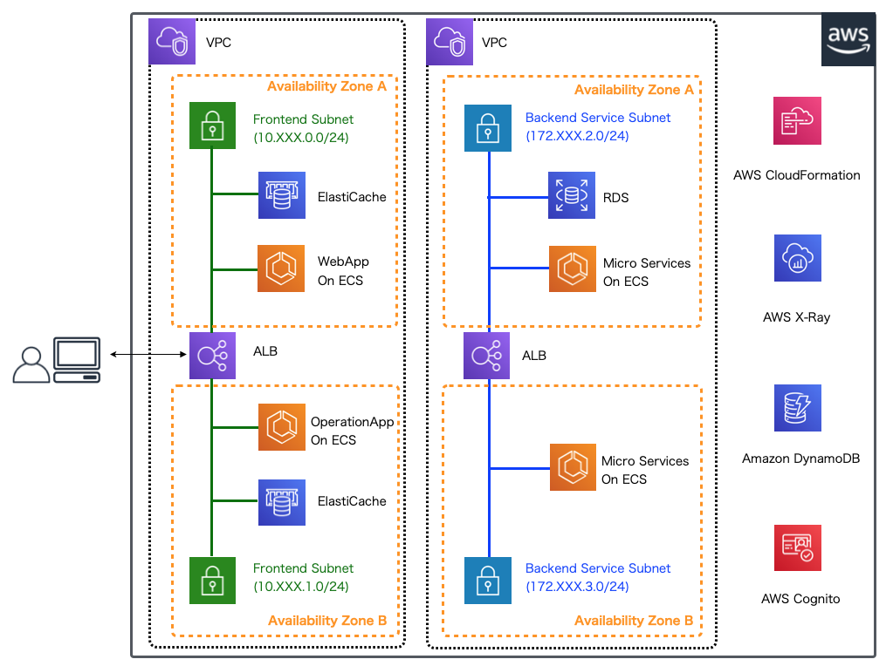
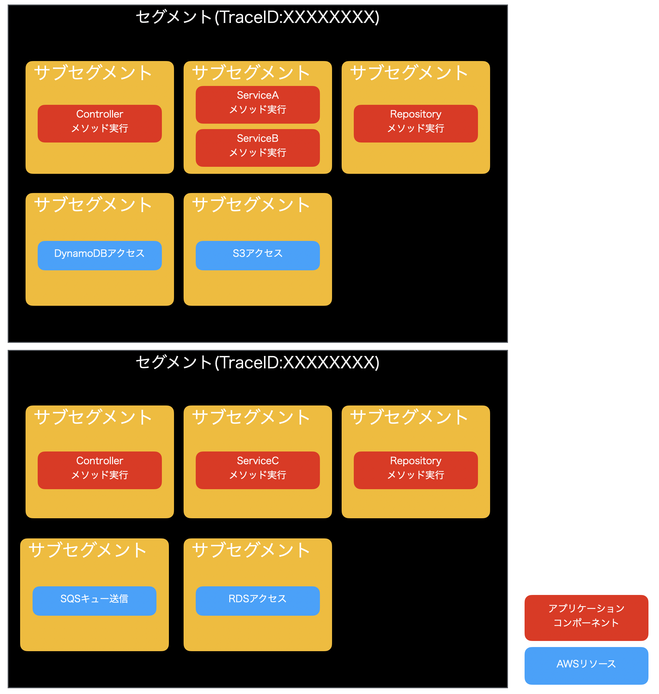
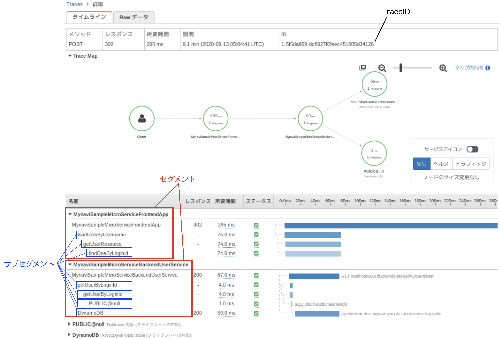

.. include:: ../module.txt

.. _section-aws-microservice-xray-2-label:

【第9回】AWS X-Rayを用いたマイクロサービスの可視化(2)
====================================================================

|br|

本連載では、以下に示すようなマイクロサービスアーキテクチャのアプリケーション環境を構築しています。

|br|

|br|

前回はマイクロサービスの呼び出し状況の可視化を行うAWSのサービスとしてX-Rayの概要を説明し、
ローカル端末へX-Rayデーモンを実行するDockerコンテナイメージの作成、実行を行いました。
今回からはX-Rayデーモンへトレースデータを送信するためのアプリケーションの設定の実装を解説していきます。

|br|

セグメントとサブセグメント
------------------------------------------------------------------

|br|

AWS X-Rayの使用を始める前に、十分理解しておかなければならない概念としてセグメントとサブセグメントがあります。
計測対象とするアプリケーションの処理単位をセグメントと呼び、セグメントはいくつかのサブセグメントに分けることができます。

|br|

   AWS X-Rayのセグメントとサブセグメントの概念

|br|

セグメントはTraceIDによって識別されます。アプリケーションが複数のマイクロサービスを呼び出した時にTraceIDをリクエストヘッダに指定しておけば、
TraceIDを持ち回り、複数のセグメントの呼び出しを透過的にトレースすることができるようになります。
サブセグメントはユーザがアプリケーションのコンポーネント構成に応じて自由に設定することができます( `カスタムサブセグメント <https://docs.aws.amazon.com/ja_jp/xray/latest/devguide/xray-sdk-java-subsegments.html>`_ )。
サブセグメントの設定は、Apache HttpCompoentsやSpringAOPを拡張したライブラリとしてAWS SDKから組み込まれて提供されているものもあれば、上記のカスタムサブセグメントのようにライブラリをコールして任意のタイミングで開始することも可能です。
なお、S3やDynamoDB、SQSといった主要なAWSリソースへのサブセグメントの設定は各クライアントライブラリの設定でトレースを有効化できます。

|br|

   AWS X-Rayのトレース

|br|

これらの設定方法は次節以降、順次説明していきますが、必要に応じて、AWS公式ドキュメント `AWS X-Rayの概念 <https://docs.aws.amazon.com/ja_jp/xray/latest/devguide/xray-concepts.html>`_ も適宜参照するようにしてください。

|br|

X-Rayを使用するためのアプリケーション共通設定
------------------------------------------------------------------

|br|

それでは、X-Rayを使用するためのアプリケーションの設定を実装していきましょう。
本連載で実際に作成するアプリケーションでは `GitHub <https://github.com/debugroom/mynavi-sample-aws-microservice/tree/feature_3-xray>`_ 上にコミットしています。
以降に記載するソースコードでは、import文など本質的でない記述を省略している部分があるので、実行コードを作成する際は、必要に応じて適宜GitHubにあるソースコードも参照してください。

なお、動作環境は以下のバージョンで実施しています。JavaやSpringのバージョンは前回から同じものを利用するので変わっていませんが、新たにX-Ray SDKを追加します。
SDKに関するAWS公式の日本語ドキュメントは2020年9月現在では最新ではないため、英語にはなりますが、`SDKのGitHubのREADME <https://github.com/aws/aws-xray-sdk-java>`_ を参照した方が良いでしょう(提供されているライブラリの種類が変更されていて日本語ページのものとは一致しません)。

|br|

.. list-table::
   :widths: 5, 5

   * - 動作対象
     - バージョン

   * - Java
     - 11

   * - Spring Boot
     - 2.3.3.RELEASE

   * - AWS XRay Recorder SDK
     - 2.7.1

|br|

まず、使用するライブラリを以下の通り、pom.xmlに追加します。X-Ray利用の基本的なものとして、aws-xray-recorder-sdk-core、aws-xray-recorder-sdk-aws-sdk、aws-xray-recorder-sdk-aws-sdk-instrumentorを追加して下さい。
また、RDBへアクセスするためのDataSourceに対してサブセグメントのトレースを設定するaws-xray-recorder-sdk-sqlと、任意のSpringアプリケーションのコンポーネントにAOPを使ってサブセグメントトレースを設定する
aws-xray-recorder-sdk-springを追加します。Dependencyタグ内でバージョンを指定していませんが、代わりにDependencyManagementタグ内にaws-xray-recorder-sdk-bomを設定していますので、こちらの設定も忘れないように注意してください。

また、今回の実装では、X-Rayの機能とは別に、処理結果を独自でDynamoDBにトレースログとして保存する処理を実装するので、連載「AWSで作るクラウドネイティブアプリケーションの基本」
`第17回 <https://news.mynavi.jp/itsearch/article/cloud/4506>`_ と同様、DynamoDBのライブラリを追加します。DynamoDBのリージョンやエンドポイントなどの
設定はCloudFormationをベースとした基盤自動化により構築されたCloudFormationスタック情報やSystems Manager Parameter Storeから取得するので、AWS SDKのaws-java-sdk-ssm、aws-java-sdk-coreも必要になります。
なお、CloudFormationのスタック情報からデータを取得する実装の詳細は 連載「AWSで実践！基盤構築・デプロイ自動化」の `第34回 <https://news.mynavi.jp/itsearch/article/devsoft/4948>`_ も適宜参考にしてください。
最後に文字列処理のライブラリとしてcommons-lang3を含めておきます(StringUtilsを使用します)。

|br|

.. sourcecode:: xml
   :caption: pom.xml

   <!-- For X-Ray -->
   <dependency>
       <groupId>com.amazonaws</groupId>
       <artifactId>aws-xray-recorder-sdk-core</artifactId>
   </dependency>
   <dependency>
       <groupId>com.amazonaws</groupId>
       <artifactId>aws-xray-recorder-sdk-apache-http</artifactId>
   </dependency>
   <dependency>
       <groupId>com.amazonaws</groupId>
       <artifactId>aws-xray-recorder-sdk-aws-sdk</artifactId>
   </dependency>
   <dependency>
       <groupId>com.amazonaws</groupId>
       <artifactId>aws-xray-recorder-sdk-aws-sdk-instrumentor</artifactId>
   </dependency>
   <dependency>
       <groupId>com.amazonaws</groupId>
       <artifactId>aws-xray-recorder-sdk-sql</artifactId>
   </dependency>
   <dependency>
       <groupId>com.amazonaws</groupId>
       <artifactId>aws-xray-recorder-sdk-spring</artifactId>
   </dependency>
   <!-- For Setting Spring Data DynamoDB -->
   <dependency>
       <groupId>io.github.boostchicken</groupId>
       <artifactId>spring-data-dynamodb</artifactId>
       <version>5.2.1</version>
   </dependency>
   <!-- For Setting AWS Systems Manager Parameter Store -->
   <dependency>
       <groupId>com.amazonaws</groupId>
       <artifactId>aws-java-sdk-ssm</artifactId>
       <version>1.11.756</version>
   </dependency>
   <dependency>
       <groupId>com.amazonaws</groupId>
       <artifactId>aws-java-sdk-core</artifactId>
       <version>1.11.756</version>
   </dependency>
   <!-- For Utility -->
   <dependency>
       <groupId>org.apache.commons</groupId>
       <artifactId>commons-lang3</artifactId>
   </dependency>

   <dependencyManagement>
       <dependencies>
           <!-- omit -->
           <dependency>
               <groupId>com.amazonaws</groupId>
               <artifactId>aws-xray-recorder-sdk-bom</artifactId>
               <version>2.7.1</version>
               <type>pom</type>
               <scope>import</scope>
           </dependency>
       </dependencies>
   </dependencyManagement>

|br|

.. note:: なお、dependencyManagementタグに設定しているbomとはライブラリのバージョンを一括して定義するためにライブラリの提供元が公開しているMavenのペアレントpom.xmlを総称した呼び方です。

|br|

それでは、アプリケーションの設定を解説します。次回以降、フロントエンドのWebアプリケーションとバックエンドのマイクロサービス双方の設定の解説を行いますが、まず共通する設定要素を解説します。
これらの設定は各アプリケーションの設定クラスXRayConfigにまとめています(内容は２つともほぼ同等です)。フロントエンドのWebアプリケーションのXRayConfigを例に解説します。

|br|

.. sourcecode:: java
   :caption: frontend-webapp/src/main/java/org/debugroom/mynavi/sample/aws/microservice/frontend/webapp/config/XRayConfig.java

   package org.debugroom.mynavi.sample.aws.microservice.frontend.webapp.config;

   import java.io.IOException;

   import com.amazonaws.client.builder.AwsClientBuilder;
   import com.amazonaws.services.dynamodbv2.AmazonDynamoDB;
   import com.amazonaws.services.dynamodbv2.AmazonDynamoDBAsyncClientBuilder;
   import com.amazonaws.xray.AWSXRay;
   import com.amazonaws.xray.AWSXRayRecorderBuilder;
   import com.amazonaws.xray.handlers.TracingHandler;
   import com.amazonaws.xray.javax.servlet.AWSXRayServletFilter;
   import com.amazonaws.xray.spring.aop.AbstractXRayInterceptor;
   import com.amazonaws.xray.strategy.sampling.LocalizedSamplingStrategy;

   import org.aspectj.lang.annotation.Aspect;
   import org.aspectj.lang.annotation.Pointcut;
   import org.springframework.beans.factory.annotation.Autowired;
   import org.springframework.boot.context.event.ApplicationReadyEvent;
   import org.springframework.boot.web.servlet.FilterRegistrationBean;
   import org.springframework.context.annotation.Bean;
   import org.springframework.context.annotation.Configuration;
   import org.springframework.context.annotation.EnableAspectJAutoProxy;
   import org.springframework.context.event.EventListener;
   import org.springframework.core.Ordered;
   import org.springframework.util.ResourceUtils;

   import org.debugroom.mynavi.sample.aws.microservice.common.apinfra.cloud.aws.CloudFormationStackResolver;

   @Aspect                                                                              //(A)
   @Configuration
   @EnableAspectJAutoProxy                                                              //(B)
   public class XRayConfig extends AbstractXRayInterceptor {                            //(C)

       private static final String DYNAMODB_ENDPOINT_EXPORT = "mynavi-sample-microservice-vpc-DynamoDB-Dev-ServiceEndpoint";
       private static final String DYNAMODB_REGION_EXPORT = "mynavi-sample-microservice-vpc-DynamoDB-Dev-Region";
                                                                                        //(D)
       @Autowired
       CloudFormationStackResolver cloudFormationStackResolver;                         //(E)

       static {
           try{
               AWSXRayRecorderBuilder builder = AWSXRayRecorderBuilder.standard()
                    .withSamplingStrategy(new LocalizedSamplingStrategy(
                            ResourceUtils.getURL("classpath:sampling-rules.json")));    //(F)
               AWSXRay.setGlobalRecorder(builder.build());                              //(G)
           }catch (IOException e){
               e.printStackTrace();
           }
       }

       @Bean
       public AWSXRayServletFilter awsXrayServletFitler(){                              //(H)
           return new AWSXRayServletFilter("MynaviSampleMicroServiceFrontendApp");
       }

       @Bean
       public FilterRegistrationBean filterRegistrationBean(){                          //(I)
           FilterRegistrationBean filterRegistrationBean = new FilterRegistrationBean(awsXrayServletFitler());
           filterRegistrationBean.setOrder(Ordered.HIGHEST_PRECEDENCE);                 //(J)
           return filterRegistrationBean;
       }

       @Bean
       AmazonDynamoDB amazonDynamoDB(){                                                 //(K)
           return AmazonDynamoDBAsyncClientBuilder.standard()
                .withEndpointConfiguration(
                        new AwsClientBuilder.EndpointConfiguration(
                                cloudFormationStackResolver.getExportValue(DYNAMODB_ENDPOINT_EXPORT),
                                cloudFormationStackResolver.getExportValue(DYNAMODB_REGION_EXPORT)))
                .withRequestHandlers(new TracingHandler(AWSXRay.getGlobalRecorder()))   //(L)
                .build();
       }

       @Override
       @Pointcut("@within(com.amazonaws.xray.spring.aop.XRayEnabled) " +
            " && execution(* org.debugroom.mynavi.sample.aws.microservice..*.*(..))" )  //(M)
       protected void xrayEnabledClasses() {
       }

       @EventListener(ApplicationReadyEvent.class)                                      //(N)
       public void onStartup(){
           AWSXRay.endSegment();                                                        //(O)
       }

   }

|br|

XRayConfigクラスコードの説明は以下の通りです。

|br|

.. list-table:: XRayConfigクラスコードの説明
   :widths: 1, 19

   * - 項番
     - 説明

   * - (A)
     - SpringAOPの機能を利用して、このクラスをアスペクト機能をもつコンポーネントとして定義します。実際の機能利用箇所は(M)にあるPointCutで定義したコンポーネントおよび(C)で継承しているAbstractXRayInspectorになります。

   * - (B)
     - SpringAOPの機能を利用するクラスとして宣言を行います。これはSpringAOPを利用する際に必要な設定です。

   * - (C)
     - com.amazonaws.xray.spring.aop.AbstractXRayInterceptorを継承します。このクラスはSpringAOPを用いてサブセグメントの開始終了処理を担うインターセプターとなっており、(M)でジョインポイントを定義することにより、任意の条件でサブセグメントを開始してトレースデータを収集できるようになっています。

   * - (D)
     - DynamoDBのエンドポイントとリージョンをCloudFormationのスタック情報から取得するのでエクスポート名を定義します。

   * - (D)
     - CloudFormationのスタック情報を取得するためのユーティリティクラスをインジェクションします。詳細は連載「AWSで実践！基盤構築・デプロイ自動化」の `第34回 <https://news.mynavi.jp/itsearch/article/devsoft/4948>`_ を適宜参考にしてください。

   * - (F)
     - XRayデーモンにトレースデータを送信するためのAWSXRayRecorderの設定を行います。トレースをサンプリングするためのルールをsampling-rules.jsonとして定義し、src/main/resources配下に配置したファイルをResourceUtilsを使って読み込んで設定します。
       なお、この設定はクラス変数としてstatic要素内で定義されていますが、内部でスレッドローカル内にTraceIDをMDCを使って保護する仕組みになっており、マルチスレッド環境で動くWebアプリケーションでも正常に動作する仕様になっています。

   * - (G)
     - (F)で設定したAWSXrayRecorderをAWSXRayクラスの変数としてセットします。

   * - (H)
     - リクエストにTraceIDをセットするためのサーブレットフィルタの設定を行います。インスタンス生成時に指定した文字列がマネジメントコンソール上でのサービス名として定義されます。

   * - (I)
     - (H)で定義したサーブレットフィルタを登録します。

   * - (J)
     - SpringSecurityと併用した際にも、先にTraceIDが付与されるようにフィルタ適用条件に高いプライオリティを設定します。この設定により認証などのSpringSecurityが請け負う処理もトレーシングされます。なお、バックエンドのマイクロサービスでは現状、OAuth2によるアクセストークンを使った認可処理は実装していないのでバックエンド側にはまだ設定していません。

   * - (K)
     - トレースログを保存するためのDynamoDB設定を定義します。

   * - (L)
     - DynamoDBへのアクセスのトレーシングを有効にする場合、リクエストハンドラにcom.amazonaws.xray.handlers.TracingHandlerを設定し、(F)で定義したAWSXRayRecorderを設定します。

   * - (M)
     - サブセグメントを開始終了するコンポーネントの定義条件を設定します。ここでは、com.amazonaws.xray.spring.aop.XRayEnabledアノテーションを付与した、org.debugroom.mynavi.sample.aws.microservice配下のパッケージにある全てのクラスのメソッド実行時を指定しています。

   * - (N)
     - アプリケーション起動時もCloudFormationスタックやSystems Manager Parameter Storeへアクセスするため、セグメントの設定が必要になります。SpringBootを起動する際のメインクラスでセグメントの開始を宣言していますが(後述)、SpringのEventListener機能を使って、アプリケーションの起動が終了した際にXRayのセグメントを終了する処理を実装します。

   * - (O)
     - (N)でも解説した通り、セグメントを終了する処理を実装します。

|br|

なお、アプリケーションの起動時にCloudFormationのスタック情報やSystems Manager Parameter Storeへアクセスする場合、
デフォルトの設定ではAWS X-RayがAWSリソースへのアクセスを記録しようとする(SpringのAutoConfigrationで設定されたAWS SDKクライアントがX-Rayデーモンへデータ送信する挙動になる)ため、
起動時にセグメントを開始するよう、メインクラスを以下の通り編集します(セグメントの終了処理は上記の(O)でアプリケーションの起動完了時に終了します)。

|br|

.. sourcecode:: java
   :caption: frontend-webapp/src/main/java/org/debugroom/mynavi/sample/aws/microservice/frontend/webapp/config/WebApp.java

   package org.debugroom.mynavi.sample.aws.microservice.frontend.webapp.config;

   import com.amazonaws.xray.AWSXRay;

   // omit

   @SpringBootApplication
   public class WebApp {

       public static void main(String[] args) {
           AWSXRay.beginSegment("frontend-webapp-init");
           SpringApplication.run(WebApp.class, args);
       }
       // omit
   }

|br|

また、今回の連載では、TraceIDの引き回しや取得方法を確認するために、各アプリケーション、マイクロサービスでリクエスト実行時にDynamoDBへトレースログを保存する処理を次回以降の連載で加えます。
AWS X-RayではデフォルトでCloudWatchと連携する機能があり、 `セグメントをメタデータとして任意のパラメータを追加して検索する <https://docs.aws.amazon.com/ja_jp/xray/latest/devguide/xray-sdk-java-segment.html>`_ こともできますが。
ログデータの永続化や任意のパラメータ検索の容易性を踏まえて、ログの保存要件に適したものを選択した方が良いでしょう。
今回は以下のように、ユーザIDと日時をキーとしたテーブルデータを作成するものとします。また、検索用にTraceIDをグローバルセカンダリインデックスとして作成しておきます。
モデルクラスやDynamoDB構築のCloudFormationテンプレートは共通プロジェクトに配置します。
過去の連載で解説は実施済みのため、DynamoDBの構築やアクセス実装の詳しい説明は省略しますが、必要に応じて 「クラウドネイティブの基本編」 `第17回 Spring Data DynamoDBを用いたアプリケーション <https://news.mynavi.jp/itsearch/article/cloud/4506>`_ や
「AWSで実践! 基盤構築・デプロイ自動化」の `第30回 DynamoDB構築自動化テンプート <https://news.mynavi.jp/itsearch/article/devsoft/4896>`_ 、`第34回 Backend Serviceアプリケーションにおけるスタック情報の取得／設定 <https://news.mynavi.jp/itsearch/article/devsoft/4948>`_ を参照してください。

|br|

.. sourcecode:: java
   :caption: common/src/main/java/org/debugroom/mynavi/sample/aws/microservice/common/apinfra/cloud/aws/log/dynamodb/model/Log.java

   package org.debugroom.mynavi.sample.aws.microservice.common.apinfra.cloud.aws.log.dynamodb.model;

   // omit

   @DynamoDBTable(tableName = "mynavi-sample-microservice-log-table")
   public class Log implements Serializable {

       @Id
       @Getter(AccessLevel.NONE)
       @Setter(AccessLevel.NONE)
       private LogKey logKey;

       private String userId;
       private String createdAt;

       @DynamoDBAttribute
       private String traceId;

       @DynamoDBHashKey
       public String getUserId() {
           return userId;
       }

       @DynamoDBRangeKey
       public String getCreatedAt() {
           return createdAt;
       }

   }

|br|

.. sourcecode:: none
   :caption: cloudformation/2-dynamodb-cfn.yml

   # omit

   Resources:
     MynaviSampleMicroserviceLogTable:
       Type: AWS::DynamoDB::Table
       Properties:
         TableName: !If ["ProductionResources", "mynavi-sample-microservice-log-table",  !If ["StagingResources", "staging_mynavi-sample-microservice-log-table", "dev_mynavi-sample-microservice-log-table"]]
         BillingMode: PROVISIONED
         SSESpecification: !If ["ProductionResources", { "SSEEnabled" : true }, !Ref "AWS::NoValue"]
         AttributeDefinitions:
           - AttributeName: userId
             AttributeType: S
           - AttributeName: createdAt
             AttributeType: S
           - AttributeName: traceId
             AttributeType: S
         KeySchema:
           - AttributeName: userId
             KeyType: HASH
           - AttributeName: createdAt
             KeyType: RANGE
         GlobalSecondaryIndexes:
           - IndexName: traceIdIndex
             KeySchema:
               - AttributeName: traceId
                 KeyType: HASH
               - AttributeName: createdAt
                 KeyType: RANGE
             Projection:
               ProjectionType: ALL
             ProvisionedThroughput:
               ReadCapacityUnits: 5
               WriteCapacityUnits: 5
         ProvisionedThroughput:
           ReadCapacityUnits: 5
           WriteCapacityUnits: 5

|br|

今回はAWS X-Rayのセグメント・サブセグメントの概念を解説し、フロントエンドのWebアプリケーション、バックエンドのマイクロサービス双方に共通する設定を紹介しました。次回はフロントエンドアプリケーションに必要なAWS X-Rayの設定について解説を進めていきます。

|br|

著者紹介
------------------------------------------------------------------

川畑 光平(KAWABATA Kohei) - NTTデータ

.. figure:: img/overview/aws_361383_075.jpeg

金融機関システム業務アプリケーション開発・システム基盤担当、ソフトウェア開発自動化関連の研究開発を経て、デジタル技術関連の研究開発・推進に従事。

Red Hat Certified Engineer、Pivotal Certified Spring Professional、AWS Certified Solutions Architect Professional等の資格を持ち、アプリケーション基盤・クラウドなど様々な開発プロジェクト支援にも携わる。

`AWS Top Engineers & Ambassadors <https://aws.amazon.com/jp/partners/ambassadors/?cards-body.sort-by=item.additionalFields.ambassadorName&cards-body.sort-order=asc&cards-body.q=kawabata&cards-body.q_operator=AND>`_ 選出。

本連載記事の内容に対するご意見・ご質問は `Facebook <https://www.facebook.com/kohei.kawabata.5>`_ まで。
